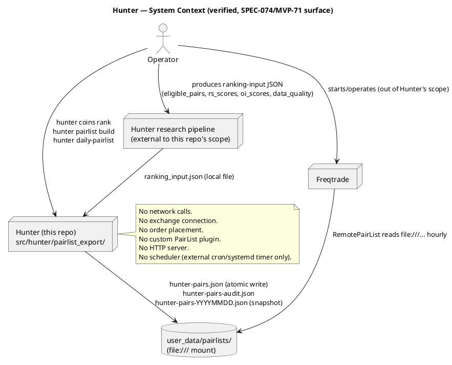
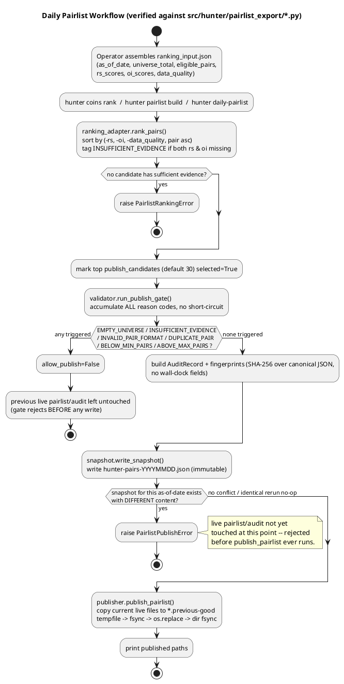
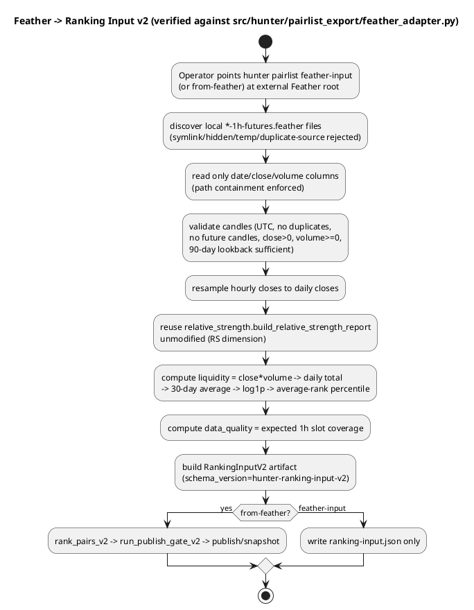
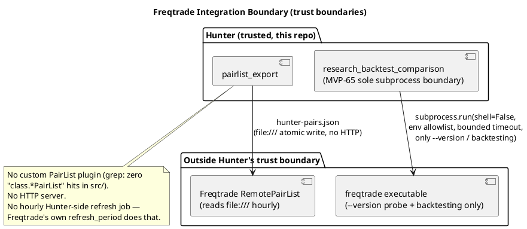

# System Architecture

> **Research only.** This document describes a research and pairlist-publishing tool. It does not authorize
> execution, production deployment, live trading, dry-run trading, automatic execution, strategy selection,
> universe selection, order placement, signal generation, strategy mutation, universe mutation, or position
> changes. Human review remains required.

Verified against source at commit `58aeb20` (branch `master`), version `0.72.0-dev`. Every claim below traces
to a specific file read, test run, or CLI invocation performed during this validation pass — see
`docs/technical/TESTING_GUIDE.md` for the exact commands.

## 1. Product Purpose

Hunter — in its current, shipped product surface — is a **coin-universe research, ranking, explanation, and
Freqtrade pairlist-publishing tool**. Concretely (SPEC-074 / MVP-71, `src/hunter/pairlist_export/`):

- reads locally supplied research inputs (eligible pairs, relative-strength scores, open-interest scores,
  data-quality percentages) as a JSON file — it does not fetch this data itself
- ranks eligible Binance USDT-M futures pairs deterministically
- applies a fail-closed publish gate
- publishes a native Freqtrade `RemotePairList` JSON artifact plus a separate machine-readable audit/explain
  artifact
- preserves immutable, dated daily snapshots for historical backtest replay
- produces local audit evidence — every considered pair, selected or rejected, with reason codes

Freqtrade consumes the published pairlist, applies its own native market filters (`AgeFilter`, `DelistFilter`,
`SpreadFilter`, ...), and owns all strategy, entry, exit, order, position, leverage, and execution behavior.
**Hunter does not become a trading engine.**

This boundary is codified in three independent, mutually consistent places, all verified during this pass:
`CLAUDE_SPEC-074_Guardrails.md` (repo root), `docs/research/pairlist_export.md`, and the
`PairlistExportSafetyFlags` frozen dataclass (`src/hunter/pairlist_export/models.py:88-115`), which raises
`ValueError` at construction time if any of `research_only`, `human_approval_required` is falsified or if any
of `execution_approval_granted` / `production_approval_granted` / `live_trading_allowed` /
`automatic_execution_allowed` is set `True`.

## 2. System Context

`ResearchPipeline` (the box that would compute `rs_scores`/`oi_scores` from live market data) is **not** part
of this validated surface: `pairlist_export.ranking_adapter.rank_pairs` consumes pre-computed score maps and
never imports `relative_strength`/`open_interest` engine internals (confirmed: zero internal imports in
`pairlist_export`, see §4). Producing the ranking-input JSON from those engines' own reports is a glue step
that does not yet exist as a CLI command — operators must currently assemble that JSON themselves (see
`docs/user/INPUT_FORMAT.md`).

## 3. Package Map and Component Responsibilities

`src/hunter/` contains 74 subpackages. Only a small slice implements the product described above; the rest is
prior-MVP research/audit infrastructure (MVP-0 through MVP-70) that predates SPEC-074 and is **not** part of
the pairlist-publishing product surface. This split is real, not a doc simplification — verified by dependency
grep (§4).

### 3.1 Current product surface (SPEC-074 / MVP-71 + SPEC-075)

| Package | Responsibility |
|---|---|
| `pairlist_export` | Ranking, publish gate, atomic writer, snapshots, audit, fingerprinting, deployment profiles, CLI. **SPEC-075 (MVP-72):** also includes a read-only Feather input adapter (`feather_adapter.py`) that converts local Freqtrade 1h-futures Feather files into a ranking-input v2 artifact. The adapter imports `hunter.relative_strength.engine`/`models` to reuse the existing RS engine unmodified — the only cross-package dependency in `pairlist_export`. |
| `core` (`core/cli.py`) | Console-script entry point (`hunter`). Dispatches `universe`/`coins`/`pairlist`/`daily-pairlist` tokens to `pairlist_export.cli`; everything else to `reporting_cli.cli`. |

### 3.2 Research computation (consumed as pre-existing reports, except `relative_strength` which is imported by the SPEC-075 Feather adapter)

| Package | Responsibility |
|---|---|
| `relative_strength` | RS scoring engine (MVP-24). Reused verbatim by `pairlist_export.feather_adapter` via a daily-close resampling bridge. |
| `open_interest` | OI/liquidity scoring engine (MVP-25). |
| `research_universe`, `research_market_data` | Universe and market-data ingestion/adapters (MVP-63/64). |

### 3.3 Freqtrade compatibility infrastructure (prior MVPs, distinct from the pairlist product)

| Package | Responsibility |
|---|---|
| `research_backtest_comparison` | **The sole subprocess boundary** (MVP-65 / SPEC-066) — invokes a real `freqtrade` executable for backtesting comparisons. See §6. |
| `freqtrade_bridge`, `freqtrade_shell`, `strategy_contract`, `strategy_contract_consumer`, `strategy_adapter`, `dry_run_strategy` | Local, dry-run-only Freqtrade-compatible adapters (MVP-5 through MVP-9). No live trading; verified clean of exchange/network clients (§4.4). |
| `freqtrade_universe_adapter` | Adapts controlled-universe output for Freqtrade consumption (MVP-55). |

### 3.4 Legacy / stale packages (unreferenced by any other `src/hunter` package)

Per `docs/MVP_INDEX.md`'s own "Legacy / utility packages" table, independently re-verified by grep during this
pass (zero hits for `hunter\.<name>\b` anywhere else in `src/hunter`):

`backtesting`, `engines`, `fitness`, `portfolio`, `reporting`. None has an `__init__.py` or docstring. Do not
confuse `backtesting` (legacy, orphaned) with `backtest` (no trailing "ing" — actively depended on by
`experiment_ledger`, `final_audit_pack`, `run_orchestrator`, `reporting_cli`).

`src/hunter/data/` (MVP-1, uses stdlib `sqlite3` for local kline/funding-rate caching) is also unreferenced by
any other `src/hunter` package or by `pairlist_export`/`reporting_cli` — orphaned relative to both CLI entry
points. Flagged as Informational in the findings report; not part of the active request path.

### 3.5 Prior-MVP research/audit/governance infrastructure (MVP-2 through MVP-70, out of scope for this product)

The remaining ~55 packages (`chronicle`, `research_bundle`, `human_review_*` (8 packages), `governance_*`,
`remediation_*`, `review*`, `cross_*_consistency`, `research_audit_*`, `execution`, `decision`,
`portfolio_risk_evaluator`, `controlled_universe*`, `run_orchestrator`, `research_campaign`,
`coin_discovery_pipeline`, etc.) implement a much larger prior "agent-first crypto futures research and
execution-control platform" documented in `docs/architecture/SYSTEM_OVERVIEW.md` and `docs/MVP_INDEX.md`.
These are real, tested (fully covered by the 10,334-test suite), and were explicitly safety-scanned during
this pass (§3.6) — but they are **not** exercised by, or reachable from, the `hunter` CLI's pairlist-publishing
path, and are out of scope for the user-facing documentation this validation produces. Architecture and
developer docs reference them only to establish this boundary, never as part of the "how to use Hunter"
narrative.

### 3.6 Execution-adjacent safety verification

Packages whose names could suggest execution capability — `execution`, `decision`, `dry_run_strategy`,
`portfolio_risk_evaluator`, `strategy_adapter`, `freqtrade_shell` — were specifically scanned for real
exchange/order-placement code. Result: **clean**. Zero hits for `ccxt|place_order|create_order|
binance.client|exchange.buy|exchange.sell`, zero `subprocess`/network-client imports. `portfolio_risk_evaluator`
and `freqtrade_shell` each carry an explicit docstring disclaiming Freqtrade runtime/exchange/database/
scheduler integration. String literals resembling forbidden terms (`"cron"`, `"websocket"`, etc.) that turned
up in a broad grep were traced to forbidden-keyword denylists used by the codebase's own content-scope
scanners (e.g. `run_orchestrator/models.py:263`, `final_audit_pack/models.py:213`) — not actual usage.

## 4. Dependency Rules

### 4.1 Verified DAG properties

A package-level import graph was built across all `src/hunter/*` packages (grep for `from hunter\.` / `import
hunter\.`). **No cycles were found** — every dependency chain, including the deepest
(`coin_discovery_pipeline → run_orchestrator → execution → decision/market_state`,
`research_universe → freqtrade_universe_adapter → strategy_contract → freqtrade_bridge → execution`),
terminates in a leaf package.

### 4.2 `pairlist_export` depends only on `relative_strength`

`pairlist_export` imports `hunter.relative_strength.engine` and `hunter.relative_strength.models` for the SPEC-075 Feather adapter. All other modules in the package are internally self-contained (`models`/`fingerprint` → `audit` → `validator`/`publisher` → `snapshot` → `cli`). No circular imports within the package or across the `relative_strength` boundary (verified by direct read of all module files and import-graph grep).

### 4.3 `core` sits at the top of the DAG

`core/cli.py` imports only `pairlist_export.cli` and `reporting_cli.cli`. No other `src/hunter` package imports
`hunter.core` — consistent with `core` being a pure CLI entry point, not a library other code depends on. This
means the CLI is a genuinely thin adapter for the pairlist-export surface: `core/cli.py` is 39 lines and
contains no ranking, gating, or I/O logic of its own (see excerpt in §7).

### 4.4 No duplicated domain algorithms in orchestration/CLI

`pairlist_export.ranking_adapter.rank_pairs` implements tie-break ranking directly over caller-supplied score maps; it does not reimplement `relative_strength`/`open_interest` scoring. The SPEC-075 Feather adapter imports `relative_strength` unmodified (§3.1, §4.2); the ranking-input JSON remains the sole seam for manually supplied inputs. No lower-level logic is duplicated in `core/cli.py` or `pairlist_export/cli.py` beyond argument parsing and I/O orchestration.

## 5. Research and Pairlist Pipeline (verified data flow)

### 5.1 SPEC-075 Feather Input Adapter Flow

The adapter is an **input adapter, not a second research engine**: it reuses the existing RS engine verbatim and delegates all ranking/gating/publishing to the unmodified SPEC-074 pipeline. Source Feather files are read-only (SHA-256 verified before/after in tests). No network, scheduler, server, queue, or database boundary is introduced.

## 6. Freqtrade Integration Boundary

- **Native `RemotePairList` only.** `deployment_profiles.py` emits config fragments using Freqtrade's own
  `RemotePairList` method plus native filters (`AgeFilter`, `DelistFilter`, `SpreadFilter`) — no custom
  PairList plugin exists anywhere in `src/` (verified: `grep -rln "class.*PairList" src/` → zero matches).
- **`file:///` is the only transport.** Native-host and container profiles differ only in path convention
  (`file:///home/freqtrade/...` vs. `file:///freqtrade/...`); no HTTP server is started by Hunter.
- **MVP-65 is the sole subprocess boundary**, and it exists for **backtest-comparison acceptance testing**,
  not for daily pairlist publishing. `hunter pairlist build`/`daily-pairlist` never invoke a subprocess —
  confirmed by reading every file in `pairlist_export/` (no `subprocess` import anywhere in that package).
  The boundary itself: `research_backtest_comparison/executable.py` (`--version` probe) and `runner.py`
  (`freqtrade backtesting` invocation) — both `subprocess.run(..., shell=False, env=<allowlist>,
  timeout=<bounded>)`, no retry, no parallel execution (sequential Candidate/Baseline runs only, per
  `docs/architecture/THREAT_MODEL.md` §5).
- **Static snapshot policy for backtesting**: `docs/research/pairlist_export.md` states historical backtests
  "must replay these static snapshots, not retrospectively rerun dynamic filters" — `snapshot.write_snapshot`
  enforces this by rejecting any attempt to overwrite an existing dated snapshot with different content.

## 7. CLI as a Thin Adapter

`src/hunter/core/cli.py::main` dispatches on the first argv token: `-h`/`--help`/no-args print one unified
top-level help (reporting_cli's own help text reused verbatim, plus an appended pairlist-export command
summary — no duplicated command implementation); a token in `{universe, coins, pairlist, daily-pairlist}`
routes to `pairlist_export.cli`; everything else routes to `reporting_cli`. No ranking, gating, or I/O logic
lives in this module — it remains a pure dispatch/help-composition shim. `hunter --help`/`hunter -h` now
list every command group, including `universe`/`coins`/`pairlist`/`daily-pairlist` — verified live; see
`docs/reference/CLI_REFERENCE.md` for the full output and `tests/test_core/test_cli.py` for the routing and
unified-help regression tests.

## 8. Safety Boundaries (verified)

| Boundary | Mechanism | Verified by |
|---|---|---|
| No `data/`/`reports/` access | `publisher.reject_forbidden_output_dir` resolves and rejects any output/snapshot path equal to or nested under repo `data/`/`reports/` | Direct CLI test: `hunter pairlist build --output-dir <repo>/data/pairlists` → `Error: output-dir must not target the repository data/ tree` (exit 1) |
| Path traversal / symlink | Resolved-path containment check in `reject_forbidden_output_dir`; MVP-65 executable validation rejects symlinked executables unless explicitly allowed | `research_backtest_comparison/executable.py:103-122`; `tests/test_research_backtest_comparison/test_executable.py` |
| Atomic writes | tempfile-in-same-dir → `flush` → `os.fsync` → `os.replace` → parent-dir `fsync` | `publisher.py:46-75`, direct read |
| Previous-good preservation | Live files copied to `*.previous-good` before overwrite; restored on write failure | `publisher.py:127-149`; smoke-tested (see Manual Smoke Test section of final report) |
| Immutable safety flags | `PairlistExportSafetyFlags.__post_init__` raises `ValueError` on any violating value | `models.py:103-115` |
| Network isolation | No `requests`/`httpx`/`aiohttp`/`socket`/websocket-library imports anywhere in `src/hunter/` or `src/freqtrade_strategies/` | Full grep sweep, zero hits |
| Subprocess isolation | Single boundary, `shell=False`, allowlisted env, bounded timeout, no retry, no parallelism | §6 above |

## 9. Determinism

- **Fingerprints are wall-clock-free by construction.** `fingerprint.py`'s own docstring: "No field derived
  from `datetime.now()` or similar may enter any hashed payload in this module." Verified by reading every
  fingerprint function — none takes a timestamp argument.
- **Canonical JSON**: `_canonicalize()` converts `Decimal` → `str` (avoids float rounding drift), then
  `json.dumps(sort_keys=True, separators=(",", ":"))`.
- **Deterministic ranking**: compound sort key `(-rs_score, -oi_score, -data_quality, pair_string_asc)` with
  `Decimal("-Infinity")` substituted for missing scores — fully deterministic total order, no ties possible
  since pair strings are unique.
- **Reproducibility confirmed by smoke test**: running `hunter pairlist build` twice on byte-identical input
  produced byte-identical `pairs`/`refresh_period` output and an identical audit fingerprint (see final
  report's Manual Smoke Test section).
- **Snapshots are immutable**: same as-of-date + identical content = idempotent no-op; same as-of-date +
  different content = hard rejection (`PairlistPublishError`), never a silent overwrite.

## 10. Extension Points

- **New research metric**: add it to the ranking-input JSON contract (`rs_scores`/`oi_scores`/`data_quality`
  are the current dimensions) and extend `ranking_adapter._compound_key`'s tie-break tuple — see
  `docs/technical/DEVELOPER_GUIDE.md`.
- **New CLI command**: add a subparser in `pairlist_export/cli.py::_build_parser` (for pairlist-surface
  commands) or `reporting_cli/cli.py` (for everything else), following the existing `func`-dispatch pattern.
- **New deployment profile**: add an entry to `deployment_profiles.DEPLOYMENT_PROFILES`.
- **Ranking-input production glue**: for local Freqtrade Feather files, the glue now exists as `hunter pairlist feather-input` / `from-feather` (SPEC-075). Glue from live `relative_strength`/`open_interest`/`research_universe` report output to the ranking-input JSON contract remains a natural, explicitly out-of-current-scope extension point.

## 11. Explicit Non-Goals

Verified against `CLAUDE_SPEC-074_Guardrails.md` and confirmed clean by source scan (§3.6, §6):

- Hunter does not place orders, manage positions, or emit entry/exit signals.
- Hunter does not decide leverage.
- Hunter does not implement a custom Freqtrade PairList plugin.
- Hunter does not run an HTTP server or a built-in scheduler (daily/hourly cadence is an operator-supplied
  cron/systemd timer — see `docs/operations/DAILY_OPERATIONS.md`).
- Hunter does not duplicate Freqtrade's own inactive-market, delist, age, or spread filtering — those run
  natively in Freqtrade after `RemotePairList`.
- Hunter does not force exactly `target_final_pairs` (20) pairs by padding with lower-quality candidates.
- The ~55 prior-MVP research/governance/audit packages under `src/hunter/` (§3.5) are not part of this
  product's documented workflow, even though they exist, compile, and pass their own tests in this repository.
