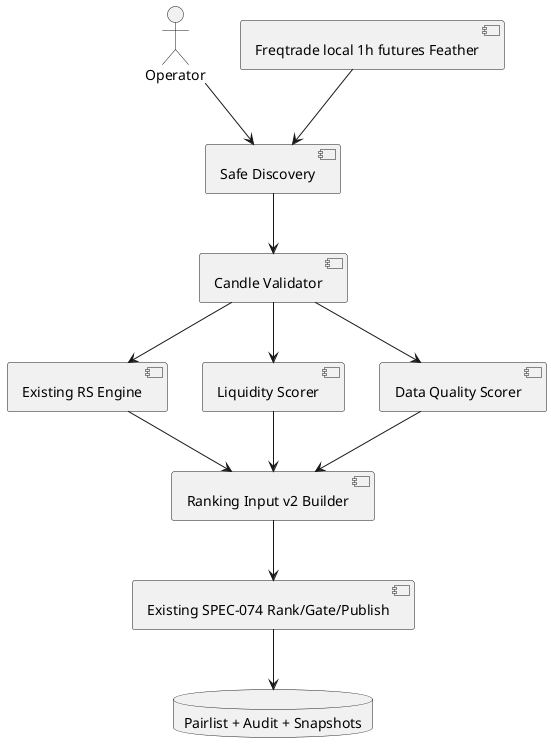

# SPEC-075-Freqtrade-Feather-Ranking-Input-Automation

## Background

Hunter v0.72.0-dev can rank an already-prepared `ranking-input.json` and publish a deterministic native Freqtrade `RemotePairList`, but operators still have to assemble that ranking input manually.

The production server already contains local Freqtrade Binance USDT-M 1h Feather OHLCV files with sufficient history. SPEC-075 adds a read-only adapter that converts those files into a versioned ranking-input artifact and optionally invokes the existing SPEC-074 rank/build/publish pipeline.

Volume must never be represented as open interest. Liquidity and genuine open interest remain separate evidence types.

## Requirements

### Must

- Read only local files matching `^(?P<base>[A-Z0-9]+)_USDT_USDT-1h-futures\.feather$`.
- Convert `BTC_USDT_USDT-1h-futures.feather` to `BTC/USDT:USDT`.
- Ignore or reject deterministically spot, mark, funding-rate, other-timeframe, hidden/temp, symlink, malformed, and duplicate-source files.
- Read only `date`, `close`, and `volume`.
- Normalize timestamps to UTC.
- Reject duplicate/out-of-order timestamps, future candles, non-finite values, `close <= 0`, `volume < 0`, and insufficient lookback.
- Use completed candles only in `[as_of_date - 90 days, as_of_date)`.
- Reuse the existing relative-strength engine without reimplementing it.
- Calculate liquidity as `close × volume` → daily total → 30-day average → `log1p` → cross-sectional percentile using average rank for ties.
- Emit public numeric values as Decimal strings.
- Calculate data quality from expected 1h slot coverage over 90 days.
- Preserve reason codes including `DATA_COMPLETE`, `DATA_GAPS_PRESENT`, `DUPLICATE_CANDLES`, `INVALID_CLOSE`, `INVALID_VOLUME`, `INSUFFICIENT_LOOKBACK`, `FUTURE_CANDLE`, and `DUPLICATE_PAIR_SOURCE`.

Supported profiles:

1. `V1_RS_OI`
   - Existing SPEC-074 behavior.
   - Tie-break: `-rs, -oi, -data_quality, pair_asc`.

2. `V2_RS_LIQUIDITY`
   - Requires RS, liquidity, and data quality for every eligible/selected pair.
   - Tie-break: `-rs, -liquidity, -data_quality, pair_asc`.

3. `V2_RS_OI_LIQUIDITY`
   - Requires RS, genuine OI, liquidity, and data quality for every eligible/selected pair.
   - Tie-break: `-rs, -oi, -liquidity, -data_quality, pair_asc`.

Profile rules:

- One profile per artifact.
- Never switch or downgrade profiles per pair.
- Never substitute liquidity for missing OI.
- Missing `schema_version` means SPEC-074 v1.
- Existing SPEC-074 tests and v1 behavior must remain unchanged.
- Under `V2_RS_LIQUIDITY`, `oi_scores` must be empty and `oi_available=false`.
- Populated `oi_scores` under `V2_RS_LIQUIDITY` fails with `PROFILE_FIELD_MISMATCH`.
- `oi_available=true` with empty `oi_scores` fails with `PROFILE_FIELD_MISMATCH`.
- Under `V2_RS_OI_LIQUIDITY`, genuine OI must exist for every eligible pair.
- No profile-irrelevant field may be silently ignored.

CLI:

```bash
hunter pairlist feather-input \
  --data-dir /path/to/futures \
  --output /path/to/ranking-input.json \
  --as-of YYYY-MM-DD
```

```bash
hunter pairlist from-feather \
  --data-dir /path/to/futures \
  --output-dir /path/to/pairlists \
  --as-of YYYY-MM-DD
```

`from-feather` must reuse the same Feather-input implementation and the existing SPEC-074 rank/build/publish pipeline.

Required v2 audit fields:

- `schema_version`
- `ranking_profile`
- `active_score_dimensions`
- `ignored_score_dimensions`
- `universe_size_at_scoring`
- deterministic universe fingerprint
- `oi_available`
- source timeframe
- lookback intervals
- source metadata
- per-pair evidence and reason codes

`ignored_score_dimensions` must remain empty; mismatches are rejected instead.

Safety invariants:

```text
research_only=True
execution_approval_granted=False
production_approval_granted=False
live_trading_allowed=False
automatic_execution_allowed=False
human_approval_required=True
```

No network, download, trading, scheduler, server, queue, database, strategy mutation, or source-data writes.

### Should

- Read only required Feather columns.
- Verify installed `pandas` and `pyarrow` before dependency changes.
- Preserve canonical JSON and deterministic fingerprints.
- Include the sorted universe or its deterministic fingerprint in audit evidence.

### Could

- Add genuine OI input support later through a separate adapter.
- Add source manifest/hash evidence.
- Add a validation-only mode that publishes nothing.

### Won't

- Treat volume as OI.
- Modify source Feather files.
- Add a custom Freqtrade PairList plugin.
- Add live/dry-run trading or execution behavior.
- Add an embedded scheduler or HTTP service.

## Method



Suggested package changes:

```text
src/hunter/pairlist_export/
├── feather_adapter.py
├── feather_models.py
├── liquidity.py
├── ranking_input_v2.py
├── models.py
├── ranking_adapter.py
├── validator.py
├── audit.py
├── cli.py
└── __init__.py
```

Existing algorithms must not be duplicated.

Ranking-input v2 example:

```json
{
  "schema_version": "hunter-ranking-input-v2",
  "ranking_profile": "V2_RS_LIQUIDITY",
  "as_of_date": "2026-07-21",
  "universe_total": 28,
  "eligible_pairs": ["BTC/USDT:USDT"],
  "rs_scores": {"BTC/USDT:USDT": "92.1"},
  "liquidity_scores": {"BTC/USDT:USDT": "88.0"},
  "oi_scores": {},
  "data_quality": {"BTC/USDT:USDT": "100"},
  "source_metadata": {
    "source": "freqtrade-feather",
    "timeframe": "1h",
    "rs_lookback_days": 90,
    "liquidity_lookback_days": 30,
    "oi_available": false,
    "universe_size_at_scoring": 28,
    "universe_fingerprint": "..."
  }
}
```

Determinism:

- Canonical JSON.
- Decimal strings.
- Average rank for percentile ties.
- Sorted universe before fingerprinting.
- No timestamps, PID, hostname, runtime duration, or temp paths in semantic fingerprints.
- Identical as-of date and Feather content produce byte-stable or semantically identical artifacts.

## Implementation

1. Verify HEAD, version, Git status, baseline tests, and installed `pandas`/`pyarrow`.
2. Document the real relative-strength engine contract.
3. Add safe discovery, filename parsing, containment, and symlink rejection.
4. Add Feather schema, timestamp, cutoff, and value validation.
5. Add deterministic liquidity and data-quality scoring.
6. Add ranking-input v2 models and canonical serialization.
7. Add profile-aware ranking, gate, audit, and fingerprints.
8. Preserve schema-less v1 behavior.
9. Add `feather-input` and `from-feather`.
10. Update technical, CLI, user, and operations docs.
11. Run focused, affected, adversarial, full-suite, compilation, source-scan, and server acceptance tests.
12. Create one local closure commit only after all Critical/High/Medium findings close.
13. Do not push.

## Milestones

### M1 — Assessment
- RS contract documented.
- Feather and dependency contracts confirmed.

### M2 — Input generation
- Discovery, validation, RS, liquidity, quality, and v2 JSON complete.

### M3 — Ranking contract v2
- Profiles, gates, audit, fingerprints, and v1 compatibility complete.

### M4 — CLI automation
- Both CLI paths complete and documented.

### M5 — Server acceptance
- Full suite clean.
- Real server Feather run succeeds.
- Audit reports `V2_RS_LIQUIDITY`, `oi_available=false`, empty `oi_scores`, correct active dimensions, and no ignored dimensions.

## Gathering Results

Acceptance requires:

- Source Feather hashes unchanged.
- No network or source mutation.
- v1 publishes identically to pre-SPEC-075 behavior.
- Exact tied-liquidity values are tested.
- Single-pair input succeeds; default publish fails `BELOW_MIN_PAIRS`.
- Invalid files and profile mismatches fail deterministically.
- Repeated runs are deterministic.
- Full Feather → ranking input → rank → build → publish succeeds on the server.
- Full suite passes without repository pollution.
- No Critical, High, or Medium findings remain.

## Need Professional Help in Developing Your Architecture?

Please contact me at [sammuti.com](https://sammuti.com) :)
