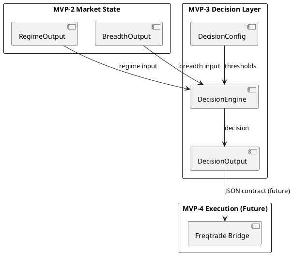

# SPEC-004-Decision-Layer

## Background

MVP-0 created the agent-first project foundation.

MVP-1 created the Data Foundation with config models, logging, data collector interfaces, and SQLite storage.

MVP-2 created the Market State layer with two deterministic engines:

1. **Regime Engine** — classifies market regime (BULL, BEAR, SIDEWAYS, TRANSITION, UNKNOWN)
2. **Market Breadth Engine** — measures market health (RISK_ON, RISK_OFF, NEUTRAL)

Both engines produce typed, frozen, deterministic outputs with fail-closed behavior.

MVP-3 will design the **Decision Layer**.

The Decision Layer consumes **in-memory** `RegimeOutput` and `BreadthOutput` objects from MVP-2 and produces a single, authoritative **decision** about whether the system should allow research/execution activity or block it.

The Decision Layer is **NOT** a trading strategy. It does not select symbols, generate Freqtrade signals, place trades, or connect to any exchange. It is a **safety gate** that translates market state into a research-enablement decision with full auditability.

**Input source:** MVP-3 consumes in-memory objects directly. It does not read JSON input files. JSON input reading is future orchestration / MVP-4 bridge work.

No real Binance integration exists yet.

No Freqtrade integration exists yet.

No trading logic exists yet.

No live trading is enabled.

## Requirements

### Must Have

- Consume `RegimeOutput` and `BreadthOutput` as inputs.
- Produce deterministic `DecisionOutput` with decision state and action.
- Define fail-closed rules for all invalid/missing/stale inputs.
- Define confidence thresholds for decision validity.
- Define stale input rules.
- Define conflicting signal rules.
- Define reason codes for every decision.
- Preserve fail-closed safety.
- Keep live trading disabled.
- Single config file: `configs/decision.yaml`.

### Should Have

- Config-driven thresholds (confidence, breadth score, stale timeout).
- Deterministic outputs.
- Explainable decisions with reason codes.
- Input reference tracking (which regime/breadth files were consumed).
- Data quality summary in output.

### Could Have

- Transition state handling (BLOCK vs MANUAL_REVIEW).
- Conflict handling (REVIEW vs BLOCK).
- Historical decision log design (future).
- Decision change alerts (future).

### Won't Have

- No live trading.
- No Freqtrade integration.
- No Binance API integration.
- No real data fetching.
- No symbol selection.
- No order execution.
- No strategy implementation.
- No production trading decisions.
- No portfolio approval logic.

## Method

### Decision Layer Architecture



### Decision Flow

```plantuml
@startuml
start

:Read RegimeOutput;
:Read BreadthOutput;

if (Regime missing or invalid?) then (yes)
  :DecisionState = BLOCK;
  :DecisionAction = BLOCK_ALL;
  :reason_codes += MISSING_REGIME;
  stop
else (no)
endif

if (Breadth missing or invalid?) then (yes)
  :DecisionState = BLOCK;
  :DecisionAction = BLOCK_ALL;
  :reason_codes += MISSING_BREADTH;
  stop
else (no)
endif

if (Regime status == UNKNOWN?) then (yes)
  :DecisionState = BLOCK;
  :DecisionAction = BLOCK_ALL;
  :reason_codes += UNKNOWN_REGIME;
  stop
else (no)
endif

if (Regime allowed_mode == NONE?) then (yes)
  :DecisionState = BLOCK;
  :DecisionAction = BLOCK_ALL;
  :reason_codes += ALLOWED_MODE_NONE;
  stop
else (no)
endif

if (Regime confidence < min_regime_confidence?) then (yes)
  :DecisionState = BLOCK;
  :DecisionAction = BLOCK_ALL;
  :reason_codes += LOW_REGIME_CONFIDENCE;
  stop
else (no)
endif

if (Inputs stale?) then (yes)
  :DecisionState = BLOCK;
  :DecisionAction = BLOCK_ALL;
  :reason_codes += STALE_INPUT;
  stop
else (no)
endif

if (Regime == BULL and allowed_mode == LONG_ONLY?) then (yes)
  if (Breadth score >= min_breadth_score_for_long?) then (yes)
    :DecisionState = ALLOW;
    :DecisionAction = ENABLE_LONG_ONLY_RESEARCH;
    :reason_codes += BULL_HEALTHY_BREADTH;
  else (no)
    :DecisionState = BLOCK;
    :DecisionAction = BLOCK_ALL;
    :reason_codes += BULL_WEAK_BREADTH;
  endif
else (no)
endif

if (Regime == BEAR and allowed_mode == SHORT_ONLY?) then (yes)
  if (Breadth score <= max_breadth_score_for_short?) then (yes)
    :DecisionState = ALLOW;
    :DecisionAction = ENABLE_SHORT_ONLY_RESEARCH;
    :reason_codes += BEAR_WEAK_BREADTH;
  else (no)
    :DecisionState = BLOCK;
    :DecisionAction = BLOCK_ALL;
    :reason_codes += BEAR_HEALTHY_BREADTH;
  endif
else (no)
endif

if (Regime == SIDEWAYS?) then (yes)
  :DecisionState = BLOCK;
  :DecisionAction = BLOCK_ALL;
  :reason_codes += SIDEWAYS_NO_DIRECTION;
else (no)
endif

if (Regime == TRANSITION?) then (yes)
  :DecisionState = BLOCK;
  :DecisionAction = BLOCK_ALL;
  :reason_codes += TRANSITION_UNCERTAIN;
else (no)
endif

if (Conflicting signals?) then (yes)
  :DecisionState = BLOCK;
  :DecisionAction = BLOCK_ALL;
  :reason_codes += CONFLICTING_SIGNALS;
else (no)
endif

:Write DecisionOutput;

stop
@enduml
```



## Implementation

### DecisionState Enum

```python
class DecisionState(str, Enum):
    """High-level decision outcome.

    ALLOW  — Research/execution is permitted.
    BLOCK  — Research/execution is blocked (fail-closed default).
    REVIEW — Manual review required. Reserved for future workflows;
             MVP-3 default config never uses REVIEW automatically.
    UNKNOWN — Input data is missing or invalid.
    """

    ALLOW = "ALLOW"
    BLOCK = "BLOCK"
    REVIEW = "REVIEW"    # Reserved for future manual-review workflows
    UNKNOWN = "UNKNOWN"
```

**Default behavior:** `BLOCK` is the fail-closed default. `REVIEW` is reserved for future config overrides and is never emitted by default MVP-3 rules. Any ambiguous or conflicting input produces `BLOCK_ALL` unless config is explicitly changed in a future version.

### DecisionAction Enum

```python
class DecisionAction(str, Enum):
    """Specific action to take based on decision."""

    ENABLE_LONG_ONLY_RESEARCH = "ENABLE_LONG_ONLY_RESEARCH"
    ENABLE_SHORT_ONLY_RESEARCH = "ENABLE_SHORT_ONLY_RESEARCH"
    BLOCK_ALL = "BLOCK_ALL"
    MANUAL_REVIEW = "MANUAL_REVIEW"
```

**Note:** These are research-enablement actions, not trading actions. No orders are placed.

### DecisionOutput Model

```python
@dataclass(frozen=True)
class DecisionOutput:
    """Decision Layer output with full audit trail."""

    timestamp: datetime
    status: OutputStatus          # VALID or INVALID
    decision_state: DecisionState   # ALLOW, BLOCK, UNKNOWN
    decision_action: DecisionAction # Specific action

    # Derived from RegimeOutput
    allowed_mode: AllowedMode      # LONG_ONLY, SHORT_ONLY, NONE
    market_regime: RegimeState     # BULL, BEAR, SIDEWAYS, TRANSITION, UNKNOWN
    risk_state: RiskState           # RISK_ON, RISK_OFF, NEUTRAL, UNKNOWN
    confidence: float              # 0.0 to 1.0, regime confidence
    regime_confidence: float      # 0.0 to 1.0, alias for clarity

    # Derived from BreadthOutput
    breadth_score: int             # 0 to 100
    market_health: RiskState       # RISK_ON, RISK_OFF, NEUTRAL, UNKNOWN

    # Audit trail
    reason_codes: List[str]       # Non-empty, human-readable reasons
    input_refs: Dict[str, str]    # References to consumed input files
    data_quality: DataQuality      # Aggregated quality flags
```

### DecisionConfig

```python
@dataclass(frozen=True)
class DecisionConfig:
    """Configuration for Decision Layer."""

    min_regime_confidence: float = 0.60
    min_breadth_score_for_long: int = 60
    max_breadth_score_for_short: int = 40
    stale_input_minutes: int = 120
    transition_action: DecisionAction = DecisionAction.BLOCK_ALL
    conflict_action: DecisionAction = DecisionAction.BLOCK_ALL
```

### Fail-Closed Rules (Deterministic Priority Order)

Rules are evaluated in strict order. The first matching rule produces the decision.

| Priority | Condition | DecisionState | DecisionAction | Reason Code |
|----------|-----------|---------------|----------------|-------------|
| 1 | RegimeOutput missing or None | BLOCK | BLOCK_ALL | MISSING_REGIME |
| 2 | BreadthOutput missing or None | BLOCK | BLOCK_ALL | MISSING_BREADTH |
| 3 | RegimeOutput.status == INVALID | BLOCK | BLOCK_ALL | INVALID_REGIME |
| 4 | BreadthOutput.status == INVALID | BLOCK | BLOCK_ALL | INVALID_BREADTH |
| 5 | RegimeOutput.market_regime == UNKNOWN | BLOCK | BLOCK_ALL | UNKNOWN_REGIME |
| 6 | RegimeOutput.allowed_mode == NONE | BLOCK | BLOCK_ALL | ALLOWED_MODE_NONE |
| 7 | RegimeOutput.confidence < min_regime_confidence | BLOCK | BLOCK_ALL | LOW_REGIME_CONFIDENCE |
| 8 | Inputs older than stale_input_minutes | BLOCK | BLOCK_ALL | STALE_INPUT |
| 9 | Regime == BULL + allowed_mode == LONG_ONLY + breadth_score >= min_breadth_score_for_long | ALLOW | ENABLE_LONG_ONLY_RESEARCH | BULL_HEALTHY_BREADTH |
| 10 | Regime == BEAR + allowed_mode == SHORT_ONLY + breadth_score <= max_breadth_score_for_short | ALLOW | ENABLE_SHORT_ONLY_RESEARCH | BEAR_WEAK_BREADTH |
| 11 | Regime == SIDEWAYS | BLOCK | BLOCK_ALL | SIDEWAYS_NO_DIRECTION |
| 12 | Regime == TRANSITION | BLOCK | BLOCK_ALL | TRANSITION_UNCERTAIN |
| 13 | Conflicting signals (e.g., BULL + risk-off breadth) | BLOCK | BLOCK_ALL | CONFLICTING_SIGNALS |
| 14 | Default (no rule matched) | BLOCK | BLOCK_ALL | DEFAULT_BLOCK |

### Conflicting Signal Definition

A conflict occurs when:
- Regime == BULL but Breadth market_health == RISK_OFF
- Regime == BEAR but Breadth market_health == RISK_ON
- Regime == BULL but Breadth breadth_score < 50 (below neutral)
- Regime == BEAR but Breadth breadth_score > 50 (above neutral)

All conflicts default to `BLOCK_ALL` per `conflict_action`.

### Stale Input Rule

Data is stale when:

```
now - input_timestamp > stale_input_minutes
```

Both RegimeOutput and BreadthOutput timestamps are checked. The older of the two is used for the stale calculation. If either input is stale, the decision is `BLOCK_ALL`.

**Note on staleness scope:** The Decision Layer checks the *age of the RegimeOutput and BreadthOutput objects themselves* (their `timestamp` fields), not the age of the underlying candle data. MVP-2 already handles timeframe-aware candle staleness via `stale_threshold_candles`. The Decision Layer's `stale_input_minutes` is an absolute guard against stale *engine outputs*, not a replacement for MVP-2's candle-level staleness checks. Default: 120 minutes.

### Input References

DecisionOutput includes `input_refs` to trace which files were consumed:

```json
{
  "input_refs": {
    "regime_file": "data/regime/current_regime.json",
    "breadth_file": "data/breadth/current_breadth.json",
    "regime_timestamp": "2026-06-17T12:00:00Z",
    "breadth_timestamp": "2026-06-17T12:00:00Z"
  }
}
```

### Data Quality Aggregation

DecisionOutput.data_quality is the logical OR of RegimeOutput.data_quality and BreadthOutput.data_quality:

- `missing` = regime.missing OR breadth.missing
- `stale` = regime.stale OR breadth.stale
- `insufficient_history` = regime.insufficient_history OR breadth.insufficient_history
- `insufficient_universe` = regime.insufficient_universe OR breadth.insufficient_universe

### JSON Output Contract

**Output file:** `data/decision/current_decision.json`

**Example valid output:**

```json
{
  "timestamp": "2026-06-17T12:00:00Z",
  "status": "VALID",
  "decision_state": "ALLOW",
  "decision_action": "ENABLE_LONG_ONLY_RESEARCH",
  "allowed_mode": "LONG_ONLY",
  "market_regime": "BULL",
  "risk_state": "RISK_ON",
  "confidence": 0.82,
  "regime_confidence": 0.82,
  "breadth_score": 72,
  "market_health": "RISK_ON",
  "reason_codes": [
    "BULL_HEALTHY_BREADTH"
  ],
  "input_refs": {
    "regime_file": "data/regime/current_regime.json",
    "breadth_file": "data/breadth/current_breadth.json",
    "regime_timestamp": "2026-06-17T12:00:00Z",
    "breadth_timestamp": "2026-06-17T12:00:00Z"
  },
  "data_quality": {
    "missing": false,
    "stale": false,
    "insufficient_history": false,
    "insufficient_universe": false
  }
}
```

**Example fail-closed output:**

```json
{
  "timestamp": "2026-06-17T12:00:00Z",
  "status": "INVALID",
  "decision_state": "BLOCK",
  "decision_action": "BLOCK_ALL",
  "allowed_mode": "NONE",
  "market_regime": "UNKNOWN",
  "risk_state": "UNKNOWN",
  "confidence": 0.0,
  "regime_confidence": 0.0,
  "breadth_score": 0,
  "market_health": "UNKNOWN",
  "reason_codes": [
    "MISSING_REGIME",
    "BLOCK_ALL"
  ],
  "input_refs": {
    "regime_file": "data/regime/current_regime.json",
    "breadth_file": "data/breadth/current_breadth.json"
  },
  "data_quality": {
    "missing": true,
    "stale": false,
    "insufficient_history": false,
    "insufficient_universe": false
  }
}
```

### JSON Schema Design (Future)

Future implementation should create:

- `schemas/decision.schema.json`

Schema must validate:
- Required fields: `timestamp`, `status`, `decision_state`, `decision_action`, `reason_codes`, `data_quality`
- Enum values for `status`, `decision_state`, `decision_action`, `allowed_mode`, `market_regime`, `risk_state`, `market_health`
- `confidence` range: 0.0 to 1.0
- `breadth_score` range: 0 to 100
- `reason_codes` is non-empty array for valid outputs
- `input_refs` is object with string values
- `data_quality` has boolean fields

### Config File Design

**File:** `configs/decision.yaml`

```yaml
# Decision Layer configuration
# This file controls thresholds for the Decision Layer.
# It does NOT contain trading rules, API keys, or execution settings.

decision:
  # Minimum regime confidence to allow any research
  min_regime_confidence: 0.60

  # Minimum breadth score to allow long-only research
  min_breadth_score_for_long: 60

  # Maximum breadth score to allow short-only research
  # (below this = weak market = good for shorts)
  max_breadth_score_for_short: 40

  # Input staleness threshold in minutes
  stale_input_minutes: 120

  # Action when regime is TRANSITION
  # Options: BLOCK_ALL, MANUAL_REVIEW
  # Default is BLOCK_ALL (fail-closed)
  transition_action: BLOCK_ALL

  # Action when regime and breadth conflict
  # Options: BLOCK_ALL, MANUAL_REVIEW
  # Default is BLOCK_ALL (fail-closed)
  conflict_action: BLOCK_ALL
```

### Safety Constraints

The Decision Layer explicitly does NOT:

- Connect to Binance or any exchange.
- Connect to Freqtrade.
- Place orders or execute trades.
- Generate Freqtrade signal files.
- Select specific trading symbols.
- Use API keys or secrets.
- Enable live trading.

The Decision Layer is a **read-only consumer** of Market State outputs and a **write-only producer** of decision JSON files. It is a safety gate, not a trading engine.

## Milestones

### MVP-3 Step 1 — Decision Models

- Create `DecisionState`, `DecisionAction` enums.
- Create `DecisionOutput` frozen dataclass.
- Create `DecisionConfig` frozen dataclass.
- Add tests for model defaults and immutability.

### MVP-3 Step 2 — Decision Engine

- Create `DecisionEngine` class or function.
- Implement fail-closed rule evaluation in priority order.
- Implement stale input detection.
- Implement conflict detection.
- Implement data quality aggregation.
- Add tests for all fail-closed paths and allow paths.

### MVP-3 Step 3 — Decision JSON Writer

- Create `decision_to_dict()` serializer.
- Create `write_decision_output()` atomic writer.
- Write to `data/decision/current_decision.json`.
- Add tests for serialization and file writing.

### MVP-3 Step 4 — Integration Tests

- Test end-to-end: RegimeOutput + BreadthOutput → DecisionOutput → JSON file.
- Test all fail-closed combinations.
- Test stale input handling.
- Test conflict handling.
- Verify no network calls, no trading logic.

### MVP-3 Step 5 — Final Review

- Review against SPEC-004.
- Verify all tests pass.
- Update project memory files.
- Bump version to 0.4.0-dev.

## Resolved Assumptions

The following design assumptions were clarified during SPEC-004 review and are now part of the design:

1. **Staleness is output-level, not candle-level.** MVP-2 handles timeframe-aware candle staleness (`stale_threshold_candles`). The Decision Layer's `stale_input_minutes` guards against stale *engine outputs* only. Default: 120 minutes.

2. **REVIEW state is reserved for future workflows.** `DecisionState.REVIEW` exists in the enum but MVP-3 default rules never emit it. `transition_action` and `conflict_action` both default to `BLOCK_ALL`. Any ambiguous or conflicting input produces `BLOCK_ALL` unless config is explicitly changed in a future version.

3. **MVP-3 consumes in-memory objects, not JSON files.** The Decision Layer reads `RegimeOutput` and `BreadthOutput` objects directly from memory. JSON input file reading is future orchestration / MVP-4 bridge work.

## Gathering Results

### Success Criteria

- Decision Layer produces deterministic outputs from MVP-2 inputs.
- All fail-closed paths return BLOCK_ALL with clear reason codes.
- Allow paths only occur when regime, breadth, and confidence all align.
- JSON output matches the contract defined above.
- Atomic file writes prevent partial output.
- No network calls, no trading logic, no exchange integration.

### Failure Criteria

- Any missing input does not produce BLOCK_ALL.
- Any invalid input does not produce BLOCK_ALL.
- Any stale input does not produce BLOCK_ALL.
- Any low-confidence input does not produce BLOCK_ALL.
- Any conflicting signal does not produce BLOCK_ALL.

### Test Coverage Targets

- 100% of fail-closed rules have dedicated tests.
- 100% of allow paths have dedicated tests.
- All stale input scenarios tested.
- All conflict scenarios tested.
- All config threshold boundaries tested.

## Need Professional Help in Developing Your Architecture?

Please contact me at [sammuti.com](https://sammuti.com) :)
