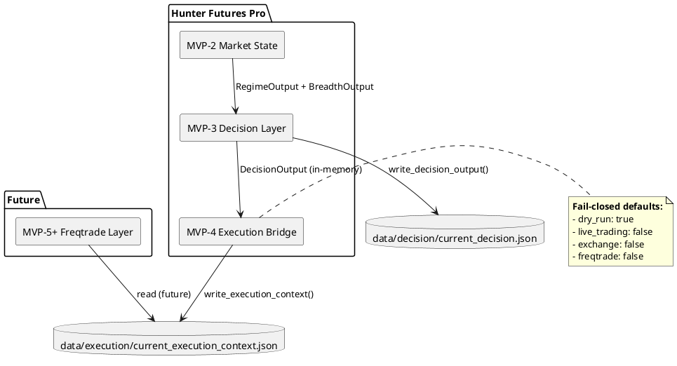
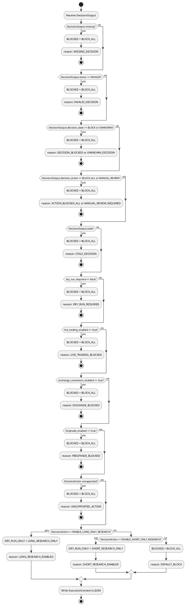

# SPEC-005 — Execution Bridge / Freqtrade Integration

## Background

MVP-4 defines the **Execution Bridge** — a safe, fail-closed contract layer between the Hunter Futures Pro **Decision Layer** (MVP-3) and a future **Freqtrade Execution Layer** (MVP-5+). The bridge translates `DecisionOutput` objects into a machine-readable **Execution Context** that external execution systems can consume without risk of accidental live trading.

The Execution Bridge is **not** a trading engine. It does not place orders, select symbols, or compute position sizes. It is a **safety gate** that converts research-enablement decisions into an explicit execution contract with all safety flags exposed.

**Input:** `DecisionOutput` from MVP-3 (in-memory object or `data/decision/current_decision.json` in future orchestration).  
**Output:** `ExecutionContext` written to `data/execution/current_execution_context.json`.

**Key principle:** The bridge defaults to **BLOCKED** with `dry_run: true`. Every field that could enable live trading is explicitly set to `false` in the default output. Future MVPs must explicitly override these flags — they cannot be enabled by accident.

**Freqtrade boundary:** MVP-4 only defines the bridge contract. No Freqtrade strategy class is implemented. No exchange credentials are introduced. No pairlist, order type, stake amount, leverage, stoploss, or ROI logic is present. A future MVP will read `current_execution_context.json` and translate it into Freqtrade-compatible signals, but only after explicit dry-run validation.

## Requirements

### Must Have

- Consume `DecisionOutput` from MVP-3 as the sole input.
- Produce `ExecutionContext` with deterministic, fail-closed rules.
- Default to `BLOCKED` + `dry_run: true` + all execution flags `false`.
- Serialize output to `data/execution/current_execution_context.json` with atomic writes.
- Include full audit trail: `reason_codes`, `input_refs`, `data_quality`, `safety_flags`.
- Support a single future config file: `configs/execution_bridge.yaml`.
- Define a future JSON Schema: `schemas/execution_context.schema.json`.
- Document the Freqtrade compatibility contract for future implementation.

### Should Have

- Stale decision detection (configurable threshold, default 120 minutes).
- Explicit `dry_run` flag that cannot be accidentally set to `false`.
- `safety_flags` dict exposing every safety decision for external inspection.
- PlantUML component and flow diagrams for architecture documentation.

### Could Have

- Execution context versioning for backward-compatible future evolution.
- Human-readable summary field in `ExecutionContext` for log review.

### Won't Have (MVP-4)

- No Freqtrade runtime integration.
- No Freqtrade strategy class implementation.
- No symbol selection / pairlist logic.
- No order placement logic.
- No live trading enablement.
- No Binance or exchange connection.
- No API keys or credentials.
- No buy/sell signal generation.
- No position sizing, leverage, stoploss, or ROI logic.
- No backtest execution.
- No real data fetching.

## Method

### ExecutionState Enum

```python
class ExecutionState(str, Enum):
    """High-level execution readiness.

    ENABLED        — Execution context is valid and research is permitted.
    BLOCKED        — Execution is blocked (fail-closed default).
    DRY_RUN_ONLY   — Only dry-run / simulation is permitted.
    UNKNOWN        — Input missing or invalid.
    """

    ENABLED = "ENABLED"
    BLOCKED = "BLOCKED"
    DRY_RUN_ONLY = "DRY_RUN_ONLY"
    UNKNOWN = "UNKNOWN"
```

**Default:** `BLOCKED`. `ENABLED` is only reached when `DecisionState.ALLOW` is received, all safety checks pass, and `dry_run` remains `true`.

### ExecutionMode Enum

```python
class ExecutionMode(str, Enum):
    """Specific execution mode permitted by the bridge.

    LONG_RESEARCH_ONLY   — Long-side research only, no execution.
    SHORT_RESEARCH_ONLY  — Short-side research only, no execution.
    BLOCK_ALL            — All execution and research blocked.
    DRY_RUN_ONLY         — Simulation only, no real execution.
    """

    LONG_RESEARCH_ONLY = "LONG_RESEARCH_ONLY"
    SHORT_RESEARCH_ONLY = "SHORT_RESEARCH_ONLY"
    BLOCK_ALL = "BLOCK_ALL"
    DRY_RUN_ONLY = "DRY_RUN_ONLY"
```

**Note:** These are research-enablement modes, not trading modes. No orders are placed.

### ExecutionContext Model

```python
@dataclass(frozen=True)
class ExecutionContext:
    """Safe execution context produced by the bridge.

    Every safety-critical field defaults to the most restrictive state.
    Future MVPs must explicitly override flags — they cannot be enabled by accident.
    """

    timestamp: datetime
    status: OutputStatus          # VALID or INVALID
    execution_state: ExecutionState   # ENABLED, BLOCKED, DRY_RUN_ONLY, UNKNOWN
    execution_mode: ExecutionMode      # LONG_RESEARCH_ONLY, SHORT_RESEARCH_ONLY, BLOCK_ALL, DRY_RUN_ONLY

    # Derived from DecisionOutput
    decision_state: DecisionState     # Original decision state (ALLOW, BLOCK, etc.)
    decision_action: DecisionAction   # Original decision action
    allowed_mode: AllowedMode         # LONG_ONLY, SHORT_ONLY, NONE

    # Safety flags — all default to False / most restrictive
    dry_run: bool = True              # True = simulation only (default for MVP-4)
    live_trading_enabled: bool = False
    exchange_connection_enabled: bool = False
    freqtrade_enabled: bool = False

    # Audit trail
    reason_codes: List[str] = field(default_factory=list)
    input_refs: DecisionInputRefs = field(default_factory=DecisionInputRefs)
    data_quality: DataQuality = field(default_factory=DataQuality)

    # Safety flags dict for external inspection
    safety_flags: Dict[str, bool] = field(default_factory=dict)
    version: str = "1.0"  # Bridge contract version for backward-compatible evolution
```

**Safety flags dict** (example):
```json
{
  "dry_run": true,
  "live_trading_enabled": false,
  "exchange_connection_enabled": false,
  "freqtrade_enabled": false,
  "decision_stale": false,
  "decision_invalid": false,
  "decision_blocked": false,
  "manual_review_required": false,
  "unsupported_action": false,
  "human_override_required": false,
  "max_context_age_seconds": 300
}
```

**Note on `human_override_required`:** Defaults to `false` for MVP-4. MVP-4 has no human override workflow. This field is reserved for future MVPs that may transition from `DRY_RUN_ONLY` to `ENABLED` after explicit human confirmation.

**Note on `max_context_age_seconds`:** Defaults to `300` (5 minutes). This is a future consumer-side stale rejection guard. It does not replace `stale_decision_minutes` (which validates `DecisionOutput` age before producing `ExecutionContext`). Instead, `max_context_age_seconds` allows downstream consumers (e.g., Freqtrade) to reject contexts older than their own threshold, independent of the bridge's validation.

**Note:** `version` defaults to `"1.0"` for MVP-4. Future MVPs may increment this when the `ExecutionContext` contract changes, allowing consumers to detect and handle backward-compatible schema evolution.

### Fail-Closed Rules (Deterministic Priority Order)

Rules are evaluated in strict order. The first matching rule produces the execution context.

| Priority | Condition | ExecutionState | ExecutionMode | Reason Code |
|----------|-----------|----------------|---------------|-------------|
| 1 | DecisionOutput missing or None | BLOCKED | BLOCK_ALL | MISSING_DECISION |
| 2 | DecisionOutput.status == INVALID | BLOCKED | BLOCK_ALL | INVALID_DECISION |
| 3 | DecisionOutput.decision_state == BLOCK | BLOCKED | BLOCK_ALL | DECISION_BLOCKED |
| 4 | DecisionOutput.decision_state == UNKNOWN | BLOCKED | BLOCK_ALL | UNKNOWN_DECISION |
| 5 | DecisionOutput.decision_action == BLOCK_ALL | BLOCKED | BLOCK_ALL | ACTION_BLOCKED_ALL |
| 6 | DecisionOutput.decision_action == MANUAL_REVIEW | BLOCKED | BLOCK_ALL | MANUAL_REVIEW_REQUIRED |
| 7 | DecisionOutput stale (older than stale_decision_minutes) | BLOCKED | BLOCK_ALL | STALE_DECISION |
| 8 | dry_run == false (MVP-4 requires dry_run true) | BLOCKED | BLOCK_ALL | DRY_RUN_REQUIRED |
| 9 | live_trading_enabled == true | BLOCKED | BLOCK_ALL | LIVE_TRADING_BLOCKED |
| 10 | exchange_connection_enabled == true | BLOCKED | BLOCK_ALL | EXCHANGE_BLOCKED |
| 11 | freqtrade_enabled == true (MVP-4 blocks this) | BLOCKED | BLOCK_ALL | FREQTRADE_BLOCKED |
| 12 | DecisionAction not in (ENABLE_LONG_ONLY_RESEARCH, ENABLE_SHORT_ONLY_RESEARCH) | BLOCKED | BLOCK_ALL | UNSUPPORTED_ACTION |
| 13 | DecisionAction == ENABLE_LONG_ONLY_RESEARCH + allow_long_research == true | DRY_RUN_ONLY | LONG_RESEARCH_ONLY | LONG_RESEARCH_ENABLED |
| 14 | DecisionAction == ENABLE_SHORT_ONLY_RESEARCH + allow_short_research == true | DRY_RUN_ONLY | SHORT_RESEARCH_ONLY | SHORT_RESEARCH_ENABLED |
| 15 | Default (no rule matched) | BLOCKED | BLOCK_ALL | DEFAULT_BLOCK |

**Note:** `ENABLED` is not used in MVP-4. All successful paths produce `DRY_RUN_ONLY` to enforce simulation-only operation. `ENABLED` is reserved for future MVPs after explicit dry-run validation.

### Mapping from DecisionAction to ExecutionMode

| DecisionAction | ExecutionMode | ExecutionState | Condition |
|----------------|---------------|----------------|-----------|
| ENABLE_LONG_ONLY_RESEARCH | LONG_RESEARCH_ONLY | DRY_RUN_ONLY | `allow_long_research == true` |
| ENABLE_SHORT_ONLY_RESEARCH | SHORT_RESEARCH_ONLY | DRY_RUN_ONLY | `allow_short_research == true` |
| BLOCK_ALL | BLOCK_ALL | BLOCKED | Always |
| MANUAL_REVIEW | BLOCK_ALL | BLOCKED | Always (default) |

### Stale Decision Rule

Data is stale when:

```
now - decision_output.timestamp > stale_decision_minutes
```

The DecisionOutput timestamp is checked. If the decision is older than the threshold, the bridge produces `BLOCKED` + `BLOCK_ALL`.

**Note:** The bridge checks the *age of the DecisionOutput object itself* (its `timestamp` field), not the age of underlying regime/breadth data. MVP-2 and MVP-3 already handle candle-level and output-level staleness respectively.

### ExecutionBridgeConfig

```python
@dataclass(frozen=True)
class ExecutionBridgeConfig:
    """Configuration for Execution Bridge."""

    stale_decision_minutes: int = 120
    dry_run_required: bool = True          # MVP-4: must be True
    live_trading_enabled: bool = False     # MVP-4: must be False
    exchange_connection_enabled: bool = False  # MVP-4: must be False
    freqtrade_enabled: bool = False        # MVP-4: must be False
    allow_long_research: bool = True
    allow_short_research: bool = True
    manual_review_action: ExecutionMode = ExecutionMode.BLOCK_ALL
    unsupported_action: ExecutionMode = ExecutionMode.BLOCK_ALL
```

**Validation:** `__post_init__` should enforce:
- `dry_run_required == True` for MVP-4 (raise ValueError if False)
- `live_trading_enabled == False` for MVP-4 (raise ValueError if True)
- `exchange_connection_enabled == False` for MVP-4 (raise ValueError if True)
- `freqtrade_enabled == False` for MVP-4 (raise ValueError if True)
- `stale_decision_minutes > 0`

These validations prevent accidental enabling of live trading in MVP-4. Future MVPs can relax these constraints after explicit safety review.

### PlantUML Component Diagram



### PlantUML Bridge Flow Diagram



## Implementation

### ExecutionBridgeConfig

```python
@dataclass(frozen=True)
class ExecutionBridgeConfig:
    """Configuration for Execution Bridge."""

    stale_decision_minutes: int = 120
    dry_run_required: bool = True
    live_trading_enabled: bool = False
    exchange_connection_enabled: bool = False
    freqtrade_enabled: bool = False
    allow_long_research: bool = True
    allow_short_research: bool = True
    manual_review_action: ExecutionMode = ExecutionMode.BLOCK_ALL
    unsupported_action: ExecutionMode = ExecutionMode.BLOCK_ALL
```

### ExecutionContext Model

```python
@dataclass(frozen=True)
class ExecutionContext:
    """Safe execution context produced by the bridge."""

    timestamp: datetime
    status: OutputStatus
    execution_state: ExecutionState
    execution_mode: ExecutionMode

    decision_state: DecisionState
    decision_action: DecisionAction
    allowed_mode: AllowedMode

    dry_run: bool = True
    live_trading_enabled: bool = False
    exchange_connection_enabled: bool = False
    freqtrade_enabled: bool = False

    reason_codes: List[str] = field(default_factory=list)
    input_refs: DecisionInputRefs = field(default_factory=DecisionInputRefs)
    data_quality: DataQuality = field(default_factory=DataQuality)
    safety_flags: Dict[str, bool] = field(default_factory=dict)
```

### Fail-Closed Factory

```python
@classmethod
def blocked(
    cls,
    timestamp: datetime | None = None,
    reason_codes: List[str] | None = None,
    data_quality: DataQuality | None = None,
    safety_flags: Dict[str, bool] | None = None,
) -> ExecutionContext:
    """Create a fail-closed BLOCKED context.

    Used when inputs are missing, stale, invalid, or any safety check fails.
    """
    return cls(
        timestamp=timestamp or datetime.now(timezone.utc),
        status=OutputStatus.INVALID,
        execution_state=ExecutionState.BLOCKED,
        execution_mode=ExecutionMode.BLOCK_ALL,
        decision_state=DecisionState.BLOCK,
        decision_action=DecisionAction.BLOCK_ALL,
        allowed_mode=AllowedMode.NONE,
        dry_run=True,
        live_trading_enabled=False,
        exchange_connection_enabled=False,
        freqtrade_enabled=False,
        reason_codes=reason_codes or ["EXECUTION_BLOCKED_BY_DEFAULT"],
        data_quality=data_quality or DataQuality(),
        safety_flags=safety_flags or {
            "dry_run": True,
            "live_trading_enabled": False,
            "exchange_connection_enabled": False,
            "freqtrade_enabled": False,
            "decision_stale": False,
            "decision_invalid": False,
            "decision_blocked": True,
            "manual_review_required": False,
            "unsupported_action": False,
            "human_override_required": False,
            "max_context_age_seconds": 300,
        },
    )
```

### JSON Output Contract

**Output file:** `data/execution/current_execution_context.json`

**Example valid output (DRY_RUN_ONLY + LONG_RESEARCH_ONLY):**

```json
{
  "timestamp": "2026-06-17T12:00:00Z",
  "status": "VALID",
  "execution_state": "DRY_RUN_ONLY",
  "execution_mode": "LONG_RESEARCH_ONLY",
  "decision_state": "ALLOW",
  "decision_action": "ENABLE_LONG_ONLY_RESEARCH",
  "allowed_mode": "LONG_ONLY",
  "dry_run": true,
  "live_trading_enabled": false,
  "exchange_connection_enabled": false,
  "freqtrade_enabled": false,
  "reason_codes": [
    "LONG_RESEARCH_ENABLED"
  ],
  "input_refs": {
    "regime_timestamp": "2026-06-17T12:00:00Z",
    "breadth_timestamp": "2026-06-17T12:00:00Z",
    "regime_source": "regime_engine",
    "breadth_source": "breadth_engine"
  },
  "data_quality": {
    "missing": false,
    "stale": false,
    "insufficient_history": false,
    "insufficient_universe": false
  },
  "safety_flags": {
    "dry_run": true,
    "live_trading_enabled": false,
    "exchange_connection_enabled": false,
    "freqtrade_enabled": false,
    "decision_stale": false,
    "decision_invalid": false,
    "decision_blocked": false,
    "manual_review_required": false,
    "unsupported_action": false,
    "human_override_required": false,
    "max_context_age_seconds": 300
  },
  "version": "1.0"
}
```

**Example fail-closed output (BLOCKED):**

```json
{
  "timestamp": "2026-06-17T12:00:00Z",
  "status": "INVALID",
  "execution_state": "BLOCKED",
  "execution_mode": "BLOCK_ALL",
  "decision_state": "BLOCK",
  "decision_action": "BLOCK_ALL",
  "allowed_mode": "NONE",
  "dry_run": true,
  "live_trading_enabled": false,
  "exchange_connection_enabled": false,
  "freqtrade_enabled": false,
  "reason_codes": [
    "MISSING_DECISION"
  ],
  "input_refs": {
    "regime_timestamp": "",
    "breadth_timestamp": "",
    "regime_source": "",
    "breadth_source": ""
  },
  "data_quality": {
    "missing": true,
    "stale": false,
    "insufficient_history": false,
    "insufficient_universe": false
  },
  "safety_flags": {
    "dry_run": true,
    "live_trading_enabled": false,
    "exchange_connection_enabled": false,
    "freqtrade_enabled": false,
    "decision_stale": false,
    "decision_invalid": false,
    "decision_blocked": true,
    "manual_review_required": false,
    "unsupported_action": false,
    "human_override_required": false,
    "max_context_age_seconds": 300
  },
  "version": "1.0"
}
```

### Config File Design

**Single config file:** `configs/execution_bridge.yaml`

```yaml
# Execution Bridge Configuration
# MVP-4: All safety flags must remain False. Dry-run must remain True.

stale_decision_minutes: 120
dry_run_required: true          # MVP-4: MUST be true
live_trading_enabled: false     # MVP-4: MUST be false
exchange_connection_enabled: false  # MVP-4: MUST be false
freqtrade_enabled: false        # MVP-4: MUST be false
allow_long_research: true
allow_short_research: true
manual_review_action: BLOCK_ALL
unsupported_action: BLOCK_ALL
```

### JSON Schema Design

**Future schema file:** `schemas/execution_context.schema.json`

The schema should validate:
- Required fields: `timestamp`, `status`, `execution_state`, `execution_mode`, `decision_state`, `decision_action`, `allowed_mode`, `dry_run`, `live_trading_enabled`, `exchange_connection_enabled`, `freqtrade_enabled`, `reason_codes`, `input_refs`, `data_quality`, `safety_flags`
- Enum values for `execution_state`, `execution_mode`, `decision_state`, `decision_action`, `allowed_mode`, `status`
- `reason_codes` must be non-empty array of strings
- `safety_flags` must be a dict with specific boolean keys
- `dry_run` must be boolean
- `live_trading_enabled` must be boolean
- `exchange_connection_enabled` must be boolean
- `freqtrade_enabled` must be boolean

**Do not implement the schema file yet.** This is future work for MVP-4+ or a dedicated schema milestone.

### Freqtrade Compatibility Contract

MVP-4 defines the contract that a future Freqtrade integration must consume. The contract is:

1. **Input:** Freqtrade reads `data/execution/current_execution_context.json` at startup.
2. **Validation:** Freqtrade must verify `execution_state` is `DRY_RUN_ONLY` or `ENABLED` (not `BLOCKED` or `UNKNOWN`).
3. **Mode mapping:**
   - `LONG_RESEARCH_ONLY` → Freqtrade may research long candidates, no short positions
   - `SHORT_RESEARCH_ONLY` → Freqtrade may research short candidates, no long positions
   - `BLOCK_ALL` → Freqtrade must not run any strategy logic
   - `DRY_RUN_ONLY` → Freqtrade may run in dry-run mode only
4. **Safety checks:** Freqtrade must verify `dry_run: true` before any order simulation. If `live_trading_enabled: true`, Freqtrade must require explicit human confirmation.
5. **No automatic execution:** Freqtrade must never automatically enable live trading based on `ExecutionContext`. Human override is required.
6. **Stale check:** Freqtrade should check `timestamp` and reject contexts older than its own threshold. Freqtrade may also use `max_context_age_seconds` from `safety_flags` as a consumer-side guard, independent of the bridge's `stale_decision_minutes`.

**Note:** This contract is documentation-only in MVP-4. No Freqtrade code is written.

## Milestones

MVP-4 is broken into 5 small implementation steps:

### Step 1: Execution Bridge Models

- Create `ExecutionState`, `ExecutionMode`, `ExecutionBridgeConfig`, `ExecutionContext` enums and dataclasses.
- Add `__post_init__` validation for safety flags.
- Add `ExecutionContext.blocked()` fail-closed factory.
- Create `tests/test_execution_bridge/test_models.py` with model tests.
- **Target:** 25+ tests, all passing.

### Step 2: Execution Bridge Engine

- Create `build_execution_context(decision_output, config)` function.
- Implement all 15 fail-closed rules in priority order.
- Implement stale decision detection.
- Implement safety flags population.
- Create `tests/test_execution_bridge/test_engine.py` with rule tests.
- **Target:** 50+ tests, all passing.

### Step 3: Execution Context JSON Writer

- Create `execution_context_to_dict()` serializer.
- Create `write_execution_context()` atomic writer.
- Default path: `data/execution/current_execution_context.json`.
- Create `tests/test_execution_bridge/test_writer.py` with writer tests.
- **Target:** 15+ tests, all passing.

### Step 4: Integration Tests

- End-to-end: DecisionOutput → build_execution_context() → write_execution_context() → JSON verification.
- Test all safety flag combinations.
- Test Freqtrade contract validation (mock).
- Create `tests/test_execution_bridge/test_integration.py`.
- **Target:** 15+ tests, all passing.

### Step 5: Final Review and Polish

- Run full test suite.
- Verify all safety constraints.
- Verify no trading logic, no Binance, no Freqtrade runtime, no live trading.
- Update project memory files.
- **Target:** All tests pass, no issues found.

## Gathering Results

### Success Criteria

- [ ] All models exist and are frozen/immutable.
- [ ] All 15 fail-closed rules are deterministic and tested.
- [ ] Default output is `BLOCKED` + `dry_run: true` + all flags `false`.
- [ ] `DRY_RUN_ONLY` is the only successful state in MVP-4 (no `ENABLED`).
- [ ] JSON output matches the contract exactly.
- [ ] Atomic writes prevent partial output.
- [ ] No Binance integration exists.
- [ ] No Freqtrade runtime integration exists.
- [ ] No live trading is enabled.
- [ ] No API keys or secrets exist.
- [ ] No trading execution logic exists.
- [ ] Full test suite passes with 400+ tests.

### Failure Criteria

- Any safety flag defaults to `True` or `enabled`.
- Any rule produces `ENABLED` in MVP-4.
- Missing `DecisionOutput` does not produce `BLOCKED`.
- Stale decision is not detected.
- `dry_run` can be set to `false` without explicit override.
- `live_trading_enabled` can be set to `true` without explicit override.

## Need Professional Help in Developing Your Architecture?

Please contact me at [sammuti.com](https://sammuti.com) :)

## Safety Constraints

The following constraints are **non-negotiable** for MVP-4:

1. **No Binance integration.** No Binance API calls, no websocket connections, no testnet usage.
2. **No Freqtrade runtime integration.** No Freqtrade strategy class, no Freqtrade bot connection, no pairlist logic.
3. **No live trading.** `live_trading_enabled` must be `false` in all default outputs. Validation must reject `true`.
4. **No API keys.** No exchange credentials, no API secrets, no wallet private keys.
5. **No order execution.** No buy/sell logic, no position sizing, no stoploss, no ROI, no leverage calculation.
6. **Fail-closed by default.** Missing, invalid, stale, or ambiguous inputs produce `BLOCKED` + `BLOCK_ALL`.
7. **Dry-run only.** `dry_run` must be `true` in all MVP-4 outputs. `ENABLED` state is reserved for future MVPs.
8. **Explicit safety flags.** Every safety decision must be exposed in `safety_flags` for external inspection. This includes `human_override_required` (reserved for future) and `max_context_age_seconds` (consumer-side guard).
9. **Audit trail.** Every output must include `reason_codes`, `input_refs`, `data_quality`, `safety_flags`, and `version`.
10. **Config validation.** `ExecutionBridgeConfig.__post_init__` must enforce MVP-4 safety constraints and raise on violation.
11. **Versioning.** `ExecutionContext.version` defaults to `"1.0"` for backward-compatible contract evolution.

## Resolved Assumptions

1. **Input source:** MVP-4 consumes in-memory `DecisionOutput` objects directly. It does not read `data/decision/current_decision.json`. JSON input reading is future orchestration work.
2. **Staleness layers:** `stale_decision_minutes` checks the age of the `DecisionOutput` timestamp before producing `ExecutionContext`. `max_context_age_seconds` in `safety_flags` is a future consumer-side guard (e.g., Freqtrade) that operates independently. These are two separate stale checks at different layers.
3. **ENABLED state:** `ExecutionState.ENABLED` exists in the enum but is never emitted by MVP-4 rules. All successful paths produce `DRY_RUN_ONLY`. `ENABLED` is reserved for future MVPs after explicit dry-run validation and human override.
4. **Human override:** `human_override_required` in `safety_flags` defaults to `false` for MVP-4. MVP-4 has no human override workflow. This field is reserved for future MVPs that may transition from `DRY_RUN_ONLY` to `ENABLED` after explicit human confirmation.
5. **Freqtrade boundary:** MVP-4 only defines the compatibility contract. No Freqtrade code is implemented. The contract documents how a future MVP should read and validate `ExecutionContext`, including `max_context_age_seconds` for independent stale rejection.
6. **Config safety:** `ExecutionBridgeConfig` validates that `dry_run_required`, `live_trading_enabled`, `exchange_connection_enabled`, and `freqtrade_enabled` are at their safe defaults for MVP-4. Future MVPs can relax these after explicit safety review.
7. **Version field:** `ExecutionContext.version` defaults to `"1.0"`. Future MVPs may increment this when the contract changes, allowing consumers to detect and handle backward-compatible schema evolution.

## Open Questions

All open questions from the initial draft have been resolved directly in the document. See **Resolved Assumptions** above for details.

No remaining blocking questions.
