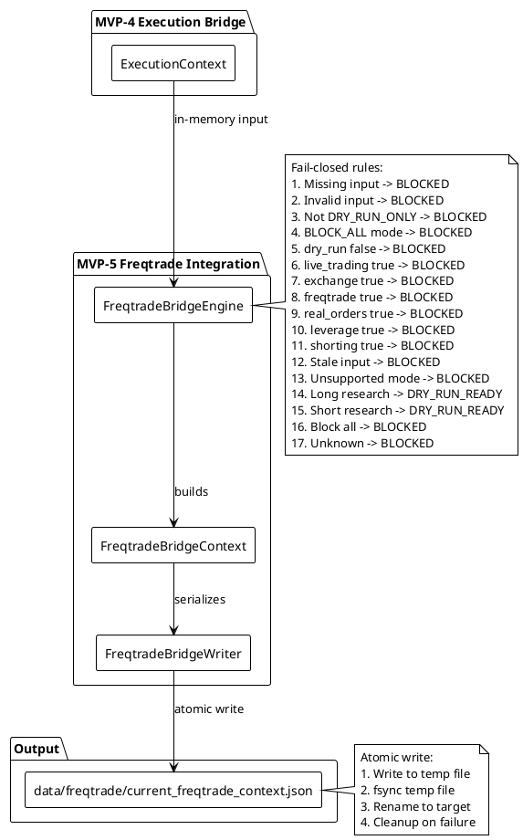
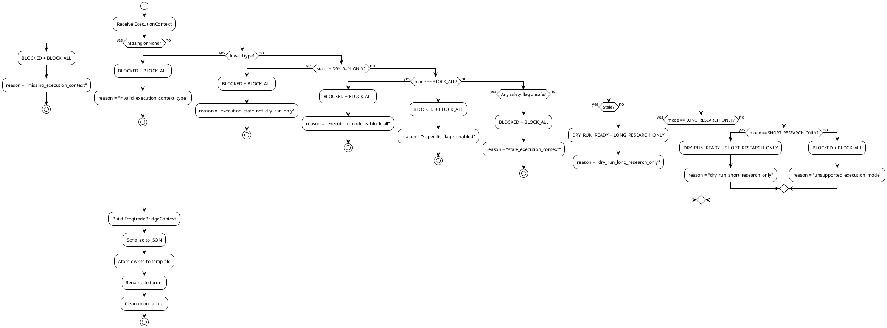

# SPEC-006-Freqtrade-Integration

## Background

MVP-4 (Execution Bridge) produces an `ExecutionContext` that safely gates all downstream trading activity. The Execution Bridge is designed to be fail-closed, dry-run-only, and never permit live trading, real orders, or exchange connections.

MVP-5 extends this safety boundary by designing a Freqtrade Integration layer that consumes the Execution Context and produces a Freqtrade-facing context document. This document is the single source of truth for any future Freqtrade strategy or runtime process. The design ensures that even if a Freqtrade strategy is later implemented (MVP-6+), it can only operate within the constraints defined by the Execution Bridge.

The Freqtrade Integration layer is a pure translation and validation boundary. It does not implement trading logic, does not connect to Binance, does not place orders, and does not run a Freqtrade process. Its sole purpose is to translate the Execution Bridge's decision into a Freqtrade-compatible context with explicit safety flags.

## Requirements

1. **Consume ExecutionContext**: Accept an in-memory `ExecutionContext` from MVP-4 as the sole input. During implementation, MVP-5 consumes the ExecutionContext in-memory directly from the Execution Bridge engine. The future file input reference path is `data/execution/current_execution_context.json` — this is the future bridge input path for consumers that read from disk rather than receiving objects in memory.
2. **Produce FreqtradeBridgeContext**: Output a `FreqtradeBridgeContext` object with explicit safety fields.
3. **Fail-Closed by Default**: Any missing, invalid, stale, or unsafe input must produce `BLOCKED` + `BLOCK_ALL`.
4. **Dry-Run Only**: The only non-blocked state is `DRY_RUN_READY`.
5. **No Live Trading**: `live_trading_enabled` must always be `false` in MVP-5.
6. **No Exchange Connection**: `exchange_connection_enabled` must always be `false` in MVP-5.
7. **No Real Orders**: `real_orders_enabled` must always be `false` in MVP-5.
8. **No Leverage**: `leverage_enabled` must always be `false` in MVP-5.
9. **No Shorting on Exchange**: `shorting_enabled` must always be `false` in MVP-5.
10. **No Freqtrade Runtime**: `freqtrade_runtime_enabled` must always be `false` in MVP-5.
11. **No Strategy Class**: `strategy_enabled` must always be `false` in MVP-5.
12. **Atomic JSON Output**: Write `data/freqtrade/current_freqtrade_context.json` using atomic temp-file + rename.
13. **ISO-8601 Timestamps**: All timestamps in UTC with `Z` suffix.
14. **Enum Values as Strings**: All enum values serialized as lowercase strings.
15. **Version Field**: Output must include `version: "1.0"`.
16. **Reason Codes**: Every output must include human-readable reason codes explaining the decision.
17. **Input References**: Output must include `input_refs` referencing the source ExecutionContext.
18. **Safety Flags**: Output must include `safety_flags` with all safety-critical booleans.
19. **Data Quality**: Output must include `data_quality` with freshness and validation status.
20. **Config File Design**: Design `configs/freqtrade_bridge.yaml` for future implementation (not created in MVP-5).
21. **JSON Schema Design**: Design `schemas/freqtrade_bridge_context.schema.json` for future validation (not created in MVP-5).
22. **No Config YAML in MVP-5**: Do not create or load config files in this MVP.
23. **No Schema Validation in MVP-5**: Do not implement JSON Schema validation in this MVP.
24. **No Network Calls**: No HTTP, WebSocket, or TCP connections.
25. **No Binance Integration**: No API keys, no exchange connectivity.
26. **No Freqtrade Runtime**: No subprocess calls, no Docker containers, no Freqtrade process management.
27. **No Trading Logic**: No pairlist, order, stake, leverage, stoploss, ROI, entry, or exit logic.
28. **No Mock Strategy in MVP-5**: Strategy class deferred to MVP-6 or later.

## Method

### FreqtradeBridgeState

An enum representing the Freqtrade bridge's operational state:

- `DISABLED`: Bridge is explicitly disabled (reserved for future use).
- `DRY_RUN_READY`: Bridge is ready for dry-run research only. This is the only non-blocked state in MVP-5.
- `BLOCKED`: Bridge is blocked due to safety violations, invalid input, or unsupported mode. This is the default state.
- `UNKNOWN`: Bridge state cannot be determined (treated as blocked).

### FreqtradeBridgeMode

An enum representing the Freqtrade bridge's operational mode:

- `LONG_RESEARCH_ONLY`: Only long-side research is permitted. Maps from `ExecutionMode.LONG_RESEARCH_ONLY`.
- `SHORT_RESEARCH_ONLY`: Only short-side research is permitted. Maps from `ExecutionMode.SHORT_RESEARCH_ONLY`.
- `BLOCK_ALL`: All Freqtrade activity is blocked. Default mode.

### FreqtradeBridgeContext

A dataclass representing the complete Freqtrade-facing context:

```python
@dataclass
class FreqtradeBridgeContext:
    timestamp: str                    # ISO-8601 UTC with Z suffix
    status: str                     # "success" or "blocked"
    bridge_state: FreqtradeBridgeState   # DISABLED, DRY_RUN_READY, BLOCKED, UNKNOWN
    bridge_mode: FreqtradeBridgeMode     # LONG_RESEARCH_ONLY, SHORT_RESEARCH_ONLY, BLOCK_ALL
    execution_state: str            # ExecutionState value as string
    execution_mode: str             # ExecutionMode value as string
    dry_run: bool                   # Always True in MVP-5
    live_trading_enabled: bool      # Always False in MVP-5
    exchange_connection_enabled: bool  # Always False in MVP-5
    freqtrade_runtime_enabled: bool    # Always False in MVP-5
    strategy_enabled: bool          # Always False in MVP-5
    real_orders_enabled: bool       # Always False in MVP-5
    leverage_enabled: bool          # Always False in MVP-5
    shorting_enabled: bool          # Always False in MVP-5
    reason_codes: List[str]         # Human-readable reasons for the decision
    input_refs: Dict[str, Any]      # References to source ExecutionContext
    safety_flags: Dict[str, Any]    # Safety-critical configuration flags
    data_quality: Dict[str, Any]    # Freshness and validation status
    version: str                    # Always "1.0" in MVP-5
```

### Fail-Closed Rules (Priority Order)

The bridge engine applies these rules in strict priority order. The first matching rule determines the output:

1. **Missing ExecutionContext**: If `execution_context` is `None` => `BLOCKED` + `BLOCK_ALL` + reason `"missing_execution_context"`.
2. **Invalid ExecutionContext**: If `execution_context` is not an `ExecutionContext` instance => `BLOCKED` + `BLOCK_ALL` + reason `"invalid_execution_context_type"`.
3. **ExecutionState not DRY_RUN_ONLY**: If `execution_context.state != ExecutionState.DRY_RUN_ONLY` => `BLOCKED` + `BLOCK_ALL` + reason `"execution_state_not_dry_run_only:<actual_state>"`.
4. **ExecutionMode BLOCK_ALL**: If `execution_context.mode == ExecutionMode.BLOCK_ALL` => `BLOCKED` + `BLOCK_ALL` + reason `"execution_mode_is_block_all"`.
5. **dry_run False**: If `execution_context.safety_flags.get("dry_run") is False` => `BLOCKED` + `BLOCK_ALL` + reason `"dry_run_disabled"`.
6. **live_trading_enabled True**: If `execution_context.safety_flags.get("live_trading_enabled") is True` => `BLOCKED` + `BLOCK_ALL` + reason `"live_trading_enabled"`.
7. **exchange_connection_enabled True**: If `execution_context.safety_flags.get("exchange_connection_enabled") is True` => `BLOCKED` + `BLOCK_ALL` + reason `"exchange_connection_enabled"`.
8. **freqtrade_enabled True**: If `execution_context.safety_flags.get("freqtrade_enabled") is True` => `BLOCKED` + `BLOCK_ALL` + reason `"freqtrade_enabled"`.
9. **real_orders_enabled True**: If `execution_context.safety_flags.get("real_orders_enabled") is True` => `BLOCKED` + `BLOCK_ALL` + reason `"real_orders_enabled"`.
10. **leverage_enabled True**: If `execution_context.safety_flags.get("leverage_enabled") is True` => `BLOCKED` + `BLOCK_ALL` + reason `"leverage_enabled"`.
11. **shorting_enabled True**: If `execution_context.safety_flags.get("shorting_enabled") is True` => `BLOCKED` + `BLOCK_ALL` + reason `"shorting_enabled"`.
12. **Stale ExecutionContext**: If `execution_context` is older than `stale_execution_context_seconds` (default 300) => `BLOCKED` + `BLOCK_ALL` + reason `"stale_execution_context"`.
13. **Unsupported ExecutionMode**: If `execution_context.mode` is not in `{LONG_RESEARCH_ONLY, SHORT_RESEARCH_ONLY, BLOCK_ALL}` => `BLOCKED` + `BLOCK_ALL` + reason `"unsupported_execution_mode:<actual_mode>"`.
14. **Long Research**: If `execution_context.mode == LONG_RESEARCH_ONLY` => `DRY_RUN_READY` + `LONG_RESEARCH_ONLY` + reason `"dry_run_long_research_only"`.
15. **Short Research**: If `execution_context.mode == SHORT_RESEARCH_ONLY` => `DRY_RUN_READY` + `SHORT_RESEARCH_ONLY` + reason `"dry_run_short_research_only"`.
16. **Block All**: If `execution_context.mode == BLOCK_ALL` => `BLOCKED` + `BLOCK_ALL` + reason `"execution_mode_is_block_all"`.
17. **Unknown Mode**: If none of the above match => `BLOCKED` + `BLOCK_ALL` + reason `"unknown_execution_mode:<actual_mode>"`.

> **Note on flow diagram**: The PlantUML flow diagram below shows 16 visible decision branches. The final `BLOCK_ALL` fallback (rule 16) is represented by the terminal `else`/`default` branch following the `SHORT_RESEARCH_ONLY` check. Rules 16 and 17 both produce `BLOCKED` + `BLOCK_ALL` and are visually merged in the diagram for clarity.

### Mapping Table

| ExecutionState | ExecutionMode | FreqtradeBridgeState | FreqtradeBridgeMode | Reason Code |
|----------------|---------------|----------------------|---------------------|-------------|
| DRY_RUN_ONLY | LONG_RESEARCH_ONLY | DRY_RUN_READY | LONG_RESEARCH_ONLY | `dry_run_long_research_only` |
| DRY_RUN_ONLY | SHORT_RESEARCH_ONLY | DRY_RUN_READY | SHORT_RESEARCH_ONLY | `dry_run_short_research_only` |
| DRY_RUN_ONLY | BLOCK_ALL | BLOCKED | BLOCK_ALL | `execution_mode_is_block_all` |
| BLOCKED | (any) | BLOCKED | BLOCK_ALL | `execution_state_is_blocked` |
| (any) | UNKNOWN | BLOCKED | BLOCK_ALL | `unknown_execution_mode` |
| (any invalid) | (any invalid) | BLOCKED | BLOCK_ALL | `invalid_execution_context` |

### Config Design (Future Only)

```yaml
# configs/freqtrade_bridge.yaml
# NOTE: This file is designed for future implementation (MVP-6+).
# Do not create this file in MVP-5.

freqtrade_bridge:
  stale_execution_context_seconds: 300
  dry_run_required: true
  live_trading_enabled: false
  exchange_connection_enabled: false
  freqtrade_runtime_enabled: false
  strategy_enabled: false
  real_orders_enabled: false
  leverage_enabled: false
  shorting_enabled: false
  allow_long_research: true
  allow_short_research: true
  unsupported_mode_action: BLOCK_ALL
```

> **Config-to-output mapping**: `stale_execution_context_seconds: 300` in the config above is the producer-side validation threshold. It validates the age of the input `ExecutionContext` before the Freqtrade bridge produces a `FreqtradeBridgeContext`. The consumer-side safety flag emitted in the JSON output is `max_context_age_seconds: 300` (inside `safety_flags`), which tells future Freqtrade-facing consumers how fresh the context is expected to be.

### JSON Output Format

```json
{
  "timestamp": "2025-01-15T10:30:00Z",
  "status": "success",
  "bridge_state": "dry_run_ready",
  "bridge_mode": "long_research_only",
  "execution_state": "dry_run_only",
  "execution_mode": "long_research_only",
  "dry_run": true,
  "live_trading_enabled": false,
  "exchange_connection_enabled": false,
  "freqtrade_runtime_enabled": false,
  "strategy_enabled": false,
  "real_orders_enabled": false,
  "leverage_enabled": false,
  "shorting_enabled": false,
  "reason_codes": ["dry_run_long_research_only"],
  "input_refs": {
    "execution_context_timestamp": "2025-01-15T10:30:00Z",
    "execution_context_version": "1.0"
  },
  "safety_flags": {
    "dry_run": true,
    "live_trading_enabled": false,
    "exchange_connection_enabled": false,
    "freqtrade_enabled": false,
    "real_orders_enabled": false,
    "leverage_enabled": false,
    "shorting_enabled": false,
    "human_override_required": false,
    "max_context_age_seconds": 300
  },
  "data_quality": {
    "execution_context_fresh": true,
    "execution_context_valid": true,
    "validation_errors": []
  },
  "version": "1.0"
}
```

### JSON Schema Design (Future Only)

```json
{
  "$schema": "http://json-schema.org/draft-07/schema#",
  "title": "FreqtradeBridgeContext",
  "description": "Schema for Freqtrade Bridge Context output. Designed for future validation (MVP-6+).",
  "type": "object",
  "required": [
    "timestamp", "status", "bridge_state", "bridge_mode",
    "execution_state", "execution_mode", "dry_run",
    "live_trading_enabled", "exchange_connection_enabled",
    "freqtrade_runtime_enabled", "strategy_enabled",
    "real_orders_enabled", "leverage_enabled", "shorting_enabled",
    "reason_codes", "input_refs", "safety_flags", "data_quality", "version"
  ],
  "properties": {
    "timestamp": { "type": "string", "format": "date-time" },
    "status": { "type": "string", "enum": ["success", "blocked", "error"] },
    "bridge_state": { "type": "string", "enum": ["disabled", "dry_run_ready", "blocked", "unknown"] },
    "bridge_mode": { "type": "string", "enum": ["long_research_only", "short_research_only", "block_all"] },
    "execution_state": { "type": "string" },
    "execution_mode": { "type": "string" },
    "dry_run": { "type": "boolean" },
    "live_trading_enabled": { "type": "boolean" },
    "exchange_connection_enabled": { "type": "boolean" },
    "freqtrade_runtime_enabled": { "type": "boolean" },
    "strategy_enabled": { "type": "boolean" },
    "real_orders_enabled": { "type": "boolean" },
    "leverage_enabled": { "type": "boolean" },
    "shorting_enabled": { "type": "boolean" },
    "reason_codes": { "type": "array", "items": { "type": "string" } },
    "input_refs": { "type": "object" },
    "safety_flags": { "type": "object" },
    "data_quality": { "type": "object" },
    "version": { "type": "string", "pattern": "^\\d+\\.\\d+$" }
  }
}
```

### PlantUML Component Diagram



### PlantUML Flow Diagram



## Implementation

### Module Structure

```
src/hunter/freqtrade/
├── __init__.py          # Public API exports
├── models.py            # FreqtradeBridgeState, FreqtradeBridgeMode, FreqtradeBridgeContext
├── engine.py            # build_freqtrade_bridge_context(), validate_execution_context()
└── writer.py            # freqtrade_bridge_context_to_dict(), atomic_write_json(), write_freqtrade_bridge_context()

tests/test_freqtrade/
├── __init__.py
├── test_models.py       # FreqtradeBridgeContext dataclass tests
├── test_engine.py       # Engine validation and mapping tests
├── test_writer.py       # JSON serialization and atomic write tests
└── test_integration.py  # End-to-end engine + writer tests
```

### FreqtradeBridgeContext Dataclass

```python
from dataclasses import dataclass, field
from typing import List, Dict, Any
from enum import Enum, auto
from datetime import datetime, timezone

class FreqtradeBridgeState(Enum):
    DISABLED = auto()
    DRY_RUN_READY = auto()
    BLOCKED = auto()
    UNKNOWN = auto()

class FreqtradeBridgeMode(Enum):
    LONG_RESEARCH_ONLY = auto()
    SHORT_RESEARCH_ONLY = auto()
    BLOCK_ALL = auto()

@dataclass
class FreqtradeBridgeContext:
    timestamp: str = field(default_factory=lambda: datetime.now(timezone.utc).strftime("%Y-%m-%dT%H:%M:%SZ"))
    status: str = "blocked"
    bridge_state: FreqtradeBridgeState = FreqtradeBridgeState.BLOCKED
    bridge_mode: FreqtradeBridgeMode = FreqtradeBridgeMode.BLOCK_ALL
    execution_state: str = "unknown"
    execution_mode: str = "unknown"
    dry_run: bool = True
    live_trading_enabled: bool = False
    exchange_connection_enabled: bool = False
    freqtrade_runtime_enabled: bool = False
    strategy_enabled: bool = False
    real_orders_enabled: bool = False
    leverage_enabled: bool = False
    shorting_enabled: bool = False
    reason_codes: List[str] = field(default_factory=lambda: ["default_blocked"])
    input_refs: Dict[str, Any] = field(default_factory=dict)
    safety_flags: Dict[str, Any] = field(default_factory=dict)
    data_quality: Dict[str, Any] = field(default_factory=dict)
    version: str = "1.0"
```

### Engine Implementation

```python
def validate_execution_context(execution_context, config=None):
    """
    Validate ExecutionContext against fail-closed rules.
    Returns (bridge_state, bridge_mode, reason_codes) or raises ValueError.
    """
    # Priority 1: Missing
    if execution_context is None:
        return FreqtradeBridgeState.BLOCKED, FreqtradeBridgeMode.BLOCK_ALL, ["missing_execution_context"]
    
    # Priority 2: Invalid type
    if not isinstance(execution_context, ExecutionContext):
        return FreqtradeBridgeState.BLOCKED, FreqtradeBridgeMode.BLOCK_ALL, ["invalid_execution_context_type"]
    
    # Priority 3: State not DRY_RUN_ONLY
    if execution_context.state != ExecutionState.DRY_RUN_ONLY:
        return (FreqtradeBridgeState.BLOCKED, FreqtradeBridgeMode.BLOCK_ALL,
                [f"execution_state_not_dry_run_only:{execution_context.state.name.lower()}"])
    
    # Priority 4: Mode BLOCK_ALL
    if execution_context.mode == ExecutionMode.BLOCK_ALL:
        return FreqtradeBridgeState.BLOCKED, FreqtradeBridgeMode.BLOCK_ALL, ["execution_mode_is_block_all"]
    
    # Priority 5-11: Safety flags
    safety = execution_context.safety_flags or {}
    flag_checks = [
        ("dry_run", False, "dry_run_disabled"),
        ("live_trading_enabled", True, "live_trading_enabled"),
        ("exchange_connection_enabled", True, "exchange_connection_enabled"),
        ("freqtrade_enabled", True, "freqtrade_enabled"),
        ("real_orders_enabled", True, "real_orders_enabled"),
        ("leverage_enabled", True, "leverage_enabled"),
        ("shorting_enabled", True, "shorting_enabled"),
    ]
    for flag, dangerous_value, reason in flag_checks:
        if safety.get(flag) == dangerous_value:
            return FreqtradeBridgeState.BLOCKED, FreqtradeBridgeMode.BLOCK_ALL, [reason]
    
    # Priority 12: Stale
    if is_stale(execution_context, config):
        return FreqtradeBridgeState.BLOCKED, FreqtradeBridgeMode.BLOCK_ALL, ["stale_execution_context"]
    
    # Priority 13-17: Mode mapping
    mode_mapping = {
        ExecutionMode.LONG_RESEARCH_ONLY: (
            FreqtradeBridgeState.DRY_RUN_READY, FreqtradeBridgeMode.LONG_RESEARCH_ONLY, "dry_run_long_research_only"
        ),
        ExecutionMode.SHORT_RESEARCH_ONLY: (
            FreqtradeBridgeState.DRY_RUN_READY, FreqtradeBridgeMode.SHORT_RESEARCH_ONLY, "dry_run_short_research_only"
        ),
        ExecutionMode.BLOCK_ALL: (
            FreqtradeBridgeState.BLOCKED, FreqtradeBridgeMode.BLOCK_ALL, "execution_mode_is_block_all"
        ),
    }
    if execution_context.mode in mode_mapping:
        return mode_mapping[execution_context.mode]
    
    return (FreqtradeBridgeState.BLOCKED, FreqtradeBridgeMode.BLOCK_ALL,
            [f"unknown_execution_mode:{execution_context.mode.name.lower()}"])

def build_freqtrade_bridge_context(execution_context, config=None):
    """
    Build FreqtradeBridgeContext from ExecutionContext.
    """
    bridge_state, bridge_mode, reason_codes = validate_execution_context(execution_context, config)
    
    status = "success" if bridge_state == FreqtradeBridgeState.DRY_RUN_READY else "blocked"
    
    safety = execution_context.safety_flags if execution_context else {}
    
    return FreqtradeBridgeContext(
        status=status,
        bridge_state=bridge_state,
        bridge_mode=bridge_mode,
        execution_state=execution_context.state.name.lower() if execution_context else "unknown",
        execution_mode=execution_context.mode.name.lower() if execution_context else "unknown",
        dry_run=safety.get("dry_run", True),
        live_trading_enabled=safety.get("live_trading_enabled", False),
        exchange_connection_enabled=safety.get("exchange_connection_enabled", False),
        freqtrade_runtime_enabled=safety.get("freqtrade_enabled", False),
        strategy_enabled=False,
        real_orders_enabled=safety.get("real_orders_enabled", False),
        leverage_enabled=safety.get("leverage_enabled", False),
        shorting_enabled=safety.get("shorting_enabled", False),
        reason_codes=reason_codes,
        input_refs={
            "execution_context_timestamp": execution_context.timestamp if execution_context else None,
            "execution_context_version": execution_context.version if execution_context else None,
        },
        safety_flags={
            "dry_run": safety.get("dry_run", True),
            "live_trading_enabled": safety.get("live_trading_enabled", False),
            "exchange_connection_enabled": safety.get("exchange_connection_enabled", False),
            "freqtrade_enabled": safety.get("freqtrade_enabled", False),
            "real_orders_enabled": safety.get("real_orders_enabled", False),
            "leverage_enabled": safety.get("leverage_enabled", False),
            "shorting_enabled": safety.get("shorting_enabled", False),
            "human_override_required": safety.get("human_override_required", False),
            "max_context_age_seconds": 300,
        },
        data_quality={
            "execution_context_fresh": bridge_state != FreqtradeBridgeState.BLOCKED or "stale" not in reason_codes[0],
            "execution_context_valid": execution_context is not None and isinstance(execution_context, ExecutionContext),
            "validation_errors": [] if bridge_state == FreqtradeBridgeState.DRY_RUN_READY else reason_codes,
        },
    )
```

### Writer Implementation

```python
def freqtrade_bridge_context_to_dict(ctx):
    """Serialize FreqtradeBridgeContext to dictionary."""
    return {
        "timestamp": ctx.timestamp,
        "status": ctx.status,
        "bridge_state": ctx.bridge_state.name.lower(),
        "bridge_mode": ctx.bridge_mode.name.lower(),
        "execution_state": ctx.execution_state,
        "execution_mode": ctx.execution_mode,
        "dry_run": ctx.dry_run,
        "live_trading_enabled": ctx.live_trading_enabled,
        "exchange_connection_enabled": ctx.exchange_connection_enabled,
        "freqtrade_runtime_enabled": ctx.freqtrade_runtime_enabled,
        "strategy_enabled": ctx.strategy_enabled,
        "real_orders_enabled": ctx.real_orders_enabled,
        "leverage_enabled": ctx.leverage_enabled,
        "shorting_enabled": ctx.shorting_enabled,
        "reason_codes": ctx.reason_codes,
        "input_refs": ctx.input_refs,
        "safety_flags": ctx.safety_flags,
        "data_quality": ctx.data_quality,
        "version": ctx.version,
    }

def atomic_write_json(data, target_path):
    """Atomically write JSON data to target_path using temp file + rename."""
    import json
    import os
    import tempfile
    
    dir_name = os.path.dirname(target_path)
    if dir_name:
        os.makedirs(dir_name, exist_ok=True)
    
    fd, temp_path = tempfile.mkstemp(dir=dir_name, suffix=".tmp")
    try:
        with os.fdopen(fd, "w") as f:
            json.dump(data, f, indent=2)
            f.flush()
            os.fsync(fd)
        os.replace(temp_path, target_path)
    except Exception:
        try:
            os.unlink(temp_path)
        except OSError:
            pass
        raise

def write_freqtrade_bridge_context(bridge_context, output_path=None):
    """Write FreqtradeBridgeContext to JSON file."""
    if output_path is None:
        output_path = os.path.join("data", "freqtrade", "current_freqtrade_context.json")
    
    data = freqtrade_bridge_context_to_dict(bridge_context)
    atomic_write_json(data, output_path)
    return output_path
```

## Milestones

### Milestone 1: Freqtrade Bridge Models (Step 1)
- Create `src/hunter/freqtrade/models.py`
- Implement `FreqtradeBridgeState`, `FreqtradeBridgeMode`, `FreqtradeBridgeContext`
- All fields with correct defaults
- All enum values serializable as lowercase strings
- Tests: ~50 tests

### Milestone 2: Freqtrade Bridge Engine (Step 2)
- Create `src/hunter/freqtrade/engine.py`
- Implement `validate_execution_context()` with 17 fail-closed rules
- Implement `build_freqtrade_bridge_context()`
- All priority rules in correct order
- All mappings correct
- Tests: ~45 tests

### Milestone 3: Freqtrade Bridge Writer (Step 3)
- Create `src/hunter/freqtrade/writer.py`
- Implement `freqtrade_bridge_context_to_dict()`
- Implement `atomic_write_json()`
- Implement `write_freqtrade_bridge_context()`
- Atomic write with temp file + rename
- ISO-8601 timestamps
- Enum values as strings
- Tests: ~20 tests

### Milestone 4: Integration Tests (Step 4)
- Create `tests/test_freqtrade/test_integration.py`
- End-to-end tests: ExecutionContext -> Engine -> Writer -> JSON
- Verify all safety flags in output
- Verify atomic write behavior
- Verify no production path usage in tests
- Tests: ~30 tests

### Milestone 5: Final Review (Step 5)
- Run full pytest suite (target: 600+ tests)
- Verify all safety constraints
- Verify no live trading, no exchange, no orders, no leverage, no shorting
- Verify no Binance integration
- Verify no Freqtrade runtime
- Verify no strategy class
- Verify no trading logic
- Update documentation
- Mark MVP-5 complete

## Gathering Results

### Success Criteria
1. All 600+ tests pass.
2. FreqtradeBridgeContext defaults to `BLOCKED` + `BLOCK_ALL`.
3. Only `DRY_RUN_ONLY` + `LONG_RESEARCH_ONLY` produces `DRY_RUN_READY` + `LONG_RESEARCH_ONLY`.
4. Only `DRY_RUN_ONLY` + `SHORT_RESEARCH_ONLY` produces `DRY_RUN_READY` + `SHORT_RESEARCH_ONLY`.
5. All unsafe inputs produce `BLOCKED` + `BLOCK_ALL`.
6. JSON output contains all required fields.
7. JSON output contains `version: "1.0"`.
8. JSON output contains `safety_flags` with all flags false/safe.
9. Atomic write is used for all file output.
10. No live trading, exchange, orders, leverage, or shorting is possible.
11. No Binance integration exists.
12. No Freqtrade runtime integration exists.
13. No strategy class exists.
14. No trading logic exists.

### Failure Criteria
1. Any test fails.
2. Any unsafe default (e.g., `live_trading_enabled=True`).
3. Any missing required field in output.
4. Any non-atomic write.
5. Any network call or external dependency.
6. Any trading logic (pairlist, order, stake, leverage, stoploss, ROI, entry, exit).

## Need Professional Help in Developing Your Architecture?

Please contact me at [sammuti.com](https://sammuti.com) :)
