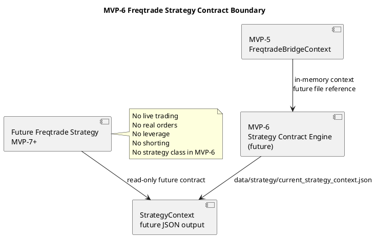
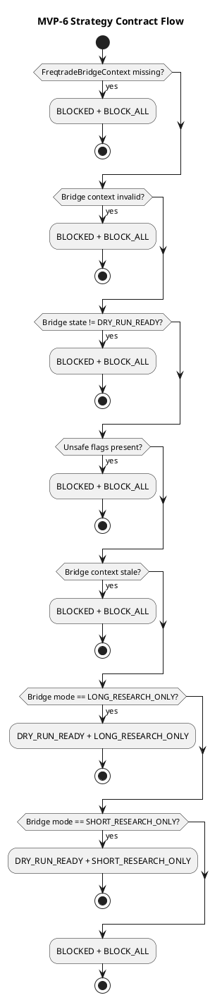

# SPEC-007-Freqtrade-Strategy-Contract

## Background

MVP-6 defines the contract for a future Freqtrade strategy adapter that can consume the dry-run-only `FreqtradeBridgeContext` produced by MVP-5.

This phase is design-only. It does not implement a Freqtrade strategy class, does not launch Freqtrade, does not connect to Binance, does not create API keys, and does not place orders.

The purpose is to define a safe strategy-facing contract before any runtime strategy implementation exists.

## Requirements

### Must Have

- Consume `FreqtradeBridgeContext` from MVP-5 as the upstream safety gate.
- Define a future file input reference:
  - `data/freqtrade/current_freqtrade_context.json`
- Define strategy-side fail-closed behavior.
- Define dry-run-only strategy contract behavior.
- Define allowed research-only modes:
  - long research only
  - short research only
  - block all
- Define explicit safety defaults.
- Define future output contract:
  - `data/strategy/current_strategy_context.json`
- Define future schema:
  - `schemas/strategy_context.schema.json`
- Keep MVP-6 design-only before implementation.

### Should Have

- Use deterministic priority-ordered fail-closed rules.
- Preserve reason codes for every blocking decision.
- Preserve version field for future compatibility.
- Include PlantUML diagrams for component and flow design.
- Split implementation into small steps.

### Could Have

- Future human review hooks.
- Future read-only Freqtrade strategy adapter.
- Future dry-run-only strategy simulation tests.

### Won't Have

- No Binance integration.
- No real Freqtrade runtime integration.
- No strategy class implementation.
- No API keys.
- No live trading.
- No real orders.
- No leverage.
- No shorting.
- No pairlist logic.
- No stake sizing.
- No ROI logic.
- No stoploss logic.
- No order type logic.
- No entry signal execution.
- No exit signal execution.
- No production trading logic.

## Method

### Contract Inputs

MVP-6 consumes the MVP-5 `FreqtradeBridgeContext`.

Future file input reference:

```text
data/freqtrade/current_freqtrade_context.json
```

MVP-6 does not implement file reading yet. File reading is future implementation work.

### Future Output

MVP-6 designs the future strategy context output:

```text
data/strategy/current_strategy_context.json
```

This future output must use atomic writes, ISO-8601 timestamps, enum string values, required reason codes, and version `"1.0"`.

### StrategyContractState

```text
DISABLED
DRY_RUN_READY
BLOCKED
UNKNOWN
```

### StrategyContractMode

```text
LONG_RESEARCH_ONLY
SHORT_RESEARCH_ONLY
BLOCK_ALL
```

### StrategyContext

Fields:

```text
timestamp
status
contract_state
contract_mode
bridge_state
bridge_mode
dry_run
live_trading_enabled
real_orders_enabled
leverage_enabled
shorting_enabled
strategy_runtime_allowed
entry_signals_allowed
exit_signals_allowed
reason_codes
input_refs
safety_flags
data_quality
version
```

Default version:

```text
1.0
```

### Safety Defaults

```text
dry_run: true
live_trading_enabled: false
real_orders_enabled: false
leverage_enabled: false
shorting_enabled: false
strategy_runtime_allowed: false
entry_signals_allowed: false
exit_signals_allowed: false
contract_state: BLOCKED
contract_mode: BLOCK_ALL
version: "1.0"
```

### Fail-Closed Rules

Priority order:

1. Missing `FreqtradeBridgeContext` => `BLOCKED + BLOCK_ALL`
2. Invalid `FreqtradeBridgeContext` => `BLOCKED + BLOCK_ALL`
3. Bridge state not `DRY_RUN_READY` => `BLOCKED + BLOCK_ALL`
4. Bridge mode `BLOCK_ALL` => `BLOCKED + BLOCK_ALL`
5. `dry_run == false` => `BLOCKED + BLOCK_ALL`
6. `live_trading_enabled == true` => `BLOCKED + BLOCK_ALL`
7. `real_orders_enabled == true` => `BLOCKED + BLOCK_ALL`
8. `leverage_enabled == true` => `BLOCKED + BLOCK_ALL`
9. `shorting_enabled == true` => `BLOCKED + BLOCK_ALL`
10. Stale bridge context => `BLOCKED + BLOCK_ALL`
11. Unsupported bridge mode => `BLOCKED + BLOCK_ALL`
12. `DRY_RUN_READY + LONG_RESEARCH_ONLY` => `DRY_RUN_READY + LONG_RESEARCH_ONLY`
13. `DRY_RUN_READY + SHORT_RESEARCH_ONLY` => `DRY_RUN_READY + SHORT_RESEARCH_ONLY`
14. Any other state => `BLOCKED + BLOCK_ALL`

### Mapping Rules

| Input Bridge State | Input Bridge Mode | Strategy Contract State | Strategy Contract Mode |
|---|---|---|---|
| DRY_RUN_READY | LONG_RESEARCH_ONLY | DRY_RUN_READY | LONG_RESEARCH_ONLY |
| DRY_RUN_READY | SHORT_RESEARCH_ONLY | DRY_RUN_READY | SHORT_RESEARCH_ONLY |
| BLOCKED | any | BLOCKED | BLOCK_ALL |
| DISABLED | any | BLOCKED | BLOCK_ALL |
| UNKNOWN | any | BLOCKED | BLOCK_ALL |
| any | BLOCK_ALL | BLOCKED | BLOCK_ALL |

### Strategy Contract Boundary

A future strategy may read the strategy context, but must fail closed if the context is missing, stale, invalid, unsafe, or blocking.

The strategy contract must not:

- create real orders
- enable live trading
- enable leverage
- enable shorting
- contain pairlist logic
- contain stake sizing
- contain ROI logic
- contain stoploss logic
- contain order type logic
- contain entry execution logic
- contain exit execution logic
- bypass `FreqtradeBridgeContext`

### Config Design

Future config file:

```text
configs/strategy_contract.yaml
```

Defaults:

```yaml
stale_bridge_context_seconds: 300
dry_run_required: true
live_trading_enabled: false
real_orders_enabled: false
leverage_enabled: false
shorting_enabled: false
strategy_runtime_allowed: false
entry_signals_allowed: false
exit_signals_allowed: false
allow_long_research: true
allow_short_research: true
unsupported_mode_action: BLOCK_ALL
```

This file is design-only in SPEC-007 and must not be created during design.

### JSON Schema Design

Future schema file:

```text
schemas/strategy_context.schema.json
```

The schema should validate required fields, enum values, timestamp format, boolean safety flags, reason codes, data quality, and version.

This schema is design-only in SPEC-007 and must not be created during design.

### Component Diagram



### Contract Flow Diagram



## Implementation

MVP-6 implementation should be split into small, reviewable steps.

### Step 1 — Strategy Contract Models

Future files:

```text
src/hunter/strategy_contract/__init__.py
src/hunter/strategy_contract/models.py
tests/test_strategy_contract/test_models.py
```

Define:

- `StrategyContractState`
- `StrategyContractMode`
- `StrategyContractConfig`
- `StrategyContractInputRefs`
- `StrategyContractSafetyFlags`
- `StrategyContractDataQuality`
- `StrategyContext`

### Step 2 — Strategy Contract Engine

Future files:

```text
src/hunter/strategy_contract/engine.py
tests/test_strategy_contract/test_engine.py
```

Define:

- `build_strategy_context(...)`
- `validate_strategy_contract_inputs(...)`
- `is_stale_bridge_context(...)`
- `map_bridge_to_strategy_mode(...)`
- `build_safety_flags(...)`

### Step 3 — Strategy Context Writer

Future files:

```text
src/hunter/strategy_contract/writer.py
tests/test_strategy_contract/test_writer.py
```

Define:

- `strategy_context_to_dict(...)`
- `write_strategy_context(...)`
- `atomic_write_json(...)`

### Step 4 — Integration Tests

Future file:

```text
tests/test_strategy_contract/test_integration.py
```

Test:

- long research flow
- short research flow
- blocked flow
- stale context
- unsafe flags
- JSON output
- atomic writes
- no strategy class
- no Freqtrade runtime
- no Binance
- no live trading
- no leverage
- no shorting

### Step 5 — Final Review

Review implementation against SPEC-007 and safety constraints.

## Milestones

1. Strategy contract models complete.
2. Strategy contract engine complete.
3. Strategy context writer complete.
4. Integration tests complete.
5. Final review complete.

## Gathering Results

Success criteria:

- All tests pass.
- Strategy contract remains dry-run only.
- Missing, stale, invalid, unsafe, or blocking context fails closed.
- No Binance integration exists.
- No real Freqtrade runtime integration exists.
- No strategy class exists.
- No API keys exist.
- No live trading exists.
- No real order execution exists.
- No leverage exists.
- No shorting exists.
- No entry/exit execution logic exists.
- JSON schema remains future work.
- Config YAML remains future work unless explicitly implemented in a later step.

Failure criteria:

- Any live trading flag becomes enabled.
- Any real order path appears.
- Any Binance connection appears.
- Any real Freqtrade runtime connection appears.
- Any strategy class appears in MVP-6 design.
- Any leverage or shorting behavior appears.
- Any unsafe input produces a non-blocking result.

## Need Professional Help in Developing Your Architecture?

Please contact me at [sammuti.com](https://sammuti.com) :)
