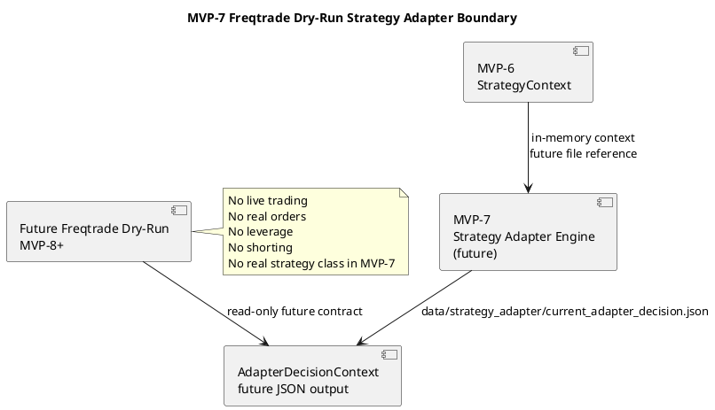
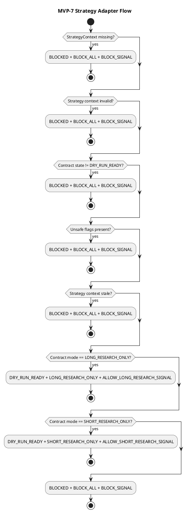

# SPEC-008-Freqtrade-Dry-Run-Strategy-Adapter

## Background

MVP-7 defines the contract for a future Freqtrade dry-run strategy adapter that consumes the `StrategyContext` produced by MVP-6.

This phase is design-only. It does not implement a deployable Freqtrade strategy class, does not launch Freqtrade, does not connect to Binance, does not create API keys, and does not place orders.

The purpose is to define a safe adapter-facing contract before any runtime strategy adapter implementation exists. The adapter is a read-only signal-gating layer — it may expose research intent to a future Freqtrade dry-run environment, but it must never execute orders or enable live trading.

MVP-7 defines a dry-run adapter contract only; real deployable Freqtrade strategy is deferred to MVP-8 or later.

## Requirements

### Must Have

- Consume `StrategyContext` from MVP-6 as the upstream safety gate.
- Define a future file input reference:
  - `data/strategy/current_strategy_context.json`
- Define adapter-side fail-closed behavior.
- Define dry-run-only adapter behavior.
- Define read-only signal-gating contract.
- Define allowed signal intents:
  - allow long research signal
  - allow short research signal
  - block signal
  - no signal
- Define explicit safety defaults.
- Define future output contract:
  - `data/strategy_adapter/current_adapter_decision.json`
- Define future schema:
  - `schemas/strategy_adapter_decision.schema.json`
- Keep MVP-7 design-only before implementation.

### Should Have

- Use deterministic priority-ordered fail-closed rules.
- Preserve reason codes for every blocking decision.
- Preserve version field for future compatibility.
- Include PlantUML diagrams for component and adapter flow design.
- Split implementation into small steps.

### Could Have

- Future human review hooks before signal intent is emitted.
- Future dry-run-only strategy simulation tests.
- Future adapter-side signal logging for audit.

### Won't Have

- No Binance integration.
- No real Freqtrade runtime integration.
- No real deployable strategy class implementation.
- No API keys.
- No live trading.
- No real orders.
- No leverage.
- No shorting.
- No pairlist logic.
- No stake sizing.
- No ROI logic.
- No stoploss logic.
- No order type logic.
- No entry signal execution.
- No exit signal execution.
- No production trading logic.
- No adapter runtime process in MVP-7.
- No strategy class instantiation in MVP-7.

## Method

### Contract Inputs

MVP-7 consumes the MVP-6 `StrategyContext`.

Future file input reference:

```text
data/strategy/current_strategy_context.json
```

MVP-7 does not implement file reading yet. File reading is future implementation work.

### Future Output

MVP-7 designs the future adapter decision output:

```text
data/strategy_adapter/current_adapter_decision.json
```

This future output must use atomic writes, ISO-8601 timestamps, enum string values, required reason codes, and version `"1.0"`.

### AdapterState

```text
DISABLED
DRY_RUN_READY
BLOCKED
UNKNOWN
```

### AdapterMode

```text
LONG_RESEARCH_ONLY
SHORT_RESEARCH_ONLY
BLOCK_ALL
```

### AdapterSignalIntent

```text
ALLOW_LONG_RESEARCH_SIGNAL
ALLOW_SHORT_RESEARCH_SIGNAL
BLOCK_SIGNAL
NO_SIGNAL
```

### AdapterDecisionContext

Fields:

```text
timestamp
status
adapter_state
adapter_mode
signal_intent
strategy_contract_state
strategy_contract_mode
dry_run
live_trading_enabled
real_orders_enabled
leverage_enabled
shorting_enabled
adapter_runtime_allowed
freqtrade_runtime_allowed
strategy_class_allowed
entry_signal_allowed
exit_signal_allowed
order_execution_allowed
reason_codes
input_refs
safety_flags
data_quality
version
```

Default version:

```text
1.0
```

### Safety Defaults

```text
dry_run: true
live_trading_enabled: false
real_orders_enabled: false
leverage_enabled: false
shorting_enabled: false
adapter_runtime_allowed: false
freqtrade_runtime_allowed: false
strategy_class_allowed: false
entry_signal_allowed: false
exit_signal_allowed: false
order_execution_allowed: false
adapter_state: BLOCKED
adapter_mode: BLOCK_ALL
signal_intent: BLOCK_SIGNAL
version: "1.0"
```

### Fail-Closed Rules

Priority order:

**Blocking rules (always BLOCKED + BLOCK_ALL + BLOCK_SIGNAL):**

1. Missing `StrategyContext` => `BLOCKED + BLOCK_ALL + BLOCK_SIGNAL`
2. Invalid `StrategyContext` => `BLOCKED + BLOCK_ALL + BLOCK_SIGNAL`
3. Strategy contract state not `DRY_RUN_READY` => `BLOCKED + BLOCK_ALL + BLOCK_SIGNAL`
4. Strategy contract mode `BLOCK_ALL` => `BLOCKED + BLOCK_ALL + BLOCK_SIGNAL`
5. `dry_run == false` => `BLOCKED + BLOCK_ALL + BLOCK_SIGNAL`
6. `live_trading_enabled == true` => `BLOCKED + BLOCK_ALL + BLOCK_SIGNAL`
7. `real_orders_enabled == true` => `BLOCKED + BLOCK_ALL + BLOCK_SIGNAL`
8. `leverage_enabled == true` => `BLOCKED + BLOCK_ALL + BLOCK_SIGNAL`
9. `shorting_enabled == true` => `BLOCKED + BLOCK_ALL + BLOCK_SIGNAL`
10. Stale strategy context => `BLOCKED + BLOCK_ALL + BLOCK_SIGNAL`
11. Unsupported strategy mode => `BLOCKED + BLOCK_ALL + BLOCK_SIGNAL`

**Allowed dry-run research signal rules:**

12. `DRY_RUN_READY + LONG_RESEARCH_ONLY` => `DRY_RUN_READY + LONG_RESEARCH_ONLY + ALLOW_LONG_RESEARCH_SIGNAL`
13. `DRY_RUN_READY + SHORT_RESEARCH_ONLY` => `DRY_RUN_READY + SHORT_RESEARCH_ONLY + ALLOW_SHORT_RESEARCH_SIGNAL`

**Final fallback:**

14. Any other state => `BLOCKED + BLOCK_ALL + BLOCK_SIGNAL`

### Mapping Rules

| Input Contract State | Input Contract Mode | Adapter State | Adapter Mode | Signal Intent |
|---|---|---|---|---|
| DRY_RUN_READY | LONG_RESEARCH_ONLY | DRY_RUN_READY | LONG_RESEARCH_ONLY | ALLOW_LONG_RESEARCH_SIGNAL |
| DRY_RUN_READY | SHORT_RESEARCH_ONLY | DRY_RUN_READY | SHORT_RESEARCH_ONLY | ALLOW_SHORT_RESEARCH_SIGNAL |
| BLOCKED | any | BLOCKED | BLOCK_ALL | BLOCK_SIGNAL |
| DISABLED | any | BLOCKED | BLOCK_ALL | BLOCK_SIGNAL |
| UNKNOWN | any | BLOCKED | BLOCK_ALL | BLOCK_SIGNAL |
| any | BLOCK_ALL | BLOCKED | BLOCK_ALL | BLOCK_SIGNAL |

### Reason Codes

Every blocking or allowed output must include deterministic reason codes. Expected strings:

```text
MISSING_STRATEGY_CONTEXT
INVALID_STRATEGY_CONTEXT
STRATEGY_CONTRACT_NOT_DRY_RUN_READY
STRATEGY_CONTRACT_MODE_BLOCK_ALL
DRY_RUN_DISABLED
LIVE_TRADING_ENABLED
REAL_ORDERS_ENABLED
LEVERAGE_ENABLED
SHORTING_ENABLED
STALE_STRATEGY_CONTEXT
UNSUPPORTED_STRATEGY_MODE
LONG_RESEARCH_SIGNAL_ALLOWED
SHORT_RESEARCH_SIGNAL_ALLOWED
DEFAULT_BLOCK_SIGNAL
CALCULATION_ERROR
```

`reason_codes` must be included in every `AdapterDecisionContext` output, with at least one code explaining the decision.

### Adapter Boundary

A future adapter may read the strategy context, but must fail closed if the context is missing, stale, invalid, unsafe, or blocking.

These restrictions intentionally mirror the MVP-6 / SPEC-007 strategy contract boundary and remain stricter than any future Freqtrade runtime integration.

The adapter boundary must not:

- create real orders
- enable live trading
- enable leverage
- enable shorting
- contain pairlist logic
- contain stake sizing
- contain ROI logic
- contain stoploss logic
- contain order type logic
- contain entry execution logic
- contain exit execution logic
- bypass `StrategyContext`
- bypass `FreqtradeBridgeContext`

Future adapter may read `StrategyContext`.
Future adapter may expose dry-run-only research signal intent.
Future adapter must not place orders.
Future adapter must not create real Freqtrade strategy execution.
Future adapter must not enable live trading.
Future adapter must not enable leverage.
Future adapter must not enable shorting.
Future adapter may only expose read-only research gating intent.

### Config Design

Future config file:

```text
configs/strategy_adapter.yaml
```

Defaults:

```yaml
stale_strategy_context_seconds: 300
max_context_age_seconds: 300
dry_run_required: true
live_trading_enabled: false
real_orders_enabled: false
leverage_enabled: false
shorting_enabled: false
adapter_runtime_allowed: false
freqtrade_runtime_allowed: false
strategy_class_allowed: false
entry_signal_allowed: false
exit_signal_allowed: false
order_execution_allowed: false
allow_long_research_signal: true
allow_short_research_signal: true
unsupported_mode_action: BLOCK_SIGNAL
```

`stale_strategy_context_seconds` validates upstream `StrategyContext` age before producing `AdapterDecisionContext`.
`max_context_age_seconds` is emitted for future adapter-facing consumers as a consumer-side freshness guard, matching SPEC-006 and SPEC-007.

This file is design-only in SPEC-008 and must not be created during design.

### JSON Schema Design

Future schema file:

```text
schemas/strategy_adapter_decision.schema.json
```

The schema should validate required fields, enum values, timestamp format, boolean safety flags, reason codes, data quality, and version.

This schema is design-only in SPEC-008 and must not be created during design.

### Component Diagram



### Adapter Flow Diagram



Unsafe flags include `dry_run == false`, `live_trading_enabled == true`, `real_orders_enabled == true`, `leverage_enabled == true`, `shorting_enabled == true`.

## Implementation

MVP-7 implementation should be split into small, reviewable steps.

### Step 1 — Strategy Adapter Models

Future files:

```text
src/hunter/strategy_adapter/__init__.py
src/hunter/strategy_adapter/models.py
tests/test_strategy_adapter/test_models.py
```

Define:

- `AdapterState`
- `AdapterMode`
- `AdapterSignalIntent`
- `AdapterConfig`
- `AdapterInputRefs`
- `AdapterSafetyFlags`
- `AdapterDataQuality`
- `AdapterDecisionContext`

### Step 2 — Strategy Adapter Engine

Future files:

```text
src/hunter/strategy_adapter/engine.py
tests/test_strategy_adapter/test_engine.py
```

Define:

- `build_adapter_decision(...)`
- `validate_adapter_inputs(...)`
- `is_stale_strategy_context(...)`
- `map_strategy_to_adapter_mode(...)`
- `build_safety_flags(...)`
- `determine_signal_intent(...)`

### Step 3 — Adapter Decision JSON Writer

Future files:

```text
src/hunter/strategy_adapter/writer.py
tests/test_strategy_adapter/test_writer.py
```

Define:

- `adapter_decision_to_dict(...)`
- `write_adapter_decision(...)`
- `atomic_write_json(...)`

### Step 4 — Integration Tests

Future file:

```text
tests/test_strategy_adapter/test_integration.py
```

Test:

- long research signal flow
- short research signal flow
- blocked signal flow
- stale context
- unsafe flags
- JSON output
- atomic writes
- no strategy class
- no Freqtrade runtime
- no Binance
- no live trading
- no leverage
- no shorting

### Step 5 — Final Review

Review implementation against SPEC-008 and safety constraints.

## Milestones

1. Strategy adapter models complete.
2. Strategy adapter engine complete.
3. Adapter decision JSON writer complete.
4. Integration tests complete.
5. Final review complete.

## Gathering Results

Success criteria:

- All tests pass.
- Adapter remains dry-run only.
- Missing, stale, invalid, unsafe, or blocking context fails closed.
- No Binance integration exists.
- No real Freqtrade runtime integration exists.
- No real deployable strategy class exists.
- No API keys exist.
- No live trading exists.
- No real order execution exists.
- No leverage exists.
- No shorting exists.
- No entry/exit execution logic exists.
- JSON schema remains future work.
- Config YAML remains future work unless explicitly implemented in a later step.

Failure criteria:

- Any live trading flag becomes enabled.
- Any real order path appears.
- Any Binance connection appears.
- Any real Freqtrade runtime connection appears.
- Any real deployable strategy class appears in MVP-7 design.
- Any leverage or shorting behavior appears.
- Any unsafe input produces a non-blocking result.

## Resolved Assumptions

1. MVP-7 defines a dry-run adapter contract only; real deployable Freqtrade strategy is deferred to MVP-8 or later.
2. MVP-7 may design future JSON output, but does not implement it yet.
3. Adapter signal intent is research-only and must not execute orders.
4. Entry/exit execution remains disabled and future-scoped.

## Safety

Explicitly stated:

- No Binance integration.
- No real Freqtrade runtime integration.
- No real deployable strategy class.
- No live trading.
- No API keys.
- No order execution.
- No real exchange connection.
- No leverage.
- No shorting.
- No entry/exit execution logic.
- No pairlist/stake/ROI/stoploss/order-type logic.
- Fail-closed by default.
- Dry-run only.

## Need Professional Help in Developing Your Architecture?

Please contact me at [sammuti.com](https://sammuti.com) :)
