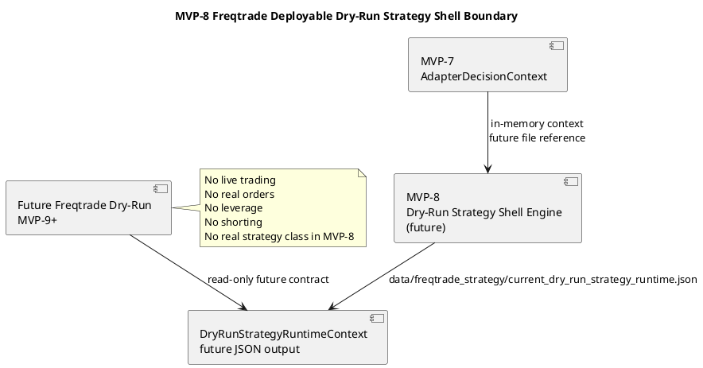
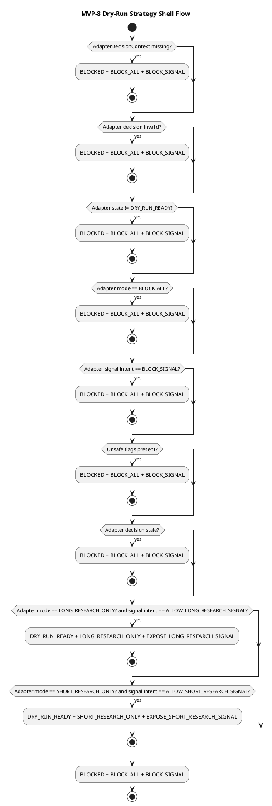

# SPEC-009-Freqtrade-Deployable-Dry-Run-Strategy

## Background

MVP-8 defines the contract for a future deployable Freqtrade-compatible dry-run strategy shell that consumes the `AdapterDecisionContext` produced by MVP-7.

This phase is design-only. It does not implement a real Freqtrade strategy class, does not launch Freqtrade, does not connect to Binance, does not create API keys, and does not place orders.

The purpose is to define a safe deployable-shell-facing contract before any runtime strategy shell implementation exists. The strategy shell is a read-only signal-exposure layer — it may expose research-gated dry-run signal methods to a future Freqtrade dry-run environment, but it must never execute orders or enable live trading.

MVP-8 defines a deployable dry-run strategy shell contract only; any actual Freqtrade class implementation remains future-scoped unless explicitly approved later.

## Requirements

### Must Have

- Consume `AdapterDecisionContext` from MVP-7 as the upstream safety gate.
- Define a future file input reference:
  - `data/strategy_adapter/current_adapter_decision.json`
- Define deployable-shell-side fail-closed behavior.
- Define dry-run-only strategy shell behavior.
- Define read-only signal-exposure contract.
- Define allowed signal actions:
  - expose long research signal
  - expose short research signal
  - block signal
  - no signal
- Define explicit safety defaults.
- Define future output contract:
  - `data/freqtrade_strategy/current_dry_run_strategy_runtime.json`
- Define future schema:
  - `schemas/dry_run_strategy_runtime.schema.json`
- Keep MVP-8 design-only before implementation.

### Should Have

- Use deterministic priority-ordered fail-closed rules.
- Preserve reason codes for every blocking decision.
- Preserve version field for future compatibility.
- Include PlantUML diagrams for component and runtime flow design.
- Split implementation into small steps.

### Could Have

- Future human review hooks before signal action is emitted.
- Future dry-run-only strategy simulation tests.
- Future strategy-shell-side signal logging for audit.

### Won't Have

- No Binance integration.
- No real exchange connection.
- No real Freqtrade runtime connection.
- No real deployable strategy class implementation.
- No API keys.
- No live trading.
- No real orders.
- No leverage.
- No shorting.
- No pairlist logic.
- No stake sizing.
- No ROI logic.
- No stoploss logic.
- No order type logic.
- No real entry signal execution.
- No real exit signal execution.
- No production trading logic.
- No strategy shell runtime process in MVP-8.
- No Freqtrade class instantiation in MVP-8.

## Method

### Contract Inputs

MVP-8 consumes the MVP-7 `AdapterDecisionContext`.

Future file input reference:

```text
data/strategy_adapter/current_adapter_decision.json
```

MVP-8 does not implement file reading yet. File reading is future implementation work.

### Future Output

MVP-8 designs the future dry-run strategy runtime output:

```text
data/freqtrade_strategy/current_dry_run_strategy_runtime.json
```

This future output must use atomic writes, ISO-8601 timestamps, enum string values, required reason codes, and version `"1.0"`.

### DryRunStrategyState

```text
DISABLED
DRY_RUN_READY
BLOCKED
UNKNOWN
```

### DryRunStrategyMode

```text
LONG_RESEARCH_ONLY
SHORT_RESEARCH_ONLY
BLOCK_ALL
```

### DryRunSignalAction

```text
EXPOSE_LONG_RESEARCH_SIGNAL
EXPOSE_SHORT_RESEARCH_SIGNAL
BLOCK_SIGNAL
NO_SIGNAL
```

### DryRunStrategyRuntimeContext

Fields:

```text
timestamp
status
strategy_state
strategy_mode
signal_action
adapter_state
adapter_mode
adapter_signal_intent
dry_run
live_trading_enabled
real_orders_enabled
leverage_enabled
shorting_enabled
freqtrade_runtime_allowed
strategy_class_allowed
populate_indicators_allowed
populate_entry_trend_allowed
populate_exit_trend_allowed
order_execution_allowed
reason_codes              # tuple[str, ...] in Python model, list[str] in JSON output
input_refs
safety_flags
data_quality
version
```

Default version:

```text
1.0
```

### Safety Defaults

```text
dry_run: true
live_trading_enabled: false
real_orders_enabled: false
leverage_enabled: false
shorting_enabled: false
freqtrade_runtime_allowed: false
strategy_class_allowed: false
populate_indicators_allowed: false
populate_entry_trend_allowed: false
populate_exit_trend_allowed: false
order_execution_allowed: false
strategy_state: BLOCKED
strategy_mode: BLOCK_ALL
signal_action: BLOCK_SIGNAL
version: "1.0"
```

### Fail-Closed Rules

Priority order:

**Blocking rules (always BLOCKED + BLOCK_ALL + BLOCK_SIGNAL):**

1. Missing `AdapterDecisionContext` => `BLOCKED + BLOCK_ALL + BLOCK_SIGNAL`
2. Invalid `AdapterDecisionContext` => `BLOCKED + BLOCK_ALL + BLOCK_SIGNAL`
3. Adapter state not `DRY_RUN_READY` => `BLOCKED + BLOCK_ALL + BLOCK_SIGNAL`
4. Adapter mode `BLOCK_ALL` => `BLOCKED + BLOCK_ALL + BLOCK_SIGNAL`
5. Adapter signal intent `BLOCK_SIGNAL` => `BLOCKED + BLOCK_ALL + BLOCK_SIGNAL`
6. `dry_run == false` => `BLOCKED + BLOCK_ALL + BLOCK_SIGNAL`
7. `live_trading_enabled == true` => `BLOCKED + BLOCK_ALL + BLOCK_SIGNAL`
8. `real_orders_enabled == true` => `BLOCKED + BLOCK_ALL + BLOCK_SIGNAL`
9. `leverage_enabled == true` => `BLOCKED + BLOCK_ALL + BLOCK_SIGNAL`
10. `shorting_enabled == true` => `BLOCKED + BLOCK_ALL + BLOCK_SIGNAL`
11. Stale adapter decision context => `BLOCKED + BLOCK_ALL + BLOCK_SIGNAL`
12. Unsupported adapter mode or signal intent => `BLOCKED + BLOCK_ALL + BLOCK_SIGNAL`

**Allowed dry-run research signal rules:**

13. `DRY_RUN_READY + LONG_RESEARCH_ONLY + ALLOW_LONG_RESEARCH_SIGNAL` => `DRY_RUN_READY + LONG_RESEARCH_ONLY + EXPOSE_LONG_RESEARCH_SIGNAL`
14. `DRY_RUN_READY + SHORT_RESEARCH_ONLY + ALLOW_SHORT_RESEARCH_SIGNAL` => `DRY_RUN_READY + SHORT_RESEARCH_ONLY + EXPOSE_SHORT_RESEARCH_SIGNAL`

**Final fallback:**

15. Any other state => `BLOCKED + BLOCK_ALL + BLOCK_SIGNAL`

### Mapping Rules

| Input Adapter State | Input Adapter Mode | Input Signal Intent | Strategy State | Strategy Mode | Signal Action |
|---|---|---|---|---|---|
| DRY_RUN_READY | LONG_RESEARCH_ONLY | ALLOW_LONG_RESEARCH_SIGNAL | DRY_RUN_READY | LONG_RESEARCH_ONLY | EXPOSE_LONG_RESEARCH_SIGNAL |
| DRY_RUN_READY | SHORT_RESEARCH_ONLY | ALLOW_SHORT_RESEARCH_SIGNAL | DRY_RUN_READY | SHORT_RESEARCH_ONLY | EXPOSE_SHORT_RESEARCH_SIGNAL |
| BLOCKED | any | any | BLOCKED | BLOCK_ALL | BLOCK_SIGNAL |
| DISABLED | any | any | BLOCKED | BLOCK_ALL | BLOCK_SIGNAL |
| UNKNOWN | any | any | BLOCKED | BLOCK_ALL | BLOCK_SIGNAL |
| any | BLOCK_ALL | any | BLOCKED | BLOCK_ALL | BLOCK_SIGNAL |
| any | any | BLOCK_SIGNAL | BLOCKED | BLOCK_ALL | BLOCK_SIGNAL |

### Reason Codes

Every blocking or allowed output must include deterministic reason codes. Expected strings:

```text
MISSING_ADAPTER_DECISION_CONTEXT
INVALID_ADAPTER_DECISION_CONTEXT
ADAPTER_NOT_DRY_RUN_READY
ADAPTER_MODE_BLOCK_ALL
ADAPTER_SIGNAL_BLOCKED
DRY_RUN_DISABLED
LIVE_TRADING_ENABLED
REAL_ORDERS_ENABLED
LEVERAGE_ENABLED
SHORTING_ENABLED
STALE_ADAPTER_DECISION_CONTEXT
UNSUPPORTED_ADAPTER_MODE
UNSUPPORTED_ADAPTER_SIGNAL_INTENT
LONG_RESEARCH_SIGNAL_EXPOSED
SHORT_RESEARCH_SIGNAL_EXPOSED
DEFAULT_BLOCK_SIGNAL
CALCULATION_ERROR
```

`reason_codes` must be included in every `DryRunStrategyRuntimeContext` output, with at least one code explaining the decision.

### Deployable Dry-Run Strategy Boundary

A future strategy shell may read the adapter decision context, but must fail closed if the context is missing, stale, invalid, unsafe, or blocking.

These restrictions intentionally mirror the MVP-7 / SPEC-008 strategy adapter boundary and remain stricter than any future Freqtrade runtime integration.

The strategy shell boundary must not:

- create real orders
- enable live trading
- enable leverage
- enable shorting
- contain pairlist logic
- contain stake sizing
- contain ROI logic
- contain stoploss logic
- contain order type logic
- contain real entry execution logic
- contain real exit execution logic
- bypass `AdapterDecisionContext`
- bypass `StrategyContext`
- bypass `FreqtradeBridgeContext`

Future strategy shell may read `AdapterDecisionContext`.
Future strategy shell may expose dry-run-only research signal action.
Future strategy shell must not place orders.
Future strategy shell must not create real Freqtrade strategy execution.
Future strategy shell must not enable live trading.
Future strategy shell must not enable leverage.
Future strategy shell must not enable shorting.
Future strategy shell may only expose research-gated dry-run signal methods.
Any Freqtrade-compatible class must remain future-scoped and dry-run-only.

### Config Design

Future config file:

```text
configs/dry_run_strategy.yaml
```

Defaults:

```yaml
stale_adapter_decision_seconds: 300
max_context_age_seconds: 300
dry_run_required: true
live_trading_enabled: false
real_orders_enabled: false
leverage_enabled: false
shorting_enabled: false
freqtrade_runtime_allowed: false
strategy_class_allowed: false
populate_indicators_allowed: false
populate_entry_trend_allowed: false
populate_exit_trend_allowed: false
order_execution_allowed: false
expose_long_research_signal: true
expose_short_research_signal: true
unsupported_signal_action: BLOCK_SIGNAL
```

`unsupported_signal_action` is represented as the string `"BLOCK_SIGNAL"` in YAML for readability and maps to `DryRunSignalAction.BLOCK_SIGNAL` in implementation.

`stale_adapter_decision_seconds` validates upstream `AdapterDecisionContext` age before producing `DryRunStrategyRuntimeContext`.
`max_context_age_seconds` is emitted for future strategy-shell-facing consumers as a consumer-side freshness guard, matching SPEC-006, SPEC-007, and SPEC-008.

This file is design-only in SPEC-009 and must not be created during design.

### JSON Schema Design

Future schema file:

```text
schemas/dry_run_strategy_runtime.schema.json
```

The schema should validate required fields, enum values, timestamp format, boolean safety flags, reason codes, data quality, and version.

This schema is design-only in SPEC-009 and must not be created during design.

### Component Diagram



### Runtime Flow Diagram



Unsafe flags include `dry_run == false`, `live_trading_enabled == true`, `real_orders_enabled == true`, `leverage_enabled == true`, `shorting_enabled == true`.

## Implementation

MVP-8 implementation should be split into small, reviewable steps.

### Step 1 — Dry-Run Strategy Runtime Models

Future files:

```text
src/hunter/freqtrade_strategy/__init__.py
src/hunter/freqtrade_strategy/models.py
tests/test_freqtrade_strategy/test_models.py
```

Define:

- `DryRunStrategyState`
- `DryRunStrategyMode`
- `DryRunSignalAction`
- `DryRunStrategyConfig`
- `DryRunStrategyInputRefs`
- `DryRunStrategySafetyFlags`
- `DryRunStrategyDataQuality`
- `DryRunStrategyRuntimeContext`

### Step 2 — Dry-Run Strategy Runtime Engine

Future files:

```text
src/hunter/freqtrade_strategy/engine.py
tests/test_freqtrade_strategy/test_engine.py
```

Define:

- `build_dry_run_strategy_runtime_context(...)`
- `validate_dry_run_strategy_inputs(...)`
- `is_stale_adapter_decision(...)`
- `map_adapter_to_strategy_mode(...)`
- `map_adapter_to_signal_action(...)`
- `build_safety_flags(...)`

### Step 3 — Dry-Run Strategy Runtime JSON Writer

Future files:

```text
src/hunter/freqtrade_strategy/writer.py
tests/test_freqtrade_strategy/test_writer.py
```

Define:

- `dry_run_strategy_runtime_context_to_dict(...)`
- `atomic_write_json(...)`
- `write_dry_run_strategy_runtime_context(...)`

### Step 4 — Integration Tests

Future file:

```text
tests/test_freqtrade_strategy/test_integration.py
```

Test:

- long research signal exposure flow
- short research signal exposure flow
- blocked signal flow
- stale adapter decision
- unsafe flags
- JSON output
- atomic writes
- no Freqtrade class
- no Freqtrade runtime
- no Binance
- no live trading
- no leverage
- no shorting

### Step 5 — Final Review

Review implementation against SPEC-009 and safety constraints.

## Milestones

1. Dry-run strategy runtime models complete.
2. Dry-run strategy runtime engine complete.
3. Dry-run strategy runtime JSON writer complete.
4. Integration tests complete.
5. Final review complete.

## Gathering Results

Success criteria:

- All tests pass.
- Strategy shell remains dry-run only.
- Missing, stale, invalid, unsafe, or blocking adapter decision fails closed.
- No Binance integration exists.
- No real exchange connection exists.
- No real Freqtrade runtime connection exists.
- No real deployable strategy class exists.
- No API keys exist.
- No live trading exists.
- No real order execution exists.
- No leverage exists.
- No shorting exists.
- No real entry/exit execution logic exists.
- JSON schema remains future work.
- Config YAML remains future work unless explicitly implemented in a later step.

Failure criteria:

- Any live trading flag becomes enabled.
- Any real order path appears.
- Any exchange connection appears.
- Any real Freqtrade runtime connection appears.
- Any real deployable strategy class appears in MVP-8 design.
- Any leverage or shorting behavior appears.
- Any unsafe input produces a non-blocking result.

## Resolved Assumptions

1. MVP-8 defines a deployable dry-run strategy shell contract only; any actual Freqtrade class implementation remains future-scoped unless explicitly approved later.
2. MVP-8 may design future JSON output, but does not implement it yet.
3. Exposed signals are research-only and must not execute orders.
4. Freqtrade live mode remains forbidden.

## Safety

Explicitly stated:

- No Binance integration.
- No real exchange connection.
- No real Freqtrade runtime connection.
- No real deployable strategy class.
- No live trading.
- No API keys.
- No order execution.
- No leverage.
- No shorting.
- No real entry/exit execution logic.
- No pairlist/stake/ROI/stoploss/order-type logic.
- Fail-closed by default.
- Dry-run only.

## Need Professional Help in Developing Your Architecture?

Please contact me at [sammuti.com](https://sammuti.com) :)
