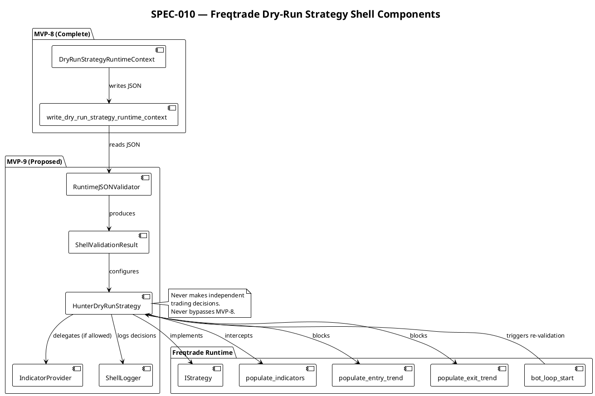
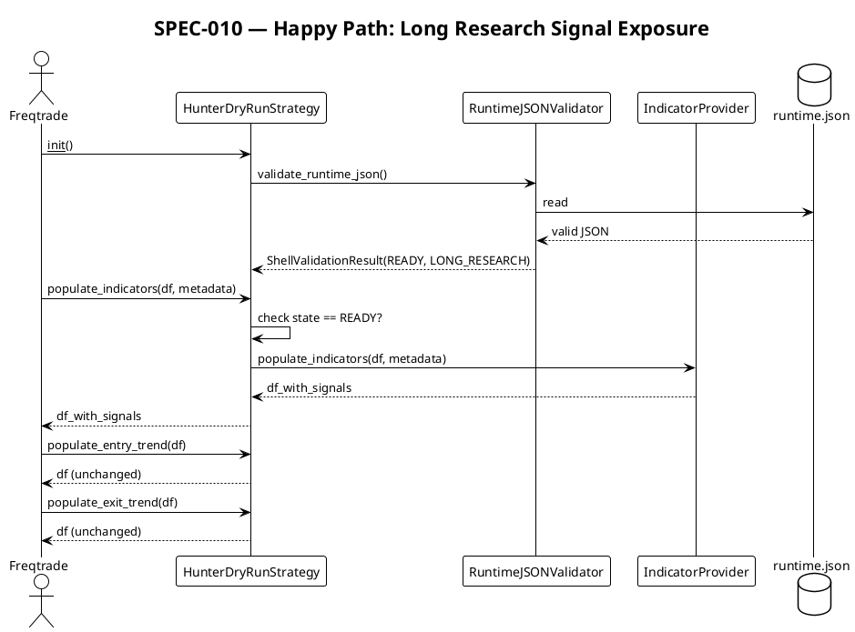
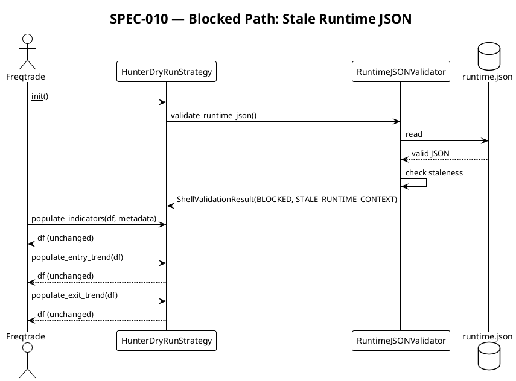

# SPEC-010 — Freqtrade Dry-Run Strategy Shell

> **Status:** Draft  
> **Version:** 0.1.0-draft  
> **Date:** 2026-06-18  
> **Depends on:** SPEC-009 (MVP-8 complete), MVP-0 through MVP-8  
> **Next:** MVP-9 implementation (not started)

---

## 1. Background

MVP-8 (SPEC-009) produced a fail-closed, deterministic `DryRunStrategyRuntimeContext` that encodes whether a Freqtrade-compatible strategy is permitted to expose research-only signals. The runtime JSON is written atomically to:

```
data/freqtrade_strategy/current_dry_run_strategy_runtime.json
```

MVP-9 closes the loop by designing a **deployable Freqtrade strategy shell** that:
1. Reads the runtime JSON at strategy-load time.
2. Validates it (staleness, schema, safety flags).
3. Exposes **only** research signals (`populate_indicators`) when the runtime permits.
4. **Never** makes independent trading decisions.
5. **Never** bypasses MVP-5 → MVP-6 → MVP-7 → MVP-8 safety chain.

The shell is a **thin adapter** — not a strategy in the traditional sense. It does not contain pairlists, stoplosses, ROI tables, or order logic. It is a **safety gate** wrapped around Freqtrade's `IStrategy` interface.

---

## 2. Requirements (MoSCoW)

### Must Have

| ID | Requirement | Rationale |
|---|---|---|
| M1 | Consume `data/freqtrade_strategy/current_dry_run_strategy_runtime.json` at strategy init time. | Single source of truth for safety decisions. |
| M2 | Fail closed if runtime JSON is missing, invalid, stale, or blocked. | Prevents silent bypass of MVP-8 safety chain. |
| M3 | Validate `dry_run=True`, `live_trading_enabled=False`, `real_orders_enabled=False`, `leverage_enabled=False`, `shorting_enabled=False` in runtime JSON. | Hard safety invariants — any deviation blocks. |
| M4 | Only call `populate_indicators()` when `signal_action` is `EXPOSE_LONG_RESEARCH_SIGNAL` or `EXPOSE_SHORT_RESEARCH_SIGNAL`. | Research-only signal exposure (metadata/columns only, no real trade signals). |
| M5 | Block `populate_entry_trend()`, `populate_exit_trend()`, and `custom_stoploss()` unconditionally. | No real entry/exit execution logic. |
| M6 | Block `order_types`, `stoploss`, `trailing_stop`, `leverage`, and `minimal_roi` from being set to non-safe values. | Prevents accidental trading configuration. |
| M7 | Log every decision (allow/block) with deterministic reason code. | Audit trail for compliance. |
| M8 | Emit a single `strategy_state` string (`DRY_RUN_READY`, `BLOCKED`, `DISABLED`, `UNKNOWN`) that Freqtrade's `bot_loop_start()` can read. | Freqtrade-native integration point. |
| M9 | Keep all state in-memory; no database, no network, no exchange calls from the shell. | Minimizes attack surface. |
| M10 | Be importable as a standard Python module inside a Freqtrade `user_data/strategies/` directory. | Deployment compatibility. |

### Should Have

| ID | Requirement | Rationale |
|---|---|---|
| S1 | Re-read runtime JSON on each `bot_loop_start()` cycle to react to staleness. | Dynamic safety without restart. |
| S2 | Cache parsed runtime context for the duration of one candle to avoid disk I/O per pair. | Performance at scale. |
| S3 | Expose a `get_strategy_state()` helper for external monitoring (e.g., health checks). | Observability. |
| S4 | Include a `version` field in the shell's own metadata for traceability. | Version drift detection. |

### Could Have

| ID | Requirement | Rationale |
|---|---|---|
| C1 | Emit Prometheus-style metrics for `hunter_strategy_state`, `hunter_signal_action`, `hunter_block_reason`. | Operational monitoring. |
| C2 | Support a `HUNTER_STRATEGY_DEBUG=1` environment variable that prints runtime JSON to stdout. | Local debugging aid. |

### Won't Have (Explicitly Out of Scope)

| ID | Requirement | Rationale |
|---|---|---|
| W1 | No Binance integration. | Handled by Freqtrade, not this shell. |
| W2 | No real exchange connection. | Handled by Freqtrade, not this shell. |
| W3 | No real Freqtrade runtime connection at design time. | Freqtrade is the runtime; shell is loaded by it. Interface boundary only, not a real runtime/exchange connection. |
| W4 | No API keys. | Handled by Freqtrade configuration. |
| W5 | No live trading. | Enforced by `live_trading_enabled=False` invariant. |
| W6 | No real order execution. | `order_execution_allowed=False` invariant. |
| W7 | No leverage. | `leverage_enabled=False` invariant. |
| W8 | No shorting. | `shorting_enabled=False` invariant. |
| W9 | No real entry/exit execution logic. | `populate_entry_trend` and `populate_exit_trend` are blocked — never set `enter_long`, `enter_short`, `exit_long`, or `exit_short` columns. |
| W10 | No pairlist configuration. | Freqtrade's pairlist handler is responsible. |
| W11 | No stoploss, ROI, or trailing stop logic. | Freqtrade's strategy base class is responsible. |
| W12 | No config YAML for the shell. | Runtime JSON is the single config source. |
| W13 | No JSON schema validation at runtime. | Schema validation is a future CI/build step, not runtime. |
| W14 | No ML, no optimization, no curve fitting. | Deterministic safety gate only. |

---

## 3. Method

### 3.1 Design Philosophy

The shell is a **safety adapter**, not a trading strategy. It wraps Freqtrade's `IStrategy` and intercepts the lifecycle methods that could lead to trading actions. The shell delegates research signal work to a user-provided `IndicatorProvider` (future), but the shell itself never decides to enter or exit a position.

Key principles:
- **Fail closed**: any error, missing file, or unsafe flag → `BLOCKED`. No active research signal and no real entry/exit signal.
- **Deterministic**: same runtime JSON → same strategy state, every time.
- **Transparent**: all decisions are logged with reason codes.
- **Minimal**: no state, no network, no storage beyond the runtime JSON read.

### 3.2 Runtime JSON Contract

The shell reads the JSON produced by MVP-8's `write_dry_run_strategy_runtime_context()`. The expected top-level structure:

```json
{
  "timestamp": "2025-01-15T12:00:00Z",
  "status": "DRY_RUN_READY",
  "strategy_state": "DRY_RUN_READY",
  "strategy_mode": "LONG_RESEARCH_ONLY",
  "signal_action": "EXPOSE_LONG_RESEARCH_SIGNAL",
  "adapter_state": "DRY_RUN_READY",
  "adapter_mode": "LONG_RESEARCH_ONLY",
  "adapter_signal_intent": "ALLOW_LONG_RESEARCH_SIGNAL",
  "dry_run": true,
  "live_trading_enabled": false,
  "real_orders_enabled": false,
  "leverage_enabled": false,
  "shorting_enabled": false,
  "freqtrade_runtime_allowed": false,
  "strategy_class_allowed": false,
  "populate_indicators_allowed": false,
  "populate_entry_trend_allowed": false,
  "populate_exit_trend_allowed": false,
  "order_execution_allowed": false,
  "reason_codes": ["LONG_RESEARCH_SIGNAL_EXPOSED"],
  "input_refs": {
    "adapter_decision": "data/strategy_adapter/current_adapter_decision.json",
    "dry_run_strategy_runtime": "data/freqtrade_strategy/current_dry_run_strategy_runtime.json"
  },
  "safety_flags": {
    "dry_run": true,
    "live_trading_enabled": false,
    "real_orders_enabled": false,
    "leverage_enabled": false,
    "shorting_enabled": false,
    "freqtrade_runtime_allowed": false,
    "strategy_class_allowed": false,
    "populate_indicators_allowed": false,
    "populate_entry_trend_allowed": false,
    "populate_exit_trend_allowed": false,
    "order_execution_allowed": false,
    "max_context_age_seconds": 300
  },
  "data_quality": {
    "adapter_decision_present": true,
    "adapter_decision_valid": true,
    "adapter_decision_stale": false,
    "reason": "LONG_RESEARCH_SIGNAL_EXPOSED"
  },
  "version": "1.0"
}
```

### 3.3 Validation Rules (Priority Order)

When the shell reads the runtime JSON, it applies these checks in order. The first failure determines the `strategy_state`.

| Priority | Check | Failure State | Reason Code |
|---|---|---|---|
| 1 | File exists | `BLOCKED` | `RUNTIME_JSON_MISSING` |
| 2 | Valid JSON | `BLOCKED` | `RUNTIME_JSON_INVALID` |
| 3 | `version` == "1.0" | `BLOCKED` | `RUNTIME_JSON_VERSION_MISMATCH` |
| 4 | `dry_run` == `true` | `BLOCKED` | `DRY_RUN_DISABLED` |
| 5 | `live_trading_enabled` == `false` | `BLOCKED` | `LIVE_TRADING_ENABLED` |
| 6 | `real_orders_enabled` == `false` | `BLOCKED` | `REAL_ORDERS_ENABLED` |
| 7 | `leverage_enabled` == `false` | `BLOCKED` | `LEVERAGE_ENABLED` |
| 8 | `shorting_enabled` == `false` | `BLOCKED` | `SHORTING_ENABLED` |
| 9 | `timestamp` is ISO-8601 with Z suffix | `BLOCKED` | `RUNTIME_JSON_INVALID_TIMESTAMP` |
| 10 | `timestamp` is not older than `max_context_age_seconds` | `BLOCKED` | `STALE_RUNTIME_CONTEXT` |
| 11 | `strategy_state` is in enum | `UNKNOWN` | `INVALID_STRATEGY_STATE` |
| 12 | `signal_action` is in enum | `BLOCKED` | `INVALID_SIGNAL_ACTION` |
| 13 | `signal_action` == `EXPOSE_LONG_RESEARCH_SIGNAL` or `EXPOSE_SHORT_RESEARCH_SIGNAL` | `BLOCKED` | `SIGNAL_BLOCKED` |
| 14 | `strategy_state` == `DRY_RUN_READY` | `BLOCKED` | `NOT_DRY_RUN_READY` |

**Note**: Rules 4–8 are redundant with MVP-8's safety_flags but are re-checked at the shell boundary for defense-in-depth.

### 3.4 Strategy State Machine

```
+-------------+     read runtime JSON     +------------------+
|   START     | -------------------------> |  VALIDATE_JSON   |
+-------------+                           +------------------+
                                                |
                                                | fail
                                                v
                                          +-------------+
                                          |   BLOCKED   |
                                          +-------------+
                                                |
                                                | pass
                                                v
                                          +------------------+
                                          | CHECK_SAFETY_FLAGS|
                                          +------------------+
                                                |
                                                | fail
                                                v
                                          +-------------+
                                          |   BLOCKED   |
                                          +-------------+
                                                |
                                                | pass
                                                v
                                          +------------------+
                                          | CHECK_STALENESS  |
                                          +------------------+
                                                |
                                                | fail
                                                v
                                          +-------------+
                                          |   BLOCKED   |
                                          +-------------+
                                                |
                                                | pass
                                                v
                                          +------------------+
                                          | CHECK_SIGNAL     |
                                          +------------------+
                                                |
                                                | allow
                                                v
                                          +------------------+
                                          | DRY_RUN_READY    |
                                          | (expose signals) |
                                          +------------------+
                                                |
                                                | block
                                                v
                                          +-------------+
                                          |   BLOCKED   |
                                          +-------------+
```

### 3.5 Freqtrade Interface Mapping

The shell implements Freqtrade's `IStrategy` interface. The following methods are intercepted:

| Freqtrade Method | Shell Behavior | Condition |
|---|---|---|
| `__init__()` | Read runtime JSON, validate, set `self._strategy_state`. | Always. |
| `bot_loop_start()` | Re-read runtime JSON if cache expired. | If `S1` (Should Have) implemented. |
| `populate_indicators()` | Call user `IndicatorProvider.populate()` if `DRY_RUN_READY` + allowed signal. Returns dataframe with research-only metadata/columns only (no real trade signals). | `signal_action` is `EXPOSE_*`. |
| `populate_indicators()` | Return dataframe unchanged if `BLOCKED`. | `signal_action` is `BLOCK_SIGNAL` or `NO_SIGNAL`. |
| `populate_entry_trend()` | Return dataframe unchanged (no entry signals). `enter_long` and `enter_short` execution columns must never be set. | Always blocked. |
| `populate_exit_trend()` | Return dataframe unchanged (no exit signals). `exit_long` and `exit_short` execution columns must never be set. | Always blocked. |
| `custom_stoploss()` | Return `None` (no custom stoploss). | Always blocked. |
| `leverage()` | Return `1.0` (no leverage). | Always blocked. |
| `confirm_trade_entry()` | Return `False` (block all trades). | Always blocked. |
| `confirm_trade_exit()` | Return `False` (block all exits). | Always blocked. |

### 3.6 Reason Codes

The shell emits its own reason codes, distinct from MVP-8's, to trace decisions at the Freqtrade boundary:

```python
# Shell-specific reason codes (runtime validation)
RUNTIME_JSON_MISSING = "RUNTIME_JSON_MISSING"
RUNTIME_JSON_INVALID = "RUNTIME_JSON_INVALID"
RUNTIME_JSON_VERSION_MISMATCH = "RUNTIME_JSON_VERSION_MISMATCH"
RUNTIME_JSON_INVALID_TIMESTAMP = "RUNTIME_JSON_INVALID_TIMESTAMP"
STALE_RUNTIME_CONTEXT = "STALE_RUNTIME_CONTEXT"
INVALID_STRATEGY_STATE = "INVALID_STRATEGY_STATE"
INVALID_SIGNAL_ACTION = "INVALID_SIGNAL_ACTION"
SIGNAL_BLOCKED = "SIGNAL_BLOCKED"
NOT_DRY_RUN_READY = "NOT_DRY_RUN_READY"

# Inherited from MVP-8 (safety flag failures)
DRY_RUN_DISABLED = "DRY_RUN_DISABLED"
LIVE_TRADING_ENABLED = "LIVE_TRADING_ENABLED"
REAL_ORDERS_ENABLED = "REAL_ORDERS_ENABLED"
LEVERAGE_ENABLED = "LEVERAGE_ENABLED"
SHORTING_ENABLED = "SHORTING_ENABLED"
```

---

## 4. Implementation

### 4.1 Proposed Package Layout

```
src/hunter/
├── dry_run_strategy/          # MVP-8 (complete)
│   ├── __init__.py
│   ├── models.py
│   ├── engine.py
│   └── writer.py
├── freqtrade_shell/             # MVP-9 (proposed)
│   ├── __init__.py              # Public API exports
│   ├── models.py                # ShellState, ShellValidationResult, ShellConfig
│   ├── validator.py             # Runtime JSON validation (14 priority rules)
│   ├── adapter.py               # Freqtrade IStrategy adapter (HunterDryRunStrategy)
│   └── logger.py                # Structured logging for shell decisions
└── tests/
    └── test_freqtrade_shell/
        ├── __init__.py
        ├── test_models.py         # ShellState, ShellValidationResult tests
        ├── test_validator.py      # 14 validation rule tests
        ├── test_adapter.py        # IStrategy method interception tests
        └── test_integration.py    # End-to-end: mock runtime JSON → adapter → signals
```

### 4.2 Proposed File Responsibilities

#### `src/hunter/freqtrade_shell/models.py`

- `ShellState` enum: `INITIALIZING`, `READY`, `BLOCKED`, `ERROR`, `STALE`
- `ShellValidationResult` dataclass: `is_valid`, `strategy_state`, `reason_code`, `runtime_context` (optional)
- `ShellConfig` dataclass: `runtime_json_path`, `max_age_seconds`, `revalidate_interval_seconds`
- `IndicatorProvider` ABC (future): `populate_indicators(df, metadata)` → `df`

#### `src/hunter/freqtrade_shell/validator.py`

- `validate_runtime_json(path, now, config)` → `ShellValidationResult`
- 14 priority-ordered checks
- Deterministic: first failure wins
- Fail-closed: any exception → `BLOCKED` + `RUNTIME_JSON_INVALID`

#### `src/hunter/freqtrade_shell/adapter.py`

- `HunterDryRunStrategy(IStrategy)` class:
  - `__init__()`: calls `validate_runtime_json()`, stores result
  - `populate_indicators()`: delegates to `IndicatorProvider` if valid, else no-op
  - `populate_entry_trend()`: no-op (returns df unchanged)
  - `populate_exit_trend()`: no-op (returns df unchanged)
  - `custom_stoploss()`: returns `None`
  - `leverage()`: returns `1.0`
  - `confirm_trade_entry()`: returns `False`
  - `confirm_trade_exit()`: returns `False`
  - `bot_loop_start()`: re-validates if cache expired (optional)

#### `src/hunter/freqtrade_shell/logger.py`

- `log_decision(state, reason_code, runtime_version)` → structured log line
- `log_block(method_name, reason_code)` → structured log line
- `log_allow(method_name, signal_action)` → structured log line

### 4.3 Test Plan

| Test Suite | Tests | Coverage |
|---|---|---|
| `test_models.py` | ~20 | ShellState, ShellValidationResult, ShellConfig defaults, frozen immutability |
| `test_validator.py` | ~30 | All 14 validation rules, priority order, stale detection, invalid JSON, missing file, version mismatch, timestamp format |
| `test_adapter.py` | ~25 | `populate_indicators` allow/block, `populate_entry_trend` no-op, `populate_exit_trend` no-op, `custom_stoploss` returns None, `leverage` returns 1.0, `confirm_trade_entry` returns False, `confirm_trade_exit` returns False, `bot_loop_start` re-validation |
| `test_integration.py` | ~20 | Mock runtime JSON → adapter init → `populate_indicators` → verify signals present/absent, verify no entry/exit signals, verify logging |
| **Total** | **~95** | |

### 4.4 Safety Invariants (Hard Constraints)

These are **never** violated, even in test code:

1. `populate_entry_trend()` never adds entry signals.
2. `populate_exit_trend()` never adds exit signals.
3. `confirm_trade_entry()` always returns `False`.
4. `confirm_trade_exit()` always returns `False`.
5. `leverage()` always returns `1.0`.
6. `custom_stoploss()` always returns `None`.
7. `dry_run` must be `True` in runtime JSON; otherwise `BLOCKED`.
8. `live_trading_enabled` must be `False`; otherwise `BLOCKED`.
9. `real_orders_enabled` must be `False`; otherwise `BLOCKED`.
10. `leverage_enabled` must be `False`; otherwise `BLOCKED`.
11. `shorting_enabled` must be `False`; otherwise `BLOCKED`.
12. No network calls from shell code.
13. No exchange API calls from shell code.
14. No database writes from shell code.
15. No independent trading decisions from shell code. The shell must not bypass MVP-5, MVP-6, MVP-7, or MVP-8 safety contexts.

---

## 5. Milestones

### MVP-9 Milestones

| Milestone | Description | Target Tests | Deliverable |
|---|---|---|---|
| M9.1 | Shell Models + Validator | ~50 tests | `models.py`, `validator.py`, `test_models.py`, `test_validator.py` |
| M9.2 | Freqtrade Adapter | ~25 tests | `adapter.py`, `test_adapter.py` |
| M9.3 | Integration Tests | ~20 tests | `test_integration.py` (mock runtime JSON → adapter) |
| M9.4 | Final Review | — | Review checklist, safety audit, version bump to `0.9.0-dev` |

---

## 6. Gathering Results

### Success Criteria

- [ ] All ~95 tests pass.
- [ ] `populate_indicators()` exposes signals only when runtime JSON permits.
- [ ] `populate_entry_trend()` and `populate_exit_trend()` never emit signals.
- [ ] All 14 validation rules are tested individually.
- [ ] Stale runtime JSON is detected and blocks.
- [ ] Invalid runtime JSON is detected and blocks.
- [ ] Missing runtime JSON is detected and blocks.
- [ ] All safety flag violations are detected and blocked.
- [ ] No network calls, no exchange calls, no database writes from shell.
- [ ] No trading decisions made independently by shell.
- [ ] Version bumped to `0.9.0-dev`.

### Failure Modes

| Failure | Mitigation |
|---|---|
| Runtime JSON missing | `BLOCKED` + `RUNTIME_JSON_MISSING` |
| Runtime JSON corrupted | `BLOCKED` + `RUNTIME_JSON_INVALID` |
| Runtime JSON stale | `BLOCKED` + `STALE_RUNTIME_CONTEXT` |
| Safety flag violation | `BLOCKED` + specific reason code |
| Freqtrade interface change | Adapter is thin; changes are localized |
| IndicatorProvider exception | Logged; `populate_indicators` returns df unchanged |

---

## 7. Need Professional Help in Developing Your Architecture?

This SPEC is designed for **agent-first implementation**. The architecture is intentionally minimal:

- **No microservices**: single Python package.
- **No state management**: runtime JSON is the only input.
- **No network layer**: Freqtrade handles all exchange communication.
- **No configuration sprawl**: runtime JSON is the single config source.

If the Freqtrade `IStrategy` interface evolves, the adapter is the only file that changes. The validator and models are interface-agnostic.

---

## 8. PlantUML Diagrams

### 8.1 Component Diagram



### 8.2 Sequence Diagram — Signal Exposure



### 8.3 Sequence Diagram — Blocked Path



---

## 9. Step-by-Step MVP-9 Implementation Plan

### Step 1 — Shell Models and Validator

**Files:**
- `src/hunter/freqtrade_shell/__init__.py`
- `src/hunter/freqtrade_shell/models.py`
- `src/hunter/freqtrade_shell/validator.py`
- `tests/test_freqtrade_shell/__init__.py`
- `tests/test_freqtrade_shell/test_models.py`
- `tests/test_freqtrade_shell/test_validator.py`

**Scope:**
- `ShellState` enum
- `ShellValidationResult` dataclass
- `ShellConfig` dataclass
- `validate_runtime_json()` with 14 priority rules
- Tests for all validation rules

**Not allowed:**
- No Freqtrade adapter yet.
- No `IStrategy` imports.
- No indicator logic.
- No network, no exchange, no database.

### Step 2 — Freqtrade Adapter

**Files:**
- `src/hunter/freqtrade_shell/adapter.py`
- `tests/test_freqtrade_shell/test_adapter.py`

**Scope:**
- `HunterDryRunStrategy` class skeleton (no Freqtrade import yet — use ABC or mock)
- Method interception design: `populate_indicators`, `populate_entry_trend`, `populate_exit_trend`
- `custom_stoploss`, `leverage`, `confirm_trade_entry`, `confirm_trade_exit` stubs
- Tests for each method's allow/block behavior

**Not allowed:**
- No real Freqtrade runtime connection.
- No real indicator calculations.
- No entry/exit signal generation.

### Step 3 — Integration Tests

**Files:**
- `tests/test_freqtrade_shell/test_integration.py`

**Scope:**
- Mock runtime JSON → validator → adapter → method calls
- Verify signals exposed when allowed
- Verify signals blocked when not allowed
- Verify no entry/exit signals ever emitted
- Verify logging

**Not allowed:**
- No real Freqtrade runtime.
- No real runtime JSON files (use tmp_path).
- No network.

### Step 4 — Final Review

**Scope:**
- Review SPEC-010 against implementation
- Review all test suites
- Run full test suite (1491 + ~95 new = ~1586)
- Verify safety invariants
- Version bump to `0.9.0-dev`
- Update memory files

---

## 10. Safety Constraints Summary

| Constraint | Enforcement |
|---|---|
| No Binance integration | Shell never imports exchange libraries. |
| No real exchange connection | Shell never opens sockets or HTTP connections. |
| No real Freqtrade runtime connection at design time | Adapter is designed for Freqtrade to load it, not the reverse. |
| No API keys | No key fields in any model. |
| No live trading | `live_trading_enabled=False` is a hard invariant. |
| No real orders | `real_orders_enabled=False` is a hard invariant. |
| No leverage | `leverage_enabled=False` is a hard invariant; `leverage()` returns 1.0. |
| No shorting | `shorting_enabled=False` is a hard invariant. |
| No real entry/exit execution logic | `populate_entry_trend` and `populate_exit_trend` are no-ops. |
| No config YAML | Runtime JSON is the single config source. |
| No JSON schema at runtime | Schema validation is future CI work. |
| No independent trading decisions | Shell only delegates to IndicatorProvider for research signals. Must not bypass MVP-5, MVP-6, MVP-7, or MVP-8 safety contexts. |
| No state persistence | All state in-memory; no database writes. |

---

## 11. Appendix: Interface with MVP-8

The shell is the **consumer** of MVP-8's output. The interface is a JSON file on disk:

```
Producer:  MVP-8 writer → data/freqtrade_strategy/current_dry_run_strategy_runtime.json
Consumer:  MVP-9 shell  → reads at init time (and optionally per bot loop)
```

This is a **pull model**: the shell reads the file when it needs to, rather than MVP-8 pushing to the shell. This decouples the two systems and allows the shell to be tested independently with mock JSON files.

---

*End of SPEC-010 Draft*
