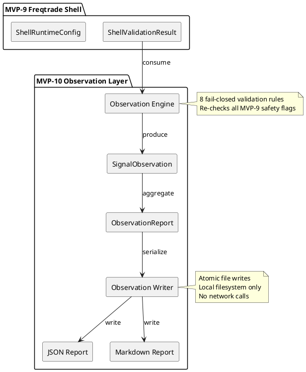
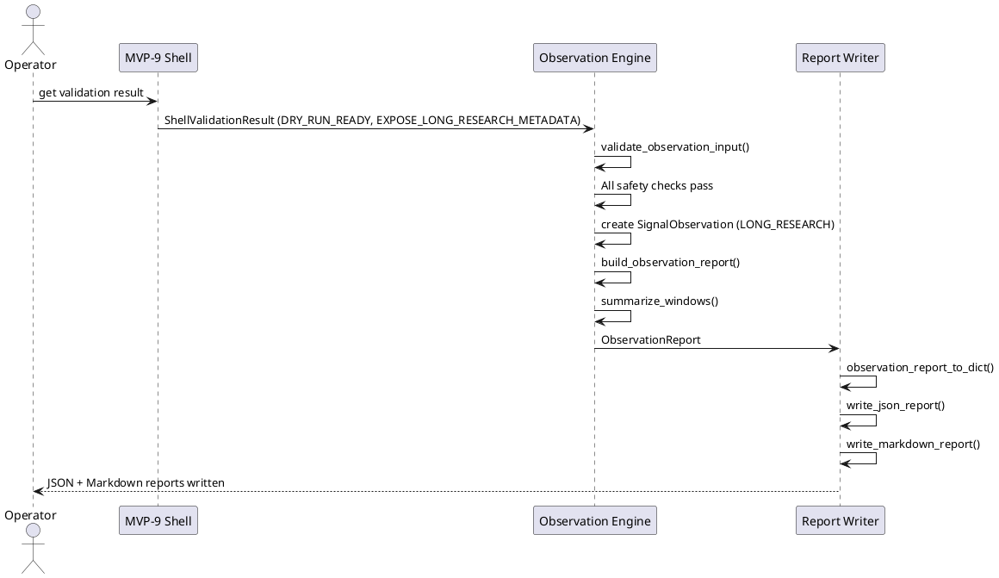
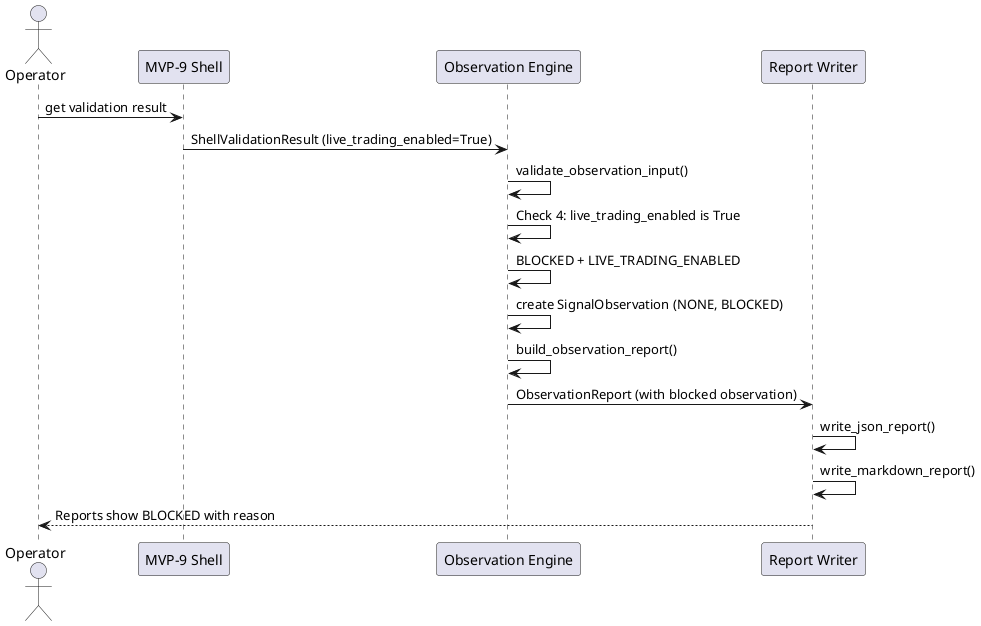

# SPEC-011 — Dry-Run Research Observation & Reports

## 1. Background

After MVP-9, the system produces research-only metadata through the Freqtrade Shell:

- `hunter_research_signal` — `LONG_RESEARCH`, `SHORT_RESEARCH`, or `NONE`
- `hunter_research_reason` — human-readable reason code
- `hunter_shell_state` — `DRY_RUN_READY`, `BLOCKED`, `UNKNOWN`, `DISABLED`
- `hunter_signal_exposure` — `EXPOSE_LONG_RESEARCH_METADATA`, `EXPOSE_SHORT_RESEARCH_METADATA`, `NO_RESEARCH_SIGNAL`, `BLOCKED`

These metadata columns are attached to dataframes but are never consumed by any downstream reporting layer. A human operator must manually inspect dataframe outputs or JSON runtime files to understand what the system observed and why it blocked or allowed research signals. **These metadata columns are not trading signals and must never be interpreted as entry/exit instructions.**

SPEC-011 designs a **Dry-Run Research Observation & Report** layer (MVP-10) that:

1. **Consumes** MVP-9 shell metadata (in-memory or from JSON)
2. **Summarizes** allowed/blocked research signal observations over time
3. **Produces** local JSON and Markdown reports for **human-review only** — these are audit artifacts, not trading signals
4. **Never** makes trading decisions, feeds signals back into execution, or connects to any runtime/exchange

This layer is the final safety boundary before any human considers acting on research output. It is read-only with respect to trading systems and write-only with respect to local report files. Reports must never be consumed by execution, strategy, Freqtrade shell, or order layers.

## 2. Requirements (MoSCoW)

### Must Have

| ID | Requirement | Rationale |
|---|---|---|
| M1 | Consume MVP-9 `ShellValidationResult` or its JSON serialization | The observation layer must read what the shell produced |
| M2 | Summarize research signal history (counts of LONG/SHORT/NONE per time window) | Human operators need aggregate visibility |
| M3 | Report blocking reasons with frequency counts | Understanding why signals are blocked is critical for debugging |
| M4 | Produce deterministic local JSON report | Machine-readable for future tooling |
| M5 | Produce human-readable Markdown report | Immediate operator consumption without tools |
| M6 | Fail-closed: any error in observation produces empty/blocked report with error reason | Never silently drop observations |
| M7 | All reports include timestamp, version, and source context | Audit trail for every report |
| M8 | Reports are written to local filesystem only (no network) | No data leaves the local environment |
| M9 | **Reports must never be consumed by execution, strategy, Freqtrade shell, or order layers** | Reports are human-review artifacts only, not trading signals |

### Should Have

| ID | Requirement | Rationale |
|---|---|---|
| S1 | Time-bucketed summaries (hourly, daily) | Trend analysis over time |
| S2 | Configurable report output paths | Flexibility for different environments |
| S3 | Report rotation / max file count | Prevent unbounded disk growth |

### Could Have

| ID | Requirement | Rationale |
|---|---|---|
| C1 | HTML report generation | Richer formatting than Markdown |
| C2 | Report comparison (diff between two reports) | Track changes over time |

### Won't Have (Explicitly Out of Scope)

| ID | Requirement | Rationale |
|---|---|---|
| W1 | **Any trading decision logic** | Observation layer is read-only |
| W2 | **Signal feedback into execution** | Research signals must never loop back |
| W3 | **Report consumption by execution/strategy/shell/order layers** | Reports are human-review artifacts only, never trading signals |
| W4 | **Freqtrade runtime connection** | No runtime integration at any level |
| W5 | **Binance or any exchange connection** | No exchange APIs |
| W6 | **Real order execution** | No orders, ever |
| W7 | **Leverage configuration** | No position sizing |
| W8 | **Shorting logic** | No directional execution |
| W9 | **Real entry/exit execution logic** | No `enter_long`, `enter_short`, `exit_long`, `exit_short` |
| W10 | **Live trading enablement** | Reports are for research review only |
| W11 | **API keys or secrets** | No authentication needed |
| W12 | **Production deployment instructions** | Local-only reports |
| W13 | **Network calls from report generation** | Reports are local filesystem only |
| W14 | **Database persistence** | Filesystem JSON/Markdown only |
| W15 | **Real-time streaming** | Batch observation only |
| W16 | **Report output feeding back into any MVP layer** | Reports must never be consumed by execution, strategy, shell, or order layers |

## 3. Method

### 3.1 Design Philosophy

The observation layer follows the same fail-closed, deterministic, immutable principles as all previous MVPs:

1. **Read-only with respect to trading systems**: Only consumes shell metadata, never writes to trading contexts
2. **Write-only with respect to local reports**: Only writes to local filesystem, never reads from it during observation
3. **Reports are human-review artifacts only**: Must never be consumed by execution, strategy, Freqtrade shell, or order layers
4. **Deterministic**: Same input always produces same output
5. **Immutable**: Observation records are frozen once created
6. **Audit-trail complete**: Every observation includes full provenance

### 3.2 Input Contract

The observation layer consumes either:

**Option A — In-memory (preferred for tests):**
```python
from hunter.freqtrade_shell.models import ShellValidationResult

result: ShellValidationResult  # From MVP-9 validator or adapter
```

**Option B — JSON file (future disk-reading consumers):**
```json
{
  "timestamp": "2026-06-27T17:00:00Z",
  "shell_state": "DRY_RUN_READY",
  "signal_exposure": "EXPOSE_LONG_RESEARCH_METADATA",
  "reason_codes": ["LONG_RESEARCH_METADATA_EXPOSED"],
  "dry_run": true,
  "live_trading_enabled": false,
  "real_orders_enabled": false,
  "leverage_enabled": false,
  "shorting_enabled": false,
  "version": "1.0"
}
```

The observation layer must validate the input against the same safety invariants as MVP-9:
- `dry_run` must be `true`
- `live_trading_enabled` must be `false`
- `real_orders_enabled` must be `false`
- `leverage_enabled` must be `false`
- `shorting_enabled` must be `false`

Any violation → `BLOCKED` observation with `SAFETY_VIOLATION_DETECTED` reason.

### 3.3 Observation Model Design

#### `ObservationState` (enum)

```python
class ObservationState(str, Enum):
    RECORDED = "RECORDED"      # Successfully observed and recorded
    BLOCKED = "BLOCKED"        # Safety violation or error, not recorded
    SKIPPED = "SKIPPED"        # Duplicate or irrelevant, not recorded
```

#### `SignalObservation` (frozen dataclass)

A single point-in-time observation of a research signal.

```python
@dataclass(frozen=True)
class SignalObservation:
    timestamp: datetime              # When the observation was made
    signal: str                     # "LONG_RESEARCH", "SHORT_RESEARCH", "NONE"
    shell_state: str                # ShellState.value
    signal_exposure: str            # ShellSignalExposure.value
    reason_codes: tuple[str, ...]  # Why this signal was produced
    source_version: str             # "1.0" — MVP-9 runtime version
    observation_version: str        # "1.0" — observation layer version
```

Validation:
- `timestamp` must be timezone-aware
- `signal` must be one of `"LONG_RESEARCH"`, `"SHORT_RESEARCH"`, `"NONE"`
- `shell_state` must be non-empty
- `signal_exposure` must be non-empty
- `reason_codes` must be non-empty tuple
- `source_version` must be non-empty
- `observation_version` must be non-empty

#### `ObservationWindow` (frozen dataclass)

A time-bucketed summary of multiple observations.

```python
@dataclass(frozen=True)
class ObservationWindow:
    window_start: datetime
    window_end: datetime
    window_label: str               # "hourly", "daily", etc.
    total_observations: int
    long_research_count: int
    short_research_count: int
    none_count: int
    blocked_count: int
    reason_frequency: dict[str, int]  # {"LONG_RESEARCH_METADATA_EXPOSED": 5, ...}
```

#### `ObservationReport` (frozen dataclass)

The complete report containing all observations and summaries. **This is a human-review artifact only — must never be consumed by execution, strategy, Freqtrade shell, or order layers.**

```python
@dataclass(frozen=True)
class ObservationReport:
    report_timestamp: datetime
    report_version: str             # "1.0"
    source_path: str                # Where the observations came from
    total_observations: int
    observations: tuple[SignalObservation, ...]
    windows: tuple[ObservationWindow, ...]
    safety_flags: ObservationSafetyFlags
    data_quality: ObservationDataQuality
```

#### `ObservationSafetyFlags` (frozen dataclass)

```python
@dataclass(frozen=True)
class ObservationSafetyFlags:
    dry_run: bool = True
    live_trading_enabled: bool = False
    real_orders_enabled: bool = False
    leverage_enabled: bool = False
    shorting_enabled: bool = False
    network_calls_made: bool = False
    trading_decisions_made: bool = False
```

Validation: all unsafe flags must be False, `dry_run` must be True.

#### `ObservationDataQuality` (frozen dataclass)

```python
@dataclass(frozen=True)
class ObservationDataQuality:
    all_inputs_valid: bool = True
    all_safety_checks_passed: bool = True
    stale_observations_present: bool = False
    reason: str = "VALID"
```

### 3.4 Report Model Design

#### `JsonReport` (frozen dataclass)

```python
@dataclass(frozen=True)
class JsonReport:
    report: ObservationReport
    output_path: str                # "data/observation/current_observation_report.json"
```

#### `MarkdownReport` (frozen dataclass)

```python
@dataclass(frozen=True)
class MarkdownReport:
    report: ObservationReport
    output_path: str                # "data/observation/current_observation_report.md"
```

### 3.5 Fail-Closed Rules

The observation layer implements 8 fail-closed rules in priority order:

| Priority | Check | Failure State | Reason Code |
|---|---|---|---|
| 1 | Input is None | BLOCKED | MISSING_INPUT |
| 2 | Input missing required fields or unsupported version | BLOCKED | INVALID_INPUT |
| 3 | `version` is not `"1.0"` | BLOCKED | UNSUPPORTED_INPUT_VERSION |
| 4 | `dry_run` is not `true` | BLOCKED | DRY_RUN_DISABLED |
| 5 | `live_trading_enabled` is not `false` | BLOCKED | LIVE_TRADING_ENABLED |
| 6 | `real_orders_enabled` is not `false` | BLOCKED | REAL_ORDERS_ENABLED |
| 7 | `leverage_enabled` is not `false` | BLOCKED | LEVERAGE_ENABLED |
| 8 | `shorting_enabled` is not `false` | BLOCKED | SHORTING_ENABLED |
| 9 | Any exception during observation | BLOCKED | OBSERVATION_ERROR |

All failures produce a `SignalObservation` with:
- `signal`: `"NONE"`
- `shell_state`: `"BLOCKED"`
- `signal_exposure`: `"BLOCKED"`
- `reason_codes`: `[<failure_reason>]`

**Blocked observations must still be recorded in reports as audit artifacts, but must never trigger any action or be consumed by execution layers.**

### 3.6 Reason Code Constants

```python
MISSING_INPUT = "MISSING_INPUT"
INVALID_INPUT = "INVALID_INPUT"
UNSUPPORTED_INPUT_VERSION = "UNSUPPORTED_INPUT_VERSION"
DRY_RUN_DISABLED = "DRY_RUN_DISABLED"
LIVE_TRADING_ENABLED = "LIVE_TRADING_ENABLED"
REAL_ORDERS_ENABLED = "REAL_ORDERS_ENABLED"
LEVERAGE_ENABLED = "LEVERAGE_ENABLED"
SHORTING_ENABLED = "SHORTING_ENABLED"
OBSERVATION_ERROR = "OBSERVATION_ERROR"
LONG_RESEARCH_OBSERVED = "LONG_RESEARCH_OBSERVED"
SHORT_RESEARCH_OBSERVED = "SHORT_RESEARCH_OBSERVED"
NO_SIGNAL_OBSERVED = "NO_SIGNAL_OBSERVED"
SAFETY_VIOLATION_DETECTED = "SAFETY_VIOLATION_DETECTED"
```

### 3.7 Report Output Paths

- JSON report: `data/observation/current_observation_report.json`
- Markdown report: `data/observation/current_observation_report.md`
- Historical JSON: `data/observation/history/YYYY-MM-DD_HH-MM-SS_observation_report.json`

## 4. Implementation

### 4.1 Proposed Package/File Layout

```
src/hunter/observation/
├── __init__.py          # Public API exports
├── models.py            # ObservationState, SignalObservation, ObservationWindow,
│                        # ObservationReport, ObservationSafetyFlags, ObservationDataQuality,
│                        # JsonReport, MarkdownReport, reason code constants
├── engine.py            # observe_signal(), validate_observation_input(),
│                        # build_observation_report(), summarize_windows()
└── writer.py            # observation_report_to_dict(), write_json_report(),
                         # write_markdown_report(), atomic_write_json()

tests/test_observation/
├── __init__.py
├── test_models.py       # ~40 tests: enums, dataclasses, validation, immutability
├── test_engine.py       # ~35 tests: observation logic, fail-closed rules, windowing
└── test_integration.py  # ~25 tests: end-to-end flow, report generation, safety
```

### 4.2 File Responsibilities

**`models.py`** (~180 lines)
- All observation dataclasses and enums
- `__post_init__` validation on all dataclasses
- Reason code string constants
- `REASON_CODES` tuple

**`engine.py`** (~200 lines)
- `observe_signal(input_result, now)` → `SignalObservation`: validates input, creates observation
- `validate_observation_input(input_result)` → `tuple[bool, str]`: runs 8 fail-closed checks
- `build_observation_report(observations, source_path, now)` → `ObservationReport`: aggregates observations into report
- `summarize_windows(observations, window_minutes)` → `tuple[ObservationWindow, ...]`: time-buckets observations

**`writer.py`** (~150 lines)
- `observation_report_to_dict(report)` → `dict`: deterministic JSON serialization
- `write_json_report(report, path)` → `Path`: writes JSON report atomically
- `write_markdown_report(report, path)` → `Path`: writes Markdown report atomically
- `atomic_write_json(data, target_path)`: same pattern as MVP-4/5/6/7/8/9 writers

### 4.3 Test Plan (~100 tests total)

**Models (~40 tests):**
- Enum values and membership
- `SignalObservation` defaults and validation (timestamp, signal, shell_state, signal_exposure, reason_codes, versions)
- `ObservationWindow` defaults and validation
- `ObservationReport` defaults and validation
- `ObservationSafetyFlags` validation (all unsafe flags False, dry_run True)
- `ObservationDataQuality` defaults
- `JsonReport` and `MarkdownReport` frozen immutability
- Reason codes presence and tuple type

**Engine (~35 tests):**
- `observe_signal` with valid input → RECORDED
- `observe_signal` with None → BLOCKED + MISSING_INPUT
- `observe_signal` with invalid fields → BLOCKED + INVALID_INPUT
- `observe_signal` with dry_run=False → BLOCKED + DRY_RUN_DISABLED
- `observe_signal` with live_trading_enabled=True → BLOCKED + LIVE_TRADING_ENABLED
- `observe_signal` with real_orders_enabled=True → BLOCKED + REAL_ORDERS_ENABLED
- `observe_signal` with leverage_enabled=True → BLOCKED + LEVERAGE_ENABLED
- `observe_signal` with shorting_enabled=True → BLOCKED + SHORTING_ENABLED
- `observe_signal` exception handling → BLOCKED + OBSERVATION_ERROR
- `validate_observation_input` priority order (first blocking reason only)
- `build_observation_report` aggregation
- `summarize_windows` hourly/daily bucketing
- `summarize_windows` empty observations
- Safety assertions (no network, no trading)

**Integration (~25 tests):**
- End-to-end: `ShellValidationResult` → `observe_signal` → `build_observation_report` → `write_json_report` → verify JSON
- End-to-end: `ShellValidationResult` → `observe_signal` → `build_observation_report` → `write_markdown_report` → verify Markdown
- Blocked input produces blocked observation in report
- Report JSON contains all expected fields
- Report Markdown contains human-readable summary
- Safety assertions: no network, no trading, no Freqtrade, no Binance, no exchange, no API keys, no live trading, no real orders, no leverage, no shorting, no real entry/exit logic
- All tests use `tmp_path` for file output

### 4.4 Safety Invariants (Hard Constraints)

1. **The observation layer must never make trading decisions.** It only records what it observed.
2. **The observation layer must never feed signals back into execution.** No output feeds into any trading system.
3. **The observation layer must never feed reports into execution, strategy, Freqtrade shell, or order layers.** Reports are human-review artifacts only.
4. **The observation layer must never connect to Freqtrade runtime.** No runtime integration.
5. **The observation layer must never connect to Binance or any exchange.** No exchange APIs.
6. **The observation layer must never read API keys.** No secrets needed.
7. **The observation layer must never enable live trading.** Reports are for research review only.
8. **The observation layer must never execute real orders.** No order logic.
9. **The observation layer must never enable leverage.** No position sizing.
10. **The observation layer must never enable shorting.** No directional execution.
11. **The observation layer must never implement real entry/exit logic.** No `enter_long`, `enter_short`, `exit_long`, `exit_short`.
12. **The observation layer must never make network calls.** Local filesystem only.
13. **The observation layer must never persist to database.** Filesystem JSON/Markdown only.
14. **The observation layer must never stream real-time.** Batch observation only.
15. **The observation layer must never bypass MVP-5, MVP-6, MVP-7, MVP-8, or MVP-9 safety contexts.** Re-validates all safety flags independently.
16. **The observation layer must never include API keys, secrets, exchange credentials, or executable trading instructions in report files.** Reports are pure audit artifacts with no actionable secrets.

## 5. Milestones

| Milestone | Scope | Est. Tests | Cumulative Tests |
|---|---|---|---|
| M10.1 | Observation Models + Engine | ~75 | ~75 |
| M10.2 | Report Writer (JSON + Markdown) | ~25 | ~100 |
| M10.3 | Integration Tests | ~25 | ~125 |
| M10.4 | Final Review | checklist | ~125 |

## 6. Gathering Results

### Success Criteria

1. All 8 fail-closed rules are implemented and tested.
2. All 14 safety invariants are enforced by validation and tests.
3. JSON report is deterministic and human-readable.
4. Markdown report is human-readable without tools.
5. All tests pass with no trading logic, no network calls, no Freqtrade import.
6. Input validation re-checks all MVP-9 safety flags independently.
7. Report output paths are local filesystem only.
8. No database, no streaming, no real-time components.

### Failure Modes and Mitigations

| Failure | Mitigation |
|---|---|
| Invalid input format | Fail-closed: BLOCKED observation with INVALID_INPUT |
| Safety flag violation | Fail-closed: BLOCKED observation with specific safety reason |
| File write failure | Atomic writes with temp file + cleanup; error in report |
| Exception during observation | Catch-all → BLOCKED + OBSERVATION_ERROR |
| Stale observations | DataQuality flag `stale_observations_present=True` |

## 7. Architecture Note

The observation layer is a **single Python package** (`src/hunter/observation/`). It is intentionally simple — no microservices, no state management, no network. It runs as a batch process or in-process function call.

The layer is **pull-based**: consumers call `observe_signal()` when they have a `ShellValidationResult` to record. There is no push, no event bus, no subscription.

## 8. PlantUML Diagrams

### Component Diagram



### Happy Path Sequence Diagram



### Blocked Path Sequence Diagram



## 9. Step-by-Step MVP-10 Implementation Plan

### Step 1 — Observation Models and Engine (~75 tests)

**Allowed work:**
- `src/hunter/observation/__init__.py`
- `src/hunter/observation/models.py`
- `src/hunter/observation/engine.py`
- `tests/test_observation/__init__.py`
- `tests/test_observation/test_models.py`
- `tests/test_observation/test_engine.py`

**Models to implement:**
- `ObservationState` enum (RECORDED, BLOCKED, SKIPPED)
- `SignalObservation` frozen dataclass with validation
- `ObservationWindow` frozen dataclass with validation
- `ObservationReport` frozen dataclass with validation
- `ObservationSafetyFlags` frozen dataclass with validation
- `ObservationDataQuality` frozen dataclass
- `JsonReport` and `MarkdownReport` frozen dataclasses
- 12 reason code string constants + `REASON_CODES` tuple

**Engine functions to implement:**
- `observe_signal(input_result, now)` → `SignalObservation`
- `validate_observation_input(input_result)` → `tuple[bool, str]`
- `build_observation_report(observations, source_path, now)` → `ObservationReport`
- `summarize_windows(observations, window_minutes)` → `tuple[ObservationWindow, ...]`

**Not allowed:**
- No writer.py (Step 2)
- No integration tests (Step 3)
- No config YAML
- No JSON schema
- No Freqtrade strategy class
- No freqtrade import
- No Freqtrade runtime connection
- No Binance
- No real exchange
- No API keys
- No live trading
- No real orders
- No leverage
- No shorting
- No real entry/exit execution logic
- No network calls

### Step 2 — Report Writer (~25 tests)

**Allowed work:**
- `src/hunter/observation/writer.py`
- `tests/test_observation/test_writer.py`
- Update `src/hunter/observation/__init__.py` with writer exports

**Writer functions to implement:**
- `observation_report_to_dict(report)` → `dict`
- `write_json_report(report, path)` → `Path`
- `write_markdown_report(report, path)` → `Path`
- `atomic_write_json(data, target_path)` (same pattern as previous MVPs)

**Not allowed:**
- No integration tests (Step 3)
- No config YAML
- No JSON schema
- No Freqtrade strategy class
- No freqtrade import
- No Freqtrade runtime connection
- No Binance
- No real exchange
- No API keys
- No live trading
- No real orders
- No leverage
- No shorting
- No real entry/exit execution logic
- No network calls

### Step 3 — Integration Tests (~25 tests)

**Allowed work:**
- `tests/test_observation/test_integration.py`

**Integration tests:**
- End-to-end: `ShellValidationResult` → `observe_signal` → `build_observation_report` → `write_json_report` → verify JSON
- End-to-end: same → `write_markdown_report` → verify Markdown
- Blocked input produces blocked observation in both reports
- Report JSON contains all expected fields
- Report Markdown contains human-readable summary
- Safety assertions (no network, no trading, no Freqtrade, no Binance, no exchange, no API keys, no live trading, no real orders, no leverage, no shorting, no real entry/exit logic)
- All file output uses `tmp_path`

**Not allowed:**
- No changes to models.py, engine.py, writer.py unless bug found
- No config YAML
- No JSON schema
- No Freqtrade strategy class
- No freqtrade import
- No Freqtrade runtime connection
- No Binance
- No real exchange
- No API keys
- No live trading
- No real orders
- No leverage
- No shorting
- No real entry/exit execution logic
- No network calls

### Step 4 — Final Review

**Allowed work:**
- Review SPEC-011 against implementation
- Review all files
- Run full test suite
- Check git status
- Verify safety constraints
- Produce final review verdict

**Not allowed:**
- No new features
- No config YAML
- No JSON schema
- No Freqtrade strategy class
- No freqtrade import
- No Freqtrade runtime connection
- No Binance
- No real exchange
- No API keys
- No live trading
- No real orders
- No leverage
- No shorting
- No real entry/exit execution logic

## 10. Safety Constraints Summary

| Constraint | Enforcement |
|---|---|
| No trading decisions | `trading_decisions_made=False` in safety flags, validated in tests |
| No signal feedback | Observation layer has no output interface to trading systems |
| No Freqtrade runtime | No `freqtrade` import, no runtime connection |
| No Binance | No `binance` import, no exchange connection |
| No real orders | `real_orders_enabled=False` invariant, validated |
| No leverage | `leverage_enabled=False` invariant, validated |
| No shorting | `shorting_enabled=False` invariant, validated |
| No real entry/exit | No `enter_long`, `enter_short`, `exit_long`, `exit_short` in any code |
| No live trading | `live_trading_enabled=False` invariant, validated |
| No API keys | No secret fields in any model |
| No network calls | `network_calls_made=False` in safety flags, validated in tests |
| No database | Filesystem only, no SQL/noSQL imports |
| No real-time streaming | Batch observation only, no async/event loops |
| No bypass of MVP-5→9 safety | Re-validates all safety flags independently in `validate_observation_input()` |

## Appendix A — Pull-Model Interface with MVP-9

The observation layer is a **pull consumer** of MVP-9 output:

```python
from hunter.freqtrade_shell.models import ShellValidationResult
from hunter.observation.engine import observe_signal, build_observation_report

# Caller pulls validation result from MVP-9
result: ShellValidationResult = ...  # From MVP-9 validator/adapter

# Caller pulls observation from observation layer
observation = observe_signal(result)

# Caller builds report when desired
report = build_observation_report([observation], source_path="MVP-9 Shell")
```

There is no push, no event bus, no subscription. The observation layer is called when the caller has something to observe.

## Appendix B — Markdown Report Format

```markdown
# Hunter Futures Pro — Research Observation Report

**Generated:** 2026-06-27T17:00:00Z
**Version:** 1.0
**Source:** MVP-9 Freqtrade Shell

## Summary

| Metric | Value |
|---|---|
| Total Observations | 24 |
| Long Research Signals | 8 |
| Short Research Signals | 3 |
| No Signal | 12 |
| Blocked | 1 |

## Blocking Reasons

| Reason | Count |
|---|---|
| LIVE_TRADING_ENABLED | 1 |

## Safety Status

- ✅ Dry Run: Enabled
- ❌ Live Trading: Disabled
- ❌ Real Orders: Disabled
- ❌ Leverage: Disabled
- ❌ Shorting: Disabled

## Observations

| Timestamp | Signal | State | Exposure | Reasons |
|---|---|---|---|---|
| 2026-06-27T16:00:00Z | LONG_RESEARCH | DRY_RUN_READY | EXPOSE_LONG_RESEARCH_METADATA | LONG_RESEARCH_METADATA_EXPOSED |
| 2026-06-27T16:05:00Z | NONE | BLOCKED | BLOCKED | LIVE_TRADING_ENABLED |

---
*This report is for research observation only. No trading decisions are made by this layer.*
```
