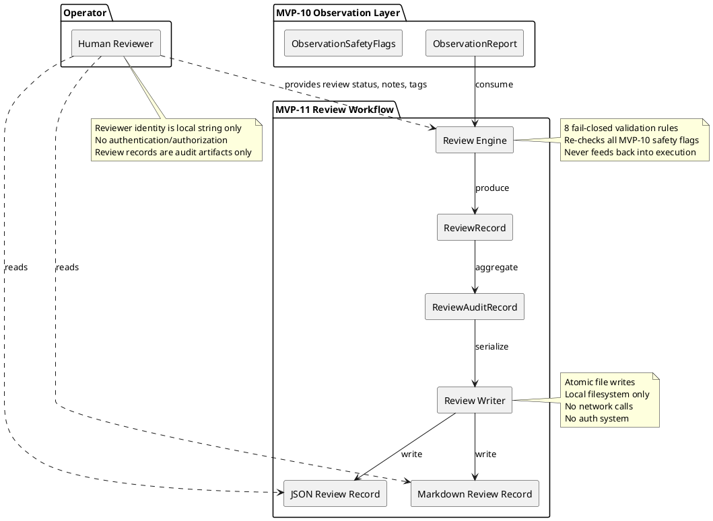
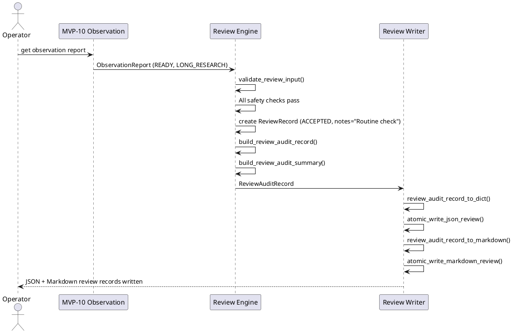
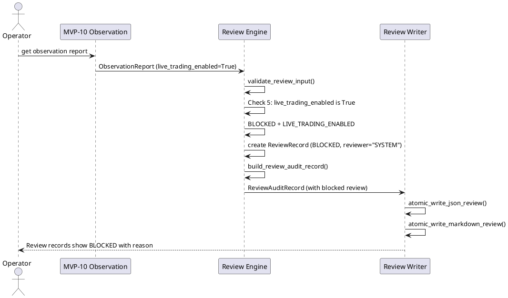

# SPEC-012 — Operator Review Workflow

## 1. Background

After MVP-10, the system produces research observation reports as human-review artifacts:

- `data/observation/latest_observation_report.json` — JSON report with observation counts, safety flags, and data quality
- `reports/observation/latest_observation_report.md` — Markdown report with human-readable summary

These reports are **audit artifacts only** — they summarize what the system observed and why signals were blocked or allowed, but they do not make trading decisions. A human operator must manually inspect these reports to understand system behavior. **These reports are not trading signals and must never be interpreted as entry/exit instructions or approval for trades.**

SPEC-012 designs an **Operator Review Workflow** layer (MVP-11) that:

1. **Consumes** MVP-10 observation reports (in-memory or from JSON) as human-review artifacts
2. **Tracks** operator review status: reviewed / not reviewed, accepted / rejected / needs investigation
3. **Records** operator notes, tags, reviewer identity (local string only), and review timestamps
4. **Produces** local JSON and Markdown review audit records for **human-review only** — these are audit artifacts, not trading signals or approvals
5. **Never** approves trades, makes trading decisions, or feeds review decisions back into any execution path

**Operator acceptance is not trade approval.** The `ACCEPTED` status means the operator acknowledges the observation report as a valid audit artifact, not that they approve any trade. Review records are human-audit artifacts only and must never be interpreted as trading signals, trade approvals, or execution instructions.

This layer is the final human-in-the-loop boundary. It provides a structured way for operators to record their review of observation reports, but it must not create any feedback loop into strategy, execution, Freqtrade, exchange, or order paths. Review records are human-audit artifacts only.

## 2. Requirements (MoSCoW)

### Must Have

| ID | Requirement | Rationale |
|---|---|---|
| M1 | Consume MVP-10 `ObservationReport` or its JSON serialization | The review layer must read what the observation layer produced |
| M2 | Track review status: `NOT_REVIEWED`, `REVIEWED`, `ACCEPTED`, `REJECTED`, `NEEDS_INVESTIGATION` | Human operators need structured review states |
| M3 | Record operator notes as free-text strings | Operators need to capture context and reasoning |
| M4 | Record tags as string tuples for categorization | Enable filtering and grouping of review records |
| M5 | Record reviewer identity as local string only, no auth system | Simple attribution without infrastructure |
| M6 | Record `reviewed_at` timestamp | Audit trail for when review occurred |
| M7 | Produce deterministic local JSON review audit record | Machine-readable for future tooling |
| M8 | Produce human-readable Markdown review audit record | Immediate operator consumption without tools |
| M9 | Fail-closed: any error in review workflow produces blocked/unknown review record with error reason | Never silently drop review records |
| M10 | **Review records must never be consumed by execution, strategy, Freqtrade shell, order, exchange, or any MVP execution path** | Review records are human-audit artifacts only, not trading signals or approvals |
| M11 | **Review decisions must never feed back into MVP-4, MVP-5, MVP-6, MVP-7, MVP-8, MVP-9, MVP-10, Freqtrade, strategy, order, exchange, or execution paths** | No feedback loop from human review into any execution path |

### Should Have

| ID | Requirement | Rationale |
|---|---|---|
| S1 | Configurable review record output paths | Flexibility for different environments |
| S2 | Review record rotation / max file count | Prevent unbounded disk growth |
| S3 | Summary statistics across review records | Track review velocity and outcomes |

### Could Have

| ID | Requirement | Rationale |
|---|---|---|
| C1 | HTML review record generation | Richer formatting than Markdown |
| C2 | Review record comparison (diff between two reviews) | Track changes in operator assessment over time |

### Won't Have (Explicitly Out of Scope)

| ID | Requirement | Rationale |
|---|---|---|
| W1 | **Any trading decision logic** | Review layer is read-only with respect to trading |
| W2 | **Trade approval or execution authorization** | Review records are human-audit artifacts, not approvals. Operator acceptance is not trade approval. |
| W3 | **Review decision feedback into execution/strategy/shell/order/MVP/exchange/execution paths** | Review decisions must never loop back into any execution path |
| W4 | **Freqtrade runtime connection** | No runtime integration at any level |
| W5 | **Binance or any exchange connection** | No exchange APIs |
| W6 | **Real order execution** | No orders, ever |
| W7 | **Leverage configuration** | No position sizing |
| W8 | **Shorting logic** | No directional execution |
| W9 | **Real entry/exit execution logic** | No `enter_long`, `enter_short`, `exit_long`, `exit_short` |
| W10 | **Live trading enablement** | Review records are for audit only |
| W11 | **API keys or secrets** | No authentication needed |
| W12 | **Production deployment instructions** | Local-only review records |
| W13 | **Network calls from review generation** | Review records are local filesystem only |
| W14 | **Database persistence** | Filesystem JSON/Markdown only |
| W15 | **Real-time streaming** | Batch review only |
| W16 | **Authentication/authorization system** | Reviewer identity is local string only |
| W17 | **Web UI or dashboard** | Out of scope for MVP-11 |
| W18 | **Review record consumption by execution layers** | Review records are human-review artifacts only, never trading signals or approvals |

## 3. Method

### 3.1 Design Philosophy

The operator review workflow follows the same fail-closed, deterministic, immutable principles as all previous MVPs:

1. **Read-only with respect to trading systems**: Only consumes observation reports, never writes to trading contexts
2. **Write-only with respect to local review records**: Only writes to local filesystem, never reads from it during review
3. **Review records are human-audit artifacts only**: Must never be consumed by execution, strategy, Freqtrade shell, or order layers. Review records must never be interpreted as trading signals, trade approvals, or execution instructions.
4. **Review decisions must never feed back into any execution path**: No output from review layer feeds into any trading system, MVP layer, or execution path. Review records must not feed back into MVP-4, MVP-5, MVP-6, MVP-7, MVP-8, MVP-9, MVP-10, Freqtrade, strategy, order, exchange, or execution paths.
5. **Deterministic**: Same input always produces same output
6. **Immutable**: Review records are frozen once created
7. **Audit-trail complete**: Every review record includes full provenance

### 3.2 Input Contract

The review workflow consumes either:

**Option A — In-memory (preferred for tests):**
```python
from hunter.observation.models import ObservationReport

report: ObservationReport  # From MVP-10 engine or writer
```

**Option B — JSON file (future disk-reading consumers):**
```json
{
  "report_timestamp": "2026-06-27T17:00:00Z",
  "report_version": "1.0",
  "report_state": "READY",
  "window": {
    "window_id": "test-window",
    "started_at": "2026-06-27T16:00:00Z",
    "ended_at": "2026-06-27T17:00:00Z",
    "observations": [
      {
        "timestamp": "2026-06-27T16:00:00Z",
        "signal": "LONG_RESEARCH",
        "source": "MVP-9 Shell",
        "shell_state": "DRY_RUN_READY",
        "signal_exposure": "EXPOSE_LONG_RESEARCH_METADATA",
        "reason_codes": ["LONG_RESEARCH_OBSERVED"]
      }
    ]
  },
  "summary": {
    "total_observations": 1,
    "long_research_count": 1,
    "short_research_count": 0,
    "none_count": 0,
    "blocked_count": 0,
    "unknown_count": 0
  },
  "reason_codes": ["LONG_RESEARCH_OBSERVED"],
  "report_formats": ["JSON", "MARKDOWN"],
  "safety_flags": {
    "dry_run": true,
    "live_trading_enabled": false,
    "real_orders_enabled": false,
    "leverage_enabled": false,
    "shorting_enabled": false,
    "freqtrade_runtime_allowed": false,
    "strategy_class_allowed": false,
    "populate_indicators_allowed": false,
    "populate_entry_trend_allowed": false,
    "populate_exit_trend_allowed": false,
    "order_execution_allowed": false,
    "api_keys_allowed": false,
    "max_context_age_seconds": 300
  },
  "data_quality": {
    "input_present": true,
    "input_valid": true,
    "input_version_supported": true,
    "observation_count": 1,
    "blocked_count": 0,
    "unknown_count": 0,
    "reason": "VALID"
  },
  "version": "1.0"
}
```

The review workflow must validate the input against the same safety invariants as MVP-10:
- `dry_run` must be `true`
- `live_trading_enabled` must be `false`
- `real_orders_enabled` must be `false`
- `leverage_enabled` must be `false`
- `shorting_enabled` must be `false`
- `report_state` must not imply any trading action

Any violation → `BLOCKED` review record with `SAFETY_VIOLATION_DETECTED` reason.

### 3.3 Review Status Model Design

#### `ReviewStatus` (enum)

```python
class ReviewStatus(str, Enum):
    NOT_REVIEWED = "NOT_REVIEWED"          # No operator has reviewed this report
    REVIEWED = "REVIEWED"                  # Operator has reviewed but not decided
    ACCEPTED = "ACCEPTED"                # Operator accepts the report as valid audit
    REJECTED = "REJECTED"                # Operator rejects the report (e.g., suspicious)
    NEEDS_INVESTIGATION = "NEEDS_INVESTIGATION"  # Operator flags for deeper review
```

#### `ReviewRecord` (frozen dataclass)

A single operator review of an observation report.

```python
@dataclass(frozen=True)
class ReviewRecord:
    review_id: str                         # Unique identifier for this review
    report_timestamp: datetime           # When the observation report was generated
    review_status: ReviewStatus            # Current review status
    reviewer: str                          # Local string identifier (e.g., "operator_1")
    reviewed_at: datetime                  # When this review was recorded
    notes: str = ""                      # Free-text operator notes
    tags: tuple[str, ...] = ()           # Categorization tags (e.g., "suspicious", "routine")
    reason_codes: tuple[str, ...] = ()   # Why this review status was chosen
    source_version: str = "1.0"           # MVP-10 observation report version
    review_version: str = "1.0"           # Review workflow version
```

Validation:
- `review_id` must be non-empty string
- `report_timestamp` must be timezone-aware
- `review_status` must be a valid `ReviewStatus` value
- `reviewer` must be non-empty string
- `reviewed_at` must be timezone-aware
- `notes` must be string (may be empty)
- `tags` must be tuple of strings
- `reason_codes` must be non-empty tuple (if review_status is not NOT_REVIEWED)
- `source_version` must be non-empty
- `review_version` must be non-empty

#### `ReviewAuditSummary` (frozen dataclass)

A summary of multiple review records for aggregate visibility.

```python
@dataclass(frozen=True)
class ReviewAuditSummary:
    summary_timestamp: datetime
    total_records: int
    not_reviewed_count: int
    reviewed_count: int
    accepted_count: int
    rejected_count: int
    needs_investigation_count: int
    tag_frequency: dict[str, int]        # {"routine": 45, "suspicious": 3}
    reviewer_frequency: dict[str, int]   # {"operator_1": 30, "operator_2": 18}
    version: str = "1.0"
```

#### `ReviewSafetyFlags` (frozen dataclass)

```python
@dataclass(frozen=True)
class ReviewSafetyFlags:
    dry_run: bool = True
    live_trading_enabled: bool = False
    real_orders_enabled: bool = False
    leverage_enabled: bool = False
    shorting_enabled: bool = False
    network_calls_made: bool = False
    trading_decisions_made: bool = False
    review_feedback_into_execution: bool = False  # Must always be False
```

Validation: all unsafe flags must be False, `dry_run` must be True, `review_feedback_into_execution` must be False.

#### `ReviewDataQuality` (frozen dataclass)

```python
@dataclass(frozen=True)
class ReviewDataQuality:
    report_present: bool = False
    report_valid: bool = False
    report_version_supported: bool = False
    review_count: int = 0
    blocked_count: int = 0
    unknown_count: int = 0
    reason: str = "NOT_EVALUATED"
```

### 3.4 Review Audit Record Model Design

#### `ReviewAuditRecord` (frozen dataclass)

The complete review audit containing all review records and summary.

```python
@dataclass(frozen=True)
class ReviewAuditRecord:
    audit_timestamp: datetime
    audit_version: str = "1.0"
    source_path: str = ""               # Where the observation report came from
    review_records: tuple[ReviewRecord, ...] = ()
    summary: ReviewAuditSummary = field(default_factory=lambda: ReviewAuditSummary(
        summary_timestamp=datetime.now(timezone.utc),
        total_records=0,
        not_reviewed_count=0,
        reviewed_count=0,
        accepted_count=0,
        rejected_count=0,
        needs_investigation_count=0,
        tag_frequency={},
        reviewer_frequency={},
    ))
    safety_flags: ReviewSafetyFlags = field(default_factory=ReviewSafetyFlags)
    data_quality: ReviewDataQuality = field(default_factory=ReviewDataQuality)
```

### 3.5 Fail-Closed Rules

The review workflow implements 8 fail-closed rules in priority order:

| Priority | Check | Failure State | Reason Code |
|---|---|---|---|
| 1 | Input is None | BLOCKED | MISSING_REPORT |
| 2 | Input missing required fields or unsupported version | BLOCKED | INVALID_REPORT |
| 3 | `version` is not `"1.0"` | BLOCKED | UNSUPPORTED_REPORT_VERSION |
| 4 | `dry_run` is not `true` | BLOCKED | DRY_RUN_DISABLED |
| 5 | `live_trading_enabled` is not `false` | BLOCKED | LIVE_TRADING_ENABLED |
| 6 | `real_orders_enabled` is not `false` | BLOCKED | REAL_ORDERS_ENABLED |
| 7 | `leverage_enabled` is not `false` | BLOCKED | LEVERAGE_ENABLED |
| 8 | `shorting_enabled` is not `false` | BLOCKED | SHORTING_ENABLED |
| 9 | Any exception during review | BLOCKED | REVIEW_ERROR |

All failures produce a `ReviewRecord` with:
- `review_status`: `BLOCKED`
- `reason_codes`: `[<failure_reason>]`
- `reviewer`: `"SYSTEM"`
- `notes`: `"Fail-closed review record due to safety violation"`

**Blocked review records must still be recorded in audit records as audit artifacts, but must never trigger any action, approve any trade, or be consumed by execution layers.**

**Fail-closed review records are generated for audit purposes only and must never trigger any action, be interpreted as trading signals, or be consumed by execution layers.** Missing/invalid/unsafe observation reports must be summarized as BLOCKED/UNKNOWN review records, not repaired or inferred.

### 3.6 Reason Code Constants

```python
MISSING_REPORT = "MISSING_REPORT"
INVALID_REPORT = "INVALID_REPORT"
UNSUPPORTED_REPORT_VERSION = "UNSUPPORTED_REPORT_VERSION"
DRY_RUN_DISABLED = "DRY_RUN_DISABLED"
LIVE_TRADING_ENABLED = "LIVE_TRADING_ENABLED"
REAL_ORDERS_ENABLED = "REAL_ORDERS_ENABLED"
LEVERAGE_ENABLED = "LEVERAGE_ENABLED"
SHORTING_ENABLED = "SHORTING_ENABLED"
REVIEW_ERROR = "REVIEW_ERROR"
REVIEW_ACCEPTED = "REVIEW_ACCEPTED"
REVIEW_REJECTED = "REVIEW_REJECTED"
NEEDS_INVESTIGATION = "NEEDS_INVESTIGATION"
NOT_REVIEWED = "NOT_REVIEWED"
SAFETY_VIOLATION_DETECTED = "SAFETY_VIOLATION_DETECTED"
DEFAULT_BLOCKED = "DEFAULT_BLOCKED"
```

### 3.7 Review Record Output Paths

- JSON review record: `data/review/latest_review_record.json`
- Markdown review record: `reports/review/latest_review_record.md`
- Historical JSON: `data/review/history/YYYY-MM-DD_HH-MM-SS_review_record.json`

## 4. Implementation

### 4.1 Proposed Package/File Layout

```
src/hunter/review/
├── __init__.py          # Public API exports
├── models.py            # ReviewStatus, ReviewRecord, ReviewAuditSummary,
│                        # ReviewSafetyFlags, ReviewDataQuality, ReviewAuditRecord,
│                        # reason code constants
├── engine.py            # build_review_record(), validate_review_input(),
│                        # build_review_audit_summary(), build_review_audit_record()
└── writer.py            # review_audit_record_to_dict(), review_audit_record_to_markdown(),
                         # atomic_write_json_review(), atomic_write_markdown_review(),
                         # write_review_audit_records()

tests/test_review/
├── __init__.py
├── test_models.py       # ~45 tests: enums, dataclasses, validation, immutability
├── test_engine.py       # ~40 tests: review logic, fail-closed rules, summary aggregation
└── test_integration.py  # ~30 tests: end-to-end flow, record generation, safety
```

### 4.2 File Responsibilities

**`models.py`** (~200 lines)
- All review dataclasses and enums
- `__post_init__` validation on all dataclasses
- Reason code string constants
- `REASON_CODES` tuple

**`engine.py`** (~220 lines)
- `build_review_record(report, reviewer, status, notes, tags, now)` → `ReviewRecord`: validates input, creates review record
- `validate_review_input(report)` → `tuple[bool, str]`: runs 8 fail-closed checks
- `build_review_audit_summary(records, now)` → `ReviewAuditSummary`: aggregates review records into summary
- `build_review_audit_record(records, source_path, now)` → `ReviewAuditRecord`: creates complete audit record

**`writer.py`** (~160 lines)
- `review_audit_record_to_dict(record)` → `dict`: deterministic JSON serialization
- `review_audit_record_to_markdown(record)` → `str`: human-readable Markdown
- `atomic_write_json_review(data, target_path)` → `Path`: atomic JSON write
- `atomic_write_markdown_review(data, target_path)` → `Path`: atomic Markdown write
- `write_review_audit_records(record, json_path, markdown_path)` → `tuple[Path, Path]`: writes both formats

### 4.3 Test Plan (~115 tests total)

**Models (~45 tests):**
- Enum values and membership
- `ReviewRecord` defaults and validation (review_id, timestamps, status, reviewer, notes, tags, reason_codes, versions)
- `ReviewAuditSummary` defaults and validation
- `ReviewSafetyFlags` validation (all unsafe flags False, dry_run True, review_feedback_into_execution False)
- `ReviewDataQuality` defaults and validation
- `ReviewAuditRecord` defaults and validation
- Frozen immutability for all dataclasses
- Reason codes presence and tuple type

**Engine (~40 tests):**
- `build_review_record` with valid input → ACCEPTED/REVIEWED/REJECTED/NEEDS_INVESTIGATION
- `build_review_record` with None → BLOCKED + MISSING_REPORT
- `build_review_record` with invalid fields → BLOCKED + INVALID_REPORT
- `build_review_record` with dry_run=False → BLOCKED + DRY_RUN_DISABLED
- `build_review_record` with live_trading_enabled=True → BLOCKED + LIVE_TRADING_ENABLED
- `build_review_record` with real_orders_enabled=True → BLOCKED + REAL_ORDERS_ENABLED
- `build_review_record` with leverage_enabled=True → BLOCKED + LEVERAGE_ENABLED
- `build_review_record` with shorting_enabled=True → BLOCKED + SHORTING_ENABLED
- `build_review_record` exception handling → BLOCKED + REVIEW_ERROR
- `validate_review_input` priority order (first blocking reason only)
- `build_review_audit_summary` aggregation (counts, tag_frequency, reviewer_frequency)
- `build_review_audit_record` with empty records
- `build_review_audit_record` with mixed statuses
- Safety assertions (no network, no trading, no feedback into execution)

**Integration (~30 tests):**
- End-to-end: `ObservationReport` → `build_review_record` → `build_review_audit_record` → `write_review_audit_records` → verify JSON
- End-to-end: same → verify Markdown
- Blocked input produces blocked review record in audit
- Audit JSON contains all expected fields
- Audit Markdown contains human-readable summary with safety notice
- Safety assertions: no network, no trading, no Freqtrade, no Binance, no exchange, no API keys, no live trading, no real orders, no leverage, no shorting, no real entry/exit logic, no review feedback into execution
- All file output uses `tmp_path`

### 4.4 Safety Invariants (Hard Constraints)

1. **The review layer must never make trading decisions.** It only records operator reviews.
2. **The review layer must never approve trades.** Review records are audit artifacts, not approvals.
3. **The review layer must never feed review decisions back into execution.** No output feeds into any trading system.
4. **The review layer must never feed review records into execution, strategy, Freqtrade shell, or order layers.** Review records are human-review audit artifacts only.
5. **The review layer must never connect to Freqtrade runtime.** No runtime integration.
6. **The review layer must never connect to Binance or any exchange.** No exchange APIs.
7. **The review layer must never read API keys.** No secrets needed.
8. **The review layer must never enable live trading.** Review records are for audit only.
9. **The review layer must never execute real orders.** No order logic.
10. **The review layer must never enable leverage.** No position sizing.
11. **The review layer must never enable shorting.** No directional execution.
12. **The review layer must never implement real entry/exit logic.** No `enter_long`, `enter_short`, `exit_long`, `exit_short`.
13. **The review layer must never make network calls.** Local filesystem only.
14. **The review layer must never persist to database.** Filesystem JSON/Markdown only.
15. **The review layer must never stream real-time.** Batch review only.
16. **The review layer must never bypass MVP-5, MVP-6, MVP-7, MVP-8, MVP-9, or MVP-10 safety contexts.** Re-validates all safety flags independently.
17. **The review layer must never include API keys, secrets, exchange credentials, or executable trading instructions in review record files.** Review records are pure audit artifacts with no actionable secrets. Review files must not contain API keys, secrets, exchange credentials, or executable trading instructions.
18. **The review layer must never implement an authentication/authorization system.** Reviewer identity is local string only.
19. **The review layer must never create a Web UI or dashboard.** Out of scope for MVP-11.

## 5. Milestones

| Milestone | Scope | Est. Tests | Cumulative Tests |
|---|---|---|---|
| M11.1 | Review Models + Engine | ~85 | ~85 |
| M11.2 | Review Writer (JSON + Markdown) | ~30 | ~115 |
| M11.3 | Integration Tests | ~30 | ~145 |
| M11.4 | Final Review | checklist | ~145 |

## 6. Gathering Results

### Success Criteria

1. All 8 fail-closed rules are implemented and tested.
2. All 19 safety invariants are enforced by validation and tests.
3. JSON review record is deterministic and human-readable.
4. Markdown review record is human-readable without tools.
5. All tests pass with no trading logic, no network calls, no Freqtrade import, no review feedback into execution.
6. Input validation re-checks all MVP-10 safety flags independently.
7. Review record output paths are local filesystem only.
8. No database, no streaming, no real-time components, no auth system, no Web UI.
9. Review records explicitly state they are audit artifacts only and not trading approvals.

### Failure Modes and Mitigations

| Failure | Mitigation |
|---|---|
| Invalid input format | Fail-closed: BLOCKED review record with INVALID_REPORT |
| Safety flag violation | Fail-closed: BLOCKED review record with specific safety reason |
| File write failure | Atomic writes with temp file + cleanup; error in review record |
| Exception during review | Catch-all → BLOCKED + REVIEW_ERROR |
| Missing reviewer | Default to "SYSTEM" with NOT_REVIEWED status |

## 7. Architecture Note

The review workflow is a **single Python package** (`src/hunter/review/`). It is intentionally simple — no microservices, no state management, no network, no auth system, no Web UI. It runs as a batch process or in-process function call.

The layer is **pull-based**: consumers call `build_review_record()` when they have an `ObservationReport` to review. There is no push, no event bus, no subscription.

## 8. PlantUML Diagrams

### Component Diagram



### Happy Path Sequence Diagram



### Blocked Path Sequence Diagram



## 9. Step-by-Step MVP-11 Implementation Plan

### Step 1 — Review Models and Engine (~85 tests)

**Allowed work:**
- `src/hunter/review/__init__.py`
- `src/hunter/review/models.py`
- `src/hunter/review/engine.py`
- `tests/test_review/__init__.py`
- `tests/test_review/test_models.py`
- `tests/test_review/test_engine.py`

**Models to implement:**
- `ReviewStatus` enum (NOT_REVIEWED, REVIEWED, ACCEPTED, REJECTED, NEEDS_INVESTIGATION)
- `ReviewRecord` frozen dataclass with validation
- `ReviewAuditSummary` frozen dataclass with validation
- `ReviewSafetyFlags` frozen dataclass with validation (includes `review_feedback_into_execution=False`)
- `ReviewDataQuality` frozen dataclass with validation
- `ReviewAuditRecord` frozen dataclass with validation
- 15 reason code string constants + `REASON_CODES` tuple

**Engine functions to implement:**
- `build_review_record(report, reviewer, status, notes, tags, now)` → `ReviewRecord`
- `validate_review_input(report)` → `tuple[bool, str]`
- `build_review_audit_summary(records, now)` → `ReviewAuditSummary`
- `build_review_audit_record(records, source_path, now)` → `ReviewAuditRecord`

**Not allowed:**
- No writer.py (Step 2)
- No integration tests (Step 3)
- No config YAML
- No JSON schema
- No Freqtrade strategy class
- No freqtrade import
- No Freqtrade runtime connection
- No Binance
- No real exchange
- No API keys
- No live trading
- No real orders
- No leverage
- No shorting
- No real entry/exit execution logic
- No network calls
- No auth system
- No Web UI

### Step 2 — Review Writer (~30 tests)

**Allowed work:**
- `src/hunter/review/writer.py`
- `tests/test_review/test_writer.py`
- Update `src/hunter/review/__init__.py` with writer exports

**Writer functions to implement:**
- `review_audit_record_to_dict(record)` → `dict`
- `review_audit_record_to_markdown(record)` → `str`
- `atomic_write_json_review(data, target_path)` → `Path`
- `atomic_write_markdown_review(data, target_path)` → `Path`
- `write_review_audit_records(record, json_path, markdown_path)` → `tuple[Path, Path]`

**Not allowed:**
- No integration tests (Step 3)
- No config YAML
- No JSON schema
- No Freqtrade strategy class
- No freqtrade import
- No Freqtrade runtime connection
- No Binance
- No real exchange
- No API keys
- No live trading
- No real orders
- No leverage
- No shorting
- No real entry/exit execution logic
- No network calls
- No auth system
- No Web UI

### Step 3 — Integration Tests (~30 tests)

**Allowed work:**
- `tests/test_review/test_integration.py`

**Integration tests:**
- End-to-end: `ObservationReport` → `build_review_record` → `build_review_audit_record` → `write_review_audit_records` → verify JSON
- End-to-end: same → verify Markdown
- Blocked input produces blocked review record in both outputs
- Audit JSON contains all expected fields
- Audit Markdown contains human-readable summary with explicit safety notice
- Safety assertions: no network, no trading, no Freqtrade, no Binance, no exchange, no API keys, no live trading, no real orders, no leverage, no shorting, no real entry/exit logic, no review feedback into execution, no auth system, no Web UI
- All file output uses `tmp_path`

**Not allowed:**
- No changes to models.py, engine.py, writer.py unless bug found
- No config YAML
- No JSON schema
- No Freqtrade strategy class
- No freqtrade import
- No Freqtrade runtime connection
- No Binance
- No real exchange
- No API keys
- No live trading
- No real orders
- No leverage
- No shorting
- No real entry/exit execution logic
- No network calls
- No auth system
- No Web UI

### Step 4 — Final Review

**Allowed work:**
- Review SPEC-012 against implementation
- Review all files
- Run full test suite
- Check git status
- Verify safety constraints
- Produce final review verdict

**Not allowed:**
- No new features
- No config YAML
- No JSON schema
- No Freqtrade strategy class
- No freqtrade import
- No Freqtrade runtime connection
- No Binance
- No real exchange
- No API keys
- No live trading
- No real orders
- No leverage
- No shorting
- No real entry/exit execution logic
- No network calls
- No auth system
- No Web UI

## 10. Safety Constraints Summary

| Constraint | Enforcement |
|---|---|
| No trading decisions | `trading_decisions_made=False` in safety flags, validated in tests |
| No trade approval | Review records explicitly state they are audit artifacts, not approvals |
| No review feedback into execution | `review_feedback_into_execution=False` invariant, validated in tests |
| No Freqtrade runtime | No `freqtrade` import, no runtime connection |
| No Binance | No `binance` import, no exchange connection |
| No real orders | `real_orders_enabled=False` invariant, validated |
| No leverage | `leverage_enabled=False` invariant, validated |
| No shorting | `shorting_enabled=False` invariant, validated |
| No real entry/exit | No `enter_long`, `enter_short`, `exit_long`, `exit_short` in any code |
| No live trading | `live_trading_enabled=False` invariant, validated |
| No API keys | No secret fields in any model |
| No network calls | `network_calls_made=False` in safety flags, validated in tests |
| No database | Filesystem only, no SQL/noSQL imports |
| No real-time streaming | Batch review only, no async/event loops |
| No auth system | Reviewer identity is local string only, no auth infrastructure |
| No Web UI | Out of scope for MVP-11 |
| No bypass of MVP-5→10 safety | Re-validates all safety flags independently in `validate_review_input()` |

## Appendix A — Pull-Model Interface with MVP-10

The review workflow is a **pull consumer** of MVP-10 output:

```python
from hunter.observation.models import ObservationReport
from hunter.review.engine import build_review_record, build_review_audit_record

# Caller pulls observation report from MVP-10
report: ObservationReport = ...  # From MVP-10 engine/writer

# Caller creates review record
review = build_review_record(
    report=report,
    reviewer="operator_1",
    status=ReviewStatus.ACCEPTED,
    notes="Routine observation check",
    tags=("routine", "daily")
)

# Caller builds audit record when desired
audit = build_review_audit_record([review], source_path="MVP-10 Observation")
```

There is no push, no event bus, no subscription. The review workflow is called when the operator has a report to review.

## Appendix B — Markdown Review Record Format

```markdown
# Hunter Futures Pro — Operator Review Record

**Generated:** 2026-06-27T17:00:00Z
**Version:** 1.0
**Source:** MVP-10 Observation

## ⚠️ Safety Notice

**This review record is an audit artifact only. It is not a trading signal, not a trade approval, and must never be consumed by execution, strategy, Freqtrade shell, or order layers.**

## Summary

| Metric | Value |
|---|---|
| Total Review Records | 24 |
| Not Reviewed | 0 |
| Reviewed | 5 |
| Accepted | 18 |
| Rejected | 1 |
| Needs Investigation | 0 |

## Review Records

| Timestamp | Reviewer | Status | Notes | Tags |
|---|---|---|---|---|
| 2026-06-27T16:00:00Z | operator_1 | ACCEPTED | Routine check | routine, daily |
| 2026-06-27T16:05:00Z | operator_2 | REJECTED | Suspicious pattern | suspicious |

## Safety Status

- ✅ Dry Run: Enabled
- ❌ Live Trading: Disabled
- ❌ Real Orders: Disabled
- ❌ Leverage: Disabled
- ❌ Shorting: Disabled
- ❌ Review Feedback Into Execution: Disabled

---
*This review record is for audit purposes only. No trading decisions or approvals are made by this layer.*
```
