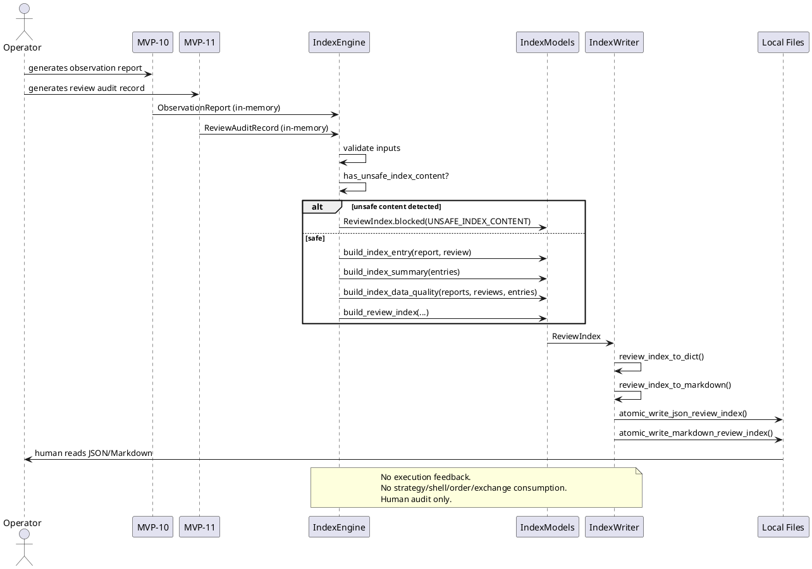

# SPEC-013 — Local Review Index

## 1. Background

After MVP-10 and MVP-11, the system produces two categories of human-audit artifacts:

- **MVP-10 Observation Reports:** `data/observation/latest_observation_report.json` and `reports/observation/latest_observation_report.md` — research-only summaries of what the system observed.
- **MVP-11 Review Audit Records:** `data/review/latest_review_audit_record.json` and `reports/review/latest_review_audit_record.md` — operator review summaries of whether those observations were acknowledged, rejected, or flagged for investigation.

These artifacts are **human-audit-only** — they are not trading signals, not trade approvals, and must never be consumed by execution, strategy, Freqtrade shell, order, exchange, or any MVP execution path.

However, as the system runs over time, the number of observation reports and review audit records grows. A human operator needs a way to:

1. **Catalog** what reports and audit records exist.
2. **Browse** them by date, status, reason code, or reviewer.
3. **Summarize** counts and trends for audit purposes.
4. **Search** for specific reports or reviews without reading every file individually.

SPEC-013 designs a **Local Review Index** layer (MVP-12) that:

1. **Consumes** MVP-10 observation reports and MVP-11 review audit records as read-only human-audit catalog artifacts.
2. **Produces** local JSON/Markdown index artifacts for human browsing, searching, and summarization.
3. **Never feeds index output back into** MVP-4, MVP-5, MVP-6, MVP-7, MVP-8, MVP-9, MVP-10, MVP-11, Freqtrade, strategy, order, exchange, or execution paths.
4. **Index entries, summaries, JSON output, and Markdown output are not trading signals, not trade approvals, and must never be consumed by execution, strategy, Freqtrade shell, order, exchange, or any MVP execution path.**
5. **Index artifacts and index summaries must not feed back into any MVP layer, Freqtrade, strategy, order, exchange, or execution paths.**
6. **Missing/invalid/unsafe report or review inputs must be summarized as BLOCKED/UNKNOWN/INVALID in index data quality, not repaired, inferred, upgraded, or normalized into safe-looking records.**
7. **Fail-closed index records may be generated for audit/catalog purposes only and must never trigger any action.**
8. **Index output must not contain API keys, secrets, exchange credentials, executable trading instructions, or operational instructions.**

## 2. Requirements

### 2.1 Must Have (M)

- **M1:** Consume MVP-10 `ObservationReport` in-memory objects (or dicts) as read-only input.
- **M2:** Consume MVP-11 `ReviewAuditRecord` in-memory objects (or dicts) as read-only input.
- **M3:** Produce a deterministic, immutable `IndexEntry` frozen dataclass that catalogs a single report + its associated review.
- **M4:** Produce a deterministic, immutable `IndexSummary` frozen dataclass that aggregates counts across all indexed entries.
- **M5:** Produce a deterministic, immutable `IndexDataQuality` frozen dataclass that tracks index completeness and staleness.
- **M6:** Produce a deterministic, immutable `IndexSafetyFlags` frozen dataclass with all unsafe flags defaulting to `False`.
- **M7:** Produce a deterministic, immutable `ReviewIndex` frozen dataclass that holds the full index (entries + summary + data quality + safety flags).
- **M8:** Fail-closed: missing or invalid inputs produce a blocked/empty index with `INDEX_ERROR` reason code, never an inferred or partial index.
- **M9:** Deterministic reason codes for all blocking conditions, priority-ordered.
- **M10:** JSON/Markdown writer that serializes the index to local files with atomic writes, human-audit-only safety notice, and no secrets.
- **M11:** Default JSON output path: `data/review_index/latest_review_index.json`.
- **M12:** Default Markdown output path: `reports/review_index/latest_review_index.md`.
- **M13:** No file reads from production data paths — index is built from in-memory objects only.
- **M14:** No network, database, realtime, or exchange connections.
- **M15:** No trading decisions, no trade approval, no execution logic. **Index output is not a trading signal, not trade approval, and must never be consumed by execution, strategy, Freqtrade shell, order, exchange, or any MVP execution path.**

### 2.2 Should Have (S)

- **S1:** In-memory filtering by `review_status`, `review_state`, `reason_code`, `reviewer`, `generated_at` range.
- **S2:** In-memory sorting by `generated_at`, `reviewed_at`, `report_id`.
- **S3:** Summary counts: total entries, accepted count, rejected count, needs investigation count, not reviewed count, blocked count.
- **S4:** Reason code frequency counts in summary.
- **S5:** Tag frequency counts in summary.

### 2.3 Could Have (C)

- **C1:** Pagination design for large index sets (offset/limit or cursor-based).
- **C2:** Date-bucketed sub-indices (daily, weekly).
- **C3:** Index diff between two index snapshots.

### 2.4 Won't Have (W)

- **W1:** Web UI, dashboard, or browser-based interface.
- **W2:** Database persistence (SQLite, PostgreSQL, etc.).
- **W3:** HTTP API, server, or authentication/authorization system.
- **W4:** Report or operator feedback into execution paths. **Index output must not feed back into any MVP layer, Freqtrade, strategy, order, exchange, or execution path.**
- **W5:** Index output consumed by strategy, Freqtrade, order, exchange, or any MVP execution path. **Index output is not a trading signal, not trade approval, and must never be consumed by execution, strategy, Freqtrade shell, order, exchange, or any MVP execution path.**
- **W6:** Binance, real exchange, or Freqtrade runtime connection.
- **W7:** Live trading, real orders, leverage, shorting, or real entry/exit execution logic.
- **W8:** Config YAML, JSON schema, or deployable Freqtrade strategy class.
- **W9:** Index output containing API keys, secrets, exchange credentials, executable trading instructions, or operational instructions.

## 3. Method

### 3.1 Input Contracts

#### From MVP-10 Observation Reports

The index consumes `ObservationReport` objects (or their `to_dict()` output) with these fields:

| Field | Type | Required |
|-------|------|----------|
| `report_id` | `str` | Yes |
| `generated_at` | `datetime` (ISO-8601) | Yes |
| `report_state` | `ObservationState` enum | Yes |
| `version` | `str` | Yes |
| `window` | `ObservationWindow` | Yes |
| `data_quality` | `ObservationDataQuality` | Yes |
| `safety_flags` | `ObservationSafetyFlags` | Yes |
| `reason_codes` | `tuple[str, ...]` | Yes |
| `metadata` | `dict[str, Any]` | No |

#### From MVP-11 Review Audit Records

The index consumes `ReviewAuditRecord` objects (or their `to_dict()` output) with these fields:

| Field | Type | Required |
|-------|------|----------|
| `audit_id` | `str` | Yes |
| `reviewed_at` | `datetime` (ISO-8601) | Yes |
| `review_status` | `ReviewStatus` enum | Yes |
| `review_state` | `ReviewState` enum | Yes |
| `version` | `str` | Yes |
| `review_record` | `ReviewRecord` | Yes |
| `audit_summary` | `ReviewAuditSummary` | Yes |
| `data_quality` | `ReviewDataQuality` | Yes |
| `safety_flags` | `ReviewSafetyFlags` | Yes |
| `reason_codes` | `tuple[str, ...]` | Yes |
| `reviewer` | `str` | Yes |
| `notes` | `str` | No |
| `tags` | `tuple[str, ...]` | No |
| `metadata` | `dict[str, Any]` | No |

### 3.2 Index Models

#### `IndexEntry` — Single Report + Review Catalog Entry

```python
@dataclass(frozen=True)
class IndexEntry:
    report_id: str                    # from ObservationReport.report_id
    audit_id: str | None              # from ReviewAuditRecord.audit_id, or None if not reviewed
    generated_at: datetime            # from ObservationReport.generated_at
    reviewed_at: datetime | None    # from ReviewAuditRecord.reviewed_at, or None if not reviewed
    review_status: str                # ReviewStatus.value, or "NOT_REVIEWED"
    review_state: str                 # ReviewState.value, or "UNKNOWN"
    report_version: str               # from ObservationReport.version
    review_version: str | None        # from ReviewAuditRecord.version, or None
    report_state: str                 # ObservationState.value
    reason_codes: tuple[str, ...]     # merged from both report and review
    tags: tuple[str, ...]            # from ReviewAuditRecord.tags, or empty
    reviewer: str | None             # from ReviewAuditRecord.reviewer, or None
    local_json_ref: str | None       # path to JSON report file, or None
    local_markdown_ref: str | None   # path to Markdown report file, or None
    local_audit_json_ref: str | None # path to JSON audit record file, or None
    local_audit_markdown_ref: str | None # path to Markdown audit record file, or None
```

Validation rules:
- `report_id` must be non-empty string.
- `generated_at` must be timezone-aware datetime.
- `review_status` must be one of: `"NOT_REVIEWED"`, `"REVIEWED"`, `"ACCEPTED"`, `"REJECTED"`, `"NEEDS_INVESTIGATION"`.
- `review_state` must be one of: `"DISABLED"`, `"READY"`, `"BLOCKED"`, `"UNKNOWN"`.
- `report_state` must be one of: `"DISABLED"`, `"READY"`, `"BLOCKED"`, `"UNKNOWN"`.
- **All `local_*_ref` fields are local string references only — index logic must not traverse, validate, open, follow, or execute file references.**
- **Missing/invalid/unsafe report or review inputs must be summarized as BLOCKED/UNKNOWN/INVALID in index data quality, not repaired, inferred, upgraded, or normalized into safe-looking records.**

#### `IndexSummary` — Aggregated Counts

```python
@dataclass(frozen=True)
class IndexSummary:
    total_entries: int                # len(entries)
    accepted_count: int              # count where review_status == "ACCEPTED"
    rejected_count: int              # count where review_status == "REJECTED"
    needs_investigation_count: int   # count where review_status == "NEEDS_INVESTIGATION"
    not_reviewed_count: int          # count where review_status == "NOT_REVIEWED"
    blocked_count: int               # count where review_state == "BLOCKED"
    ready_count: int                 # count where review_state == "READY"
    unknown_count: int               # count where review_state == "UNKNOWN"
    disabled_count: int              # count where review_state == "DISABLED"
    reason_code_counts: dict[str, int]  # frequency map of all reason_codes
    tag_counts: dict[str, int]         # frequency map of all tags
    reviewer_counts: dict[str, int]  # frequency map of all reviewers
    generated_date_range: tuple[str, str] | None  # (min_date, max_date) as ISO-8601 strings, or None
```

#### `IndexDataQuality` — Index Completeness and Staleness

```python
@dataclass(frozen=True)
class IndexDataQuality:
    has_reports: bool                 # at least one report present
    has_reviews: bool                 # at least one review present
    has_orphan_reports: bool          # reports without matching reviews
    has_orphan_reviews: bool          # reviews without matching reports
    missing_report_ids: tuple[str, ...]  # report_ids that have no corresponding report
    missing_audit_ids: tuple[str, ...]   # audit_ids that have no corresponding review
    stale_entry_count: int            # entries older than threshold
    index_completeness_pct: float      # 0.0–1.0, reports with reviews / total reports
    validation_errors: tuple[str, ...]  # any validation errors encountered
```

#### `IndexSafetyFlags` — Safety Invariants

```python
@dataclass(frozen=True)
class IndexSafetyFlags:
    dry_run: bool = True
    live_trading_enabled: bool = False
    real_orders_enabled: bool = False
    leverage_enabled: bool = False
    shorting_enabled: bool = False
    index_output_is_human_audit_only: bool = True
    index_output_not_trading_signal: bool = True
    index_output_not_trade_approval: bool = True
    index_output_not_for_execution: bool = True
    index_output_not_for_strategy: bool = True
    index_output_not_for_freqtrade: bool = True
    index_output_not_for_order: bool = True
    index_output_not_for_exchange: bool = True
```

All unsafe flags must be `False`. All safe flags must be `True`. Violation → `ValueError`.

#### `ReviewIndex` — Full Index Container

```python
@dataclass(frozen=True)
class ReviewIndex:
    index_id: str                     # UUID or deterministic hash
    generated_at: datetime            # index generation timestamp
    version: str = "1.0"              # index format version
    entries: tuple[IndexEntry, ...]  # all catalog entries
    summary: IndexSummary             # aggregated counts
    data_quality: IndexDataQuality  # completeness metrics
    safety_flags: IndexSafetyFlags    # safety invariants
    reason_codes: tuple[str, ...]    # all reason codes from index build
```

Fail-closed factory:

```python
@classmethod
def blocked(cls, reason: str = "INDEX_ERROR") -> "ReviewIndex":
    return cls(
        index_id="blocked",
        generated_at=datetime.now(timezone.utc),
        version="1.0",
        entries=(),
        summary=IndexSummary(...),  # all zeros
        data_quality=IndexDataQuality(...),  # all False/empty
        safety_flags=IndexSafetyFlags(),
        reason_codes=(reason,),
    )
```

### 3.3 Reason Codes

Deterministic, priority-ordered tuple:

```python
INDEX_REASON_CODES = (
    "MISSING_REPORTS",           # 1 — no observation reports provided
    "MISSING_REVIEWS",           # 2 — no review audit records provided (warning, not blocking)
    "INVALID_REPORT",            # 3 — report missing required fields
    "INVALID_REVIEW",            # 4 — review missing required fields
    "UNSUPPORTED_REPORT_VERSION", # 5 — report version not recognized
    "UNSUPPORTED_REVIEW_VERSION", # 6 — review version not recognized
    "STALE_REPORT",              # 7 — report older than threshold
    "STALE_REVIEW",              # 8 — review older than threshold
    "ORPHAN_REPORT",             # 9 — report with no matching review
    "ORPHAN_REVIEW",             # 10 — review with no matching report
    "UNSAFE_INDEX_CONTENT",      # 11 — forbidden terms in tags/notes/metadata
    "INDEX_ERROR",               # 12 — catch-all for unexpected errors
)
```

### 3.4 Forbidden Index Content

```python
FORBIDDEN_INDEX_TERMS = frozenset({
    "enter_long", "enter_short", "exit_long", "exit_short",
    "api_key", "secret", "exchange_credentials", "executable_instructions",
    "order", "position", "leverage", "margin", "liquidation",
})
```

### 3.5 Engine Functions

#### `has_unsafe_index_content(...)`

```python
def has_unsafe_index_content(text: str) -> bool:
    """Case-insensitive check for forbidden terms in index text."""
```

#### `build_index_entry(...)`

```python
def build_index_entry(
    report: ObservationReport | dict,
    review: ReviewAuditRecord | dict | None = None,
    local_json_ref: str | None = None,
    local_markdown_ref: str | None = None,
    local_audit_json_ref: str | None = None,
    local_audit_markdown_ref: str | None = None,
) -> IndexEntry:
    """Build a single IndexEntry from a report and optional review."""
```

Validation:
- Report must have `report_id`, `generated_at`, `report_state`, `version`.
- If review provided, must have `audit_id`, `reviewed_at`, `review_status`, `review_state`, `version`.
- If review is `None`, set `review_status="NOT_REVIEWED"`, `review_state="UNKNOWN"`.
- `reason_codes` = report reason_codes + review reason_codes (if review exists).
- `tags` = review tags or empty tuple.
- `reviewer` = review reviewer or `None`.

#### `build_index_summary(...)`

```python
def build_index_summary(entries: Sequence[IndexEntry]) -> IndexSummary:
    """Aggregate counts across all index entries."""
```

Deterministic counting: iterate entries once, accumulate all counts.

#### `build_index_data_quality(...)`

```python
def build_index_data_quality(
    reports: Sequence[ObservationReport | dict],
    reviews: Sequence[ReviewAuditRecord | dict],
    entries: Sequence[IndexEntry],
    stale_threshold_seconds: int = 86400,  # 24 hours
) -> IndexDataQuality:
    """Assess index completeness and staleness."""
```

#### `build_review_index(...)`

```python
def build_review_index(
    reports: Sequence[ObservationReport | dict],
    reviews: Sequence[ReviewAuditRecord | dict] = (),
    local_json_refs: Mapping[str, str] | None = None,      # report_id -> path
    local_markdown_refs: Mapping[str, str] | None = None,
    local_audit_json_refs: Mapping[str, str] | None = None,  # audit_id -> path
    local_audit_markdown_refs: Mapping[str, str] | None = None,
    stale_threshold_seconds: int = 86400,
) -> ReviewIndex:
    """Build full ReviewIndex from reports and optional reviews."""
```

Fail-closed rules (priority order):
1. `MISSING_REPORTS` — if no reports provided → blocked index.
2. `INVALID_REPORT` — if any report missing required fields → blocked index.
3. `UNSUPPORTED_REPORT_VERSION` — if any report version != "1.0" → blocked index.
4. `INVALID_REVIEW` — if any review missing required fields → blocked index.
5. `UNSUPPORTED_REVIEW_VERSION` — if any review version != "1.0" → blocked index.
6. `STALE_REPORT` — if any report older than threshold → warning in data_quality, not blocking.
7. `STALE_REVIEW` — if any review older than threshold → warning in data_quality, not blocking.
8. `ORPHAN_REPORT` — tracked in data_quality, not blocking.
9. `ORPHAN_REVIEW` — tracked in data_quality, not blocking.
10. `UNSAFE_INDEX_CONTENT` — if any tags/notes/metadata contain forbidden terms → blocked index.
11. `INDEX_ERROR` — catch-all for unexpected errors → blocked index.

### 3.6 Writer Design

#### `review_index_to_dict(...)`

```python
def review_index_to_dict(index: ReviewIndex) -> dict:
    """Serialize ReviewIndex to JSON-compatible dict."""
```

Serialization rules:
- `generated_at` → ISO-8601 with `Z` suffix.
- Enums → `.value` strings.
- `tuple` → `list`.
- `datetime` → ISO-8601 with `Z` suffix.
- No secrets, no executable instructions.

#### `review_index_to_markdown(...)`

```python
def review_index_to_markdown(index: ReviewIndex) -> str:
    """Serialize ReviewIndex to human-readable Markdown."""
```

Markdown must include:
- Title: "Review Index — Human Audit Only"
- Generated timestamp.
- Version.
- Total entries count.
- Summary table (accepted, rejected, needs investigation, not reviewed, blocked, ready).
- Reason code frequency table.
- Tag frequency table.
- Reviewer frequency table.
- Data quality summary.
- Safety flags table.
- **Explicit safety notice:**
  > "This local review index is a human-audit catalog artifact only. It is not a trading signal, not trade approval, and must not be consumed by execution, strategy, Freqtrade shell, order, exchange, or any MVP execution path."

#### `atomic_write_json_review_index(...)`

```python
def atomic_write_json_review_index(
    index: ReviewIndex,
    target_path: Path | None = None,
) -> Path:
    """Atomic JSON write with temp file, fsync, os.replace, cleanup."""
```

Default path: `data/review_index/latest_review_index.json`

#### `atomic_write_markdown_review_index(...)`

```python
def atomic_write_markdown_review_index(
    index: ReviewIndex,
    target_path: Path | None = None,
) -> Path:
    """Atomic Markdown write with temp file, fsync, os.replace, cleanup."""
```

Default path: `reports/review_index/latest_review_index.md`

#### `write_review_index(...)`

```python
def write_review_index(
    index: ReviewIndex,
    json_path: Path | None = None,
    markdown_path: Path | None = None,
) -> tuple[Path, Path]:
    """Write both JSON and Markdown index files."""
```

### 3.7 Default Paths

```python
DEFAULT_INDEX_JSON_PATH = Path("data/review_index/latest_review_index.json")
DEFAULT_INDEX_MARKDOWN_PATH = Path("reports/review_index/latest_review_index.md")
```

## 4. Implementation

### 4.1 Proposed Package/File Layout

```
src/hunter/
├── review_index/
│   ├── __init__.py          # Public API exports
│   ├── models.py            # IndexEntry, IndexSummary, IndexDataQuality, IndexSafetyFlags, ReviewIndex
│   ├── engine.py            # has_unsafe_index_content, build_index_entry, build_index_summary, build_index_data_quality, build_review_index
│   └── writer.py            # review_index_to_dict, review_index_to_markdown, atomic_write_json_review_index, atomic_write_markdown_review_index, write_review_index

tests/test_review_index/
├── __init__.py
├── test_models.py           # Model validation tests
├── test_engine.py           # Engine function tests
├── test_writer.py           # Writer function tests
└── test_integration.py      # End-to-end integration tests
```

### 4.2 Safety Invariants

1. **Read-only input:** Index never modifies observation reports or review audit records.
2. **No file reads:** Index is built from in-memory objects only. File references are strings.
3. **No network:** No HTTP, WebSocket, or database connections.
4. **No execution feedback:** Index output never feeds back into MVP-4–MVP-11, Freqtrade, strategy, order, or exchange paths. **Index artifacts and index summaries must not feed back into any MVP layer, Freqtrade, strategy, order, exchange, or execution paths.**
5. **No trading logic:** No decisions, no approvals, no signals. **Index output is not a trading signal, not trade approval, and must never be consumed by execution, strategy, Freqtrade shell, order, exchange, or any MVP execution path.**
6. **No secrets:** Index output must not contain API keys, credentials, executable trading instructions, or operational instructions.
7. **Atomic writes:** Temp file + fsync + os.replace + cleanup on failure.
8. **Human-audit only:** Markdown includes explicit safety notice.
9. **Fail-closed:** All errors produce blocked index with reason code, never partial data.
10. **Deterministic:** Same inputs → same index output, every time.
11. **File references are local string references only:** Index logic must not traverse, validate, open, follow, or execute file references.
12. **No repair of bad inputs:** Missing/invalid/unsafe report or review inputs must be summarized as BLOCKED/UNKNOWN/INVALID in index data quality, not repaired, inferred, upgraded, or normalized into safe-looking records.
13. **No action triggers:** Fail-closed index records may be generated for audit/catalog purposes only and must never trigger any action.

### 4.3 PlantUML Component Diagram

```plantuml
@startuml
!define RECTANGLE class

package "MVP-10" {
    RECTANGLE ObservationReport
    RECTANGLE ObservationWriter
}

package "MVP-11" {
    RECTANGLE ReviewAuditRecord
    RECTANGLE ReviewWriter
}

package "MVP-12" {
    RECTANGLE IndexEngine
    RECTANGLE IndexModels
    RECTANGLE IndexWriter
    RECTANGLE ReviewIndex
}

package "Human Operator" {
    RECTANGLE Browser
    RECTAPTER TextEditor
}

ObservationReport --> IndexEngine : read-only in-memory
ReviewAuditRecord --> IndexEngine : read-only in-memory
IndexEngine --> IndexModels : builds
IndexModels --> ReviewIndex : assembles
ReviewIndex --> IndexWriter : serializes
IndexWriter --> JSON_File : atomic write
IndexWriter --> Markdown_File : atomic write
JSON_File --> Browser : human reads
Markdown_File --> TextEditor : human reads

note right of IndexEngine
  No file reads from production paths.
  No network. No database.
  No execution feedback.
end note

note right of IndexWriter
  Human-audit only.
  Explicit safety notice in Markdown.
  No secrets. No executable instructions.
end note
@enduml
```

### 4.4 PlantUML Sequence Diagram



## 5. Milestones

### MVP-12 Step 1 — Index Models and Engine

- Create `src/hunter/review_index/__init__.py` with public API exports.
- Create `src/hunter/review_index/models.py` with:
  - `IndexEntry`, `IndexSummary`, `IndexDataQuality`, `IndexSafetyFlags`, `ReviewIndex` frozen dataclasses.
  - `INDEX_REASON_CODES` tuple.
  - `FORBIDDEN_INDEX_TERMS` frozenset.
  - `__post_init__` validation on all models.
- Create `src/hunter/review_index/engine.py` with:
  - `has_unsafe_index_content(...)`
  - `build_index_entry(...)`
  - `build_index_summary(...)`
  - `build_index_data_quality(...)`
  - `build_review_index(...)`
- Create `tests/test_review_index/__init__.py`.
- Create `tests/test_review_index/test_models.py` with model validation tests.
- Create `tests/test_review_index/test_engine.py` with engine function tests.
- Target: ~120 tests.

### MVP-12 Step 2 — Index Writer

- Create `src/hunter/review_index/writer.py` with:
  - `review_index_to_dict(...)`
  - `review_index_to_markdown(...)`
  - `atomic_write_json_review_index(...)`
  - `atomic_write_markdown_review_index(...)`
  - `write_review_index(...)`
  - `DEFAULT_INDEX_JSON_PATH`
  - `DEFAULT_INDEX_MARKDOWN_PATH`
- Update `src/hunter/review_index/__init__.py` with writer exports.
- Create `tests/test_review_index/test_writer.py` with writer tests.
- Target: ~50 tests.

### MVP-12 Step 3 — Integration Tests

- Create `tests/test_review_index/test_integration.py` with:
  - Happy path: report + review → index entry → index → JSON/Markdown → verify.
  - Missing reports → blocked index.
  - Invalid report → blocked index.
  - Orphan report → tracked in data_quality.
  - Orphan review → tracked in data_quality.
  - Unsafe content → blocked index.
  - Empty entries → empty index with correct summary.
  - Multiple reports + reviews → correct summary counts.
  - Safety assertions: no file reads, no network, no execution feedback.
- Target: ~70 tests.

### MVP-12 Step 4 — Final Review

- Review checklist (same pattern as MVP-11 Step 4):
  - SPEC-013 coverage verification.
  - Models review (validation, immutability, fail-closed factories).
  - Engine review (fail-closed rules, deterministic reason codes, no file reads, no network).
  - Writer review (atomic writes, safety notice, no secrets).
  - Test review (all tests pass, coverage adequate).
  - Safety review (all constraints verified).
- Run: `pytest -q --import-mode=importlib`, `git status`, `git log --oneline --max-count=15`.
- Verdict: PASS / PASS WITH NOTES / FAIL.
- If PASS: memory update + version bump to 0.12.0-dev.

## 6. Gathering Results

### 6.1 Test Plan

| Test Category | Target Count | Coverage |
|---------------|-------------|----------|
| Model validation | 50 | All fields, boundaries, fail-closed factories, immutability |
| Engine functions | 70 | All 5 engine functions, fail-closed rules, reason codes, unsafe content |
| Writer functions | 50 | Dict serialization, Markdown content, atomic writes, safety notice |
| Integration | 70 | End-to-end flows, error paths, safety assertions |
| **Total** | **~240** | |

### 6.2 Expected Full Suite Count

Current: 2211 tests (MVP-0 through MVP-11).
Expected after MVP-12: ~2450 tests.

### 6.3 Output Artifacts

- `data/review_index/latest_review_index.json` — machine-readable index.
- `reports/review_index/latest_review_index.md` — human-readable index with safety notice.

## 7. Need Professional Help in Developing Your Architecture?

This SPEC follows the same agent-first, safety-first, fail-closed design pattern established in SPEC-011 and SPEC-012. If you need help with:

- **Architecture review:** Ensure the index design scales with report volume.
- **Performance analysis:** In-memory filtering/sorting for large index sets.
- **Security audit:** Verify no execution feedback paths exist.
- **Test strategy:** Expand integration test coverage for edge cases.

Consult the project maintainers or open a design review issue.

---

**Document metadata:**
- **Version:** 1.0-draft
- **Date:** 2026-06-27
- **Author:** WrongStack
- **Status:** Draft — awaiting human review before implementation.
- **Next step:** Human approval → MVP-12 Step 1 implementation.
