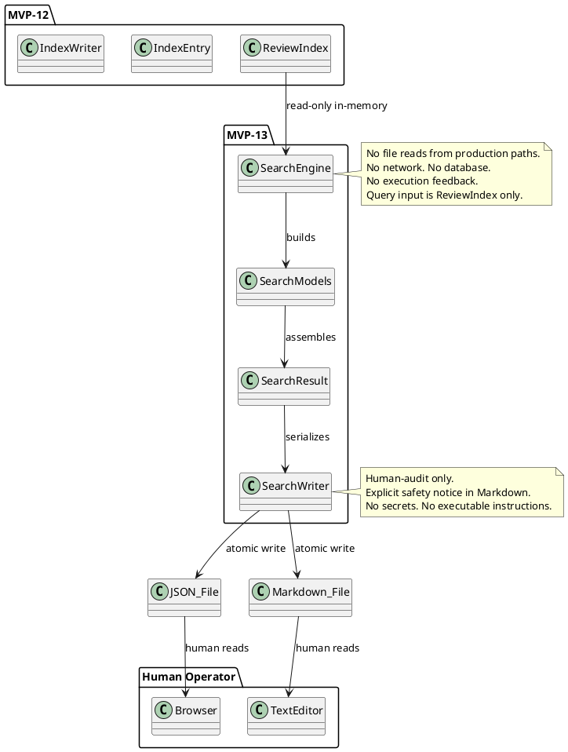
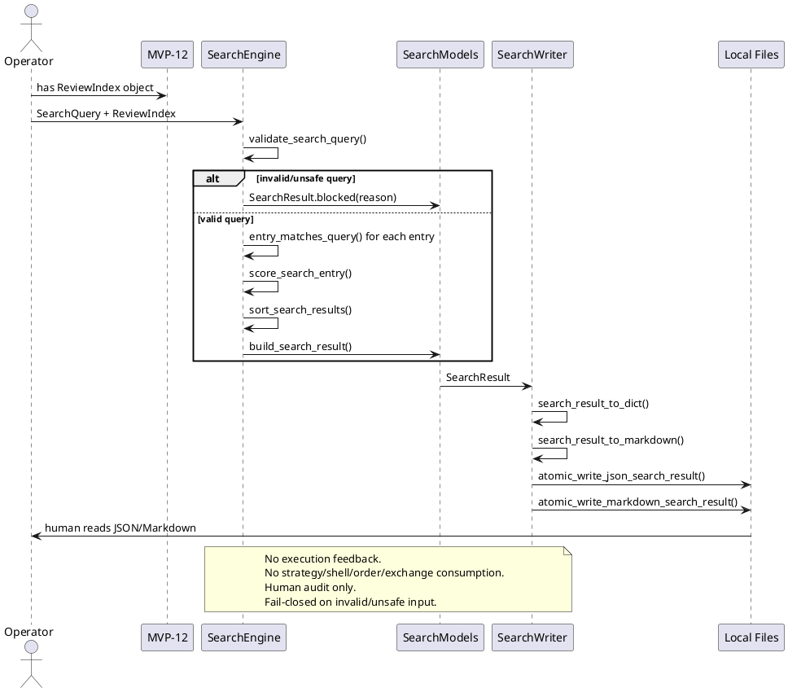

# SPEC-014 — Local Review Search / Query Layer

## 1. Background

After MVP-12, the system produces a **Local Review Index** (`ReviewIndex`) that catalogs all observation reports and their associated review audit records. This index is a human-audit-only artifact — it is not a trading signal, not trade approval, and must never be consumed by execution, strategy, Freqtrade shell, order, exchange, or any MVP execution path.

However, as the index grows over time, a human operator needs a way to **find specific entries** without manually scanning every JSON/Markdown file. SPEC-014 designs a **Local Review Search / Query Layer** (MVP-13) that:

1. **Consumes** MVP-12 `ReviewIndex` objects as read-only in-memory input.
2. **Produces** local JSON/Markdown search result artifacts for human browsing and audit.
3. **Never feeds search output back into** MVP-4–MVP-12, Freqtrade, strategy, order, exchange, or execution paths.
4. **Search results are not trading signals, not trade approvals, and must never be consumed by execution, strategy, Freqtrade shell, order, exchange, or any MVP execution path.**
5. **Missing/invalid/unsafe query inputs produce blocked/empty/unknown results, never inferred or partial safe-looking data.**
6. **Fail-closed search records may be generated for audit/catalog purposes only and must never trigger any action.**
7. **Search output must not contain API keys, secrets, exchange credentials, executable trading instructions, or operational instructions.**

## 2. Requirements

### 2.1 Must Have (M)

- **M1:** Consume MVP-12 `ReviewIndex` in-memory objects as read-only input.
- **M2:** Accept `SearchQuery` frozen dataclass with optional filter fields (state, reason code, reviewer, tag, report_id, audit_id, local reference string, timestamp range, text metadata).
- **M3:** Accept `SearchFilter` frozen dataclass with boolean combinators (AND, OR, NOT) for complex queries.
- **M4:** Accept `SearchSort` frozen dataclass with sort field and direction (ascending/descending).
- **M5:** Produce deterministic, immutable `SearchResultEntry` frozen dataclass for each matched index entry.
- **M6:** Produce deterministic, immutable `SearchResultSummary` frozen dataclass with match counts, filter applied, sort applied, and total scanned.
- **M7:** Produce deterministic, immutable `SearchResult` frozen dataclass holding all matched entries + summary + safety flags.
- **M8:** Produce deterministic, immutable `SearchSafetyFlags` frozen dataclass with all unsafe flags defaulting to `False`.
- **M9:** Fail-closed: invalid/missing/unsafe query input returns blocked/empty/unknown result with reason code, never inferred safe data.
- **M10:** Deterministic reason codes for all blocking conditions, priority-ordered.
- **M11:** JSON/Markdown writer that serializes search results to local files with atomic writes, human-audit-only safety notice, and no secrets.
- **M12:** Default JSON output path: `data/review_search/latest_search_result.json`.
- **M13:** Default Markdown output path: `reports/review_search/latest_search_result.md`.
- **M14:** No file reads from production data paths — search is performed on in-memory `ReviewIndex` objects only.
- **M15:** No network, database, realtime, or exchange connections.
- **M16:** No trading decisions, no trade approval, no execution logic. **Search output is not a trading signal, not trade approval, and must never be consumed by execution, strategy, Freqtrade shell, order, exchange, or any MVP execution path.**

### 2.2 Should Have (S)

- **S1:** In-memory filtering by `index_state`, `entry_kind`, `reason_codes`, `reviewer`, `tags`, `report_id`, `audit_id`, `local_report_reference`, `local_review_reference`, `generated_at` range, `reviewed_at` range.
- **S2:** Text search in `metadata` keys and values (substring match, case-insensitive).
- **S3:** In-memory sorting by `report_id`, `audit_id`, `generated_at`, `reviewed_at`, `entry_kind`, `index_state`.
- **S4:** Score-based ranking for text relevance (simple frequency count, no ML).
- **S5:** Summary counts: total scanned, matched, blocked, ready, unknown.

### 2.3 Could Have (C)

- **C1:** Pagination design for large result sets (offset/limit or cursor-based).
- **C2:** Date-bucketed sub-results (daily, weekly).
- **C3:** Search result diff between two query snapshots.

### 2.4 Won't Have (W)

- **W1:** Web UI, dashboard, or browser-based interface.
- **W2:** Database persistence (SQLite, PostgreSQL, etc.).
- **W3:** HTTP API, server, or authentication/authorization system.
- **W4:** Report, operator, index, or search feedback into execution paths. **Search output must not feed back into any MVP layer, Freqtrade, strategy, order, exchange, or execution path.**
- **W5:** Search output consumed by strategy, Freqtrade, order, exchange, or any MVP execution path. **Search output is not a trading signal, not trade approval, and must never be consumed by execution, strategy, Freqtrade shell, order, exchange, or any MVP execution path.**
- **W6:** Binance, real exchange, or Freqtrade runtime connection.
- **W7:** Live trading, real orders, leverage, shorting, or real entry/exit execution logic.
- **W8:** Config YAML, JSON schema, or deployable Freqtrade strategy class.
- **W9:** Search output containing API keys, secrets, exchange credentials, executable trading instructions, or operational instructions.
- **W10:** File reference traversal, opening, following, validation, or execution.

## 3. Method

### 3.1 Input Contracts

#### From MVP-12 ReviewIndex

The search layer consumes `ReviewIndex` objects (or their `to_dict()` output) with these fields:

| Field | Type | Required |
|-------|------|----------|
| `index_id` | `str` | Yes |
| `generated_at` | `datetime` (ISO-8601) | Yes |
| `index_state` | `IndexState` enum | Yes |
| `entries` | `tuple[IndexEntry, ...]` | Yes |
| `summary` | `IndexSummary` | Yes |
| `data_quality` | `IndexDataQuality` | Yes |
| `safety_flags` | `IndexSafetyFlags` | Yes |
| `reason_codes` | `tuple[str, ...]` | Yes |

#### SearchQuery Fields

| Field | Type | Default | Description |
|-------|------|---------|-------------|
| `index_state` | `IndexState \| None` | `None` | Filter by entry state |
| `entry_kind` | `IndexEntryKind \| None` | `None` | Filter by entry kind |
| `reason_codes` | `tuple[str, ...] \| None` | `None` | Match any of these reason codes |
| `reviewer` | `str \| None` | `None` | Exact match on reviewer |
| `tags` | `tuple[str, ...] \| None` | `None` | Match any of these tags |
| `report_id` | `str \| None` | `None` | Exact match on report_id |
| `audit_id` | `str \| None` | `None` | Exact match on audit_id |
| `local_report_reference` | `str \| None` | `None` | Substring match on local report ref |
| `local_review_reference` | `str \| None` | `None` | Substring match on local review ref |
| `generated_at_after` | `datetime \| None` | `None` | Filter entries generated after |
| `generated_at_before` | `datetime \| None` | `None` | Filter entries generated before |
| `reviewed_at_after` | `datetime \| None` | `None` | Filter entries reviewed after |
| `reviewed_at_before` | `datetime \| None` | `None` | Filter entries reviewed before |
| `metadata_text` | `str \| None` | `None` | Substring search in metadata keys/values |

### 3.2 Search Models

#### `SearchQuery` — Query Parameters

```python
@dataclass(frozen=True)
class SearchQuery:
    index_state: IndexState | None = None
    entry_kind: IndexEntryKind | None = None
    reason_codes: tuple[str, ...] | None = None
    reviewer: str | None = None
    tags: tuple[str, ...] | None = None
    report_id: str | None = None
    audit_id: str | None = None
    local_report_reference: str | None = None
    local_review_reference: str | None = None
    generated_at_after: datetime | None = None
    generated_at_before: datetime | None = None
    reviewed_at_after: datetime | None = None
    reviewed_at_before: datetime | None = None
    metadata_text: str | None = None
```

Validation rules:
- At least one filter field must be non-None, or the query is considered "empty".
- Empty queries produce a blocked result with `EMPTY_QUERY` reason code.
- `generated_at_after` must be <= `generated_at_before` if both provided.
- `reviewed_at_after` must be <= `reviewed_at_before` if both provided.
- **All string fields are checked for forbidden terms. If any forbidden term is found, the query is blocked with `UNSAFE_QUERY_CONTENT`.**
- **File references in query fields are strings only — search logic must not traverse, validate, open, follow, or execute file references.**

#### `SearchFilter` — Filter Combinator (Optional Advanced)

```python
@dataclass(frozen=True)
class SearchFilter:
    operator: str = "AND"  # "AND", "OR", "NOT"
    queries: tuple[SearchQuery, ...] = ()
```

#### `SearchSort` — Sort Specification

```python
@dataclass(frozen=True)
class SearchSort:
    field: str = "report_id"  # "report_id", "audit_id", "generated_at", "reviewed_at", "entry_kind", "index_state"
    ascending: bool = True
```

Validation rules:
- `field` must be one of the allowed sort fields.
- Invalid field --> blocked result with `INVALID_SORT_FIELD`.

#### `SearchResultEntry` — Matched Entry with Relevance

```python
@dataclass(frozen=True)
class SearchResultEntry:
    entry: IndexEntry              # the matched index entry
    match_score: float = 0.0       # simple relevance score (0.0–1.0)
    matched_fields: tuple[str, ...] = ()  # which query fields matched
```

#### `SearchResultSummary` — Search Result Aggregates

```python
@dataclass(frozen=True)
class SearchResultSummary:
    total_scanned: int             # total entries in the input index
    total_matched: int             # entries that matched the query
    ready_count: int               # matched entries with state READY
    blocked_count: int             # matched entries with state BLOCKED
    unknown_count: int             # matched entries with state UNKNOWN
    observation_report_count: int  # matched OBSERVATION_REPORT entries
    review_audit_count: int        # matched REVIEW_AUDIT_RECORD entries
    linked_entry_count: int        # matched LINKED_REPORT_REVIEW entries
    query_applied: str             # human-readable description of applied query
    sort_applied: str              # human-readable description of applied sort
    generated_at: datetime        # when the search result was generated
```

#### `SearchResult` — Full Search Result Container

```python
@dataclass(frozen=True)
class SearchResult:
    result_id: str                 # deterministic ID
    generated_at: datetime         # generation timestamp
    index_state: IndexState        # READY if matches found, BLOCKED if error, UNKNOWN if empty
    entries: tuple[SearchResultEntry, ...]  # matched entries
    summary: SearchResultSummary   # aggregates
    safety_flags: SearchSafetyFlags  # safety invariants
    reason_codes: tuple[str, ...]  # blocking reasons if any
```

Fail-closed factory:

```python
@classmethod
def blocked(
    cls,
    reason: str = "SEARCH_ERROR",
    query_description: str = "",
) -> "SearchResult":
    return cls(
        result_id="blocked",
        generated_at=datetime.now(timezone.utc),
        index_state=IndexState.BLOCKED,
        entries=(),
        summary=SearchResultSummary(
            total_scanned=0,
            total_matched=0,
            ready_count=0,
            blocked_count=0,
            unknown_count=0,
            observation_report_count=0,
            review_audit_count=0,
            linked_entry_count=0,
            query_applied=query_description,
            sort_applied="",
            generated_at=datetime.now(timezone.utc),
        ),
        safety_flags=SearchSafetyFlags(),
        reason_codes=(reason,),
    )
```

#### `SearchSafetyFlags` — Safety Invariants

```python
@dataclass(frozen=True)
class SearchSafetyFlags:
    dry_run: bool = True
    live_trading_enabled: bool = False
    real_orders_enabled: bool = False
    leverage_enabled: bool = False
    shorting_enabled: bool = False
    search_output_is_human_audit_only: bool = True
    search_output_not_trading_signal: bool = True
    search_output_not_trade_approval: bool = True
    search_output_not_for_execution: bool = True
    search_output_not_for_strategy: bool = True
    search_output_not_for_freqtrade: bool = True
    search_output_not_for_order: bool = True
    search_output_not_for_exchange: bool = True
    search_feedback_into_execution: bool = False
    file_reference_traversal_enabled: bool = False
```

All unsafe flags must be `False`. All safe flags must be `True`. Violation --> `ValueError`.

### 3.3 Reason Codes

Deterministic, priority-ordered tuple:

```python
SEARCH_REASON_CODES = (
    "EMPTY_QUERY",               # 1 — no filter fields provided
    "INVALID_QUERY",             # 2 — query has invalid field values
    "INVALID_SORT_FIELD",        # 3 — sort field not in allowed list
    "INVALID_TIMESTAMP_RANGE",     # 4 — after > before
    "UNSAFE_QUERY_CONTENT",      # 5 — forbidden terms in query strings
    "MISSING_INDEX",             # 6 — no ReviewIndex provided
    "EMPTY_INDEX",               # 7 — ReviewIndex has no entries
    "INDEX_STATE_BLOCKED",       # 8 — input ReviewIndex is BLOCKED
    "SEARCH_ERROR",              # 9 — catch-all for unexpected errors
    "DEFAULT_BLOCKED",           # 10 — default blocked reason
)
```

### 3.4 Forbidden Query Content

```python
FORBIDDEN_SEARCH_TERMS = frozenset({
    "enter_long", "enter_short", "exit_long", "exit_short",
    "api_key", "secret", "exchange_credentials", "executable_instructions",
    "order", "position", "leverage", "margin", "liquidation",
})
```

### 3.5 Engine Functions

#### `build_search_safety_flags(...)`

```python
def build_search_safety_flags(config: SearchConfig | None = None) -> SearchSafetyFlags:
    """Convert config into search safety flags."""
```

#### `validate_search_query(...)`

```python
def validate_search_query(
    query: SearchQuery,
    safety_flags: SearchSafetyFlags | None = None,
) -> tuple[bool, str]:
    """Validate query and return (is_valid, reason_code).

    Checks:
    - At least one filter field is non-None.
    - Timestamp ranges are valid (after <= before).
    - No forbidden terms in string fields.
    - All string fields are safe (no execution instructions, no API keys).
    """
```

#### `entry_matches_query(...)`

```python
def entry_matches_query(
    entry: IndexEntry,
    query: SearchQuery,
) -> tuple[bool, float, tuple[str, ...]]:
    """Check if an index entry matches the query.

    Returns (matched, score, matched_fields).
    Score is a simple relevance metric (0.0–1.0) based on field match count.
    """
```

Match rules (all ANDed together, each non-None field):
- `index_state` --> exact match on `entry.index_state`.
- `entry_kind` --> exact match on `entry.entry_kind`.
- `reason_codes` --> `entry.reason_codes` intersects with query reason_codes.
- `reviewer` --> exact match on `entry.reviewer`.
- `tags` --> `entry.tags` intersects with query tags.
- `report_id` --> exact match on `entry.report_id`.
- `audit_id` --> exact match on `entry.audit_id`.
- `local_report_reference` --> substring match (case-insensitive) on `entry.local_report_reference`.
- `local_review_reference` --> substring match (case-insensitive) on `entry.local_review_reference`.
- `generated_at_after` / `generated_at_before` --> `entry.report_generated_at` within range.
- `reviewed_at_after` / `reviewed_at_before` --> `entry.reviewed_at` within range.
- `metadata_text` --> substring match (case-insensitive) in any metadata key or value.

#### `score_search_entry(...)`

```python
def score_search_entry(
    entry: IndexEntry,
    query: SearchQuery,
    matched_fields: tuple[str, ...],
) -> float:
    """Compute a simple relevance score for a matched entry.

    Score = matched_field_count / total_query_field_count.
    Higher score = more specific match.
    """
```

#### `sort_search_results(...)`

```python
def sort_search_results(
    results: tuple[SearchResultEntry, ...],
    sort: SearchSort,
) -> tuple[SearchResultEntry, ...]:
    """Sort search results by the specified field and direction."""
```

Sort fields:
- `"report_id"` --> alphabetical on `entry.report_id`.
- `"audit_id"` --> alphabetical on `entry.audit_id`.
- `"generated_at"` --> chronological on `entry.report_generated_at`.
- `"reviewed_at"` --> chronological on `entry.reviewed_at`.
- `"entry_kind"` --> alphabetical on `entry.entry_kind.value`.
- `"index_state"` --> alphabetical on `entry.index_state.value`.
- `"score"` --> descending on `match_score`.

#### `build_search_result(...)`

```python
def build_search_result(
    index: ReviewIndex,
    query: SearchQuery,
    sort: SearchSort | None = None,
    config: SearchConfig | None = None,
    now: datetime | None = None,
) -> SearchResult:
    """Build full SearchResult from ReviewIndex and query.

    Fail-closed: invalid/missing/unsafe input returns blocked result.
    """
```

Fail-closed rules (priority order):
1. `MISSING_INDEX` — if no ReviewIndex provided --> blocked result.
2. `EMPTY_INDEX` — if ReviewIndex has no entries --> blocked result.
3. `INDEX_STATE_BLOCKED` — if ReviewIndex.state is BLOCKED --> blocked result.
4. `EMPTY_QUERY` — if no filter fields provided --> blocked result.
5. `INVALID_QUERY` — if query has invalid field values --> blocked result.
6. `INVALID_TIMESTAMP_RANGE` — if after > before --> blocked result.
7. `UNSAFE_QUERY_CONTENT` — if forbidden terms in query strings --> blocked result.
8. `INVALID_SORT_FIELD` — if sort field not in allowed list --> blocked result.
9. `SEARCH_ERROR` — catch-all for unexpected errors --> blocked result.

### 3.6 Writer Design

#### `search_result_to_dict(...)`

```python
def search_result_to_dict(result: SearchResult) -> dict:
    """Serialize SearchResult to JSON-compatible dict."""
```

Serialization rules:
- `generated_at` --> ISO-8601 with `Z` suffix.
- Enums --> `.value` strings.
- `tuple` --> `list`.
- `datetime` --> ISO-8601 with `Z` suffix.
- No secrets, no executable instructions.

#### `search_result_to_markdown(...)`

```python
def search_result_to_markdown(result: SearchResult) -> str:
    """Serialize SearchResult to human-readable Markdown."""
```

Markdown must include:
- Title: "Review Search Result — Human Audit Only"
- Generated timestamp.
- Query description.
- Sort description.
- Total scanned, total matched.
- Match counts by state and kind.
- List of matched entries (entry_id, report_id, audit_id, state, kind, score, matched_fields).
- **Explicit safety notice:**
  > "This local search result is a human-audit catalog artifact only. It is not a trading signal, not trade approval, and must not be consumed by execution, strategy, Freqtrade shell, order, exchange, or any MVP execution path."

#### `atomic_write_json_search_result(...)`

```python
def atomic_write_json_search_result(
    result: SearchResult,
    target_path: Path | None = None,
) -> Path:
    """Atomic JSON write with temp file, fsync, os.replace, cleanup."""
```

Default path: `data/review_search/latest_search_result.json`

#### `atomic_write_markdown_search_result(...)`

```python
def atomic_write_markdown_search_result(
    result: SearchResult,
    target_path: Path | None = None,
) -> Path:
    """Atomic Markdown write with temp file, fsync, os.replace, cleanup."""
```

Default path: `reports/review_search/latest_search_result.md`

#### `write_search_result(...)`

```python
def write_search_result(
    result: SearchResult,
    json_path: Path | None = None,
    markdown_path: Path | None = None,
) -> tuple[Path, Path]:
    """Write both JSON and Markdown search result files."""
```

### 3.7 Default Paths

```python
DEFAULT_SEARCH_JSON_PATH = Path("data/review_search/latest_search_result.json")
DEFAULT_SEARCH_MARKDOWN_PATH = Path("reports/review_search/latest_search_result.md")
```

### 3.8 PlantUML Component Diagram



### 3.9 PlantUML Sequence Diagram



## 4. Implementation

### 4.1 Proposed Package/File Layout

```
src/hunter/
├── review_search/
│   ├── __init__.py          # Public API exports
│   ├── models.py            # SearchQuery, SearchSort, SearchResultEntry, SearchResultSummary, SearchResult, SearchSafetyFlags
│   ├── engine.py            # build_search_safety_flags, validate_search_query, entry_matches_query, score_search_entry, sort_search_results, build_search_result
│   └── writer.py            # search_result_to_dict, search_result_to_markdown, atomic_write_json_search_result, atomic_write_markdown_search_result, write_search_result

tests/test_review_search/
├── __init__.py
├── test_models.py           # Model validation tests
├── test_engine.py           # Engine function tests
├── test_writer.py           # Writer function tests
└── test_integration.py      # End-to-end integration tests
```

### 4.2 Safety Invariants

1. **Read-only input:** Search never modifies ReviewIndex or its entries.
2. **No file reads:** Search is performed on in-memory objects only. File references are strings.
3. **No network:** No HTTP, WebSocket, or database connections.
4. **No execution feedback:** Search output never feeds back into MVP-4–MVP-12, Freqtrade, strategy, order, or exchange paths. **Search artifacts and search summaries must not feed back into any MVP layer, Freqtrade, strategy, order, exchange, or execution paths.**
5. **No trading logic:** No decisions, no approvals, no signals. **Search output is not a trading signal, not trade approval, and must never be consumed by execution, strategy, Freqtrade shell, order, exchange, or any MVP execution path.**
6. **No secrets:** Search output must not contain API keys, credentials, executable trading instructions, or operational instructions.
7. **Atomic writes:** Temp file + fsync + os.replace + cleanup on failure.
8. **Human-audit only:** Markdown includes explicit safety notice.
9. **Fail-closed:** All errors produce blocked result with reason code, never partial data.
10. **Deterministic:** Same inputs --> same search result output, every time.
11. **File references are local string references only:** Search logic must not traverse, validate, open, follow, or execute file references.
12. **No repair of bad inputs:** Missing/invalid/unsafe query inputs produce blocked/empty/unknown results, never inferred or partial safe-looking data.
13. **No action triggers:** Fail-closed search records may be generated for audit/catalog purposes only and must never trigger any action.

## 5. Milestones

### MVP-13 Step 1 — Search Models and Engine

- Create `src/hunter/review_search/__init__.py` with public API exports.
- Create `src/hunter/review_search/models.py` with:
  - `SearchQuery`, `SearchSort`, `SearchResultEntry`, `SearchResultSummary`, `SearchResult`, `SearchSafetyFlags` frozen dataclasses.
  - `SEARCH_REASON_CODES` tuple.
  - `FORBIDDEN_SEARCH_TERMS` frozenset.
  - `__post_init__` validation on all models.
- Create `src/hunter/review_search/engine.py` with:
  - `build_search_safety_flags(...)`
  - `validate_search_query(...)`
  - `entry_matches_query(...)`
  - `score_search_entry(...)`
  - `sort_search_results(...)`
  - `build_search_result(...)`
- Create `tests/test_review_search/__init__.py`.
- Create `tests/test_review_search/test_models.py` with model validation tests.
- Create `tests/test_review_search/test_engine.py` with engine function tests.
- Target: ~120 tests.

### MVP-13 Step 2 — Search Writer

- Create `src/hunter/review_search/writer.py` with:
  - `search_result_to_dict(...)`
  - `search_result_to_markdown(...)`
  - `atomic_write_json_search_result(...)`
  - `atomic_write_markdown_search_result(...)`
  - `write_search_result(...)`
  - `DEFAULT_SEARCH_JSON_PATH`
  - `DEFAULT_SEARCH_MARKDOWN_PATH`
- Update `src/hunter/review_search/__init__.py` with writer exports.
- Create `tests/test_review_search/test_writer.py` with writer tests.
- Target: ~50 tests.

### MVP-13 Step 3 — Integration Tests

- Create `tests/test_review_search/test_integration.py` with:
  - Happy path: ReviewIndex + SearchQuery --> SearchResult --> JSON/Markdown --> verify.
  - Missing index --> blocked result.
  - Empty index --> blocked result.
  - Blocked index input --> blocked result.
  - Empty query --> blocked result.
  - Invalid query --> blocked result.
  - Unsafe query content --> blocked result.
  - Invalid sort field --> blocked result.
  - Timestamp range validation --> blocked result if invalid.
  - Multiple filters combined --> correct AND behavior.
  - Sorting by each allowed field --> correct order.
  - Score-based ranking --> higher score for more specific matches.
  - Safety assertions: no file reads, no network, no execution feedback.
- Target: ~70 tests.

### MVP-13 Step 4 — Final Review

- Review checklist (same pattern as MVP-12 Step 4):
  - SPEC-014 coverage verification.
  - Models review (validation, immutability, fail-closed factories).
  - Engine review (fail-closed rules, deterministic reason codes, no file reads, no network).
  - Writer review (atomic writes, safety notice, no secrets).
  - Test review (all tests pass, coverage adequate).
  - Safety review (all constraints verified).
- Run: `pytest -q --import-mode=importlib`, `git status`, `git log --oneline --max-count=15`.
- Verdict: PASS / PASS WITH NOTES / FAIL.
- If PASS: memory update + version bump to 0.13.0-dev.

## 6. Gathering Results

### 6.1 Test Plan

| Test Category | Target Count | Coverage |
|---------------|-------------|----------|
| Model validation | 50 | All fields, boundaries, fail-closed factories, immutability |
| Engine functions | 70 | All 6 engine functions, fail-closed rules, reason codes, unsafe content |
| Writer functions | 50 | Dict serialization, Markdown content, atomic writes, safety notice |
| Integration | 70 | End-to-end flows, error paths, safety assertions |
| **Total** | **~240** | |

### 6.2 Expected Full Suite Count

Current: 2450 tests (MVP-0 through MVP-12).
Expected after MVP-13: ~2690 tests.

### 6.3 Output Artifacts

- `data/review_search/latest_search_result.json` — machine-readable search result.
- `reports/review_search/latest_search_result.md` — human-readable search result with safety notice.

## 7. Need Professional Help in Developing Your Architecture?

This SPEC follows the same agent-first, safety-first, fail-closed design pattern established in SPEC-011, SPEC-012, and SPEC-013. If you need help with:

- **Architecture review:** Ensure the search design scales with index volume.
- **Performance analysis:** In-memory filtering/sorting for large index sets.
- **Security audit:** Verify no execution feedback paths exist.
- **Test strategy:** Expand integration test coverage for edge cases.

Consult the project maintainers or open a design review issue.

---

**Document metadata:**
- **Version:** 1.0-draft
- **Date:** 2026-06-28
- **Author:** WrongStack
- **Status:** Draft — awaiting human review before implementation.
- **Next step:** Human approval --> MVP-13 Step 1 implementation.
