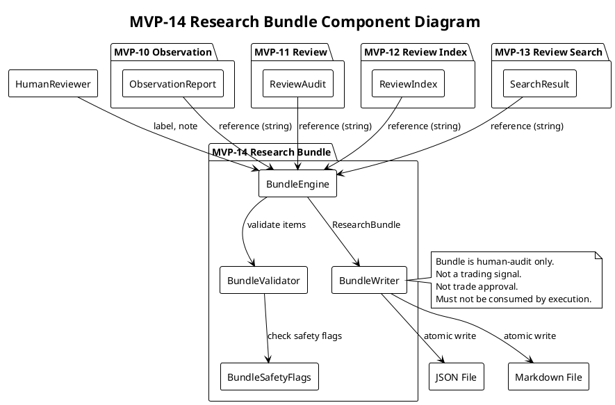

# SPEC-015-Local-Research-Bundle-Evidence-Pack

## Background

MVP-10 created dry-run research observation reports (`observation` package) — local JSON/Markdown artifacts that summarize signal observations for human review. MVP-11 created operator review audit records (`review` package) — local audit trail entries capturing human review decisions with deterministic reason codes. MVP-12 created a local review index (`review_index` package) — an in-memory catalog linking observation reports to review audits with data quality and safety metadata. MVP-13 created a local review search / query layer (`review_search` package) — an in-memory search engine that queries the review index and produces human-audit search results.

Together, these four packages produce a rich set of local research artifacts: observations, reviews, an index catalog, and search results. However, there is no deterministic, reproducible way to package a *selection* of these artifacts into a single coherent evidence bundle for:

- **Human audit** — a reviewer can select a subset of observations, reviews, and search results and package them with human notes for focused review.
- **Contractor handoff** — a researcher can bundle selected evidence with labels and context for a remote contractor or auditor to review.
- **Versioned evidence packs** — a deterministic bundle can be serialized and referenced by hash, enabling reproducible evidence references in chat logs, documentation, or future review cycles.

MVP-14 introduces the `research_bundle` package, which provides deterministic, fail-closed, frozen dataclasses and in-memory engine functions to build a `ResearchBundle` from selected references to observation reports, review audits, review indices, search results, and human notes. The bundle is serialized to JSON and Markdown, with an explicit safety notice that it is a human-audit artifact only.

The bundle is for **human audit and contractor handoff only**. It is not a trading signal. It is not trade approval. It must not be consumed by execution, strategy, Freqtrade shell, order, exchange, or any MVP execution path.

---

## Requirements

### Must Have

1. **Bundle Models** — frozen `ResearchBundle` dataclass with `BundleItem`, `BundleSummary`, `BundleDataQuality`, `BundleSafetyFlags`, `BundleConfig`, `BundleState`, `BundleItemKind` enums.
2. **Deterministic Bundle ID** — bundle ID is derived from selected items + generated timestamp (e.g., `bundle-{hash}-{timestamp}`), enabling reproducible references.
3. **Bundle Items** — each item references exactly one artifact: observation report, review audit, review index, search result, or human note. Items contain string references only, not the actual objects.
4. **Bundle Safety Flags** — fail-closed safety flags that explicitly mark the bundle as human-audit only, not for execution, strategy, Freqtrade, order, or exchange.
5. **Bundle Engine** — in-memory functions: `build_bundle_safety_flags`, `validate_bundle_item`, `build_bundle_item`, `build_bundle_summary`, `build_bundle_data_quality`, `build_research_bundle`.
6. **Bundle Writer** — JSON/Markdown serialization, atomic file writing, deterministic output.
7. **Bundle Reason Codes** — deterministic, priority-ordered tuple for failure states (e.g., `MISSING_ITEMS`, `EMPTY_BUNDLE`, `INVALID_BUNDLE`, `UNSAFE_BUNDLE_CONTENT`, etc.).
8. **Explicit Non-Goals** — documented list of what the bundle explicitly does NOT do.

### Should Have

9. **Human Notes / Labels** — `BundleItem` should support `note` and `label` fields for human annotations.
10. **Bundle Data Quality** — `BundleDataQuality` should track total items, missing references, invalid references, and blocked items.
11. **Bundle Summary** — `BundleSummary` should report item counts by kind, states, and reason codes.
12. **PlantUML Diagrams** — component diagram and sequence diagram showing bundle construction, validation, and serialization flow.
13. **Sortable Items** — bundle items should be deterministically sortable by `sort_order` and `item_id`.

### Could Have

14. **Bundle Searchability** — future search engine could search across bundles by label or note (out of scope for MVP-14).
15. **Bundle Validation** — optional cross-reference validation that checks if referenced items exist in their respective packages (out of scope for MVP-14; bundles are reference-only and do not open files).

### Won't Have (in MVP-14)

16. **Database persistence** — bundles are local JSON/Markdown artifacts only.
17. **Web UI / dashboard** — no user interface for bundle creation or viewing.
18. **Network / API** — no remote bundle sharing, no API endpoints.
19. **Config YAML / JSON schema** — no configuration files or schema validation.
20. **Trading signal generation** — bundles do not produce, contain, or influence trading decisions.
21. **Freqtrade / Binance / exchange integration** — no runtime connections.

---

## Method

### Proposed Package Structure

```
src/hunter/research_bundle/
├── __init__.py
├── models.py
├── engine.py
└── writer.py
```

### Proposed Models (src/hunter/research_bundle/models.py)

```python
from dataclasses import dataclass
from datetime import datetime
from enum import Enum, auto
from typing import Any, Mapping, Tuple


class BundleState(Enum):
    """Deterministic bundle states."""
    READY = "READY"
    BLOCKED = "BLOCKED"
    UNKNOWN = "UNKNOWN"


class BundleItemKind(Enum):
    """Kind of artifact referenced by a bundle item."""
    OBSERVATION_REPORT = "OBSERVATION_REPORT"
    REVIEW_AUDIT = "REVIEW_AUDIT"
    REVIEW_INDEX = "REVIEW_INDEX"
    SEARCH_RESULT = "SEARCH_RESULT"
    HUMAN_NOTE = "HUMAN_NOTE"


@dataclass(frozen=True)
class BundleConfig:
    """Configuration for bundle building."""
    max_items: int = 500
    include_safety_flags: bool = True
    include_data_quality: bool = True
    include_summary: bool = True

    def __post_init__(self) -> None:
        if self.max_items < 1:
            raise ValueError("max_items must be >= 1")


@dataclass(frozen=True)
class BundleSafetyFlags:
    """Safety flags that must remain fail-closed for bundle artifacts."""
    dry_run: bool = True
    live_trading_enabled: bool = False
    real_orders_enabled: bool = False
    leverage_enabled: bool = False
    shorting_enabled: bool = False
    bundle_feedback_into_execution: bool = False
    report_feedback_into_execution: bool = False
    operator_feedback_into_execution: bool = False
    index_feedback_into_execution: bool = False
    search_feedback_into_execution: bool = False
    file_reference_traversal_enabled: bool = False
    database_persistence_enabled: bool = False
    web_ui_enabled: bool = False
    dashboard_enabled: bool = False
    # Bundle output is human-audit only — these must be True
    bundle_output_is_human_audit_only: bool = True
    bundle_output_not_trading_signal: bool = True
    bundle_output_not_trade_approval: bool = True
    bundle_output_not_for_execution: bool = True
    bundle_output_not_for_strategy: bool = True
    bundle_output_not_for_freqtrade: bool = True
    bundle_output_not_for_order: bool = True
    bundle_output_not_for_exchange: bool = True

    def __post_init__(self) -> None:
        unsafe_flags = (
            self.live_trading_enabled,
            self.real_orders_enabled,
            self.leverage_enabled,
            self.shorting_enabled,
            self.bundle_feedback_into_execution,
            self.report_feedback_into_execution,
            self.operator_feedback_into_execution,
            self.index_feedback_into_execution,
            self.search_feedback_into_execution,
            self.file_reference_traversal_enabled,
            self.database_persistence_enabled,
            self.web_ui_enabled,
            self.dashboard_enabled,
        )
        if any(unsafe_flags):
            raise ValueError("unsafe bundle safety flags are enabled")
        safe_flags = (
            self.bundle_output_is_human_audit_only,
            self.bundle_output_not_trading_signal,
            self.bundle_output_not_trade_approval,
            self.bundle_output_not_for_execution,
            self.bundle_output_not_for_strategy,
            self.bundle_output_not_for_freqtrade,
            self.bundle_output_not_for_order,
            self.bundle_output_not_for_exchange,
        )
        if not all(safe_flags):
            raise ValueError("safe bundle output flags must be True")


@dataclass(frozen=True)
class BundleItem:
    """A single item inside a research bundle referencing one artifact."""
    item_id: str
    kind: BundleItemKind
    reference: str  # local file path or artifact ID string only
    label: str = ""
    note: str = ""
    sort_order: int = 0
    metadata: Mapping[str, Any] = field(default_factory=tuple)

    def __post_init__(self) -> None:
        if not self.item_id:
            raise ValueError("item_id must be non-empty")
        if not isinstance(self.kind, BundleItemKind):
            raise ValueError(f"kind must be BundleItemKind, got {type(self.kind)}")
        if not self.reference:
            raise ValueError("reference must be non-empty")


@dataclass(frozen=True)
class BundleSummary:
    """Summary of items inside a research bundle."""
    total_items: int = 0
    observation_report_count: int = 0
    review_audit_count: int = 0
    review_index_count: int = 0
    search_result_count: int = 0
    human_note_count: int = 0
    blocked_items: int = 0
    unknown_items: int = 0


@dataclass(frozen=True)
class BundleDataQuality:
    """Data quality metrics for a research bundle."""
    total_items: int = 0
    missing_references: int = 0
    invalid_references: int = 0
    blocked_items: int = 0
    has_observation_report: bool = False
    has_review_audit: bool = False
    has_review_index: bool = False
    has_search_result: bool = False
    has_human_note: bool = False


@dataclass(frozen=True)
class ResearchBundle:
    """A deterministic, human-audit-only research bundle."""
    bundle_id: str
    generated_at: datetime
    bundle_state: BundleState
    items: Tuple[BundleItem, ...]
    summary: BundleSummary
    data_quality: BundleDataQuality
    safety_flags: BundleSafetyFlags
    reason_codes: Tuple[str, ...] = ()
    config: BundleConfig = field(default_factory=BundleConfig)
    metadata: Mapping[str, Any] = field(default_factory=tuple)

    def __post_init__(self) -> None:
        if not self.bundle_id:
            raise ValueError("bundle_id must be non-empty")
        if self.generated_at.tzinfo is None:
            raise ValueError("generated_at must be timezone-aware")
        if not isinstance(self.bundle_state, BundleState):
            raise ValueError(f"bundle_state must be BundleState, got {type(self.bundle_state)}")
        if self.bundle_state is not BundleState.READY and not self.reason_codes:
            raise ValueError("reason_codes must be non-empty when bundle_state is not READY")
        if len(self.items) > self.config.max_items:
            raise ValueError(f"items count {len(self.items)} exceeds max_items {self.config.max_items}")
```

### Reason Codes

```python
MISSING_ITEMS = "MISSING_ITEMS"
EMPTY_BUNDLE = "EMPTY_BUNDLE"
INVALID_BUNDLE = "INVALID_BUNDLE"
INVALID_ITEM = "INVALID_ITEM"
MISSING_REFERENCE = "MISSING_REFERENCE"
INVALID_REFERENCE = "INVALID_REFERENCE"
UNSAFE_BUNDLE_CONTENT = "UNSAFE_BUNDLE_CONTENT"
UNSAFE_ITEM_CONTENT = "UNSAFE_ITEM_CONTENT"
UNSAFE_SAFETY_FLAGS = "UNSAFE_SAFETY_FLAGS"
BUNDLE_ERROR = "BUNDLE_ERROR"
DEFAULT_BLOCKED = "DEFAULT_BLOCKED"
MAX_ITEMS_EXCEEDED = "MAX_ITEMS_EXCEEDED"

REASON_CODES: tuple[str, ...] = (
    MISSING_ITEMS,
    EMPTY_BUNDLE,
    INVALID_BUNDLE,
    INVALID_ITEM,
    MISSING_REFERENCE,
    INVALID_REFERENCE,
    UNSAFE_BUNDLE_CONTENT,
    UNSAFE_ITEM_CONTENT,
    UNSAFE_SAFETY_FLAGS,
    BUNDLE_ERROR,
    DEFAULT_BLOCKED,
    MAX_ITEMS_EXCEEDED,
)
```

### Forbidden Bundle Terms

```python
FORBIDDEN_BUNDLE_TERMS = (
    "execute trade", "place order", "cancel order", "api_key",
    "secret", "password", "private_key", "binance", "leverage",
    "short", "live trading", "real order", "enter_long", "enter_short",
    "exit_long", "exit_short", "trading signal", "trade approval",
    "strategy signal", "freqtrade signal", "exchange_credentials",
)
```

### Proposed Engine Functions (src/hunter/research_bundle/engine.py)

```python
def build_bundle_safety_flags(config: BundleConfig | None = None) -> BundleSafetyFlags:
    """Build safety flags from config. Config is advisory only."""
    return BundleSafetyFlags()

def has_unsafe_bundle_content(text: str) -> bool:
    """Case-insensitive check for forbidden terms in bundle text."""
    ...

def validate_bundle_item(
    item: BundleItem,
    safety_flags: BundleSafetyFlags | None = None,
) -> tuple[bool, str]:
    """Validate a single bundle item. Returns (is_valid, reason_code)."""
    ...

def build_bundle_item(
    kind: BundleItemKind,
    reference: str,
    item_id: str = "",
    label: str = "",
    note: str = "",
    sort_order: int = 0,
    metadata: Mapping[str, Any] | None = None,
) -> BundleItem:
    """Build a single bundle item with validation."""
    ...

def build_bundle_summary(items: tuple[BundleItem, ...]) -> BundleSummary:
    """Build summary from items."""
    ...

def build_bundle_data_quality(items: tuple[BundleItem, ...]) -> BundleDataQuality:
    """Build data quality from items."""
    ...

def build_research_bundle(
    items: tuple[BundleItem, ...],
    config: BundleConfig | None = None,
    now: datetime | None = None,
) -> ResearchBundle:
    """Fail-closed bundle builder. Returns BLOCKED bundle on any error."""
    ...
```

### Proposed Writer Functions (src/hunter/research_bundle/writer.py)

```python
DEFAULT_BUNDLE_JSON_PATH = Path("data/research_bundle/latest_research_bundle.json")
DEFAULT_BUNDLE_MARKDOWN_PATH = Path("reports/research_bundle/latest_research_bundle.md")

def bundle_item_to_dict(item: BundleItem) -> dict[str, Any]: ...
def bundle_summary_to_dict(summary: BundleSummary) -> dict[str, Any]: ...
def bundle_data_quality_to_dict(data_quality: BundleDataQuality) -> dict[str, Any]: ...
def bundle_safety_flags_to_dict(flags: BundleSafetyFlags) -> dict[str, Any]: ...
def research_bundle_to_dict(bundle: ResearchBundle) -> dict[str, Any]: ...
def research_bundle_to_markdown(bundle: ResearchBundle) -> str: ...
def atomic_write_json_research_bundle(bundle: ResearchBundle, path: Path | None = None) -> Path: ...
def atomic_write_markdown_research_bundle(bundle: ResearchBundle, path: Path | None = None) -> Path: ...
def write_research_bundle(bundle: ResearchBundle, json_path: Path | None = None, markdown_path: Path | None = None) -> tuple[Path, Path]: ...
```

### PlantUML Component Diagram



### PlantUML Sequence Diagram

```plantuml
@startuml
!theme plain
skinparam sequenceMessageAlign center

title MVP-14 Research Bundle Build Sequence

actor HumanReviewer as HR
participant "BundleEngine" as ENG
participant "BundleValidator" as VAL
participant "BundleSafetyFlags" as SAF
participant "BundleWriter" as WRT

HR -> ENG : select items (references + labels + notes)

loop for each item
  ENG -> VAL : validate_bundle_item(item)
  VAL -> SAF : check unsafe content
  alt unsafe content found
    VAL -> ENG : return (False, UNSAFE_ITEM_CONTENT)
  else invalid item
    VAL -> ENG : return (False, INVALID_ITEM)
  else valid
    VAL -> ENG : return (True, "")
  end
end

ENG -> ENG : build_bundle_summary(items)
ENG -> ENG : build_bundle_data_quality(items)
ENG -> ENG : build_bundle_safety_flags(config)

alt any validation failed
  ENG -> ENG : build BLOCKED bundle
  ENG -> ENG : reason_codes = (INVALID_ITEM, ...)
else all valid
  ENG -> ENG : build READY bundle
  ENG -> ENG : reason_codes = ()
end

ENG -> WRT : write_research_bundle(bundle)
WRT -> WRT : research_bundle_to_dict(bundle)
WRT -> WRT : research_bundle_to_markdown(bundle)
WRT -> [JSON File] : atomic_write_json_research_bundle
WRT -> [Markdown File] : atomic_write_markdown_research_bundle

WRT -> HR : return (json_path, markdown_path)

@enduml
```

### Failure States

| State | Trigger | Reason Codes |
|---|---|---|
| `READY` | All items valid, all safety flags safe, references are strings | `()` |
| `BLOCKED` | Unsafe content in any item, invalid item, safety flag violation, missing items | `UNSAFE_ITEM_CONTENT`, `INVALID_ITEM`, `UNSAFE_SAFETY_FLAGS`, `MISSING_ITEMS`, `EMPTY_BUNDLE` |
| `UNKNOWN` | Unexpected error during bundle building | `BUNDLE_ERROR`, `DEFAULT_BLOCKED` |

### Explicit Non-Goals

1. **No file reference traversal** — bundle references are local strings only. The bundle engine does not open, read, validate, follow, or execute any referenced file.
2. **No database persistence** — bundles are local JSON/Markdown artifacts only. No database, no SQLite, no PostgreSQL, no MongoDB.
3. **No Web UI or dashboard** — no web interface, no HTML rendering, no React/Vue/Angular components.
4. **No config YAML or JSON schema** — no configuration files, no schema validation, no Pydantic settings.
5. **No trading signal generation** — bundles do not produce, contain, or influence trading decisions, signals, or approvals.
6. **No Freqtrade integration** — no Freqtrade strategy class, no `freqtrade` import, no runtime connection.
7. **No Binance or exchange integration** — no Binance API, no exchange API, no API keys, no live trading.
8. **No leverage or shorting** — no leverage logic, no short position logic, no margin calculations.
9. **No feedback into execution paths** — bundle output must never be consumed by execution, strategy, Freqtrade shell, order, exchange, or any MVP execution path.
10. **No real orders or live trading** — bundles are research artifacts, not order instructions.
11. **No network calls** — no HTTP requests, no API calls, no remote bundle sharing.
12. **No server/API/auth** — no REST API, no GraphQL, no OAuth, no authentication.

---

## Implementation

### Step 1 — Bundle Models and Engine

- `src/hunter/research_bundle/__init__.py` — public API exports.
- `src/hunter/research_bundle/models.py` — frozen dataclasses, enums, reason codes, forbidden terms, `BundleConfig`, `BundleSafetyFlags`, `BundleItem`, `BundleSummary`, `BundleDataQuality`, `ResearchBundle`.
- `src/hunter/research_bundle/engine.py` — `build_bundle_safety_flags`, `has_unsafe_bundle_content`, `validate_bundle_item`, `build_bundle_item`, `build_bundle_summary`, `build_bundle_data_quality`, `build_research_bundle`.
- `tests/test_research_bundle/test_models.py` — model unit tests.
- `tests/test_research_bundle/test_engine.py` — engine unit tests.

### Step 2 — Bundle Writer

- `src/hunter/research_bundle/writer.py` — `bundle_item_to_dict`, `bundle_summary_to_dict`, `bundle_data_quality_to_dict`, `bundle_safety_flags_to_dict`, `research_bundle_to_dict`, `research_bundle_to_markdown`, `atomic_write_json_research_bundle`, `atomic_write_markdown_research_bundle`, `write_research_bundle`.
- `src/hunter/research_bundle/__init__.py` — updated with writer exports.
- `tests/test_research_bundle/test_writer.py` — writer unit tests.
- Default JSON path: `data/research_bundle/latest_research_bundle.json`.
- Default Markdown path: `reports/research_bundle/latest_research_bundle.md`.

### Step 3 — Bundle Integration Tests

- `tests/test_research_bundle/test_integration.py` — end-to-end integration tests.
- Coverage: `build_research_bundle` → `research_bundle_to_dict`, `research_bundle_to_markdown`, `write_research_bundle`.
- Happy paths: single item, multiple items, mixed kinds, labels and notes, sort ordering.
- Error paths: blocked bundle, empty bundle, missing items, invalid items, unsafe content, safety flag violations, max_items exceeded, deterministic timestamps, no production paths, `tmp_path` used exclusively.

### Step 4 — Final Validation and Version Bump

- Run full test suite: `pytest -q --import-mode=importlib`.
- Verify all safety invariants.
- Update `CHANGELOG.md` and `docs/handoff/CURRENT_STATE.md`.
- Bump version to `0.14.0-dev` in `src/hunter/__init__.py` and `pyproject.toml`.
- Verdict: PASS / PASS WITH NOTES / FAIL.

---

## Milestones

| Milestone | Deliverable | Criteria |
|---|---|---|
| M1 | Step 1 complete | Models and engine with tests. Full suite passes. |
| M2 | Step 2 complete | Writer with tests. Full suite passes. |
| M3 | Step 3 complete | Integration tests. Full suite passes. |
| M4 | Step 4 complete | Final review, version bump, documentation updated. Verdict: PASS. |

---

## Gathering Results

### Evaluation Metrics

| Metric | Target | Measurement |
|---|---|---|
| Deterministic bundle output | Same inputs → same output | Compare dict outputs for identical inputs |
| Fail-closed behavior | BLOCKED on any error | Error-path tests verify BLOCKED state |
| No unsafe feedback paths | Safety flags all fail-closed | `assert flags.live_trading_enabled is False` etc. |
| No file traversal | References are strings only | `test_file_references_are_strings_only` |
| Test coverage | All public API functions tested | `pytest --cov` (optional) |
| Full suite pass | 0 regressions | `pytest -q --import-mode=importlib` |

### Success Criteria

- `ResearchBundle` can be built from `BundleItem` references with deterministic output.
- `BundleSafetyFlags` enforce fail-closed behavior on all unsafe states.
- JSON and Markdown output are deterministic, human-readable, and contain explicit safety notices.
- No file references are traversed, opened, followed, validated, or executed.
- No trading, execution, Freqtrade, Binance, exchange, or live order logic is introduced.
- Full test suite passes with zero regressions.

---

## Need Professional Help in Developing Your Architecture?

Please contact me at [sammuti.com](https://sammuti.com) :)

---

## SPEC-015 Approval

This SPEC is approved for implementation. Contractor must follow AGENTS.md safety invariants and the 4-step implementation plan above.

**Version:** 0.13.0-dev → 0.14.0-dev (upon completion).

**Safety:** Research bundles are human-audit artifacts only. Not trading signals. Not trade approvals. Must not be consumed by execution, strategy, Freqtrade shell, order, exchange, or any MVP execution path.
