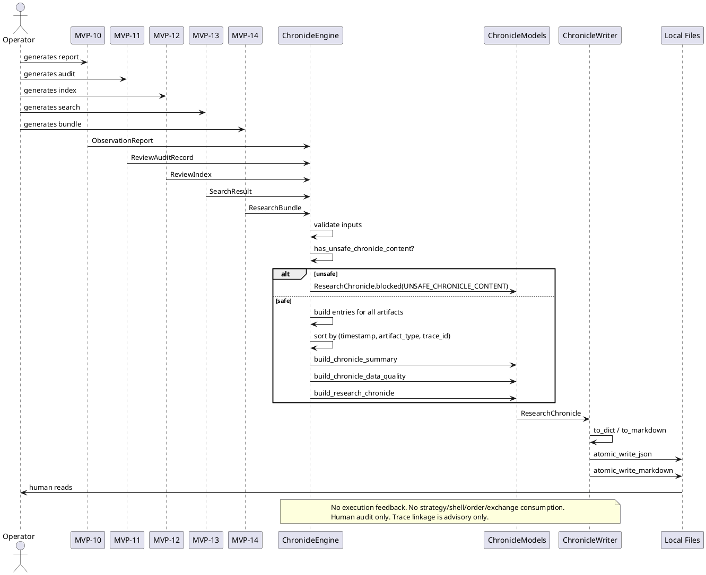

# SPEC-016 — Local Research Chronicle / Audit Timeline

## 1. Background

After MVP-10 through MVP-14, the system produces five categories of human-audit artifacts:

- **MVP-10 Observation Reports:** `data/observation/latest_observation_report.json` — research-only summaries. `ObservationReport` has no `report_id` field; chronicle entries synthesize a deterministic `trace_id` from `generated_at` and `version`.
- **MVP-11 Review Audit Records:** `data/review/latest_review_audit_record.json` — operator review summaries.
- **MVP-12 Review Index:** `data/review_index/latest_review_index.json` — catalog entries linking reports to reviews.
- **MVP-13 Search Results:** `data/review_search/latest_search_result.json` — query results over the review index.
- **MVP-14 Research Bundles:** `data/research_bundle/latest_research_bundle.json` — evidence packs collecting related items.

These artifacts are **human-audit-only** — not trading signals, not trade approvals, and must never be consumed by execution paths.

A human operator needs a way to:

1. **See the full timeline** of what happened when.
2. **Trace causality** across artifact types via `trace_id`.
3. **Filter temporally** by date range, artifact type, or reason code.
4. **Summarize activity** per day, per type, per status.

SPEC-016 designs a **Local Research Chronicle** layer (MVP-15) that consumes MVP-10–MVP-14 artifacts as read-only inputs and produces a deterministic, chronological, immutable timeline for human audit.

## 2. Requirements

### 2.1 Must Have (M)

- **M1:** Consume MVP-10–MVP-14 objects (or dicts) as read-only input.
- **M2:** Produce `ChronicleEntry` frozen dataclass — one event per artifact.
- **M3:** Produce `ChronicleSummary` frozen dataclass — aggregated counts.
- **M4:** Produce `ChronicleDataQuality` frozen dataclass — completeness metrics.
- **M5:** Produce `ChronicleSafetyFlags` frozen dataclass — all unsafe flags default `False`.
- **M6:** Produce `ResearchChronicle` frozen dataclass — full timeline container.
- **M7:** Entries sorted by `timestamp` ascending, with deterministic tie-breaking `(timestamp, artifact_type.value, trace_id)` for deterministic output.
- **M8:** Each entry has an `artifact_type` enum (`OBSERVATION`, `REVIEW`, `INDEX`, `SEARCH`, `BUNDLE`).
- **M9:** Each entry has a `trace_id` linking related artifacts across MVPs.
- **M10:** Fail-closed: missing/invalid inputs → blocked chronicle with `CHRONICLE_ERROR`.
- **M11:** Deterministic reason codes, priority-ordered.
- **M12:** JSON/Markdown writer with atomic writes, safety notice, no secrets.
- **M13:** Default JSON: `data/chronicle/latest_research_chronicle.json`.
- **M14:** Default Markdown: `reports/chronicle/latest_research_chronicle.md`.
- **M15:** No file reads, network, database, or exchange connections.
- **M16:** No trading decisions, approvals, or execution logic. Chronicle is human-audit-only.

### 2.2 Should Have (S)

- **S1:** Filter by `artifact_type`, `timestamp` range, `reason_code`, `state`.
- **S2:** Filter by `trace_id` to show related artifacts.
- **S3:** Summary counts per artifact type.
- **S4:** Daily bucketed summary counts (`YYYY-MM-DD` → `{type: count}`).
- **S5:** Reason code frequency across all types.
- **S6:** Trace completeness percentage.

### 2.3 Could Have (C)

- **C1:** Gap detection — time periods with no artifacts.
- **C2:** Chronicle diff between two snapshots.
- **C3:** CSV export.

### 2.4 Won't Have (W)

- **W1:** Web UI, dashboard, database, HTTP API, server, auth.
- **W2:** Any feedback into execution, strategy, Freqtrade, order, exchange paths.
- **W3:** Binance, real exchange, live trading, real orders, leverage, shorting.
- **W4:** Config YAML, JSON schema, deployable Freqtrade strategy class.
- **W5:** Secrets, credentials, executable trading instructions in output.

## 3. Method

### 3.1 Models

#### `ArtifactType`

```python
class ArtifactType(Enum):
    OBSERVATION = "observation"
    REVIEW = "review"
    INDEX = "index"
    SEARCH = "search"
    BUNDLE = "bundle"
```

#### Chronicle Version

```python
CHRONICLE_VERSION = "1.0"
```

#### `ChronicleEntry`

```python
@dataclass(frozen=True)
class ChronicleEntry:
    entry_id: str
    timestamp: datetime
    artifact_type: ArtifactType
    trace_id: str
    state: str
    version: str
    entry_count: int = 0
    reason_codes: tuple[str, ...] = ()
    actor: str | None = None
    notes: str | None = None
    tags: tuple[str, ...] = ()
    metadata: Mapping[str, Any] = field(default_factory=dict)
    related_trace_ids: tuple[str, ...] = ()
```

Validation:
- `entry_id` must be a non-empty, deterministic string (not a random UUID). Recommended derivation: `entry_id = f"{artifact_type.value}:{trace_id}:{timestamp_iso}"`.
- `timestamp` timezone-aware.
- `artifact_type` must be an `ArtifactType` enum instance (`isinstance` check).
- `notes` and `metadata` filtered through forbidden content check.
- File references are local strings only — not traversed, opened, followed, validated, or executed.
- `entry_id` must not use `uuid.uuid4()` or any other non-deterministic source. Same inputs → same `entry_id` → same sort order → same output.

#### `ChronicleSummary`

```python
@dataclass(frozen=True)
class ChronicleSummary:
    total_entries: int
    observation_count: int
    review_count: int
    index_count: int
    search_count: int
    bundle_count: int
    blocked_count: int
    ready_count: int
    accepted_count: int
    rejected_count: int
    unknown_count: int
    reason_code_counts: dict[str, int]
    tag_counts: dict[str, int]
    actor_counts: dict[str, int]
    timestamp_range: tuple[str, str] | None
    daily_counts: dict[str, dict[str, int]]
```

#### `ChronicleDataQuality`

```python
@dataclass(frozen=True)
class ChronicleDataQuality:
    has_observations: bool
    has_reviews: bool
    has_index: bool
    has_search: bool
    has_bundle: bool
    orphan_observation_count: int
    orphan_review_count: int
    trace_completeness_pct: float
    gap_count: int
    stale_entry_count: int
    validation_errors: tuple[str, ...]
```

#### `ChronicleSafetyFlags`

```python
@dataclass(frozen=True)
class ChronicleSafetyFlags:
    dry_run: bool = True
    live_trading_enabled: bool = False
    real_orders_enabled: bool = False
    leverage_enabled: bool = False
    shorting_enabled: bool = False
    chronicle_output_is_human_audit_only: bool = True
    chronicle_output_not_trading_signal: bool = True
    chronicle_output_not_trade_approval: bool = True
    chronicle_output_not_for_execution: bool = True
    chronicle_output_not_for_strategy: bool = True
    chronicle_output_not_for_freqtrade: bool = True
    chronicle_output_not_for_order: bool = True
    chronicle_output_not_for_exchange: bool = True
    chronicle_feedback_into_execution: bool = False

    def __post_init__(self) -> None:
        unsafe_flags = (
            self.live_trading_enabled,
            self.real_orders_enabled,
            self.leverage_enabled,
            self.shorting_enabled,
            self.chronicle_feedback_into_execution,
        )
        if any(unsafe_flags):
            raise ValueError("unsafe chronicle safety flags are enabled")
        safe_flags = (
            self.chronicle_output_is_human_audit_only,
            self.chronicle_output_not_trading_signal,
            self.chronicle_output_not_trade_approval,
            self.chronicle_output_not_for_execution,
            self.chronicle_output_not_for_strategy,
            self.chronicle_output_not_for_freqtrade,
            self.chronicle_output_not_for_order,
            self.chronicle_output_not_for_exchange,
        )
        if not all(safe_flags):
            raise ValueError("safe chronicle output flags must be True")
```

#### `ResearchChronicle`

```python
@dataclass(frozen=True)
class ResearchChronicle:
    chronicle_id: str
    generated_at: datetime
    version: str = CHRONICLE_VERSION
    entries: tuple[ChronicleEntry, ...] = ()
    summary: ChronicleSummary = field(default_factory=ChronicleSummary)
    data_quality: ChronicleDataQuality = field(default_factory=ChronicleDataQuality)
    safety_flags: ChronicleSafetyFlags = field(default_factory=ChronicleSafetyFlags)
    reason_codes: tuple[str, ...] = ()
```

Fail-closed factory:
```python
@classmethod
def blocked(cls, reason: str = "CHRONICLE_ERROR") -> "ResearchChronicle":
    return cls(
        chronicle_id="blocked",
        generated_at=datetime.now(timezone.utc),
        version=CHRONICLE_VERSION,
        entries=(),
        summary=ChronicleSummary(...),
        data_quality=ChronicleDataQuality(...),
        safety_flags=ChronicleSafetyFlags(),
        reason_codes=(reason,),
    )
```

### 3.2 Reason Codes

Deterministic, priority-ordered. Blocking codes short-circuit chronicle construction. Non-blocking codes are tracked in `ChronicleDataQuality` only.

**Blocking priority (short-circuit evaluation):**

```python
CHRONICLE_BLOCKING_REASON_CODES = (
    "MISSING_ARTIFACTS",              # 1 — no artifacts provided at all
    "INVALID_OBSERVATION",          # 2 — observation missing required fields
    "INVALID_REVIEW",                 # 3 — review missing required fields
    "INVALID_INDEX",                  # 4 — index missing required fields
    "INVALID_SEARCH",                 # 5 — search result missing required fields
    "INVALID_BUNDLE",                 # 6 — bundle missing required fields
    "INVALID_TIMESTAMP",              # 7 — timestamp missing or not timezone-aware
    "MISSING_TRACE_ID",               # 8 — trace_id could not be derived or is absent
    "UNSUPPORTED_OBSERVATION_VERSION",  # 9 — observation version not recognized
    "UNSUPPORTED_REVIEW_VERSION",     # 10 — review version not recognized
    "UNSUPPORTED_INDEX_VERSION",      # 11 — index version not recognized
    "UNSUPPORTED_SEARCH_VERSION",     # 12 — search version not recognized
    "UNSUPPORTED_BUNDLE_VERSION",     # 13 — bundle version not recognized
    "UNSAFE_CHRONICLE_CONTENT",       # 14 — forbidden terms in notes/metadata
    "CHRONICLE_ERROR",                # 15 — catch-all for unexpected errors
)
```

**Non-blocking tracking (data_quality only):**

```python
CHRONICLE_TRACKING_REASON_CODES = (
    "STALE_ARTIFACT",                 # tracked in data_quality, not blocking
    "ORPHAN_OBSERVATION",             # tracked in data_quality, not blocking
    "ORPHAN_REVIEW",                  # tracked in data_quality, not blocking
)
```

**Combined tuple:**

```python
CHRONICLE_REASON_CODES = CHRONICLE_BLOCKING_REASON_CODES + CHRONICLE_TRACKING_REASON_CODES
```

### 3.3 Forbidden Content

```python
FORBIDDEN_CHRONICLE_TERMS = frozenset({
    "enter_long", "enter_short", "exit_long", "exit_short",
    "api_key", "secret", "exchange_credentials", "executable_instructions",
    "order", "position", "leverage", "margin", "liquidation",
    "private_key", "password", "token", "auth",
})
```

### 3.4 Engine Functions

```python
def has_unsafe_chronicle_content(text: str) -> bool: ...

def build_chronicle_entry_from_observation(report: ObservationReport | dict) -> ChronicleEntry:
    """Build a ChronicleEntry from an ObservationReport.

    `ObservationReport` has no `report_id` field. The builder synthesizes a
    deterministic `trace_id` from `report.generated_at` and `report.version`:

        trace_id = "observation:{generated_at_iso}:{version}"

    If `generated_at` is missing or invalid, the builder raises `ValueError`
    with `INVALID_TIMESTAMP` (or `MISSING_TRACE_ID` if `generated_at` is absent).
    If `version` is missing, raises `UNSUPPORTED_OBSERVATION_VERSION`.
    The `trace_id` is never a random UUID — same inputs always produce the same ID.
    """

def build_chronicle_entry_from_review(
    audit_record: ReviewAuditRecord | dict,
    related_trace_ids: tuple[str, ...] = (),
) -> ChronicleEntry:
    """Build a ChronicleEntry from a ReviewAuditRecord at the container level.

    `ReviewAuditRecord` is a container of `ReviewRecord` child objects. The
    chronicle entry represents the container, not individual child records.
    Fields used:

        trace_id = "review-audit:{audit_record.generated_at_iso}:{version}"
        timestamp = audit_record.generated_at
        state = audit_record.audit_state
        version = "1.0"

    `ReviewAuditRecord` does not have `version`, `reviewed_at`, `review_status`,
    `reviewer`, `notes`, or `tags` at the container level. Child `ReviewRecord` fields may be
    summarized into `metadata` for human context only — they are not used for trace
    linkage, routing, or any automated logic. The chronicle entry is advisory only.
    """

def build_chronicle_entry_from_index(index: ReviewIndex | dict) -> ChronicleEntry:
    """Build a ChronicleEntry from a ReviewIndex.

    The `entry_count` field is derived as `len(index.entries)` — there is no
    `entry_count` field on `ReviewIndex` itself.
    """

def build_chronicle_entry_from_search(search_result: SearchResult | dict) -> ChronicleEntry: ...

def build_chronicle_entry_from_bundle(bundle: ResearchBundle | dict) -> ChronicleEntry: ...

def build_chronicle_summary(entries: Sequence[ChronicleEntry]) -> ChronicleSummary: ...

def build_chronicle_data_quality(
    observations: Sequence[ObservationReport | dict],
    reviews: Sequence[ReviewAuditRecord | dict],
    indices: Sequence[ReviewIndex | dict],
    searches: Sequence[SearchResult | dict],
    bundles: Sequence[ResearchBundle | dict],
    entries: Sequence[ChronicleEntry],
    stale_threshold_seconds: int = 86400,
    gap_threshold_seconds: int = 3600,
) -> ChronicleDataQuality: ...

def build_research_chronicle(
    observations: Sequence = (),
    reviews: Sequence = (),
    indices: Sequence = (),
    searches: Sequence = (),
    bundles: Sequence = (),
    stale_threshold_seconds: int = 86400,
    gap_threshold_seconds: int = 3600,
) -> ResearchChronicle: ...
```

Fail-closed priority:
1. `MISSING_ARTIFACTS` → blocked
2. `INVALID_*` → blocked
3. `UNSUPPORTED_*_VERSION` → blocked
4. `UNSAFE_CHRONICLE_CONTENT` → blocked
5. `CHRONICLE_ERROR` → blocked

Non-blocking tracking (data_quality only, never short-circuits):
- `STALE_ARTIFACT` → warning in data_quality
- `ORPHAN_OBSERVATION` → tracked in data_quality
- `ORPHAN_REVIEW` → tracked in data_quality

### 3.5 Writer

```python
def research_chronicle_to_dict(chronicle: ResearchChronicle) -> dict: ...

def research_chronicle_to_markdown(chronicle: ResearchChronicle) -> str: ...

def atomic_write_json_research_chronicle(chronicle: ResearchChronicle, target_path: Path | None = None) -> Path: ...

def atomic_write_markdown_research_chronicle(chronicle: ResearchChronicle, target_path: Path | None = None) -> Path: ...

def write_research_chronicle(chronicle: ResearchChronicle, json_path: Path | None = None, markdown_path: Path | None = None) -> tuple[Path, Path]: ...
```

Default paths:
```python
DEFAULT_CHRONICLE_JSON_PATH = Path("data/chronicle/latest_research_chronicle.json")
DEFAULT_CHRONICLE_MARKDOWN_PATH = Path("reports/chronicle/latest_research_chronicle.md")
```

Markdown includes explicit safety notice:
> "This local research chronicle is a human-audit timeline artifact only. It is not a trading signal, not trade approval, and must not be consumed by execution, strategy, Freqtrade shell, order, exchange, or any MVP execution path."

## 4. Implementation

### 4.1 Package Layout

```
src/hunter/
├── chronicle/
│   ├── __init__.py
│   ├── models.py
│   ├── engine.py
│   └── writer.py

tests/test_chronicle/
├── __init__.py
├── test_models.py
├── test_engine.py
├── test_writer.py
└── test_integration.py
```

### 4.2 Safety Invariants

1. Read-only input — never modifies source artifacts.
2. No file reads — built from in-memory objects only.
3. No network/database/exchange connections.
4. No execution feedback into any MVP layer or Freqtrade.
5. No trading logic — chronicle is human-audit-only.
6. No secrets in output.
7. Atomic writes (temp + fsync + replace + cleanup).
8. Explicit safety notice in Markdown.
9. Fail-closed — all errors produce blocked chronicle with reason code.
10. Deterministic — same inputs → same output every time. Entries sorted by `(timestamp, artifact_type.value, trace_id)`. `entry_id` must be deterministic, never a random UUID.
11. File references are local strings only — not traversed, opened, followed, validated, or executed.
12. No repair of bad inputs — summarized as BLOCKED/UNKNOWN/INVALID in data quality.
13. Trace linkage is advisory only — not used for automated routing or execution.

### 4.3 PlantUML Component Diagram

```plantuml
@startuml
!define RECTANGLE class

package "MVP-10" { RECTANGLE ObservationReport }
package "MVP-11" { RECTANGLE ReviewAuditRecord }
package "MVP-12" { RECTANGLE ReviewIndex }
package "MVP-13" { RECTANGLE SearchResult }
package "MVP-14" { RECTANGLE ResearchBundle }
package "MVP-15" {
    RECTANGLE ChronicleEngine
    RECTANGLE ChronicleModels
    RECTANGLE ChronicleWriter
    RECTANGLE ResearchChronicle
}
package "Human Operator" {
    RECTANGLE Browser
    RECTANGLE TextEditor
}

ObservationReport --> ChronicleEngine : read-only
ReviewAuditRecord --> ChronicleEngine : read-only
ReviewIndex --> ChronicleEngine : read-only
SearchResult --> ChronicleEngine : read-only
ResearchBundle --> ChronicleEngine : read-only
ChronicleEngine --> ChronicleModels : builds
ChronicleModels --> ResearchChronicle : assembles
ResearchChronicle --> ChronicleWriter : serializes
ChronicleWriter --> JSON_File : atomic write
ChronicleWriter --> Markdown_File : atomic write
JSON_File --> Browser : human reads
Markdown_File --> TextEditor : human reads

note right of ChronicleEngine
  No file reads. No network. No database.
  No execution feedback. Trace linkage is advisory.
end note

note right of ChronicleWriter
  Human-audit only. Safety notice. No secrets.
end note
@enduml
```

### 4.4 PlantUML Sequence Diagram



## 5. Milestones

### MVP-15 Step 1 — Chronicle Models and Engine

- Create `src/hunter/chronicle/__init__.py` with public API exports.
- Create `src/hunter/chronicle/models.py` with:
  - `CHRONICLE_VERSION` constant.
  - `ArtifactType`, `ChronicleEntry`, `ChronicleSummary`, `ChronicleDataQuality`, `ChronicleSafetyFlags`, `ResearchChronicle` frozen dataclasses.
  - `CHRONICLE_BLOCKING_REASON_CODES` and `CHRONICLE_TRACKING_REASON_CODES` tuples.
  - `CHRONICLE_REASON_CODES` combined tuple.
  - `FORBIDDEN_CHRONICLE_TERMS` frozenset.
  - `__post_init__` validation on all models.
- Create `src/hunter/chronicle/engine.py` with:
  - `has_unsafe_chronicle_content(...)`
  - `build_chronicle_entry_from_observation(...)`
  - `build_chronicle_entry_from_review(...)`
  - `build_chronicle_entry_from_index(...)`
  - `build_chronicle_entry_from_search(...)`
  - `build_chronicle_entry_from_bundle(...)`
  - `build_chronicle_summary(...)`
  - `build_chronicle_data_quality(...)`
  - `build_research_chronicle(...)`
- Create `tests/test_chronicle/__init__.py`.
- Create `tests/test_chronicle/test_models.py`.
- Create `tests/test_chronicle/test_engine.py`.
- Target: ~120 tests.

### MVP-15 Step 2 — Chronicle Writer

- Create `src/hunter/chronicle/writer.py` with:
  - `research_chronicle_to_dict(...)`
  - `research_chronicle_to_markdown(...)`
  - `atomic_write_json_research_chronicle(...)`
  - `atomic_write_markdown_research_chronicle(...)`
  - `write_research_chronicle(...)`
  - `DEFAULT_CHRONICLE_JSON_PATH`
  - `DEFAULT_CHRONICLE_MARKDOWN_PATH`
- Update `src/hunter/chronicle/__init__.py` with writer exports.
- Create `tests/test_chronicle/test_writer.py`.
- Target: ~50 tests.

### MVP-15 Step 3 — Integration Tests

- Create `tests/test_chronicle/test_integration.py` with:
  - Happy path: all 5 artifact types → chronicle → JSON/Markdown → verify.
  - Missing artifacts → blocked chronicle.
  - Invalid artifact → blocked chronicle.
  - Orphan observation/review → tracked in data_quality.
  - Unsafe content → blocked chronicle.
  - Empty timeline → empty chronicle with correct summary.
  - Multiple artifacts → correct summary counts, daily counts, trace linkage.
  - Safety assertions: no file reads, no network, no execution feedback, trace linkage advisory only.
- Target: ~45 tests.

### MVP-15 Step 4 — Final Review

- Review checklist:
  - SPEC-016 coverage verification.
  - Models review (validation, immutability, fail-closed factories).
  - Engine review (fail-closed rules, deterministic reason codes, no file reads, no network).
  - Writer review (atomic writes, safety notice, no secrets).
  - Test review (all tests pass, coverage adequate).
  - Safety review (all constraints verified).
- Run: `pytest -q --import-mode=importlib`, `git status`, `git log --oneline --max-count=15`.
- Verdict: PASS / PASS WITH NOTES / FAIL.
- If PASS: memory update + version bump to 0.15.0-dev.

## 6. Gathering Results

### 6.1 Test Plan

| Category | Target | Coverage |
|----------|--------|----------|
| Model validation | 50 | All fields, boundaries, fail-closed factories, immutability |
| Engine functions | 70 | All 9 engine functions, fail-closed rules, reason codes, unsafe content |
| Writer functions | 50 | Dict serialization, Markdown content, atomic writes, safety notice |
| Integration | 45 | End-to-end flows, error paths, safety assertions, trace linkage |
| **Total** | **~215** | |

### 6.2 Expected Full Suite Count

Current: 2922 tests (MVP-0 through MVP-14).
Expected after MVP-15: ~3137 tests.

### 6.3 Output Artifacts

- `data/chronicle/latest_research_chronicle.json` — machine-readable timeline.
- `reports/chronicle/latest_research_chronicle.md` — human-readable timeline with safety notice.

## 7. Need Professional Help?

This SPEC follows the same agent-first, safety-first, fail-closed design pattern established in SPEC-011 through SPEC-015. If you need help with:

- **Architecture review:** Ensure chronicle design scales with artifact volume.
- **Performance analysis:** In-memory sorting/filtering for large timelines.
- **Security audit:** Verify no execution feedback paths exist.
- **Test strategy:** Expand integration test coverage for cross-MVP trace linkage.

Consult the project maintainers or open a design review issue.

---

**Document metadata:**
- **Version:** 1.0-draft
- **Date:** 2026-06-28
- **Author:** WrongStack
- **Status:** Draft — awaiting human review before implementation.
- **Next step:** Human approval → MVP-15 Step 1 implementation.
