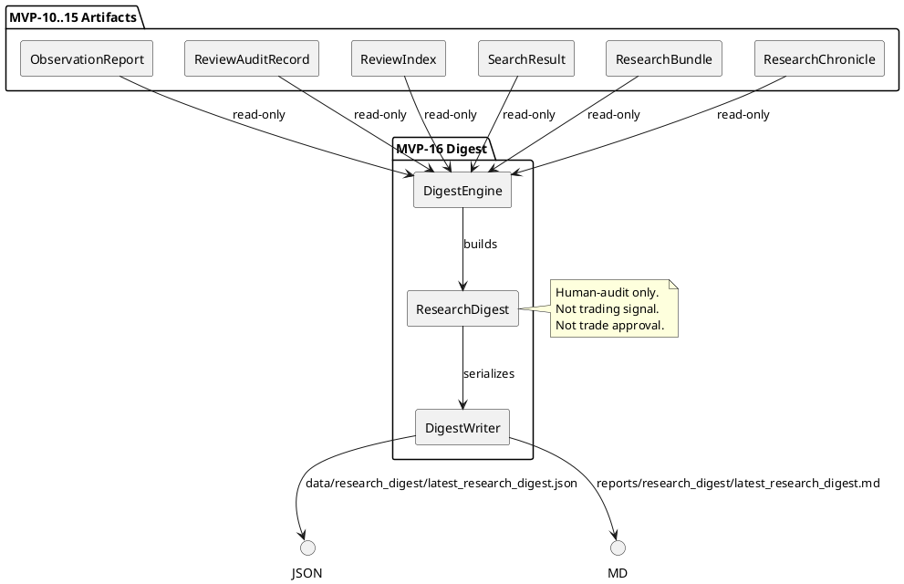
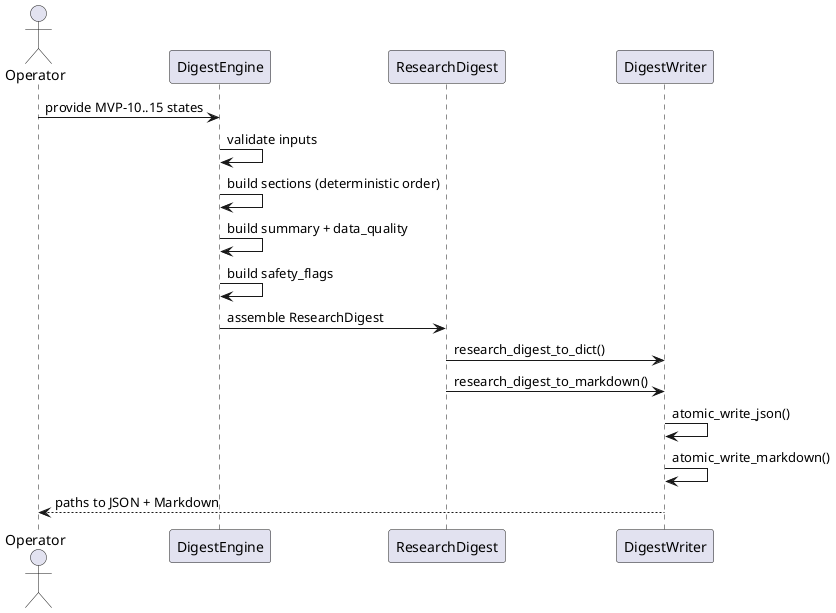

# SPEC-017 — Local Research Digest / Executive Summary

## 1. Background

After MVP-10 through MVP-15, the system produces six categories of human-audit artifacts:

- **MVP-10 Observation Reports:** `data/observation/latest_observation_report.json` — research-only summaries.
- **MVP-11 Review Audit Records:** `data/review/latest_review_audit_record.json` — operator review outcomes.
- **MVP-12 Review Index:** `data/review_index/latest_review_index.json` — catalog entries linking reports to reviews.
- **MVP-13 Search Results:** `data/review_search/latest_search_result.json` — query results over the review index.
- **MVP-14 Research Bundles:** `data/research_bundle/latest_research_bundle.json` — evidence packs collecting related items.
- **MVP-15 Research Chronicle:** `data/chronicle/latest_research_chronicle.json` — chronological audit timeline.

These artifacts are **human-audit-only** — not trading signals, not trade approvals, and must never be consumed by execution paths.

A human operator or contractor needs a way to:

1. **Read a single-page summary** of the entire research audit pipeline.
2. **See at a glance** which artifacts are ready, blocked, or missing.
3. **Identify unresolved blockers** and their reason codes.
4. **Review safety flags** across all layers.
5. **Hand off to another operator** with a concise, deterministic snapshot.

SPEC-017 designs a **Local Research Digest** layer (MVP-16) that consumes MVP-10–MVP-15 objects as read-only inputs and produces a short, deterministic, human-readable executive summary for audit and contractor handoff.

## 2. Requirements

### 2.1 Must Have (M)

- **M1:** Consume MVP-10–MVP-15 objects (or dicts) as read-only input.
- **M2:** Produce `DigestSection` frozen dataclass — one summary per artifact type.
- **M3:** Produce `DigestSummary` frozen dataclass — top-level aggregated counts.
- **M4:** Produce `DigestDataQuality` frozen dataclass — completeness and blocker metrics.
- **M5:** Produce `DigestSafetyFlags` frozen dataclass — all unsafe flags default `False`.
- **M6:** Produce `ResearchDigest` frozen dataclass — full digest container.
- **M7:** Sections ordered deterministically: `(OBSERVATION, REVIEW, INDEX, SEARCH, BUNDLE, CHRONICLE)`.
- **M8:** Each section has `section_kind`, `state`, `count`, `reason_codes`, `blockers_count`, and `notes`.
- **M9:** Fail-closed: missing/invalid inputs → blocked digest with `DIGEST_ERROR`.
- **M10:** Deterministic reason codes, priority-ordered.
- **M11:** JSON/Markdown writer with atomic writes, safety notice, no secrets.
- **M12:** Default JSON: `data/research_digest/latest_research_digest.json`.
- **M13:** Default Markdown: `reports/research_digest/latest_research_digest.md`.
- **M14:** No file reads, network, database, or exchange connections.
- **M15:** No trading decisions, approvals, or execution logic. Digest is human-audit-only.
- **M16:** Include human-readable `next_review_notes` for contractor handoff.

### 2.2 Should Have (S)

- **S1:** Unresolved blocker summary — list of all reason codes with `BLOCKED` or `UNKNOWN` counts.
- **S2:** Safety flags consolidated across all layers.
- **S3:** Cross-layer readiness check — all layers `READY` → digest `READY`.
- **S4:** Section-level `DigestDataQuality` with `completeness_pct`, `missing_count`, `stale_count`.
- **S5:** Deterministic `digest_id` derived from `generated_at` and `version` (not random UUID).

### 2.3 Could Have (C)

- **C1:** Diff digest between two snapshots (for tracking changes over time).
- **C2:** Custom section ordering via config.
- **C3:** Export to PDF or email-ready format.

### 2.4 Won't Have (W)

- **W1:** Web UI, dashboard, database, HTTP API, server, auth.
- **W2:** Any feedback into execution, strategy, Freqtrade, order, exchange paths.
- **W3:** Binance, real exchange, live trading, real orders, leverage, shorting.
- **W4:** Config YAML, JSON schema, deployable Freqtrade strategy class.
- **W5:** Secrets, credentials, executable trading instructions in output.
- **W6:** Automated action generation from digest content.

## 3. Method

### 3.1 Models

#### `DigestState`

```python
class DigestState(Enum):
    DISABLED = "disabled"
    READY = "ready"
    BLOCKED = "blocked"
    UNKNOWN = "unknown"
```

#### `DigestSectionKind`

```python
class DigestSectionKind(Enum):
    OBSERVATION = "observation"
    REVIEW = "review"
    INDEX = "index"
    SEARCH = "search"
    BUNDLE = "bundle"
    CHRONICLE = "chronicle"
```

#### `DigestConfig`

```python
@dataclass(frozen=True)
class DigestConfig:
    version: str = "1.0"
    generated_at: datetime | None = None
    output_format: str = "both"
    dry_run: bool = True
    live_trading_enabled: bool = False
    real_orders_enabled: bool = False
    leverage_enabled: bool = False
    shorting_enabled: bool = False
    stale_threshold_minutes: int = 60
    include_next_review_notes: bool = True
    include_safety_flags: bool = True
    include_unresolved_blockers: bool = True
    include_reason_code_summary: bool = True
```

Validation:
- `version` must not be empty.
- `output_format` must be one of `("json", "markdown", "both")`.
- `dry_run` must be `True` (safety invariant).
- `live_trading_enabled`, `real_orders_enabled`, `leverage_enabled`, `shorting_enabled` must all be `False` (safety invariant).
- `stale_threshold_minutes` must be a positive integer (≥ 1).

Note: `digest_id` is not in config — it is derived deterministically in `ResearchDigest` as `f"digest:{version}:{generated_at_iso}"`.

#### `DigestSafetyFlags`

```python
@dataclass(frozen=True)
class DigestSafetyFlags:
    # Runtime safety flags (matching ChronicleSafetyFlags pattern)
    dry_run: bool = True
    live_trading_enabled: bool = False
    real_orders_enabled: bool = False
    leverage_enabled: bool = False
    shorting_enabled: bool = False

    # Output safety flags
    digest_output_is_human_audit_only: bool = True
    digest_output_not_trading_signal: bool = True
    digest_output_not_trade_approval: bool = True
    digest_output_not_for_execution: bool = True
    digest_output_not_for_strategy: bool = True
    digest_output_not_for_freqtrade: bool = True
    digest_output_not_for_order: bool = True
    digest_output_not_for_exchange: bool = True

    # Feedback safety flags
    digest_feedback_into_execution: bool = False
    cross_layer_feedback_into_execution: bool = False

    # Advisory flags
    trace_linkage_advisory_only: bool = True
    file_refs_not_traversed: bool = True

    def __post_init__(self) -> None:
        unsafe_flags = (
            self.live_trading_enabled,
            self.real_orders_enabled,
            self.leverage_enabled,
            self.shorting_enabled,
            self.digest_feedback_into_execution,
            self.cross_layer_feedback_into_execution,
        )
        if any(unsafe_flags):
            raise ValueError("unsafe digest safety flags are enabled")
        if not self.dry_run:
            raise ValueError("dry_run must be True")
        safe_flags = (
            self.digest_output_is_human_audit_only,
            self.digest_output_not_trading_signal,
            self.digest_output_not_trade_approval,
            self.digest_output_not_for_execution,
            self.digest_output_not_for_strategy,
            self.digest_output_not_for_freqtrade,
            self.digest_output_not_for_order,
            self.digest_output_not_for_exchange,
            self.trace_linkage_advisory_only,
            self.file_refs_not_traversed,
        )
        if not all(safe_flags):
            raise ValueError("safe digest output flags must be True")
```

All unsafe flags default to `False` (safe). All safe output flags default to `True` (safe). `dry_run` defaults to `True`. `__post_init__` enforces these invariants at construction time.

#### `DigestSection`

```python
@dataclass(frozen=True)
class DigestSection:
    section_kind: DigestSectionKind
    state: str = "UNKNOWN"
    count: int = 0
    blocked_count: int = 0
    ready_count: int = 0
    missing_count: int = 0
    reason_codes: tuple[str, ...] = ()
    blockers_count: int = 0
    unresolved_blocker_reasons: tuple[str, ...] = ()
    notes: str | None = None
    metadata: Mapping[str, Any] = field(default_factory=dict)
```

Validation:
- `section_kind` must be a `DigestSectionKind` enum instance.
- `state` must be one of `("DISABLED", "READY", "BLOCKED", "UNKNOWN")`.
- `count` and `blocked_count` must be non-negative integers.
- `notes` filtered through forbidden content check.
- `metadata` must not contain forbidden keys.

#### `DigestSummary`

```python
@dataclass(frozen=True)
class DigestSummary:
    total_sections: int = 0
    ready_sections: int = 0
    blocked_sections: int = 0
    missing_sections: int = 0
    total_artifacts: int = 0
    total_blockers: int = 0
    unresolved_blockers: int = 0
    reason_code_counts: Mapping[str, int] = field(default_factory=dict)
    cross_layer_ready: bool = False
    next_review_notes: str = ""
```

Validation:
- `ready_sections + blocked_sections ≤ total_sections`.
- `missing_sections ≤ total_sections` (missing may overlap with blocked — a section can be `BLOCKED` state AND have `missing_count > 0`).
- `total_blockers ≥ unresolved_blockers`.
- `next_review_notes` filtered through forbidden content check.

#### `DigestDataQuality`

```python
@dataclass(frozen=True)
class DigestDataQuality:
    completeness_pct: float = 0.0
    missing_count: int = 0
    stale_count: int = 0
    invalid_count: int = 0
    blocked_count: int = 0
    total_sections: int = 0
    reason: str = ""
```

Validation:
- `completeness_pct` must be between `0.0` and `100.0` inclusive.
- `missing_count`, `stale_count`, `invalid_count`, `blocked_count` must be non-negative.
- `completeness_pct` = `(ready_sections / total_sections) * 100` when `total_sections > 0`, else `0.0`.

#### `ResearchDigest`

```python
@dataclass(frozen=True)
class ResearchDigest:
    digest_id: str
    generated_at: datetime
    version: str = "1.0"
    state: DigestState = DigestState.UNKNOWN
    sections: tuple[DigestSection, ...] = ()
    summary: DigestSummary = field(default_factory=DigestSummary)
    data_quality: DigestDataQuality = field(default_factory=DigestDataQuality)
    safety_flags: DigestSafetyFlags = field(default_factory=DigestSafetyFlags)
    config: DigestConfig = field(default_factory=DigestConfig)
    reason_codes: tuple[str, ...] = ()
    next_review_notes: str = ""
```

Validation:
- `digest_id` must be a non-empty, deterministic string. Recommended derivation: `digest_id = f"digest:{version}:{generated_at_iso}"`.
- `version` must not be empty.
- `generated_at` must be timezone-aware.
- `state` must be a `DigestState` enum instance.
- `sections` ordered deterministically by `section_kind.value`.
- `next_review_notes` filtered through forbidden content check.

### 3.2 Engine

#### `build_digest_safety_flags(config: DigestConfig) -> DigestSafetyFlags`

Returns `DigestSafetyFlags` with all safe defaults. If `config` has any unsafe flag set to `True` (`live_trading_enabled`, `real_orders_enabled`, `leverage_enabled`, `shorting_enabled`) or `dry_run` is `False`, raises `ValueError`. The `__post_init__` on `DigestSafetyFlags` enforces that unsafe flags must be `False`, safe output flags must be `True`, and `dry_run` must be `True`.

#### `has_unsafe_digest_content(notes: str | None, metadata: Mapping[str, Any] | None) -> bool`

Returns `True` if `notes` or `metadata` contains any forbidden terms.

Forbidden terms (superset of `FORBIDDEN_CHRONICLE_TERMS` from SPEC-016):
```python
FORBIDDEN_DIGEST_TERMS = frozenset({
    # Credential / secret terms (from SPEC-016)
    "api_key", "secret", "exchange_credentials", "executable_instructions",
    "private_key", "password", "token", "auth",
    # Trading execution terms (from SPEC-016)
    "enter_long", "enter_short", "exit_long", "exit_short",
    "order", "position", "leverage", "margin", "liquidation",
    # Additional trading terms (digest-specific)
    "live_trade", "real_order", "market_order", "limit_order",
    "position_size",
})
```

Case-insensitive matching.

#### `build_digest_section(
    section_kind: DigestSectionKind,
    artifact_state: str | None,
    artifact_count: int,
    blocked_count: int,
    ready_count: int,
    missing_count: int,
    reason_codes: tuple[str, ...],
    notes: str | None = None,
    metadata: Mapping[str, Any] | None = None,
) -> DigestSection`

Builds a `DigestSection` with deterministic counts.

- If `artifact_state` is `None` or empty → `state = "UNKNOWN"`, `missing_count = 1`.
- If `artifact_state` in `("BLOCKED", "UNKNOWN", "DISABLED")` → `state = artifact_state`, `blockers_count = blocked_count + missing_count`.
- If `artifact_state == "READY"` and `has_unsafe_digest_content(notes, metadata)` → `state = "BLOCKED"`, `reason_codes = reason_codes + ("UNSAFE_DIGEST_CONTENT",)`.
- Else → `state = "READY"`, `blockers_count = 0`.

`unresolved_blocker_reasons` = filtered `reason_codes` where reason indicates a blocking condition (e.g., `BLOCKED`, `MISSING_*`, `INVALID_*`, `UNSAFE_*`).

#### `build_digest_summary(sections: tuple[DigestSection, ...]) -> DigestSummary`

Aggregates counts across all sections:

```python
total_sections = len(sections)
ready_sections = sum(1 for s in sections if s.state == "READY")
blocked_sections = sum(1 for s in sections if s.state in ("BLOCKED", "UNKNOWN"))
missing_sections = sum(1 for s in sections if s.missing_count > 0)
total_artifacts = sum(s.count for s in sections)
total_blockers = sum(s.blockers_count for s in sections)
unresolved_blockers = sum(len(s.unresolved_blocker_reasons) for s in sections)
reason_code_counts = Counter()
for s in sections:
    for rc in s.reason_codes:
        reason_code_counts[rc] += 1
cross_layer_ready = ready_sections == total_sections and total_sections > 0
next_review_notes = _generate_next_review_notes(sections) if include_next_review_notes else ""
```

`_generate_next_review_notes` produces a human-readable string:
- If `cross_layer_ready`: "All layers ready. No blockers detected. Digest is ready for handoff."
- If `blocked_sections > 0`: "Blocked sections detected: {list}. Review blockers before handoff."
- If `missing_sections > 0`: "Missing sections detected: {list}. Complete missing artifacts before handoff."

#### `build_digest_data_quality(sections: tuple[DigestSection, ...]) -> DigestDataQuality`

```python
total_sections = len(sections)
ready_count = sum(1 for s in sections if s.state == "READY")
completeness_pct = (ready_count / total_sections * 100.0) if total_sections > 0 else 0.0
missing_count = sum(s.missing_count for s in sections)
stale_count = sum(1 for s in sections if s.state == "UNKNOWN")
invalid_count = sum(1 for s in sections if "INVALID" in str(s.reason_codes))
blocked_count = sum(s.blocked_count for s in sections)
reason = _first_reason_code(sections) if blocked_count > 0 else ""
```

#### `build_research_digest(
    config: DigestConfig,
    observation_state: str | None = None,
    review_state: str | None = None,
    index_state: str | None = None,
    search_state: str | None = None,
    bundle_state: str | None = None,
    chronicle_state: str | None = None,
    observation_count: int = 0,
    review_count: int = 0,
    index_count: int = 0,
    search_count: int = 0,
    bundle_count: int = 0,
    chronicle_count: int = 0,
    observation_reason_codes: tuple[str, ...] = (),
    review_reason_codes: tuple[str, ...] = (),
    index_reason_codes: tuple[str, ...] = (),
    search_reason_codes: tuple[str, ...] = (),
    bundle_reason_codes: tuple[str, ...] = (),
    chronicle_reason_codes: tuple[str, ...] = (),
    next_review_notes: str = "",
) -> ResearchDigest`

Main entry point. Builds full digest from layer states.

**Fail-closed priority order:**
1. `EMPTY_DIGEST` — no inputs provided and all counts are zero.
2. `INVALID_CONFIG` — `config.version` empty or `config` invalid.
3. `UNSAFE_CONFIG` — `dry_run` is `False` or any unsafe flag is `True`.
4. `MISSING_OBSERVATION` — `observation_state` is `None` and no observation section provided.
5. `MISSING_REVIEW` — `review_state` is `None` and no review section provided.
6. `MISSING_INDEX` — `index_state` is `None` and no index section provided.
7. `MISSING_SEARCH` — `search_state` is `None` and no search section provided.
8. `MISSING_BUNDLE` — `bundle_state` is `None` and no bundle section provided.
9. `MISSING_CHRONICLE` — `chronicle_state` is `None` and no chronicle section provided.
10. `INVALID_OBSERVATION` — observation state is present but not a recognized value.
11. `INVALID_REVIEW` — review state is present but not a recognized value.
12. `INVALID_INDEX` — index state is present but not a recognized value.
13. `INVALID_SEARCH` — search state is present but not a recognized value.
14. `INVALID_BUNDLE` — bundle state is present but not a recognized value.
15. `INVALID_CHRONICLE` — chronicle state is present but not a recognized value.
16. `UNSAFE_DIGEST_CONTENT` — `next_review_notes` or any section notes contain forbidden terms.
17. `DIGEST_ERROR` — catch-all for unexpected calculation errors.

If any blocking reason is found, returns `ResearchDigest.blocked()` with the first reason code.

`ResearchDigest.blocked()` factory:
- `state = DigestState.BLOCKED`
- `sections = ()` (empty tuple)
- `summary = DigestSummary(total_sections=0, blocked_sections=1, next_review_notes="Digest blocked: {reason}")`
- `data_quality = DigestDataQuality(completeness_pct=0.0, blocked_count=1, reason="{reason}")`
- `reason_codes = (reason,)`
- `safety_flags = DigestSafetyFlags()` (all safe)
- `generated_at = now_utc()`

### 3.3 Reason Codes

```python
REASON_CODES = (
    "EMPTY_DIGEST",
    "INVALID_CONFIG",
    "UNSAFE_CONFIG",
    "MISSING_OBSERVATION",
    "MISSING_REVIEW",
    "MISSING_INDEX",
    "MISSING_SEARCH",
    "MISSING_BUNDLE",
    "MISSING_CHRONICLE",
    "INVALID_OBSERVATION",
    "INVALID_REVIEW",
    "INVALID_INDEX",
    "INVALID_SEARCH",
    "INVALID_BUNDLE",
    "INVALID_CHRONICLE",
    "UNSAFE_DIGEST_CONTENT",
    "DIGEST_ERROR",
)
```

### 3.4 Writer

```python
DEFAULT_DIGEST_JSON_PATH = Path("data/research_digest/latest_research_digest.json")
DEFAULT_DIGEST_MARKDOWN_PATH = Path("reports/research_digest/latest_research_digest.md")
```

#### `research_digest_to_dict(digest: ResearchDigest) -> dict[str, Any]`

Deterministic JSON-safe serialization:
- `generated_at` → ISO-8601 UTC string with `Z` suffix.
- `state` → `.value` string.
- `sections` → list of dicts, each with `section_kind.value`.
- `summary` → dict with `reason_code_counts` as plain dict.
- `data_quality` → dict with all fields.
- `safety_flags` → dict with all fields.
- `config` → dict with all fields (exclude `None` for `generated_at` if needed).
- `reason_codes` → list of strings.
- `next_review_notes` → string (always included, may be empty).
- `digest_id` → string.

#### `research_digest_to_markdown(digest: ResearchDigest) -> str`

Human-readable Markdown with:
- Title: "Research Digest — Executive Summary"
- `digest_id` and `generated_at`.
- Overall `state` (READY / BLOCKED / UNKNOWN).
- `cross_layer_ready` status.
- Section table: kind, state, count, blockers, notes.
- Blocker summary: unresolved reason codes and counts.
- Safety flags summary.
- `next_review_notes` for contractor handoff.
- Explicit safety notice:
  > "This research digest is a human-audit artifact only. It is not a trading signal, not a trade approval, and must not be consumed by execution, strategy, Freqtrade shell, order, exchange, or any MVP execution path."

#### `atomic_write_json_research_digest(digest, path)` and `atomic_write_markdown_research_digest(digest, path)`

Atomic temp-file write pattern:
1. Create parent directories if missing.
2. Write to temp file with `.tmp` suffix.
3. `fsync` on file handle.
4. `os.replace(temp, target)`.
5. Clean up temp file on failure.

#### `write_research_digest(digest, json_path=None, markdown_path=None)`

Writes both JSON and Markdown. Returns `(json_path, markdown_path)`.

### 3.5 Deterministic Ordering Rules

- `DigestSection` ordering: `(OBSERVATION, REVIEW, INDEX, SEARCH, BUNDLE, CHRONICLE)` by `.value`.
- `reason_codes` within each section: preserve input order, deduplicated.
- `reason_code_counts` in summary: sorted by key alphabetically for deterministic output.
- `digest_id`: derived from `version` and `generated_at` ISO-8601 string, not random UUID.
- JSON output: `sort_keys=True`, `indent=2` for human readability.

### 3.6 PlantUML Diagrams

#### Component Diagram



#### Sequence Diagram



## 4. Implementation Plan

### Step 1: Models and Engine

- `src/hunter/research_digest/__init__.py` — public API exports.
- `src/hunter/research_digest/models.py` — frozen dataclasses, enums, reason codes, forbidden content detection.
- `src/hunter/research_digest/engine.py` — in-memory digest engine functions.
- `tests/test_research_digest/test_models.py` — model unit tests.
- `tests/test_research_digest/test_engine.py` — engine unit tests.

Expected test count: ~50 model + ~60 engine = ~110 tests.

### Step 2: Writer

- `src/hunter/research_digest/writer.py` — JSON/Markdown serialization, atomic file writing.
- `src/hunter/research_digest/__init__.py` — updated with writer exports.
- `tests/test_research_digest/test_writer.py` — writer unit tests.

Expected test count: ~50 writer tests.

### Step 3: Integration Tests

- `tests/test_research_digest/test_integration.py` — end-to-end integration tests.

Expected test count: ~40 integration tests.

### Step 4: Final Validation and Version Bump

- Run full test suite.
- Verify no regressions.
- Version bump `0.15.0-dev` → `0.16.0-dev`.
- Update `CHANGELOG.md`, `docs/handoff/CURRENT_STATE.md`, `tasks/active.md`, `tasks/agent-log.md`.

Expected total research_digest tests: ~200. Expected full suite: ~3360 tests.

## 5. Safety Constraints

- Research digest is a **human-audit artifact only**.
- **Not a trading signal.** Not a trade approval.
- Must **not** be consumed by execution, strategy, Freqtrade shell, order, exchange, or any MVP execution path.
- **No digest feedback** into execution paths.
- **No report/operator/index/search/bundle/chronicle/digest feedback** into execution paths.
- **No Binance, no exchange, no API keys, no live trading, no real orders, no leverage, no shorting.**
- File references and metadata strings remain **local strings only** and are not traversed, opened, followed, validated, or executed.
- **No Web UI, no dashboard, no database persistence, no server/API/auth.**
- **No database, no event store, no scheduler, no routing layer, no feedback layer.**
- No production data reads/writes except explicit digest output writes in writer step.
- All unsafe config flags (`live_trading_enabled`, `real_orders_enabled`, `leverage_enabled`, `shorting_enabled`) must be `False`.
- `dry_run` must be `True`.
- All safety flags default to `True` (safe).
- Fail-closed: any invalid/unsafe input produces `BLOCKED` + `DIGEST_ERROR`.

## 6. Non-Goals

- This SPEC does **not** create a config YAML file.
- This SPEC does **not** create a JSON schema.
- This SPEC does **not** create a Freqtrade strategy class.
- This SPEC does **not** add `freqtrade` imports.
- This SPEC does **not** connect to Binance, any exchange, or any network.
- This SPEC does **not** enable live trading, real orders, leverage, or shorting.
- This SPEC does **not** create a Web UI, dashboard, or database.
- This SPEC does **not** read or write production data paths beyond the explicit digest output files.
- This SPEC does **not** trigger any automated action based on digest content.
- This SPEC does **not** generate trading signals or trade approvals.

## 7. Milestones

| Milestone | Deliverable | Criteria |
|-----------|-------------|----------|
| M1 | SPEC-017 approved | Human review and approval of this document |
| M2 | Step 1 complete | Models + engine implemented, ~110 tests passing |
| M3 | Step 2 complete | Writer implemented, ~50 tests passing |
| M4 | Step 3 complete | Integration tests, ~40 tests passing, full suite ~3360 |
| M5 | Step 4 complete | Final validation, version bump to 0.16.0-dev, no regressions |
| M6 | Contractor handoff | Markdown digest ready for human audit, deterministic, fail-closed |

## 8. Gathering Results

### Evaluation Metrics

- **Deterministic digest output:** Same inputs → same `digest_id`, same JSON, same Markdown.
- **Concise human-readable summary:** Single-page Markdown, ≤ 100 lines for typical state.
- **Fail-closed behavior:** All invalid/unsafe/missing inputs → `BLOCKED` + `DIGEST_ERROR`.
- **No unsafe feedback paths:** Digest content never flows into execution, strategy, or trading logic.
- **Test coverage:** ≥ 70% for new code.
- **Full suite pass:** All existing tests pass, no regressions.
- **Safety invariants:** All safety flags safe, no forbidden terms in output, no secrets, no executable instructions.
- **Contractor handoff quality:** `next_review_notes` provides clear, actionable status for next operator.

### Success Criteria

- [ ] All ~200 research_digest tests pass.
- [ ] Full suite ≥ 3360 tests pass, 1 skipped (or fewer).
- [ ] No regressions in existing MVP-10..15 tests.
- [ ] Markdown digest contains explicit safety notice.
- [ ] JSON output is deterministic (same inputs → identical JSON).
- [ ] Blocked digest has `state = "BLOCKED"`, empty sections, clear reason code.
- [ ] Cross-layer ready = `True` only when all 6 sections are `READY`.
- [ ] `next_review_notes` is human-readable and actionable.
- [ ] No forbidden terms in any output.
- [ ] No secrets, credentials, or executable instructions in output.
- [ ] No file references traversed, opened, or executed.
- [ ] No network calls, database connections, or exchange interactions.

---

**Version:** 0.15.0-dev → 0.16.0-dev (upon completion).

**Status:** Draft — awaiting human review and approval.
