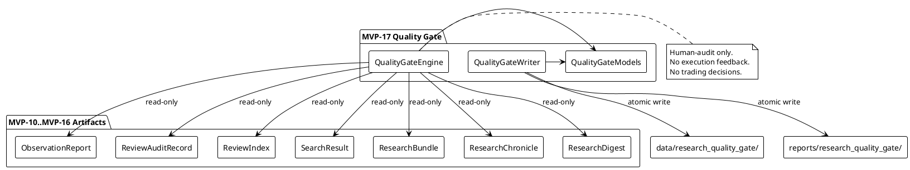
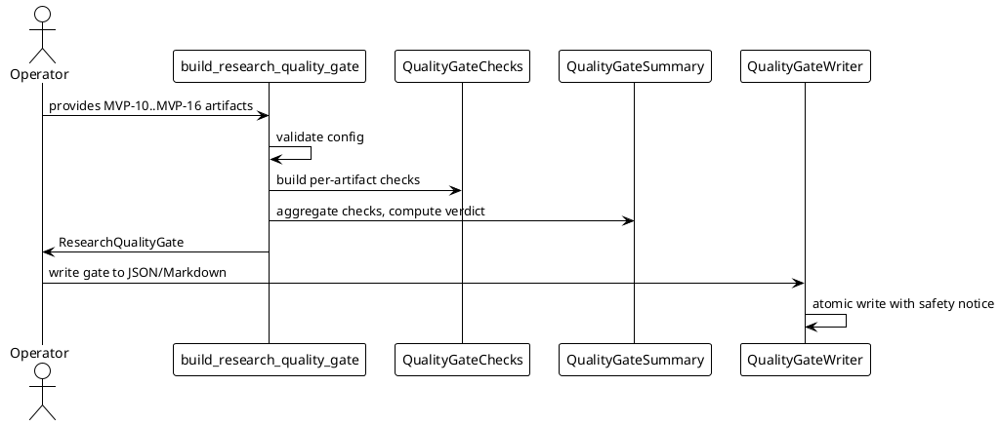

# SPEC-018 — Local Research Quality Gate / Audit Readiness

## 1. Background

After MVP-10 through MVP-16, the system produces seven categories of local human-audit artifacts:

- **MVP-10 Observation Reports:** `data/observation/latest_observation_report.json` — research-only summaries.
- **MVP-11 Review Audit Records:** `data/review/latest_review_audit_record.json` — operator review outcomes.
- **MVP-12 Review Index:** `data/review_index/latest_review_index.json` — catalog entries linking reports to reviews.
- **MVP-13 Search Results:** `data/review_search/latest_search_result.json` — query results over the review index.
- **MVP-14 Research Bundles:** `data/research_bundle/latest_research_bundle.json` — evidence packs collecting related items.
- **MVP-15 Research Chronicle:** `data/chronicle/latest_research_chronicle.json` — chronological audit timeline.
- **MVP-16 Research Digest:** `data/research_digest/latest_research_digest.json` — single-page executive summary.

These artifacts are **human-audit-only** — not trading signals, not trade approvals, and must never be consumed by execution, strategy, Freqtrade shell, order, exchange, or any MVP execution path.

A human operator or contractor needs a deterministic, fail-closed way to know whether the current local research artifact set is **ready for human audit handoff**. Without a quality gate, the operator must manually inspect each artifact file to decide whether the package is complete enough to hand off. SPEC-018 designs a **Local Research Quality Gate** layer (MVP-17) that consumes MVP-10–MVP-16 artifacts as read-only inputs and produces a deterministic audit-readiness verdict for human review.

The gate answers one question only: **Does this local research artifact set appear complete and safe enough for human audit and contractor handoff?** It does not, and must never, answer whether the system is ready to trade, execute, or strategy.

## 2. Requirements

### 2.1 Must Have (M)

- **M1:** Consume MVP-10–MVP-16 objects (or dicts) as read-only input. The gate never reads artifact files from disk; callers pass already-loaded artifacts.
- **M2:** Produce `QualityGateCheck` frozen dataclass — one check per evaluated artifact category or cross-cutting concern.
- **M3:** Produce `QualityGateSummary` frozen dataclass — aggregated counts and overall verdict.
- **M4:** Produce `QualityGateDataQuality` frozen dataclass — completeness and blocker metrics.
- **M5:** Produce `QualityGateSafetyFlags` frozen dataclass — all unsafe flags default `False`.
- **M6:** Produce `ResearchQualityGate` frozen dataclass — full quality gate container.
- **M7:** Checks ordered deterministically: `(OBSERVATION, REVIEW, INDEX, SEARCH, BUNDLE, CHRONICLE, DIGEST, CROSS_CUTTING)`.
- **M8:** Each check has a `check_kind`, `state` (`PASS`/`WARN`/`BLOCK`/`UNKNOWN`), `reason_codes`, and `notes`.
- **M9:** Fail-closed: missing/invalid/unsafe inputs → `UNKNOWN` or `BLOCK` verdict with `QUALITY_GATE_ERROR`.
- **M10:** Deterministic reason codes, priority-ordered.
- **M11:** JSON/Markdown writer with atomic writes, safety notice, no secrets.
- **M12:** Default JSON: `data/research_quality_gate/latest_research_quality_gate.json`.
- **M13:** Default Markdown: `reports/research_quality_gate/latest_research_quality_gate.md`.
- **M14:** No file reads, network, database, or exchange connections in the engine.
- **M15:** No trading decisions, approvals, or execution logic. Quality gate is human-audit-only.
- **M16:** Explicit verdict semantics: `PASS` means human-audit handoff appears complete; it does **not** mean trade approval, execution approval, or strategy approval.

### 2.2 Should Have (S)

- **S1:** Cross-cutting safety check — verify no artifact reports unsafe flags (`live_trading_enabled`, `real_orders_enabled`, `leverage_enabled`, `shorting_enabled`, execution feedback enabled).
- **S2:** Cross-cutting blocker check — verify no artifact contains unresolved blocking reason codes.
- **S3:** Configurable `required_artifact_kinds` tuple so callers can declare which categories must exist.
- **S4:** Configurable `block_on_unknown` flag (default `True`) to treat UNKNOWN artifact states as blocking.
- **S5:** Summary counts per verdict state (`pass_count`, `warn_count`, `block_count`, `unknown_count`).
- **S6:** Human-readable `handoff_notes` explaining why the gate passed, warned, or blocked.

### 2.3 Could Have (C)

- **C1:** Staleness check — warn if any artifact `generated_at` is older than a configured threshold.
- **C2:** Diff quality gate between two snapshots.
- **C3:** CSV export.

### 2.4 Won't Have (W)

- **W1:** Web UI, dashboard, database, HTTP API, server, auth.
- **W2:** Any feedback into execution, strategy, Freqtrade, order, exchange paths.
- **W3:** Binance, real exchange, live trading, real orders, leverage, shorting.
- **W4:** Config YAML, JSON schema, deployable Freqtrade strategy class.
- **W5:** Secrets, credentials, executable trading instructions in output.
- **W6:** Reading artifact files from disk in the engine (file I/O is writer-only and explicit).
- **W7:** Any claim that `PASS` means the system may trade, execute, or strategy.

## 3. Method

### 3.1 Models

#### `QualityGateState`

```python
class QualityGateState(Enum):
    PASS = "pass"
    WARN = "warn"
    BLOCK = "block"
    UNKNOWN = "unknown"
```

#### `QualityGateVerdict`

```python
class QualityGateVerdict(Enum):
    PASS = "pass"
    WARN = "warn"
    BLOCK = "block"
    UNKNOWN = "unknown"
```

#### `QualityGateCheckKind`

```python
class QualityGateCheckKind(Enum):
    OBSERVATION = "observation"
    REVIEW = "review"
    INDEX = "index"
    SEARCH = "search"
    BUNDLE = "bundle"
    CHRONICLE = "chronicle"
    DIGEST = "digest"
    CROSS_CUTTING = "cross_cutting"
```

#### `QualityGateConfig`

```python
@dataclass(frozen=True)
class QualityGateConfig:
    version: str = "1.0"
    generated_at: datetime | None = None
    output_format: str = "both"
    dry_run: bool = True
    live_trading_enabled: bool = False
    real_orders_enabled: bool = False
    leverage_enabled: bool = False
    shorting_enabled: bool = False
    block_on_unknown: bool = True
    required_artifact_kinds: tuple[QualityGateCheckKind, ...] = (
        QualityGateCheckKind.OBSERVATION,
        QualityGateCheckKind.REVIEW,
        QualityGateCheckKind.INDEX,
        QualityGateCheckKind.SEARCH,
        QualityGateCheckKind.BUNDLE,
        QualityGateCheckKind.CHRONICLE,
        QualityGateCheckKind.DIGEST,
    )
    max_staleness_minutes: int = 60
    include_handoff_notes: bool = True
```

Validation:
- `version` must be a non-empty string.
- `output_format` must be one of `("json", "markdown", "both")`.
- `dry_run` must be `True` (safety invariant).
- `live_trading_enabled`, `real_orders_enabled`, `leverage_enabled`, `shorting_enabled` must all be `False` (safety invariant).
- `block_on_unknown` must be a bool.
- `required_artifact_kinds` must be a tuple of `QualityGateCheckKind` enum instances.
- `max_staleness_minutes` must be a positive integer (≥ 1).

#### `QualityGateSafetyFlags`

```python
@dataclass(frozen=True)
class QualityGateSafetyFlags:
    # Runtime safety flags
    dry_run: bool = True
    live_trading_enabled: bool = False
    real_orders_enabled: bool = False
    leverage_enabled: bool = False
    shorting_enabled: bool = False

    # Output safety flags
    quality_gate_output_is_human_audit_only: bool = True
    quality_gate_output_not_trading_signal: bool = True
    quality_gate_output_not_trade_approval: bool = True
    quality_gate_output_not_execution_readiness: bool = True
    quality_gate_output_not_strategy_readiness: bool = True
    quality_gate_output_not_for_execution: bool = True
    quality_gate_output_not_for_strategy: bool = True
    quality_gate_output_not_for_freqtrade: bool = True
    quality_gate_output_not_for_order: bool = True
    quality_gate_output_not_for_exchange: bool = True

    # Feedback safety flags
    quality_gate_feedback_into_execution: bool = False
    cross_layer_feedback_into_execution: bool = False

    # Advisory flags
    file_refs_not_traversed: bool = True
```

`__post_init__` enforces the same invariants as previous MVP safety flags: unsafe flags must be `False`, safe output flags must be `True`, `dry_run` must be `True`.

#### `QualityGateCheck`

```python
@dataclass(frozen=True)
class QualityGateCheck:
    check_kind: QualityGateCheckKind
    state: str = "UNKNOWN"
    reason_codes: tuple[str, ...] = ()
    notes: str | None = None
    metadata: Mapping[str, Any] = field(default_factory=dict)
```

Validation:
- `check_kind` must be a `QualityGateCheckKind` enum instance.
- `state` normalized to uppercase; must be one of `("PASS", "WARN", "BLOCK", "UNKNOWN")`.
- `reason_codes` coerced to a tuple of non-empty strings.
- `notes` and `metadata` filtered through forbidden content check.

#### `QualityGateSummary`

```python
@dataclass(frozen=True)
class QualityGateSummary:
    total_checks: int = 0
    pass_checks: int = 0
    warn_checks: int = 0
    block_checks: int = 0
    unknown_checks: int = 0
    total_artifacts: int = 0
    total_blockers: int = 0
    unresolved_blockers: int = 0
    verdict: str = "UNKNOWN"
    reason_code_counts: Mapping[str, int] = field(default_factory=dict)
    handoff_notes: str = ""
```

Validation:
- All count fields must be non-negative integers.
- `pass_checks + warn_checks + block_checks + unknown_checks` must equal `total_checks`.
- `verdict` must be one of `("PASS", "WARN", "BLOCK", "UNKNOWN")`.
- `handoff_notes` must not contain forbidden terms.

#### `QualityGateDataQuality`

```python
@dataclass(frozen=True)
class QualityGateDataQuality:
    completeness_pct: float = 0.0
    ready_pct: float = 0.0
    missing_count: int = 0
    stale_count: int = 0
    blocked_count: int = 0
    unknown_count: int = 0
    total_checks: int = 0
    reason: str = ""
```

Validation:
- `completeness_pct` and `ready_pct` must be between `0.0` and `100.0`.
- All count fields must be non-negative integers.
- `reason` must not contain forbidden terms.

#### `ResearchQualityGate`

```python
@dataclass(frozen=True)
class ResearchQualityGate:
    gate_id: str
    generated_at: datetime
    version: str = "1.0"
    verdict: QualityGateVerdict = field(default_factory=lambda: QualityGateVerdict.UNKNOWN)
    checks: tuple[QualityGateCheck, ...] = ()
    summary: QualityGateSummary = field(default_factory=QualityGateSummary)
    data_quality: QualityGateDataQuality = field(default_factory=QualityGateDataQuality)
    safety_flags: QualityGateSafetyFlags = field(default_factory=QualityGateSafetyFlags)
    config: QualityGateConfig = field(default_factory=QualityGateConfig)
    reason_codes: tuple[str, ...] = ()
    handoff_notes: str = ""
```

Validation:
- `gate_id` must be a non-empty string. Recommended derivation: `gate_id = f"quality_gate:{version}:{generated_at_iso}"`.
- `generated_at` must be timezone-aware.
- `verdict` must be a `QualityGateVerdict` enum instance.
- `checks` must be a tuple of `QualityGateCheck` instances.
- `reason_codes` coerced to a tuple of non-empty strings.
- `handoff_notes` must not contain forbidden terms.

### 3.2 Reason Codes

```python
QUALITY_GATE_REASON_CODES = (
    "EMPTY_GATE",
    "INVALID_CONFIG",
    "UNSAFE_CONFIG",
    "MISSING_OBSERVATION",
    "MISSING_REVIEW",
    "MISSING_INDEX",
    "MISSING_SEARCH",
    "MISSING_BUNDLE",
    "MISSING_CHRONICLE",
    "MISSING_DIGEST",
    "BLOCKED_OBSERVATION",
    "BLOCKED_REVIEW",
    "BLOCKED_INDEX",
    "BLOCKED_SEARCH",
    "BLOCKED_BUNDLE",
    "BLOCKED_CHRONICLE",
    "BLOCKED_DIGEST",
    "UNKNOWN_OBSERVATION",
    "UNKNOWN_REVIEW",
    "UNKNOWN_INDEX",
    "UNKNOWN_SEARCH",
    "UNKNOWN_BUNDLE",
    "UNKNOWN_CHRONICLE",
    "UNKNOWN_DIGEST",
    "UNSAFE_ARTIFACT_FLAGS",
    "UNRESOLVED_BLOCKERS",
    "STALE_ARTIFACT",
    "UNSAFE_GATE_CONTENT",
    "QUALITY_GATE_ERROR",
)
```

Blocking reason codes are all codes except `EMPTY_GATE`.

### 3.3 Engine

#### `has_unsafe_quality_gate_content(notes, metadata) -> bool`

Return `True` if `notes` or `metadata` contain forbidden terms. Uses a superset of previous MVP forbidden terms including execution/trading keywords.

#### `build_quality_gate_safety_flags(config) -> QualityGateSafetyFlags`

Build safety flags from config. Fail-closed: unsafe config raises `ValueError`.

#### `build_quality_gate_check(check_kind, artifact_state, artifact, config) -> QualityGateCheck`

Build one `QualityGateCheck`.

Rules:
- If `artifact` is `None` and `check_kind` is required → `BLOCK`, reason code `MISSING_*`.
- If `artifact` is `None` and not required → `PASS`, no reason codes.
- If artifact state is `READY` → `PASS`.
- If artifact state is `BLOCKED` → `BLOCK`, reason code `BLOCKED_*`.
- If artifact state is `UNKNOWN` or `DISABLED`:
  - If `config.block_on_unknown` is `True` → `BLOCK`, reason code `UNKNOWN_*`.
  - Else → `WARN`, reason code `UNKNOWN_*`.
- If artifact safety flags indicate any unsafe flag is `True` → `BLOCK`, reason code `UNSAFE_ARTIFACT_FLAGS`.
- If artifact reason codes contain blocking codes → `BLOCK`, reason code `UNRESOLVED_BLOCKERS`.
- If artifact `generated_at` is older than `config.max_staleness_minutes` → `WARN`, reason code `STALE_ARTIFACT`.

#### `build_quality_gate_summary(checks, config) -> QualityGateSummary`

Aggregate checks into summary.

Verdict logic:
- If any check is `BLOCK` → overall `BLOCK`.
- Else if any check is `UNKNOWN` → overall `UNKNOWN`.
- Else if any check is `WARN` → overall `WARN`.
- Else → overall `PASS`.

`handoff_notes` generation:
- `PASS`: "All required artifact categories are ready. Package appears complete for human audit handoff. This is not trade approval, execution approval, or strategy approval."
- `WARN`: "Package is usable for human audit but has non-blocking issues. Review warnings before handoff. This is not trade approval, execution approval, or strategy approval."
- `BLOCK`: "Package is not ready for human audit handoff. Resolve blockers before handoff. This is not trade approval, execution approval, or strategy approval."
- `UNKNOWN`: "Insufficient or invalid information to determine audit readiness. Provide required artifact inputs."

#### `build_quality_gate_data_quality(checks) -> QualityGateDataQuality`

Compute completeness, ready percentage, missing/unknown/blocked counts.

#### `build_research_quality_gate(..., config=None) -> ResearchQualityGate`

Main entry point. Accepts optional MVP-10–MVP-16 artifact objects and builds the full quality gate.

Fail-closed priority order:
1. `EMPTY_GATE` — no artifacts provided and none required.
2. `INVALID_CONFIG` — config is invalid.
3. `UNSAFE_CONFIG` — config has unsafe flags.
4–10. `MISSING_*` per required artifact kind.
11–17. `BLOCKED_*` per artifact state.
18–24. `UNKNOWN_*` per artifact state (when `block_on_unknown=False` these become `WARN`).
25. `UNSAFE_ARTIFACT_FLAGS` — any artifact has unsafe safety flags.
26. `UNRESOLVED_BLOCKERS` — any artifact has blocking reason codes.
27. `STALE_ARTIFACT` — non-blocking staleness warning.
28. `UNSAFE_GATE_CONTENT` — gate notes/metadata contain forbidden terms.
29. `QUALITY_GATE_ERROR` — catch-all.

### 3.4 Writer

Same atomic-write pattern as MVP-10–MVP-16:

- `research_quality_gate_to_dict(gate) -> dict[str, Any]`
- `research_quality_gate_to_markdown(gate) -> str`
- `atomic_write_json_research_quality_gate(gate, target_path=None) -> Path`
- `atomic_write_markdown_research_quality_gate(gate, target_path=None) -> Path`
- `write_research_quality_gate(gate, json_path=None, markdown_path=None) -> tuple[Path, Path]`

Default paths:
- JSON: `data/research_quality_gate/latest_research_quality_gate.json`
- Markdown: `reports/research_quality_gate/latest_research_quality_gate.md`

Markdown safety notice must state:
> "This local research quality gate is a human-audit artifact only. It is not a trading signal, not trade approval, not execution readiness, not strategy readiness, and must not be consumed by execution, strategy, Freqtrade shell, order, exchange, or any MVP execution path."

### 3.5 Deterministic Check Ordering

Checks are always produced in this order:

1. `OBSERVATION`
2. `REVIEW`
3. `INDEX`
4. `SEARCH`
5. `BUNDLE`
6. `CHRONICLE`
7. `DIGEST`
8. `CROSS_CUTTING`

The cross-cutting check runs last and evaluates aggregated safety across all provided artifacts.

### 3.6 PlantUML Diagrams

#### Component Diagram



#### Sequence Diagram



### 3.7 Explicit Non-Goals

- The quality gate does **not** read artifact files from disk.
- The quality gate does **not** modify any artifact.
- The quality gate does **not** produce trading signals.
- The quality gate does **not** produce trade approval.
- The quality gate does **not** produce execution readiness.
- The quality gate does **not** produce strategy readiness.
- The quality gate does **not** trigger any action.
- The quality gate does **not** connect to Binance, any exchange, or any API.
- The quality gate does **not** use a database, event store, scheduler, routing layer, or feedback layer.

## 4. Implementation

### Step 1 — Quality Gate Models and Engine

- Create `src/hunter/research_quality_gate/__init__.py` with public API exports.
- Create `src/hunter/research_quality_gate/models.py` with enums and frozen dataclasses.
- Create `src/hunter/research_quality_gate/engine.py` with engine functions.
- Create `tests/test_research_quality_gate/test_models.py`.
- Create `tests/test_research_quality_gate/test_engine.py`.
- Target: ~100 model/engine tests.

### Step 2 — Quality Gate Writer

- Create `src/hunter/research_quality_gate/writer.py`.
- Update `src/hunter/research_quality_gate/__init__.py` with writer exports.
- Create `tests/test_research_quality_gate/test_writer.py`.
- Target: ~40 writer tests.

### Step 3 — Quality Gate Integration Tests

- Create `tests/test_research_quality_gate/test_integration.py`.
- End-to-end flows: build gate → serialize → write → validate.
- Coverage: all PASS, WARN, BLOCK, UNKNOWN verdicts; missing artifacts; unsafe flags; unresolved blockers; stale artifacts; deterministic ordering; safety notice; no production path writes; no network/exchange/trading logic.
- Target: ~25 integration tests.

### Step 4 — Final Validation and Version Bump

- Run focused tests: `pytest -q --import-mode=importlib tests/test_research_quality_gate`.
- Run full suite: `pytest -q --import-mode=importlib`.
- Bump version: `0.16.0-dev` → `0.17.0-dev` in `pyproject.toml` and `src/hunter/__init__.py`.
- Update `CHANGELOG.md`, `docs/handoff/CURRENT_STATE.md`, `tasks/active.md`, `tasks/agent-log.md`.
- No source changes other than version/docs.

## 5. Milestones

### Contractor-Ready Milestones

1. **Gate can evaluate all seven artifact categories.**
   - Each category produces a deterministic `QualityGateCheck`.

2. **Gate verdicts are unambiguous.**
   - `PASS`, `WARN`, `BLOCK`, `UNKNOWN` are all reachable and documented.

3. **Gate is fail-closed.**
   - Missing required artifacts, unsafe flags, unresolved blockers, and invalid config all produce `BLOCK` or `UNKNOWN`.

4. **Gate output is safe for human audit.**
   - Markdown contains explicit safety notice.
   - No forbidden terms in generated notes.
   - Safety flags enforce human-audit-only output.

5. **Gate does not feed execution paths.**
   - No trading/execution/exchange code.
   - No feedback flags enabled.

## 6. Gathering Results

### Evaluation Metrics

- **Deterministic output:** Same artifact inputs produce identical `gate_id`, checks, summary, and serialized output.
- **Fail-closed behavior:** Invalid/unsafe/missing inputs do not produce `PASS`.
- **Clear human-audit verdict:** `handoff_notes` explain the verdict in plain language and explicitly disclaim trade/execution/strategy approval.
- **No unsafe feedback paths:** Safety flags assert `quality_gate_feedback_into_execution=False` and `cross_layer_feedback_into_execution=False`.
- **Test coverage:** ≥150 quality gate tests; focused suite passes; full suite passes with no regressions.
- **Full suite pass:** `pytest -q --import-mode=importlib` passes.

### Success Criteria

- All model, engine, writer, and integration tests pass.
- No regressions in full suite.
- Version bumped to `0.17.0-dev`.
- Documentation updated.
- Safety constraints preserved.
