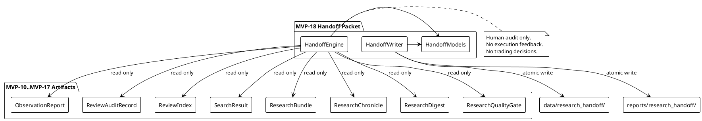
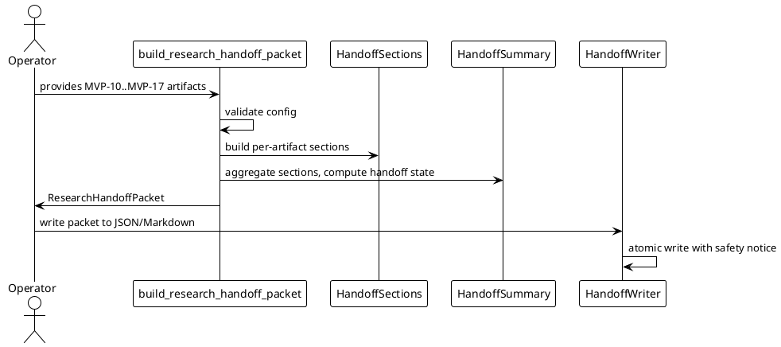

# SPEC-019 — Local Research Handoff Packet

## 1. Background

After MVP-10 through MVP-17, the system produces eight categories of local human-audit artifacts:

- **MVP-10 Observation Reports:** `data/observation/latest_observation_report.json` — research-only summaries.
- **MVP-11 Review Audit Records:** `data/review/latest_review_audit_record.json` — operator review outcomes.
- **MVP-12 Review Index:** `data/review_index/latest_review_index.json` — catalog entries linking reports to reviews.
- **MVP-13 Search Results:** `data/review_search/latest_search_result.json` — query results over the review index.
- **MVP-14 Research Bundles:** `data/research_bundle/latest_research_bundle.json` — evidence packs collecting related items.
- **MVP-15 Research Chronicle:** `data/chronicle/latest_research_chronicle.json` — chronological audit timeline.
- **MVP-16 Research Digest:** `data/research_digest/latest_research_digest.json` — single-page executive summary.
- **MVP-17 Research Quality Gate:** `data/research_quality_gate/latest_research_quality_gate.json` — audit-readiness verdict.

These artifacts are **human-audit-only** — not trading signals, not trade approvals, and must never be consumed by execution, strategy, Freqtrade shell, order, exchange, or any MVP execution path.

A human operator or contractor receiving a handoff currently must open each artifact file individually to understand what is being handed off, whether the package is ready, and where to look. There is no single deterministic artifact that bundles all summaries, quality verdicts, and local references into one human-readable handoff document. SPEC-019 designs a **Local Research Handoff Packet** (MVP-18) that consumes MVP-10–MVP-17 artifacts as read-only inputs and produces one deterministic handoff packet for human audit and contractor handoff.

The handoff packet answers one question only: **What is in this local research artifact set, and what is its audit-readiness status, for human handoff?** It does not, and must never, answer whether the system is ready to trade, execute, or strategy.

## 2. Requirements

### 2.1 Must Have (M)

- **M1:** Consume MVP-10–MVP-17 objects (or dicts) as read-only input. The engine never reads artifact files from disk; callers pass already-loaded artifacts.
- **M2:** Produce `HandoffSection` frozen dataclass — one section per artifact category, with kind, title, summary text, state, and local reference string.
- **M3:** Produce `HandoffSummary` frozen dataclass — aggregated counts, overall state, and human-readable handoff summary.
- **M4:** Produce `HandoffDataQuality` frozen dataclass — completeness and missing metrics.
- **M5:** Produce `HandoffSafetyFlags` frozen dataclass — all unsafe flags default `False`.
- **M6:** Produce `ResearchHandoffPacket` frozen dataclass — full handoff packet container.
- **M7:** Sections ordered deterministically: `(OBSERVATION, REVIEW, INDEX, SEARCH, BUNDLE, CHRONICLE, DIGEST, QUALITY_GATE)`.
- **M8:** Each section has a `section_kind`, `title`, `state` (`READY`/`WARN`/`BLOCK`/`UNKNOWN`), `summary_text`, `local_reference`, and `reason_codes`.
- **M9:** Fail-closed: missing/invalid/unsafe inputs → `UNKNOWN` or `BLOCK` state with `HANDOFF_ERROR`.
- **M10:** Deterministic reason codes, priority-ordered.
- **M11:** JSON/Markdown writer with atomic writes, safety notice, no secrets.
- **M12:** Default JSON: `data/research_handoff/latest_research_handoff_packet.json`.
- **M13:** Default Markdown: `reports/research_handoff/latest_research_handoff_packet.md`.
- **M14:** No file reads, network, database, or exchange connections in the engine.
- **M15:** No trading decisions, approvals, or execution logic. Handoff packet is human-audit-only.
- **M16:** Explicit semantics: `READY` means the handoff packet appears complete for human handoff; it does **not** mean trade approval, execution approval, strategy approval, release/deployment approval, or transaction permission.

### 2.2 Should Have (S)

- **S1:** Configurable `required_sections` tuple so callers can declare which categories must be present.
- **S2:** Configurable `block_on_unknown` flag (default `True`) to treat UNKNOWN artifact states as blocking.
- **S3:** Summary counts per state (`ready_count`, `warn_count`, `block_count`, `unknown_count`).
- **S4:** Human-readable `handoff_notes` explaining what is in the packet and what to review.
- **S5:** Each section carries a `local_reference` string (the default output path of the corresponding MVP artifact) for contractor orientation. These strings are never opened, followed, validated, or executed.

### 2.3 Could Have (C)

- **C1:** Configurable `include_sections` allowlist to omit non-essential categories.
- **C2:** Quality gate verdict embedded as a summary badge in Markdown output.
- **C3:** CSV export of section summaries.

### 2.4 Won't Have (W)

- **W1:** Web UI, dashboard, database, HTTP API, server, auth.
- **W2:** Any feedback into execution, strategy, Freqtrade, order, exchange paths.
- **W3:** Binance, real exchange, live trading, real orders, leverage, shorting.
- **W4:** Config YAML, JSON schema, deployable Freqtrade strategy class.
- **W5:** Secrets, credentials, executable trading instructions in output.
- **W6:** Reading artifact files from disk in the engine (file I/O is writer-only and explicit).
- **W7:** Any claim that `READY` means the system may trade, execute, or strategy.
- **W8:** Any traversal, opening, following, validation, or execution of file references or metadata strings.

## 3. Method

### 3.1 Models

#### `HandoffState`

```python
class HandoffState(Enum):
    READY = "ready"
    WARN = "warn"
    BLOCK = "block"
    UNKNOWN = "unknown"
```

#### `HandoffPacketKind`

```python
class HandoffPacketKind(Enum):
    OBSERVATION = "observation"
    REVIEW = "review"
    INDEX = "index"
    SEARCH = "search"
    BUNDLE = "bundle"
    CHRONICLE = "chronicle"
    DIGEST = "digest"
    QUALITY_GATE = "quality_gate"
```

#### `HandoffConfig`

```python
@dataclass(frozen=True)
class HandoffConfig:
    version: str = "1.0"
    generated_at: datetime | None = None
    output_format: str = "both"
    dry_run: bool = True
    live_trading_enabled: bool = False
    real_orders_enabled: bool = False
    leverage_enabled: bool = False
    shorting_enabled: bool = False
    block_on_unknown: bool = True
    required_sections: tuple[HandoffPacketKind, ...] = (
        HandoffPacketKind.OBSERVATION,
        HandoffPacketKind.REVIEW,
        HandoffPacketKind.INDEX,
        HandoffPacketKind.SEARCH,
        HandoffPacketKind.BUNDLE,
        HandoffPacketKind.CHRONICLE,
        HandoffPacketKind.DIGEST,
        HandoffPacketKind.QUALITY_GATE,
    )
    include_handoff_notes: bool = True
```

Validation:
- `version` must be a non-empty string.
- `output_format` must be one of `("json", "markdown", "both")`.
- `dry_run` must be `True` (safety invariant).
- `live_trading_enabled`, `real_orders_enabled`, `leverage_enabled`, `shorting_enabled` must all be `False` (safety invariant).
- `block_on_unknown` must be a bool.
- `required_sections` must be a tuple of `HandoffPacketKind` enum instances.

#### `HandoffSafetyFlags`

```python
@dataclass(frozen=True)
class HandoffSafetyFlags:
    # Runtime safety flags
    dry_run: bool = True
    live_trading_enabled: bool = False
    real_orders_enabled: bool = False
    leverage_enabled: bool = False
    shorting_enabled: bool = False

    # Output safety flags
    handoff_output_is_human_audit_only: bool = True
    handoff_output_not_trading_signal: bool = True
    handoff_output_not_trade_approval: bool = True
    handoff_output_not_execution_readiness: bool = True
    handoff_output_not_strategy_readiness: bool = True
    handoff_output_not_for_execution: bool = True
    handoff_output_not_for_strategy: bool = True
    handoff_output_not_for_freqtrade: bool = True
    handoff_output_not_for_order: bool = True
    handoff_output_not_for_exchange: bool = True

    # Feedback safety flags
    handoff_feedback_into_execution: bool = False
    cross_layer_feedback_into_execution: bool = False

    # Advisory flags
    file_refs_not_traversed: bool = True
```

`__post_init__` enforces the same invariants as previous MVP safety flags: unsafe flags must be `False`, safe output flags must be `True`, `dry_run` must be `True`.

#### `HandoffSection`

```python
@dataclass(frozen=True)
class HandoffSection:
    section_kind: HandoffPacketKind
    title: str = ""
    state: str = "UNKNOWN"
    summary_text: str = ""
    local_reference: str = ""
    reason_codes: tuple[str, ...] = ()
    metadata: Mapping[str, Any] = field(default_factory=dict)
```

Validation:
- `section_kind` must be a `HandoffPacketKind` enum instance.
- `state` normalized to uppercase; must be one of `("READY", "WARN", "BLOCK", "UNKNOWN")`.
- `reason_codes` coerced to a tuple of non-empty strings.
- `summary_text`, `local_reference`, and `metadata` filtered through forbidden content check.

#### `HandoffSummary`

```python
@dataclass(frozen=True)
class HandoffSummary:
    total_sections: int = 0
    ready_sections: int = 0
    warn_sections: int = 0
    block_sections: int = 0
    unknown_sections: int = 0
    quality_gate_verdict: str = "UNKNOWN"
    handoff_state: str = "UNKNOWN"
    reason_code_counts: Mapping[str, int] = field(default_factory=dict)
    handoff_notes: str = ""
```

Validation:
- All count fields must be non-negative integers.
- `ready_sections + warn_sections + block_sections + unknown_sections` must equal `total_sections`.
- `quality_gate_verdict` must be one of `("PASS", "WARN", "BLOCK", "UNKNOWN")`.
- `handoff_state` must be one of `("READY", "WARN", "BLOCK", "UNKNOWN")`.
- `handoff_notes` must not contain forbidden terms.

#### `HandoffDataQuality`

```python
@dataclass(frozen=True)
class HandoffDataQuality:
    completeness_pct: float = 0.0
    ready_pct: float = 0.0
    missing_count: int = 0
    stale_count: int = 0
    blocked_count: int = 0
    unknown_count: int = 0
    total_sections: int = 0
    reason: str = ""
```

Validation:
- `completeness_pct` and `ready_pct` must be between `0.0` and `100.0`.
- All count fields must be non-negative integers.
- `reason` must not contain forbidden terms.

#### `ResearchHandoffPacket`

```python
@dataclass(frozen=True)
class ResearchHandoffPacket:
    packet_id: str
    generated_at: datetime
    version: str = "1.0"
    handoff_state: HandoffState = field(default_factory=lambda: HandoffState.UNKNOWN)
    sections: tuple[HandoffSection, ...] = ()
    summary: HandoffSummary = field(default_factory=HandoffSummary)
    data_quality: HandoffDataQuality = field(default_factory=HandoffDataQuality)
    safety_flags: HandoffSafetyFlags = field(default_factory=HandoffSafetyFlags)
    config: HandoffConfig = field(default_factory=HandoffConfig)
    reason_codes: tuple[str, ...] = ()
    handoff_notes: str = ""
```

Validation:
- `packet_id` must be a non-empty string. Recommended derivation: `packet_id = f"handoff:{version}:{generated_at_iso}"`.
- `generated_at` must be timezone-aware.
- `handoff_state` must be a `HandoffState` enum instance.
- `sections` must be a tuple of `HandoffSection` instances.
- `reason_codes` coerced to a tuple of non-empty strings.
- `handoff_notes` must not contain forbidden terms.

### 3.2 Reason Codes

```python
HANDOFF_REASON_CODES = (
    "EMPTY_PACKET",
    "INVALID_CONFIG",
    "UNSAFE_CONFIG",
    "MISSING_OBSERVATION",
    "MISSING_REVIEW",
    "MISSING_INDEX",
    "MISSING_SEARCH",
    "MISSING_BUNDLE",
    "MISSING_CHRONICLE",
    "MISSING_DIGEST",
    "MISSING_QUALITY_GATE",
    "BLOCKED_OBSERVATION",
    "BLOCKED_REVIEW",
    "BLOCKED_INDEX",
    "BLOCKED_SEARCH",
    "BLOCKED_BUNDLE",
    "BLOCKED_CHRONICLE",
    "BLOCKED_DIGEST",
    "BLOCKED_QUALITY_GATE",
    "UNKNOWN_OBSERVATION",
    "UNKNOWN_REVIEW",
    "UNKNOWN_INDEX",
    "UNKNOWN_SEARCH",
    "UNKNOWN_BUNDLE",
    "UNKNOWN_CHRONICLE",
    "UNKNOWN_DIGEST",
    "UNKNOWN_QUALITY_GATE",
    "UNSAFE_ARTIFACT_FLAGS",
    "UNRESOLVED_BLOCKERS",
    "STALE_ARTIFACT",
    "UNSAFE_PACKET_CONTENT",
    "HANDOFF_ERROR",
)
```

Blocking reason codes are all codes except `EMPTY_PACKET` and `STALE_ARTIFACT`.

### 3.3 Engine

#### `has_unsafe_handoff_content(text, metadata) -> bool`

Return `True` if `text` or `metadata` contain forbidden terms. Uses a superset of previous MVP forbidden terms including execution/trading keywords and deployment/release keywords.

#### `build_handoff_safety_flags(config) -> HandoffSafetyFlags`

Build safety flags from config. Fail-closed: unsafe config raises `ValueError`.

#### `build_handoff_section(section_kind, artifact, config) -> HandoffSection`

Build one `HandoffSection`.

Rules:
- If `artifact` is `None` and `section_kind` is required → `BLOCK`, reason code `MISSING_*`.
- If `artifact` is `None` and not required → `READY`, no reason codes.
- If artifact state is `READY` → `READY`.
- If artifact state is `BLOCKED` → `BLOCK`, reason code `BLOCKED_*`.
- If artifact state is `UNKNOWN` or `DISABLED`:
  - If `config.block_on_unknown` is `True` → `BLOCK`, reason code `UNKNOWN_*`.
  - Else → `WARN`, reason code `UNKNOWN_*`.
- If artifact safety flags indicate any unsafe flag is `True` → `BLOCK`, reason code `UNSAFE_ARTIFACT_FLAGS`.
- If artifact reason codes contain blocking codes → `BLOCK`, reason code `UNRESOLVED_BLOCKERS`.

Each section carries a default `local_reference` string pointing to the corresponding MVP artifact's default output path. These strings are never opened, followed, validated, or executed.

#### `build_handoff_summary(sections, config) -> HandoffSummary`

Aggregate sections into summary.

Handoff state logic:
- If any section is `BLOCK` → overall `BLOCK`.
- Else if any section is `UNKNOWN` → overall `UNKNOWN`.
- Else if any section is `WARN` → overall `WARN`.
- Else → overall `READY`.

`handoff_notes` generation:
- `READY`: "All required artifact categories are present and ready. Handoff packet is complete for human audit and contractor handoff. This is not trade approval, not execution readiness, not strategy readiness, not release/deployment approval, and not transaction permission."
- `WARN`: "Handoff packet is usable for human audit but has non-blocking issues. Review warnings before handoff. This is not trade approval, not execution readiness, not strategy readiness, not release/deployment approval, and not transaction permission."
- `BLOCK`: "Handoff packet is not ready for human handoff. Resolve blockers before handoff. This is not trade approval, not execution readiness, not strategy readiness, not release/deployment approval, and not transaction permission."
- `UNKNOWN`: "Insufficient or invalid information to build handoff packet. Provide required artifact inputs."

#### `build_handoff_data_quality(sections) -> HandoffDataQuality`

Compute completeness, ready percentage, missing/unknown/blocked counts.

#### `build_research_handoff_packet(..., config=None) -> ResearchHandoffPacket`

Main entry point. Accepts optional MVP-10–MVP-17 artifact objects and builds the full handoff packet.

Fail-closed priority order:
1. `EMPTY_PACKET` — no artifacts provided and none required.
2. `INVALID_CONFIG` — config is invalid.
3. `UNSAFE_CONFIG` — config has unsafe flags.
4–11. `MISSING_*` per required section kind.
12–19. `BLOCKED_*` per artifact state.
20–27. `UNKNOWN_*` per artifact state (when `block_on_unknown=False` these become `WARN`).
28. `UNSAFE_ARTIFACT_FLAGS` — any artifact has unsafe safety flags.
29. `UNRESOLVED_BLOCKERS` — any artifact has blocking reason codes.
30. `STALE_ARTIFACT` — non-blocking staleness warning.
31. `UNSAFE_PACKET_CONTENT` — packet text/metadata contain forbidden terms.
32. `HANDOFF_ERROR` — catch-all.

### 3.4 Writer

Same atomic-write pattern as MVP-10–MVP-17:

- `research_handoff_packet_to_dict(packet) -> dict[str, Any]`
- `research_handoff_packet_to_markdown(packet) -> str`
- `atomic_write_json_research_handoff_packet(packet, target_path=None) -> Path`
- `atomic_write_markdown_research_handoff_packet(packet, target_path=None) -> Path`
- `write_research_handoff_packet(packet, json_path=None, markdown_path=None) -> tuple[Path, Path]`

Default paths:
- JSON: `data/research_handoff/latest_research_handoff_packet.json`
- Markdown: `reports/research_handoff/latest_research_handoff_packet.md`

Markdown safety notice must state:
> "This local research handoff packet is a human-audit artifact only. It is not a trading signal, not trade approval, not execution readiness, not strategy readiness, not release/deployment approval, not transaction permission, and must not be consumed by execution, strategy, Freqtrade shell, transaction placement, exchange, or any MVP execution path."

### 3.5 Deterministic Section Ordering

Sections are always produced in this order:

1. `OBSERVATION`
2. `REVIEW`
3. `INDEX`
4. `SEARCH`
5. `BUNDLE`
6. `CHRONICLE`
7. `DIGEST`
8. `QUALITY_GATE`

### 3.6 PlantUML Diagrams

#### Component Diagram



#### Sequence Diagram



### 3.7 Explicit Non-Goals

- The handoff packet does **not** read artifact files from disk.
- The handoff packet does **not** modify any artifact.
- The handoff packet does **not** produce trading signals.
- The handoff packet does **not** produce trade approval.
- The handoff packet does **not** produce execution readiness.
- The handoff packet does **not** produce strategy readiness.
- The handoff packet does **not** produce release/deployment approval.
- The handoff packet does **not** produce transaction permission.
- The handoff packet does **not** trigger any action.
- The handoff packet does **not** connect to Binance, any exchange, or any API.
- The handoff packet does **not** use a database, event store, scheduler, routing layer, or feedback layer.
- The handoff packet does **not** traverse, open, follow, validate, or execute any file references or metadata strings.

## 4. Implementation

### Step 1 — Handoff Packet Models and Engine

- Create `src/hunter/research_handoff/__init__.py` with public API exports.
- Create `src/hunter/research_handoff/models.py` with enums and frozen dataclasses.
- Create `src/hunter/research_handoff/engine.py` with engine functions.
- Create `tests/test_research_handoff/test_models.py`.
- Create `tests/test_research_handoff/test_engine.py`.
- Target: ~100 model/engine tests.

### Step 2 — Handoff Packet Writer

- Create `src/hunter/research_handoff/writer.py`.
- Update `src/hunter/research_handoff/__init__.py` with writer exports.
- Create `tests/test_research_handoff/test_writer.py`.
- Target: ~40 writer tests.

### Step 3 — Handoff Packet Integration Tests

- Create `tests/test_research_handoff/test_integration.py`.
- End-to-end flows: build packet → serialize → write → validate.
- Coverage: all READY, WARN, BLOCK, UNKNOWN states; missing artifacts; unsafe flags; unresolved blockers; deterministic ordering; safety notice; no production path writes; no network/exchange/trading logic.
- Target: ~30 integration tests.

### Step 4 — Final Validation and Version Bump

- Run focused tests: `pytest -q --import-mode=importlib tests/test_research_handoff`.
- Run full suite: `pytest -q --import-mode=importlib`.
- Bump version: `0.17.0-dev` → `0.18.0-dev` in `pyproject.toml` and `src/hunter/__init__.py`.
- Update `CHANGELOG.md`, `docs/handoff/CURRENT_STATE.md`, `tasks/active.md`, `tasks/agent-log.md`.
- No source changes other than version/docs.

## 5. Milestones

### Contractor-Ready Milestones

1. **Packet can package all eight artifact categories.**
   - Each category produces a deterministic `HandoffSection`.

2. **Packet handoff states are unambiguous.**
   - `READY`, `WARN`, `BLOCK`, `UNKNOWN` are all reachable and documented.

3. **Packet is fail-closed.**
   - Missing required artifacts, unsafe flags, unresolved blockers, and invalid config all produce `BLOCK` or `UNKNOWN`.

4. **Packet output is safe for human audit.**
   - Markdown contains explicit safety notice.
   - No forbidden terms in generated notes.
   - Safety flags enforce human-audit-only output.

5. **Packet does not feed execution paths.**
   - No trading/execution/exchange code.
   - No feedback flags enabled.

## 6. Gathering Results

### Evaluation Metrics

- **Deterministic output:** Same artifact inputs produce identical `packet_id`, sections, summary, and serialized output.
- **Fail-closed behavior:** Invalid/unsafe/missing inputs do not produce `READY`.
- **Clear human handoff summary:** `handoff_notes` explain the state in plain language and explicitly disclaim trade/execution/strategy approval.
- **No unsafe feedback paths:** Safety flags assert `handoff_feedback_into_execution=False` and `cross_layer_feedback_into_execution=False`.
- **Test coverage:** ≥150 handoff packet tests; focused suite passes; full suite passes with no regressions.
- **Full suite pass:** `pytest -q --import-mode=importlib` passes.

### Success Criteria

- All model, engine, writer, and integration tests pass.
- No regressions in full suite.
- Version bumped to `0.18.0-dev`.
- Documentation updated.
- Safety constraints preserved.
