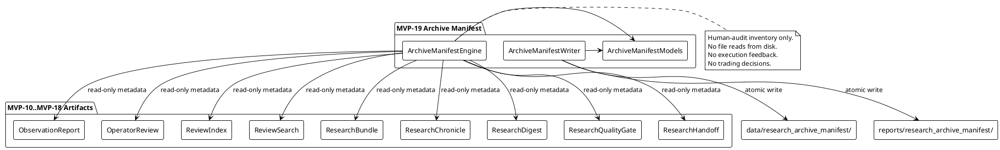
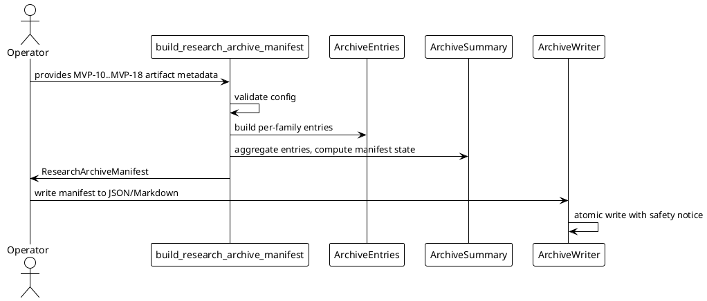

# SPEC-020 — Local Research Archive Manifest

## 1. Background

After MVP-10 through MVP-18, the system produces nine categories of local human-audit artifacts:

- **MVP-10 Observation Reports:** `data/observation/latest_observation_report.json` — research-only summaries.
- **MVP-11 Review Audit Records:** `data/review/latest_review_audit_record.json` — operator review outcomes.
- **MVP-12 Review Index:** `data/review_index/latest_review_index.json` — catalog entries linking reports to reviews.
- **MVP-13 Search Results:** `data/review_search/latest_search_result.json` — query results over the review index.
- **MVP-14 Research Bundles:** `data/research_bundle/latest_research_bundle.json` — evidence packs collecting related items.
- **MVP-15 Research Chronicle:** `data/chronicle/latest_research_chronicle.json` — chronological audit timeline.
- **MVP-16 Research Digest:** `data/research_digest/latest_research_digest.json` — single-page executive summary.
- **MVP-17 Research Quality Gate:** `data/research_quality_gate/latest_research_quality_gate.json` — audit-readiness verdict.
- **MVP-18 Research Handoff Packet:** `data/research_handoff/latest_research_handoff_packet.json` — bundled handoff packet for contractor handoff.

These artifacts are **human-audit-only** — not trading signals, not trade approvals, and must never be consumed by execution, strategy, Freqtrade shell, order, exchange, or any MVP execution path.

While MVP-18's handoff packet bundles the *content* of these artifacts into a single document, there is no single deterministic **inventory manifest** that lists all artifact families, their local reference strings, their versions, governing SPECs, timestamps, states, and completeness indicators. A human operator or contractor who needs to know *what artifact families exist, where each lives, and what state each is in* must manually inspect each artifact or rely on out-of-band knowledge.

SPEC-020 designs a **Local Research Archive Manifest** (MVP-19) that consumes already-loaded summary metadata or explicit path/reference strings as read-only inputs and produces one deterministic archive manifest for human audit, contractor orientation, and local archive inventory. The manifest answers one question only: **What research artifact families exist in this local archive, where are they referenced, and what is their inventory status?**

The manifest does **not**, and must never, answer whether the system is ready to trade, execute, or strategy.

## 2. Requirements

### 2.1 Must Have (M)

- **M1:** Consume already-loaded artifact summaries or explicit path/reference strings as read-only input. The engine never reads artifact files from disk; callers pass already-loaded metadata or reference strings.
- **M2:** Produce `ArchiveArtifactEntry` frozen dataclass — one entry per artifact family, with family kind, spec reference, local reference string, version, state, and timestamp.
- **M3:** Produce `ArchiveManifestSummary` frozen dataclass — aggregated counts, overall manifest state, and human-readable manifest notes.
- **M4:** Produce `ArchiveManifestDataQuality` frozen dataclass — completeness and coverage metrics.
- **M5:** Produce `ArchiveManifestSafetyFlags` frozen dataclass — all unsafe flags default `False`.
- **M6:** Produce `ResearchArchiveManifest` frozen dataclass — full archive manifest container.
- **M7:** Artifact entries ordered deterministically: `(OBSERVATION_REPORT, OPERATOR_REVIEW, REVIEW_INDEX, REVIEW_SEARCH, RESEARCH_BUNDLE, RESEARCH_CHRONICLE, RESEARCH_DIGEST, RESEARCH_QUALITY_GATE, RESEARCH_HANDOFF)`.
- **M8:** Each entry has an `artifact_family`, `title`, `state` (`PRESENT`/`STALE`/`MISSING`/`UNKNOWN`), `spec_reference`, `local_reference`, `version`, `generated_at`, and `reason_codes`.
- **M9:** Fail-closed: missing/invalid/unsafe inputs → `MISSING` or `UNKNOWN` state with `ARCHIVE_ERROR`.
- **M10:** Deterministic reason codes, priority-ordered.
- **M11:** JSON/Markdown writer with atomic writes, safety notice, no secrets.
- **M12:** Default JSON: `data/research_archive_manifest/latest_research_archive_manifest.json`.
- **M13:** Default Markdown: `reports/research_archive_manifest/latest_research_archive_manifest.md`.
- **M14:** No file reads, network, database, or exchange connections in the engine. The engine does not open, read, parse, traverse, follow, validate, or execute any referenced artifact file.
- **M15:** No trading decisions, approvals, or execution logic. Archive manifest is human-audit-only.
- **M16:** Explicit semantics: `PRESENT` means the artifact family entry appears complete in the manifest inventory; it does **not** mean trade approval, execution approval, strategy approval, release/deployment approval, or transaction permission.

### 2.2 Should Have (S)

- **S1:** Configurable `required_families` tuple so callers can declare which artifact families must be present.
- **S2:** Configurable `block_on_unknown` flag (default `True`) to treat UNKNOWN artifact states as blocking.
- **S3:** Summary counts per state (`present_count`, `stale_count`, `missing_count`, `unknown_count`).
- **S4:** Human-readable `manifest_notes` explaining what is in the manifest and what to review.
- **S5:** Each entry carries a `local_reference` string (the default output path of the corresponding MVP artifact) for contractor orientation. These strings are never opened, followed, validated, or executed.
- **S6:** Each entry carries a `spec_reference` string (e.g., `"SPEC-011"`, `"SPEC-019"`) linking the artifact family to its governing SPEC. These strings are advisory labels only.

### 2.3 Could Have (C)

- **C1:** Configurable `include_families` allowlist to omit non-essential categories.
- **C2:** Archive completeness badge embedded as a summary line in Markdown output.
- **C3:** CSV export of artifact entry summaries.

### 2.4 Won't Have (W)

- **W1:** Web UI, dashboard, database, HTTP API, server, auth.
- **W2:** Any feedback into execution, strategy, Freqtrade, order, exchange paths.
- **W3:** Binance, real exchange, live trading, real orders, leverage, shorting.
- **W4:** Config YAML, JSON schema, deployable Freqtrade strategy class.
- **W5:** Secrets, credentials, executable trading instructions in output.
- **W6:** Reading artifact files from disk in the engine (file I/O is writer-only and explicit).
- **W7:** Any claim that `PRESENT` means the system may trade, execute, or strategy.
- **W8:** Any traversal, opening, following, validation, or execution of file references or metadata strings.
- **W9:** Any automated artifact deletion, archival compression, zip/tar generation, or file system mutation beyond the manifest's own output writes.

## 3. Method

### 3.1 Models

#### `ArchiveManifestState`

```python
class ArchiveManifestState(Enum):
    READY = "ready"
    WARN = "warn"
    BLOCK = "block"
    UNKNOWN = "unknown"
```

#### `ArchiveArtifactFamily`

```python
class ArchiveArtifactFamily(Enum):
    OBSERVATION_REPORT = "observation_report"
    OPERATOR_REVIEW = "operator_review"
    REVIEW_INDEX = "review_index"
    REVIEW_SEARCH = "review_search"
    RESEARCH_BUNDLE = "research_bundle"
    RESEARCH_CHRONICLE = "research_chronicle"
    RESEARCH_DIGEST = "research_digest"
    RESEARCH_QUALITY_GATE = "research_quality_gate"
    RESEARCH_HANDOFF = "research_handoff"
```

#### `ArchiveArtifactEntryState`

```python
class ArchiveArtifactEntryState(Enum):
    PRESENT = "present"
    STALE = "stale"
    MISSING = "missing"
    UNKNOWN = "unknown"
```

#### `ArchiveManifestConfig`

```python
@dataclass(frozen=True)
class ArchiveManifestConfig:
    version: str = "1.0"
    generated_at: datetime | None = None
    output_format: str = "both"
    dry_run: bool = True
    live_trading_enabled: bool = False
    real_orders_enabled: bool = False
    leverage_enabled: bool = False
    shorting_enabled: bool = False
    block_on_unknown: bool = True
    required_families: tuple[ArchiveArtifactFamily, ...] = (
        ArchiveArtifactFamily.OBSERVATION_REPORT,
        ArchiveArtifactFamily.OPERATOR_REVIEW,
        ArchiveArtifactFamily.REVIEW_INDEX,
        ArchiveArtifactFamily.REVIEW_SEARCH,
        ArchiveArtifactFamily.RESEARCH_BUNDLE,
        ArchiveArtifactFamily.RESEARCH_CHRONICLE,
        ArchiveArtifactFamily.RESEARCH_DIGEST,
        ArchiveArtifactFamily.RESEARCH_QUALITY_GATE,
        ArchiveArtifactFamily.RESEARCH_HANDOFF,
    )
    max_staleness_minutes: int = 60
    include_manifest_notes: bool = True
```

Validation:
- `version` must be a non-empty string.
- `output_format` must be one of `("json", "markdown", "both")`.
- `dry_run` must be `True` (safety invariant).
- `live_trading_enabled`, `real_orders_enabled`, `leverage_enabled`, `shorting_enabled` must all be `False` (safety invariant).
- `block_on_unknown` must be a bool.
- `required_families` must be a tuple of `ArchiveArtifactFamily` enum instances.
- `max_staleness_minutes` must be a positive integer.

#### `ArchiveManifestSafetyFlags`

```python
@dataclass(frozen=True)
class ArchiveManifestSafetyFlags:
    # Runtime safety flags
    dry_run: bool = True
    live_trading_enabled: bool = False
    real_orders_enabled: bool = False
    leverage_enabled: bool = False
    shorting_enabled: bool = False

    # Output safety flags
    archive_output_is_human_audit_only: bool = True
    archive_output_not_trading_signal: bool = True
    archive_output_not_trade_approval: bool = True
    archive_output_not_execution_readiness: bool = True
    archive_output_not_strategy_readiness: bool = True
    archive_output_not_for_execution: bool = True
    archive_output_not_for_strategy: bool = True
    archive_output_not_for_freqtrade: bool = True
    archive_output_not_for_order: bool = True
    archive_output_not_for_exchange: bool = True

    # Feedback safety flags
    archive_manifest_feedback_into_execution: bool = False
    cross_layer_feedback_into_execution: bool = False

    # Advisory flags
    file_refs_not_traversed: bool = True
    artifact_files_not_read: bool = True
```

`__post_init__` enforces the same invariants as previous MVP safety flags: unsafe flags must be `False`, safe output flags must be `True`, `dry_run` must be `True`, `file_refs_not_traversed` must be `True`, `artifact_files_not_read` must be `True`.

#### `ArchiveArtifactEntry`

```python
@dataclass(frozen=True)
class ArchiveArtifactEntry:
    artifact_family: ArchiveArtifactFamily
    title: str = ""
    state: str = "UNKNOWN"
    spec_reference: str = ""
    local_reference: str = ""
    version: str = ""
    generated_at: datetime | None = None
    reason_codes: tuple[str, ...] = ()
    metadata: Mapping[str, Any] = field(default_factory=dict)
```

Validation:
- `artifact_family` must be an `ArchiveArtifactFamily` enum instance.
- `state` normalized to uppercase; must be one of `("PRESENT", "STALE", "MISSING", "UNKNOWN")`.
- `reason_codes` coerced to a tuple of non-empty strings.
- `spec_reference`, `local_reference`, `version`, and `metadata` filtered through forbidden content check.
- `generated_at`, if provided, must be timezone-aware or `None`.

#### `ArchiveManifestSummary`

```python
@dataclass(frozen=True)
class ArchiveManifestSummary:
    total_families: int = 0
    present_count: int = 0
    stale_count: int = 0
    missing_count: int = 0
    unknown_count: int = 0
    manifest_state: str = "UNKNOWN"
    reason_code_counts: Mapping[str, int] = field(default_factory=dict)
    manifest_notes: str = ""
```

Validation:
- All count fields must be non-negative integers.
- `present_count + stale_count + missing_count + unknown_count` must equal `total_families`.
- `manifest_state` must be one of `("READY", "WARN", "BLOCK", "UNKNOWN")`.
- `manifest_notes` must not contain forbidden terms.

#### `ArchiveManifestDataQuality`

```python
@dataclass(frozen=True)
class ArchiveManifestDataQuality:
    completeness_pct: float = 0.0
    coverage_pct: float = 0.0
    present_pct: float = 0.0
    missing_count: int = 0
    stale_count: int = 0
    unknown_count: int = 0
    total_families: int = 0
    reason: str = ""
```

Validation:
- `completeness_pct`, `coverage_pct`, and `present_pct` must be between `0.0` and `100.0`.
- All count fields must be non-negative integers.
- `reason` must not contain forbidden terms.

#### `ResearchArchiveManifest`

```python
@dataclass(frozen=True)
class ResearchArchiveManifest:
    manifest_id: str
    generated_at: datetime
    version: str = "1.0"
    manifest_state: ArchiveManifestState = field(
        default_factory=lambda: ArchiveManifestState.UNKNOWN
    )
    entries: tuple[ArchiveArtifactEntry, ...] = ()
    summary: ArchiveManifestSummary = field(default_factory=ArchiveManifestSummary)
    data_quality: ArchiveManifestDataQuality = field(
        default_factory=ArchiveManifestDataQuality
    )
    safety_flags: ArchiveManifestSafetyFlags = field(
        default_factory=ArchiveManifestSafetyFlags
    )
    config: ArchiveManifestConfig = field(default_factory=ArchiveManifestConfig)
    reason_codes: tuple[str, ...] = ()
    manifest_notes: str = ""
```

Validation:
- `manifest_id` must be a non-empty string. Recommended derivation: `manifest_id = f"archive:{version}:{generated_at_iso}"`.
- `generated_at` must be timezone-aware.
- `manifest_state` must be an `ArchiveManifestState` enum instance.
- `entries` must be a tuple of `ArchiveArtifactEntry` instances.
- `reason_codes` coerced to a tuple of non-empty strings.
- `manifest_notes` must not contain forbidden terms.

### 3.2 Reason Codes

```python
ARCHIVE_REASON_CODES = (
    "EMPTY_MANIFEST",
    "INVALID_CONFIG",
    "UNSAFE_CONFIG",
    "MISSING_OBSERVATION_REPORT",
    "MISSING_OPERATOR_REVIEW",
    "MISSING_REVIEW_INDEX",
    "MISSING_REVIEW_SEARCH",
    "MISSING_RESEARCH_BUNDLE",
    "MISSING_RESEARCH_CHRONICLE",
    "MISSING_RESEARCH_DIGEST",
    "MISSING_RESEARCH_QUALITY_GATE",
    "MISSING_RESEARCH_HANDOFF",
    "STALE_OBSERVATION_REPORT",
    "STALE_OPERATOR_REVIEW",
    "STALE_REVIEW_INDEX",
    "STALE_REVIEW_SEARCH",
    "STALE_RESEARCH_BUNDLE",
    "STALE_RESEARCH_CHRONICLE",
    "STALE_RESEARCH_DIGEST",
    "STALE_RESEARCH_QUALITY_GATE",
    "STALE_RESEARCH_HANDOFF",
    "UNKNOWN_OBSERVATION_REPORT",
    "UNKNOWN_OPERATOR_REVIEW",
    "UNKNOWN_REVIEW_INDEX",
    "UNKNOWN_REVIEW_SEARCH",
    "UNKNOWN_RESEARCH_BUNDLE",
    "UNKNOWN_RESEARCH_CHRONICLE",
    "UNKNOWN_RESEARCH_DIGEST",
    "UNKNOWN_RESEARCH_QUALITY_GATE",
    "UNKNOWN_RESEARCH_HANDOFF",
    "UNSAFE_ARTIFACT_FLAGS",
    "UNRESOLVED_BLOCKERS",
    "UNSAFE_MANIFEST_CONTENT",
    "ARCHIVE_ERROR",
)
```

Blocking reason codes are all codes except `EMPTY_MANIFEST`.

### 3.3 Engine

#### `has_unsafe_archive_manifest_content(text, metadata) -> bool`

Return `True` if `text` or `metadata` contain forbidden terms. Uses a superset of previous MVP forbidden terms including execution/trading keywords and deployment/release keywords.

#### `build_archive_manifest_safety_flags(config) -> ArchiveManifestSafetyFlags`

Build safety flags from config. Fail-closed: unsafe config raises `ValueError`.

#### `build_archive_artifact_entry(artifact_family, artifact, config, reference_time) -> ArchiveArtifactEntry`

Build one `ArchiveArtifactEntry`.

Rules:
- If `artifact` is `None` and `artifact_family` is required → `MISSING`, reason code `MISSING_*`.
- If `artifact` is `None` and not required → `PRESENT` (optional family not provided), no reason codes.
- If artifact metadata indicates presence with a valid `generated_at` → `PRESENT`.
- If artifact `generated_at` is older than `config.max_staleness_minutes` → `STALE`, reason code `STALE_*`.
- If artifact state/metadata is unrecognized or invalid → `UNKNOWN`, reason code `UNKNOWN_*`.
- If artifact safety flags indicate any unsafe flag is `True` → `MISSING`, reason code `UNSAFE_ARTIFACT_FLAGS`.
- If artifact reason codes contain blocking codes → `MISSING`, reason code `UNRESOLVED_BLOCKERS`.

Each entry carries a default `local_reference` string and `spec_reference` string for the corresponding MVP artifact family. These strings are never opened, followed, validated, or executed.

Default family reference mapping:

| Family | local_reference | spec_reference |
|--------|----------------|----------------|
| `OBSERVATION_REPORT` | `data/observation/latest_observation_report.json` | `SPEC-011` |
| `OPERATOR_REVIEW` | `data/review/latest_review_audit_record.json` | `SPEC-012` |
| `REVIEW_INDEX` | `data/review_index/latest_review_index.json` | `SPEC-013` |
| `REVIEW_SEARCH` | `data/review_search/latest_search_result.json` | `SPEC-014` |
| `RESEARCH_BUNDLE` | `data/research_bundle/latest_research_bundle.json` | `SPEC-015` |
| `RESEARCH_CHRONICLE` | `data/chronicle/latest_research_chronicle.json` | `SPEC-016` |
| `RESEARCH_DIGEST` | `data/research_digest/latest_research_digest.json` | `SPEC-017` |
| `RESEARCH_QUALITY_GATE` | `data/research_quality_gate/latest_research_quality_gate.json` | `SPEC-018` |
| `RESEARCH_HANDOFF` | `data/research_handoff/latest_research_handoff_packet.json` | `SPEC-019` |

#### `build_archive_manifest_summary(entries, config) -> ArchiveManifestSummary`

Aggregate entries into summary.

Manifest state logic:
- If any required entry is `MISSING` → overall `BLOCK`.
- Else if any entry is `UNKNOWN` → overall `UNKNOWN` (or `BLOCK` if `block_on_unknown`).
- Else if any entry is `STALE` → overall `WARN`.
- Else → overall `READY`.

`manifest_notes` generation:
- `READY`: "All required artifact families are present and current. Archive manifest inventory is complete for human audit and contractor orientation. This is not trade approval, not execution readiness, not strategy readiness, not release/deployment approval, and not transaction permission."
- `WARN`: "Archive manifest inventory is usable but some artifacts are stale. Review stale entries before relying on inventory. This is not trade approval, not execution readiness, not strategy readiness, not release/deployment approval, and not transaction permission."
- `BLOCK`: "Archive manifest inventory is incomplete. Missing required artifact families must be resolved. This is not trade approval, not execution readiness, not strategy readiness, not release/deployment approval, and not transaction permission."
- `UNKNOWN`: "Insufficient or invalid information to build archive manifest. Provide required artifact metadata."

#### `build_archive_manifest_data_quality(entries) -> ArchiveManifestDataQuality`

Compute completeness (present / total), coverage (present + stale / total), missing/stale/unknown counts.

#### `build_research_archive_manifest(..., config=None, reference_time=None) -> ResearchArchiveManifest`

Main entry point. Accepts optional artifact family metadata objects or dicts and builds the full archive manifest.

Fail-closed priority order:
1. `EMPTY_MANIFEST` — no artifacts provided and none required.
2. `INVALID_CONFIG` — config is invalid.
3. `UNSAFE_CONFIG` — config has unsafe flags.
4–12. `MISSING_*` per required artifact family.
13–21. `STALE_*` per artifact staleness.
22–30. `UNKNOWN_*` per artifact unrecognized state.
31. `UNSAFE_ARTIFACT_FLAGS` — any artifact has unsafe safety flags.
32. `UNRESOLVED_BLOCKERS` — any artifact has blocking reason codes.
33. `UNSAFE_MANIFEST_CONTENT` — manifest text/metadata contain forbidden terms.
34. `ARCHIVE_ERROR` — catch-all.

### 3.4 Writer

Same atomic-write pattern as MVP-10–MVP-18:

- `research_archive_manifest_to_dict(manifest) -> dict[str, Any]`
- `research_archive_manifest_to_markdown(manifest) -> str`
- `atomic_write_json_research_archive_manifest(manifest, target_path=None) -> Path`
- `atomic_write_markdown_research_archive_manifest(manifest, target_path=None) -> Path`
- `write_research_archive_manifest(manifest, json_path=None, markdown_path=None) -> tuple[Path, Path]`

Default paths:
- JSON: `data/research_archive_manifest/latest_research_archive_manifest.json`
- Markdown: `reports/research_archive_manifest/latest_research_archive_manifest.md`

Markdown safety notice must state:
> "This local research archive manifest is a human-audit / contractor-orientation artifact only. It is not a trading signal, not trade approval, not execution readiness, not strategy readiness, not release/deployment approval, not transaction permission, and must not be consumed by execution, strategy, Freqtrade shell, transaction placement, exchange, or any MVP execution path. File references and metadata strings in this manifest are local strings only and are not traversed, opened, followed, validated, or executed."

### 3.5 Deterministic Artifact Family Ordering

Artifact entries are always produced in this order:

1. `OBSERVATION_REPORT`
2. `OPERATOR_REVIEW`
3. `REVIEW_INDEX`
4. `REVIEW_SEARCH`
5. `RESEARCH_BUNDLE`
6. `RESEARCH_CHRONICLE`
7. `RESEARCH_DIGEST`
8. `RESEARCH_QUALITY_GATE`
9. `RESEARCH_HANDOFF`

### 3.6 PlantUML Diagrams

#### Component Diagram



#### Sequence Diagram



### 3.7 Explicit Non-Goals

- The archive manifest does **not** read artifact files from disk.
- The archive manifest does **not** parse, validate, or verify the contents of any referenced artifact.
- The archive manifest does **not** modify any artifact.
- The archive manifest does **not** produce trading signals.
- The archive manifest does **not** produce trade approval.
- The archive manifest does **not** produce execution readiness.
- The archive manifest does **not** produce strategy readiness.
- The archive manifest does **not** produce release/deployment approval.
- The archive manifest does **not** produce transaction permission.
- The archive manifest does **not** trigger any action.
- The archive manifest does **not** connect to Binance, any exchange, or any API.
- The archive manifest does **not** use a database, event store, scheduler, routing layer, or feedback layer.
- The archive manifest does **not** traverse, open, follow, validate, or execute any file references or metadata strings.
- The archive manifest does **not** perform automated artifact deletion, archival compression, zip/tar generation, or file system mutation beyond its own output writes.

## 4. Implementation

### Step 1 — Archive Manifest Models and Engine

- Create `src/hunter/research_archive_manifest/__init__.py` with public API exports.
- Create `src/hunter/research_archive_manifest/models.py` with enums and frozen dataclasses.
- Create `src/hunter/research_archive_manifest/engine.py` with engine functions.
- Create `tests/test_research_archive_manifest/test_models.py`.
- Create `tests/test_research_archive_manifest/test_engine.py`.
- Target: ~100 model/engine tests.

### Step 2 — Archive Manifest Writer

- Create `src/hunter/research_archive_manifest/writer.py`.
- Update `src/hunter/research_archive_manifest/__init__.py` with writer exports.
- Create `tests/test_research_archive_manifest/test_writer.py`.
- Target: ~40 writer tests.

### Step 3 — Archive Manifest Integration Tests

- Create `tests/test_research_archive_manifest/test_integration.py`.
- End-to-end flows: build manifest → serialize → write → validate.
- Coverage: all PRESENT, STALE, MISSING, UNKNOWN states; missing artifacts; unsafe flags; unresolved blockers; deterministic ordering; safety notice; no production path writes; no network/exchange/trading logic; no file reads from disk.
- Target: ~30 integration tests.

### Step 4 — Final Validation and Version Bump

- Run focused tests: `pytest -q --import-mode=importlib tests/test_research_archive_manifest`.
- Run full suite: `pytest -q --import-mode=importlib`.
- Bump version: `0.18.0-dev` → `0.19.0-dev` in `pyproject.toml` and `src/hunter/__init__.py`.
- Update `CHANGELOG.md`, `docs/handoff/CURRENT_STATE.md`, `tasks/active.md`, `tasks/agent-log.md`.
- No source changes other than version/docs.

## 5. Milestones

### Contractor-Ready Milestones

1. **Manifest can inventory all nine artifact families.**
   - Each family produces a deterministic `ArchiveArtifactEntry`.

2. **Manifest inventory states are unambiguous.**
   - `PRESENT`, `STALE`, `MISSING`, `UNKNOWN` are all reachable and documented.

3. **Manifest is fail-closed.**
   - Missing required artifacts, unsafe flags, unresolved blockers, and invalid config all produce `MISSING`/`BLOCK` or `UNKNOWN`.

4. **Manifest output is safe for human audit.**
   - Markdown contains explicit safety notice.
   - No forbidden terms in generated notes.
   - Safety flags enforce human-audit-only output.

5. **Manifest does not read artifact files.**
   - Engine accepts already-loaded metadata or reference strings only.
   - No file I/O in engine.

6. **Manifest does not feed execution paths.**
   - No trading/execution/exchange code.
   - No feedback flags enabled.

## 6. Gathering Results

### Evaluation Metrics

- **Deterministic output:** Same artifact metadata inputs produce identical `manifest_id`, entries, summary, and serialized output.
- **Complete artifact family inventory:** All nine MVP-10–MVP-18 families are represented with reference strings and spec references.
- **Fail-closed behavior:** Invalid/unsafe/missing inputs do not produce `READY`.
- **No unsafe feedback paths:** Safety flags assert `archive_manifest_feedback_into_execution=False` and `cross_layer_feedback_into_execution=False`.
- **No file traversal/read behavior:** Engine does not open, read, parse, or execute any referenced file.
- **Test coverage:** ≥170 archive manifest tests; focused suite passes; full suite passes with no regressions.
- **Full suite pass:** `pytest -q --import-mode=importlib` passes.

### Success Criteria

- All model, engine, writer, and integration tests pass.
- No regressions in full suite.
- Version bumped to `0.19.0-dev`.
- Documentation updated.
- Safety constraints preserved.

## 7. Safety Constraints Summary

- Archive manifest is a human-audit inventory artifact only.
- Not trading signal.
- Not trade approval.
- Not execution readiness.
- Not strategy readiness.
- Not release/deployment approval.
- Not transaction permission.
- Must not be consumed by execution, strategy, Freqtrade shell, order, exchange, or any MVP execution path.
- No archive manifest feedback into execution paths.
- No report/operator/index/search/bundle/chronicle/digest/quality-gate/handoff/archive-manifest feedback into execution paths.
- No Binance, exchange, API keys, live trading, real orders, leverage, shorting.
- File references and metadata strings remain local strings only and are not traversed, opened, followed, validated, or executed.
- The manifest must not read referenced artifact files.
- No Web UI, dashboard, database persistence, server/API/auth.
- No database, event store, scheduler, routing layer, or feedback layer.
- No production data reads/writes except explicit archive manifest output writes in writer step.
