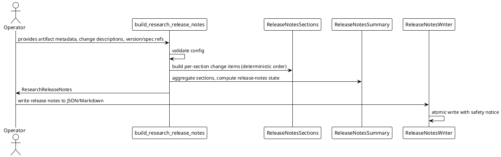

# SPEC-021 — Local Research Release Notes / Audit Change Summary

## 1. Background

After MVP-10 through MVP-19, the system produces ten categories of local human-audit artifacts:

- **MVP-10 Observation Reports:** `data/observation/latest_observation_report.json` — research-only summaries.
- **MVP-11 Review Audit Records:** `data/review/latest_review_audit_record.json` — operator review outcomes.
- **MVP-12 Review Index:** `data/review_index/latest_review_index.json` — catalog entries linking reports to reviews.
- **MVP-13 Search Results:** `data/review_search/latest_search_result.json` — query results over the review index.
- **MVP-14 Research Bundles:** `data/research_bundle/latest_research_bundle.json` — evidence packs collecting related items.
- **MVP-15 Research Chronicle:** `data/chronicle/latest_research_chronicle.json` — chronological audit timeline.
- **MVP-16 Research Digest:** `data/research_digest/latest_research_digest.json` — single-page executive summary.
- **MVP-17 Research Quality Gate:** `data/research_quality_gate/latest_research_quality_gate.json` — audit-readiness verdict.
- **MVP-18 Research Handoff Packet:** `data/research_handoff/latest_research_handoff_packet.json` — bundled handoff packet for contractor handoff.
- **MVP-19 Archive Manifest:** `data/research_archive_manifest/latest_research_archive_manifest.json` — inventory manifest of all artifact families.

These artifacts are **human-audit-only** — not trading signals, not trade approvals, and must never be consumed by execution, strategy, Freqtrade shell, order, exchange, or any MVP execution path.

While MVP-18's handoff packet bundles artifact *content* and MVP-19's archive manifest inventories artifact *families*, there is no single deterministic **change summary** that explains what changed across the local research/audit artifact chain for a given release or audit cycle. A human reviewer or contractor who needs to understand *what changed, what was completed, what gaps remain, and what safety boundaries govern the release* must manually inspect each artifact, the CHANGELOG, and the SPEC chain.

SPEC-021 designs a **Local Research Release Notes / Audit Change Summary** (MVP-20) that consumes already-loaded summary metadata, manifest entries, handoff summaries, version/spec metadata, explicit change descriptions, and explicit reference strings as read-only inputs and produces one deterministic release-notes document for human audit and contractor orientation. The release notes answer one question only: **What changed across the local research artifact chain in this cycle, what is complete, what gaps remain, and what should a human reviewer inspect?**

The release notes do **not**, and must never, answer whether the system is ready to trade, execute, deploy, release, or strategy.

## 2. Requirements

### 2.1 Must Have (M)

- **M1:** Consume already-loaded artifact summaries, manifest entries, handoff summaries, version/spec metadata, explicit change descriptions, and explicit reference strings as read-only input. The engine never reads artifact files from disk; callers pass already-loaded metadata or reference strings.
- **M2:** Produce `ReleaseNotesChangeItem` frozen dataclass — one entry per notable change, with change kind, title, description, related MVP/SPEC, and severity.
- **M3:** Produce `ReleaseNotesSection` frozen dataclass — one section per deterministic section kind, containing ordered change items and section notes.
- **M4:** Produce `ReleaseNotesSummary` frozen dataclass — aggregated counts, overall release-notes state, and human-readable release notes.
- **M5:** Produce `ReleaseNotesDataQuality` frozen dataclass — completeness and coverage metrics.
- **M6:** Produce `ReleaseNotesSafetyFlags` frozen dataclass — all unsafe flags default `False`.
- **M7:** Produce `ResearchReleaseNotes` frozen dataclass — full release-notes container.
- **M8:** Sections ordered deterministically: `(OVERVIEW, VERSION_AND_SCOPE, ARTIFACT_CHAIN, COMPLETED_MVPS, KNOWN_GAPS, SAFETY_BOUNDARIES, HUMAN_REVIEW_CHECKLIST, APPENDIX_REFERENCES)`.
- **M9:** Change items ordered deterministically within each section by `(severity_priority, mvp_number, insertion_order)`.
- **M10:** Fail-closed: missing/invalid/unsafe inputs → `BLOCK` or `UNKNOWN` release-notes state with appropriate reason codes.
- **M11:** Deterministic reason codes, priority-ordered.
- **M12:** JSON/Markdown writer with atomic writes, safety notice, no secrets.
- **M13:** Default JSON: `data/research_release_notes/latest_research_release_notes.json`.
- **M14:** Default Markdown: `reports/research_release_notes/latest_research_release_notes.md`.
- **M15:** No file reads, network, database, or exchange connections in the engine. The engine does not open, read, parse, traverse, follow, validate, or execute any referenced artifact file.
- **M16:** No trading decisions, approvals, or execution logic. Release notes are human-audit-only.
- **M17:** Explicit semantics: `READY` means the release-notes document is complete for human audit; it does **not** mean release approval, deployment approval, execution readiness, strategy readiness, or transaction permission.

### 2.2 Should Have (S)

- **S1:** Configurable `required_sections` tuple so callers can declare which sections must be present.
- **S2:** Configurable `block_on_unknown` flag (default `True`) to treat UNKNOWN release-notes states as blocking.
- **S3:** Summary counts per section kind and per change severity.
- **S4:** Human-readable `release_notes` field explaining what the document covers and what to review.
- **S5:** Each change item carries optional `related_references` tuple of local reference strings. These strings are never opened, followed, validated, or executed.
- **S6:** Each change item carries optional `spec_reference` string (e.g., `"SPEC-015"`, `"SPEC-019"`) linking the change to its governing SPEC. These strings are advisory labels only.
- **S7:** Appendix references section lists all artifact family reference strings (same as MVP-19 manifest) for contractor orientation. These strings are never opened, followed, validated, or executed.

### 2.3 Could Have (C)

- **C1:** Configurable `include_sections` allowlist to omit non-essential sections.
- **C2:** Release-notes completeness badge embedded as a summary line in Markdown output.
- **C3:** CSV export of change item summaries.

### 2.4 Won't Have (W)

- **W1:** Web UI, dashboard, database, HTTP API, server, auth.
- **W2:** Any feedback into execution, strategy, Freqtrade, order, exchange paths.
- **W3:** Binance, real exchange, live trading, real orders, leverage, shorting.
- **W4:** Config YAML, JSON schema, deployable Freqtrade strategy class.
- **W5:** Secrets, credentials, executable trading instructions in output.
- **W6:** Reading artifact files from disk in the engine (file I/O is writer-only and explicit).
- **W7:** Any claim that `READY` means the system may trade, execute, deploy, release, or strategy.
- **W8:** Any traversal, opening, following, validation, or execution of file references or metadata strings.
- **W9:** Any automated deployment, release trigger, CI/CD hook, or action command emission.
- **W10:** Any claim that release notes constitute a release checklist, deployment checklist, or release approval artifact.

## 3. Method

### 3.1 Models

#### `ReleaseNotesState`

```python
class ReleaseNotesState(Enum):
    READY = "ready"
    WARN = "warn"
    BLOCK = "block"
    UNKNOWN = "unknown"
```

#### `ReleaseNotesKind`

```python
class ReleaseNotesKind(Enum):
    RESEARCH_RELEASE_NOTES = "research_release_notes"
```

#### `ReleaseNotesSectionKind`

```python
class ReleaseNotesSectionKind(Enum):
    OVERVIEW = "overview"
    VERSION_AND_SCOPE = "version_and_scope"
    ARTIFACT_CHAIN = "artifact_chain"
    COMPLETED_MVPS = "completed_mvps"
    KNOWN_GAPS = "known_gaps"
    SAFETY_BOUNDARIES = "safety_boundaries"
    HUMAN_REVIEW_CHECKLIST = "human_review_checklist"
    APPENDIX_REFERENCES = "appendix_references"
```

#### `ReleaseNotesChangeSeverity`

```python
class ReleaseNotesChangeSeverity(Enum):
    CRITICAL = "critical"
    HIGH = "high"
    MEDIUM = "medium"
    LOW = "low"
    INFO = "info"
```

Severity ordering for deterministic sort: `CRITICAL > HIGH > MEDIUM > LOW > INFO`.

#### `ReleaseNotesConfig`

```python
@dataclass(frozen=True)
class ReleaseNotesConfig:
    version: str = "1.0"
    generated_at: datetime | None = None
    output_format: str = "both"
    dry_run: bool = True
    live_trading_enabled: bool = False
    real_orders_enabled: bool = False
    leverage_enabled: bool = False
    shorting_enabled: bool = False
    block_on_unknown: bool = True
    release_version: str = ""
    release_title: str = ""
    required_sections: tuple[ReleaseNotesSectionKind, ...] = (
        ReleaseNotesSectionKind.OVERVIEW,
        ReleaseNotesSectionKind.VERSION_AND_SCOPE,
        ReleaseNotesSectionKind.ARTIFACT_CHAIN,
        ReleaseNotesSectionKind.COMPLETED_MVPS,
        ReleaseNotesSectionKind.KNOWN_GAPS,
        ReleaseNotesSectionKind.SAFETY_BOUNDARIES,
        ReleaseNotesSectionKind.HUMAN_REVIEW_CHECKLIST,
        ReleaseNotesSectionKind.APPENDIX_REFERENCES,
    )
    include_release_notes: bool = True
```

Validation:
- `version` must be a non-empty string.
- `output_format` must be one of `("json", "markdown", "both")`.
- `dry_run` must be `True` (safety invariant).
- `live_trading_enabled`, `real_orders_enabled`, `leverage_enabled`, `shorting_enabled` must all be `False` (safety invariant).
- `block_on_unknown` must be a bool.
- `required_sections` must be a tuple of `ReleaseNotesSectionKind` enum instances.
- `release_version`, if provided, must be a non-empty string.
- `release_title`, if provided, must not contain forbidden terms.

#### `ReleaseNotesSafetyFlags`

```python
@dataclass(frozen=True)
class ReleaseNotesSafetyFlags:
    # Runtime safety flags
    dry_run: bool = True
    live_trading_enabled: bool = False
    real_orders_enabled: bool = False
    leverage_enabled: bool = False
    shorting_enabled: bool = False

    # Output safety flags
    release_notes_output_is_human_audit_only: bool = True
    release_notes_output_not_trading_signal: bool = True
    release_notes_output_not_trade_approval: bool = True
    release_notes_output_not_execution_readiness: bool = True
    release_notes_output_not_strategy_readiness: bool = True
    release_notes_output_not_release_approval: bool = True
    release_notes_output_not_deployment_approval: bool = True
    release_notes_output_not_for_execution: bool = True
    release_notes_output_not_for_strategy: bool = True
    release_notes_output_not_for_freqtrade: bool = True
    release_notes_output_not_for_order: bool = True
    release_notes_output_not_for_exchange: bool = True

    # Feedback safety flags
    release_notes_feedback_into_execution: bool = False
    cross_layer_feedback_into_execution: bool = False

    # Advisory flags
    file_refs_not_traversed: bool = True
    artifact_files_not_read: bool = True
    no_action_commands_emitted: bool = True
```

`__post_init__` enforces the same invariants as previous MVP safety flags: unsafe flags must be `False`, safe output flags must be `True`, `dry_run` must be `True`, `file_refs_not_traversed` must be `True`, `artifact_files_not_read` must be `True`, `no_action_commands_emitted` must be `True`.

#### `ReleaseNotesChangeItem`

```python
@dataclass(frozen=True)
class ReleaseNotesChangeItem:
    change_id: str = ""
    title: str = ""
    description: str = ""
    severity: str = "INFO"
    related_mvp: str = ""
    spec_reference: str = ""
    related_references: tuple[str, ...] = ()
    metadata: Mapping[str, Any] = field(default_factory=dict)
```

Validation:
- `change_id`, if provided, must be a non-empty string.
- `title` must be a non-empty string.
- `severity` normalized to uppercase; must be one of `("CRITICAL", "HIGH", "MEDIUM", "LOW", "INFO")`.
- `related_references` coerced to a tuple of non-empty strings.
- `description`, `related_mvp`, `spec_reference`, and `metadata` filtered through forbidden content check.

#### `ReleaseNotesSection`

```python
@dataclass(frozen=True)
class ReleaseNotesSection:
    section_kind: ReleaseNotesSectionKind
    title: str = ""
    section_notes: str = ""
    change_items: tuple[ReleaseNotesChangeItem, ...] = ()
    metadata: Mapping[str, Any] = field(default_factory=dict)
```

Validation:
- `section_kind` must be a `ReleaseNotesSectionKind` enum instance.
- `title`, if provided, must be a non-empty string.
- `section_notes` must not contain forbidden terms.
- `change_items` coerced to a tuple of `ReleaseNotesChangeItem` instances.
- `metadata` filtered through forbidden content check.

#### `ReleaseNotesSummary`

```python
@dataclass(frozen=True)
class ReleaseNotesSummary:
    total_sections: int = 0
    total_change_items: int = 0
    critical_count: int = 0
    high_count: int = 0
    medium_count: int = 0
    low_count: int = 0
    info_count: int = 0
    release_notes_state: str = "UNKNOWN"
    reason_code_counts: Mapping[str, int] = field(default_factory=dict)
    release_notes: str = ""
```

Validation:
- All count fields must be non-negative integers.
- `critical_count + high_count + medium_count + low_count + info_count` must equal `total_change_items`.
- `release_notes_state` must be one of `("READY", "WARN", "BLOCK", "UNKNOWN")`.
- `release_notes` must not contain forbidden terms.

#### `ReleaseNotesDataQuality`

```python
@dataclass(frozen=True)
class ReleaseNotesDataQuality:
    completeness_pct: float = 0.0
    coverage_pct: float = 0.0
    sections_present: int = 0
    sections_missing: int = 0
    total_sections: int = 0
    change_items_with_specs: int = 0
    change_items_without_specs: int = 0
    reason: str = ""
```

Validation:
- `completeness_pct` and `coverage_pct` must be between `0.0` and `100.0`.
- All count fields must be non-negative integers.
- `sections_present + sections_missing` must equal `total_sections`.
- `reason` must not contain forbidden terms.

#### `ResearchReleaseNotes`

```python
@dataclass(frozen=True)
class ResearchReleaseNotes:
    release_notes_id: str
    generated_at: datetime
    version: str = "1.0"
    release_version: str = ""
    release_title: str = ""
    release_notes_state: ReleaseNotesState = field(
        default_factory=lambda: ReleaseNotesState.UNKNOWN
    )
    sections: tuple[ReleaseNotesSection, ...] = ()
    summary: ReleaseNotesSummary = field(default_factory=ReleaseNotesSummary)
    data_quality: ReleaseNotesDataQuality = field(
        default_factory=ReleaseNotesDataQuality
    )
    safety_flags: ReleaseNotesSafetyFlags = field(
        default_factory=ReleaseNotesSafetyFlags
    )
    config: ReleaseNotesConfig = field(default_factory=ReleaseNotesConfig)
    reason_codes: tuple[str, ...] = ()
    release_notes: str = ""
```

Validation:
- `release_notes_id` must be a non-empty string. Recommended derivation: `release_notes_id = f"release-notes:{release_version}:{generated_at_iso}"`.
- `generated_at` must be timezone-aware.
- `release_notes_state` must be a `ReleaseNotesState` enum instance.
- `sections` must be a tuple of `ReleaseNotesSection` instances.
- `reason_codes` coerced to a tuple of non-empty strings.
- `release_notes` must not contain forbidden terms.

### 3.2 Reason Codes

```python
RELEASE_NOTES_REASON_CODES = (
    "EMPTY_RELEASE_NOTES",
    "INVALID_CONFIG",
    "UNSAFE_CONFIG",
    "MISSING_OVERVIEW",
    "MISSING_VERSION_AND_SCOPE",
    "MISSING_ARTIFACT_CHAIN",
    "MISSING_COMPLETED_MVPS",
    "MISSING_KNOWN_GAPS",
    "MISSING_SAFETY_BOUNDARIES",
    "MISSING_HUMAN_REVIEW_CHECKLIST",
    "MISSING_APPENDIX_REFERENCES",
    "EMPTY_SECTION",
    "INVALID_CHANGE_ITEM",
    "UNSAFE_CHANGE_ITEM_CONTENT",
    "UNSAFE_SECTION_CONTENT",
    "MISSING_SPEC_REFERENCE",
    "UNRESOLVED_BLOCKERS",
    "UNSAFE_RELEASE_NOTES_CONTENT",
    "RELEASE_NOTES_ERROR",
)
```

Blocking reason codes are all codes except `EMPTY_RELEASE_NOTES`.

### 3.3 Engine

#### `has_unsafe_release_notes_content(text, metadata) -> bool`

Return `True` if `text` or `metadata` contain forbidden terms. Uses a superset of previous MVP forbidden terms including execution/trading keywords, deployment/release-approval keywords, and action-command keywords (`deploy`, `execute`, `run`, `start`, `stop`, `trigger`).

#### `build_release_notes_safety_flags(config) -> ReleaseNotesSafetyFlags`

Build safety flags from config. Fail-closed: unsafe config raises `ValueError`.

#### `build_release_notes_change_item(title, description, severity, related_mvp, spec_reference, related_references, metadata) -> ReleaseNotesChangeItem`

Build one `ReleaseNotesChangeItem`.

Rules:
- `title` must be non-empty after stripping.
- `description` must not contain forbidden terms.
- `severity` normalized to uppercase; defaults to `INFO`.
- `related_references` coerced to tuple of strings; never opened, followed, validated, or executed.
- `spec_reference` is an advisory label only.

#### `build_release_notes_section(section_kind, change_items, section_notes, metadata) -> ReleaseNotesSection`

Build one `ReleaseNotesSection`.

Rules:
- `section_kind` must be a valid `ReleaseNotesSectionKind`.
- `change_items` ordered deterministically by `(severity_priority, mvp_number, insertion_order)`.
- `section_notes` must not contain forbidden terms.

#### `build_release_notes_summary(sections, config) -> ReleaseNotesSummary`

Aggregate sections into summary.

Release-notes state logic:
- If any required section is missing → overall `BLOCK`.
- Else if any section is empty (no change items, no section notes) → overall `WARN`.
- Else → overall `READY`.

`release_notes` generation:
- `READY`: "Release notes are complete for human audit and contractor orientation. All required sections are present. This is not release approval, not deployment approval, not execution readiness, not strategy readiness, not trade approval, and not transaction permission."
- `WARN`: "Release notes are usable but some sections are incomplete. Review empty sections before relying on this summary. This is not release approval, not deployment approval, not execution readiness, not strategy readiness, not trade approval, and not transaction permission."
- `BLOCK`: "Release notes are incomplete. Missing required sections must be resolved. This is not release approval, not deployment approval, not execution readiness, not strategy readiness, not trade approval, and not transaction permission."
- `UNKNOWN`: "Insufficient or invalid information to build release notes. Provide required section data."

#### `build_release_notes_data_quality(sections, config) -> ReleaseNotesDataQuality`

Compute completeness (sections present / required), coverage (change items with specs / total change items), section counts, spec coverage counts.

#### `build_research_release_notes(..., config=None, reference_time=None) -> ResearchReleaseNotes`

Main entry point. Accepts optional section data, change items, version/spec metadata, and explicit reference strings and builds the full release-notes document.

Fail-closed priority order:
1. `EMPTY_RELEASE_NOTES` — no sections provided and none required.
2. `INVALID_CONFIG` — config is invalid.
3. `UNSAFE_CONFIG` — config has unsafe flags.
4–11. `MISSING_*` per required section kind.
12. `EMPTY_SECTION` — a required section has no change items and no notes.
13. `INVALID_CHANGE_ITEM` — a change item has empty title or invalid severity.
14. `UNSAFE_CHANGE_ITEM_CONTENT` — a change item contains forbidden terms.
15. `UNSAFE_SECTION_CONTENT` — a section contains forbidden terms.
16. `MISSING_SPEC_REFERENCE` — a change item in COMPLETED_MVPS lacks a spec reference.
17. `UNRESOLVED_BLOCKERS` — any input artifact has blocking reason codes.
18. `UNSAFE_RELEASE_NOTES_CONTENT` — release notes text/metadata contain forbidden terms.
19. `RELEASE_NOTES_ERROR` — catch-all.

### 3.4 Writer

Same atomic-write pattern as MVP-10–MVP-19:

- `research_release_notes_to_dict(release_notes) -> dict[str, Any]`
- `research_release_notes_to_markdown(release_notes) -> str`
- `atomic_write_json_research_release_notes(release_notes, target_path=None) -> Path`
- `atomic_write_markdown_research_release_notes(release_notes, target_path=None) -> Path`
- `write_research_release_notes(release_notes, json_path=None, markdown_path=None) -> tuple[Path, Path]`

Default paths:
- JSON: `data/research_release_notes/latest_research_release_notes.json`
- Markdown: `reports/research_release_notes/latest_research_release_notes.md`

Markdown safety notice must state:
> "This local research release notes / audit change summary is a human-audit / contractor-handoff artifact only. It is not release approval, not deployment approval, not a trading signal, not trade approval, not execution readiness, not strategy readiness, not transaction permission, and must not be consumed by execution, strategy, Freqtrade shell, transaction placement, exchange, or any MVP execution path. File references and metadata strings in this document are local strings only and are not traversed, opened, followed, validated, or executed. No action commands are emitted."

### 3.5 Deterministic Section Ordering

Sections are always produced in this order:

1. `OVERVIEW`
2. `VERSION_AND_SCOPE`
3. `ARTIFACT_CHAIN`
4. `COMPLETED_MVPS`
5. `KNOWN_GAPS`
6. `SAFETY_BOUNDARIES`
7. `HUMAN_REVIEW_CHECKLIST`
8. `APPENDIX_REFERENCES`

### 3.6 Deterministic Change Item Ordering

Change items within each section are ordered by:

1. `severity_priority`: `CRITICAL(0) > HIGH(1) > MEDIUM(2) > LOW(3) > INFO(4)`.
2. `mvp_number`: numeric MVP number extracted from `related_mvp` string (e.g., `"MVP-15"` → `15`). Non-MVP items sort after MVP items.
3. `insertion_order`: stable sort preserves caller insertion order within the same severity and MVP number.

### 3.7 Artifact Chain Reference Mapping

The `ARTIFACT_CHAIN` section and `APPENDIX_REFERENCES` section include the same default family reference mapping as MVP-19:

| Family | local_reference | spec_reference |
|--------|----------------|----------------|
| `OBSERVATION_REPORT` | `data/observation/latest_observation_report.json` | `SPEC-011` |
| `OPERATOR_REVIEW` | `data/review/latest_review_audit_record.json` | `SPEC-012` |
| `REVIEW_INDEX` | `data/review_index/latest_review_index.json` | `SPEC-013` |
| `REVIEW_SEARCH` | `data/review_search/latest_search_result.json` | `SPEC-014` |
| `RESEARCH_BUNDLE` | `data/research_bundle/latest_research_bundle.json` | `SPEC-015` |
| `RESEARCH_CHRONICLE` | `data/chronicle/latest_research_chronicle.json` | `SPEC-016` |
| `RESEARCH_DIGEST` | `data/research_digest/latest_research_digest.json` | `SPEC-017` |
| `RESEARCH_QUALITY_GATE` | `data/research_quality_gate/latest_research_quality_gate.json` | `SPEC-018` |
| `RESEARCH_HANDOFF` | `data/research_handoff/latest_research_handoff_packet.json` | `SPEC-019` |
| `RESEARCH_ARCHIVE_MANIFEST` | `data/research_archive_manifest/latest_research_archive_manifest.json` | `SPEC-020` |

These strings are never opened, followed, validated, or executed.

### 3.8 PlantUML Diagrams

#### Component Diagram

```plantuml
@startuml
!theme plain
skinparam componentStyle rectangle

package "MVP-10..MVP-19 Artifacts" {
    [ObservationReport]
    [OperatorReview]
    [ReviewIndex]
    [ReviewSearch]
    [ResearchBundle]
    [ResearchChronicle]
    [ResearchDigest]
    [ResearchQualityGate]
    [ResearchHandoff]
    [ArchiveManifest]
}

package "MVP-20 Release Notes" {
    [ReleaseNotesEngine] -> [ReleaseNotesModels]
    [ReleaseNotesWriter] -> [ReleaseNotesModels]
}

[ReleaseNotesEngine] --> [ObservationReport] : read-only metadata
[ReleaseNotesEngine] --> [OperatorReview] : read-only metadata
[ReleaseNotesEngine] --> [ReviewIndex] : read-only metadata
[ReleaseNotesEngine] --> [ReviewSearch] : read-only metadata
[ReleaseNotesEngine] --> [ResearchBundle] : read-only metadata
[ReleaseNotesEngine] --> [ResearchChronicle] : read-only metadata
[ReleaseNotesEngine] --> [ResearchDigest] : read-only metadata
[ReleaseNotesEngine] --> [ResearchQualityGate] : read-only metadata
[ReleaseNotesEngine] --> [ResearchHandoff] : read-only metadata
[ReleaseNotesEngine] --> [ArchiveManifest] : read-only metadata

[ReleaseNotesEngine] --> [VersionMetadata] : read-only
[ReleaseNotesEngine] --> [ChangeDescriptions] : read-only
[ReleaseNotesEngine] --> [SpecReferences] : read-only

[ReleaseNotesWriter] --> [data/research_release_notes/] : atomic write
[ReleaseNotesWriter] --> [reports/research_release_notes/] : atomic write

note right of [ReleaseNotesEngine]
  Human-audit change summary only.
  No file reads from disk.
  No execution feedback.
  No trading decisions.
  No release/deployment approval.
  No action commands emitted.
end note
@enduml
```



#### Sequence Diagram



### 3.9 Explicit Non-Goals

- The release notes do **not** read artifact files from disk.
- The release notes do **not** parse, validate, or verify the contents of any referenced artifact.
- The release notes do **not** modify any artifact.
- The release notes do **not** produce trading signals.
- The release notes do **not** produce trade approval.
- The release notes do **not** produce execution readiness.
- The release notes do **not** produce strategy readiness.
- The release notes do **not** produce release/deployment approval.
- The release notes do **not** produce transaction permission.
- The release notes do **not** emit action commands.
- The release notes do **not** trigger any deployment, release, CI/CD, or automated action.
- The release notes do **not** connect to Binance, any exchange, or any API.
- The release notes do **not** use a database, event store, scheduler, routing layer, or feedback layer.
- The release notes do **not** traverse, open, follow, validate, or execute any file references or metadata strings.
- The release notes do **not** become a release checklist, deployment checklist, runtime registry, indexer, crawler, dashboard, database, server/API, auth, or task runner.

## 4. Implementation

### Step 1 — Release Notes Models and Engine

- Create `src/hunter/research_release_notes/__init__.py` with public API exports.
- Create `src/hunter/research_release_notes/models.py` with enums and frozen dataclasses.
- Create `src/hunter/research_release_notes/engine.py` with engine functions.
- Create `tests/test_research_release_notes/test_models.py`.
- Create `tests/test_research_release_notes/test_engine.py`.
- Target: ~110 model/engine tests.

### Step 2 — Release Notes Writer

- Create `src/hunter/research_release_notes/writer.py`.
- Update `src/hunter/research_release_notes/__init__.py` with writer exports.
- Create `tests/test_research_release_notes/test_writer.py`.
- Target: ~45 writer tests.

### Step 3 — Release Notes Integration Tests

- Create `tests/test_research_release_notes/test_integration.py`.
- End-to-end flows: build release notes → serialize → write → validate.
- Coverage: all READY, WARN, BLOCK, UNKNOWN states; missing sections; empty sections; unsafe content; unresolved blockers; deterministic section ordering; deterministic change item ordering; severity priority; MVP-number sort; safety notice; no production path writes; no network/exchange/trading logic; no file reads from disk; no action commands; artifact chain references as strings.
- Target: ~35 integration tests.

### Step 4 — Final Validation and Version Bump

- Run focused tests: `pytest -q --import-mode=importlib tests/test_research_release_notes`.
- Run full suite: `pytest -q --import-mode=importlib`.
- Bump version: `0.19.0-dev` → `0.20.0-dev` in `pyproject.toml` and `src/hunter/__init__.py`.
- Update `CHANGELOG.md`, `docs/handoff/CURRENT_STATE.md`, `tasks/active.md`, `tasks/agent-log.md`.
- No source changes other than version/docs.

## 5. Milestones

### Contractor-Ready Milestones

1. **Release notes can summarize all eight section kinds.**
   - Each section kind produces a deterministic `ReleaseNotesSection`.

2. **Release notes states are unambiguous.**
   - `READY`, `WARN`, `BLOCK`, `UNKNOWN` are all reachable and documented.

3. **Release notes are fail-closed.**
   - Missing required sections, unsafe content, unresolved blockers, and invalid config all produce `BLOCK` or `UNKNOWN`.

4. **Release notes output is safe for human audit.**
   - Markdown contains explicit safety notice.
   - No forbidden terms in generated notes.
   - Safety flags enforce human-audit-only output.

5. **Release notes do not read artifact files.**
   - Engine accepts already-loaded metadata or reference strings only.
   - No file I/O in engine.

6. **Release notes do not feed execution paths.**
   - No trading/execution/exchange code.
   - No feedback flags enabled.
   - No action commands emitted.

7. **Change items are deterministically ordered.**
   - Severity priority, then MVP number, then insertion order.
   - Same inputs always produce same output order.

## 6. Gathering Results

### Evaluation Metrics

- **Deterministic output:** Same inputs produce identical `release_notes_id`, sections, summary, and serialized output.
- **Clear human audit change summary:** All eight section kinds are represented with ordered change items.
- **Complete artifact chain summary:** All ten MVP-10–MVP-19 families are referenced with reference strings and spec references.
- **Fail-closed behavior:** Invalid/unsafe/missing inputs do not produce `READY`.
- **No unsafe feedback paths:** Safety flags assert `release_notes_feedback_into_execution=False` and `cross_layer_feedback_into_execution=False`.
- **No file traversal/read behavior:** Engine does not open, read, parse, or execute any referenced file.
- **No action commands emitted:** Safety flag `no_action_commands_emitted=True` enforced.
- **Test coverage:** ≥180 release notes tests; focused suite passes; full suite passes with no regressions.
- **Full suite pass:** `pytest -q --import-mode=importlib` passes.

### Success Criteria

- All model, engine, writer, and integration tests pass.
- No regressions in full suite.
- Version bumped to `0.20.0-dev`.
- Documentation updated.
- Safety constraints preserved.

## 7. Safety Constraints Summary

- Release notes are a human-audit / contractor-handoff artifact only.
- Not release approval.
- Not deployment approval.
- Not trading signal.
- Not trade approval.
- Not execution readiness.
- Not strategy readiness.
- Not transaction permission.
- Must not be consumed by execution, strategy, Freqtrade shell, order, exchange, or any MVP execution path.
- No release-notes feedback into execution paths.
- No report/operator/index/search/bundle/chronicle/digest/quality-gate/handoff/archive-manifest/release-notes feedback into execution paths.
- No Binance, exchange, API keys, live trading, real orders, leverage, shorting.
- File references and metadata strings remain local strings only and are not traversed, opened, followed, validated, or executed.
- The release notes must not read referenced artifact files.
- The release notes must not emit action commands.
- The release notes must not become a release checklist, deployment checklist, runtime registry, indexer, crawler, scheduler, routing layer, dashboard, database, server/API, auth, event store, or task runner.
- No Web UI, dashboard, database persistence, server/API/auth.
- No database, event store, scheduler, routing layer, or feedback layer.
- No production data reads/writes except explicit release notes output writes in writer step.

---

## Need Professional Help in Developing Your Architecture?

Please contact me at [sammuti.com](https://sammuti.com) :)
