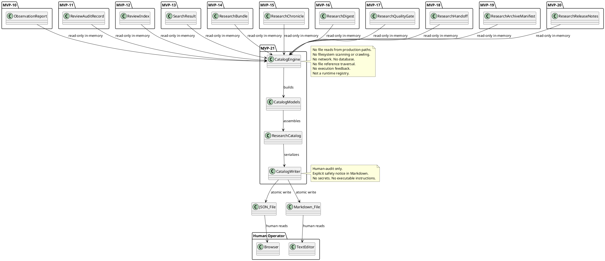
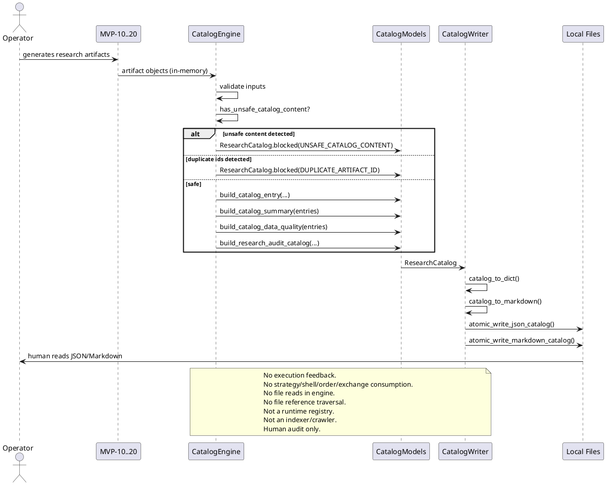

# SPEC-022 — Local Research Audit Catalog

## 1. Background

After MVP-10 through MVP-20, the system produces eleven categories of human-audit research artifacts:

- **MVP-10 Observation Reports:** `data/observation/latest_observation_report.json` — research-only summaries of what the system observed.
- **MVP-11 Review Audit Records:** `data/review/latest_review_audit_record.json` — operator review outcomes.
- **MVP-12 Review Index:** `data/review_index/latest_review_index.json` — catalog entries linking reports to reviews.
- **MVP-13 Review Search Results:** `data/review_search/latest_search_result.json` — query results over the review index.
- **MVP-14 Research Bundle:** `data/research_bundle/latest_research_bundle.json` — evidence-pack grouping of artifacts.
- **MVP-15 Research Chronicle:** `data/research_chronicle/latest_research_chronicle.json` — audit timeline of artifacts.
- **MVP-16 Research Digest:** `data/research_digest/latest_research_digest.json` — executive summary of research state.
- **MVP-17 Research Quality Gate:** `data/research_quality_gate/latest_research_quality_gate.json` — audit-readiness checks.
- **MVP-18 Research Handoff Packet:** `data/research_handoff/latest_research_handoff.json` — contractor handoff packet.
- **MVP-19 Research Archive Manifest:** `data/research_archive_manifest/latest_research_archive_manifest.json` — artifact presence/staleness inventory.
- **MVP-20 Research Release Notes:** `data/research_release_notes/latest_research_release_notes.json` — audit change summary.

These artifacts are **human-audit-only** — they are not trading signals, not trade approvals, not release/deployment/publish approvals, and must never be consumed by execution, strategy, Freqtrade shell, order, exchange, or any MVP execution path.

Each individual layer catalogs, searches, bundles, or summarizes artifacts within its own scope. However, there is no single **unified catalog** that:

1. **Catalogs** every research artifact across all eleven layers in one place.
2. **Records** each artifact's identity, kind, state, source layer, spec reference, and metadata for human browsing.
3. **Summarizes** counts by artifact kind, catalog state, reason code, and source layer.
4. **Tracks** catalog completeness, duplicate detection, and cross-layer consistency for audit purposes.

SPEC-022 designs a **Local Research Audit Catalog** layer (MVP-21) that:

1. **Consumes** in-memory artifact objects (or dicts) from MVP-10 through MVP-20 as read-only input.
2. **Produces** local JSON/Markdown catalog artifacts for human browsing and audit purposes.
3. **Never feeds catalog output back into** MVP-4, MVP-5, MVP-6, MVP-7, MVP-8, MVP-9, MVP-10, MVP-11, MVP-12, MVP-13, MVP-14, MVP-15, MVP-16, MVP-17, MVP-18, MVP-19, MVP-20, Freqtrade, strategy, order, exchange, or execution paths.
4. **Catalog entries, summaries, JSON output, and Markdown output are not trading signals, not trade approvals, not release/deployment/publish approvals, and must never be consumed by execution, strategy, Freqtrade shell, order, exchange, or any MVP execution path.**
5. **Catalog artifacts and catalog summaries must not feed back into any MVP layer, Freqtrade, strategy, order, exchange, or execution paths.**
6. **Missing/invalid/unsafe artifact inputs must be summarized as BLOCKED/UNKNOWN/INVALID in catalog data quality, not repaired, inferred, upgraded, or normalized into safe-looking records.**
7. **Fail-closed catalog records may be generated for audit purposes only and must never trigger any action.**
8. **Catalog output must not contain API keys, secrets, exchange credentials, executable trading instructions, or operational instructions.**

### 1.1 Distinction from the Archive Manifest (MVP-19)

The archive manifest (SPEC-020) answers: **"Do all required artifact families exist and are they fresh?"** It checks presence/staleness across nine families and flags MISSING/STALE entries for archival readiness.

The audit catalog (SPEC-022) answers: **"What artifacts exist, what are their properties, and how do they catalog for human audit?"** It catalogs each artifact's identity, kind, state, reason codes, source layer, spec reference, and metadata across all eleven layers for unified browsing and discovery. The catalog records what an artifact *is*, not just whether it *exists*.

### 1.2 What the Catalog Is Not

The catalog is a **static catalog snapshot** — not a runtime registry, not a live artifact store, and not a queryable service.

- **Not a runtime registry:** The catalog is a point-in-time snapshot built from in-memory objects. It does not register, subscribe, poll, or track artifacts at runtime. It does not maintain state between catalog builds.
- **Not an indexer or crawler:** The catalog does not scan directories, walk file trees, glob patterns, or discover artifacts from the filesystem. Artifacts are passed in explicitly as in-memory objects or dicts.
- **Does not read files:** The catalog engine never opens, reads, or parses artifact files. It operates exclusively on in-memory objects passed to it. File output is writer-only (atomic JSON/Markdown writes).
- **Does not follow referenced artifact paths:** All `local_reference` fields are opaque strings. Catalog logic never traverses, opens, follows, validates, or executes file references. The catalog records the string; the human operator decides whether to open it.
- **No dashboard, database, server, or API:** The catalog produces local JSON/Markdown files only. There is no web UI, no HTTP server, no REST API, no database, no SQLite, no authentication layer.
- **No release, deployment, trade, or execution approval:** The catalog is a human-audit artifact. It is not a release gate, not a deployment approval, not a publish approval, not a trade approval, not execution readiness, not strategy readiness, not transaction permission. Catalog output must never be consumed by any execution path.

## 2. Requirements

### 2.1 Must Have (M)

- **M1:** Consume in-memory artifact objects (or dicts) from MVP-10 through MVP-20 as read-only input.
- **M2:** Produce a deterministic, immutable `CatalogEntry` frozen dataclass that catalogs a single research artifact with its identity, kind, state, source layer, spec reference, and metadata.
- **M3:** Produce a deterministic, immutable `CatalogSummary` frozen dataclass that aggregates counts across all catalog entries by artifact kind, catalog state, and reason code.
- **M4:** Produce a deterministic, immutable `CatalogDataQuality` frozen dataclass that tracks catalog completeness, duplicate detection, and cross-layer consistency.
- **M5:** Produce a deterministic, immutable `CatalogSafetyFlags` frozen dataclass with all unsafe flags defaulting to `False`.
- **M6:** Produce a deterministic, immutable `ResearchCatalog` frozen dataclass that holds the full catalog (entries + summary + data quality + safety flags).
- **M7:** Fail-closed: missing or invalid inputs produce a blocked/empty catalog with `CATALOG_ERROR` reason code, never an inferred or partial catalog.
- **M8:** Deterministic reason codes for all blocking conditions, priority-ordered.
- **M9:** JSON/Markdown writer that serializes the catalog to local files with atomic writes, human-audit-only safety notice, and no secrets.
- **M10:** Default JSON output path: `data/research_audit_catalog/latest_research_audit_catalog.json`.
- **M11:** Default Markdown output path: `reports/research_audit_catalog/latest_research_audit_catalog.md`.
- **M12:** No file reads from production data paths — catalog is built from in-memory objects only.
- **M13:** No network, database, realtime, or exchange connections.
- **M14:** No trading decisions, no trade approval, no execution logic. **Catalog output is not a trading signal, not trade approval, not release/deployment/publish approval, and must never be consumed by execution, strategy, Freqtrade shell, order, exchange, or any MVP execution path.**
- **M15:** Catalog covers all eleven artifact layers (MVP-10 through MVP-20), including the archive manifest and release notes themselves.

### 2.2 Should Have (S)

- **S1:** Duplicate detection: two entries with the same `entry_id` (same `artifact_kind` + same `artifact_id`) are blocking duplicates. Cross-kind `artifact_id` overlap (same `artifact_id` but different `artifact_kind`) is advisory-only, non-blocking, and may be reflected in `CatalogDataQuality.has_cross_kind_overlap` for audit visibility.
- **S2:** Per-layer entry counts in summary (how many observation reports, reviews, bundles, etc.).
- **S3:** Reason code frequency counts in summary.
- **S4:** Source-layer coverage table: which of the eleven layers have at least one cataloged artifact.
- **S5:** Staleness tracking: artifacts older than a configurable threshold flagged in data quality (non-blocking).

### 2.3 Could Have (C)

- **C1:** Catalog diff between two catalog snapshots.
- **C2:** Date-bucketed sub-catalogs (daily, weekly).
- **C3:** Catalog entry ordering options (by kind, by generated_at, by artifact_id).

### 2.4 Won't Have (W)

- **W1:** Web UI, dashboard, or browser-based interface.
- **W2:** Database persistence (SQLite, PostgreSQL, etc.).
- **W3:** HTTP API, server, or authentication/authorization system.
- **W4:** Any feedback into execution paths. **Catalog output must not feed back into any MVP layer, Freqtrade, strategy, order, exchange, or execution path.**
- **W5:** Catalog output consumed by strategy, Freqtrade, order, exchange, or any MVP execution path. **Catalog output is not a trading signal, not trade approval, not release/deployment/publish approval, and must never be consumed by execution, strategy, Freqtrade shell, order, exchange, or any MVP execution path.**
- **W6:** Runtime registry behavior: no live registration, no subscription, no polling, no state tracking between builds.
- **W7:** Indexer or crawler behavior: no filesystem scanning, no directory walking, no glob-based discovery.
- **W8:** File reads in the engine. The engine never opens or parses artifact files. File I/O is writer-only.
- **W9:** File reference traversal: no opening, following, validating, or executing of `local_reference` paths or metadata strings.
- **W10:** Binance, real exchange, or Freqtrade runtime connection.
- **W11:** Live trading, real orders, leverage, shorting, or real entry/exit execution logic.
- **W12:** Config YAML, JSON schema, or deployable Freqtrade strategy class.
- **W13:** Release, deployment, trade, or execution approval semantics. The catalog is advisory audit metadata only.
- **W14:** Catalog output containing API keys, secrets, exchange credentials, executable trading instructions, or operational instructions.

## 3. Method

### 3.1 Input Contracts

The catalog consumes artifact objects (or their `to_dict()` / dict output) from each layer. Each artifact is identified by:

| Field | Type | Required |
|-------|------|----------|
| `artifact_id` | `str` | Yes |
| `artifact_kind` | `CatalogArtifactKind` enum | Yes |
| `catalog_state` | `CatalogState` enum | Yes |
| `source_version` | `str` | Yes |
| `generated_at` | `datetime` (ISO-8601) | Yes |
| `reason_codes` | `tuple[str, ...]` | No |
| `tags` | `tuple[str, ...]` | No |
| `title` | `str` | No |
| `spec_reference` | `str` | No |
| `local_reference` | `str` | No |
| `metadata` | `dict[str, Any]` | No |

### 3.2 Catalog Models

#### `CatalogArtifactKind` — Artifact Layer Enum

```python
class CatalogArtifactKind(Enum):
    """Which research layer produced this artifact."""

    OBSERVATION_REPORT = "OBSERVATION_REPORT"          # MVP-10
    OPERATOR_REVIEW = "OPERATOR_REVIEW"                # MVP-11
    REVIEW_INDEX = "REVIEW_INDEX"                      # MVP-12
    REVIEW_SEARCH = "REVIEW_SEARCH"                    # MVP-13
    RESEARCH_BUNDLE = "RESEARCH_BUNDLE"                # MVP-14
    RESEARCH_CHRONICLE = "RESEARCH_CHRONICLE"          # MVP-15
    RESEARCH_DIGEST = "RESEARCH_DIGEST"                # MVP-16
    RESEARCH_QUALITY_GATE = "RESEARCH_QUALITY_GATE"    # MVP-17
    RESEARCH_HANDOFF = "RESEARCH_HANDOFF"              # MVP-18
    RESEARCH_ARCHIVE_MANIFEST = "RESEARCH_ARCHIVE_MANIFEST"  # MVP-19
    RESEARCH_RELEASE_NOTES = "RESEARCH_RELEASE_NOTES"  # MVP-20
```

Each kind maps to a canonical source spec and MVP layer:

| Kind | Spec | MVP |
|------|------|-----|
| `OBSERVATION_REPORT` | SPEC-011 | MVP-10 |
| `OPERATOR_REVIEW` | SPEC-012 | MVP-11 |
| `REVIEW_INDEX` | SPEC-013 | MVP-12 |
| `REVIEW_SEARCH` | SPEC-014 | MVP-13 |
| `RESEARCH_BUNDLE` | SPEC-015 | MVP-14 |
| `RESEARCH_CHRONICLE` | SPEC-016 | MVP-15 |
| `RESEARCH_DIGEST` | SPEC-017 | MVP-16 |
| `RESEARCH_QUALITY_GATE` | SPEC-018 | MVP-17 |
| `RESEARCH_HANDOFF` | SPEC-019 | MVP-18 |
| `RESEARCH_ARCHIVE_MANIFEST` | SPEC-020 | MVP-19 |
| `RESEARCH_RELEASE_NOTES` | SPEC-021 | MVP-20 |

#### `CatalogState` — Catalog Entry State

```python
class CatalogState(Enum):
    """State of a catalog entry — mirrors IndexState for consistency."""

    DISABLED = "DISABLED"
    READY = "READY"
    BLOCKED = "BLOCKED"
    UNKNOWN = "UNKNOWN"
```

#### `CatalogConfig` — Catalog Building Configuration

```python
@dataclass(frozen=True)
class CatalogConfig:
    """Configuration for catalog building."""

    catalog_version: str = "1.0"
    stale_threshold_seconds: int = 86400  # 24 hours
    block_on_empty: bool = True
    block_on_duplicate_ids: bool = True
    block_on_unsafe_content: bool = True

    def __post_init__(self) -> None:
        if not self.catalog_version:
            raise ValueError("catalog_version must be non-empty")
        if self.stale_threshold_seconds <= 0:
            raise ValueError("stale_threshold_seconds must be > 0")
```

#### `CatalogSafetyFlags` — Safety Invariants

```python
@dataclass(frozen=True)
class CatalogSafetyFlags:
    """Safety invariants for the catalog."""

    dry_run: bool = True
    live_trading_enabled: bool = False
    real_orders_enabled: bool = False
    leverage_enabled: bool = False
    shorting_enabled: bool = False
    report_feedback_into_execution: bool = False
    operator_feedback_into_execution: bool = False
    index_feedback_into_execution: bool = False
    search_feedback_into_execution: bool = False
    catalog_feedback_into_execution: bool = False
    file_reference_traversal_enabled: bool = False
    database_persistence_enabled: bool = False
    web_ui_enabled: bool = False
    dashboard_enabled: bool = False
    runtime_registry_enabled: bool = False
    indexer_crawler_enabled: bool = False
    # Catalog output is human-audit only — these must be True
    catalog_output_is_human_audit_only: bool = True
    catalog_output_not_trading_signal: bool = True
    catalog_output_not_trade_approval: bool = True
    catalog_output_not_release_approval: bool = True
    catalog_output_not_deployment_approval: bool = True
    catalog_output_not_for_execution: bool = True
    catalog_output_not_for_strategy: bool = True
    catalog_output_not_for_freqtrade: bool = True
    catalog_output_not_for_order: bool = True
    catalog_output_not_for_exchange: bool = True

    def __post_init__(self) -> None:
        unsafe_flags = (
            self.live_trading_enabled,
            self.real_orders_enabled,
            self.leverage_enabled,
            self.shorting_enabled,
            self.report_feedback_into_execution,
            self.operator_feedback_into_execution,
            self.index_feedback_into_execution,
            self.search_feedback_into_execution,
            self.catalog_feedback_into_execution,
            self.file_reference_traversal_enabled,
            self.database_persistence_enabled,
            self.web_ui_enabled,
            self.dashboard_enabled,
            self.runtime_registry_enabled,
            self.indexer_crawler_enabled,
        )
        if any(unsafe_flags):
            raise ValueError("unsafe catalog safety flags are enabled")
        safe_flags = (
            self.catalog_output_is_human_audit_only,
            self.catalog_output_not_trading_signal,
            self.catalog_output_not_trade_approval,
            self.catalog_output_not_release_approval,
            self.catalog_output_not_deployment_approval,
            self.catalog_output_not_for_execution,
            self.catalog_output_not_for_strategy,
            self.catalog_output_not_for_freqtrade,
            self.catalog_output_not_for_order,
            self.catalog_output_not_for_exchange,
        )
        if not all(safe_flags):
            raise ValueError("safe catalog output flags must be True")
```

#### `CatalogEntry` — Single Artifact Catalog Entry

```python
@dataclass(frozen=True)
class CatalogEntry:
    """Catalog entry for a single research artifact."""

    entry_id: str                         # deterministic, derived from artifact_id + artifact_kind
    artifact_id: str                      # source artifact's own ID (report_id, audit_id, index_id, etc.)
    artifact_kind: CatalogArtifactKind    # which layer produced this artifact
    catalog_state: CatalogState           # READY / BLOCKED / UNKNOWN / DISABLED
    source_version: str                   # artifact format version (e.g. "1.0")
    generated_at: datetime                # when the source artifact was generated
    title: str = ""                       # human-readable label for browsing
    spec_reference: str = ""              # e.g. "SPEC-011"
    local_reference: str = ""             # opaque path string — never traversed
    reason_codes: tuple[str, ...] = ()    # from source artifact
    tags: tuple[str, ...] = ()           # from source artifact
    metadata: Mapping[str, Any] = field(default_factory=dict)

    def __post_init__(self) -> None:
        if not self.entry_id:
            raise ValueError("entry_id must be non-empty")
        if not self.artifact_id:
            raise ValueError("artifact_id must be non-empty")
        if not isinstance(self.artifact_kind, CatalogArtifactKind):
            raise ValueError("artifact_kind must be CatalogArtifactKind")
        if not isinstance(self.catalog_state, CatalogState):
            raise ValueError("catalog_state must be CatalogState")
        if not self.source_version:
            raise ValueError("source_version must be non-empty")
        _ensure_timezone_aware(self.generated_at, "generated_at")
        _ensure_tuple_of_str(self.reason_codes, "reason_codes")
        _ensure_tuple_of_str(self.tags, "tags")
        # Forbidden content check on all text fields
        _check_forbidden_catalog_content((
            self.title, self.spec_reference, self.local_reference,
        ), self.tags, self.metadata)
        if self.catalog_state is not CatalogState.READY and not self.reason_codes:
            raise ValueError("reason_codes must be non-empty when catalog_state is not READY")
        object.__setattr__(self, "metadata", MappingProxyType(dict(self.metadata)))

    @classmethod
    def blocked(
        cls,
        *,
        entry_id: str = "blocked",
        artifact_id: str = "blocked",
        artifact_kind: CatalogArtifactKind,
        reason_codes: tuple[str, ...] = (DEFAULT_BLOCKED,),
        generated_at: datetime | None = None,
    ) -> "CatalogEntry":
        """Create a blocked catalog entry for audit purposes only."""
        if generated_at is None:
            generated_at = datetime.now(timezone.utc)
        return cls(
            entry_id=entry_id,
            artifact_id=artifact_id,
            artifact_kind=artifact_kind,
            catalog_state=CatalogState.BLOCKED,
            source_version="blocked",
            generated_at=generated_at,
            reason_codes=reason_codes,
        )
```

Validation rules:
- `entry_id` must be non-empty string.
- `artifact_id` must be non-empty string.
- `artifact_kind` must be a `CatalogArtifactKind` enum instance.
- `catalog_state` must be a `CatalogState` enum instance.
- `source_version` must be non-empty string.
- `generated_at` must be timezone-aware datetime.
- `reason_codes` must be non-empty when `catalog_state` is not `READY`.
- **All `local_reference` and `spec_reference` fields are local string references only — catalog logic must not traverse, validate, open, follow, or execute file references.**
- **Missing/invalid/unsafe artifact inputs must be summarized as BLOCKED/UNKNOWN/INVALID in catalog data quality, not repaired, inferred, upgraded, or normalized into safe-looking records.**

#### `CatalogSummary` — Aggregated Counts

```python
@dataclass(frozen=True)
class CatalogSummary:
    """Aggregate counts across all catalog entries."""

    total_entries: int = 0
    ready_count: int = 0
    blocked_count: int = 0
    unknown_count: int = 0
    disabled_count: int = 0
    # Per-kind counts
    kind_counts: Mapping[CatalogArtifactKind, int] = field(default_factory=dict)
    # Per-state counts (redundant with state fields above, but explicit for audit)
    reason_counts: Mapping[str, int] = field(default_factory=dict)
    # Source layer coverage
    layers_covered: int = 0        # how many of 11 layers have ≥1 entry
    layers_missing: int = 0        # how many of 11 layers have 0 entries
    duplicate_id_count: int = 0    # entries with duplicate artifact_id
    stale_entry_count: int = 0     # entries older than threshold

    def __post_init__(self) -> None:
        if self.total_entries < 0:
            raise ValueError("total_entries must be >= 0")
        if self.ready_count < 0:
            raise ValueError("ready_count must be >= 0")
        if self.blocked_count < 0:
            raise ValueError("blocked_count must be >= 0")
        if self.unknown_count < 0:
            raise ValueError("unknown_count must be >= 0")
        if self.disabled_count < 0:
            raise ValueError("disabled_count must be >= 0")
        state_sum = self.ready_count + self.blocked_count + self.unknown_count + self.disabled_count
        if state_sum > self.total_entries:
            raise ValueError("state counts must not exceed total_entries")
        for k, v in self.kind_counts.items():
            if not isinstance(k, CatalogArtifactKind):
                raise ValueError("kind_counts keys must be CatalogArtifactKind")
            if v < 0:
                raise ValueError("kind_counts values must be >= 0")
        for k, v in self.reason_counts.items():
            if v < 0:
                raise ValueError(f"reason_counts[{k}] must be >= 0")
        if self.layers_covered < 0:
            raise ValueError("layers_covered must be >= 0")
        if self.layers_missing < 0:
            raise ValueError("layers_missing must be >= 0")
        if self.layers_covered + self.layers_missing != len(CatalogArtifactKind):
            raise ValueError("layers_covered + layers_missing must equal total layer count")
        if self.duplicate_id_count < 0:
            raise ValueError("duplicate_id_count must be >= 0")
        if self.stale_entry_count < 0:
            raise ValueError("stale_entry_count must be >= 0")
        object.__setattr__(self, "kind_counts", MappingProxyType(dict(self.kind_counts)))
        object.__setattr__(self, "reason_counts", MappingProxyType(dict(self.reason_counts)))
```

#### `CatalogDataQuality` — Catalog Completeness and Consistency

```python
@dataclass(frozen=True)
class CatalogDataQuality:
    """Completeness and quality metrics for the catalog."""

    total_artifacts: int = 0
    valid_entries: int = 0
    blocked_entries: int = 0
    stale_entries: int = 0
    duplicate_artifact_ids: tuple[str, ...] = ()    # entry_ids appearing more than once (blocking)
    cross_kind_overlap_ids: tuple[str, ...] = ()     # artifact_ids appearing across different kinds (advisory)
    missing_layer_kinds: tuple[str, ...] = ()        # CatalogArtifactKind values with zero entries
    covered_layer_kinds: tuple[str, ...] = ()         # CatalogArtifactKind values with ≥1 entry
    validation_errors: tuple[str, ...] = ()           # any validation errors encountered
    has_duplicates: bool = False                      # True if duplicate entry_ids exist
    has_cross_kind_overlap: bool = False              # True if cross-kind artifact_id overlap exists (advisory)
    has_missing_layers: bool = False
    has_stale_entries: bool = False

    def __post_init__(self) -> None:
        if self.total_artifacts < 0:
            raise ValueError("total_artifacts must be >= 0")
        if self.valid_entries < 0:
            raise ValueError("valid_entries must be >= 0")
        if self.blocked_entries < 0:
            raise ValueError("blocked_entries must be >= 0")
        if self.stale_entries < 0:
            raise ValueError("stale_entries must be >= 0")
        if self.valid_entries + self.blocked_entries > self.total_artifacts:
            raise ValueError("entry category counts must not exceed total_artifacts")
        _ensure_tuple_of_str(self.duplicate_artifact_ids, "duplicate_artifact_ids")
        _ensure_tuple_of_str(self.cross_kind_overlap_ids, "cross_kind_overlap_ids")
        _ensure_tuple_of_str(self.missing_layer_kinds, "missing_layer_kinds")
        _ensure_tuple_of_str(self.covered_layer_kinds, "covered_layer_kinds")
        _ensure_tuple_of_str(self.validation_errors, "validation_errors")
```

#### Helpers

Private validation functions used by model `__post_init__` methods:

```python
def _ensure_timezone_aware(value: datetime, field_name: str) -> datetime:
    """Raise ValueError if value is a naive datetime (tzinfo is None).

    Returns value unchanged when it is timezone-aware or None.
    """

def _ensure_tuple_of_str(
    value: Iterable[str] | tuple[str, ...], field_name: str,
) -> tuple[str, ...]:
    """Validate that value is a tuple of non-empty strings.

    Raises ValueError if value is not a tuple, or any element is not a
    non-empty string. Returns a validated tuple.
    """

def _check_forbidden_catalog_content(
    text_fields: tuple[str, ...],
    tags: tuple[str, ...],
    metadata: Mapping[str, Any],
) -> None:
    """Check all text fields, tags, and metadata keys for forbidden terms.

    Uses FORBIDDEN_CATALOG_TERMS for case-insensitive substring matching.
    Raises ValueError if any forbidden term is found.
    """
```

#### `ResearchCatalog` — Full Catalog Container

```python
@dataclass(frozen=True)
class ResearchCatalog:
    """Full catalog container with fail-closed blocked factory."""

    catalog_id: str                     # UUID or deterministic hash
    generated_at: datetime              # catalog generation timestamp
    catalog_state: CatalogState
    entries: tuple[CatalogEntry, ...]   # all catalog entries, deterministically ordered
    summary: CatalogSummary             # aggregated counts
    data_quality: CatalogDataQuality    # completeness metrics
    safety_flags: CatalogSafetyFlags    # safety invariants
    reason_codes: tuple[str, ...]       # all reason codes from catalog build
    version: str = "1.0"               # catalog format version

    def __post_init__(self) -> None:
        if not self.catalog_id:
            raise ValueError("catalog_id must be non-empty")
        _ensure_timezone_aware(self.generated_at, "generated_at")
        if not isinstance(self.catalog_state, CatalogState):
            raise ValueError("catalog_state must be CatalogState")
        if not isinstance(self.entries, tuple):
            raise ValueError("entries must be a tuple")
        for entry in self.entries:
            if not isinstance(entry, CatalogEntry):
                raise ValueError("entries must contain CatalogEntry values")
        if not isinstance(self.summary, CatalogSummary):
            raise ValueError("summary must be CatalogSummary")
        if not isinstance(self.data_quality, CatalogDataQuality):
            raise ValueError("data_quality must be CatalogDataQuality")
        if not isinstance(self.safety_flags, CatalogSafetyFlags):
            raise ValueError("safety_flags must be CatalogSafetyFlags")
        _ensure_tuple_of_str(self.reason_codes, "reason_codes")
        for code in self.reason_codes:
            if code not in CATALOG_REASON_CODES:
                raise ValueError(f"unsupported reason code: {code}")
        if self.catalog_state is not CatalogState.READY and not self.reason_codes:
            raise ValueError("reason_codes must be non-empty when catalog_state is not READY")
        if self.catalog_state is CatalogState.READY and self.reason_codes:
            raise ValueError("READY catalogs must not have reason_codes")

    @classmethod
    def blocked(
        cls,
        *,
        catalog_id: str = "blocked",
        generated_at: datetime | None = None,
        reason_code: str = DEFAULT_BLOCKED,
        safety_flags: CatalogSafetyFlags | None = None,
    ) -> "ResearchCatalog":
        """Create a deterministic fail-closed blocked catalog.

        Must not call ``CatalogSummary()`` with defaults — the
        ``layers_covered + layers_missing`` invariant requires the sum to
        equal ``len(CatalogArtifactKind)``. A blocked catalog has zero
        covered layers, so all 11 layers must be marked missing.
        """
        if reason_code not in CATALOG_REASON_CODES:
            raise ValueError(f"unsupported reason code: {reason_code}")
        if generated_at is None:
            generated_at = datetime.now(timezone.utc)
        if safety_flags is None:
            safety_flags = CatalogSafetyFlags()
        return cls(
            catalog_id=catalog_id,
            generated_at=generated_at,
            catalog_state=CatalogState.BLOCKED,
            entries=(),
            summary=CatalogSummary(
                layers_missing=len(CatalogArtifactKind),
            ),
            data_quality=CatalogDataQuality(),
            safety_flags=safety_flags,
            reason_codes=(reason_code,),
        )
```

### 3.3 Reason Codes

Deterministic, priority-ordered tuple:

```python
MISSING_ARTIFACTS = "MISSING_ARTIFACTS"                # 1 — no artifacts provided
INVALID_ARTIFACT = "INVALID_ARTIFACT"                  # 2 — artifact missing required fields
INVALID_ARTIFACT_ID = "INVALID_ARTIFACT_ID"            # 3 — artifact_id missing or invalid
INVALID_ARTIFACT_KIND = "INVALID_ARTIFACT_KIND"        # 4 — artifact_kind not recognized
UNSUPPORTED_ARTIFACT_VERSION = "UNSUPPORTED_ARTIFACT_VERSION"  # 5 — version not recognized
UNSAFE_ARTIFACT_STATE = "UNSAFE_ARTIFACT_STATE"        # 6 — artifact has unsafe state
UNSAFE_SAFETY_FLAGS = "UNSAFE_SAFETY_FLAGS"            # 7 — artifact has unsafe safety flags
DUPLICATE_ARTIFACT_ID = "DUPLICATE_ARTIFACT_ID"        # 8 — two artifacts with same id
EMPTY_CATALOG = "EMPTY_CATALOG"                        # 9 — catalog built but has zero entries
UNSAFE_CATALOG_CONTENT = "UNSAFE_CATALOG_CONTENT"      # 10 — forbidden terms in metadata/tags
STALE_ARTIFACT = "STALE_ARTIFACT"                      # 11 — artifact older than threshold (non-blocking)
CATALOG_ERROR = "CATALOG_ERROR"                        # 12 — catch-all for unexpected errors
DEFAULT_BLOCKED = "DEFAULT_BLOCKED"                    # 13 — default blocked reason

CATALOG_REASON_CODES: tuple[str, ...] = (
    MISSING_ARTIFACTS,
    INVALID_ARTIFACT,
    INVALID_ARTIFACT_ID,
    INVALID_ARTIFACT_KIND,
    UNSUPPORTED_ARTIFACT_VERSION,
    UNSAFE_ARTIFACT_STATE,
    UNSAFE_SAFETY_FLAGS,
    DUPLICATE_ARTIFACT_ID,
    EMPTY_CATALOG,
    UNSAFE_CATALOG_CONTENT,
    STALE_ARTIFACT,
    CATALOG_ERROR,
    DEFAULT_BLOCKED,
)
```

### 3.4 Forbidden Catalog Content

```python
FORBIDDEN_CATALOG_TERMS: frozenset[str] = frozenset({
    "api_key",
    "secret",
    "exchange_credentials",
    "executable_instructions",
    "operational_instructions",
    "enter_long",
    "enter_short",
    "exit_long",
    "exit_short",
    "buy_now",
    "sell_now",
    "execute_trade",
    "place_order",
    "market_order",
    "limit_order",
    "stop_loss",
    "take_profit",
    "leverage",
    "shorting",
    "binance",
    "private_key",
    "password",
})
```

### 3.5 Engine Functions

#### `has_unsafe_catalog_content(...)`

```python
def has_unsafe_catalog_content(text: str) -> bool:
    """Case-insensitive check for forbidden terms in catalog text."""
```

Recursively checks strings, tuples, lists, dicts, and frozensets for forbidden terms.

#### `build_catalog_safety_flags()`

```python
def build_catalog_safety_flags() -> CatalogSafetyFlags:
    """Build default fail-closed safety flags."""
```

Returns `CatalogSafetyFlags()` with all unsafe flags `False` and all safe flags `True`.

#### `build_catalog_entry(...)`

```python
def build_catalog_entry(
    artifact_id: str,
    artifact_kind: CatalogArtifactKind,
    catalog_state: CatalogState,
    source_version: str,
    generated_at: datetime,
    *,
    title: str = "",
    spec_reference: str = "",
    local_reference: str = "",
    reason_codes: tuple[str, ...] = (),
    tags: tuple[str, ...] = (),
    metadata: Mapping[str, Any] | None = None,
) -> CatalogEntry:
    """Build a single CatalogEntry from artifact properties."""
```

Validation:
- `artifact_id` must be non-empty.
- `artifact_kind` must be a `CatalogArtifactKind` enum.
- `catalog_state` must be a `CatalogState` enum.
- `source_version` must be non-empty.
- `generated_at` must be timezone-aware.
- `entry_id` is derived deterministically from `artifact_id` + `artifact_kind.value` (e.g. `f"{artifact_kind.value}:{artifact_id}"`).
- Forbidden content check on all text fields, tags, and metadata keys.

#### `build_catalog_summary(...)`

```python
def build_catalog_summary(
    entries: Sequence[CatalogEntry],
    *,
    stale_threshold_seconds: int = 86400,
    reference_time: datetime | None = None,
) -> CatalogSummary:
    """Aggregate counts across all catalog entries."""
```

Deterministic counting:
- Iterate entries once, accumulate all counts.
- `kind_counts`: count per `CatalogArtifactKind`.
- `reason_counts`: frequency map of all reason_codes across entries.
- `layers_covered` / `layers_missing`: how many of 11 `CatalogArtifactKind` values have ≥1 / 0 entries.
- `duplicate_id_count`: entries whose `artifact_id` appears more than once across the catalog.
- `stale_entry_count`: entries older than `stale_threshold_seconds`.

#### `build_catalog_data_quality(...)`

```python
def build_catalog_data_quality(
    entries: Sequence[CatalogEntry],
    *,
    stale_threshold_seconds: int = 86400,
    reference_time: datetime | None = None,
) -> CatalogDataQuality:
    """Assess catalog completeness and consistency."""
```

Quality checks:
- `total_artifacts` = `len(entries)`.
- `valid_entries` = entries with `catalog_state == READY`.
- `blocked_entries` = entries with `catalog_state == BLOCKED`.
- `stale_entries` = entries older than threshold.
- `duplicate_artifact_ids` = sorted tuple of `entry_id`s appearing more than once (same `artifact_kind` + same `artifact_id` — blocking duplicates).
- `cross_kind_overlap_ids` = sorted tuple of `artifact_id`s that appear across different `artifact_kind` values (advisory, non-blocking).
- `missing_layer_kinds` = sorted tuple of `CatalogArtifactKind` values with zero entries.
- `covered_layer_kinds` = sorted tuple of `CatalogArtifactKind` values with ≥1 entry.
- `has_duplicates` = `len(duplicate_artifact_ids) > 0`.
- `has_cross_kind_overlap` = `len(cross_kind_overlap_ids) > 0`.
- `has_missing_layers` = `len(missing_layer_kinds) > 0`.
- `has_stale_entries` = `stale_entries > 0`.

#### `build_research_audit_catalog(...)`

```python
def build_research_audit_catalog(
    entries: Sequence[CatalogEntry],
    *,
    catalog_id: str = "",
    generated_at: datetime | None = None,
    config: CatalogConfig | None = None,
    safety_flags: CatalogSafetyFlags | None = None,
    stale_threshold_seconds: int = 86400,
    reference_time: datetime | None = None,
) -> ResearchCatalog:
    """Build full ResearchCatalog from catalog entries."""
```

Catalog ID generation:
- If `catalog_id` is empty (`""`), generate via `str(uuid.uuid4())`.
- Explicit `catalog_id` must be preserved as-is for deterministic tests.
- `generated_at` defaults to `datetime.now(timezone.utc)` when `None`.

Fail-closed rules (priority order):
1. `MISSING_ARTIFACTS` — if no entries provided and `config.block_on_empty` → blocked catalog.
2. `INVALID_ARTIFACT` — if any entry fails validation → blocked catalog.
3. `DUPLICATE_ARTIFACT_ID` — if any `entry_id` (derived from `artifact_kind.value:artifact_id`) appears more than once and `config.block_on_duplicate_ids` → blocked catalog. Cross-kind `artifact_id` overlap (same `artifact_id` across different `artifact_kind` values) is advisory-only, tracked in `CatalogDataQuality.has_cross_kind_overlap`, and must not block by itself.
4. `UNSAFE_CATALOG_CONTENT` — if any tags/metadata contain forbidden terms and `config.block_on_unsafe_content` → blocked catalog.
5. `STALE_ARTIFACT` — if any entry older than threshold → warning in data_quality, non-blocking.
6. `EMPTY_CATALOG` — if no entries are provided and no already-loaded catalog inputs are provided (distinct from `INVALID_ARTIFACT` which handles entries that exist but fail validation). `EMPTY_CATALOG` fires only when there are zero entries to catalog at all; it does not overlap with rule 2.
7. `CATALOG_ERROR` — catch-all for unexpected errors → blocked catalog.

Entry ordering: entries are sorted deterministically by `(artifact_kind.value, artifact_id)` before assembly.

### 3.6 Writer Design

#### `catalog_to_dict(...)`

```python
def catalog_to_dict(catalog: ResearchCatalog) -> dict:
    """Serialize ResearchCatalog to JSON-compatible dict."""
```

Serialization rules:
- `generated_at` → ISO-8601 with `Z` suffix.
- Enums → `.value` strings.
- `tuple` → `list`.
- `datetime` → ISO-8601 with `Z` suffix.
- `CatalogArtifactKind` keys in `kind_counts` → `.value` strings.
- `CatalogEntry.metadata` → plain dict passthrough (`dict(entry.metadata)`). Metadata and reference strings remain strings only and are not traversed, opened, followed, validated, or executed during serialization.
- No secrets, no executable instructions.

#### `catalog_to_markdown(...)`

```python
def catalog_to_markdown(catalog: ResearchCatalog) -> str:
    """Serialize ResearchCatalog to human-readable Markdown."""
```

Markdown must include:
- Title: "Research Audit Catalog — Human Audit Only"
- Generated timestamp.
- Catalog version.
- Total entries count.
- Catalog state.
- Per-kind entry counts table.
- Catalog state counts (ready, blocked, unknown, disabled).
- Layer coverage table (covered / missing).
- Reason code frequency table.
- Data quality summary (duplicates, stale, missing layers).
- Safety flags table.
- **Explicit safety notice:**
  > "This local research audit catalog is a human-audit artifact only. It is not a trading signal, not trade approval, not release/deployment/publish approval, and must not be consumed by execution, strategy, Freqtrade shell, order, exchange, or any MVP execution path. The catalog is a static snapshot — not a runtime registry, not an indexer/crawler. Referenced artifact paths are not followed, opened, validated, or executed."

#### `atomic_write_json_catalog(...)`

```python
def atomic_write_json_catalog(
    catalog: ResearchCatalog,
    target_path: Path | None = None,
) -> Path:
    """Atomic JSON write with temp file, fsync, os.replace, cleanup."""
```

Default path: `data/research_audit_catalog/latest_research_audit_catalog.json`

#### `atomic_write_markdown_catalog(...)`

```python
def atomic_write_markdown_catalog(
    catalog: ResearchCatalog,
    target_path: Path | None = None,
) -> Path:
    """Atomic Markdown write with temp file, fsync, os.replace, cleanup."""
```

Default path: `reports/research_audit_catalog/latest_research_audit_catalog.md`

#### `write_catalog(...)`

```python
def write_catalog(
    catalog: ResearchCatalog,
    json_path: Path | None = None,
    markdown_path: Path | None = None,
) -> tuple[Path, Path]:
    """Write both JSON and Markdown catalog files."""
```

### 3.7 Default Paths

```python
DEFAULT_CATALOG_JSON_PATH = Path("data/research_audit_catalog/latest_research_audit_catalog.json")
DEFAULT_CATALOG_MARKDOWN_PATH = Path("reports/research_audit_catalog/latest_research_audit_catalog.md")
```

## 4. Implementation

### 4.1 Proposed Package/File Layout

```
src/hunter/
├── research_audit_catalog/
│   ├── __init__.py          # Public API exports
│   ├── models.py            # CatalogArtifactKind, CatalogState, CatalogConfig, CatalogEntry, CatalogSummary, CatalogDataQuality, CatalogSafetyFlags, ResearchCatalog
│   ├── engine.py            # has_unsafe_catalog_content, build_catalog_safety_flags, build_catalog_entry, build_catalog_summary, build_catalog_data_quality, build_research_audit_catalog
│   └── writer.py            # catalog_to_dict, catalog_to_markdown, atomic_write_json_catalog, atomic_write_markdown_catalog, write_catalog

tests/test_research_audit_catalog/
├── __init__.py
├── test_models.py           # Model validation tests
├── test_engine.py           # Engine function tests
├── test_writer.py           # Writer function tests
└── test_integration.py      # End-to-end integration tests
```

### 4.2 Safety Invariants

1. **Read-only input:** Catalog never modifies source artifact objects.
2. **No file reads:** Catalog is built from in-memory objects only. File references are strings. The engine never opens or parses artifact files.
3. **No file reference traversal:** `local_reference` and `spec_reference` fields are opaque strings. Catalog logic never traverses, opens, follows, validates, or executes file references.
4. **No network:** No HTTP, WebSocket, or database connections.
5. **No execution feedback:** Catalog output never feeds back into MVP-4–MVP-20, Freqtrade, strategy, order, or exchange paths. **Catalog artifacts and catalog summaries must not feed back into any MVP layer, Freqtrade, strategy, order, exchange, or execution paths.**
6. **No trading logic:** No decisions, no approvals, no signals. **Catalog output is not a trading signal, not trade approval, not release/deployment/publish approval, and must never be consumed by execution, strategy, Freqtrade shell, order, exchange, or any MVP execution path.**
7. **No secrets:** Catalog output must not contain API keys, credentials, executable trading instructions, or operational instructions.
8. **Atomic writes:** Temp file + fsync + os.replace + cleanup on failure.
9. **Human-audit only:** Markdown includes explicit safety notice.
10. **Fail-closed:** All errors produce blocked catalog with reason code, never partial data.
11. **Deterministic:** Same inputs → same catalog output, every time. Entries ordered by `(artifact_kind.value, artifact_id)`.
12. **Not a runtime registry:** The catalog is a static point-in-time snapshot. No registration, subscription, polling, or state tracking between builds.
13. **Not an indexer/crawler:** No filesystem scanning, directory walking, or glob-based discovery. Artifacts are passed in explicitly.
14. **No repair of bad inputs:** Missing/invalid/unsafe artifact inputs must be summarized as BLOCKED/UNKNOWN/INVALID in catalog data quality, not repaired, inferred, upgraded, or normalized into safe-looking records.
15. **No action triggers:** Fail-closed catalog records may be generated for audit purposes only and must never trigger any action.

### 4.3 PlantUML Component Diagram



### 4.4 PlantUML Sequence Diagram



## 5. Milestones

### MVP-21 Step 1 — Catalog Models and Engine

- Create `src/hunter/research_audit_catalog/__init__.py` with public API exports.
- Create `src/hunter/research_audit_catalog/models.py` with:
  - `CatalogArtifactKind`, `CatalogState` enums.
  - `CatalogConfig`, `CatalogEntry`, `CatalogSummary`, `CatalogDataQuality`, `CatalogSafetyFlags`, `ResearchCatalog` frozen dataclasses.
  - `CATALOG_REASON_CODES` tuple.
  - `FORBIDDEN_CATALOG_TERMS` frozenset.
  - `__post_init__` validation on all models.
- Create `src/hunter/research_audit_catalog/engine.py` with:
  - `has_unsafe_catalog_content(...)`
  - `build_catalog_safety_flags(...)`
  - `build_catalog_entry(...)`
  - `build_catalog_summary(...)`
  - `build_catalog_data_quality(...)`
  - `build_research_audit_catalog(...)`
- Create `tests/test_research_audit_catalog/__init__.py`.
- Create `tests/test_research_audit_catalog/test_models.py` with model validation tests.
- Create `tests/test_research_audit_catalog/test_engine.py` with engine function tests.
- Target: ~80 tests.

### MVP-21 Step 2 — Catalog Writer

- Create `src/hunter/research_audit_catalog/writer.py` with:
  - `catalog_to_dict(...)`
  - `catalog_to_markdown(...)`
  - `atomic_write_json_catalog(...)`
  - `atomic_write_markdown_catalog(...)`
  - `write_catalog(...)`
  - `DEFAULT_CATALOG_JSON_PATH`
  - `DEFAULT_CATALOG_MARKDOWN_PATH`
- Update `src/hunter/research_audit_catalog/__init__.py` with writer exports.
- Create `tests/test_research_audit_catalog/test_writer.py` with writer tests.
- Target: ~40 tests.

### MVP-21 Step 3 — Integration Tests

- Create `tests/test_research_audit_catalog/test_integration.py` with:
  - Happy path: multiple artifacts → catalog entries → catalog → JSON/Markdown → verify.
  - Missing artifacts → blocked catalog.
  - Invalid artifact → blocked catalog.
  - Duplicate artifact_id → blocked catalog.
  - Unsafe content → blocked catalog.
  - Empty entries → empty/blocked catalog with correct summary.
  - Multiple layers → correct kind_counts and layer coverage.
  - Staleness tracking → stale entries flagged in data_quality.
  - Safety assertions: no file reads, no network, no execution feedback, no file reference traversal, no runtime registry, no indexer/crawler.
- Target: ~40 tests.

### MVP-21 Step 4 — Final Review

- Review checklist (same pattern as MVP-20 Step 4):
  - SPEC-022 coverage verification.
  - Models review (validation, immutability, fail-closed factories).
  - Engine review (fail-closed rules, deterministic reason codes, no file reads, no network, no file traversal).
  - Writer review (atomic writes, safety notice, no secrets).
  - Test review (all tests pass, coverage adequate).
  - Safety review (all constraints verified).
- Run: `pytest -q --import-mode=importlib`, `git status`, `git log --oneline --max-count=15`.
- Verdict: PASS / PASS WITH NOTES / FAIL.
- If PASS: memory update + version bump to 0.21.0-dev.

## 6. Gathering Results

### 6.1 Test Plan

| Test Category | Target Count | Coverage |
|---------------|-------------|----------|
| Model validation | 50 | All fields, boundaries, fail-closed factories, immutability, all 11 artifact kinds |
| Engine functions | 60 | All 6 engine functions, fail-closed rules, reason codes, unsafe content, duplicate detection, staleness |
| Writer functions | 40 | Dict serialization, Markdown content, atomic writes, safety notice |
| Integration | 40 | End-to-end flows, error paths, multi-layer coverage, safety assertions |
| **Total** | **~190** | |

### 6.2 Expected Full Suite Count

Current: 3921 tests (MVP-0 through MVP-20).
Expected after MVP-21: ~4110 tests.

### 6.3 Output Artifacts

- `data/research_audit_catalog/latest_research_audit_catalog.json` — machine-readable catalog.
- `reports/research_audit_catalog/latest_research_audit_catalog.md` — human-readable catalog with safety notice.

## 7. Need Professional Help in Developing Your Architecture?

This SPEC follows the same agent-first, safety-first, fail-closed design pattern established in SPEC-011 through SPEC-021. If you need help with:

- **Architecture review:** Ensure the catalog design scales with artifact volume across eleven layers.
- **Performance analysis:** In-memory aggregation and sorting for large catalog sets.
- **Security audit:** Verify no execution feedback paths exist and no file reference traversal.
- **Test strategy:** Expand integration test coverage for cross-layer consistency edge cases.

Consult the project maintainers or open a design review issue.

---

**Document metadata:**
- **Version:** 1.0-draft
- **Date:** 2026-06-29
- **Author:** WrongStack
- **Status:** Draft — awaiting human review before implementation.
- **Next step:** Human approval → MVP-21 Step 1 implementation.