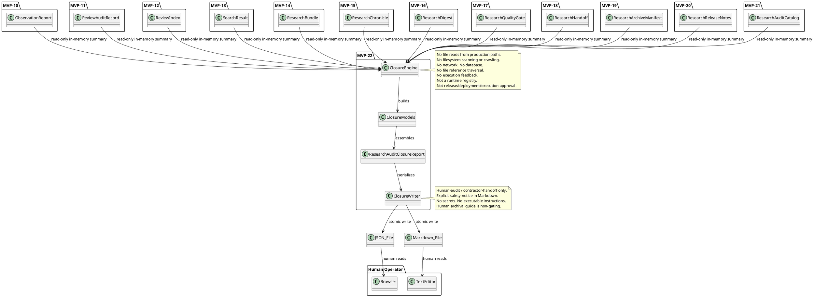
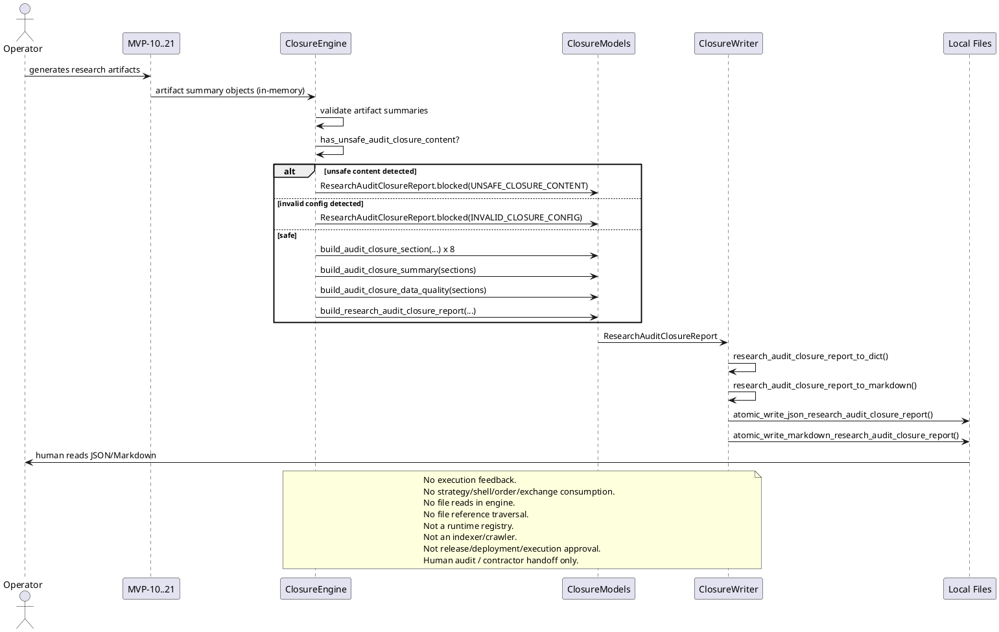

# SPEC-023-Local-Research-Audit-Closure-Report

## Background

After MVP-10 through MVP-21, the system produces twelve categories of local human-audit research artifacts:

- **MVP-10 Observation Reports:** `data/observation/latest_observation_report.json` — research-only summaries of what the system observed.
- **MVP-11 Review Audit Records:** `data/review/latest_review_audit_record.json` — operator review outcomes.
- **MVP-12 Review Index:** `data/review_index/latest_review_index.json` — catalog entries linking reports to reviews.
- **MVP-13 Review Search Results:** `data/review_search/latest_search_result.json` — query results over the review index.
- **MVP-14 Research Bundle:** `data/research_bundle/latest_research_bundle.json` — evidence-pack grouping of artifacts.
- **MVP-15 Research Chronicle:** `data/research_chronicle/latest_research_chronicle.json` — audit timeline of artifacts.
- **MVP-16 Research Digest:** `data/research_digest/latest_research_digest.json` — single-page executive summary.
- **MVP-17 Research Quality Gate:** `data/research_quality_gate/latest_research_quality_gate.json` — audit-readiness verdict.
- **MVP-18 Research Handoff Packet:** `data/research_handoff/latest_research_handoff.json` — contractor handoff packet.
- **MVP-19 Research Archive Manifest:** `data/research_archive_manifest/latest_research_archive_manifest.json` — artifact presence/staleness inventory.
- **MVP-20 Research Release Notes:** `data/research_release_notes/latest_research_release_notes.json` — audit change summary.
- **MVP-21 Research Audit Catalog:** `data/research_audit_catalog/latest_research_audit_catalog.json` — unified artifact catalog across all eleven layers.

These artifacts are **human-audit-only** — they are not trading signals, not trade approvals, not release/deployment/publish approvals, and must never be consumed by execution, strategy, Freqtrade shell, order, exchange, or any MVP execution path.

Each individual MVP answers a focused question within its own scope. However, there is no single deterministic **closure report** that a human auditor or contractor can read to answer the final archival question: **Is this research/audit cycle document-complete for human archival review, what remains open, and what safety boundaries apply?**

SPEC-023 designs a **Local Research Audit Closure Report** (MVP-22) that consumes already-loaded artifact summaries, audit catalog entries, release notes summaries, archive manifest summaries, handoff packet summaries, quality gate verdicts, and explicit local reference strings as read-only inputs and produces one deterministic closure report for human audit and contractor handoff. The closure report answers one question only: **For this research/audit cycle, is the local artifact chain document-complete for human archival review, what open findings remain, what backlog notes apply, and what safety boundaries govern the artifacts?**

The closure report does **not**, and must never, answer whether the system is ready to trade, execute, deploy, release, or strategy. It is the terminal human-audit cycle summary over already-loaded artifact summaries.

## Requirements

### Must Have (M)

- **M1:** Consume already-loaded artifact summaries, audit catalog entries, release notes summaries, archive manifest summaries, handoff packet summaries, quality gate verdicts, digest summaries, chronicle summaries, and explicit local reference strings as read-only input. The engine never reads artifact files from disk; callers pass already-loaded metadata or reference strings.
- **M2:** Produce a deterministic, immutable `AuditClosureState` enum with at least `READY`, `BLOCK`, `UNKNOWN`, and `INCOMPLETE` states.
- **M3:** Produce a deterministic, immutable `AuditClosureKind` enum identifying the closure report kind.
- **M4:** Produce a deterministic, immutable `AuditClosureSectionKind` enum with the exact section ordering: `OVERVIEW`, `CYCLE_SCOPE`, `COMPLETED_ARTIFACTS`, `OPEN_FINDINGS`, `BACKLOG_NOTES`, `SAFETY_BOUNDARIES`, `HUMAN_ARCHIVAL_GUIDE`, `APPENDIX_REFERENCES`.
- **M5:** Produce a deterministic, immutable `AuditClosureConfig` frozen dataclass with fail-closed defaults.
- **M6:** Produce a deterministic, immutable `AuditClosureSafetyFlags` frozen dataclass with all unsafe flags defaulting to `False` and all safe output flags defaulting to `True`.
- **M7:** Produce a deterministic, immutable `AuditClosureFinding` frozen dataclass representing one open finding with severity, related MVP/SPEC, description, and audit-only metadata.
- **M8:** Produce a deterministic, immutable `AuditClosureSection` frozen dataclass representing one section of the closure report.
- **M9:** Produce a deterministic, immutable `AuditClosureSummary` frozen dataclass aggregating section counts, finding counts by severity, overall closure state, and human-readable closure narrative.
- **M10:** Produce a deterministic, immutable `AuditClosureDataQuality` frozen dataclass tracking document completeness, missing artifacts, open findings, and backlog notes.
- **M11:** Produce a deterministic, immutable `ResearchAuditClosureReport` frozen dataclass holding the full closure report.
- **M12:** Sections ordered deterministically: `OVERVIEW`, `CYCLE_SCOPE`, `COMPLETED_ARTIFACTS`, `OPEN_FINDINGS`, `BACKLOG_NOTES`, `SAFETY_BOUNDARIES`, `HUMAN_ARCHIVAL_GUIDE`, `APPENDIX_REFERENCES`.
- **M13:** Findings ordered deterministically by `(severity_priority, artifact_mvp_number, insertion_order)`, where `artifact_mvp_number` is extracted from `AuditClosureFinding.related_mvp` and empty/unparseable values sort last.
- **M14:** Fail-closed: missing or invalid inputs produce a blocked or incomplete closure report with explicit reason codes, never an inferred or partial "safe" report.
- **M15:** Deterministic, priority-ordered reason codes for all blocking/incomplete conditions.
- **M16:** JSON/Markdown writer that serializes the closure report to local files with atomic writes, human-audit-only safety notice, and no secrets.
- **M17:** Default JSON output path: `data/research_audit_closure/latest_research_audit_closure_report.json`.
- **M18:** Default Markdown output path: `reports/research_audit_closure/latest_research_audit_closure_report.md`.
- **M19:** No file reads from production data paths — the closure report is built from in-memory objects only.
- **M20:** No network, database, realtime, or exchange connections.
- **M21:** No trading decisions, trade approvals, or execution logic. Closure report is human-audit-only.
- **M22:** Explicit semantics: `READY` means the closure report is document-complete for human archival review; it does **not** mean release approval, deployment approval, execution readiness, strategy readiness, or transaction permission.
- **M23:** Must not crawl, index, traverse, validate, follow, open, or execute referenced paths or metadata strings.
- **M24:** Must not emit action commands.

### Should Have (S)

- **S1:** Configurable `required_sections` tuple so callers can declare which sections must be present.
- **S2:** Configurable `block_on_unknown` flag (default `True`) to treat `UNKNOWN` closure states as blocking.
- **S3:** Summary counts per section kind and per finding severity.
- **S4:** Human-readable `closure_narrative` field explaining what the closure report covers and what remains open.
- **S5:** Each finding carries optional `related_references` tuple of local reference strings. These strings are never opened, followed, validated, or executed.
- **S6:** Each finding carries optional `spec_reference` string (e.g., `"SPEC-015"`, `"SPEC-019"`) linking the finding to its governing SPEC. These strings are advisory labels only.
- **S7:** Appendix references section lists all artifact family reference strings for contractor orientation. These strings are never opened, followed, validated, or executed.
- **S8:** Human archival guide section is advisory-only and explicitly labeled as non-gating.

### Could Have (C)

- **C1:** Configurable `include_sections` allowlist to omit non-essential sections.
- **C2:** Closure completeness badge embedded as a summary line in Markdown output.
- **C3:** CSV export of finding summaries.

### Won't Have (W)

- **W1:** Web UI, dashboard, database, HTTP API, server, auth.
- **W2:** Any feedback into execution, strategy, Freqtrade, order, exchange paths.
- **W3:** Binance, real exchange, live trading, real orders, leverage, shorting.
- **W4:** Config YAML, JSON schema, deployable Freqtrade strategy class.
- **W5:** Secrets, credentials, executable trading instructions, or operational instructions in output.
- **W6:** Reading artifact files from disk in the engine (file I/O is writer-only and explicit).
- **W7:** Any claim that `READY` means the system may trade, execute, deploy, release, or strategy.
- **W8:** Any traversal, opening, following, validation, or execution of file references or metadata strings.
- **W9:** Any automated deployment, release trigger, CI/CD hook, or action command emission.
- **W10:** Any claim that the closure report constitutes a release checklist, deployment checklist, release approval, or execution approval artifact.
- **W11:** Runtime registry, indexer, crawler, scheduler, routing layer, event store, task runner, or feedback layer behavior.

## Method

### Input Contracts

The closure report consumes summary objects or dicts from MVP-10 through MVP-21 as read-only input. Each summary object must expose at minimum:

| Field | Type | Required |
|-------|------|----------|
| `artifact_id` | `str` | Yes |
| `artifact_kind` | `str` | Yes |
| `state` | `str` | Yes |
| `source_version` | `str` | Yes |
| `generated_at` | `datetime` (ISO-8601) | Yes |
| `reason_codes` | `tuple[str, ...]` | No |
| `tags` | `tuple[str, ...]` | No |
| `title` | `str` | No |
| `spec_reference` | `str` | No |
| `local_reference` | `str` | No |
| `metadata` | `dict[str, Any]` | No |

All `local_reference` and `spec_reference` fields are opaque strings. Closure report logic never traverses, opens, follows, validates, or executes file references.

### Models

#### `AuditClosureState`

```python
class AuditClosureState(Enum):
    """Overall state of the research audit closure report."""

    READY = "ready"
    INCOMPLETE = "incomplete"
    BLOCK = "block"
    UNKNOWN = "unknown"
```

- `READY`: The closure report is document-complete for human archival review. Open findings may still exist, but they are explicitly recorded and bounded.
- `INCOMPLETE`: The artifact chain has documented gaps or missing sections, but no unsafe content was detected.
- `BLOCK`: Unsafe content, invalid input, or a safety violation was detected.
- `UNKNOWN`: The closure report could not determine its state from the provided inputs.

#### `AuditClosureKind`

```python
class AuditClosureKind(Enum):
    """Kind of closure report."""

    RESEARCH_AUDIT_CLOSURE = "research_audit_closure"
```

#### `AuditClosureSectionKind`

```python
class AuditClosureSectionKind(Enum):
    """Deterministic section ordering for the closure report."""

    OVERVIEW = "overview"
    CYCLE_SCOPE = "cycle_scope"
    COMPLETED_ARTIFACTS = "completed_artifacts"
    OPEN_FINDINGS = "open_findings"
    BACKLOG_NOTES = "backlog_notes"
    SAFETY_BOUNDARIES = "safety_boundaries"
    HUMAN_ARCHIVAL_GUIDE = "human_archival_guide"
    APPENDIX_REFERENCES = "appendix_references"
```

#### `AuditClosureFindingSeverity`

```python
class AuditClosureFindingSeverity(Enum):
    """Severity of an open finding."""

    CRITICAL = "critical"
    HIGH = "high"
    MEDIUM = "medium"
    LOW = "low"
    INFO = "info"
```

Severity ordering for deterministic sort: `CRITICAL > HIGH > MEDIUM > LOW > INFO`.

#### `AuditClosureConfig`

```python
@dataclass(frozen=True)
class AuditClosureConfig:
    """Configuration for closure report building."""

    version: str = "1.0"
    generated_at: datetime | None = None
    output_format: str = "both"
    dry_run: bool = True
    live_trading_enabled: bool = False
    real_orders_enabled: bool = False
    leverage_enabled: bool = False
    shorting_enabled: bool = False
    block_on_unknown: bool = True
    block_on_incomplete: bool = False
    required_sections: tuple[AuditClosureSectionKind, ...] = (
        AuditClosureSectionKind.OVERVIEW,
        AuditClosureSectionKind.CYCLE_SCOPE,
        AuditClosureSectionKind.COMPLETED_ARTIFACTS,
        AuditClosureSectionKind.OPEN_FINDINGS,
        AuditClosureSectionKind.BACKLOG_NOTES,
        AuditClosureSectionKind.SAFETY_BOUNDARIES,
        AuditClosureSectionKind.HUMAN_ARCHIVAL_GUIDE,
        AuditClosureSectionKind.APPENDIX_REFERENCES,
    )
    include_closure_narrative: bool = True

    def __post_init__(self) -> None:
        if not self.version:
            raise ValueError("version must be non-empty")
        if self.output_format not in ("json", "markdown", "both"):
            raise ValueError("output_format must be json, markdown, or both")
        if not self.dry_run:
            raise ValueError("dry_run must be True")
        if any((self.live_trading_enabled, self.real_orders_enabled,
                self.leverage_enabled, self.shorting_enabled)):
            raise ValueError("live trading flags must be False")
        if not all(isinstance(s, AuditClosureSectionKind) for s in self.required_sections):
            raise ValueError("required_sections must be AuditClosureSectionKind values")
```

#### `AuditClosureSafetyFlags`

```python
@dataclass(frozen=True)
class AuditClosureSafetyFlags:
    """Safety invariants for the closure report."""

    # Runtime safety flags
    dry_run: bool = True
    live_trading_enabled: bool = False
    real_orders_enabled: bool = False
    leverage_enabled: bool = False
    shorting_enabled: bool = False

    # Output safety flags
    closure_output_is_human_audit_only: bool = True
    closure_output_not_trading_signal: bool = True
    closure_output_not_trade_approval: bool = True
    closure_output_not_execution_readiness: bool = True
    closure_output_not_strategy_readiness: bool = True
    closure_output_not_release_approval: bool = True
    closure_output_not_deployment_approval: bool = True
    closure_output_not_for_execution: bool = True
    closure_output_not_for_strategy: bool = True
    closure_output_not_for_freqtrade: bool = True
    closure_output_not_for_order: bool = True
    closure_output_not_for_exchange: bool = True

    # Feedback safety flags
    closure_feedback_into_execution: bool = False
    cross_layer_feedback_into_execution: bool = False

    # Advisory flags
    file_refs_not_traversed: bool = True
    artifact_files_not_read: bool = True
    no_action_commands_emitted: bool = True
    human_archival_guide_is_non_gating: bool = True

    def __post_init__(self) -> None:
        unsafe_flags = (
            self.live_trading_enabled,
            self.real_orders_enabled,
            self.leverage_enabled,
            self.shorting_enabled,
            self.closure_feedback_into_execution,
            self.cross_layer_feedback_into_execution,
        )
        if any(unsafe_flags):
            raise ValueError("unsafe closure safety flags are enabled")
        safe_flags = (
            self.closure_output_is_human_audit_only,
            self.closure_output_not_trading_signal,
            self.closure_output_not_trade_approval,
            self.closure_output_not_execution_readiness,
            self.closure_output_not_strategy_readiness,
            self.closure_output_not_release_approval,
            self.closure_output_not_deployment_approval,
            self.closure_output_not_for_execution,
            self.closure_output_not_for_strategy,
            self.closure_output_not_for_freqtrade,
            self.closure_output_not_for_order,
            self.closure_output_not_for_exchange,
            self.file_refs_not_traversed,
            self.artifact_files_not_read,
            self.no_action_commands_emitted,
            self.human_archival_guide_is_non_gating,
        )
        if not all(safe_flags):
            raise ValueError("safe closure output flags must be True")
```

#### `AuditClosureFinding`

```python
@dataclass(frozen=True)
class AuditClosureFinding:
    """One open finding in the closure report."""

    finding_id: str = ""
    title: str = ""
    description: str = ""
    severity: str = "INFO"
    related_mvp: str = ""
    spec_reference: str = ""
    related_references: tuple[str, ...] = ()
    metadata: Mapping[str, Any] = field(default_factory=dict)

    def __post_init__(self) -> None:
        if not self.finding_id:
            raise ValueError("finding_id must be non-empty")
        if not self.title:
            raise ValueError("title must be non-empty")
        severity_upper = self.severity.upper()
        if severity_upper not in ("CRITICAL", "HIGH", "MEDIUM", "LOW", "INFO"):
            raise ValueError(f"unsupported severity: {self.severity}")
        object.__setattr__(self, "severity", severity_upper)
        _ensure_tuple_of_str(self.related_references, "related_references")
        _check_forbidden_closure_content((
            self.title, self.description, self.spec_reference,
        ), self.related_references, self.metadata)
        object.__setattr__(self, "metadata", MappingProxyType(dict(self.metadata)))
```

#### `AuditClosureSection`

```python
@dataclass(frozen=True)
class AuditClosureSection:
    """One section of the closure report."""

    section_kind: AuditClosureSectionKind
    title: str = ""
    section_notes: str = ""
    findings: tuple[AuditClosureFinding, ...] = ()
    completed_artifacts: tuple[dict[str, Any], ...] = ()
    backlog_notes: tuple[str, ...] = ()
    references: tuple[str, ...] = ()
    metadata: Mapping[str, Any] = field(default_factory=dict)

    def __post_init__(self) -> None:
        if not isinstance(self.section_kind, AuditClosureSectionKind):
            raise ValueError("section_kind must be AuditClosureSectionKind")
        if not self.title:
            raise ValueError("title must be non-empty")
        _check_forbidden_closure_content(
            (self.title, self.section_notes), (), self.metadata,
        )
        for finding in self.findings:
            if not isinstance(finding, AuditClosureFinding):
                raise ValueError("findings must contain AuditClosureFinding values")
        for ref in self.references:
            if not isinstance(ref, str) or not ref:
                raise ValueError("references must be non-empty strings")
        for note in self.backlog_notes:
            if not isinstance(note, str) or not note:
                raise ValueError("backlog_notes must be non-empty strings")
        object.__setattr__(self, "metadata", MappingProxyType(dict(self.metadata)))
```

#### `AuditClosureSummary`

```python
@dataclass(frozen=True)
class AuditClosureSummary:
    """Aggregated counts and closure narrative."""

    total_sections: int = 0
    total_findings: int = 0
    critical_count: int = 0
    high_count: int = 0
    medium_count: int = 0
    low_count: int = 0
    info_count: int = 0
    completed_artifact_count: int = 0
    open_finding_count: int = 0
    backlog_note_count: int = 0
    closure_state: str = "UNKNOWN"
    reason_code_counts: Mapping[str, int] = field(default_factory=dict)
    closure_narrative: str = ""

    def __post_init__(self) -> None:
        for field_name in (
            "total_sections", "total_findings", "critical_count",
            "high_count", "medium_count", "low_count", "info_count",
            "completed_artifact_count", "open_finding_count", "backlog_note_count",
        ):
            value = getattr(self, field_name)
            if not isinstance(value, int) or value < 0:
                raise ValueError(f"{field_name} must be a non-negative integer")
        severity_sum = (
            self.critical_count + self.high_count + self.medium_count +
            self.low_count + self.info_count
        )
        if severity_sum != self.total_findings:
            raise ValueError("severity counts must sum to total_findings")
        if self.closure_state not in ("READY", "INCOMPLETE", "BLOCK", "UNKNOWN"):
            raise ValueError("closure_state must be READY, INCOMPLETE, BLOCK, or UNKNOWN")
        _check_forbidden_closure_content((self.closure_narrative,), (), dict(self.reason_code_counts))
        object.__setattr__(self, "reason_code_counts", MappingProxyType(dict(self.reason_code_counts)))
```

#### `AuditClosureDataQuality`

```python
@dataclass(frozen=True)
class AuditClosureDataQuality:
    """Completeness and quality metrics for the closure report."""

    total_artifacts_expected: int = 12  # MVP-10 through MVP-21
    artifacts_present: int = 0
    artifacts_missing: int = 12  # fail-closed default: all expected artifacts missing
    sections_present: int = 0
    sections_missing: int = 8  # fail-closed default: all eight sections missing
    total_findings: int = 0
    unresolved_blocker_count: int = 0
    unresolved_warning_count: int = 0
    backlog_note_count: int = 0
    completeness_pct: float = 0.0
    coverage_pct: float = 0.0
    reason: str = ""

    def __post_init__(self) -> None:
        for field_name in (
            "total_artifacts_expected", "artifacts_present", "artifacts_missing",
            "sections_present", "sections_missing", "total_findings",
            "unresolved_blocker_count", "unresolved_warning_count", "backlog_note_count",
        ):
            value = getattr(self, field_name)
            if not isinstance(value, int) or value < 0:
                raise ValueError(f"{field_name} must be a non-negative integer")
        if self.artifacts_present + self.artifacts_missing != self.total_artifacts_expected:
            raise ValueError("artifacts_present + artifacts_missing must equal total_artifacts_expected")
        if self.sections_present + self.sections_missing != 8:  # total section kinds
            raise ValueError("sections_present + sections_missing must equal 8")
        for pct_field in ("completeness_pct", "coverage_pct"):
            value = getattr(self, pct_field)
            if not isinstance(value, (int, float)):
                raise ValueError(f"{pct_field} must be a number")
            if value < 0.0 or value > 100.0:
                raise ValueError(f"{pct_field} must be between 0.0 and 100.0")
        _check_forbidden_closure_content((self.reason,), (), {})
```

#### `ResearchAuditClosureReport`

```python
@dataclass(frozen=True)
class ResearchAuditClosureReport:
    """Full research audit closure report container."""

    closure_id: str
    generated_at: datetime
    version: str = "1.0"
    closure_state: AuditClosureState = field(
        default_factory=lambda: AuditClosureState.UNKNOWN
    )
    sections: tuple[AuditClosureSection, ...] = ()
    summary: AuditClosureSummary = field(default_factory=AuditClosureSummary)
    data_quality: AuditClosureDataQuality = field(
        default_factory=AuditClosureDataQuality
    )
    safety_flags: AuditClosureSafetyFlags = field(
        default_factory=AuditClosureSafetyFlags
    )
    config: AuditClosureConfig = field(default_factory=AuditClosureConfig)
    reason_codes: tuple[str, ...] = field(default_factory=lambda: (UNKNOWN_CLOSURE_STATE,))
    closure_narrative: str = ""

    def __post_init__(self) -> None:
        if not self.closure_id:
            raise ValueError("closure_id must be non-empty")
        _ensure_timezone_aware(self.generated_at, "generated_at")
        if not isinstance(self.closure_state, AuditClosureState):
            raise ValueError("closure_state must be AuditClosureState")
        for section in self.sections:
            if not isinstance(section, AuditClosureSection):
                raise ValueError("sections must contain AuditClosureSection values")
        _ensure_tuple_of_str(self.reason_codes, "reason_codes")
        for code in self.reason_codes:
            if code not in AUDIT_CLOSURE_REASON_CODES:
                raise ValueError(f"unsupported reason code: {code}")
        _check_forbidden_closure_content((self.closure_narrative,), (), {})
        if self.closure_state in (AuditClosureState.BLOCK, AuditClosureState.UNKNOWN) and not self.reason_codes:
            raise ValueError("reason_codes must be non-empty when closure_state is BLOCK or UNKNOWN")

    @classmethod
    def blocked(
        cls,
        *,
        closure_id: str = "blocked",
        generated_at: datetime | None = None,
        reason_code: str = DEFAULT_BLOCKED,
        safety_flags: AuditClosureSafetyFlags | None = None,
    ) -> "ResearchAuditClosureReport":
        """Create a deterministic fail-closed blocked closure report.

        Does not read files, traverse references, or emit action commands.
        Constructs its own valid summary and data-quality objects so that
        no model is instantiated with invalid default values.
        """
        if reason_code not in AUDIT_CLOSURE_REASON_CODES:
            raise ValueError(f"unsupported reason code: {reason_code}")
        if generated_at is None:
            generated_at = datetime.now(timezone.utc)
        if safety_flags is None:
            safety_flags = AuditClosureSafetyFlags()
        return cls(
            closure_id=closure_id,
            generated_at=generated_at,
            closure_state=AuditClosureState.BLOCK,
            sections=(),
            summary=AuditClosureSummary(
                total_sections=0,
                closure_state=AuditClosureState.BLOCK.value,
                reason_code_counts={reason_code: 1},
            ),
            data_quality=AuditClosureDataQuality(
                total_artifacts_expected=12,
                artifacts_present=0,
                artifacts_missing=12,
                sections_present=0,
                sections_missing=8,
            ),
            safety_flags=safety_flags,
            reason_codes=(reason_code,),
            closure_narrative="Closure report is blocked for audit purposes only.",
        )
```

#### Helpers

Private validation functions used by model `__post_init__` methods:

```python
def _ensure_timezone_aware(value: datetime, field_name: str) -> datetime:
    """Raise ValueError if value is a naive datetime (tzinfo is None)."""

def _ensure_tuple_of_str(
    value: Iterable[str] | tuple[str, ...], field_name: str,
) -> tuple[str, ...]:
    """Validate that value is a tuple of non-empty strings."""

def _check_forbidden_closure_content(
    text_fields: tuple[str, ...],
    string_sequences: tuple[str, ...],
    metadata: Mapping[str, Any],
) -> None:
    """Check all text fields, string sequences, and metadata keys for forbidden terms."""
```

### Reason Codes

Deterministic, priority-ordered tuple:

```python
MISSING_ARTIFACTS = "MISSING_ARTIFACTS"                          # 1
INVALID_ARTIFACT_SUMMARY = "INVALID_ARTIFACT_SUMMARY"            # 2
INVALID_CLOSURE_CONFIG = "INVALID_CLOSURE_CONFIG"                # 3
UNSAFE_CLOSURE_CONFIG = "UNSAFE_CLOSURE_CONFIG"                  # 4
MISSING_REQUIRED_SECTION = "MISSING_REQUIRED_SECTION"            # 5
EMPTY_COMPLETED_ARTIFACTS = "EMPTY_COMPLETED_ARTIFACTS"          # 6
UNRESOLVED_BLOCKERS = "UNRESOLVED_BLOCKERS"                      # 7
UNSAFE_CLOSURE_CONTENT = "UNSAFE_CLOSURE_CONTENT"                # 8
INCOMPLETE_ARTIFACT_CHAIN = "INCOMPLETE_ARTIFACT_CHAIN"          # 9
OPEN_FINDINGS_REMAIN = "OPEN_FINDINGS_REMAIN"                    # 10
BACKLOG_NOTES_REMAIN = "BACKLOG_NOTES_REMAIN"                    # 11
SECTION_BUILD_ERROR = "SECTION_BUILD_ERROR"                      # 12
SUMMARY_BUILD_ERROR = "SUMMARY_BUILD_ERROR"                      # 13
DATA_QUALITY_ERROR = "DATA_QUALITY_ERROR"                        # 14
CLOSURE_ERROR = "CLOSURE_ERROR"                                  # 15
UNKNOWN_CLOSURE_STATE = "UNKNOWN_CLOSURE_STATE"                  # 16 — safe default for unset report state
DEFAULT_BLOCKED = "DEFAULT_BLOCKED"                              # 17

AUDIT_CLOSURE_REASON_CODES: tuple[str, ...] = (
    MISSING_ARTIFACTS,
    INVALID_ARTIFACT_SUMMARY,
    INVALID_CLOSURE_CONFIG,
    UNSAFE_CLOSURE_CONFIG,
    MISSING_REQUIRED_SECTION,
    EMPTY_COMPLETED_ARTIFACTS,
    UNRESOLVED_BLOCKERS,
    UNSAFE_CLOSURE_CONTENT,
    INCOMPLETE_ARTIFACT_CHAIN,
    OPEN_FINDINGS_REMAIN,
    BACKLOG_NOTES_REMAIN,
    SECTION_BUILD_ERROR,
    SUMMARY_BUILD_ERROR,
    DATA_QUALITY_ERROR,
    CLOSURE_ERROR,
    UNKNOWN_CLOSURE_STATE,
    DEFAULT_BLOCKED,
)
```

### Forbidden Closure Content

```python
FORBIDDEN_CLOSURE_TERMS: frozenset[str] = frozenset({
    "api_key",
    "secret",
    "exchange_credentials",
    "executable_instructions",
    "operational_instructions",
    "enter_long",
    "enter_short",
    "exit_long",
    "exit_short",
    "buy_now",
    "sell_now",
    "execute_trade",
    "place_order",
    "market_order",
    "limit_order",
    "stop_loss",
    "take_profit",
    "leverage",
    "shorting",
    "binance",
    "private_key",
    "password",
    "release_approved",
    "deploy_now",
    "go_live",
    "execute_strategy",
})
```

### Engine Functions

#### `build_audit_closure_safety_flags()`

```python
def build_audit_closure_safety_flags() -> AuditClosureSafetyFlags:
    """Build default fail-closed safety flags."""
```

Returns `AuditClosureSafetyFlags()` with all unsafe flags `False` and all safe flags `True`.

#### `has_unsafe_audit_closure_content(...)`

```python
def has_unsafe_audit_closure_content(value: str | Mapping[str, Any] | Iterable[Any]) -> bool:
    """Case-insensitive recursive check for forbidden terms in closure text."""
```

Recursively checks strings, tuples, lists, dicts, and frozensets for forbidden terms.

#### `build_audit_closure_finding(...)`

```python
def build_audit_closure_finding(
    finding_id: str,
    title: str,
    severity: str,
    *,
    description: str = "",
    related_mvp: str = "",
    spec_reference: str = "",
    related_references: tuple[str, ...] = (),
    metadata: Mapping[str, Any] | None = None,
) -> AuditClosureFinding:
    """Build a single AuditClosureFinding."""
```

Validation:
- `finding_id` and `title` must be non-empty.
- `severity` normalized to uppercase; must be one of `("CRITICAL", "HIGH", "MEDIUM", "LOW", "INFO")`.
- Forbidden content check on all text fields, references, and metadata keys.
- `related_references` are opaque strings and are never traversed.

#### `build_audit_closure_section(...)`

```python
def build_audit_closure_section(
    section_kind: AuditClosureSectionKind,
    title: str,
    *,
    section_notes: str = "",
    findings: Sequence[AuditClosureFinding] = (),
    completed_artifacts: Sequence[Mapping[str, Any]] = (),
    backlog_notes: Sequence[str] = (),
    references: Sequence[str] = (),
    metadata: Mapping[str, Any] | None = None,
) -> AuditClosureSection:
    """Build a single AuditClosureSection."""
```

Validation:
- `section_kind` must be an `AuditClosureSectionKind` enum instance.
- `title` must be non-empty.
- `findings`, when provided, are ordered by `(severity_priority, artifact_mvp_number, insertion_order)` before assembly.
- Finding ordering details:
  - `severity_priority` is the integer rank of `AuditClosureFindingSeverity` (`CRITICAL=0, HIGH=1, MEDIUM=2, LOW=3, INFO=4`).
  - `artifact_mvp_number` is extracted from `related_mvp` by parsing the trailing integer (e.g., `"MVP-22"` → 22). Empty, missing, or unparseable `related_mvp` values sort last (treated as positive infinity).
  - `insertion_order` preserves the original input order for ties.
- `references` are opaque strings and are never traversed.

#### `build_audit_closure_summary(...)`

```python
def build_audit_closure_summary(
    sections: Sequence[AuditClosureSection],
    *,
    closure_state: AuditClosureState | None = None,
    reason_codes: Sequence[str] = (),
    closure_narrative: str = "",
) -> AuditClosureSummary:
    """Aggregate counts and produce closure narrative."""
```

Deterministic counting:
- `total_sections` = `len(sections)`.
- `total_findings` = sum of `len(section.findings)` across all sections.
- Severity counts aggregated from all findings.
- `completed_artifact_count` = sum of `len(section.completed_artifacts)` across `COMPLETED_ARTIFACTS` section.
- `open_finding_count` = `total_findings` from `OPEN_FINDINGS` section.
- `backlog_note_count` = sum of `len(section.backlog_notes)` across `BACKLOG_NOTES` section.
- `closure_state` defaults to `UNKNOWN` if not provided.
- `reason_code_counts` = frequency map of all reason codes.

#### `build_audit_closure_data_quality(...)`

```python
def build_audit_closure_data_quality(
    sections: Sequence[AuditClosureSection],
    *,
    expected_artifact_count: int = 12,
    reason: str = "",
) -> AuditClosureDataQuality:
    """Assess closure report completeness and quality."""
```

Quality checks:
- `total_artifacts_expected` = configurable, default 12 (MVP-10 through MVP-21).
- `artifacts_present` = count of distinct artifact kinds referenced in `COMPLETED_ARTIFACTS` section.
- `artifacts_missing` = `total_artifacts_expected - artifacts_present`.
- `sections_present` = count of distinct `AuditClosureSectionKind` values present.
- `sections_missing` = `8 - sections_present`.
- `total_findings` = sum of all findings across `OPEN_FINDINGS` section.
- `unresolved_blocker_count` = count of `CRITICAL` or `HIGH` findings.
- `unresolved_warning_count` = count of `MEDIUM` or `LOW` findings.
- `backlog_note_count` = count of backlog notes.
- `completeness_pct` = `(artifacts_present / total_artifacts_expected) * 100.0`.
- `coverage_pct` = `(sections_present / 8) * 100.0`.

#### `build_research_audit_closure_report(...)`

```python
def build_research_audit_closure_report(
    artifact_summaries: Sequence[Mapping[str, Any]],
    *,
    findings: Sequence[AuditClosureFinding] = (),
    backlog_notes: Sequence[str] = (),
    references: Sequence[str] = (),
    closure_id: str = "",
    generated_at: datetime | None = None,
    config: AuditClosureConfig | None = None,
    safety_flags: AuditClosureSafetyFlags | None = None,
) -> ResearchAuditClosureReport:
    """Build full ResearchAuditClosureReport from artifact summaries."""
```

Closure ID generation:
- If `closure_id` is empty (`""`), generate via `str(uuid.uuid4())`.
- Explicit `closure_id` must be preserved as-is for deterministic tests.
- `generated_at` defaults to `datetime.now(timezone.utc)` when `None`.

Section construction (deterministic order):
1. `OVERVIEW` — report identity, generated timestamp, closure state preview.
2. `CYCLE_SCOPE` — which MVPs/SPECs are in scope for this closure cycle.
3. `COMPLETED_ARTIFACTS` — summaries of artifacts present from MVP-10 through MVP-21.
4. `OPEN_FINDINGS` — findings provided by caller, ordered by severity priority then MVP number.
5. `BACKLOG_NOTES` — advisory notes for future cycles.
6. `SAFETY_BOUNDARIES` — explicit safety constraints and non-goals that apply to the closure report and the artifact chain.
7. `HUMAN_ARCHIVAL_GUIDE` — advisory guidance for human archival review, explicitly non-gating.
8. `APPENDIX_REFERENCES` — local reference strings for all artifact families, never traversed.

Fail-closed rules (priority order):
1. `MISSING_ARTIFACTS` — if no artifact summaries provided → `BLOCK`.
2. `INVALID_ARTIFACT_SUMMARY` — if any artifact summary fails validation → `BLOCK`.
3. `INVALID_CLOSURE_CONFIG` — if config validation fails → `BLOCK`.
4. `UNSAFE_CLOSURE_CONFIG` — if config contains unsafe values → `BLOCK`.
5. `MISSING_REQUIRED_SECTION` — if a required section kind is missing and `config.block_on_incomplete` → `INCOMPLETE`.
6. `EMPTY_COMPLETED_ARTIFACTS` — if `COMPLETED_ARTIFACTS` section has zero artifacts and `config.block_on_incomplete` → `INCOMPLETE`.
7. `UNRESOLVED_BLOCKERS` — if any `CRITICAL` or `HIGH` finding exists and `config.block_on_incomplete` → `INCOMPLETE`.
8. `UNSAFE_CLOSURE_CONTENT` — if any text/metadata contains forbidden terms → `BLOCK`.
9. `INCOMPLETE_ARTIFACT_CHAIN` — if fewer than `expected_artifact_count` artifacts are present and `config.block_on_incomplete` → `INCOMPLETE`.
10. `OPEN_FINDINGS_REMAIN` — advisory reason code recorded when open findings exist (non-blocking unless combined with blockers).
11. `BACKLOG_NOTES_REMAIN` — advisory reason code recorded when backlog notes exist (non-blocking).
12. `SECTION_BUILD_ERROR`, `SUMMARY_BUILD_ERROR`, `DATA_QUALITY_ERROR`, `CLOSURE_ERROR` — catch-all blocked reason codes.
13. `DEFAULT_BLOCKED` — default blocked reason.

Closure state resolution:
- Start with `READY`.
- If any `BLOCK` reason code exists → `BLOCK`.
- Else if `config.block_on_unknown` and `UNKNOWN` reason exists → `BLOCK`.
- Else if `config.block_on_incomplete` and any `INCOMPLETE`-triggering reason exists → `INCOMPLETE`.
- Else if any `INCOMPLETE`-triggering reason exists and `config.block_on_incomplete` is `False` → `READY` with advisory reason codes.
- Else if any `UNKNOWN` reason exists and `config.block_on_unknown` is `False` → `UNKNOWN`.

### Writer Design

#### `research_audit_closure_report_to_dict(...)`

```python
def research_audit_closure_report_to_dict(report: ResearchAuditClosureReport) -> dict:
    """Serialize ResearchAuditClosureReport to JSON-compatible dict."""
```

Serialization rules:
- `generated_at` → ISO-8601 with `Z` suffix.
- Enums → `.value` strings.
- `tuple` → `list`.
- `datetime` → ISO-8601 with `Z` suffix.
- `AuditClosureSectionKind` keys → `.value` strings.
- `metadata` → plain dict passthrough. Metadata and reference strings remain strings only and are not traversed, opened, followed, validated, or executed during serialization.
- No secrets, no executable instructions.

#### `research_audit_closure_report_to_markdown(...)`

```python
def research_audit_closure_report_to_markdown(report: ResearchAuditClosureReport) -> str:
    """Serialize ResearchAuditClosureReport to human-readable Markdown."""
```

Markdown must include:
- Title: "Local Research Audit Closure Report — Human Audit Only"
- Generated timestamp.
- Report version.
- Closure state.
- Closure narrative.
- Section summaries.
- Completed artifacts table (artifact kind, MVP, spec, state).
- Open findings table (severity, title, related MVP, spec).
- Backlog notes list.
- Safety boundaries list.
- Human archival guide (advisory-only, non-gating).
- Appendix references list.
- Data quality summary (completeness, coverage, missing artifacts/sections).
- Safety flags table.
- **Explicit safety notice:**
  > "This local research audit closure report is a human-audit / contractor-handoff artifact only. It is not a release approval, not a deployment approval, not execution readiness, not strategy readiness, not a trading signal, not trade approval, and not transaction permission. It must not be consumed by execution, strategy, Freqtrade shell, order, exchange, or any MVP execution path. Referenced artifact paths are not followed, opened, validated, or executed. The human archival guide is advisory-only and non-gating."

#### `atomic_write_json_research_audit_closure_report(...)`

```python
def atomic_write_json_research_audit_closure_report(
    report: ResearchAuditClosureReport,
    target_path: Path | None = None,
) -> Path:
    """Atomic JSON write with temp file, fsync, os.replace, cleanup."""
```

Default path: `data/research_audit_closure/latest_research_audit_closure_report.json`

#### `atomic_write_markdown_research_audit_closure_report(...)`

```python
def atomic_write_markdown_research_audit_closure_report(
    report: ResearchAuditClosureReport,
    target_path: Path | None = None,
) -> Path:
    """Atomic Markdown write with temp file, fsync, os.replace, cleanup."""
```

Default path: `reports/research_audit_closure/latest_research_audit_closure_report.md`

#### `write_research_audit_closure_report(...)`

```python
def write_research_audit_closure_report(
    report: ResearchAuditClosureReport,
    json_path: Path | None = None,
    markdown_path: Path | None = None,
) -> tuple[Path, Path]:
    """Write both JSON and Markdown closure report files."""
```

### Default Paths

```python
DEFAULT_AUDIT_CLOSURE_JSON_PATH = Path(
    "data/research_audit_closure/latest_research_audit_closure_report.json"
)
DEFAULT_AUDIT_CLOSURE_MARKDOWN_PATH = Path(
    "reports/research_audit_closure/latest_research_audit_closure_report.md"
)
```

### PlantUML Component Diagram



### PlantUML Sequence Diagram



## Implementation

### Proposed Package/File Layout

```
src/hunter/
├── research_audit_closure/
│   ├── __init__.py          # Public API exports
│   ├── models.py            # AuditClosureState, AuditClosureKind, AuditClosureSectionKind, AuditClosureConfig, AuditClosureSafetyFlags, AuditClosureFinding, AuditClosureSection, AuditClosureSummary, AuditClosureDataQuality, ResearchAuditClosureReport
│   ├── engine.py            # build_audit_closure_safety_flags, has_unsafe_audit_closure_content, build_audit_closure_finding, build_audit_closure_section, build_audit_closure_summary, build_audit_closure_data_quality, build_research_audit_closure_report
│   └── writer.py            # research_audit_closure_report_to_dict, research_audit_closure_report_to_markdown, atomic_write_json_research_audit_closure_report, atomic_write_markdown_research_audit_closure_report, write_research_audit_closure_report

tests/test_research_audit_closure/
├── __init__.py
├── test_models.py           # Model validation tests
├── test_engine.py           # Engine function tests
├── test_writer.py           # Writer function tests
└── test_integration.py      # End-to-end integration tests
```

### Safety Invariants

1. **Read-only input:** Closure report never modifies source artifact summary objects.
2. **No file reads:** Closure report is built from in-memory objects only. File references are strings. The engine never opens or parses artifact files.
3. **No file reference traversal:** `local_reference`, `spec_reference`, and `related_references` fields are opaque strings. Closure report logic never traverses, opens, follows, validates, or executes file references.
4. **No network:** No HTTP, WebSocket, or database connections.
5. **No execution feedback:** Closure report output never feeds back into MVP-4–MVP-21, Freqtrade, strategy, order, or exchange paths.
6. **No trading logic:** No decisions, no approvals, no signals. Closure report output is not a trading signal, not trade approval, not release/deployment/publish approval, not execution readiness, not strategy readiness, and not transaction permission.
7. **No secrets:** Closure report output must not contain API keys, credentials, executable trading instructions, or operational instructions.
8. **Atomic writes:** Temp file + fsync + os.replace + cleanup on failure.
9. **Human-audit only:** Markdown includes explicit safety notice.
10. **Fail-closed:** All errors produce blocked or incomplete closure report with reason code, never a falsely "safe" report.
11. **Deterministic:** Same inputs → same closure report output, every time. Sections ordered by `AuditClosureSectionKind`; findings ordered by `(severity_priority, artifact_mvp_number, insertion_order)`, with `artifact_mvp_number` extracted from `related_mvp` and empty/unparseable values sorting last.
12. **Not a runtime registry:** The closure report is a static point-in-time snapshot. No registration, subscription, polling, or state tracking between builds.
13. **Not an indexer/crawler:** No filesystem scanning, directory walking, or glob-based discovery. Artifact summaries are passed in explicitly.
14. **No repair of bad inputs:** Missing/invalid/unsafe artifact summary inputs must be summarized as blocked/incomplete in data quality, not repaired, inferred, upgraded, or normalized into safe-looking records.
15. **No action triggers:** Fail-closed closure records may be generated for audit purposes only and must never trigger any action.
16. **No release/deployment/execution semantics:** `READY` means document-complete for human archival review only. It does not mean the system may release, deploy, execute, trade, or strategy.

## Milestones

### MVP-22 Step 1 — Closure Report Models and Engine

- Create `src/hunter/research_audit_closure/__init__.py` with public API exports.
- Create `src/hunter/research_audit_closure/models.py` with:
  - `AuditClosureState`, `AuditClosureKind`, `AuditClosureSectionKind`, `AuditClosureFindingSeverity` enums.
  - `AuditClosureConfig`, `AuditClosureSafetyFlags`, `AuditClosureFinding`, `AuditClosureSection`, `AuditClosureSummary`, `AuditClosureDataQuality`, `ResearchAuditClosureReport` frozen dataclasses.
  - `AUDIT_CLOSURE_REASON_CODES` tuple.
  - `FORBIDDEN_CLOSURE_TERMS` frozenset.
  - `__post_init__` validation on all models.
- Create `src/hunter/research_audit_closure/engine.py` with:
  - `build_audit_closure_safety_flags(...)`
  - `has_unsafe_audit_closure_content(...)`
  - `build_audit_closure_finding(...)`
  - `build_audit_closure_section(...)`
  - `build_audit_closure_summary(...)`
  - `build_audit_closure_data_quality(...)`
  - `build_research_audit_closure_report(...)`
- Create `tests/test_research_audit_closure/__init__.py`.
- Create `tests/test_research_audit_closure/test_models.py` with model validation tests.
- Create `tests/test_research_audit_closure/test_engine.py` with engine function tests.
- Target: ~80 tests.

### MVP-22 Step 2 — Closure Report Writer

- Create `src/hunter/research_audit_closure/writer.py` with:
  - `research_audit_closure_report_to_dict(...)`
  - `research_audit_closure_report_to_markdown(...)`
  - `atomic_write_json_research_audit_closure_report(...)`
  - `atomic_write_markdown_research_audit_closure_report(...)`
  - `write_research_audit_closure_report(...)`
  - `DEFAULT_AUDIT_CLOSURE_JSON_PATH`
  - `DEFAULT_AUDIT_CLOSURE_MARKDOWN_PATH`
- Update `src/hunter/research_audit_closure/__init__.py` with writer exports.
- Create `tests/test_research_audit_closure/test_writer.py` with writer tests.
- Target: ~40 tests.

### MVP-22 Step 3 — Integration Tests

- Create `tests/test_research_audit_closure/test_integration.py` with:
  - Happy path: twelve artifact summaries → eight sections → closure report → JSON/Markdown → verify.
  - Missing artifacts → blocked closure report.
  - Invalid artifact summary → blocked closure report.
  - Unsafe content → blocked closure report.
  - Incomplete artifact chain → incomplete closure report.
  - Open blocker findings → incomplete closure report when `block_on_incomplete=True`.
  - Missing required section → incomplete closure report when `block_on_incomplete=True`.
  - Safety assertions: no file reads, no network, no execution feedback, no file reference traversal, no runtime registry, no indexer/crawler.
- Target: ~40 tests.

### MVP-22 Step 4 — Final Review

- Review checklist:
  - SPEC-023 coverage verification.
  - Models review (validation, immutability, fail-closed factories).
  - Engine review (fail-closed rules, deterministic reason codes, no file reads, no network, no file traversal).
  - Writer review (atomic writes, safety notice, no secrets).
  - Test review (all tests pass, coverage adequate).
  - Safety review (all constraints verified).
- Run: `pytest -q --import-mode=importlib`, `git status`, `git log --oneline --max-count=15`.
- Verdict: PASS / PASS WITH NOTES / FAIL.
- If PASS: memory update + version bump to 0.22.0-dev.

## Gathering Results

### Test Plan

| Test Category | Target Count | Coverage |
|---------------|-------------|----------|
| Model validation | 55 | All fields, boundaries, fail-closed factories, immutability, all section/finding kinds |
| Engine functions | 70 | All 7 engine functions, fail-closed rules, reason codes, unsafe content, severity/MVP ordering |
| Writer functions | 40 | Dict serialization, Markdown content, atomic writes, safety notice |
| Integration | 40 | End-to-end flows, error paths, multi-layer coverage, safety assertions |
| **Total** | **~205** | |

### Expected Full Suite Count

Current: ~4110 tests (MVP-0 through MVP-21).
Expected after MVP-22: ~4315 tests.

### Output Artifacts

- `data/research_audit_closure/latest_research_audit_closure_report.json` — machine-readable closure report.
- `reports/research_audit_closure/latest_research_audit_closure_report.md` — human-readable closure report with safety notice.

## Need Professional Help in Developing Your Architecture?

Please contact me at [sammuti.com](https://sammuti.com) :)

---

**Document metadata:**
- **Version:** 1.0-draft
- **Date:** 2026-06-29
- **Author:** WrongStack
- **Status:** Draft — awaiting human review before implementation.
- **Next step:** Human approval → MVP-22 Step 1 implementation.