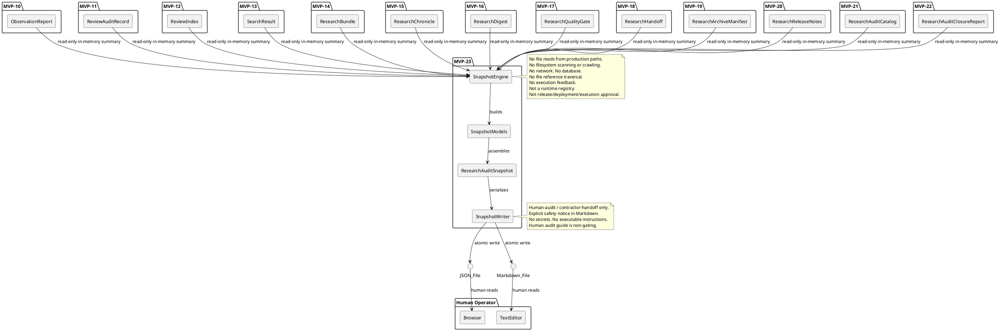
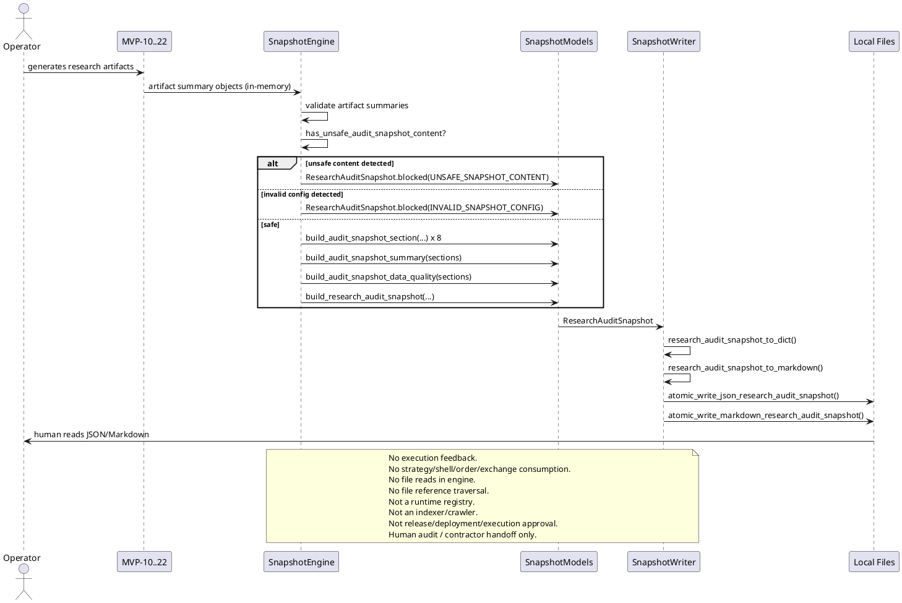

# SPEC-024-Local-Research-Audit-Snapshot

## Background

After MVP-10 through MVP-22, the system produces thirteen categories of local human-audit research artifacts:

- **MVP-10 Observation Reports:** `data/observation/latest_observation_report.json` — research-only summaries of what the system observed.
- **MVP-11 Review Audit Records:** `data/review/latest_review_audit_record.json` — operator review outcomes.
- **MVP-12 Review Index:** `data/review_index/latest_review_index.json` — catalog entries linking reports to reviews.
- **MVP-13 Review Search Results:** `data/review_search/latest_search_result.json` — query results over the review index.
- **MVP-14 Research Bundle:** `data/research_bundle/latest_research_bundle.json` — evidence-pack grouping of artifacts.
- **MVP-15 Research Chronicle:** `data/research_chronicle/latest_research_chronicle.json` — audit timeline of artifacts.
- **MVP-16 Research Digest:** `data/research_digest/latest_research_digest.json` — single-page executive summary.
- **MVP-17 Research Quality Gate:** `data/research_quality_gate/latest_research_quality_gate.json` — audit-readiness verdict.
- **MVP-18 Research Handoff Packet:** `data/research_handoff/latest_research_handoff.json` — contractor handoff packet.
- **MVP-19 Research Archive Manifest:** `data/research_archive_manifest/latest_research_archive_manifest.json` — artifact presence/staleness inventory.
- **MVP-20 Research Release Notes:** `data/research_release_notes/latest_research_release_notes.json` — audit change summary.
- **MVP-21 Research Audit Catalog:** `data/research_audit_catalog/latest_research_audit_catalog.json` — unified artifact catalog across all prior layers.
- **MVP-22 Research Audit Closure Report:** `data/research_audit_closure/latest_research_audit_closure_report.json` — terminal archival cycle summary.

These artifacts are **human-audit-only** — they are not trading signals, not trade approvals, not release/deployment/publish approvals, and must never be consumed by execution, strategy, Freqtrade shell, order, exchange, or any MVP execution path.

Each individual MVP answers a focused question within its own scope. However, there is no single deterministic **point-in-time snapshot** that a human auditor or contractor can read to answer the operational question: **What is the current research/audit state right now, which artifacts are present and current, what is stale or open, and what safety boundaries apply?**

SPEC-024 designs a **Local Research Audit Snapshot** (MVP-23) that consumes already-loaded artifact summaries, closure report summary, audit catalog entries, release notes summaries, archive manifest summaries, handoff packet summaries, quality gate verdicts, and explicit local reference strings as read-only inputs and produces one deterministic snapshot for human audit and contractor handoff. The snapshot answers one question only: **At this point in time, what is the local research/audit state over the already-loaded artifact summaries, what is current or stale, what remains open, and what safety boundaries govern the artifacts?**

The audit snapshot does **not**, and must never, answer whether the system is ready to trade, execute, deploy, release, or strategy. It is a static point-in-time human-audit state summary over already-loaded artifact summaries.

## Requirements

### Must Have (M)

- **M1:** Consume already-loaded artifact summaries, closure report summary, audit catalog entries, release notes summaries, archive manifest summaries, handoff packet summaries, quality gate verdicts, digest summaries, chronicle summaries, and explicit local reference strings as read-only input. The engine never reads artifact files from disk; callers pass already-loaded metadata or reference strings.
- **M2:** Produce a deterministic, immutable `AuditSnapshotState` enum with at least `CURRENT`, `STALE`, `INCOMPLETE`, `BLOCK`, and `UNKNOWN` states.
- **M3:** Produce a deterministic, immutable `AuditSnapshotKind` enum identifying the audit snapshot kind.
- **M4:** Produce a deterministic, immutable `AuditSnapshotSectionKind` enum with the exact section ordering: `OVERVIEW`, `VERSION_STATE`, `ARTIFACT_STATE`, `QUALITY_STATE`, `OPEN_ITEMS`, `SAFETY_BOUNDARIES`, `HUMAN_AUDIT_GUIDE`, `APPENDIX_REFERENCES`.
- **M5:** Produce a deterministic, immutable `AuditSnapshotConfig` frozen dataclass with fail-closed defaults.
- **M6:** Produce a deterministic, immutable `AuditSnapshotSafetyFlags` frozen dataclass with all unsafe flags defaulting to `False` and all safe output flags defaulting to `True`.
- **M7:** Produce a deterministic, immutable `AuditSnapshotItem` frozen dataclass representing one artifact state entry with artifact kind, related MVP/SPEC, state, timestamp, severity, and audit-only metadata.
- **M8:** Produce a deterministic, immutable `AuditSnapshotSection` frozen dataclass representing one section of the audit snapshot.
- **M9:** Produce a deterministic, immutable `AuditSnapshotSummary` frozen dataclass aggregating section counts, item counts by severity, overall snapshot state, freshness window, and human-readable snapshot narrative.
- **M10:** Produce a deterministic, immutable `AuditSnapshotDataQuality` frozen dataclass tracking artifact presence, staleness, missing artifacts, open items, and version alignment.
- **M11:** Produce a deterministic, immutable `ResearchAuditSnapshot` frozen dataclass holding the full audit snapshot.
- **M12:** Sections ordered deterministically: `OVERVIEW`, `VERSION_STATE`, `ARTIFACT_STATE`, `QUALITY_STATE`, `OPEN_ITEMS`, `SAFETY_BOUNDARIES`, `HUMAN_AUDIT_GUIDE`, `APPENDIX_REFERENCES`.
- **M13:** Items ordered deterministically by `(severity_priority, artifact_mvp_number, insertion_order)`, where `artifact_mvp_number` is extracted from `AuditSnapshotItem.related_mvp` and empty/unparseable values sort last.
- **M14:** Fail-closed: missing or invalid inputs produce a blocked or incomplete audit snapshot with explicit reason codes, never an inferred or partial "safe" snapshot.
- **M15:** Deterministic, priority-ordered reason codes for all blocking/incomplete/stale conditions.
- **M16:** JSON/Markdown writer that serializes the audit snapshot to local files with atomic writes, human-audit-only safety notice, and no secrets.
- **M17:** Default JSON output path: `data/research_audit_snapshot/latest_research_audit_snapshot.json`.
- **M18:** Default Markdown output path: `reports/research_audit_snapshot/latest_research_audit_snapshot.md`.
- **M19:** No file reads from production data paths — the audit snapshot is built from in-memory objects only.
- **M20:** No network, database, realtime, or exchange connections.
- **M21:** No trading decisions, trade approvals, or execution logic. Audit snapshot is human-audit-only.
- **M22:** Explicit semantics: `CURRENT` means the audit snapshot reflects current artifact state within the configured freshness window; it does **not** mean release approval, deployment approval, execution readiness, strategy readiness, or transaction permission.
- **M23:** Must not crawl, index, traverse, validate, follow, open, or execute referenced paths or metadata strings.
- **M24:** Must not emit action commands.
- **M25:** Include a `VERSION_STATE` section that captures project version, snapshot version, source MVP/SPEC lineage, and generation timestamp.

### Should Have (S)

- **S1:** Configurable `required_sections` tuple so callers can declare which sections must be present.
- **S2:** Configurable `block_on_unknown` flag (default `True`) to treat `UNKNOWN` snapshot states as blocking.
- **S3:** Configurable `freshness_threshold_seconds` (default 86400) to flag artifact summaries older than the threshold as `STALE`.
- **S4:** Summary counts per section kind and per item severity.
- **S5:** Human-readable `snapshot_narrative` field explaining what the snapshot covers, when it was taken, and what remains open or stale.
- **S6:** Each item carries optional `related_references` tuple of local reference strings. These strings are never opened, followed, validated, or executed.
- **S7:** Each item carries optional `spec_reference` string (e.g., `"SPEC-015"`, `"SPEC-019"`) linking the item to its governing SPEC. These strings are advisory labels only.
- **S8:** Appendix references section lists all artifact family reference strings for contractor orientation. These strings are never opened, followed, validated, or executed.
- **S9:** Human audit guide section is advisory-only and explicitly labeled as non-gating.
- **S10:** `QUALITY_STATE` section includes data-quality metrics and a short quality narrative.

### Could Have (C)

- **C1:** Configurable `include_sections` allowlist to omit non-essential sections.
- **C2:** Snapshot freshness badge embedded as a summary line in Markdown output.
- **C3:** CSV export of item summaries.
- **C4:** Diff-style notation showing which artifact summaries changed since a previous snapshot, if a previous snapshot is provided as read-only input.

### Won't Have (W)

- **W1:** Web UI, dashboard, database, HTTP API, server, auth.
- **W2:** Any feedback into execution, strategy, Freqtrade, order, exchange paths.
- **W3:** Binance, real exchange, live trading, real orders, leverage, shorting.
- **W4:** Config YAML, JSON schema, deployable Freqtrade strategy class.
- **W5:** Secrets, credentials, executable trading instructions, or operational instructions in output.
- **W6:** Reading artifact files from disk in the engine (file I/O is writer-only and explicit).
- **W7:** Any claim that `CURRENT` means the system may trade, execute, deploy, release, or strategy.
- **W8:** Any traversal, opening, following, validation, or execution of file references or metadata strings.
- **W9:** Any automated deployment, release trigger, CI/CD hook, or action command emission.
- **W10:** Any claim that the audit snapshot constitutes a release checklist, deployment checklist, release approval, or execution approval artifact.
- **W11:** Runtime registry, indexer, crawler, scheduler, routing layer, event store, task runner, or feedback layer behavior.

## Method

### Input Contracts

The audit snapshot consumes summary objects or dicts from MVP-10 through MVP-22 as read-only input. Each summary object must expose at minimum:

| Field | Type | Required |
|-------|------|----------|
| `artifact_id` | `str` | Yes |
| `artifact_kind` | `str` | Yes |
| `state` | `str` | Yes |
| `source_version` | `str` | Yes |
| `generated_at` | `datetime` (ISO-8601) | Yes |
| `reason_codes` | `tuple[str, ...]` | No |
| `tags` | `tuple[str, ...]` | No |
| `title` | `str` | No |
| `spec_reference` | `str` | No |
| `local_reference` | `str` | No |
| `metadata` | `dict[str, Any]` | No |

All `local_reference` and `spec_reference` fields are opaque strings. Audit snapshot logic never traverses, opens, follows, validates, or executes file references.

### Models

#### `AuditSnapshotState`

```python
class AuditSnapshotState(Enum):
    """Overall state of the research audit snapshot."""

    CURRENT = "current"
    STALE = "stale"
    INCOMPLETE = "incomplete"
    BLOCK = "block"
    UNKNOWN = "unknown"
```

- `CURRENT`: The audit snapshot reflects current artifact state within the configured freshness window. Open items may still exist, but they are explicitly recorded and bounded.
- `STALE`: One or more artifact summaries exceed the configured freshness threshold, but no unsafe content was detected and the chain is otherwise complete.
- `INCOMPLETE`: The artifact chain has documented gaps or missing sections, but no unsafe content was detected.
- `BLOCK`: Unsafe content, invalid input, or a safety violation was detected.
- `UNKNOWN`: The audit snapshot could not determine its state from the provided inputs.

#### `AuditSnapshotKind`

```python
class AuditSnapshotKind(Enum):
    """Kind of audit snapshot."""

    RESEARCH_AUDIT_SNAPSHOT = "research_audit_snapshot"
```

#### `AuditSnapshotSectionKind`

```python
class AuditSnapshotSectionKind(Enum):
    """Deterministic section ordering for the audit snapshot."""

    OVERVIEW = "overview"
    VERSION_STATE = "version_state"
    ARTIFACT_STATE = "artifact_state"
    QUALITY_STATE = "quality_state"
    OPEN_ITEMS = "open_items"
    SAFETY_BOUNDARIES = "safety_boundaries"
    HUMAN_AUDIT_GUIDE = "human_audit_guide"
    APPENDIX_REFERENCES = "appendix_references"
```

#### `AuditSnapshotItemSeverity`

```python
class AuditSnapshotItemSeverity(Enum):
    """Severity of an artifact state item or open item."""

    CRITICAL = "critical"
    HIGH = "high"
    MEDIUM = "medium"
    LOW = "low"
    INFO = "info"
```

Severity ordering for deterministic sort: `CRITICAL > HIGH > MEDIUM > LOW > INFO`.

### Reason Code Constants

```python
UNSAFE_SNAPSHOT_CONTENT = "UNSAFE_SNAPSHOT_CONTENT"
INVALID_SNAPSHOT_CONFIG = "INVALID_SNAPSHOT_CONFIG"
MISSING_REQUIRED_SECTION = "MISSING_REQUIRED_SECTION"
MISSING_ARTIFACT_SUMMARIES = "MISSING_ARTIFACT_SUMMARIES"
BLOCKED_ARTIFACT_ITEM = "BLOCKED_ARTIFACT_ITEM"
STALE_ARTIFACT_DETECTED = "STALE_ARTIFACT_DETECTED"
OPEN_ITEMS_PRESENT = "OPEN_ITEMS_PRESENT"
INCOMPLETE_ARTIFACT_ITEM = "INCOMPLETE_ARTIFACT_ITEM"
UNKNOWN_SNAPSHOT_STATE = "UNKNOWN_SNAPSHOT_STATE"
FILE_REFS_NOT_TRAVERSED = "FILE_REFS_NOT_TRAVERSED"
ARTIFACT_FILES_NOT_READ = "ARTIFACT_FILES_NOT_READ"
NO_ACTION_COMMANDS_EMITTED = "NO_ACTION_COMMANDS_EMITTED"
HUMAN_AUDIT_GUIDE_NON_GATING = "HUMAN_AUDIT_GUIDE_NON_GATING"

AUDIT_SNAPSHOT_REASON_CODES: tuple[str, ...] = (
    UNSAFE_SNAPSHOT_CONTENT,
    INVALID_SNAPSHOT_CONFIG,
    MISSING_REQUIRED_SECTION,
    MISSING_ARTIFACT_SUMMARIES,
    BLOCKED_ARTIFACT_ITEM,
    STALE_ARTIFACT_DETECTED,
    OPEN_ITEMS_PRESENT,
    INCOMPLETE_ARTIFACT_ITEM,
    UNKNOWN_SNAPSHOT_STATE,
    FILE_REFS_NOT_TRAVERSED,
    ARTIFACT_FILES_NOT_READ,
    NO_ACTION_COMMANDS_EMITTED,
    HUMAN_AUDIT_GUIDE_NON_GATING,
)

# Reason codes that always produce BLOCK state.
AUDIT_SNAPSHOT_BLOCKING_REASON_CODES: tuple[str, ...] = (
    UNSAFE_SNAPSHOT_CONTENT,
    INVALID_SNAPSHOT_CONFIG,
    MISSING_REQUIRED_SECTION,
    MISSING_ARTIFACT_SUMMARIES,
    BLOCKED_ARTIFACT_ITEM,
)

# Reason codes that produce INCOMPLETE state unless block_on_incomplete=True.
AUDIT_SNAPSHOT_INCOMPLETE_REASON_CODES: tuple[str, ...] = (
    OPEN_ITEMS_PRESENT,
    INCOMPLETE_ARTIFACT_ITEM,
)

# Reason code that produces STALE state unless block_on_stale=True.
AUDIT_SNAPSHOT_STALE_REASON_CODES: tuple[str, ...] = (
    STALE_ARTIFACT_DETECTED,
)

# Advisory-only reason codes that do not affect snapshot state.
AUDIT_SNAPSHOT_ADVISORY_REASON_CODES: tuple[str, ...] = (
    FILE_REFS_NOT_TRAVERSED,
    ARTIFACT_FILES_NOT_READ,
    NO_ACTION_COMMANDS_EMITTED,
    HUMAN_AUDIT_GUIDE_NON_GATING,
)
```

### Forbidden Terms and Private Helpers

```python
FORBIDDEN_SNAPSHOT_TERMS: frozenset[str] = frozenset({
    # Credential / secret terms
    "api_key",
    "apikey",
    "secret",
    "exchange_credentials",
    "executable_instructions",
    "operational_instructions",
    "private_key",
    "password",
    "token",
    "auth",
    # Trading execution terms
    "enter_long",
    "enter_short",
    "exit_long",
    "exit_short",
    "buy_now",
    "sell_now",
    "execute_trade",
    "place_order",
    "market_order",
    "limit_order",
    "stop_loss",
    "take_profit",
    "order",
    "position",
    "leverage",
    "shorting",
    "margin",
    "liquidation",
    "live_trade",
    "real_order",
    "position_size",
    # Exchange / runtime terms
    "binance",
    # Release/deployment/execution readiness terms
    "go_live",
    "production_ready",
    "execution_ready",
    "strategy_ready",
    "deployment_ready",
    "release_ready",
    "launch_live",
    "release_approved",
    "deploy_now",
    # Approval terms
    "release_approval",
    "deployment_approval",
    "execution_approval",
    "strategy_approval",
    "trade_approval",
    "transaction_permission",
    # Action-command keywords
    "deploy",
    "execute",
    "run",
    "start",
    "stop",
    "trigger",
    "submit",
    # Runtime infrastructure terms
    "register_service",
    "discover_artifacts",
    "index_files",
    "crawl_directory",
    "runtime_registry",
    "task_runner",
    "event_store",
    "routing_layer",
    "web_ui",
    "dashboard",
    "database_persistence",
})


def _ensure_tuple_of_str(
    value: Iterable[str] | tuple[str, ...] | list[str] | None,
    field_name: str,
) -> tuple[str, ...]:
    """Validate that value is a tuple or list of non-empty strings."""
    if value is None:
        return ()
    if isinstance(value, (tuple, list)):
        for item in value:
            if not isinstance(item, str) or not item:
                raise ValueError(f"{field_name} must contain non-empty strings")
        return tuple(value)
    raise ValueError(f"{field_name} must be a tuple or list of strings")


def _has_forbidden_snapshot_term(value: str) -> bool:
    """Case-insensitive check for forbidden terms in a single string."""
    if not isinstance(value, str):
        return False
    lower = value.lower()
    return any(term in lower for term in FORBIDDEN_SNAPSHOT_TERMS)


def _check_forbidden_snapshot_content(
    text_fields: tuple[str, ...],
    string_sequences: tuple[str, ...],
    metadata: Mapping[str, Any],
) -> None:
    """Raise ValueError('UNSAFE_SNAPSHOT_CONTENT') if forbidden terms found."""
    for text in text_fields:
        if _has_forbidden_snapshot_term(text):
            raise ValueError("UNSAFE_SNAPSHOT_CONTENT")
    for seq in string_sequences:
        if _has_forbidden_snapshot_term(seq):
            raise ValueError("UNSAFE_SNAPSHOT_CONTENT")
    for key, value in metadata.items():
        if isinstance(key, str) and _has_forbidden_snapshot_term(key):
            raise ValueError("UNSAFE_SNAPSHOT_CONTENT")
        if isinstance(value, str) and _has_forbidden_snapshot_term(value):
            raise ValueError("UNSAFE_SNAPSHOT_CONTENT")
        if isinstance(value, (tuple, list)):
            for item in value:
                if isinstance(item, str) and _has_forbidden_snapshot_term(item):
                    raise ValueError("UNSAFE_SNAPSHOT_CONTENT")
        if isinstance(value, Mapping):
            _check_forbidden_snapshot_content((), (), value)
```

#### `AuditSnapshotConfig`

```python
@dataclass(frozen=True)
class AuditSnapshotConfig:
    """Configuration for audit snapshot building."""

    version: str = "1.0"
    generated_at: datetime | None = None
    output_format: str = "both"
    dry_run: bool = True
    live_trading_enabled: bool = False
    real_orders_enabled: bool = False
    leverage_enabled: bool = False
    shorting_enabled: bool = False
    block_on_unknown: bool = True
    block_on_incomplete: bool = False
    block_on_stale: bool = False
    freshness_threshold_seconds: int = 86400
    required_sections: tuple[AuditSnapshotSectionKind, ...] = (
        AuditSnapshotSectionKind.OVERVIEW,
        AuditSnapshotSectionKind.VERSION_STATE,
        AuditSnapshotSectionKind.ARTIFACT_STATE,
        AuditSnapshotSectionKind.QUALITY_STATE,
        AuditSnapshotSectionKind.OPEN_ITEMS,
        AuditSnapshotSectionKind.SAFETY_BOUNDARIES,
        AuditSnapshotSectionKind.HUMAN_AUDIT_GUIDE,
        AuditSnapshotSectionKind.APPENDIX_REFERENCES,
    )
    include_snapshot_narrative: bool = True

    def __post_init__(self) -> None:
        if not self.version:
            raise ValueError("version must be non-empty")
        if self.output_format not in ("json", "markdown", "both"):
            raise ValueError("output_format must be json, markdown, or both")
        if not self.dry_run:
            raise ValueError("dry_run must be True")
        if any((self.live_trading_enabled, self.real_orders_enabled,
                self.leverage_enabled, self.shorting_enabled)):
            raise ValueError("live trading flags must be False")
        if self.freshness_threshold_seconds < 0:
            raise ValueError("freshness_threshold_seconds must be non-negative")
        if not all(isinstance(s, AuditSnapshotSectionKind) for s in self.required_sections):
            raise ValueError("required_sections must be AuditSnapshotSectionKind values")
```

#### `AuditSnapshotSafetyFlags`

```python
@dataclass(frozen=True)
class AuditSnapshotSafetyFlags:
    """Safety invariants for the audit snapshot."""

    # Runtime safety flags
    dry_run: bool = True
    live_trading_enabled: bool = False
    real_orders_enabled: bool = False
    leverage_enabled: bool = False
    shorting_enabled: bool = False

    # Output safety flags
    snapshot_output_is_human_audit_only: bool = True
    snapshot_output_not_trading_signal: bool = True
    snapshot_output_not_trade_approval: bool = True
    snapshot_output_not_execution_readiness: bool = True
    snapshot_output_not_strategy_readiness: bool = True
    snapshot_output_not_release_approval: bool = True
    snapshot_output_not_deployment_approval: bool = True
    snapshot_output_not_for_execution: bool = True
    snapshot_output_not_for_strategy: bool = True
    snapshot_output_not_for_freqtrade: bool = True
    snapshot_output_not_for_order: bool = True
    snapshot_output_not_for_exchange: bool = True
    snapshot_output_not_transaction_permission: bool = True

    # Feedback safety flags
    snapshot_feedback_into_execution: bool = False
    cross_layer_feedback_into_execution: bool = False

    # Advisory flags
    file_refs_not_traversed: bool = True
    artifact_files_not_read: bool = True
    no_action_commands_emitted: bool = True
    human_audit_guide_is_non_gating: bool = True

    def __post_init__(self) -> None:
        unsafe_flags = (
            self.live_trading_enabled,
            self.real_orders_enabled,
            self.leverage_enabled,
            self.shorting_enabled,
            self.snapshot_feedback_into_execution,
            self.cross_layer_feedback_into_execution,
        )
        if any(unsafe_flags):
            raise ValueError("unsafe audit snapshot safety flags are enabled")
        safe_flags = (
            self.snapshot_output_is_human_audit_only,
            self.snapshot_output_not_trading_signal,
            self.snapshot_output_not_trade_approval,
            self.snapshot_output_not_execution_readiness,
            self.snapshot_output_not_strategy_readiness,
            self.snapshot_output_not_release_approval,
            self.snapshot_output_not_deployment_approval,
            self.snapshot_output_not_for_execution,
            self.snapshot_output_not_for_strategy,
            self.snapshot_output_not_for_freqtrade,
            self.snapshot_output_not_for_order,
            self.snapshot_output_not_for_exchange,
            self.snapshot_output_not_transaction_permission,
            self.file_refs_not_traversed,
            self.artifact_files_not_read,
            self.no_action_commands_emitted,
            self.human_audit_guide_is_non_gating,
        )
        if not all(safe_flags):
            raise ValueError("safe audit snapshot output flags must be True")
```

#### `AuditSnapshotItem`

```python
@dataclass(frozen=True)
class AuditSnapshotItem:
    """One artifact state entry in the audit snapshot."""

    item_id: str = ""
    title: str = ""
    artifact_kind: str = ""
    related_mvp: str = ""
    spec_reference: str = ""
    state: str = "unknown"
    local_reference: str = ""
    generated_at: datetime | None = None
    severity: str = "INFO"
    reason_codes: tuple[str, ...] = ()
    tags: tuple[str, ...] = ()
    related_references: tuple[str, ...] = ()
    metadata: Mapping[str, Any] = field(default_factory=dict)

    def __post_init__(self) -> None:
        if not self.item_id:
            raise ValueError("item_id must be non-empty")
        if not self.title:
            raise ValueError("title must be non-empty")
        if not self.artifact_kind:
            raise ValueError("artifact_kind must be non-empty")
        severity_upper = self.severity.upper()
        if severity_upper not in ("CRITICAL", "HIGH", "MEDIUM", "LOW", "INFO"):
            raise ValueError(f"unsupported severity: {self.severity}")
        object.__setattr__(self, "severity", severity_upper)
        _ensure_tuple_of_str(self.reason_codes, "reason_codes")
        _ensure_tuple_of_str(self.tags, "tags")
        _ensure_tuple_of_str(self.related_references, "related_references")
        _check_forbidden_snapshot_content((
            self.title, self.artifact_kind, self.state, self.spec_reference,
        ), self.related_references, self.metadata)
        object.__setattr__(self, "metadata", MappingProxyType(dict(self.metadata)))
```

#### `AuditSnapshotSection`

```python
@dataclass(frozen=True)
class AuditSnapshotSection:
    """One section of the audit snapshot."""

    section_kind: AuditSnapshotSectionKind
    title: str = ""
    section_notes: str = ""
    items: tuple[AuditSnapshotItem, ...] = ()
    references: tuple[str, ...] = ()
    metadata: Mapping[str, Any] = field(default_factory=dict)

    def __post_init__(self) -> None:
        if not isinstance(self.section_kind, AuditSnapshotSectionKind):
            raise ValueError("section_kind must be AuditSnapshotSectionKind")
        if not self.title:
            raise ValueError("title must be non-empty")
        _check_forbidden_snapshot_content(
            (self.title, self.section_notes), (), self.metadata,
        )
        for item in self.items:
            if not isinstance(item, AuditSnapshotItem):
                raise ValueError("items must contain AuditSnapshotItem values")
        for ref in self.references:
            if not isinstance(ref, str) or not ref:
                raise ValueError("references must be non-empty strings")
        object.__setattr__(self, "metadata", MappingProxyType(dict(self.metadata)))
```

#### `AuditSnapshotSummary`

```python
@dataclass(frozen=True)
class AuditSnapshotSummary:
    """Aggregated counts and snapshot narrative."""

    total_sections: int = 0
    total_items: int = 0
    critical_count: int = 0
    high_count: int = 0
    medium_count: int = 0
    low_count: int = 0
    info_count: int = 0
    current_item_count: int = 0
    stale_item_count: int = 0
    incomplete_item_count: int = 0
    blocked_item_count: int = 0
    open_item_count: int = 0
    snapshot_state: str = "UNKNOWN"
    reason_code_counts: Mapping[str, int] = field(default_factory=dict)
    snapshot_narrative: str = ""
    freshness_threshold_seconds: int = 86400

    def __post_init__(self) -> None:
        for field_name in (
            "total_sections", "total_items", "critical_count",
            "high_count", "medium_count", "low_count", "info_count",
            "current_item_count", "stale_item_count", "incomplete_item_count",
            "blocked_item_count", "open_item_count", "freshness_threshold_seconds",
        ):
            value = getattr(self, field_name)
            if not isinstance(value, int) or value < 0:
                raise ValueError(f"{field_name} must be a non-negative integer")
        severity_sum = (
            self.critical_count + self.high_count + self.medium_count +
            self.low_count + self.info_count
        )
        if severity_sum != self.total_items:
            raise ValueError("severity counts must sum to total_items")
        if self.snapshot_state not in ("CURRENT", "STALE", "INCOMPLETE", "BLOCK", "UNKNOWN"):
            raise ValueError("snapshot_state must be CURRENT, STALE, INCOMPLETE, BLOCK, or UNKNOWN")
        _check_forbidden_snapshot_content((self.snapshot_narrative,), (), dict(self.reason_code_counts))
        object.__setattr__(self, "reason_code_counts", MappingProxyType(dict(self.reason_code_counts)))
```

#### `AuditSnapshotDataQuality`

```python
@dataclass(frozen=True)
class AuditSnapshotDataQuality:
    """Completeness and quality metrics for the audit snapshot."""

    total_artifacts_expected: int = 13  # MVP-10 through MVP-22
    total_artifacts_present: int = 0
    total_artifacts_missing: int = 13  # fail-closed default: all expected artifacts missing
    stale_artifact_count: int = 0
    open_item_count: int = 0
    blocked_item_count: int = 0
    unknown_item_count: int = 0
    incomplete_item_count: int = 0
    sections_expected: int = 8
    sections_present: int = 0
    sections_missing: int = 8  # fail-closed default: all eight sections missing
    reason_codes: tuple[str, ...] = ()
    quality_narrative: str = ""

    def __post_init__(self) -> None:
        for field_name in (
            "total_artifacts_expected", "total_artifacts_present",
            "total_artifacts_missing", "stale_artifact_count", "open_item_count",
            "blocked_item_count", "unknown_item_count", "incomplete_item_count",
            "sections_expected", "sections_present", "sections_missing",
        ):
            value = getattr(self, field_name)
            if not isinstance(value, int) or value < 0:
                raise ValueError(f"{field_name} must be a non-negative integer")
        if self.total_artifacts_present + self.total_artifacts_missing != self.total_artifacts_expected:
            raise ValueError("present + missing must equal expected")
        if self.sections_present + self.sections_missing != self.sections_expected:
            raise ValueError("sections_present + sections_missing must equal sections_expected")
        _check_forbidden_snapshot_content((self.quality_narrative,), (), {})
```

#### `ResearchAuditSnapshot`

```python
@dataclass(frozen=True)
class ResearchAuditSnapshot:
    """Full deterministic point-in-time audit snapshot."""

    snapshot_id: str  # required positional: no default allowed
    kind: AuditSnapshotKind = AuditSnapshotKind.RESEARCH_AUDIT_SNAPSHOT
    config: AuditSnapshotConfig = field(default_factory=AuditSnapshotConfig)
    safety_flags: AuditSnapshotSafetyFlags = field(default_factory=AuditSnapshotSafetyFlags)
    sections: tuple[AuditSnapshotSection, ...] = ()
    summary: AuditSnapshotSummary = field(default_factory=AuditSnapshotSummary)
    data_quality: AuditSnapshotDataQuality = field(default_factory=AuditSnapshotDataQuality)
    generated_at: datetime | None = None
    project_version: str = "0.23.0-dev"
    source_spec: str = "SPEC-024"
    reason_codes: tuple[str, ...] = field(default_factory=tuple)
    metadata: Mapping[str, Any] = field(default_factory=dict)

    def __post_init__(self) -> None:
        if not isinstance(self.snapshot_id, str) or not self.snapshot_id:
            raise ValueError("snapshot_id must be a non-empty string")
        if not isinstance(self.kind, AuditSnapshotKind):
            raise ValueError("kind must be AuditSnapshotKind")
        if not isinstance(self.config, AuditSnapshotConfig):
            raise ValueError("config must be AuditSnapshotConfig")
        if not isinstance(self.safety_flags, AuditSnapshotSafetyFlags):
            raise ValueError("safety_flags must be AuditSnapshotSafetyFlags")
        for section in self.sections:
            if not isinstance(section, AuditSnapshotSection):
                raise ValueError("sections must contain AuditSnapshotSection values")
        if not isinstance(self.summary, AuditSnapshotSummary):
            raise ValueError("summary must be AuditSnapshotSummary")
        if not isinstance(self.data_quality, AuditSnapshotDataQuality):
            raise ValueError("data_quality must be AuditSnapshotDataQuality")
        if not self.project_version:
            raise ValueError("project_version must be non-empty")
        if not self.source_spec:
            raise ValueError("source_spec must be non-empty")
        object.__setattr__(self, "reason_codes", _ensure_tuple_of_str(self.reason_codes, "reason_codes"))
        for code in self.reason_codes:
            if code not in AUDIT_SNAPSHOT_REASON_CODES:
                raise ValueError(f"unsupported reason code: {code}")
        if self.summary.snapshot_state in ("BLOCK", "UNKNOWN") and not self.reason_codes:
            raise ValueError("reason_codes must be non-empty when snapshot_state is BLOCK or UNKNOWN")
        _check_forbidden_snapshot_content((self.snapshot_id, self.project_version, self.source_spec), (), self.metadata)
        object.__setattr__(self, "metadata", MappingProxyType(dict(self.metadata)))

    @classmethod
    def blocked(
        cls,
        *,
        reason_code: str,
        snapshot_id: str = "blocked",
        generated_at: datetime | None = None,
        metadata: Mapping[str, Any] | None = None,
    ) -> "ResearchAuditSnapshot":
        """Create a deterministic fail-closed blocked audit snapshot.

        Does not read files, traverse references, or emit action commands.
        Constructs its own valid summary and data-quality objects so that
        no model is instantiated with invalid default values.
        """
        if reason_code not in AUDIT_SNAPSHOT_REASON_CODES:
            raise ValueError(f"unsupported reason code: {reason_code}")
        if generated_at is None:
            generated_at = datetime.now(timezone.utc)
        return cls(
            snapshot_id=snapshot_id,
            kind=AuditSnapshotKind.RESEARCH_AUDIT_SNAPSHOT,
            config=AuditSnapshotConfig(),
            safety_flags=build_audit_snapshot_safety_flags(),
            sections=(),
            summary=AuditSnapshotSummary(
                total_sections=0,
                snapshot_state=AuditSnapshotState.BLOCK.value.upper(),
                reason_code_counts={reason_code: 1},
            ),
            data_quality=AuditSnapshotDataQuality(
                total_artifacts_expected=13,
                total_artifacts_present=0,
                total_artifacts_missing=13,
                sections_expected=8,
                sections_present=0,
                sections_missing=8,
            ),
            generated_at=generated_at,
            project_version="0.23.0-dev",
            source_spec="SPEC-024",
            reason_codes=(reason_code,),
            metadata=metadata or {},
        )
```

### Engine Functions

#### `build_audit_snapshot_safety_flags() -> AuditSnapshotSafetyFlags`

Builds default fail-closed safety flags. All output flags are `True`; all unsafe and feedback flags are `False`.

#### `has_unsafe_audit_snapshot_content(value: str | Iterable[str] | Mapping[str, Any] | None) -> bool`

Recursively scans a string, iterable of strings, or mapping for forbidden terms. Returns `True` if any forbidden term is found. Matching is case-insensitive substring matching on `text.lower()`.

The forbidden term set `FORBIDDEN_SNAPSHOT_TERMS` covers:

- Credential / secret terms.
- Trading execution terms.
- Exchange / runtime terms.
- Release/deployment/execution readiness terms.
- Approval terms (release, deployment, execution, strategy, trade, transaction permission).
- Action-command keywords.
- Runtime infrastructure terms (registry, indexer, crawler, scheduler, router, dashboard, database, API, event store, task runner).

#### `build_audit_snapshot_item(...)`

Factory for `AuditSnapshotItem`. Validates required fields, normalizes severity, checks forbidden content, and computes item state from input summary and freshness threshold.

Signature:

```python
def build_audit_snapshot_item(
    artifact_summary: Mapping[str, Any],
    config: AuditSnapshotConfig,
    severity: str = "INFO",
    insertion_order: int = 0,
) -> AuditSnapshotItem
```

#### `build_audit_snapshot_section(...)`

Factory for `AuditSnapshotSection`. Builds a section of a given kind with items ordered by `(severity_priority, artifact_mvp_number, insertion_order)`.

Signature:

```python
def build_audit_snapshot_section(
    section_kind: AuditSnapshotSectionKind,
    title: str,
    section_notes: str,
    items: Sequence[AuditSnapshotItem] = (),
    references: Sequence[str] = (),
    metadata: Mapping[str, Any] | None = None,
) -> AuditSnapshotSection
```

#### `build_audit_snapshot_summary(...)`

Aggregates sections into `AuditSnapshotSummary`, builds per-severity and per-state item counts, and produces a human-readable `snapshot_narrative`. The caller (`build_research_audit_snapshot`) is responsible for computing `reason_codes` and resolving `snapshot_state` before invoking this function, following the MVP-22 closure pattern.

Signature:

```python
def build_audit_snapshot_summary(
    *,
    sections: Sequence[AuditSnapshotSection],
    data_quality: AuditSnapshotDataQuality,
    snapshot_state: AuditSnapshotState,
    reason_codes: Sequence[str],
) -> AuditSnapshotSummary
```

Behavior:

- Derives all item and severity counts from the public `sections` and their `items` (no file reads, no path traversal).
- Builds `reason_code_counts` from the supplied `reason_codes` sequence.
- Uses the supplied `snapshot_state` directly; does not re-resolve state.
- Builds a human-readable `snapshot_narrative` describing the snapshot, freshness window, and any open/stale/incomplete conditions.
- Does not inspect referenced artifact files or metadata strings.

#### State Resolution in `build_research_audit_snapshot`

State resolution happens in the top-level `build_research_audit_snapshot` builder before it calls `build_audit_snapshot_summary`. The builder computes `reason_codes` from artifact summaries, sections, and items, then resolves `snapshot_state` using the reason code constant tuples in this order:

1. If any reason code in `AUDIT_SNAPSHOT_BLOCKING_REASON_CODES` is present → `BLOCK`.
2. If `block_on_unknown=True` and `UNKNOWN_SNAPSHOT_STATE` is present → `BLOCK`.
3. If `block_on_stale=True` and `STALE_ARTIFACT_DETECTED` is present → `BLOCK`.
4. If `block_on_incomplete=True` and any reason code in `AUDIT_SNAPSHOT_INCOMPLETE_REASON_CODES` is present → `BLOCK`.
5. If `STALE_ARTIFACT_DETECTED` is present → `STALE`.
6. If any reason code in `AUDIT_SNAPSHOT_INCOMPLETE_REASON_CODES` is present → `INCOMPLETE`.
7. If `UNKNOWN_SNAPSHOT_STATE` is present → `UNKNOWN`.
8. If only advisory reason codes from `AUDIT_SNAPSHOT_ADVISORY_REASON_CODES` remain, or no state-affecting reason codes remain, and all artifact items are current → `CURRENT`.
9. If no state can be determined from the inputs → `UNKNOWN` (blocked if `block_on_unknown=True`).

The engine emits reason codes as follows:

- `UNSAFE_SNAPSHOT_CONTENT` — forbidden term detected in item/section/summary text or metadata.
- `INVALID_SNAPSHOT_CONFIG` — config validation failed or unsafe config values supplied.
- `MISSING_REQUIRED_SECTION` — a required section kind is absent.
- `MISSING_ARTIFACT_SUMMARIES` — fewer artifact summaries than `total_artifacts_expected`.
- `BLOCKED_ARTIFACT_ITEM` — one or more artifact items report a blocked state.
- `STALE_ARTIFACT_DETECTED` — one or more artifact summaries exceed `freshness_threshold_seconds`.
- `OPEN_ITEMS_PRESENT` — one or more items are flagged as open (severity > INFO or state != current).
- `INCOMPLETE_ARTIFACT_ITEM` — one or more artifact items report an incomplete or unknown state.
- `UNKNOWN_SNAPSHOT_STATE` — snapshot state could not be resolved from inputs.
- `FILE_REFS_NOT_TRAVERSED`, `ARTIFACT_FILES_NOT_READ`, `NO_ACTION_COMMANDS_EMITTED`, `HUMAN_AUDIT_GUIDE_NON_GATING` — advisory-only confirmations.

#### `build_audit_snapshot_data_quality(...)`

Builds `AuditSnapshotDataQuality` from artifact summaries and computed items.

Signature:

```python
def build_audit_snapshot_data_quality(
    artifact_summaries: Sequence[Mapping[str, Any]],
    items: Sequence[AuditSnapshotItem],
    config: AuditSnapshotConfig,
) -> AuditSnapshotDataQuality
```

#### `build_research_audit_snapshot(...)`

Top-level builder. Takes artifact summaries and optional explicit reference strings, validates safety, builds all sections, computes `reason_codes`, resolves `snapshot_state` using the state resolution rules above, builds `data_quality` and `summary`, and assembles the final `ResearchAuditSnapshot`.

Signature:

```python
def build_research_audit_snapshot(
    artifact_summaries: Sequence[Mapping[str, Any]],
    config: AuditSnapshotConfig | None = None,
    explicit_references: Sequence[str] = (),
    metadata: Mapping[str, Any] | None = None,
) -> ResearchAuditSnapshot
```

### Writer Functions

#### `research_audit_snapshot_to_dict(snapshot: ResearchAuditSnapshot) -> dict[str, Any]`

Serializes the audit snapshot to a JSON-safe dict. Datetimes become ISO-8601 strings; enums become their values; tuples become lists. Safety flags are included verbatim. Local references remain opaque strings.

#### `research_audit_snapshot_to_markdown(snapshot: ResearchAuditSnapshot) -> str`

Renders the audit snapshot to Markdown with:

- Explicit human-audit-only safety notice at the top.
- Snapshot ID, project version, source spec, and generation timestamp.
- Each section rendered in deterministic order.
- Each item rendered with severity, state, related MVP, spec reference, and reason codes.
- Data quality metrics and snapshot narrative.
- Appendix references section listing all artifact family reference strings.

No secrets, no executable instructions, no operational instructions.

#### `atomic_write_json_research_audit_snapshot(...)` / `atomic_write_markdown_research_audit_snapshot(...)`

Atomic write helpers: temp file → write → fsync → `os.replace` → cleanup on failure.

Signatures:

```python
def atomic_write_json_research_audit_snapshot(
    snapshot: ResearchAuditSnapshot,
    path: str | Path = DEFAULT_AUDIT_SNAPSHOT_JSON_PATH,
) -> Path

def atomic_write_markdown_research_audit_snapshot(
    snapshot: ResearchAuditSnapshot,
    path: str | Path = DEFAULT_AUDIT_SNAPSHOT_MARKDOWN_PATH,
) -> Path
```

#### `write_research_audit_snapshot(...)`

Convenience wrapper that writes JSON and/or Markdown based on `config.output_format`.

Signature:

```python
def write_research_audit_snapshot(
    snapshot: ResearchAuditSnapshot,
    json_path: str | Path = DEFAULT_AUDIT_SNAPSHOT_JSON_PATH,
    markdown_path: str | Path = DEFAULT_AUDIT_SNAPSHOT_MARKDOWN_PATH,
) -> tuple[Path | None, Path | None]
```

### Output Paths

- Default JSON: `data/research_audit_snapshot/latest_research_audit_snapshot.json`
- Default Markdown: `reports/research_audit_snapshot/latest_research_audit_snapshot.md`

### Deterministic Section Ordering

Sections always appear in this order:

1. `OVERVIEW`
2. `VERSION_STATE`
3. `ARTIFACT_STATE`
4. `QUALITY_STATE`
5. `OPEN_ITEMS`
6. `SAFETY_BOUNDARIES`
7. `HUMAN_AUDIT_GUIDE`
8. `APPENDIX_REFERENCES`

### Deterministic Item Ordering

Items within a section are sorted by:

1. `severity_priority` (`CRITICAL=0 > HIGH=1 > MEDIUM=2 > LOW=3 > INFO=4`).
2. `artifact_mvp_number` extracted from `AuditSnapshotItem.related_mvp` (e.g., `"MVP-15"` → 15). Empty or unparseable values sort last.
3. `insertion_order` (original input order) as a stable tiebreaker.

### Fail-Closed Reason Codes

Priority-ordered reason codes:

| Code | Priority | Condition |
|------|----------|-----------|
| `UNSAFE_SNAPSHOT_CONTENT` | 1 | Forbidden term detected in item/section/summary text or metadata. |
| `INVALID_SNAPSHOT_CONFIG` | 2 | Config validation failed or unsafe config values supplied. |
| `MISSING_REQUIRED_SECTION` | 3 | A required section kind is absent from the snapshot. |
| `MISSING_ARTIFACT_SUMMARIES` | 4 | Fewer artifact summaries than `total_artifacts_expected`. |
| `BLOCKED_ARTIFACT_ITEM` | 5 | One or more artifact items report a blocked state. |
| `STALE_ARTIFACT_DETECTED` | 6 | One or more artifact summaries exceed freshness threshold. |
| `OPEN_ITEMS_PRESENT` | 7 | One or more items are flagged as open (severity > INFO or state != current). |
| `INCOMPLETE_ARTIFACT_ITEM` | 8 | One or more artifact items report an incomplete or unknown state. |
| `UNKNOWN_SNAPSHOT_STATE` | 9 | Snapshot state could not be resolved from inputs. |
| `FILE_REFS_NOT_TRAVERSED` | 10 | Advisory: confirms file references were treated as opaque strings. |
| `ARTIFACT_FILES_NOT_READ` | 11 | Advisory: confirms artifact files were not read during snapshot build. |
| `NO_ACTION_COMMANDS_EMITTED` | 12 | Advisory: confirms no action commands were emitted. |
| `HUMAN_AUDIT_GUIDE_NON_GATING` | 13 | Advisory: confirms human audit guide is advisory-only. |

### Explicit Non-Goals

The audit snapshot is **explicitly not** any of the following:

- Not release approval.
- Not deployment approval.
- Not execution readiness.
- Not strategy readiness.
- Not trading signal.
- Not trade approval.
- Not transaction permission.
- Not a runtime registry.
- Not an indexer, crawler, scanner, or filesystem traversal tool.
- Not a scheduler, routing layer, event store, task runner, or feedback layer.
- Not a Web UI, dashboard, database, server, API, or auth system.
- Not a validator of referenced artifact files or paths.
- Not a repair/normalization layer for bad artifact summaries.

### PlantUML Component Diagram



### PlantUML Sequence Diagram



## Implementation

### Proposed Package/File Layout

```
src/hunter/
├── research_audit_snapshot/
│   ├── __init__.py          # Public API exports
│   ├── models.py            # AuditSnapshotState, AuditSnapshotKind, AuditSnapshotSectionKind, AuditSnapshotItemSeverity, reason code constants, FORBIDDEN_SNAPSHOT_TERMS, private helpers, AuditSnapshotConfig, AuditSnapshotSafetyFlags, AuditSnapshotItem, AuditSnapshotSection, AuditSnapshotSummary, AuditSnapshotDataQuality, ResearchAuditSnapshot
│   ├── engine.py            # build_audit_snapshot_safety_flags, has_unsafe_audit_snapshot_content, build_audit_snapshot_item, build_audit_snapshot_section, build_audit_snapshot_summary, build_audit_snapshot_data_quality, build_research_audit_snapshot
│   └── writer.py            # research_audit_snapshot_to_dict, research_audit_snapshot_to_markdown, atomic_write_json_research_audit_snapshot, atomic_write_markdown_research_audit_snapshot, write_research_audit_snapshot

tests/test_research_audit_snapshot/
├── __init__.py
├── test_models.py           # Model validation tests
├── test_engine.py           # Engine function tests
├── test_writer.py           # Writer function tests
└── test_integration.py      # End-to-end integration tests
```

### Safety Invariants

1. **Read-only input:** Audit snapshot never modifies source artifact summary objects.
2. **No file reads:** Audit snapshot is built from in-memory objects only. File references are strings. The engine never opens or parses artifact files.
3. **No file reference traversal:** `local_reference`, `spec_reference`, and `related_references` fields are opaque strings. Audit snapshot logic never traverses, opens, follows, validates, or executes file references.
4. **No network:** No HTTP, WebSocket, or database connections.
5. **No execution feedback:** Audit snapshot output never feeds back into MVP-4–MVP-22, Freqtrade, strategy, order, or exchange paths.
6. **No trading logic:** No decisions, no approvals, no signals. Audit snapshot output is not a trading signal, not trade approval, not release/deployment/publish approval, not execution readiness, not strategy readiness, and not transaction permission.
7. **No secrets:** Audit snapshot output must not contain API keys, credentials, executable trading instructions, or operational instructions.
8. **Atomic writes:** Temp file + fsync + os.replace + cleanup on failure.
9. **Human-audit only:** Markdown includes explicit safety notice.
10. **Fail-closed:** All errors produce blocked or incomplete audit snapshot with reason code, never a falsely "safe" snapshot.
11. **Deterministic:** Same inputs → same audit snapshot output, every time. Sections ordered by `AuditSnapshotSectionKind`; items ordered by `(severity_priority, artifact_mvp_number, insertion_order)`, with `artifact_mvp_number` extracted from `related_mvp` and empty/unparseable values sorting last.
12. **Not a runtime registry:** The audit snapshot is a static point-in-time snapshot. No registration, subscription, polling, or state tracking between builds.
13. **Not an indexer/crawler:** No filesystem scanning, directory walking, or glob-based discovery. Artifact summaries are passed in explicitly.
14. **No repair of bad inputs:** Missing/invalid/unsafe artifact summary inputs must be summarized as blocked/incomplete in data quality, not repaired, inferred, upgraded, or normalized into safe-looking records.
15. **No action triggers:** Fail-closed snapshot records may be generated for audit purposes only and must never trigger any action.
16. **No release/deployment/execution semantics:** `CURRENT` means artifact state is within freshness window for human audit only. It does not mean the system may release, deploy, execute, trade, or strategy.

### Implementation Plan

1. **models + engine**
   - Create `src/hunter/research_audit_snapshot/__init__.py` with public API exports.
   - Create `src/hunter/research_audit_snapshot/models.py` with enums and frozen dataclasses.
   - Create `src/hunter/research_audit_snapshot/engine.py` with the seven engine functions.
   - Create `tests/test_research_audit_snapshot/__init__.py`.
   - Create model and engine tests.
   - Target: ~90 tests.

2. **writer**
   - Create `src/hunter/research_audit_snapshot/writer.py` with dict, Markdown, and atomic write helpers.
   - Update `src/hunter/research_audit_snapshot/__init__.py` with writer exports.
   - Create writer tests.
   - Target: ~50 tests.

3. **integration tests**
   - Create `tests/test_research_audit_snapshot/test_integration.py` with happy path, missing artifacts, stale artifacts, invalid config, unsafe content, incomplete chain, open items, and safety assertions.
   - Target: ~50 tests.

4. **final validation/version bump to 0.23.0-dev**
   - Run `pytest -q --import-mode=importlib`.
   - Review SPEC-024 coverage.
   - Update memory docs only after implementation commits.
   - Bump version to `0.23.0-dev`.

## Milestones

### MVP-23 Step 1 — Audit Snapshot Models and Engine

- Create package and module scaffolding.
- Implement enums and frozen dataclasses with `__post_init__` validation.
- Implement all seven engine functions.
- Implement model and engine unit tests.
- Target: package builds, all model/engine tests pass.

### MVP-23 Step 2 — Audit Snapshot Writer

- Implement dict serialization, Markdown rendering, and atomic writers.
- Update `__init__.py` exports.
- Implement writer unit tests.
- Target: JSON and Markdown outputs are deterministic and contain safety notice.

### MVP-23 Step 3 — Integration Tests

- Implement end-to-end flows from artifact summaries to written snapshot files.
- Cover fail-closed paths, stale detection, missing artifacts, unsafe content.
- Include safety assertions for no file reads, no traversal, no execution feedback.
- Target: all integration tests pass.

### MVP-23 Step 4 — Final Review

- Review checklist:
  - SPEC-024 coverage verification.
  - Models review (validation, immutability, fail-closed factories).
  - Engine review (fail-closed rules, deterministic reason codes, no file reads, no network, no file traversal).
  - Writer review (atomic writes, safety notice, no secrets).
  - Test review (all tests pass, coverage adequate).
  - Safety review (all constraints verified).
- Run: `pytest -q --import-mode=importlib`, `git status`, `git log --oneline --max-count=15`.
- Verdict: PASS / PASS WITH NOTES / FAIL.
- If PASS: memory update + version bump to 0.23.0-dev.

## Gathering Results

### Test Plan

| Test Category | Target Count | Coverage |
|---------------|-------------|----------|
| Model validation | 65 | All fields, boundaries, fail-closed factories, immutability, all section/item kinds |
| Engine functions | 80 | All 7 engine functions, fail-closed rules, reason codes, unsafe content, severity/MVP ordering, staleness |
| Writer functions | 50 | Dict serialization, Markdown content, atomic writes, safety notice |
| Integration | 50 | End-to-end flows, error paths, multi-layer coverage, safety assertions |
| **Total** | **~245** | |

### Expected Full Suite Count

Current: ~4315 tests (MVP-0 through MVP-22).
Expected after MVP-23: ~4560 tests.

### Output Artifacts

- `data/research_audit_snapshot/latest_research_audit_snapshot.json` — machine-readable audit snapshot.
- `reports/research_audit_snapshot/latest_research_audit_snapshot.md` — human-readable audit snapshot with safety notice.

### Evaluation Metrics

- Deterministic audit snapshot output for identical inputs.
- Clear point-in-time human audit summary.
- Complete artifact state coverage across MVP-10 through MVP-22.
- Explicit open items/backlog with severity and reason codes.
- Fail-closed behavior on missing/invalid/unsafe inputs.
- No unsafe feedback paths into execution, strategy, Freqtrade, order, or exchange.
- No file traversal/read behavior in the engine.
- Adequate test coverage and full suite pass.

---

**Document metadata:**
- **Version:** 1.0-draft
- **Date:** 2026-06-29
- **Author:** WrongStack
- **Status:** Draft — awaiting human review before implementation.
- **Next step:** Human approval → MVP-23 Step 1 implementation.