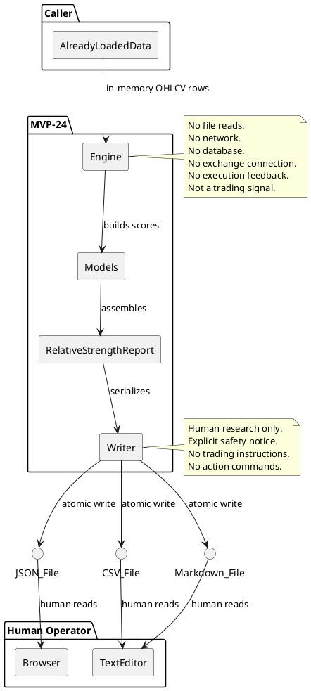
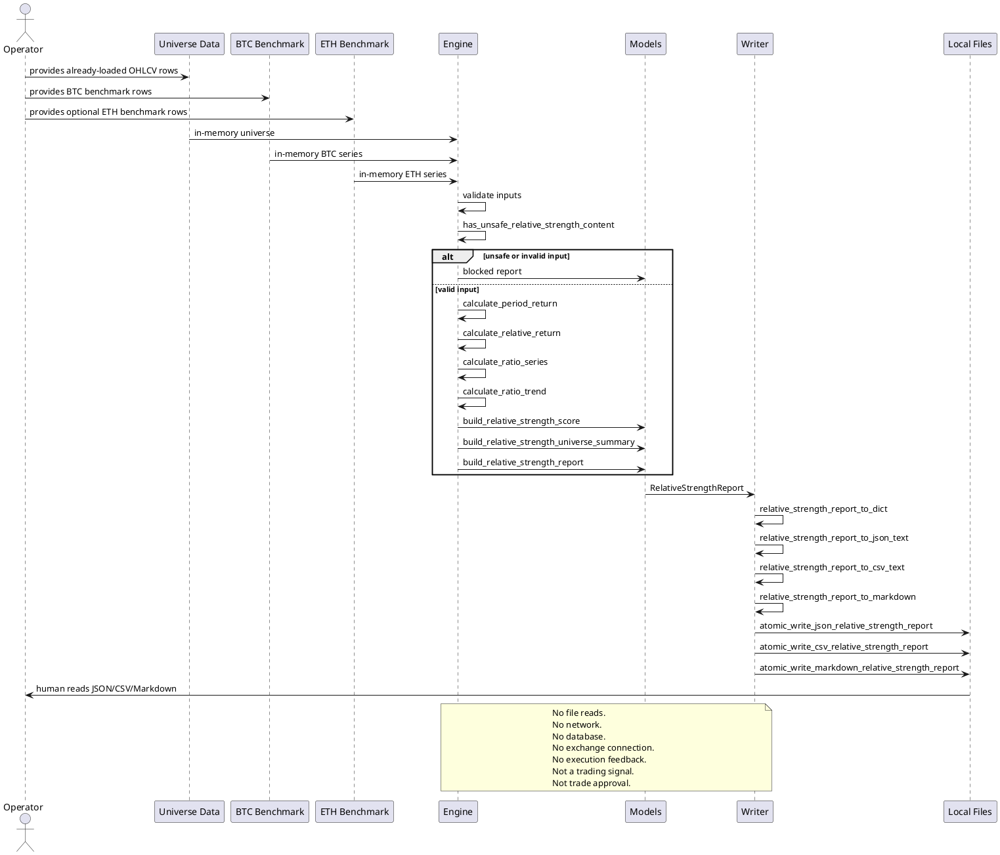

# SPEC-025-Relative-Strength-Engine

## Background

MVP-23 completes the Local Research Audit Snapshot, the terminal human-audit/contractor-handoff artifact in the audit/governance chain. With that chain closed, the project can now safely begin the first real quantitative research-support engine. The long-term Hunter Futures architecture includes a Regime Engine, Market Breadth Engine, Altcoin Discovery Engine, Relative Strength Engine, Open Interest Engine, Strategy Fitness Engine, Portfolio Construction Engine, Backtesting, Reporting, and the Freqtrade Execution Layer. MVP-24 is the Relative Strength Engine.

The Relative Strength Engine is the simplest, most self-contained quant engine in the architecture. It answers a single research question: **"How has each coin performed versus BTC and ETH over fixed lookback periods, and how does it rank within a provided universe?"** It does not select pairs, rebalance a portfolio, approve a universe, or emit any trading instruction. It is a local, deterministic, pure-function calculator over already-loaded OHLCV-like data.

Coin selection is a research exercise, not a mandate to add more pairs. Blindly expanding a universe increases risk without increasing edge. The engine therefore evaluates only the coins a caller explicitly provides, compares them against a BTC benchmark and an optional ETH benchmark, and returns a bounded score and a research-only decision label. BTC and ETH are treated as exceptions when the coin itself is BTC or ETH, because a coin cannot outperform itself.

This MVP is intentionally research-only. It is not a trading signal, not trade approval, not strategy approval, not execution approval, not portfolio/universe approval, and not Freqtrade input. It must not connect to any exchange, API, network, live data feed, database, or file source. It must not place orders, suggest orders, emit action commands, or create execution instructions. It must not produce or consume Freqtrade strategy classes. It must not modify or feed back into any execution, strategy, Freqtrade, order, exchange, or portfolio path.

## Requirements

### Must Have (M)

- **M1:** Accept only already-loaded OHLCV-like data. Input is a sequence of local, in-memory values (mappings, named tuples, or small dataclass rows) containing at minimum `timestamp` and `close` fields. The engine never reads files, databases, or network endpoints.
- **M2:** Support a BTC benchmark series and an optional ETH benchmark series. Both are provided by the caller as already-loaded data; the engine does not fetch them.
- **M3:** Compute period returns for 7d, 14d, and 30d (or equivalent generic lookback periods when the data interval is abstracted). If the caller supplies data at a different interval, the engine still uses the same fixed lookback counts unless configured otherwise, but the default is three standard lookbacks.
- **M4:** Compute `coin_minus_btc` for each period: the coin's period return minus the BTC benchmark's period return over the same window.
- **M5:** Compute `coin_minus_eth` for each period when an ETH benchmark is present. If ETH is missing, the engine continues deterministically and redistributes the ETH weight per the scoring policy.
- **M6:** Compute a coin/BTC ratio series from the ratio of coin close to BTC close at each timestamp, and compute a simple ratio-trend score using deterministic moving averages and/or slope helpers.
- **M7:** Compute rank percentile across a provided universe for each metric (e.g., 30d coin_minus_btc). Percentile handling is deterministic, with explicit tie-breaking.
- **M8:** Produce a deterministic total relative strength score in the range [0, 100]. The score is a weighted combination of the sub-scores described in the scoring policy.
- **M9:** Classify each coin into one of the following decisions: `OUTPERFORMER`, `NEUTRAL`, `UNDERPERFORMER`, `INSUFFICIENT_DATA`, or `BLOCKED`.
- **M10:** Fail-closed on missing, invalid, or unsafe inputs. Missing/invalid inputs produce `INSUFFICIENT_DATA` or `BLOCKED` with explicit reason codes, never an inferred or partial "safe" score.
- **M11:** Include deterministic, priority-ordered reason codes for all blocking, incomplete, and advisory conditions.
- **M12:** Include data quality fields tracking expected vs. actual data points, missing periods, stale inputs, and minimum data quality thresholds.
- **M13:** Include safety flags that explicitly forbid live trading, real orders, leverage, shorting, execution feedback, exchange connectivity, and any runtime infrastructure.
- **M14:** No network, API, exchange, file, database, or runtime dependencies. The engine is pure in-memory computation over caller-provided values.
- **M15:** No trading signal, trade approval, strategy approval, execution approval, portfolio/universe approval, or Freqtrade integration semantics. Output is explicitly labeled as human research only.
- **M16:** Immutability: the engine must not mutate caller-provided input sequences, mappings, or benchmark objects.
- **M17:** Deterministic rounding policy: raw metrics rounded to 8 decimal places, final scores rounded to 4 decimal places, and the total score rounded to 2 decimal places before classification.
- **M18:** Deterministic output sorting: coins sorted by total score descending, then decision priority, then pair/symbol ascending.

### Should Have (S)

- **S1:** Multi-period weighting with a documented default policy and an override vector in `RelativeStrengthConfig`.
- **S2:** BTC exception and ETH exception handling: when the coin is BTC, the benchmark comparison is against ETH or neutral; when the coin is ETH, the benchmark comparison is against BTC or neutral; self-comparison never occurs.
- **S3:** Deterministic tie-breaking by pair/symbol when scores or percentiles are identical.
- **S4:** Writer design for JSON, CSV, and Markdown output, including a deterministic report rendering with a research-only safety notice.
- **S5:** Atomic writes for the writer step: temp file + flush + fsync + os.replace + cleanup on failure.
- **S6:** Tests use `tmp_path` only for writer tests; engine tests never touch the filesystem.
- **S7:** A universe-level summary that reports the count of outperformers, neutrals, underperformers, and blocked/insufficient-data coins.

### Could Have (C)

- **C1:** Top-N and bottom-N helper functions for the universe summary.
- **C2:** Diagnostic notes on each score explaining the largest contributor to the total score (e.g., "30d BTC-relative return was the main driver").
- **C3:** Optional volatility-adjusted returns (e.g., return divided by rolling standard deviation) as a secondary diagnostic, but not a primary input to the total score unless the SPEC is amended.
- **C4:** A compact "human interpretation" sentence on each score object, e.g., "SOL has outperformed BTC over 30d by 12.34% and ranks in the 85th percentile of the provided universe."

### Won't Have (W)

- **W1:** Binance API collector or any exchange data collector.
- **W2:** Live data, real-time streaming, WebSocket, or network connection.
- **W3:** Freqtrade integration, Freqtrade strategy class, or Freqtrade runtime connection.
- **W4:** Portfolio approval, universe rebalance, or position sizing.
- **W5:** Backtesting engine, walk-forward analysis, or simulation of PnL.
- **W6:** Open Interest, funding rates, funding arbitrage, or on-chain metrics.
- **W7:** Altcoin discovery or automatic universe expansion.
- **W8:** CLI, Web UI, dashboard, API server, database, auth, or scheduler.
- **W9:** Trading signals, trade approval, execution readiness, or any claim that a high score permits trading.
- **W10:** File reads in the engine; data must be passed in-memory by the caller.
- **W11:** Runtime registry, indexer, crawler, event store, task runner, or feedback layer.

## Method

### Proposed Package Layout

```
src/hunter/
└── relative_strength/
    ├── __init__.py          # Public API exports
    ├── models.py            # Enums, frozen dataclasses, reason codes, safety flags
    ├── engine.py            # Pure relative-strength calculation functions
    └── writer.py            # JSON/CSV/Markdown serialization and atomic writes

tests/test_relative_strength/
    ├── __init__.py
    ├── test_models.py       # Model validation, safety flags, reason codes
    ├── test_engine.py       # Pure calculation functions, fail-closed behavior
    ├── test_writer.py       # Serialization and atomic writes
    └── test_integration.py  # End-to-end flows and safety assertions
```

### Output Paths

- `data/relative_strength/latest_relative_strength_scores.json`
- `data/relative_strength/latest_relative_strength_scores.csv`
- `reports/relative_strength/latest_relative_strength_report.md`

### Input Contracts

The engine consumes only caller-provided, already-loaded local values. Each coin is represented by a sequence of OHLCV-like rows. Each row must expose at minimum:

| Field | Type | Required |
|-------|------|----------|
| `timestamp` | `datetime` (timezone-aware) or `int` epoch | Yes |
| `close` | `float` or `Decimal` | Yes |
| `open` | `float` or `Decimal` | No |
| `high` | `float` or `Decimal` | No |
| `low` | `float` or `Decimal` | No |
| `volume` | `float` or `Decimal` | No |

The caller passes:

- `universe: Sequence[RelativeStrengthInput]` — one input per coin/pair, carrying the symbol and the OHLCV sequence.
- `btc_benchmark: Sequence[OhlcvRow]` — the BTC benchmark series.
- `eth_benchmark: Sequence[OhlcvRow] | None` — optional ETH benchmark series.
- `config: RelativeStrengthConfig` — optional scoring and threshold configuration.
- `metadata: Mapping[str, Any] | None` — optional opaque metadata for the report; never traversed, validated, or executed.

### Models

#### `OhlcvRow`

```python
@dataclass(frozen=True)
class OhlcvRow:
    """A single OHLCV-like row for relative-strength input."""

    timestamp: datetime | int
    close: float | Decimal
    open: float | Decimal | None = None
    high: float | Decimal | None = None
    low: float | Decimal | None = None
    volume: float | Decimal | None = None

    def __post_init__(self) -> None:
        if self.close is None:
            raise ValueError("OhlcvRow.close must not be None")
        if self.close == 0:
            raise ValueError("OhlcvRow.close must be non-zero")
```

#### `RelativeStrengthInput`

```python
@dataclass(frozen=True)
class RelativeStrengthInput:
    """A single coin/pair with its already-loaded OHLCV sequence."""

    symbol: str
    rows: Sequence[OhlcvRow]

    def __post_init__(self) -> None:
        if not self.symbol:
            raise ValueError("symbol must be non-empty")
        if not self.rows:
            raise ValueError("rows must be non-empty")
```

#### `RelativeStrengthState`

```python
class RelativeStrengthState(Enum):
    """Overall state of a single relative strength score or report."""

    READY = "ready"
    INSUFFICIENT_DATA = "insufficient_data"
    BLOCKED = "blocked"
```

#### `RelativeStrengthDecision`

```python
class RelativeStrengthDecision(Enum):
    """Research-only decision classification for a single coin."""

    OUTPERFORMER = "outperformer"
    NEUTRAL = "neutral"
    UNDERPERFORMER = "underperformer"
    INSUFFICIENT_DATA = "insufficient_data"
    BLOCKED = "blocked"
```

Decision priority for deterministic sorting (lower = stronger relative strength indication): `OUTPERFORMER=0`, `NEUTRAL=1`, `UNDERPERFORMER=2`, `INSUFFICIENT_DATA=3`, `BLOCKED=4`.

#### `RelativeStrengthBenchmarkKind`

```python
class RelativeStrengthBenchmarkKind(Enum):
    """Benchmark used for a relative comparison."""

    BTC = "btc"
    ETH = "eth"
    NEUTRAL = "neutral"
```

#### `RelativeStrengthConfig`

```python
@dataclass(frozen=True)
class RelativeStrengthConfig:
    """Configuration for the relative strength engine."""

    version: str = "1.0"
    lookback_days: tuple[int, ...] = (7, 14, 30)
    min_required_rows: int = 30
    score_weights: Mapping[str, float] = field(default_factory=lambda: MappingProxyType({
        "coin_minus_btc_30d": 0.35,
        "coin_minus_btc_14d": 0.20,
        "coin_minus_btc_7d": 0.10,
        "coin_minus_eth_30d": 0.10,
        "rank_percentile_30d": 0.15,
        "ratio_trend": 0.10,
    }))
    outperformer_threshold: float = 65.0
    underperformer_threshold: float = 35.0
    rank_percentile_window: int = 30
    ratio_trend_lookback: int = 30
    ratio_trend_ma_window: int = 7
    rounding_policy: str = "default"
    block_on_missing_eth: bool = False
    block_on_missing_data: bool = False

    def __post_init__(self) -> None:
        if not self.version:
            raise ValueError("version must be non-empty")
        if any(d <= 0 for d in self.lookback_days):
            raise ValueError("lookback_days must be positive")
        if self.min_required_rows < 2:
            raise ValueError("min_required_rows must be at least 2")
        if not (0.999 <= sum(self.score_weights.values()) <= 1.001):
            raise ValueError("score_weights must sum to 1.0")
        if not (0.0 <= self.outperformer_threshold <= 100.0):
            raise ValueError("outperformer_threshold must be in [0, 100]")
        if not (0.0 <= self.underperformer_threshold <= 100.0):
            raise ValueError("underperformer_threshold must be in [0, 100]")
        if self.outperformer_threshold <= self.underperformer_threshold:
            raise ValueError("outperformer_threshold must exceed underperformer_threshold")
```

If ETH is missing, the `coin_minus_eth_30d` weight is redistributed to the BTC-relative weights in proportion to their existing weights using the formula `new_w_i = w_i + eth_weight * (w_i / sum(btc_weights))`. If all BTC-relative weights are also zero, the weight is distributed equally across all remaining non-zero weights.

Config flag behavior:

- `block_on_missing_eth=True`: A missing ETH benchmark is treated as a blocking condition. The report is `BLOCKED` with reason code `ETH_BENCHMARK_MISSING` (BTC absence is always blocking via `MISSING_BTC_BENCHMARK`, regardless of this flag).
- `block_on_missing_eth=False`: A missing ETH benchmark emits `ETH_BENCHMARK_MISSING` as an incomplete/informational reason code, and the ETH weight is redistributed per the formula above.
- `block_on_missing_data=True`: Any coin with insufficient required BTC or coin data is classified as `BLOCKED` rather than `INSUFFICIENT_DATA`. The whole report is blocked only if the top-level validation fails; per-coin insufficient data is blocked at the coin level.
- `block_on_missing_data=False`: Insufficient data produces `INSUFFICIENT_DATA` state/decision; the coin is excluded from percentile ranking and top/bottom performer selection.

#### `RelativeStrengthSafetyFlags`

```python
@dataclass(frozen=True)
class RelativeStrengthSafetyFlags:
    """Safety invariants for the relative strength engine."""

    # Runtime safety flags
    live_trading_enabled: bool = False
    real_orders_enabled: bool = False
    leverage_enabled: bool = False
    shorting_enabled: bool = False

    # Output safety flags
    output_is_human_research_only: bool = True
    output_not_trading_signal: bool = True
    output_not_trade_approval: bool = True
    output_not_strategy_approval: bool = True
    output_not_execution_approval: bool = True
    output_not_portfolio_approval: bool = True
    output_not_freqtrade_input: bool = True
    output_not_order_input: bool = True
    output_not_exchange_input: bool = True
    output_not_universe_approval: bool = True

    # Feedback safety flags
    feedback_into_execution: bool = False
    feedback_into_strategy: bool = False
    feedback_into_freqtrade: bool = False
    feedback_into_portfolio: bool = False

    # Capability flags
    network_enabled: bool = False
    database_enabled: bool = False
    file_read_enabled: bool = False
    file_write_enabled: bool = True  # writer-only, explicit
    runtime_registry_enabled: bool = False
    indexer_crawler_enabled: bool = False
    event_store_enabled: bool = False
    task_runner_enabled: bool = False

    # Advisory flags
    inputs_already_loaded: bool = True
    no_action_commands_emitted: bool = True
    benchmarks_provided_by_caller: bool = True
    human_research_only: bool = True

    def __post_init__(self) -> None:
        unsafe_flags = (
            self.live_trading_enabled,
            self.real_orders_enabled,
            self.leverage_enabled,
            self.shorting_enabled,
            self.feedback_into_execution,
            self.feedback_into_strategy,
            self.feedback_into_freqtrade,
            self.feedback_into_portfolio,
            self.network_enabled,
            self.database_enabled,
            self.file_read_enabled,
            self.runtime_registry_enabled,
            self.indexer_crawler_enabled,
            self.event_store_enabled,
            self.task_runner_enabled,
        )
        if any(unsafe_flags):
            raise ValueError("unsafe relative strength safety flags are enabled")
        safe_flags = (
            self.output_is_human_research_only,
            self.output_not_trading_signal,
            self.output_not_trade_approval,
            self.output_not_strategy_approval,
            self.output_not_execution_approval,
            self.output_not_portfolio_approval,
            self.output_not_freqtrade_input,
            self.output_not_order_input,
            self.output_not_exchange_input,
            self.output_not_universe_approval,
            self.inputs_already_loaded,
            self.no_action_commands_emitted,
            self.benchmarks_provided_by_caller,
            self.human_research_only,
        )
        if not all(safe_flags):
            raise ValueError("safe relative strength output flags must be True")
```

#### `RelativeStrengthPeriodReturn`

```python
@dataclass(frozen=True)
class RelativeStrengthPeriodReturn:
    """A single period return for a coin and its benchmarks."""

    period_days: int
    coin_return: float | None
    btc_return: float | None
    eth_return: float | None
    coin_minus_btc: float | None
    coin_minus_eth: float | None
    has_data: bool
    reason_codes: tuple[str, ...]
```

#### `RelativeStrengthRatioTrend`

```python
@dataclass(frozen=True)
class RelativeStrengthRatioTrend:
    """Trend summary for a coin/BTC ratio series."""

    last_ratio: float
    ma_ratio: float
    slope: float
    trend_score: float  # 0.0 to 100.0
    lookback: int
    has_data: bool
    reason_codes: tuple[str, ...]
```

#### `RelativeStrengthScore`

```python
@dataclass(frozen=True)
class RelativeStrengthScore:
    """Relative strength score for a single coin."""

    symbol: str
    base_benchmark: RelativeStrengthBenchmarkKind
    state: RelativeStrengthState
    decision: RelativeStrengthDecision
    total_score: float
    period_returns: tuple[RelativeStrengthPeriodReturn, ...]
    ratio_trend: RelativeStrengthRatioTrend
    rank_percentile_30d: float | None
    sub_scores: Mapping[str, float]
    data_quality: RelativeStrengthDataQuality
    human_note: str
    reason_codes: tuple[str, ...]
```

#### `RelativeStrengthUniverseSummary`

```python
@dataclass(frozen=True)
class RelativeStrengthUniverseSummary:
    """Aggregated summary over the scored universe."""

    total_coins: int
    outperformer_count: int
    neutral_count: int
    underperformer_count: int
    insufficient_data_count: int
    blocked_count: int
    top_outperformer: str | None
    top_underperformer: str | None
    average_total_score: float
    data_quality: RelativeStrengthDataQuality
    summary_narrative: str
```

#### `RelativeStrengthReport`

```python
@dataclass(frozen=True)
class RelativeStrengthReport:
    """Full deterministic relative strength report."""

    report_id: str
    kind: str = "relative_strength_report"
    config: RelativeStrengthConfig
    safety_flags: RelativeStrengthSafetyFlags
    scores: tuple[RelativeStrengthScore, ...]
    universe_summary: RelativeStrengthUniverseSummary
    btc_series_head: tuple[OhlcvRow, ...]  # first N rows only, never the full series
    eth_series_head: tuple[OhlcvRow, ...] | None
    generated_at: datetime
    version: str = "0.24.0-dev"
    source_spec: str = "SPEC-025"
    reason_codes: tuple[str, ...]
    metadata: Mapping[str, Any]

    @classmethod
    def blocked(
        cls,
        *,
        report_id: str,
        config: RelativeStrengthConfig,
        reason_codes: tuple[str, ...],
        generated_at: datetime | None = None,
        metadata: Mapping[str, Any] | None = None,
    ) -> RelativeStrengthReport:
        """Return a fail-closed BLOCKED report when inputs are unsafe or invalid.

        If `generated_at` is omitted, the current UTC time is used. Tests should pass
        an explicit `generated_at` for deterministic output.
        """
        empty_summary = RelativeStrengthUniverseSummary(
            total_coins=0,
            outperformer_count=0,
            neutral_count=0,
            underperformer_count=0,
            insufficient_data_count=0,
            blocked_count=0,
            top_outperformer=None,
            top_underperformer=None,
            average_total_score=0.0,
            data_quality=RelativeStrengthDataQuality(
                expected_rows=0,
                actual_rows=0,
                missing_rows=0,
                missing_periods=(),
                min_required_rows_met=False,
                btc_benchmark_rows=0,
                eth_benchmark_rows=None,
                stale_input_count=0,
                reason_codes=reason_codes,
            ),
            summary_narrative="Report blocked due to unsafe or invalid input. No relative strength calculations were performed.",
        )
        return cls(
            report_id=report_id,
            config=config,
            safety_flags=RelativeStrengthSafetyFlags(),
            scores=(),
            universe_summary=empty_summary,
            btc_series_head=(),
            eth_series_head=None,
            generated_at=generated_at or datetime.now(timezone.utc),
            version="0.24.0-dev",
            source_spec="SPEC-025",
            reason_codes=reason_codes,
            metadata=metadata or MappingProxyType({}),
        )
```

#### `RelativeStrengthDataQuality`

```python
@dataclass(frozen=True)
class RelativeStrengthDataQuality:
    """Completeness and quality metrics for one coin or the whole universe."""

    expected_rows: int
    actual_rows: int
    missing_rows: int
    missing_periods: tuple[str, ...]
    min_required_rows_met: bool
    btc_benchmark_rows: int
    eth_benchmark_rows: int | None
    stale_input_count: int
    reason_codes: tuple[str, ...]

    def __post_init__(self) -> None:
        if self.expected_rows < 0:
            raise ValueError("expected_rows must be non-negative")
        if self.actual_rows < 0:
            raise ValueError("actual_rows must be non-negative")
        if self.missing_rows < 0:
            raise ValueError("missing_rows must be non-negative")
        if self.missing_rows > self.expected_rows:
            raise ValueError("missing_rows cannot exceed expected_rows")
        if self.btc_benchmark_rows < 0:
            raise ValueError("btc_benchmark_rows must be non-negative")
        if self.eth_benchmark_rows is not None and self.eth_benchmark_rows < 0:
            raise ValueError("eth_benchmark_rows must be non-negative or None")
        if self.stale_input_count < 0:
            raise ValueError("stale_input_count must be non-negative")
        if not isinstance(self.reason_codes, tuple):
            raise ValueError("reason_codes must be a tuple")
```

### Reason Code Constants

```python
# Blocking reason codes
UNSAFE_INPUT_CONTENT = "UNSAFE_INPUT_CONTENT"
INVALID_INPUT_DATA = "INVALID_INPUT_DATA"
INVALID_CONFIG = "INVALID_CONFIG"
MISSING_BTC_BENCHMARK = "MISSING_BTC_BENCHMARK"
INSUFFICIENT_COIN_DATA = "INSUFFICIENT_COIN_DATA"
FORBIDDEN_TRADING_SEMANTICS = "FORBIDDEN_TRADING_SEMANTICS"

# Incomplete/insufficient reason codes
ETH_BENCHMARK_MISSING = "ETH_BENCHMARK_MISSING"
STALE_INPUT_DATA = "STALE_INPUT_DATA"
MIN_ROWS_NOT_MET = "MIN_ROWS_NOT_MET"
PERIOD_DATA_MISSING = "PERIOD_DATA_MISSING"

# Advisory reason codes
INPUTS_ALREADY_LOADED = "INPUTS_ALREADY_LOADED"
BENCHMARKS_PROVIDED_BY_CALLER = "BENCHMARKS_PROVIDED_BY_CALLER"
NO_ACTION_COMMANDS_EMITTED = "NO_ACTION_COMMANDS_EMITTED"
HUMAN_RESEARCH_ONLY = "HUMAN_RESEARCH_ONLY"
NO_NETWORK_CONNECTION = "NO_NETWORK_CONNECTION"
NO_DATABASE_CONNECTION = "NO_DATABASE_CONNECTION"
NO_FILE_READ_IN_ENGINE = "NO_FILE_READ_IN_ENGINE"

RELATIVE_STRENGTH_BLOCKING_REASON_CODES = (
    UNSAFE_INPUT_CONTENT,
    INVALID_INPUT_DATA,
    INVALID_CONFIG,
    MISSING_BTC_BENCHMARK,
    INSUFFICIENT_COIN_DATA,
    FORBIDDEN_TRADING_SEMANTICS,
)

RELATIVE_STRENGTH_INCOMPLETE_REASON_CODES = (
    ETH_BENCHMARK_MISSING,
    STALE_INPUT_DATA,
    MIN_ROWS_NOT_MET,
    PERIOD_DATA_MISSING,
)

RELATIVE_STRENGTH_ADVISORY_REASON_CODES = (
    INPUTS_ALREADY_LOADED,
    BENCHMARKS_PROVIDED_BY_CALLER,
    NO_ACTION_COMMANDS_EMITTED,
    HUMAN_RESEARCH_ONLY,
    NO_NETWORK_CONNECTION,
    NO_DATABASE_CONNECTION,
    NO_FILE_READ_IN_ENGINE,
)

RELATIVE_STRENGTH_REASON_CODES = (
    RELATIVE_STRENGTH_BLOCKING_REASON_CODES
    + RELATIVE_STRENGTH_INCOMPLETE_REASON_CODES
    + RELATIVE_STRENGTH_ADVISORY_REASON_CODES
)
```

### Project Conventions

These conventions align with existing Hunter Futures packages (`research_audit_snapshot`, `research_digest`, `review_search`) and must be followed by the implementation:

1. **Frozen dataclasses:** All model dataclasses are `frozen=True`. `__post_init__` must use `object.__setattr__(self, "field", ...)` to normalize mutable inputs into immutable forms.
2. **Sequence normalization:** Fields typed as `tuple[...]` should accept any `Sequence` at construction, then be coerced to `tuple` in `__post_init__`.
3. **Mapping normalization:** Fields typed as `Mapping[str, Any]` should be copied into an immutable `MappingProxyType` (or an already-copied immutable mapping) in `__post_init__`.
4. **Reason code validation:** Every `reason_codes` field must be a tuple of non-empty strings, and every code must be a member of `RELATIVE_STRENGTH_REASON_CODES`.
5. **Score bounds:** `total_score` and every sub-score must remain in [0.0, 100.0]. `RelativeStrengthScore.__post_init__` should validate this.
6. **Average over READY scores only:** `RelativeStrengthUniverseSummary.average_total_score` is computed over coins whose `state` is `READY`.
7. **Universe count invariant:** `outperformer_count + neutral_count + underperformer_count + insufficient_data_count + blocked_count == total_coins` must hold; add `__post_init__` validation for this.
8. **Deterministic blocked factory:** `RelativeStrengthReport.blocked(...)` accepts an optional `generated_at` parameter. Tests should pass an explicit `generated_at` to make output deterministic.

Forbidden terms include all trading/execution/approval keywords: `live_trade`, `real_order`, `leverage`, `shorting`, `execute`, `place_order`, `buy`, `sell`, `enter_long`, `enter_short`, `exit_long`, `exit_short`, `portfolio_approval`, `universe_approval`, `strategy_approval`, `execution_approval`, `trade_approval`, `go_live`, `production_ready`, `binance`, `exchange_api`, `api_key`, `secret`, `deploy`, `trigger`, `submit`, `task_runner`, `event_store`, `database`, `web_ui`, `dashboard`.

### Engine Functions

#### `build_relative_strength_safety_flags() -> RelativeStrengthSafetyFlags`

Returns the default fail-closed safety flags.

#### `has_unsafe_relative_strength_content(value: RelativeStrengthInput | str | Mapping[str, Any] | None) -> bool`

Return `True` if the supplied value contains forbidden trading/execution/Freqtrade/order/exchange/API/Binance/live-data/action-command content. The check inspects only opaque local strings and mappings (e.g., `symbol`, `human_note`, metadata keys/values). It does not open files, follow paths, validate paths, read files, call network endpoints, or inspect any external resource. The caller must supply already-loaded values; the function never performs I/O.

#### `calculate_period_return(rows: Sequence[OhlcvRow], lookback: int) -> float | None`

Compute `(last_close - start_close) / start_close` for the given lookback. If `start_close` is zero or missing, return `None` and emit `PERIOD_DATA_MISSING`. If the series has fewer rows than `lookback + 1`, return `None` with `PERIOD_DATA_MISSING` (or `MIN_ROWS_NOT_MET` if the whole series is below the configured minimum). The function never raises on invalid data; failures are represented as `None` plus a reason code.

#### `calculate_relative_return(coin_return: float | None, btc_return: float | None, eth_return: float | None) -> tuple[float | None, float | None]`

Return `(coin_return - btc_return, coin_return - eth_return if eth_return is not None else None)`. If either input is `None`, the corresponding output is `None` and the caller emits `PERIOD_DATA_MISSING`.

#### `calculate_ratio_series(coin_rows: Sequence[OhlcvRow], benchmark_rows: Sequence[OhlcvRow]) -> Sequence[float]`

Return the pointwise ratio of `coin_close / benchmark_close` after aligning timestamps. The function must not mutate inputs. If a benchmark close is zero, emit `PERIOD_DATA_MISSING` and exclude that timestamp from the ratio series. If timestamps cannot be aligned, return an empty sequence with `PERIOD_DATA_MISSING`. Coins or benchmarks with zero `close` are excluded rather than causing a division-by-zero error.

#### `calculate_moving_average(values: Sequence[float], window: int) -> Sequence[float]`

Return a simple (arithmetic) moving average over the values. For each position `i` >= `window - 1`, the SMA is the mean of `values[i - window + 1 : i + 1]`. Window must be positive and `<= len(values)`. If insufficient data, return an empty sequence. The implementation uses plain arithmetic mean with no exponential weighting.

#### `calculate_slope(values: Sequence[float]) -> float`

Return the slope of an ordinary least-squares linear regression of `values` on index positions `[0, 1, ..., n - 1]`. The slope is `sum((x - x_mean) * (y - y_mean)) / sum((x - x_mean)^2)`. Return `0.0` if fewer than 2 points. If the denominator is zero (all x identical, which cannot happen for a contiguous index, but guarded defensively), return `0.0` and emit `PERIOD_DATA_MISSING`.

#### `calculate_ratio_trend(ratio_series: Sequence[float], ma_window: int, lookback: int) -> RelativeStrengthRatioTrend`

Compute the last ratio, the SMA, the slope, and normalize them into a 0–100 trend score using the configured policy. A rising ratio above the moving average scores higher; a falling ratio below the moving average scores lower. If `ratio_series` is empty or shorter than `lookback`, return a `RelativeStrengthRatioTrend` with `has_data=False` and `reason_codes=(PERIOD_DATA_MISSING,)`. If `ma_window` exceeds the available data, the SMA is empty and the trend score is `0.0`.

#### `calculate_rank_percentiles(coins: Sequence[RelativeStrengthScore], metric: str) -> Mapping[str, float | None]`

Compute the percentile rank of each coin on the given metric. Metric names follow the pattern `{field}_{period_days}d`, for example `coin_minus_btc_30d`. Extraction rules:

1. Parse `metric` as `{field}_{period_days}d`.
2. Find the `RelativeStrengthPeriodReturn` in the score's `period_returns` where `period_days == requested days`.
3. Return the selected `field` value.

Supported fields:

- `coin_return`
- `btc_return`
- `eth_return`
- `coin_minus_btc`
- `coin_minus_eth`

Coins with `state` = `INSUFFICIENT_DATA` or `BLOCKED` are excluded from the ranking and receive `None` for the metric. A score is also excluded if the requested metric is `None` or the requested period is not present in `period_returns`. For ranked coins, use deterministic tie-breaking: average-rank tie handling, then sort by symbol ascending for identical values. Return values in [0.0, 100.0]. An invalid metric name raises `ValueError`.

#### `build_relative_strength_score(input: RelativeStrengthInput, btc_rows: Sequence[OhlcvRow], eth_rows: Sequence[OhlcvRow] | None, config: RelativeStrengthConfig) -> RelativeStrengthScore`

Build a single `RelativeStrengthScore`. Steps:

1. Validate input and benchmark data. If validation fails, emit `INVALID_INPUT_DATA`, `MISSING_BTC_BENCHMARK`, or `MIN_ROWS_NOT_MET` as appropriate.
2. Compute 7d, 14d, 30d period returns for coin, BTC, and ETH (if present). A failed period return emits `PERIOD_DATA_MISSING` for that period.
3. Compute `coin_minus_btc` and `coin_minus_eth` for each period. If either side is missing, the result is `None` and `PERIOD_DATA_MISSING` is emitted.
4. Build `RelativeStrengthPeriodReturn` objects, each carrying its own `reason_codes`.
5. Compute coin/BTC ratio series and ratio trend. Empty or unalignable series emits `PERIOD_DATA_MISSING`; ratio trend records `has_data=False`.
6. Compute rank percentile on 30d `coin_minus_btc` deferred to the universe/report step. The score object is frozen, so `rank_percentile_30d` is initially `None` on the object returned by this function and later filled by constructing a replacement via `dataclasses.replace(...)` in `build_relative_strength_report`. Never mutate an existing frozen score object.
7. Apply scoring weights to produce `total_score` in [0, 100]. If a sub-score is missing, its weight is redistributed proportionally among available sub-scores within the same coin.
8. Apply state-to-decision mapping.
9. Build human note.
10. Build `RelativeStrengthDataQuality` and aggregate reason codes.

If the input is BTC itself, use `ETH` as the base benchmark if ETH is provided, otherwise `NEUTRAL`. If the input is ETH itself, use `BTC` as the base benchmark. If ETH is missing, the ETH-related sub-score is zero and the weight is redistributed per the scoring policy.

#### `build_relative_strength_universe_summary(scores: Sequence[RelativeStrengthScore], config: RelativeStrengthConfig) -> RelativeStrengthUniverseSummary`

Aggregate scores into a universe summary. Count decisions, compute average total score over `READY`-state coins only, identify top outperformer and top underperformer by deterministic sort, and build a summary narrative. Data quality reflects the worst individual coin data quality and the overall missing-ETH status. The count invariant `outperformer_count + neutral_count + underperformer_count + insufficient_data_count + blocked_count == total_coins` must hold and is validated in `__post_init__`.

#### `build_relative_strength_report(
    *,
    universe: Sequence[RelativeStrengthInput],
    btc_benchmark: Sequence[OhlcvRow],
    eth_benchmark: Sequence[OhlcvRow] | None = None,
    config: RelativeStrengthConfig | None = None,
    report_id: str = "latest-relative-strength",
    generated_at: datetime | None = None,
    metadata: Mapping[str, str] | None = None,
) -> RelativeStrengthReport`

Top-level builder. Takes the universe of inputs, BTC benchmark, optional ETH benchmark, config, and metadata. Builds safety flags, all individual scores, rank percentiles, the universe summary, and the final `RelativeStrengthReport`. Validates inputs and returns a deterministic fail-closed `BLOCKED` report if any blocking reason code is present.

Because `RelativeStrengthScore` is frozen, `rank_percentile_30d` is filled by building replacement score instances with `dataclasses.replace(score, rank_percentile_30d=value)`. The original score objects are never mutated. If `generated_at` is omitted, the current UTC time is used; callers should pass an explicit `generated_at` for deterministic tests.

### Scoring Policy

Default weights:

| Component | Weight |
|-----------|--------|
| 30d coin_minus_btc | 0.35 |
| 14d coin_minus_btc | 0.20 |
| 7d coin_minus_btc | 0.10 |
| 30d coin_minus_eth (if ETH present) | 0.10 |
| 30d rank percentile (coin_minus_btc) | 0.15 |
| Ratio trend | 0.10 |

If ETH is missing, redistribute the `coin_minus_eth_30d` weight proportionally across the BTC-relative weights using the formula:

```
new_w_i = w_i + eth_weight * (w_i / sum(btc_weights))
```

where `w_i` is each BTC-relative weight, `eth_weight` is the missing ETH weight, and `sum(btc_weights)` is the total weight across all BTC-relative components. If all BTC-relative weights are also zero, the missing weight is distributed equally across all remaining non-zero weights. If ETH is present but data is insufficient for a specific coin, that coin's ETH sub-score is zero and its weight is redistributed within that coin only using the same proportional rule.

For the default weights, the redistribution gives:

| Component | New Weight |
|-----------|-----------|
| 30d coin_minus_btc | 0.35 + 0.10 × (0.35 / 0.65) = 0.403846... |
| 14d coin_minus_btc | 0.20 + 0.10 × (0.20 / 0.65) = 0.230769... |
| 7d coin_minus_btc | 0.10 + 0.10 × (0.10 / 0.65) = 0.115385... |

The implementation must preserve the invariant that the effective weights sum to exactly 1.0 (within floating-point tolerance).

Each sub-score is normalized to [0, 100] independently using a deterministic linear clamp. The normalization helper is:

```python
def normalized_score(value: float | None, lower_bound: float, upper_bound: float) -> float:
    """Linearly clamp a value to [0, 100]."""
    if value is None:
        return 0.0
    if value <= lower_bound:
        return 0.0
    if value >= upper_bound:
        return 100.0
    return ((value - lower_bound) / (upper_bound - lower_bound)) * 100.0
```

Applied bounds:

| Sub-score | lower_bound | upper_bound | Notes |
|-----------|-------------|-------------|-------|
| BTC-relative returns (`coin_minus_btc_*`) | -0.30 | 0.30 | 30% underperformance → 0, 30% outperformance → 100. |
| ETH-relative returns (`coin_minus_eth_*`) | -0.30 | 0.30 | Same bound as BTC-relative returns. |
| Ratio trend slope | -0.05 | 0.05 | -5% per period → 0, +5% per period → 100. |
| 30d rank percentile | 0.0 | 1.0 | `percentile * 100.0`; percentile is already in [0.0, 1.0]. |

All sub-scores are rounded to 4 decimal places after calculation. Missing sub-scores contribute `0.0` to the weighted sum and their weight is redistributed among available sub-scores within the same coin.

### Decision Rules

For each coin, the engine first determines the `RelativeStrengthState`, then derives the `RelativeStrengthDecision` from that state. This ordering prevents a coin with unsafe or incomplete data from receiving a falsely informative decision.

1. **Determine state:**
   - `BLOCKED` if any blocking reason code is present (unsafe content, invalid input, missing BTC benchmark, forbidden trading semantics, etc.).
   - `INSUFFICIENT_DATA` if the data quality does not meet the minimum threshold (too few rows, stale data, missing period data, etc.) and no blocking reason code is present.
   - `READY` if all validation passes and sufficient data is available.

2. **Derive decision from state:**
   - `BLOCKED` state → `BLOCKED` decision.
   - `INSUFFICIENT_DATA` state → `INSUFFICIENT_DATA` decision.
   - `READY` state → apply the thresholds below.

For a single coin in `READY` state:

- `OUTPERFORMER` if `total_score >= config.outperformer_threshold` AND all three `coin_minus_btc` periods are positive.
- `UNDERPERFORMER` if `total_score <= config.underperformer_threshold` AND all three `coin_minus_btc` periods are negative.
- `NEUTRAL` if neither of the above.

If the coin is BTC and ETH is present, the decision is based on BTC-vs-ETH relative returns. If ETH is missing, BTC is classified as `NEUTRAL` with a note that it is the benchmark.

If the coin is ETH, the decision is based on ETH-vs-BTC relative returns.

### Insufficient-Data Behavior

When a coin is classified as `INSUFFICIENT_DATA`:

- `state` = `INSUFFICIENT_DATA`.
- `decision` = `INSUFFICIENT_DATA`.
- `total_score` = `0.0` (no falsely informative score).
- `rank_percentile_30d` = `None` (excluded from ranking).
- `sub_scores` is empty.
- `human_note` explains the missing-data condition (e.g., "Only 12 rows available; minimum 30 required.").
- `data_quality` records the actual vs. expected rows and the reason codes.
- The coin is excluded from `calculate_rank_percentiles` and from the top/bottom performer selection in the universe summary.

### State-to-Decision Mapping

| State | Decision | total_score | rank_percentile_30d | Notes |
|-------|----------|-------------|---------------------|-------|
| `READY` | `OUTPERFORMER`, `NEUTRAL`, or `UNDERPERFORMER` | computed [0, 100] | computed or `None` | Normal research output. |
| `INSUFFICIENT_DATA` | `INSUFFICIENT_DATA` | `0.0` | `None` | Missing rows, stale data, or missing period data. |
| `BLOCKED` | `BLOCKED` | `0.0` | `None` | Unsafe or invalid input; no calculations performed. |

### Writer Functions

#### `relative_strength_report_to_dict(report: RelativeStrengthReport) -> dict[str, Any]`

Serialize the report to a JSON-safe dict. Datetimes become ISO-8601 strings; enums become their values; tuples become lists; decimals/floats are rounded per the rounding policy. No secrets, no trading instructions, no operational instructions.

#### `relative_strength_report_to_json_text(report: RelativeStrengthReport) -> str`

Return a JSON text representation with `sort_keys=True` and `indent=2` for deterministic output.

#### `relative_strength_report_to_csv_text(report: RelativeStrengthReport) -> str`

Return a CSV text representation with deterministic column ordering. Columns include: `symbol`, `decision`, `total_score`, `coin_minus_btc_7d`, `coin_minus_btc_14d`, `coin_minus_btc_30d`, `coin_minus_eth_30d`, `rank_percentile_30d`, `ratio_trend_score`, `state`, `reason_codes`, `human_note`.

#### `relative_strength_report_to_markdown(report: RelativeStrengthReport) -> str`

Render a Markdown report with:

- Explicit research-only safety notice at the top, immediately after the H1 title.
- Report identity (report_id, version, source_spec, generated_at).
- Universe summary.
- A sorted table of scores.
- Per-score sub-metrics and human notes.
- Data quality summary.
- No action commands, no trading instructions, no execution readiness language.

#### Atomic writers and combined writer

```python
def atomic_write_json_relative_strength_report(report: RelativeStrengthReport, path: str | Path = DEFAULT_JSON_PATH) -> Path
def atomic_write_csv_relative_strength_report(report: RelativeStrengthReport, path: str | Path = DEFAULT_CSV_PATH) -> Path
def atomic_write_markdown_relative_strength_report(report: RelativeStrengthReport, path: str | Path = DEFAULT_MD_PATH) -> Path
def write_relative_strength_report(report: RelativeStrengthReport, json_path=..., csv_path=..., md_path=...) -> tuple[Path | None, Path | None, Path | None]
```

All atomic writers use: temp file → write → flush → fsync → `os.replace` → cleanup on failure.

## Determinism

The engine must produce identical outputs for identical inputs:

- Input rows are ordered by timestamp before any calculation.
- Coins are sorted by total score descending, then decision priority ascending, then symbol ascending.
- Percentile ranks use deterministic tie-breaking.
- Floating-point results are rounded to a fixed precision before being used in downstream calculations or serialized.
- Default rounding policy:
  - Raw returns/ratios: 8 decimal places.
  - Sub-scores and percentiles: 4 decimal places.
  - Final total score: 2 decimal places.
- Inputs are never mutated. If normalization is needed, a new sequence is created.

## Safety

### Explicit Non-Goals

The Relative Strength Engine is explicitly **not** any of the following:

- Not a trading signal.
- Not trade approval.
- Not strategy approval.
- Not execution approval.
- Not portfolio construction or universe approval.
- Not Freqtrade input or a Freqtrade strategy class.
- Not an exchange connector, API client, or data collector.
- Not a live data feed or real-time streaming system.
- Not a backtester, simulator, or PnL calculator.
- Not a Web UI, dashboard, database, API server, auth system, scheduler, crawler, indexer, runtime registry, event store, or task runner.
- Not a validator of external files or paths.
- Not a repair/normalization layer for bad market data.
- Not a source of action commands, order suggestions, or execution instructions.

### Safety Invariants

1. **Read-only input:** The engine never modifies caller-provided data.
2. **No file reads:** The engine is built from in-memory values only.
3. **No path traversal:** File paths, if any, are passed only to the writer and are never validated, opened, or followed by the engine.
4. **No network:** No HTTP, WebSocket, or TCP calls.
5. **No database:** No SQL, NoSQL, or persistence layer.
6. **No execution feedback:** Output never feeds back into execution, strategy, Freqtrade, order, exchange, portfolio, or any MVP execution path.
7. **No trading logic:** No decisions, approvals, or signals. Output is labeled as human research only.
8. **No secrets:** Output must not contain API keys, credentials, or executable trading instructions.
9. **Atomic writes:** Temp file + fsync + os.replace + cleanup on failure.
10. **Human-research only:** Markdown includes explicit safety notice.
11. **Fail-closed:** Missing/invalid inputs produce blocked or insufficient-data outputs with reason codes, never a falsely safe score.
12. **Deterministic:** Same inputs → same output, every time.
13. **No runtime infrastructure:** No registry, indexer, crawler, scheduler, routing layer, event store, or task runner behavior.
14. **No live data:** No real-time prices, no market data subscriptions, no exchange connections.
15. **No leverage/shorting:** Safety flags explicitly default these to False and reject True values.

## PlantUML Component Diagram



## PlantUML Sequence Diagram



## Implementation

### MVP-24 Step 1 — Relative Strength Models and Engine

Allowed files:
- `src/hunter/relative_strength/__init__.py`
- `src/hunter/relative_strength/models.py`
- `src/hunter/relative_strength/engine.py`
- `tests/test_relative_strength/__init__.py`
- `tests/test_relative_strength/test_models.py`
- `tests/test_relative_strength/test_engine.py`

Stop conditions:
- All enums and frozen dataclasses defined with validation.
- All safety flags fail-closed and validated.
- Reason code constants defined and partitioned.
- All engine functions implemented and unit-tested.
- Package tests pass.
- No forbidden imports, no file reads, no network calls.

Target: ~120 model/engine tests.

### MVP-24 Step 2 — Relative Strength Writer

Allowed files:
- `src/hunter/relative_strength/writer.py`
- `src/hunter/relative_strength/__init__.py` (exports only)
- `tests/test_relative_strength/test_writer.py`

Stop conditions:
- JSON, CSV, and Markdown serialization functions implemented.
- Atomic write helpers implemented and tested.
- Safety notice appears immediately after H1 in Markdown.
- Writer tests pass.
- No production path writes in tests.

Target: ~60 writer tests.

### MVP-24 Step 3 — Relative Strength Integration Tests

Allowed files:
- `tests/test_relative_strength/test_integration.py`
- Read-only access to `specs/SPEC-025-Relative-Strength-Engine.md`

Stop conditions:
- End-to-end happy path from in-memory data to written JSON/CSV/Markdown.
- Missing BTC benchmark fails closed.
- Missing/insufficient coin data handled.
- Unsafe input rejected.
- BTC and ETH exception cases tested.
- ETH-missing redistribution tested.
- Deterministic sorting and rounding tested.
- No file reads, no network, no production writes, no Freqtrade/exchange references.
- Full focused package tests pass.

Target: ~80 integration tests.

### MVP-24 Step 4 — Final Validation and Version Bump

Allowed files:
- `pyproject.toml`
- `src/hunter/__init__.py`
- `CHANGELOG.md`
- `docs/handoff/CURRENT_STATE.md`
- `tasks/active.md`
- `tasks/agent-log.md`

Stop conditions:
- Full test suite passes with no regressions.
- Version bumped to `0.24.0-dev`.
- Memory/docs updated.
- Safety invariants verified.
- Whole MVP-24 review approved.

## Milestones

1. **MVP-24 Step 1 complete:** `src/hunter/relative_strength/` package has models and engine, all model/engine tests pass, no unsafe imports, no file I/O in engine.
2. **MVP-24 Step 2 complete:** Writer with JSON/CSV/Markdown and atomic writes, all writer tests pass, safety notice in Markdown.
3. **MVP-24 Step 3 complete:** Integration tests pass, fail-closed paths verified, deterministic outputs verified, no network/exchange/file/db behavior.
4. **MVP-24 Step 4 complete:** Full suite passes, version bumped to `0.24.0-dev`, documentation updated, next phase set to MVP-25 planning.

## Gathering Results

### Test Plan

| Test Category | Target Count | Coverage |
|---------------|-------------|----------|
| Model validation | 50 | All enums, frozen dataclasses, safety flags, reason codes, data quality |
| Engine functions | 70 | Period returns, relative returns, ratio series, moving average, slope, ratio trend, rank percentiles, scoring, decision rules, BTC/ETH exceptions |
| Writer functions | 60 | JSON/CSV/Markdown serialization, atomic writes, safety notice, default paths |
| Integration | 80 | End-to-end flows, fail-closed paths, determinism, safety assertions |
| **Total** | **~260** | |

### Expected Full Suite Count

Current: ~4499 tests (MVP-0 through MVP-23).
Expected after MVP-24: ~4759 tests.

### Evaluation Metrics

- Focused relative strength tests pass.
- Full suite passes with no regressions.
- Outputs are deterministic for identical inputs.
- Inputs are never mutated.
- No unsafe imports (network, exchange, database, Freqtrade, etc.).
- No file reads in engine.
- No network calls.
- No database connections.
- Markdown output clearly states human-research-only interpretation.
- No trading/approval/execution semantics in output.

## Need Professional Help in Developing Your Architecture?

Please contact me at [sammuti.com](https://sammuti.com) :)

---

**Document metadata:**
- **Version:** 1.0-draft
- **Date:** 2026-07-02
- **Author:** WrongStack
- **Status:** Draft — awaiting human review before implementation.
- **Next step:** Human approval → MVP-24 Step 1 implementation.
