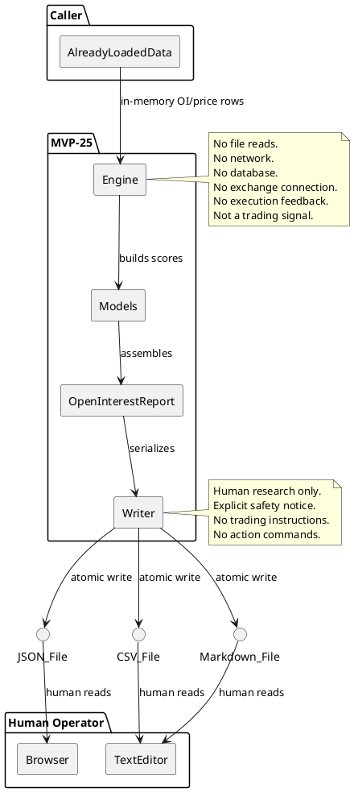
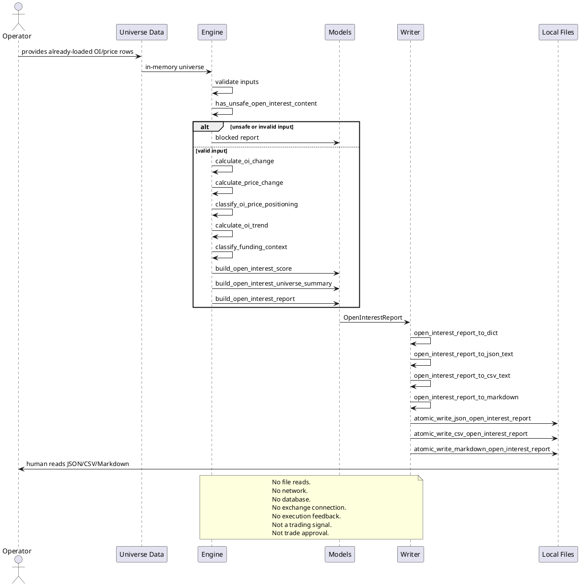

# SPEC-026-Open-Interest-Engine

## Background

MVP-24 delivered a local, deterministic Relative Strength Engine that compares coin performance against BTC and ETH benchmarks. While relative strength answers "which coin is outperforming?", it does not capture the positioning context behind the move. Open Interest (OI) is a standard, exchange-agnostic futures metric that describes the total number of outstanding derivative contracts. When paired with price changes, it can help a human auditor understand whether a price move is accompanied by expanding positions, contracting positions, or potentially unstable positioning.

The Open Interest Engine is therefore the natural next planning step after Relative Strength. It deliberately mirrors the safety-first, pure-function architecture of MVP-24: all inputs are already-loaded, local, in-memory values; the engine performs only deterministic arithmetic; and the output is a human-research/audit artifact. It is not a trading signal, not a trade or strategy approval, and not a portfolio/universe approval. It must never be consumed by execution, Freqtrade, order, exchange, or portfolio paths.

## Requirements

### Must Have (M)

- **M1:** Accept only already-loaded local/in-memory OI and price observations. Input is a sequence of `OpenInterestObservation` rows per pair. The engine never reads files, databases, or network endpoints.
- **M2:** Pair-level OI analysis: each input is one pair plus a time series of observations containing at minimum `timestamp`, `open_interest`, and `close`.
- **M3:** Compute OI changes over configurable lookback periods: default 1, 3, 7, 14.
- **M4:** Compute price changes over matching lookbacks.
- **M5:** Classify each pair into a positioning category: `PRICE_UP_OI_UP`, `PRICE_UP_OI_DOWN`, `PRICE_DOWN_OI_UP`, `PRICE_DOWN_OI_DOWN`, `MIXED`, `INSUFFICIENT_DATA`, or `BLOCKED`.
- **M6:** Classify each pair into an OI trend category: `EXPANDING`, `CONTRACTING`, `FLAT`, `UNSTABLE`, `INSUFFICIENT_DATA`, or `BLOCKED`.
- **M7:** Classify optional funding-like context: `POSITIVE`, `NEGATIVE`, `NEUTRAL`, `MISSING`, or `BLOCKED`.
- **M8:** Produce a deterministic total OI score in the range [0, 100] as a weighted combination of sub-scores. The score is research context only, not a trading signal.
- **M9:** Fail-closed on missing, invalid, or unsafe inputs. Missing/invalid inputs produce `INSUFFICIENT_DATA` or `BLOCKED` with explicit reason codes, never an inferred or partial "safe" score.
- **M10:** Include deterministic, priority-ordered reason codes for all blocking, insufficient-data, and advisory conditions.
- **M11:** Include data quality fields tracking expected vs. actual rows, missing rows, stale inputs, and minimum data quality thresholds.
- **M12:** Include safety flags that explicitly forbid live trading, real orders, leverage, shorting, execution feedback, exchange connectivity, and any runtime infrastructure.
- **M13:** No network, API, exchange, file, database, or runtime dependencies. The engine is pure in-memory computation over caller-provided values.
- **M14:** No trading signal, trade approval, strategy approval, execution approval, portfolio/universe approval, or Freqtrade integration semantics. Output is explicitly labeled as human research only.
- **M15:** Immutability: the engine must not mutate caller-provided input sequences, mappings, or observation objects.
- **M16:** Deterministic rounding policy: raw OI/price changes rounded to 8 decimal places, sub-scores to 4 decimal places, total score to 2 decimal places.
- **M17:** Deterministic output sorting: pairs sorted by state priority ascending (READY first), then total score descending, then pair ascending.

### Should Have (S)

- **S1:** Multi-window weighting with a documented default policy and an override vector in `OpenInterestConfig`.
- **S2:** Weight redistribution when 7d or 14d OI data is missing for a specific pair, using proportional redistribution.
- **S3:** Deterministic tie-breaking by pair when scores are identical.
- **S4:** Writer design for JSON, CSV, and Markdown output, including a deterministic report rendering with a research-only safety notice.
- **S5:** Atomic writes for the writer step: temp file + flush + fsync + `os.replace` + cleanup on failure.
- **S6:** Tests use `tmp_path` only for writer tests; engine tests never touch the filesystem.
- **S7:** A universe-level summary that reports the count of positioning categories, trend categories, average score over READY pairs, and top expanding/contracting pairs.

### Could Have (C)

- **C1:** Top-N and bottom-N helper functions for the universe summary.
- **C2:** A compact "human interpretation" sentence on each score object, e.g., "BTCUSDT shows expanding OI with price rising; positioning suggests new longs entering."

### Won't Have (W)

- **W1:** Binance API collector or any exchange data collector.
- **W2:** Live data, real-time streaming, WebSocket, or network connection.
- **W3:** Freqtrade integration, Freqtrade strategy class, or Freqtrade runtime connection.
- **W4:** Portfolio approval, universe rebalance, or position sizing.
- **W5:** Backtesting engine, walk-forward analysis, or simulation of PnL.
- **W6:** Altcoin discovery or automatic universe expansion.
- **W7:** CLI, Web UI, dashboard, API server, database, auth, or scheduler.
- **W8:** Trading signals, trade approval, execution readiness, or any claim that a high score permits trading.
- **W9:** File reads in the engine; data must be passed in-memory by the caller.
- **W10:** Runtime registry, indexer, crawler, event store, task runner, or feedback layer.

## Method

### Proposed Package Layout

```
src/hunter/
└── open_interest/
    ├── __init__.py          # Public API exports
    ├── models.py            # Enums, frozen dataclasses, reason codes, safety flags
    ├── engine.py            # Pure open-interest calculation functions
    └── writer.py            # JSON/CSV/Markdown serialization and atomic writes

tests/test_open_interest/
    ├── __init__.py
    ├── test_models.py       # Model validation, safety flags, reason codes
    ├── test_engine.py       # Pure calculation functions, fail-closed behavior
    ├── test_writer.py       # Serialization and atomic writes
    └── test_integration.py  # End-to-end flows and safety assertions
```

### Output Paths

- `data/open_interest/latest_open_interest_report.json`
- `data/open_interest/latest_open_interest_scores.csv`
- `reports/open_interest/latest_open_interest_report.md`

### Module Constants

```python
OPEN_INTEREST_VERSION = "1.0"
```

### Input Contracts

The engine consumes only caller-provided, already-loaded local values. Each pair is represented by a sequence of `OpenInterestObservation` rows. Each row must expose:

| Field | Type | Required |
|-------|------|----------|
| `timestamp` | `datetime` (timezone-aware) | Yes |
| `open_interest` | `float` | Yes |
| `close` | `float` | Yes |
| `funding_rate` | `float | None` | No |
| `metadata` | `Mapping[str, str]` | No |

The caller passes:

- `universe: Sequence[OpenInterestInput]` — one input per pair, carrying the pair name and the observation sequence.
- `config: OpenInterestConfig | None` — optional scoring and threshold configuration.
- `metadata: Mapping[str, str] | None` — optional opaque metadata for the report; never traversed, validated, or executed.

Input rows are ordered by `timestamp` ascending before any calculation. The engine creates a sorted copy; the caller's original sequence is never mutated.

### Models

All models are frozen dataclasses with immutable/copy-safe mappings. Tuples are used for ordered collections. Enums are string-valued for stable serialization.

#### `OpenInterestObservation`

```python
@dataclass(frozen=True)
class OpenInterestObservation:
    """A single OI/price observation row."""

    timestamp: datetime
    open_interest: float
    close: float
    funding_rate: float | None = None
    metadata: Mapping[str, str] = field(default_factory=dict)

    def __post_init__(self) -> None:
        # timestamp must be timezone-aware
        if self.timestamp.tzinfo is None:
            raise ValueError("timestamp must be timezone-aware")
        # open_interest must be finite and non-negative
        if not math.isfinite(self.open_interest) or self.open_interest < 0:
            raise ValueError("open_interest must be finite and >= 0")
        # close must be finite and positive
        if not math.isfinite(self.close) or self.close <= 0:
            raise ValueError("close must be finite and > 0")
        # funding_rate must be finite if present
        if self.funding_rate is not None and not math.isfinite(self.funding_rate):
            raise ValueError("funding_rate must be finite if present")
        # metadata is opaque local strings only; coerce to MappingProxyType
        object.__setattr__(self, "metadata", MappingProxyType(dict(self.metadata)))
```

#### `OpenInterestInput`

```python
@dataclass(frozen=True)
class OpenInterestInput:
    """A single pair with its already-loaded OI observation sequence."""

    pair: str
    rows: tuple[OpenInterestObservation, ...]
    metadata: Mapping[str, str] = field(default_factory=dict)

    def __post_init__(self) -> None:
        if not self.pair:
            raise ValueError("pair must be non-empty")
        # rows normalized to tuple
        object.__setattr__(self, "rows", tuple(self.rows))
        # metadata copied/immutable; no file/path behavior
        object.__setattr__(self, "metadata", MappingProxyType(dict(self.metadata)))
```

#### Enums

```python
class OpenInterestState(Enum):
    READY = "ready"
    INSUFFICIENT_DATA = "insufficient_data"
    BLOCKED = "blocked"

class OpenInterestPositioning(Enum):
    PRICE_UP_OI_UP = "price_up_oi_up"
    PRICE_UP_OI_DOWN = "price_up_oi_down"
    PRICE_DOWN_OI_UP = "price_down_oi_up"
    PRICE_DOWN_OI_DOWN = "price_down_oi_down"
    MIXED = "mixed"
    INSUFFICIENT_DATA = "insufficient_data"
    BLOCKED = "blocked"

class OpenInterestTrend(Enum):
    EXPANDING = "expanding"
    CONTRACTING = "contracting"
    FLAT = "flat"
    UNSTABLE = "unstable"
    INSUFFICIENT_DATA = "insufficient_data"
    BLOCKED = "blocked"

class OpenInterestFundingContext(Enum):
    POSITIVE = "positive"
    NEGATIVE = "negative"
    NEUTRAL = "neutral"
    MISSING = "missing"
    BLOCKED = "blocked"
```

#### `OpenInterestConfig`

```python
@dataclass(frozen=True)
class OpenInterestConfig:
    lookback_periods: tuple[int, ...] = (1, 3, 7, 14)
    positioning_threshold: float = 0.001
    oi_change_bounds: tuple[float, float] = (-0.30, 0.30)
    price_change_bounds: tuple[float, float] = (-0.20, 0.20)
    funding_rate_bounds: tuple[float, float] = (-0.01, 0.01)
    min_required_rows: int = 15
    block_on_missing_data: bool = False
    score_weights: Mapping[str, float] = field(default_factory=lambda: MappingProxyType({
        "oi_7d_change": 0.30,
        "oi_14d_change": 0.20,
        "price_oi_alignment": 0.20,
        "oi_trend_stability": 0.15,
        "funding_context": 0.05,
        "data_quality": 0.10,
    }))
    rounding_policy: str = "standard"
    version: str = "1.0"
```

Weights must sum to `1.0` (within floating-point tolerance of `1e-9`) and are validated at construction.

#### `OpenInterestSafetyFlags`

A frozen dataclass of boolean flags. Default values reflect the research-only stance. All `False`-default flags are validated to reject `True` in `__post_init__`:

- `human_research_only`: `True`
- `output_is_human_research_only`: `True`
- `output_not_trading_signal`: `True`
- `output_not_trade_approval`: `True`
- `output_not_strategy_approval`: `True`
- `output_not_execution_approval`: `True`
- `output_not_portfolio_approval`: `True`
- `output_not_universe_approval`: `True`
- `output_not_freqtrade_input`: `True`
- `output_not_order_input`: `True`
- `output_not_exchange_input`: `True`
- `no_action_commands_emitted`: `True`
- `inputs_already_loaded`: `True`
- `no_network_connection`: `True`
- `no_database_connection`: `True`
- `no_file_read_in_engine`: `True`
- `benchmarks_provided_by_caller`: `True`
- `file_write_enabled`: `False`
- `file_read_enabled`: `False`
- `network_enabled`: `False`
- `database_enabled`: `False`
- `event_store_enabled`: `False`
- `runtime_registry_enabled`: `False`
- `task_runner_enabled`: `False`
- `indexer_crawler_enabled`: `False`
- `feedback_into_execution`: `False`
- `feedback_into_strategy`: `False`
- `feedback_into_portfolio`: `False`
- `feedback_into_freqtrade`: `False`
- `leverage_enabled`: `False`
- `shorting_enabled`: `False`
- `real_orders_enabled`: `False`
- `live_trading_enabled`: `False`

#### `OpenInterestPeriodChange`

- `period`: `int`
- `oi_change`: `float | None`
- `price_change`: `float | None`
- `has_data`: `bool`
- `reason_codes`: `tuple[str, ...]`

#### `OpenInterestScore`

- `pair`: `str`
- `state`: `OpenInterestState`
- `positioning`: `OpenInterestPositioning`
- `trend`: `OpenInterestTrend`
- `funding_context`: `OpenInterestFundingContext`
- `total_score`: `float`
- `period_changes`: `tuple[OpenInterestPeriodChange, ...]`
- `latest_oi`: `float | None`
- `latest_price`: `float | None`
- `latest_funding_rate`: `float | None`
- `sub_scores`: `Mapping[str, float]`
- `data_quality`: `OpenInterestDataQuality`
- `human_note`: `str`
- `reason_codes`: `tuple[str, ...]`
- `metadata`: `Mapping[str, str]`

#### `OpenInterestDataQuality`

- `expected_rows`: `int`
- `actual_rows`: `int`
- `missing_rows`: `int`
- `min_required_rows_met`: `bool`
- `stale_input_count`: `int`
- `reason_codes`: `tuple[str, ...]`

#### `OpenInterestUniverseSummary`

- `total_pairs`: `int`
- `ready_count`: `int`
- `insufficient_data_count`: `int`
- `blocked_count`: `int`
- `expanding_count`: `int`
- `contracting_count`: `int`
- `flat_count`: `int`
- `unstable_count`: `int`
- `price_up_oi_up_count`: `int`
- `price_up_oi_down_count`: `int`
- `price_down_oi_up_count`: `int`
- `price_down_oi_down_count`: `int`
- `mixed_count`: `int`
- `average_total_score`: `float | None`
- `top_expanding_pair`: `str | None`
- `top_contracting_pair`: `str | None`
- `data_quality`: `OpenInterestDataQuality`
- `summary_narrative`: `str`
- `reason_codes`: `tuple[str, ...]`

The count invariant `ready_count + insufficient_data_count + blocked_count == total_pairs` must hold and is validated in `__post_init__`.

#### `OpenInterestReport`

- `report_id`: `str`
- `kind`: `str` — `"open_interest_report"`
- `version`: `str` — `"0.25.0-dev"`
- `source_spec`: `str` — `"SPEC-026"`
- `generated_at`: `datetime`
- `config`: `OpenInterestConfig`
- `safety_flags`: `OpenInterestSafetyFlags`
- `scores`: `tuple[OpenInterestScore, ...]`
- `universe_summary`: `OpenInterestUniverseSummary`
- `reason_codes`: `tuple[str, ...]`
- `metadata`: `Mapping[str, str]`

Fail-closed factory:

```python
@classmethod
def blocked(
    cls,
    *,
    reason_code: str,
    report_id: str = "blocked",
    generated_at: datetime | None = None,
    metadata: Mapping[str, str] | None = None,
) -> OpenInterestReport
```

### Forbidden Terms

The engine detects unsafe content via `has_unsafe_open_interest_content`, which checks all string values in inputs (pair names, metadata keys/values, observation metadata) against the following frozenset. Any match causes the pair or report to be classified `BLOCKED` with reason code `UNSAFE_OPEN_INTEREST_CONTENT`.

```python
FORBIDDEN_OPEN_INTEREST_TERMS: frozenset[str] = frozenset({
    "live_trade",
    "real_order",
    "leverage",
    "shorting",
    "execute",
    "place_order",
    "buy",
    "sell",
    "enter_long",
    "enter_short",
    "exit_long",
    "exit_short",
    "portfolio_approval",
    "universe_approval",
    "strategy_approval",
    "execution_approval",
    "trade_approval",
    "go_live",
    "production_ready",
    "binance",
    "exchange_api",
    "api_key",
    "secret",
    "deploy",
    "trigger",
    "submit",
    "task_runner",
    "event_store",
    "database",
    "web_ui",
    "dashboard",
})
```

The function accepts any value (`str`, `Mapping`, `OpenInterestInput`, `OpenInterestObservation`, etc.) and recursively checks all reachable strings.

### Reason Codes

Partitioned into three tiers. All reason codes are module-level string constants.

**Blocking** (`OPEN_INTEREST_BLOCKING_REASON_CODES`):

| Code | Constant | When |
|------|----------|------|
| `INVALID_PAIR` | `INVALID_PAIR` | Pair name is empty or contains unsafe terms |
| `INVALID_TIMESTAMP` | `INVALID_TIMESTAMP` | Observation timestamp is naive or out of range |
| `INVALID_OPEN_INTEREST` | `INVALID_OPEN_INTEREST` | OI is non-finite, negative, or otherwise invalid |
| `INVALID_PRICE_DATA` | `INVALID_PRICE_DATA` | Close price is non-finite, zero, or negative |
| `INSUFFICIENT_OI_DATA` | `INSUFFICIENT_OI_DATA` | Too few rows to meet min_required_rows and block_on_missing_data=True |
| `ZERO_DENOMINATOR` | `ZERO_DENOMINATOR` | Division by zero in period change calculation |
| `UNSAFE_OPEN_INTEREST_CONTENT` | `UNSAFE_OPEN_INTEREST_CONTENT` | Forbidden term detected in input |
| `BLOCKED_BY_SAFETY_FLAGS` | `BLOCKED_BY_SAFETY_FLAGS` | Safety flags would need to be True to proceed |

**Insufficient-data** (`OPEN_INTEREST_INSUFFICIENT_DATA_REASON_CODES`):

| Code | Constant | When |
|------|----------|------|
| `INSUFFICIENT_OI_DATA` | `INSUFFICIENT_OI_DATA` | Too few rows; block_on_missing_data=False |
| `PERIOD_DATA_MISSING` | `PERIOD_DATA_MISSING` | A specific lookback window lacks enough rows |
| `FUNDING_CONTEXT_MISSING` | `FUNDING_CONTEXT_MISSING` | funding_rate is None on all observations |

**Advisory** (`OPEN_INTEREST_ADVISORY_REASON_CODES`):

| Code | Constant | When |
|------|----------|------|
| `INPUTS_ALREADY_LOADED` | `INPUTS_ALREADY_LOADED` | Advisory: all inputs provided in-memory by caller |
| `NO_ACTION_COMMANDS_EMITTED` | `NO_ACTION_COMMANDS_EMITTED` | Advisory: no execution instructions in output |
| `HUMAN_RESEARCH_ONLY` | `HUMAN_RESEARCH_ONLY` | Advisory: output is research-only |
| `NO_NETWORK_CONNECTION` | `NO_NETWORK_CONNECTION` | Advisory: engine made no network calls |
| `NO_DATABASE_CONNECTION` | `NO_DATABASE_CONNECTION` | Advisory: engine made no database calls |
| `NO_FILE_READ_IN_ENGINE` | `NO_FILE_READ_IN_ENGINE` | Advisory: engine read no files |

**Union**: `OPEN_INTEREST_REASON_CODES` = blocking + insufficient-data + advisory.

### Engine Functions

- `build_open_interest_safety_flags() -> OpenInterestSafetyFlags`
- `has_unsafe_open_interest_content(value: Any) -> bool`
- `calculate_period_change(current: float, previous: float) -> float | None`
- `calculate_oi_change(rows: Sequence[OpenInterestObservation], period: int) -> float | None`
- `calculate_price_change(rows: Sequence[OpenInterestObservation], period: int) -> float | None`
- `classify_oi_price_positioning(oi_change: float | None, price_change: float | None, threshold: float) -> OpenInterestPositioning`
- `calculate_oi_trend(changes: Sequence[float | None], threshold: float) -> OpenInterestTrend`
- `classify_funding_context(funding_rate: float | None, bounds: tuple[float, float]) -> OpenInterestFundingContext`
- `normalized_score(value: float | None, lower_bound: float, upper_bound: float) -> float`
- `build_open_interest_score(input: OpenInterestInput, config: OpenInterestConfig) -> OpenInterestScore`
- `build_open_interest_universe_summary(scores: Sequence[OpenInterestScore], config: OpenInterestConfig) -> OpenInterestUniverseSummary`
- `build_open_interest_report(...) -> OpenInterestReport`

Full report signature:

```python
def build_open_interest_report(
    *,
    universe: Sequence[OpenInterestInput],
    config: OpenInterestConfig | None = None,
    report_id: str = "latest-open-interest",
    generated_at: datetime | None = None,
    metadata: Mapping[str, str] | None = None,
) -> OpenInterestReport:
    ...
```

If `generated_at` is omitted, `datetime.now(timezone.utc)` is used; callers should pass an explicit `generated_at` for deterministic tests.

#### `calculate_period_change(current: float, previous: float) -> float | None`

Compute fractional change: `(current - previous) / previous`. Returns `None` if `previous` is zero (emits `ZERO_DENOMINATOR`). Result rounded to 8 decimal places.

#### `calculate_oi_change(rows: Sequence[OpenInterestObservation], period: int) -> float | None`

Compute OI change over the last `period` rows. Returns `None` if fewer than `period + 1` rows are available.

#### `calculate_price_change(rows: Sequence[OpenInterestObservation], period: int) -> float | None`

Compute price change over the last `period` rows. Returns `None` if fewer than `period + 1` rows are available.

#### `build_open_interest_score(input: OpenInterestInput, config: OpenInterestConfig) -> OpenInterestScore`

Build steps:

1. Validate input (unsafe content, pair validity, observation validity).
2. Sort rows by timestamp ascending (copy, never mutate caller data).
3. Compute period changes for each configured lookback.
4. Classify positioning using the 7-period window (or the longest available window if 7 is not configured).
5. Calculate OI trend across all available windows.
6. Classify funding context from the latest observation's `funding_rate`.
7. Apply scoring weights to produce `total_score` in [0, 100].
8. Apply state mapping.
9. Build human note.
10. Build `OpenInterestDataQuality` and aggregate reason codes.

#### `build_open_interest_universe_summary(scores: Sequence[OpenInterestScore], config: OpenInterestConfig) -> OpenInterestUniverseSummary`

Aggregate scores into a universe summary. Count positioning/trend categories, compute average total score over `READY`-state pairs only, identify top expanding and top contracting pair by deterministic sort. Data quality reflects the worst individual pair data quality.

### Scoring Policy

Default weights:

| Component | Key | Weight | Formula |
|-----------|-----|--------|---------|
| 7-period OI change | `oi_7d_change` | 0.30 | `normalized_score(oi_change_7d, -0.30, 0.30)` |
| 14-period OI change | `oi_14d_change` | 0.20 | `normalized_score(oi_change_14d, -0.30, 0.30)` |
| Price/OI alignment | `price_oi_alignment` | 0.20 | See table below |
| OI trend stability | `oi_trend_stability` | 0.15 | See table below |
| Funding context | `funding_context` | 0.05 | See table below |
| Data quality | `data_quality` | 0.10 | `min(actual_rows / max(expected_rows, 1), 1.0) * 100.0` |

Weights are validated to sum to `1.0`. Total score is rounded to 2 decimal places and clamped to [0, 100].

#### `price_oi_alignment` sub-score

Based on the 7-period (or longest available) positioning classification. Measures the clarity of the combined price+OI signal, not its direction:

| Positioning | Score |
|-------------|-------|
| `PRICE_UP_OI_UP` | 80.0 |
| `PRICE_DOWN_OI_DOWN` | 80.0 |
| `PRICE_UP_OI_DOWN` | 60.0 |
| `PRICE_DOWN_OI_UP` | 60.0 |
| `MIXED` | 40.0 |
| `INSUFFICIENT_DATA` | 0.0 |
| `BLOCKED` | 0.0 |

#### `oi_trend_stability` sub-score

Measures the consistency of OI direction across windows. Clear directional trends score higher; unstable or absent trends score lower:

| Trend | Score |
|-------|-------|
| `EXPANDING` | 80.0 |
| `CONTRACTING` | 80.0 |
| `FLAT` | 50.0 |
| `UNSTABLE` | 30.0 |
| `INSUFFICIENT_DATA` | 0.0 |
| `BLOCKED` | 0.0 |

#### `funding_context` sub-score

Measures the presence and extremity of the funding-like signal:

| Funding context | Score |
|-----------------|-------|
| `POSITIVE` | 75.0 |
| `NEGATIVE` | 75.0 |
| `NEUTRAL` | 50.0 |
| `MISSING` | 50.0 |
| `BLOCKED` | 0.0 |

#### Weight Redistribution

When a specific pair's 7d or 14d OI change sub-score cannot be computed (data missing for that window), the missing component's weight is redistributed proportionally among available sub-scores for that pair only:

```
new_w_i = w_i + missing_weight * (w_i / sum(available_weights))
```

where `w_i` is each available weight, `missing_weight` is the weight of the missing component, and `sum(available_weights)` is the total of all non-missing weights. If all weights are missing, `total_score = 0.0`.

### Normalization

```python
def normalized_score(value: float | None, lower_bound: float, upper_bound: float) -> float:
    """Linearly clamp a value to [0, 100]."""
    if value is None:
        return 0.0
    if value <= lower_bound:
        return 0.0
    if value >= upper_bound:
        return 100.0
    return ((value - lower_bound) / (upper_bound - lower_bound)) * 100.0
```

Bounds:

| Metric | lower_bound | upper_bound |
|--------|-------------|-------------|
| OI change | -0.30 | 0.30 |
| Price change | -0.20 | 0.20 |
| Funding rate | -0.01 | 0.01 |

### Classification

Positioning classification uses `positioning_threshold` (default `0.001`), applied to the 7-period (or longest available) window:

- `PRICE_UP_OI_UP`: `price_change > threshold` and `oi_change > threshold`
- `PRICE_UP_OI_DOWN`: `price_change > threshold` and `oi_change < -threshold`
- `PRICE_DOWN_OI_UP`: `price_change < -threshold` and `oi_change > threshold`
- `PRICE_DOWN_OI_DOWN`: `price_change < -threshold` and `oi_change < -threshold`
- `MIXED`: otherwise
- `INSUFFICIENT_DATA`: when either change is `None` and state is insufficient
- `BLOCKED`: when state is blocked

OI trend classification uses the same threshold across all available windows:

- `EXPANDING`: majority (>50%) of available windows have `oi_change > threshold`
- `CONTRACTING`: majority (>50%) of available windows have `oi_change < -threshold`
- `FLAT`: all available windows are within `[-threshold, threshold]`
- `UNSTABLE`: mixed signs beyond threshold (not majority in any direction, not all flat)
- `INSUFFICIENT_DATA`: fewer than 2 available windows
- `BLOCKED`: state is blocked

Funding context classification from the latest observation's `funding_rate`:

- `POSITIVE`: `funding_rate > upper_bound / 3`
- `NEGATIVE`: `funding_rate < lower_bound / 3`
- `NEUTRAL`: within `[-upper_bound/3, upper_bound/3]` (inclusive)
- `MISSING`: `funding_rate is None`
- `BLOCKED`: state is blocked

### State Mapping

State is determined first, then positioning/trend/funding are derived from the state:

1. **Determine state:**
   - `BLOCKED` if any blocking reason code is present (unsafe content, invalid input, `block_on_missing_data=True` with insufficient rows, etc.).
   - `INSUFFICIENT_DATA` if the data quality does not meet the minimum threshold and no blocking reason code is present.
   - `READY` if all validation passes and sufficient data is available.

2. **Derive categories from state:**
   - `READY` state may map to any positioning category except `INSUFFICIENT_DATA` and `BLOCKED`.
   - `INSUFFICIENT_DATA` state maps to `INSUFFICIENT_DATA` positioning, trend, and funding context.
   - `BLOCKED` state maps to `BLOCKED` positioning, trend, and funding context.

#### Per-state field values

| Field | READY | INSUFFICIENT_DATA | BLOCKED |
|-------|-------|-------------------|---------|
| `total_score` | computed [0, 100] | `0.0` | `0.0` |
| `positioning` | computed | `INSUFFICIENT_DATA` | `BLOCKED` |
| `trend` | computed | `INSUFFICIENT_DATA` | `BLOCKED` |
| `funding_context` | computed | `INSUFFICIENT_DATA` | `BLOCKED` |
| `latest_oi` | last row's OI | last row's OI or `None` | `None` |
| `latest_price` | last row's close | last row's close or `None` | `None` |
| `latest_funding_rate` | last row's funding_rate | last row's funding_rate or `None` | `None` |
| `sub_scores` | computed | `{}` | `{}` |
| `human_note` | generated | explains missing-data condition | explains blocked condition |
| `reason_codes` | computed | includes `INSUFFICIENT_OI_DATA` or `PERIOD_DATA_MISSING` | includes blocking reason |

### `block_on_missing_data` Interaction

When `config.block_on_missing_data` is `True` and a pair has fewer rows than `config.min_required_rows`:

- The pair **appears** in the report with `state = BLOCKED`.
- `positioning = BLOCKED`, `trend = BLOCKED`, `funding_context = BLOCKED`.
- `total_score = 0.0`.
- `reason_codes` includes `INSUFFICIENT_OI_DATA`.
- `human_note` explains: "Pair BLOCKED due to insufficient data (N rows provided, M required)."

When `config.block_on_missing_data` is `False` (default):

- The pair appears with `state = INSUFFICIENT_DATA`.
- `total_score = 0.0`.
- `reason_codes` includes `INSUFFICIENT_OI_DATA` and/or `PERIOD_DATA_MISSING`.

### Human Note Generation

Notes are deterministic, single-sentence strings per state:

| State | Note pattern |
|-------|-------------|
| `READY` | `f"{pair} shows {trend.value} OI with {positioning.value} positioning; total research score {total_score:.2f}."` |
| `INSUFFICIENT_DATA` | `f"{pair} has insufficient data ({actual_rows} rows provided, {min_required_rows} required)."` |
| `BLOCKED` | `f"{pair} is blocked due to unsafe or invalid input."` or `f"{pair} is blocked due to insufficient data ({actual_rows} rows provided, {min_required_rows} required)."` |

### Data Quality Validation

For any report or score:

- `total_pairs >= 0`
- `ready_count + insufficient_data_count + blocked_count == total_pairs`
- `expected_rows >= 0`
- `actual_rows >= 0`
- `missing_rows == max(0, expected_rows - actual_rows)`
- No negative counts
- `min_required_rows_met` is `True` iff `actual_rows >= min_required_rows`

### Determinism

The engine must produce identical outputs for identical inputs:

- Input rows are ordered by timestamp ascending before any calculation (sorted copy; original never mutated).
- Pairs are sorted by state priority ascending (READY=0, INSUFFICIENT_DATA=1, BLOCKED=2), then total score descending, then pair ascending.
- Floating-point results are rounded to a fixed precision before being used in downstream calculations or serialized.
- Default rounding policy:
  - Raw OI/price changes: 8 decimal places.
  - Sub-scores: 4 decimal places.
  - Total score: 2 decimal places.
- Inputs are never mutated. If normalization is needed, a new sequence is created.
- `OpenInterestScore` is frozen; any later-computed field (e.g., total_score after weight redistribution) is filled by constructing a replacement via `dataclasses.replace(...)`.

### Writer Functions

#### `open_interest_report_to_dict(report: OpenInterestReport) -> dict[str, Any]`

Serialize the report to a JSON-safe dict. Datetimes become ISO-8601 strings; enums become their `.value`; tuples become lists; floats are rounded per the rounding policy. Mappings are serialized as plain dicts sorted by key. No secrets, no trading instructions, no operational instructions.

#### `open_interest_report_to_json_text(report: OpenInterestReport) -> str`

Return a JSON text representation with `sort_keys=True`, `indent=2`, `ensure_ascii=False`, and a trailing newline for deterministic output.

#### `open_interest_report_to_csv_text(report: OpenInterestReport) -> str`

Return a CSV text representation with deterministic column ordering and a trailing newline. Columns:

| # | Column | Source | None handling |
|---|--------|--------|---------------|
| 1 | `report_id` | report.report_id | — |
| 2 | `generated_at` | ISO-8601 | — |
| 3 | `pair` | score.pair | — |
| 4 | `state` | score.state.value | — |
| 5 | `positioning` | score.positioning.value | — |
| 6 | `trend` | score.trend.value | — |
| 7 | `funding_context` | score.funding_context.value | — |
| 8 | `total_score` | score.total_score | — |
| 9 | `oi_change_1d` | period_changes where period=1 | empty string |
| 10 | `oi_change_3d` | period_changes where period=3 | empty string |
| 11 | `oi_change_7d` | period_changes where period=7 | empty string |
| 12 | `oi_change_14d` | period_changes where period=14 | empty string |
| 13 | `price_change_1d` | period_changes where period=1 | empty string |
| 14 | `price_change_3d` | period_changes where period=3 | empty string |
| 15 | `price_change_7d` | period_changes where period=7 | empty string |
| 16 | `price_change_14d` | period_changes where period=14 | empty string |
| 17 | `latest_oi` | score.latest_oi | empty string |
| 18 | `latest_price` | score.latest_price | empty string |
| 19 | `latest_funding_rate` | score.latest_funding_rate | empty string |
| 20 | `reason_codes` | score.reason_codes | pipe-delimited (`|`) |
| 21 | `human_note` | score.human_note | — |

One row per `OpenInterestScore`. Missing `None` values serialized as empty string.

#### `open_interest_report_to_markdown(report: OpenInterestReport) -> str`

Render a Markdown report with the following sections in order:

1. **H1 title**: `# Open Interest Report`
2. **Safety notice** (immediately after H1, as a blockquote): Explicit research-only notice. Example text:

   > This local open interest report is a human-audit / research-only artifact. It is not a trading signal, not trade approval, not strategy approval, not execution approval, not portfolio/universe approval, and not Freqtrade input. It must not be consumed by execution, strategy, Freqtrade shell, order, exchange, or any MVP execution path. No action commands, trading instructions, or order suggestions are emitted.

3. **Report Info**: `report_id`, `generated_at`, `version`, `source_spec`, `kind`.
4. **Universe Summary**: Total pairs, ready/insufficient/blocked counts, positioning counts, trend counts, average score, top expanding pair, top contracting pair, summary narrative.
5. **Data Quality**: Expected/actual/missing rows, min required rows met, stale input count, reason codes.
6. **Scores**: A table with columns: pair, state, positioning, trend, funding_context, total_score, oi_change_7d, price_change_7d, reason_codes, human_note. One row per score, deterministically sorted.
7. **Reason Codes**: List of all report-level reason codes.
8. **Safety Flags**: All safety flags listed as key-value pairs, sorted by key.

No trading/order/execution/approval language beyond the safety disclaimer.

#### Atomic writers and combined writer

```python
def atomic_write_json_open_interest_report(
    report: OpenInterestReport,
    path: str | Path | None = None,
) -> Path

def atomic_write_csv_open_interest_report(
    report: OpenInterestReport,
    path: str | Path | None = None,
) -> Path

def atomic_write_markdown_open_interest_report(
    report: OpenInterestReport,
    path: str | Path | None = None,
) -> Path

def write_open_interest_report(
    report: OpenInterestReport,
    json_path: str | Path | None = None,
    csv_path: str | Path | None = None,
    md_path: str | Path | None = None,
) -> tuple[Path | None, Path | None, Path | None]
```

Default paths:

```python
DEFAULT_JSON_PATH = Path("data/open_interest/latest_open_interest_report.json")
DEFAULT_CSV_PATH = Path("data/open_interest/latest_open_interest_scores.csv")
DEFAULT_MD_PATH = Path("reports/open_interest/latest_open_interest_report.md")
```

All atomic writers use: temp file → write → flush → fsync → `os.replace` → cleanup on failure. Parent directories are created as needed. The writer does not read existing output content.

## Safety

### Explicit Non-Goals

The Open Interest Engine is explicitly **not** any of the following:

- Not a trading signal.
- Not trade approval.
- Not strategy approval.
- Not execution approval.
- Not portfolio construction or universe approval.
- Not Freqtrade input or a Freqtrade strategy class.
- Not an exchange connector, API client, or data collector.
- Not a live data feed or real-time streaming system.
- Not a backtester, simulator, or PnL calculator.
- Not a Web UI, dashboard, database, API server, auth system, scheduler, crawler, indexer, runtime registry, event store, or task runner.
- Not a validator of external files or paths.
- Not a repair/normalization layer for bad market data.
- Not a source of action commands, order suggestions, or execution instructions.

### Safety Invariants

1. **Read-only input:** The engine never modifies caller-provided data.
2. **No file reads:** The engine is built from in-memory values only.
3. **No path traversal:** File paths, if any, are passed only to the writer and are never validated, opened, or followed by the engine.
4. **No network:** No HTTP, WebSocket, or TCP calls.
5. **No database:** No SQL, NoSQL, or persistence layer.
6. **No execution feedback:** Output never feeds back into execution, strategy, Freqtrade, order, exchange, portfolio, or any MVP execution path.
7. **No trading logic:** No decisions, approvals, or signals. Output is labeled as human research only.
8. **No secrets:** Output must not contain API keys, credentials, or executable trading instructions.
9. **Atomic writes:** Temp file + fsync + `os.replace` + cleanup on failure.
10. **Human-research only:** Markdown includes explicit safety notice immediately after H1.
11. **Fail-closed:** Missing/invalid inputs produce blocked or insufficient-data outputs with reason codes, never a falsely safe score.
12. **Deterministic:** Same inputs → same output, every time.
13. **No runtime infrastructure:** No registry, indexer, crawler, scheduler, routing layer, event store, or task runner behavior.
14. **No live data:** No real-time prices, no market data subscriptions, no exchange connections.
15. **No leverage/shorting:** Safety flags explicitly default these to False and reject True values.

## PlantUML Component Diagram



## PlantUML Sequence Diagram



## Implementation

### MVP-25 Step 1 — Open Interest Models and Engine

Allowed files:
- `src/hunter/open_interest/__init__.py`
- `src/hunter/open_interest/models.py`
- `src/hunter/open_interest/engine.py`
- `tests/test_open_interest/__init__.py`
- `tests/test_open_interest/test_models.py`
- `tests/test_open_interest/test_engine.py`

Stop conditions:
- All enums and frozen dataclasses defined with validation.
- All safety flags fail-closed and validated.
- Reason code constants defined and partitioned.
- Forbidden terms frozenset defined and `has_unsafe_open_interest_content` implemented.
- All engine functions implemented and unit-tested.
- Package tests pass.
- No forbidden imports, no file reads, no network calls.

Target: ~120 model/engine tests.

### MVP-25 Step 2 — Open Interest Writer

Allowed files:
- `src/hunter/open_interest/writer.py`
- `src/hunter/open_interest/__init__.py` (exports only)
- `tests/test_open_interest/test_writer.py`

Stop conditions:
- JSON, CSV, and Markdown serialization functions implemented.
- Atomic write helpers implemented and tested.
- Safety notice appears immediately after H1 in Markdown.
- Writer tests pass.
- No production path writes in tests.

Target: ~60 writer tests.

### MVP-25 Step 3 — Open Interest Integration Tests

Allowed files:
- `tests/test_open_interest/test_integration.py`
- Read-only access to `specs/SPEC-026-Open-Interest-Engine.md`

Stop conditions:
- End-to-end happy path from in-memory data to written JSON/CSV/Markdown.
- Insufficient-data paths tested.
- Blocked/unsafe-input paths tested.
- Deterministic sorting and rounding tested.
- No file reads, no network, no production writes, no Freqtrade/exchange references.
- Full focused package tests pass.

Target: ~80 integration tests.

### MVP-25 Step 4 — Final Validation and Version Bump

Allowed files:
- `pyproject.toml`
- `src/hunter/__init__.py`
- `CHANGELOG.md`
- `docs/handoff/CURRENT_STATE.md`
- `tasks/active.md`
- `tasks/agent-log.md`

Stop conditions:
- Full test suite passes with no regressions.
- Version bumped to `0.25.0-dev`.
- Memory/docs updated.
- Safety invariants verified.
- Whole MVP-25 review approved.

## Milestones

1. **MVP-25 Step 1 complete:** `src/hunter/open_interest/` package has models and engine, all model/engine tests pass, no unsafe imports, no file I/O in engine.
2. **MVP-25 Step 2 complete:** Writer with JSON/CSV/Markdown and atomic writes, all writer tests pass, safety notice in Markdown.
3. **MVP-25 Step 3 complete:** Integration tests pass, fail-closed paths verified, deterministic outputs verified, no network/exchange/file/db behavior.
4. **MVP-25 Step 4 complete:** Full suite passes, version bumped to `0.25.0-dev`, documentation updated, next phase set to MVP-26 planning.

## Gathering Results

### Test Plan

| Test Category | Target Count | Coverage |
|---------------|-------------|----------|
| Model validation | 50 | All enums, frozen dataclasses, safety flags, reason codes, forbidden terms, data quality |
| Engine functions | 70 | Period changes, OI/price changes, positioning classification, trend classification, funding context, scoring, state mapping, weight redistribution |
| Writer functions | 60 | JSON/CSV/Markdown serialization, atomic writes, safety notice, default paths |
| Integration | 80 | End-to-end flows, fail-closed paths, determinism, safety assertions |
| **Total** | **~260** | |

### Expected Full Suite Count

Current: ~4628 tests (MVP-0 through MVP-24).
Expected after MVP-25: ~4888 tests.

### Evaluation Metrics

- Focused open interest tests pass.
- Full suite passes with no regressions.
- Outputs are deterministic for identical inputs.
- Inputs are never mutated.
- No unsafe imports (network, exchange, database, Freqtrade, etc.).
- No file reads in engine.
- No network calls.
- No database connections.
- Markdown output clearly states human-research-only interpretation.
- No trading/approval/execution semantics in output.

## Need Professional Help in Developing Your Architecture?

Please contact me at [sammuti.com](https://sammuti.com) :)

---

**Document metadata:**
- **Version:** 1.0-draft
- **Date:** 2026-07-02
- **Author:** WrongStack
- **Status:** Draft — awaiting human review before implementation.
- **Next step:** Human approval → MVP-25 Step 1 implementation.