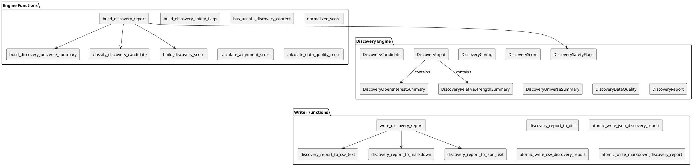
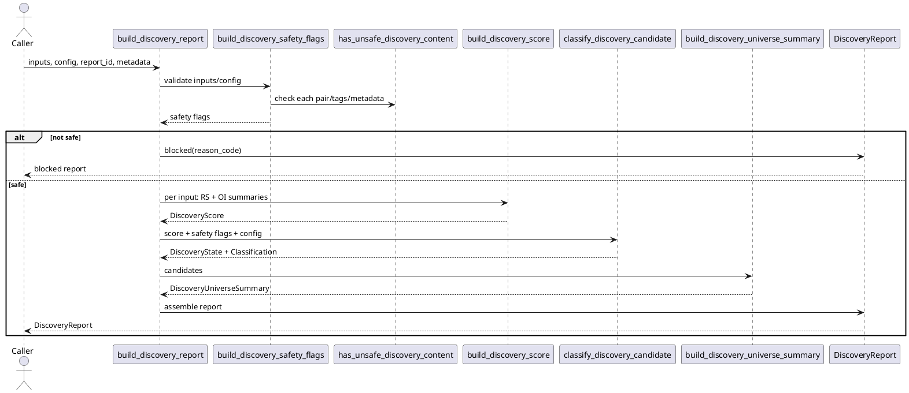

# SPEC-027-Discovery-Engine

## Background

Discovery follows the **Relative Strength Engine** (MVP-24) and the **Open Interest Engine** (MVP-25) because those engines produce the local, in-memory research summaries that the Discovery Engine consumes. Neither engine is a trading signal generator; each is a deterministic research context layer. The Discovery Engine exists to **combine** those contexts into a single human-research candidate view.

A single metric is dangerous for research. Relative strength can look strong while open-interest positioning warns against further investigation. Open-interest trend can be supportive while relative strength is absent. Discovery must therefore combine multiple research contexts, surface alignment or contradiction, and provide **deterministic reason codes** so a human can audit every inclusion and exclusion.

Discovery is explicitly **human-research-only**. It does not approve trades, universes, portfolios, strategies, or execution. It does not emit action commands, suggest orders, or feed Freqtrade. The output is a report that a human reads before deciding whether to do more research.

Deterministic reason-code based inclusion/exclusion is required for auditability because any dropped pair, blocked candidate, or promoted candidate must be traceable to a named rule, a safety flag, and a source context. Silent failures are not allowed.

## Requirements

### Must include

- Accept already-loaded local/in-memory report-like objects or score summaries only.
- Support pair-level discovery scoring.
- Combine Relative Strength context and Open Interest context.
- Allow optional additional local context fields via `metadata` and `tags`, but do not fetch them.
- Produce candidate states:
  - `CANDIDATE`
  - `WATCHLIST`
  - `EXCLUDED`
  - `INSUFFICIENT_DATA`
  - `BLOCKED`
- Produce discovery classifications:
  - `STRONG_RESEARCH_CANDIDATE`
  - `MODERATE_RESEARCH_CANDIDATE`
  - `WATCHLIST_ONLY`
  - `EXCLUDED_BY_FILTERS`
  - `INSUFFICIENT_DATA`
  - `BLOCKED`
- Produce deterministic discovery score `0.0-100.0` for human research only.
- Include reason codes for every candidate.
- Include data quality fields.
- Include safety flags.
- Fail closed on missing pair id, unsafe strings, invalid scores, inconsistent states, insufficient inputs.
- No network/API/exchange/file/db/runtime dependencies in the engine.
- No trading signal or approval semantics.
- Never silently drop input pairs; excluded/blocked/insufficient pairs must remain visible in the report.

### Should include

- Configurable weighting:
  - relative strength score
  - open interest score
  - alignment score
  - data quality score
- Deterministic ordering by state priority, score descending, pair ascending.
- Explicit inclusion/exclusion filters.
- Writer JSON/CSV/Markdown output design.
- Atomic writes for writer step.
- `tmp_path`-only tests.
- Universe summary over candidate states.

### Could include

- Human-readable candidate notes.
- Top candidate helper.
- Filter diagnostics.
- Optional tags supplied by caller.

### Won't include

- Binance API collector.
- Live data.
- Exchange integrations.
- Freqtrade integration.
- Portfolio approval.
- Backtesting.
- CLI.
- Dashboard/API/database.
- Any actual buy/sell/hold recommendation.


## Method

### Proposed package

- `src/hunter/discovery/`

### Proposed files

- `src/hunter/discovery/__init__.py`
- `src/hunter/discovery/models.py`
- `src/hunter/discovery/engine.py`
- `src/hunter/discovery/writer.py`

### Proposed tests

- `tests/test_discovery/test_models.py`
- `tests/test_discovery/test_engine.py`
- `tests/test_discovery/test_writer.py`
- `tests/test_discovery/test_integration.py`

### Proposed outputs

- `data/discovery/latest_discovery_report.json`
- `data/discovery/latest_discovery_candidates.csv`
- `reports/discovery/latest_discovery_report.md`

### Models

All models are frozen `@dataclass(frozen=True)` unless otherwise noted.

```python
DISCOVERY_VERSION: str = "0.26.0-dev"


class DiscoveryState(Enum):
    CANDIDATE = "CANDIDATE"
    WATCHLIST = "WATCHLIST"
    EXCLUDED = "EXCLUDED"
    INSUFFICIENT_DATA = "INSUFFICIENT_DATA"
    BLOCKED = "BLOCKED"


class DiscoveryClassification(Enum):
    STRONG_RESEARCH_CANDIDATE = "STRONG_RESEARCH_CANDIDATE"
    MODERATE_RESEARCH_CANDIDATE = "MODERATE_RESEARCH_CANDIDATE"
    WATCHLIST_ONLY = "WATCHLIST_ONLY"
    EXCLUDED_BY_FILTERS = "EXCLUDED_BY_FILTERS"
    INSUFFICIENT_DATA = "INSUFFICIENT_DATA"
    BLOCKED = "BLOCKED"


class DiscoveryInputKind(Enum):
    SUMMARY = "SUMMARY"
    RELATIVE_STRENGTH = "RELATIVE_STRENGTH"
    OPEN_INTEREST = "OPEN_INTEREST"


@dataclass(frozen=True)
class DiscoveryConfig:
    require_relative_strength: bool = True
    require_open_interest: bool = True
    block_on_blocked_context: bool = True
    block_on_missing_context: bool = False
    include_excluded_candidates: bool = True
    min_relative_strength_score: float = 60.0
    min_open_interest_score: float = 50.0
    strong_candidate_score: float = 75.0
    moderate_candidate_score: float = 60.0
    watchlist_score: float = 45.0
    score_weights: Mapping[str, float] = field(
        default_factory=lambda: {
            "relative_strength_score": 0.35,
            "open_interest_score": 0.25,
            "alignment_score": 0.20,
            "data_quality_score": 0.10,
            "filter_bonus_score": 0.10,
        }
    )

    def __post_init__(self):
        # weights must sum to 1.0, each in [0, 1]
        pass


@dataclass(frozen=True)
class DiscoverySafetyFlags:
    has_unsafe_content: bool = False
    has_invalid_pair: bool = False
    has_invalid_score: bool = False
    has_blocked_context: bool = False
    has_missing_required_context: bool = False
    has_inconsistent_state: bool = False
    no_action_commands_emitted: bool = True
    no_network_connection: bool = True
    no_file_read_in_engine: bool = True

    @property
    def is_safe(self) -> bool:
        return not any(
            [
                self.has_unsafe_content,
                self.has_invalid_pair,
                self.has_invalid_score,
                self.has_blocked_context,
                self.has_missing_required_context,
                self.has_inconsistent_state,
            ]
        )


@dataclass(frozen=True)
class DiscoveryRelativeStrengthSummary:
    pair: str
    state: str
    decision: str
    total_score: float | None
    rank_percentile_30d: float | None = None
    reason_codes: tuple[str, ...] = ()
    metadata: Mapping[str, str] = field(default_factory=dict)


@dataclass(frozen=True)
class DiscoveryOpenInterestSummary:
    pair: str
    state: str
    positioning: str
    trend: str
    funding_context: str
    total_score: float | None
    reason_codes: tuple[str, ...] = ()
    metadata: Mapping[str, str] = field(default_factory=dict)


@dataclass(frozen=True)
class DiscoveryInput:
    pair: str
    input_kind: DiscoveryInputKind = DiscoveryInputKind.SUMMARY
    relative_strength: DiscoveryRelativeStrengthSummary | None = None
    open_interest: DiscoveryOpenInterestSummary | None = None
    tags: tuple[str, ...] = ()
    metadata: Mapping[str, str] = field(default_factory=dict)


@dataclass(frozen=True)
class DiscoveryScore:
    relative_strength_score: float
    open_interest_score: float
    alignment_score: float
    data_quality_score: float
    filter_bonus_score: float
    total_score: float
    reason_codes: tuple[str, ...]


@dataclass(frozen=True)
class DiscoveryUniverseSummary:
    total_inputs: int
    candidate_count: int
    watchlist_count: int
    excluded_count: int
    insufficient_data_count: int
    blocked_count: int
    ready_context_count: int
    missing_context_count: int
    blocked_context_count: int

    def __post_init__(self):
        # total_inputs == sum of state counts
        # no negative counts
        pass


@dataclass(frozen=True)
class DiscoveryDataQuality:
    total_inputs: int
    pairs_with_both_contexts: int
    pairs_with_missing_relative_strength: int
    pairs_with_missing_open_interest: int
    pairs_with_blocked_context: int
    pairs_with_insufficient_context: int
    reason_codes: tuple[str, ...]


@dataclass(frozen=True)
class DiscoveryCandidate:
    pair: str
    state: DiscoveryState
    classification: DiscoveryClassification
    score: DiscoveryScore
    relative_strength: DiscoveryRelativeStrengthSummary | None
    open_interest: DiscoveryOpenInterestSummary | None
    reason_codes: tuple[str, ...]
    tags: tuple[str, ...]
    metadata: Mapping[str, str]


@dataclass(frozen=True)
class DiscoveryReport:
    report_id: str
    version: str
    generated_at: datetime
    config: DiscoveryConfig
    inputs: tuple[DiscoveryInput, ...]
    candidates: tuple[DiscoveryCandidate, ...]
    universe_summary: DiscoveryUniverseSummary
    data_quality: DiscoveryDataQuality
    safety_flags: DiscoverySafetyFlags
    reason_codes: tuple[str, ...]
    metadata: Mapping[str, str]

    @classmethod
    def blocked(
        cls,
        *,
        reason_code: str,
        report_id: str = "blocked",
        generated_at: datetime | None = None,
        metadata: Mapping[str, str] | None = None,
    ) -> "DiscoveryReport":
        ...
```

### Validation

- `pair` must be non-empty and contain only safe characters (no control characters, no path separators, no URL-like prefixes).
- `total_score` fields are `None` or finite floats in `[0.0, 100.0]`.
- `pair` ids across summaries must match `DiscoveryInput.pair` if present.
- `reason_codes` normalized to `tuple[str, ...]` and deduplicated.
- `tags` normalized to `tuple[str, ...]` and deduplicated.
- `metadata` copied and treated as immutable opaque strings; no file/path behavior.
- No file reads in the engine.
- No production data reads.
- No database access.

### Reason codes

```python
DISCOVERY_BLOCKING_REASON_CODES: frozenset[str] = frozenset(
    {
        "INVALID_PAIR",
        "INVALID_DISCOVERY_SCORE",
        "UNSAFE_DISCOVERY_CONTENT",
        "RELATIVE_STRENGTH_BLOCKED",
        "OPEN_INTEREST_BLOCKED",
    }
)

DISCOVERY_INSUFFICIENT_DATA_REASON_CODES: frozenset[str] = frozenset(
    {
        "MISSING_RELATIVE_STRENGTH_CONTEXT",
        "MISSING_OPEN_INTEREST_CONTEXT",
        "RELATIVE_STRENGTH_INSUFFICIENT_DATA",
        "OPEN_INTEREST_INSUFFICIENT_DATA",
    }
)

DISCOVERY_FILTER_REASON_CODES: frozenset[str] = frozenset(
    {
        "LOW_RELATIVE_STRENGTH_SCORE",
        "LOW_OPEN_INTEREST_SCORE",
        "MISALIGNED_CONTEXT",
        "PASSED_DISCOVERY_FILTERS",
    }
)

DISCOVERY_ADVISORY_REASON_CODES: frozenset[str] = frozenset(
    {
        "HUMAN_RESEARCH_ONLY",
        "NO_NETWORK_CONNECTION",
        "NO_FILE_READ_IN_ENGINE",
        "NO_ACTION_COMMANDS_EMITTED",
        "ALIGNED_CONTEXT",
        "MIXED_ALIGNMENT",
    }
)

DISCOVERY_REASON_CODES: frozenset[str] = (
    DISCOVERY_BLOCKING_REASON_CODES
    | DISCOVERY_INSUFFICIENT_DATA_REASON_CODES
    | DISCOVERY_FILTER_REASON_CODES
    | DISCOVERY_ADVISORY_REASON_CODES
)
```

Complete list of reason codes with meaning:

| Code | Meaning |
|------|---------|
| `INVALID_PAIR` | Empty, malformed, or unsafe pair id. |
| `INVALID_DISCOVERY_SCORE` | Score outside `[0, 100]`, non-finite, or type error. |
| `UNSAFE_DISCOVERY_CONTENT` | Pair, tag, or metadata contains a forbidden term. |
| `MISSING_RELATIVE_STRENGTH_CONTEXT` | Required RS context is absent. |
| `MISSING_OPEN_INTEREST_CONTEXT` | Required OI context is absent. |
| `RELATIVE_STRENGTH_BLOCKED` | RS context state is blocked. |
| `OPEN_INTEREST_BLOCKED` | OI context state is blocked. |
| `RELATIVE_STRENGTH_INSUFFICIENT_DATA` | RS context reports insufficient data. |
| `OPEN_INTEREST_INSUFFICIENT_DATA` | OI context reports insufficient data. |
| `LOW_RELATIVE_STRENGTH_SCORE` | RS score below `min_relative_strength_score`. |
| `LOW_OPEN_INTEREST_SCORE` | OI score below `min_open_interest_score`. |
| `MISALIGNED_CONTEXT` | RS and OI contexts contradict or are not supportive. |
| `PASSED_DISCOVERY_FILTERS` | Pair passed all configured filters. |
| `HUMAN_RESEARCH_ONLY` | Result is for human research, not trading. |
| `NO_NETWORK_CONNECTION` | Engine performed no network activity. |
| `NO_FILE_READ_IN_ENGINE` | Engine performed no file reads. |
| `NO_ACTION_COMMANDS_EMITTED` | Engine emitted no action commands. |
| `ALIGNED_CONTEXT` | RS and OI contexts are mutually supportive (advisory/informational only). |
| `MIXED_ALIGNMENT` | RS and OI contexts are partially aligned but not fully supportive (advisory/informational only). |

### Forbidden terms

```python
FORBIDDEN_DISCOVERY_TERMS: frozenset[str] = frozenset(
    {
        # trading / execution
        "buy",
        "sell",
        "order",
        "trade",
        "trading",
        "position",
        "execute",
        "execution",
        "signal",
        "entry",
        "exit",
        "stop loss",
        "take profit",
        "leverage",
        # Freqtrade
        "freqtrade",
        "strategy",
        "hyperopt",
        "backtest",
        # exchange / network
        "exchange",
        "binance",
        "api",
        "api key",
        "live",
        "real-time",
        "websocket",
        "candle",
        # action commands
        "action",
        "command",
        "instruction",
    }
)
```

Unsafe content detection checks **only** local strings, mappings, tags, and pairs. It does not open files, validate paths, follow paths, read files, or call the network.

### Engine functions

```python
def build_discovery_safety_flags(
    inputs: Sequence[DiscoveryInput],
    config: DiscoveryConfig,
) -> DiscoverySafetyFlags:
    ...


def has_unsafe_discovery_content(
    pair: str,
    tags: Sequence[str],
    metadata: Mapping[str, str],
    forbidden_terms: frozenset[str] = FORBIDDEN_DISCOVERY_TERMS,
) -> bool:
    ...


def normalized_score(value: float | None) -> float:
    """Return finite value in [0, 100] or 0.0 for None/invalid."""
    ...


def calculate_alignment_score(
    rs: DiscoveryRelativeStrengthSummary | None,
    oi: DiscoveryOpenInterestSummary | None,
) -> float:
    ...


def calculate_data_quality_score(
    rs: DiscoveryRelativeStrengthSummary | None,
    oi: DiscoveryOpenInterestSummary | None,
) -> float:
    ...


def classify_discovery_candidate(
    score: DiscoveryScore,
    safety_flags: DiscoverySafetyFlags,
    config: DiscoveryConfig,
    reason_codes: Sequence[str],
) -> tuple[DiscoveryState, DiscoveryClassification]:
    ...


def build_discovery_score(
    *,
    rs: DiscoveryRelativeStrengthSummary | None,
    oi: DiscoveryOpenInterestSummary | None,
    config: DiscoveryConfig,
) -> DiscoveryScore:
    ...


def build_discovery_universe_summary(
    candidates: Sequence[DiscoveryCandidate],
) -> DiscoveryUniverseSummary:
    ...


def build_discovery_report(
    *,
    inputs: Sequence[DiscoveryInput],
    config: DiscoveryConfig | None = None,
    report_id: str = "latest-discovery",
    generated_at: datetime | None = None,
    metadata: Mapping[str, str] | None = None,
) -> DiscoveryReport:
    ...
```

### Fail-closed factory

```python
@classmethod
def blocked(
    cls,
    *,
    reason_code: str,
    report_id: str = "blocked",
    generated_at: datetime | None = None,
    metadata: Mapping[str, str] | None = None,
) -> "DiscoveryReport":
    ...
```

The blocked factory returns a report with:
- `report_id` as provided.
- `version` = `DISCOVERY_VERSION`.
- `generated_at` = `datetime.now(timezone.utc)` if not provided.
- empty inputs and candidates.
- `universe_summary` with all counts zero.
- `data_quality` with all counts zero and `reason_codes = (reason_code,)`.
- `safety_flags` marking the report as not safe (`is_safe = False`).
- `reason_codes = (reason_code,)`.
- `metadata` copied.

### Writer functions

```python
def discovery_report_to_dict(report: DiscoveryReport) -> dict[str, Any]:
    ...


def discovery_report_to_json_text(report: DiscoveryReport) -> str:
    ...


def discovery_report_to_csv_text(report: DiscoveryReport) -> str:
    ...


def discovery_report_to_markdown(report: DiscoveryReport) -> str:
    ...


def atomic_write_json_discovery_report(
    report: DiscoveryReport,
    path: Path,
) -> Path:
    ...


def atomic_write_csv_discovery_report(
    report: DiscoveryReport,
    path: Path,
) -> Path:
    ...


def atomic_write_markdown_discovery_report(
    report: DiscoveryReport,
    path: Path,
) -> Path:
    ...


def write_discovery_report(
    report: DiscoveryReport,
    *,
    json_path: Path | None = None,
    csv_path: Path | None = None,
    markdown_path: Path | None = None,
) -> dict[str, Path]:
    ...
```

### Scoring

The MVP discovery score is a weighted sum of five sub-scores. All weights are validated to sum to `1.0` and each weight must be in `[0.0, 1.0]`.

```python
relative_strength_score: 35%
open_interest_score:     25%
alignment_score:         20%
data_quality_score:      10%
filter_bonus_score:      10%
```

#### Relative strength score

- Use `relative_strength.total_score` if present and the RS state is READY-like; otherwise `0.0`.
- READY-like means `state` in `{"READY", "COMPUTED", "VALID"}` (case-insensitive).
- The score is normalized to `[0.0, 100.0]` using `normalized_score`.

#### Open interest score

- Use `open_interest.total_score` if present and the OI state is READY-like; otherwise `0.0`.
- READY-like means `state` in `{"READY", "COMPUTED", "VALID"}` (case-insensitive).
- The score is normalized to `[0.0, 100.0]` using `normalized_score`.

#### Alignment score

| RS state | OI positioning | OI trend | Alignment score | Reason code |
|----------|----------------|----------|-----------------|-------------|
| OUTPERFORMER-like | supportive | supportive | `100.0` | `ALIGNED_CONTEXT` (advisory) |
| OUTPERFORMER-like | supportive | neutral/mixed | `70.0` | `MIXED_ALIGNMENT` |
| OUTPERFORMER-like | neutral/mixed | neutral/mixed | `40.0` | `MIXED_ALIGNMENT` |
| STRONG-ish | any non-blocked | supportive | `70.0` | `MIXED_ALIGNMENT` |
| Any | contradictory | any | `0.0` | `MISALIGNED_CONTEXT` |
| BLOCKED / INSUFFICIENT | any | any | `0.0` | `MISALIGNED_CONTEXT` |
| Missing RS or missing OI | any | any | `0.0` | `MISALIGNED_CONTEXT` |

OUTPERFORMER-like means `decision` (RS) or `positioning` (OI) contains a positive label such as `OUTPERFORMER`, `STRONG`, `LEADER`, or `BULLISH`. Supportive means `supportive`, `bullish`, `rising`, `accumulating`, `positive`, or similar non-negative labels. Contradictory means one context is strongly positive and the other is strongly negative (e.g., `OUTPERFORMER` + `BEARISH`/`SHRINKING`).

#### Data quality score

| RS context | OI context | Data quality score |
|------------|------------|--------------------|
| READY-like | READY-like | `100.0` |
| READY-like | missing | `60.0` |
| missing | READY-like | `60.0` |
| READY-like | INSUFFICIENT | `30.0` |
| INSUFFICIENT | READY-like | `30.0` |
| BLOCKED | any | `0.0` |
| any | BLOCKED | `0.0` |
| missing | missing | `0.0` |

#### Filter bonus score

| RS score >= min | OI score >= min | Filter bonus score |
|-----------------|-------------------|--------------------|
| Yes | Yes | `100.0` |
| Yes | No | `50.0` |
| No | Yes | `50.0` |
| No | No | `0.0` |
| BLOCKED | any | `0.0` |
| any | BLOCKED | `0.0` |

#### Total score

```python
total_score = round(
    rs_score * w_rs
    + oi_score * w_oi
    + alignment_score * w_align
    + dq_score * w_dq
    + filter_bonus * w_filter,
    2,
)
```

Sub-scores are rounded to 4 decimal places during computation. Raw metrics are rounded to 8 decimal places.

### Default thresholds

```python
min_relative_strength_score = 60.0
min_open_interest_score = 50.0
strong_candidate_score = 75.0
moderate_candidate_score = 60.0
watchlist_score = 45.0
```

### State/classification mapping

| State | Classification | Condition |
|-------|----------------|-----------|
| `CANDIDATE` | `STRONG_RESEARCH_CANDIDATE` | `score >= strong_candidate_score` |
| `CANDIDATE` | `MODERATE_RESEARCH_CANDIDATE` | `moderate_candidate_score <= score < strong_candidate_score` |
| `WATCHLIST` | `WATCHLIST_ONLY` | `watchlist_score <= score < moderate_candidate_score` |
| `EXCLUDED` | `EXCLUDED_BY_FILTERS` | score below `watchlist_score` but contexts are present and not blocked/insufficient |
| `INSUFFICIENT_DATA` | `INSUFFICIENT_DATA` | required context missing or insufficient and not blocking |
| `BLOCKED` | `BLOCKED` | unsafe content, invalid score/pair, or blocked context with `block_on_blocked_context=True` |

### Decision rules

Rules are evaluated in order. The first matching rule determines the candidate's state and classification.

1. **BLOCKED** if unsafe content or any required safety flag fails.
2. **BLOCKED** if RS or OI context is blocked and `config.block_on_blocked_context=True`.
3. **INSUFFICIENT_DATA** if required context is missing/insufficient and `config.block_on_missing_context=False`.
4. **EXCLUDED** if contexts are present and not blocked/insufficient, but `total_score < watchlist_score`. Threshold failure reduces `filter_bonus_score` (lowering the total score) but does not directly force EXCLUDED independently of the total score.
5. **WATCHLIST** if `watchlist_score <= total_score < moderate_candidate_score`.
6. **CANDIDATE** if `total_score >= moderate_candidate_score`; classification within CANDIDATE is determined by rules 7-8.
7. **STRONG_RESEARCH_CANDIDATE** if `total_score >= strong_candidate_score`.
8. **MODERATE_RESEARCH_CANDIDATE** if `moderate_candidate_score <= total_score < strong_candidate_score`.
9. Never silently drop pairs.

### Config flags

```python
@dataclass(frozen=True)
class DiscoveryConfig:
    require_relative_strength: bool = True
    require_open_interest: bool = True
    block_on_blocked_context: bool = True
    block_on_missing_context: bool = False
    include_excluded_candidates: bool = True
    min_relative_strength_score: float = 60.0
    min_open_interest_score: float = 50.0
    strong_candidate_score: float = 75.0
    moderate_candidate_score: float = 60.0
    watchlist_score: float = 45.0
    score_weights: Mapping[str, float] = field(
        default_factory=lambda: {
            "relative_strength_score": 0.35,
            "open_interest_score": 0.25,
            "alignment_score": 0.20,
            "data_quality_score": 0.10,
            "filter_bonus_score": 0.10,
        }
    )
```

Validation:
- All score thresholds are finite floats in `[0.0, 100.0]`.
- `strong_candidate_score >= moderate_candidate_score >= watchlist_score`.
- `score_weights` keys are exactly the five expected keys.
- Each weight is finite in `[0.0, 1.0]`.
- Sum of weights is `1.0` within a tolerance of `1e-9`.

#### `include_excluded_candidates` behavior

- `include_excluded_candidates=True` (default): EXCLUDED candidates remain in `DiscoveryReport.candidates` and all writer outputs (JSON, CSV, Markdown).
- `include_excluded_candidates=False`: EXCLUDED candidates are omitted from `DiscoveryReport.candidates` and all writer outputs.
- BLOCKED and INSUFFICIENT_DATA candidates are **always included** regardless of this flag.
- `DiscoveryUniverseSummary` counts must **always reflect all inputs**, including omitted EXCLUDED candidates. The `excluded_count` field remains accurate even when the candidates themselves are omitted from the tuple.
- This is **not a silent drop** because the summary counts still expose the excluded count.

### Data quality validation

The `DiscoveryUniverseSummary` must satisfy:

- `total_inputs >= 0`
- `candidate_count + watchlist_count + excluded_count + insufficient_data_count + blocked_count == total_inputs`
- `ready_context_count >= 0`
- `missing_context_count >= 0`
- `blocked_context_count >= 0`
- No negative counts

The `DiscoveryDataQuality` must satisfy:

- `total_inputs >= 0`
- `pairs_with_both_contexts >= 0`
- `pairs_with_missing_relative_strength >= 0`
- `pairs_with_missing_open_interest >= 0`
- `pairs_with_blocked_context >= 0`
- `pairs_with_insufficient_context >= 0`
- No negative counts

### Determinism

- Frozen dataclasses.
- Tuple normalization for all sequences.
- Immutable/copy-safe mappings (use `MappingProxyType` or copy-on-construction).
- Deterministic sorting by state priority, score descending, pair ascending.
  - State priority order: `BLOCKED`, `INSUFFICIENT_DATA`, `EXCLUDED`, `WATCHLIST`, `CANDIDATE`.
- Rounding policy:
  - Raw metrics: 8 decimal places.
  - Sub-scores: 4 decimal places.
  - Total score: 2 decimal places.
- No mutation of inputs.
- No pair silently dropped.

### Writer format

#### JSON

- `json.dumps(..., sort_keys=True, indent=2)` with a trailing newline.
- All enums serialized to their `.value` strings.
- Datetimes serialized to ISO 8601 UTC.
- Metadata flattened to `str` values only.

#### CSV

Exact column order:

```
pair,state,classification,total_score,relative_strength_score,open_interest_score,alignment_score,data_quality_score,filter_bonus_score,reason_codes,tags
```

- `reason_codes` and `tags` as semicolon-separated strings.
- No header repetition.
- One row per candidate, including excluded (when `include_excluded_candidates=True`) and blocked pairs.

#### Markdown

Structure:

```markdown
# Discovery Report

> **Human research only.** This report does not constitute trading advice, strategy approval, execution approval, portfolio approval, or universe approval. It does not emit action commands, suggest orders, or feed Freqtrade.

## Report Identity
- Report ID: `<report_id>`
- Version: `<version>`
- Generated at: `<generated_at>`

## Universe Summary
| Metric | Value |
|--------|-------|
| Total inputs | ... |
| Candidates | ... |
| Watchlist | ... |
| Excluded | ... |
| Insufficient data | ... |
| Blocked | ... |

## Data Quality
...

## Candidate Table
| Pair | State | Classification | Total Score | Reason Codes |
|------|-------|----------------|-------------|--------------|
| ... | ... | ... | ... | ... |

## Reason Codes
...

## Filter Diagnostics
...

## Safety Flags
...
```

No trading/order/execution/approval language beyond the safety disclaimers.

## Safety Invariants

1. **Research-only output.** The Discovery Engine produces a candidate report for human research. It does not produce buy, sell, hold, or any other action recommendation.
2. **No trading signal semantics.** Scores are research prioritization scores, not signal strength or conviction levels.
3. **No approval authority.** The engine does not approve trades, universes, portfolios, strategies, or execution plans.
4. **No network activity.** The engine does not call APIs, exchanges, Binance, websockets, or any network endpoint.
5. **No file reads.** The engine operates only on already-loaded in-memory objects. It does not read files, databases, or production data sources.
6. **No action commands.** The engine does not emit orders, commands, instructions, or execution payloads.
7. **No Freqtrade integration.** The engine does not produce or consume Freqtrade strategy classes, configurations, or backtest inputs.
8. **No live data.** The engine does not process live market data, real-time ticks, or exchange order books.
9. **No API keys.** The engine does not touch secrets, credentials, or API keys.
10. **No silent drops.** Every input pair appears in the report as a candidate, watchlist, excluded, insufficient, or blocked entry.
11. **Fail closed.** Invalid pair, unsafe content, invalid scores, or blocked contexts result in a `BLOCKED` classification unless explicitly configured otherwise.
12. **Deterministic and reproducible.** The same inputs and config always produce the same report, ordering, and reason codes.

## PlantUML

### Component Diagram



### Sequence Diagram



## Implementation

### Step 1: models + engine

Allowed files:
- `src/hunter/discovery/__init__.py`
- `src/hunter/discovery/models.py`
- `src/hunter/discovery/engine.py`
- `tests/test_discovery/test_models.py`
- `tests/test_discovery/test_engine.py`

Tests:
- Frozen dataclass construction and normalization.
- `DiscoveryConfig` validation (weights, thresholds).
- `has_unsafe_discovery_content` with forbidden terms.
- `normalized_score` edge cases (`None`, NaN, out-of-range).
- `calculate_alignment_score` mapping table.
- `calculate_data_quality_score` mapping table.
- `build_discovery_score` with all five sub-scores.
- `classify_discovery_candidate` decision rules.
- `build_discovery_report` happy path and blocked path.
- Deterministic ordering and no mutation.
- No file/network/exchange/db behavior in engine.

Stop conditions:
- `pytest tests/test_discovery/test_models.py tests/test_discovery/test_engine.py` passes.
- Type checker passes on new package.
- No unsafe imports or forbidden terms.

Safety constraints:
- No `requests`, `urllib`, `websockets`, `ccxt`, `freqtrade`, `sqlalchemy`, `pandas`, or exchange-specific modules.
- No file reads in `engine.py` or `models.py`.
- All inputs are in-memory only.

### Step 2: writer

Allowed files:
- `src/hunter/discovery/writer.py`
- `tests/test_discovery/test_writer.py`

Tests:
- JSON round-trip preserves values.
- CSV columns match exact order and include all candidates.
- Markdown contains safety notice immediately after H1.
- Atomic write leaves no temporary files on success.
- Writer only writes to provided paths; no hardcoded paths.

Stop conditions:
- `pytest tests/test_discovery/test_writer.py` passes.
- All writer outputs deterministic.

Safety constraints:
- No `urllib`, `requests`, or network calls.
- No database writes.
- Atomic writes only.

### Step 3: integration tests

Allowed files:
- `tests/test_discovery/test_integration.py`
- tmp_path only

Tests:
- End-to-end from sample inputs to JSON/CSV/Markdown files.
- No mutation of inputs after report generation.
- Deterministic outputs across repeated runs.
- All safety flags true for valid inputs.
- Excluded/blocked/insufficient pairs remain visible.
- No forbidden terms appear in generated outputs.

Stop conditions:
- `pytest tests/test_discovery/test_integration.py` passes.
- Full suite passes.

### Step 4: final validation / version bump

Allowed files:
- `VERSION`
- `specs/SPEC-027-Discovery-Engine.md` (version string update if needed)

Tasks:
- Bump `VERSION` to `0.26.0-dev` if not already set.
- Verify `DISCOVERY_VERSION` matches `VERSION`.
- Run full test suite.
- Run type checker.
- Run linter.

Stop conditions:
- Full suite passes.
- No new warnings.
- Safety constraints satisfied.

## Milestones

1. **SPEC-027 approved** — This spec is reviewed and agreed.
2. **Models + engine merged** — Frozen dataclasses, scoring, classification, safety flags, and reason codes implemented and tested.
3. **Writer merged** — JSON/CSV/Markdown writers with atomic writes and tests.
4. **Integration tests pass** — End-to-end deterministic report generation verified.
5. **Version bumped** — `VERSION` set to `0.26.0-dev` and `DISCOVERY_VERSION` aligned.

## Gathering Results

Include in final validation:

- Focused package tests pass.
- Full suite passes.
- Deterministic outputs verified.
- No mutation of inputs verified.
- No unsafe imports.
- No network/API/exchange/file/db behavior in engine.
- No Freqtrade input.
- Clear human-research interpretation in every output.
- No trading/approval semantics in any report text.
- All excluded/blocked/insufficient pairs visible in outputs.
- Reason codes present for every candidate.
- Safety flags reflect `no_action_commands_emitted`, `no_network_connection`, `no_file_read_in_engine`.

## Need Professional Help in Developing Your Architecture?

Please contact me at [sammuti.com](https://sammuti.com) :)
