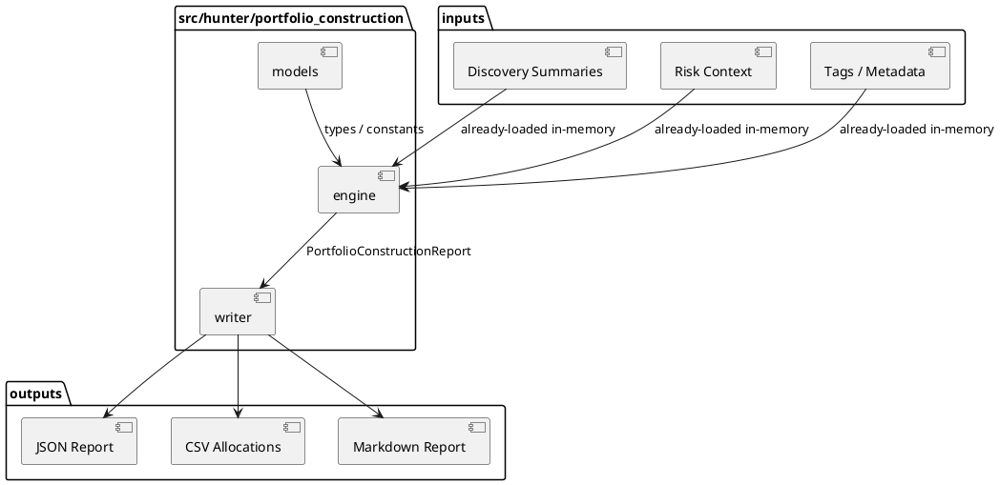
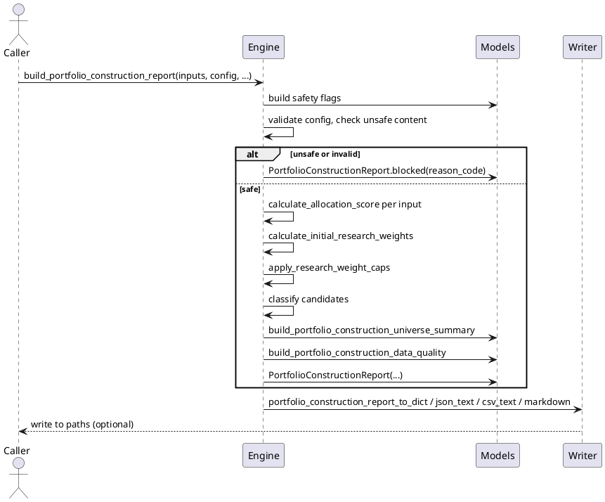

# SPEC-028-Portfolio-Construction-Engine

## Background

The **Discovery Engine** (MVP-26) completes at version `0.26.0-dev`. It produces local, deterministic, human-research candidate summaries (`CANDIDATE`, `WATCHLIST`, `EXCLUDED`, `INSUFFICIENT_DATA`, `BLOCKED`) from combined Relative Strength and Open Interest contexts. Discovery alone is not enough for a human researcher: a list of candidates does not explain how those candidates might be grouped for further research, which candidates are excluded from a research grouping due to constraints, or what research-only allocation weights might be used to compare candidates side-by-side.

The **Portfolio Construction Engine** (MVP-27) therefore follows Discovery. Its purpose is to convert already-loaded local/in-memory discovery candidate summaries and optional caller-provided risk/context summaries into a deterministic, human-research portfolio construction report. The report answers research questions such as:

- Which discovered candidates could be grouped for further human portfolio research?
- Which candidates are excluded due to risk, missing context, blocked state, or insufficient data?
- What deterministic weight suggestions are produced for research-only comparison?
- What reason codes explain every inclusion, exclusion, cap, or block?

Because this module is called **Portfolio Construction**, the SPEC must repeatedly clarify: **"portfolio" here means a human-research grouping artifact only.** The weights produced are **research allocation weights only** and are **not orders, not position sizes, not trade sizes, not portfolio approval, not execution readiness, and not Freqtrade input.** The output is a report that a human reads before deciding whether to do more research. It does not approve anything, execute anything, or feed any execution path.

This MVP remains explicitly **research-only**. It is not a trading signal, not trade approval, not strategy approval, not execution approval, not portfolio approval, not universe approval, and not Freqtrade input. It must not connect to Binance, exchanges, APIs, network, live data, API keys, or real trading. It must not place orders, suggest orders, emit action commands, or create execution instructions. It must not produce or consume Freqtrade strategy classes. It must not modify execution, strategy, Freqtrade, order, exchange, or portfolio paths. It must not feed back into execution paths. All input data must be already-loaded local in-memory values, sequences, mappings, dataclasses, or report objects. The engine performs no file reads, no production data reads, no database access, no Web UI, no dashboard, no API, no scheduler, no crawler, no indexer, no event store, no runtime registry, and no task runner.

Deterministic reason-code based inclusion, exclusion, capping, and blocking is required for auditability. Every candidate must be traceable to named rules, safety flags, and source contexts. Silent failures and silent drops are not allowed.

## Requirements

### Must Have (M)

- **M1:** Accept only already-loaded local/in-memory discovery candidate summaries and optional context summaries. The engine never reads files, databases, network endpoints, or runtime registries.
- **M2:** Support pair-level research allocation scoring over caller-provided inputs.
- **M3:** Produce deterministic, research-only candidate weight suggestions (`initial_research_weight_pct`, `capped_weight_pct`, `final_weight_pct`). These weights are for comparison only and are not orders, position sizes, or trade sizes.
- **M4:** Enforce deterministic caps and exclusions through explicit configuration and reason codes.
- **M5:** Never silently drop inputs. Excluded, blocked, and insufficient-data candidates must remain visible in the report, either in the allocations list or in the universe summary, depending on configuration.
- **M6:** Produce candidate states:
  - `INCLUDED`
  - `CAPPED`
  - `WATCHLIST`
  - `EXCLUDED`
  - `INSUFFICIENT_DATA`
  - `BLOCKED`
- **M7:** Produce candidate classifications:
  - `CORE_RESEARCH_ALLOCATION`
  - `SATELLITE_RESEARCH_ALLOCATION`
  - `WATCHLIST_ALLOCATION`
  - `EXCLUDED_BY_CONSTRAINTS`
  - `INSUFFICIENT_DATA`
  - `BLOCKED`
- **M8:** Produce a deterministic allocation score in the range `0.0-100.0` for human research only.
- **M9:** Produce deterministic `research_weight_pct`, `capped_weight_pct`, and `final_weight_pct` for every non-blocked, non-insufficient candidate that enters the weight pool.
- **M10:** Include reason codes for every candidate, including inclusions, caps, exclusions, insufficient-data, and blocks.
- **M11:** Include data quality fields tracking total inputs, state counts, context counts, and total final weight validation.
- **M12:** Include safety flags that explicitly forbid live trading, real orders, leverage, shorting, execution feedback, exchange connectivity, network access, file reads, and any runtime infrastructure.
- **M13:** Fail closed on missing pair id, unsafe strings, invalid scores, invalid weights, negative values, inconsistent states, and insufficient inputs. Fail-closed reports are produced through `PortfolioConstructionReport.blocked(...)`.
- **M14:** No network, API, exchange, file, database, or runtime dependencies in the engine.
- **M15:** No trading signal, trade approval, strategy approval, execution approval, portfolio approval, or Freqtrade integration semantics. Output is explicitly labeled as human research only.
- **M16:** No order, leverage, shorting, position sizing, or execution semantics in the model, engine, or writer.
- **M17:** Immutability: the engine must not mutate caller-provided input sequences, mappings, or discovery summaries.
- **M18:** Deterministic rounding policy: raw metrics rounded to 8 decimal places, sub-scores to 4 decimal places, allocation score to 2 decimal places, and weight percentage fields to 4 decimal places.
- **M19:** Deterministic output sorting: allocations sorted by state priority, then `final_weight_pct` descending, then `allocation_score` descending, then `pair` ascending.

### Should Have (S)

- **S1:** Configurable weighting from discovery score, data quality, diversification penalty, cap readiness, and filter bonus.
- **S2:** Deterministic ordering by state priority, `final_weight_pct` descending, `allocation_score` descending, and `pair` ascending.
- **S3:** Explicit inclusion/exclusion constraints driven by score thresholds, caps, and max candidate count.
- **S4:** Configurable max candidate count.
- **S5:** Configurable max single candidate research weight cap.
- **S6:** Configurable minimum candidate score threshold.
- **S7:** Writer design for JSON, CSV, and Markdown output, including deterministic report rendering with a research-only safety notice.
- **S8:** Atomic writes for the writer step: temp file + flush + fsync + `os.replace` + cleanup on failure.
- **S9:** Tests use `tmp_path` only for writer tests; engine and model tests never touch the filesystem.
- **S10:** Universe summary over allocation states, including counts and total final weight percentage.

### Could Have (C)

- **C1:** Human-readable allocation notes explaining why a candidate was included, capped, or excluded.
- **C2:** Cap diagnostics showing which candidates were capped and how much weight was redistributed.
- **C3:** Exclusion diagnostics showing which candidates were excluded and why.
- **C4:** Optional tags supplied by caller to support duplicate-group exposure detection.

### Won't Have (W)

- **W1:** Binance API collector or any exchange data collector.
- **W2:** Live data, real-time streaming, WebSocket, or network connection.
- **W3:** Freqtrade integration, Freqtrade strategy class, or Freqtrade runtime connection.
- **W4:** Portfolio approval, universe rebalance, or real portfolio construction for execution.
- **W5:** Position sizing, order sizing, or leverage/shorting logic.
- **W6:** Risk engine, backtesting engine, walk-forward analysis, or PnL simulation.
- **W7:** CLI, Web UI, dashboard, API server, database, auth, or scheduler.
- **W8:** Any actual buy/sell/hold recommendation, action command, or execution instruction.
- **W9:** File reads in the engine; data must be passed in-memory by the caller.
- **W10:** Runtime registry, indexer, crawler, event store, task runner, or feedback layer.

## Method

### Proposed Package Layout

```
src/hunter/
└── portfolio_construction/
    ├── __init__.py          # Public API exports
    ├── models.py            # Enums, frozen dataclasses, reason codes, safety flags, forbidden terms
    ├── engine.py            # Pure portfolio-construction calculation functions
    └── writer.py            # JSON/CSV/Markdown serialization and atomic writes

tests/test_portfolio_construction/
    ├── __init__.py
    ├── test_models.py       # Model validation, safety flags, reason codes, forbidden terms
    ├── test_engine.py       # Pure calculation functions, fail-closed behavior, determinism
    ├── test_writer.py       # Serialization and atomic writes
    └── test_integration.py  # End-to-end flows and safety assertions
```

### Output Paths

- `data/portfolio_construction/latest_portfolio_construction_report.json`
- `data/portfolio_construction/latest_portfolio_construction_allocations.csv`
- `reports/portfolio_construction/latest_portfolio_construction_report.md`

### Models

All models are frozen `@dataclass(frozen=True)` unless otherwise noted. Immutable/copy-safe mappings are used for `metadata` fields.

```python
PORTFOLIO_CONSTRUCTION_VERSION: str = "0.27.0-dev"


class PortfolioConstructionState(Enum):
    INCLUDED = "INCLUDED"
    CAPPED = "CAPPED"
    WATCHLIST = "WATCHLIST"
    EXCLUDED = "EXCLUDED"
    INSUFFICIENT_DATA = "INSUFFICIENT_DATA"
    BLOCKED = "BLOCKED"


class PortfolioConstructionClassification(Enum):
    CORE_RESEARCH_ALLOCATION = "CORE_RESEARCH_ALLOCATION"
    SATELLITE_RESEARCH_ALLOCATION = "SATELLITE_RESEARCH_ALLOCATION"
    WATCHLIST_ALLOCATION = "WATCHLIST_ALLOCATION"
    EXCLUDED_BY_CONSTRAINTS = "EXCLUDED_BY_CONSTRAINTS"
    INSUFFICIENT_DATA = "INSUFFICIENT_DATA"
    BLOCKED = "BLOCKED"


class PortfolioConstructionInputKind(Enum):
    SUMMARY = "SUMMARY"
    MANUAL = "MANUAL"
    RISK_CONTEXT = "RISK_CONTEXT"
```

#### `PortfolioDiscoverySummary`

```python
@dataclass(frozen=True)
class PortfolioDiscoverySummary:
    pair: str
    state: str
    classification: str
    discovery_score: float | None
    reason_codes: tuple[str, ...] = ()
    tags: tuple[str, ...] = ()
    metadata: Mapping[str, str] = field(default_factory=dict)
```

- `pair`: non-empty identifier string, e.g., `"SOL/USDT:USDT"`.
- `state`: discovery state string, e.g., `"CANDIDATE"`, `"WATCHLIST"`, `"EXCLUDED"`, `"INSUFFICIENT_DATA"`, `"BLOCKED"`.
- `classification`: discovery classification string, e.g., `"STRONG_RESEARCH_CANDIDATE"`.
- `discovery_score`: optional discovery score in `[0, 100]`, or `None` if unavailable.
- `reason_codes`: tuple of reason codes from the discovery report; normalized on construction.
- `tags`: optional tuple of caller-provided tags; normalized on construction.
- `metadata`: immutable mapping of opaque string metadata; copied and not traversed.

#### `PortfolioConstructionInput`

```python
@dataclass(frozen=True)
class PortfolioConstructionInput:
    pair: str
    discovery: PortfolioDiscoverySummary | None = None
    input_kind: PortfolioConstructionInputKind = PortfolioConstructionInputKind.SUMMARY
    tags: tuple[str, ...] = ()
    metadata: Mapping[str, str] = field(default_factory=dict)
```

- `pair`: non-empty identifier string. Must match `discovery.pair` when `discovery` is present.
- `discovery`: optional discovery summary. The primary source of context.
- `input_kind`: enum indicating how the input was provided.
- `tags`: optional caller-provided tags for diversification/duplicate detection.
- `metadata`: immutable mapping of opaque string metadata.

#### `PortfolioConstructionConfig`

```python
@dataclass(frozen=True)
class PortfolioConstructionConfig:
    require_discovery_context: bool = True
    block_on_blocked_context: bool = True
    block_on_missing_context: bool = False
    include_excluded_candidates: bool = True
    block_duplicate_tags: bool = False
    min_discovery_score: float = 60.0
    watchlist_score: float = 45.0
    core_allocation_score: float = 75.0
    satellite_allocation_score: float = 60.0
    max_candidate_count: int = 10
    max_single_weight_pct: float = 20.0
    total_research_weight_pct: float = 100.0
    score_weights: Mapping[str, float] = field(default_factory=lambda: {
        "discovery_score_component": 0.45,
        "data_quality_score": 0.15,
        "diversification_component": 0.15,
        "cap_readiness_score": 0.15,
        "filter_bonus_score": 0.10,
    })
```

Validation:

- All score thresholds must be finite and in `[0, 100]`.
- `core_allocation_score > satellite_allocation_score > watchlist_score` must hold.
- `max_candidate_count >= 0`.
- `max_single_weight_pct` in `[0, 100]`.
- `total_research_weight_pct` in `(0, 100]`.
- `score_weights` must contain exactly the five required keys. Values must be non-negative and sum to `1.0` within a deterministic tolerance.

#### `PortfolioConstructionSafetyFlags`

```python
@dataclass(frozen=True)
class PortfolioConstructionSafetyFlags:
    no_trading_signal: bool = True
    no_trade_approval: bool = True
    no_strategy_approval: bool = True
    no_execution_approval: bool = True
    no_portfolio_approval: bool = True
    no_universe_approval: bool = True
    no_order_sizing: bool = True
    no_position_sizing: bool = True
    no_leverage: bool = True
    no_shorting: bool = True
    no_action_commands: bool = True
    no_network_connection: bool = True
    no_file_read_in_engine: bool = True
    no_database: bool = True
    no_exchange_connection: bool = True
    no_freqtrade_input: bool = True
```

All flags default to `True`. The engine fails closed if any required flag is `False`.

#### `PortfolioConstructionDataQuality`

```python
@dataclass(frozen=True)
class PortfolioConstructionDataQuality:
    total_inputs: int
    included_count: int
    capped_count: int
    watchlist_count: int
    excluded_count: int
    insufficient_data_count: int
    blocked_count: int
    ready_context_count: int
    missing_context_count: int
    blocked_context_count: int
    total_final_weight_pct: float
    total_research_weight_pct: float
    data_quality_score: float
    sections_present: int
    all_sections_present: bool
    all_counts_consistent: bool
    total_weight_within_tolerance: bool
    has_unsafe_content: bool
    safety_flags_ok: bool
```

Validation:

- `total_inputs >= 0`.
- `included_count + capped_count + watchlist_count + excluded_count + insufficient_data_count + blocked_count == total_inputs`.
- `ready_context_count >= 0`, `missing_context_count >= 0`, `blocked_context_count >= 0`.
- No negative counts.
- `total_final_weight_pct` in `[0, total_research_weight_pct]`.
- `data_quality_score` in `[0, 100]`.
- `sections_present >= 0`.
- `all_counts_consistent`, `total_weight_within_tolerance`, `safety_flags_ok` are boolean.

#### `PortfolioConstructionScore`

```python
@dataclass(frozen=True)
class PortfolioConstructionScore:
    pair: str
    state: PortfolioConstructionState
    classification: PortfolioConstructionClassification
    allocation_score: float
    discovery_score_component: float
    data_quality_score: float
    diversification_component: float
    cap_readiness_score: float
    filter_bonus_score: float
    initial_research_weight_pct: float
    capped_weight_pct: float
    final_weight_pct: float
    reason_codes: tuple[str, ...]
    tags: tuple[str, ...]
    metadata: Mapping[str, str]
    notes: tuple[str, ...]
    rank: int | None
```

**Rank computation:**

- `rank` is assigned after final report ordering is complete.
- Rank starts at `1` for visible allocations.
- `BLOCKED` and `INSUFFICIENT_DATA` candidates remain visible and receive a `rank` based on their sorted position.
- `WATCHLIST` candidates remain visible and receive a `rank` based on their sorted position.
- `EXCLUDED` candidates omitted when `include_excluded_candidates=False` have `rank = None`.
- Because `PortfolioConstructionScore` is frozen, use `dataclasses.replace(...)` to set `rank` after construction if necessary.

#### `PortfolioConstructionUniverseSummary`

```python
@dataclass(frozen=True)
class PortfolioConstructionUniverseSummary:
    total_candidates: int
    included_count: int
    capped_count: int
    watchlist_count: int
    excluded_count: int
    insufficient_data_count: int
    blocked_count: int
    core_allocation_count: int
    satellite_allocation_count: int
    watchlist_allocation_count: int
    total_final_weight_pct: float
    top_pair: str | None
    notes: tuple[str, ...]
```

#### `PortfolioConstructionReport`

```python
@dataclass(frozen=True)
class PortfolioConstructionReport:
    version: str
    report_id: str
    generated_at: datetime
    inputs: tuple[PortfolioConstructionInput, ...]
    config: PortfolioConstructionConfig
    safety_flags: PortfolioConstructionSafetyFlags
    scores: tuple[PortfolioConstructionScore, ...]
    universe_summary: PortfolioConstructionUniverseSummary
    data_quality: PortfolioConstructionDataQuality
    reason_codes: tuple[str, ...]
    metadata: Mapping[str, str]
    notes: tuple[str, ...]

    @staticmethod
    def blocked(
        *,
        reason_code: str,
        report_id: str = "blocked",
        generated_at: datetime | None = None,
        metadata: Mapping[str, str] | None = None,
    ) -> PortfolioConstructionReport: ...
```

### Validation Rules

- `pair` must be non-empty and a string. Leading/trailing whitespace is not allowed; fail closed on unsafe content.
- `discovery_score` must be `None` or a finite float in `[0, 100]`.
- `pair` ids across `PortfolioDiscoverySummary` and `PortfolioConstructionInput` must match when both are present.
- `reason_codes` and `tags` are normalized to tuples on construction.
- `metadata` is copied and treated as opaque strings; no file/path behavior, no traversal, no execution.
- No file reads, no network calls, no database access, no exchange connection, no Freqtrade interaction.
- `state` and `classification` strings are validated against the known enum values where used, but the input models accept strings for compatibility with discovery report output.

### Reason Codes

All reason codes are constants with descriptive names. They are partitioned into:

- `PORTFOLIO_CONSTRUCTION_BLOCKING_REASON_CODES` — causes for `BLOCKED` state.
- `PORTFOLIO_CONSTRUCTION_INSUFFICIENT_DATA_REASON_CODES` — causes for `INSUFFICIENT_DATA` state.
- `PORTFOLIO_CONSTRUCTION_FILTER_REASON_CODES` — causes for exclusion or cap.
- `PORTFOLIO_CONSTRUCTION_ADVISORY_REASON_CODES` — informational safety and audit codes.
- `PORTFOLIO_CONSTRUCTION_REASON_CODES` — union of all of the above.

```python
INVALID_PAIR = "INVALID_PAIR"
INVALID_DISCOVERY_SCORE = "INVALID_DISCOVERY_SCORE"
INVALID_RESEARCH_WEIGHT = "INVALID_RESEARCH_WEIGHT"
UNSAFE_PORTFOLIO_CONSTRUCTION_CONTENT = "UNSAFE_PORTFOLIO_CONSTRUCTION_CONTENT"
MISSING_DISCOVERY_CONTEXT = "MISSING_DISCOVERY_CONTEXT"
DISCOVERY_BLOCKED = "DISCOVERY_BLOCKED"
DISCOVERY_INSUFFICIENT_DATA = "DISCOVERY_INSUFFICIENT_DATA"
LOW_DISCOVERY_SCORE = "LOW_DISCOVERY_SCORE"
MAX_CANDIDATE_COUNT_EXCEEDED = "MAX_CANDIDATE_COUNT_EXCEEDED"
MAX_SINGLE_WEIGHT_CAPPED = "MAX_SINGLE_WEIGHT_CAPPED"
ZERO_TOTAL_ALLOCATION_SCORE = "ZERO_TOTAL_ALLOCATION_SCORE"
INCLUDED_BY_RESEARCH_CONSTRAINTS = "INCLUDED_BY_RESEARCH_CONSTRAINTS"
CAPPED_BY_RESEARCH_CONSTRAINTS = "CAPPED_BY_RESEARCH_CONSTRAINTS"
EXCLUDED_BY_RESEARCH_CONSTRAINTS = "EXCLUDED_BY_RESEARCH_CONSTRAINTS"
HUMAN_RESEARCH_ONLY = "HUMAN_RESEARCH_ONLY"
NOT_PORTFOLIO_APPROVAL = "NOT_PORTFOLIO_APPROVAL"
NOT_POSITION_SIZING = "NOT_POSITION_SIZING"
NO_NETWORK_CONNECTION = "NO_NETWORK_CONNECTION"
NO_FILE_READ_IN_ENGINE = "NO_FILE_READ_IN_ENGINE"
NO_ACTION_COMMANDS_EMITTED = "NO_ACTION_COMMANDS_EMITTED"
```

### Forbidden Terms

A `FORBIDDEN_PORTFOLIO_CONSTRUCTION_TERMS` frozenset is defined to detect unsafe wording in local strings, tags, metadata, and pair identifiers. It must include trading/execution/Freqtrade/order/exchange/API/Binance/live-data/action-command terms, as well as risky wording that suggests real portfolio approval, order sizing, position sizing, leverage, or execution readiness.

Examples include but are not limited to:

```python
FORBIDDEN_PORTFOLIO_CONSTRUCTION_TERMS = frozenset({
    "order", "orders", "execute", "execution", "buy", "sell", "long", "short",
    "leverage", "margin", "position_size", "position sizing", "order_size",
    "order_sizing", "trade_size", "trades", "trading", "portfolio_approval",
    "portfolio approval", "approve", "approval", "freqtrade", "freq_trade",
    "binance", "exchange", "api", "api_key", "apikey", "secret", "websocket",
    "live_data", "live data", "real_time", "realtime", "action_command",
    "action command", "emit", "signal", "signal_generator", "take_profit",
    "stop_loss", "entry", "exit", "rebalance", "rebalancing", "allocation_for_execution",
})
```

Unsafe content detection checks only local strings, mappings, tags, and pairs. It does not open files, validate paths, follow paths, read files, or call network.

### Engine Functions

All engine functions are pure and deterministic. They do not mutate inputs.

```python
def build_portfolio_construction_safety_flags() -> PortfolioConstructionSafetyFlags: ...

def has_unsafe_portfolio_construction_content(
    pair: str,
    tags: Sequence[str],
    metadata: Mapping[str, str],
    forbidden_terms: frozenset[str] | None = None,
) -> bool: ...

def normalized_score(value: float, min_value: float = 0.0, max_value: float = 100.0) -> float: ...

def calculate_discovery_sub_score(
    discovery: PortfolioDiscoverySummary | None,
    config: PortfolioConstructionConfig,
) -> float: ...

def calculate_data_quality_score(
    discovery: PortfolioDiscoverySummary | None,
    config: PortfolioConstructionConfig,
) -> float: ...

def calculate_diversification_penalty(
    pair: str,
    tags: Sequence[str],
    all_inputs: Sequence[PortfolioConstructionInput],
    config: PortfolioConstructionConfig,
) -> float: ...

def calculate_cap_readiness_score(
    input_item: PortfolioConstructionInput,
    config: PortfolioConstructionConfig,
) -> float: ...

def calculate_filter_bonus_score(
    discovery: PortfolioDiscoverySummary | None,
    config: PortfolioConstructionConfig,
) -> float: ...

def calculate_allocation_score(
    input_item: PortfolioConstructionInput,
    all_inputs: Sequence[PortfolioConstructionInput],
    config: PortfolioConstructionConfig,
) -> float: ...

def calculate_initial_research_weights(
    scores: Sequence[PortfolioConstructionScore],
    config: PortfolioConstructionConfig,
) -> Sequence[PortfolioConstructionScore]: ...

def apply_research_weight_caps(
    scores: Sequence[PortfolioConstructionScore],
    config: PortfolioConstructionConfig,
) -> Sequence[PortfolioConstructionScore]: ...

def classify_portfolio_construction_candidate(
    allocation_score: float,
    final_weight_pct: float,
    was_capped: bool,
    config: PortfolioConstructionConfig,
) -> tuple[PortfolioConstructionState, PortfolioConstructionClassification]: ...

def build_portfolio_construction_score(
    input_item: PortfolioConstructionInput,
    all_inputs: Sequence[PortfolioConstructionInput],
    config: PortfolioConstructionConfig,
) -> PortfolioConstructionScore: ...

def build_portfolio_construction_universe_summary(
    scores: Sequence[PortfolioConstructionScore],
    config: PortfolioConstructionConfig,
) -> PortfolioConstructionUniverseSummary: ...

def build_portfolio_construction_report(
    *,
    inputs: Sequence[PortfolioConstructionInput],
    config: PortfolioConstructionConfig | None = None,
    report_id: str = "latest-portfolio-construction",
    generated_at: datetime | None = None,
    metadata: Mapping[str, str] | None = None,
) -> PortfolioConstructionReport: ...
```

#### Full Report Signature

```python
def build_portfolio_construction_report(
    *,
    inputs: Sequence[PortfolioConstructionInput],
    config: PortfolioConstructionConfig | None = None,
    report_id: str = "latest-portfolio-construction",
    generated_at: datetime | None = None,
    metadata: Mapping[str, str] | None = None,
) -> PortfolioConstructionReport:
    ...
```

The report function:

1. Builds safety flags and validates configuration.
2. Checks for unsafe content across all inputs.
3. If any required safety flag is missing or unsafe content is detected, returns a fail-closed `PortfolioConstructionReport.blocked(...)`.
4. Computes `cap_readiness_score` from discovery context alone.
5. Builds a single-pass `allocation_score` for every input.
6. Sorts candidates by `allocation_score` descending, then `pair` ascending.
7. Applies `max_candidate_count` to determine which candidates enter the weight pool; excess candidates become `EXCLUDED`.
8. Computes initial weights for pool candidates with `allocation_score >= satellite_allocation_score`.
9. Applies caps and redistributes excess deterministically.
10. Classifies each candidate into state and classification.
11. Builds universe summary and data quality fields.
12. Returns the fully deterministic report.

`cap_readiness_score` is computed before `allocation_score`. There is no iterative scoring loop.

#### Fail-Closed Factory

```python
PortfolioConstructionReport.blocked(
    *,
    reason_code: str,
    report_id: str = "blocked",
    generated_at: datetime | None = None,
    metadata: Mapping[str, str] | None = None,
) -> PortfolioConstructionReport
```

Produces a report with:

- `version = PORTFOLIO_CONSTRUCTION_VERSION`
- `scores = ()`
- `inputs = ()`
- `config = PortfolioConstructionConfig()` with default safe values
- `safety_flags` with `safety_flags_ok = False`
- `universe_summary` with `total_candidates = 0`, `included_count = 0`, `capped_count = 0`, `watchlist_count = 0`, `excluded_count = 0`, `insufficient_data_count = 0`, `blocked_count = 0`, `core_allocation_count = 0`, `satellite_allocation_count = 0`, `watchlist_allocation_count = 0`, `total_final_weight_pct = 0.0`, `top_pair = None`, `notes = ()`
- `data_quality` with `total_inputs = 0`, `included_count = 0`, `capped_count = 0`, `watchlist_count = 0`, `excluded_count = 0`, `insufficient_data_count = 0`, `blocked_count = 0`, `ready_context_count = 0`, `missing_context_count = 0`, `blocked_context_count = 0`, `total_final_weight_pct = 0.0`, `total_research_weight_pct = config.total_research_weight_pct`, `data_quality_score = 0.0`, `sections_present = 0`, `all_sections_present = False`, `all_counts_consistent = True`, `total_weight_within_tolerance = True`, `has_unsafe_content = True` or `safety_flags_ok = False` as appropriate
- `reason_codes = (reason_code,)`
- `notes = ("Report blocked due to safety/config violation.",)`
- `metadata` copied from caller or empty mapping

### Scoring Policy

The exact deterministic MVP allocation score formula is:

```
allocation_score = (
    discovery_score_component * 0.45
    + data_quality_score * 0.15
    + diversification_component * 0.15
    + cap_readiness_score * 0.15
    + filter_bonus_score * 0.10
)
```

Weight keys must sum to `1.0` and are validated by `PortfolioConstructionConfig`.

#### Sub-Score Rules

**`discovery_score_component`** (45%):

- Use `discovery.discovery_score` if discovery context is present and the discovery state is candidate-like (`CANDIDATE`) or watchlist-like (`WATCHLIST`).
- Otherwise `0.0`.

**`data_quality_score`** (15%):

- `100.0` when discovery context is present and candidate-like (`CANDIDATE`).
- `70.0` when discovery context is watchlist-like (`WATCHLIST`).
- `30.0` when discovery context is `INSUFFICIENT_DATA`.
- `0.0` when discovery context is missing, blocked, invalid, or unsafe.

**`diversification_component`** (15%):

- Deterministic MVP default `100.0` unless caller-provided tags indicate duplicate group exposure.
- `50.0` if duplicate tag group exposure exists (two or more candidates share the same tag).
- `0.0` if `config.block_duplicate_tags=True` and a duplicate tag group is detected; the affected candidates are blocked instead of penalized.

**`cap_readiness_score`** (15%):

- Computed **before** `allocation_score`.
- `100.0` when discovery context is present, not blocked, not insufficient, and the discovery context is candidate-like (`discovery.classification` is `STRONG_RESEARCH_CANDIDATE` or `MODERATE_RESEARCH_CANDIDATE`, or `discovery.state` is `CANDIDATE`).
- `50.0` when discovery context is present, not blocked, not insufficient, and the discovery context is watchlist-like (`discovery.classification` is `WATCHLIST_ONLY`, or `discovery.state` is `WATCHLIST`).
- `0.0` when discovery context is missing, blocked, insufficient, excluded, unsafe, or invalid.
- `cap_readiness_score` never reads `allocation_score`. There is no iterative scoring loop in MVP-27.

**`filter_bonus_score`** (10%):

- `100.0` when the minimum discovery score passes (`discovery.discovery_score >= min_discovery_score`) and context is candidate-like (`discovery.state` is `CANDIDATE`).
- `50.0` when context is watchlist-like (`discovery.state` is `WATCHLIST`) and `discovery.discovery_score >= watchlist_score`.
- `0.0` when thresholds fail or the context is blocked.

#### Default Thresholds and Caps

```python
min_discovery_score = 60.0
watchlist_score = 45.0
core_allocation_score = 75.0
satellite_allocation_score = 60.0
max_candidate_count = 10
max_single_weight_pct = 20.0
total_research_weight_pct = 100.0
```

#### State and Classification Mapping

| Condition | State | Classification |
|-----------|-------|----------------|
| Unsafe content or failed safety flag | `BLOCKED` | `BLOCKED` |
| Discovery context blocked and `block_on_blocked_context=True` | `BLOCKED` | `BLOCKED` |
| Required discovery context missing/insufficient and `block_on_missing_context=False` | `INSUFFICIENT_DATA` | `INSUFFICIENT_DATA` |
| Context present, not blocked/insufficient, `allocation_score < watchlist_score` | `EXCLUDED` | `EXCLUDED_BY_CONSTRAINTS` |
| Candidate rank exceeds `max_candidate_count` and `include_excluded_candidates=True` | `EXCLUDED` | `EXCLUDED_BY_CONSTRAINTS` |
| `watchlist_score <= allocation_score < satellite_allocation_score` | `WATCHLIST` | `WATCHLIST_ALLOCATION` |
| `allocation_score >= satellite_allocation_score` and not capped | `INCLUDED` | `CORE_RESEARCH_ALLOCATION` or `SATELLITE_RESEARCH_ALLOCATION` |
| `allocation_score >= satellite_allocation_score` and was capped | `CAPPED` | `CORE_RESEARCH_ALLOCATION` or `SATELLITE_RESEARCH_ALLOCATION` |

Classification detail:

- `CORE_RESEARCH_ALLOCATION` if `allocation_score >= core_allocation_score`.
- `SATELLITE_RESEARCH_ALLOCATION` if `satellite_allocation_score <= allocation_score < core_allocation_score`.
- `WATCHLIST_ALLOCATION` if `watchlist_score <= allocation_score < satellite_allocation_score`.

`BLOCKED` and `INSUFFICIENT_DATA` candidates are never silently dropped. They appear in the scores list and the universe summary. `EXCLUDED` candidates may be omitted from the allocations list when `include_excluded_candidates=False`, but the universe summary still counts all inputs. `WATCHLIST` candidates remain visible and receive `rank` based on their sorted position.

#### Decision Rules Summary

1. **BLOCKED** if unsafe content or any required safety flag fails.
2. **BLOCKED** if discovery context is blocked and `block_on_blocked_context=True`.
3. **INSUFFICIENT_DATA** if required discovery context is missing/insufficient and `block_on_missing_context=False`.
4. **EXCLUDED** if context is present, not blocked/insufficient, and `allocation_score < watchlist_score`.
5. **EXCLUDED** if candidate rank exceeds `max_candidate_count` and `include_excluded_candidates=True`.
6. **WATCHLIST** if `watchlist_score <= allocation_score < satellite_allocation_score`.
7. **INCLUDED** if `allocation_score >= satellite_allocation_score` and `final_weight_pct` is not capped.
8. **CAPPED** if `allocation_score >= satellite_allocation_score` and `final_weight_pct` was capped.
9. `CORE_RESEARCH_ALLOCATION` if `allocation_score >= core_allocation_score`.
10. `SATELLITE_RESEARCH_ALLOCATION` if `satellite_allocation_score <= allocation_score < core_allocation_score`.
11. `WATCHLIST_ALLOCATION` if `watchlist_score <= allocation_score < satellite_allocation_score`.
12. Never silently drop `BLOCKED` or `INSUFFICIENT_DATA`.
13. `include_excluded_candidates=False` may omit only `EXCLUDED` from report allocations; the summary still counts all inputs.

#### Research Weight Algorithm

1. Compute `cap_readiness_score` for each input from discovery context alone.
2. Compute `allocation_score` for each non-blocked, non-insufficient candidate using the single-pass formula above.
3. Sort all non-blocked, non-insufficient candidates by `allocation_score` descending, then `pair` ascending.
4. Apply `max_candidate_count`:
   - Candidates ranked beyond `max_candidate_count` become `EXCLUDED` with reason code `MAX_CANDIDATE_COUNT_EXCEEDED` if `include_excluded_candidates=True`.
   - If `include_excluded_candidates=False`, those candidates may be omitted from allocations but are still counted in the universe summary.
5. From the remaining candidates, create the initial weight pool containing only candidates with `allocation_score >= satellite_allocation_score`. This includes candidates that will become `INCLUDED` or `CAPPED`. `WATCHLIST` and `EXCLUDED` candidates are not in the pool.
6. If all allocation scores in the pool are zero, set all weights to `0.0` and emit `ZERO_TOTAL_ALLOCATION_SCORE` for every pool member.
7. `initial_research_weight_pct = allocation_score / sum(allocation_scores_in_pool) * total_research_weight_pct`.
8. Apply `max_single_weight_pct` cap deterministically:
   - Any candidate above the cap is reduced to `max_single_weight_pct`.
   - The excess is collected and redistributed proportionally to uncapped pool members based on their current allocation scores.
   - Redistribution continues iteratively until the pool is stable or no eligible recipients remain.
9. Round final weights to 4 decimal places.
10. The sum of final weights must be `<= total_research_weight_pct` and should be within deterministic tolerance when enough uncapped candidates exist.
11. `WATCHLIST` candidates receive `initial_research_weight_pct = 0.0`, `capped_weight_pct = 0.0`, and `final_weight_pct = 0.0` unless a future SPEC changes this.
12. These are research weights only, not position sizes or orders.

### Config Flags

```python
@dataclass(frozen=True)
class PortfolioConstructionConfig:
    require_discovery_context: bool = True
    block_on_blocked_context: bool = True
    block_on_missing_context: bool = False
    include_excluded_candidates: bool = True
    block_duplicate_tags: bool = False
    min_discovery_score: float = 60.0
    watchlist_score: float = 45.0
    core_allocation_score: float = 75.0
    satellite_allocation_score: float = 60.0
    max_candidate_count: int = 10
    max_single_weight_pct: float = 20.0
    total_research_weight_pct: float = 100.0
    score_weights: Mapping[str, float] = field(default_factory=lambda: {
        "discovery_score_component": 0.45,
        "data_quality_score": 0.15,
        "diversification_component": 0.15,
        "cap_readiness_score": 0.15,
        "filter_bonus_score": 0.10,
    })
```

All thresholds are validated as finite and within bounds. The score weights must contain exactly the five required keys and sum to `1.0`.

### Data Quality Validation

The `PortfolioConstructionDataQuality` object validates:

- `total_inputs >= 0`.
- `included_count + capped_count + watchlist_count + excluded_count + insufficient_data_count + blocked_count == total_inputs`.
- `ready_context_count >= 0`.
- `missing_context_count >= 0`.
- `blocked_context_count >= 0`.
- No negative counts.
- `total_final_weight_pct` in `[0, total_research_weight_pct]`.
- `data_quality_score` computed from the consistency checks above, in `[0, 100]`. Report-level formula:
  ```python
  data_quality_score = round(
      ((ready_context_count / max(total_inputs, 1)) * 100.0),
      4,
  )
  ```
- `all_counts_consistent` boolean.
- `total_weight_within_tolerance` boolean.
- `safety_flags_ok` boolean.
- `has_unsafe_content` boolean.

### Determinism Requirements

- Frozen dataclasses for all domain objects.
- Tuple normalization for all sequence fields.
- Immutable/copy-safe mappings for `metadata`.
- Deterministic sorting by:
  1. State priority: `INCLUDED` (0), `CAPPED` (1), `WATCHLIST` (2), `EXCLUDED` (3), `INSUFFICIENT_DATA` (4), `BLOCKED` (5).
  2. `final_weight_pct` descending.
  3. `allocation_score` descending.
  4. `pair` ascending.
- Rounding policy:
  - Raw metrics: 8 decimal places.
  - Sub-scores: 4 decimal places.
  - Allocation score: 2 decimal places.
  - Weight percentage fields: 4 decimal places.
- No mutation of inputs.
- No pair silently dropped except `EXCLUDED` when `include_excluded_candidates=False`, while the universe summary still counts all inputs.

### Writer Functions

```python
def portfolio_construction_report_to_dict(
    report: PortfolioConstructionReport,
) -> dict[str, Any]: ...

def portfolio_construction_report_to_json_text(
    report: PortfolioConstructionReport,
) -> str: ...

def portfolio_construction_report_to_csv_text(
    report: PortfolioConstructionReport,
) -> str: ...

def portfolio_construction_report_to_markdown(
    report: PortfolioConstructionReport,
) -> str: ...

def atomic_write_json_portfolio_construction_report(
    report: PortfolioConstructionReport,
    path: Path,
) -> None: ...

def atomic_write_csv_portfolio_construction_report(
    report: PortfolioConstructionReport,
    path: Path,
) -> None: ...

def atomic_write_markdown_portfolio_construction_report(
    report: PortfolioConstructionReport,
    path: Path,
) -> None: ...

def write_portfolio_construction_report(
    report: PortfolioConstructionReport,
    *,
    json_path: Path | None = None,
    csv_path: Path | None = None,
    markdown_path: Path | None = None,
) -> None: ...
```

#### Writer Format Requirements

- **JSON**: deterministic output with `sort_keys=True`, `indent=2`, and a trailing newline. Enums serialize to their `.value` strings. Datetimes serialize to ISO 8601 format.
- **CSV**: exact column order:
  `pair,state,classification,allocation_score,discovery_score_component,data_quality_score,diversification_component,cap_readiness_score,filter_bonus_score,initial_research_weight_pct,capped_weight_pct,final_weight_pct,reason_codes,tags,rank`
  Header row included. One row per allocation. No trailing blank rows.
- **Markdown**:
  - H1 title.
  - Research-only safety notice immediately after H1.
  - Sections: report identity, universe summary, data quality, allocation table, cap diagnostics, reason codes, filter diagnostics, safety flags.
  - No trading/order/execution/approval/position-sizing language beyond the required safety disclaimers.
  - Deterministic ordering of sections and rows.

### Safety Invariants

The following safety invariants must hold for every implementation and test:

1. **Research-only**: The engine produces a human-research report. It is not a trading signal, not trade approval, not strategy approval, not execution approval, not portfolio approval, and not universe approval.
2. **No execution semantics**: No order, leverage, shorting, position sizing, or execution language appears in the model, engine, or writer.
3. **No network/API/exchange**: The engine never connects to Binance, exchanges, APIs, network, live data, or any external service.
4. **No file reads**: The engine reads no files. All input is caller-provided, already-loaded, in-memory data.
5. **No database**: The engine does not access a database.
6. **No Freqtrade**: The engine does not produce or consume Freqtrade strategy classes or Freqtrade inputs.
7. **No action commands**: The engine does not emit buy, sell, hold, rebalance, or any action commands.
8. **No runtime infrastructure**: No scheduler, crawler, indexer, event store, runtime registry, or task runner.
9. **No feedback into execution**: Outputs are not consumed by execution, strategy, Freqtrade, order, exchange, or portfolio paths.
10. **Weights are research-only**: `research_weight_pct`, `capped_weight_pct`, and `final_weight_pct` are research allocation weights only. They are not orders, not position sizes, not trade sizes, not portfolio approval, and not execution readiness.
11. **Fail-closed**: Unsafe content, invalid config, or failed safety flags produce a blocked report.
12. **No silent drops**: `BLOCKED` and `INSUFFICIENT_DATA` candidates remain visible. `EXCLUDED` candidates may be omitted from allocations only when `include_excluded_candidates=False`, but the universe summary still counts all inputs.

### PlantUML Diagrams

#### Component Diagram



#### Sequence Diagram



## Implementation

Implementation is planned in four steps. Each step is self-contained, has a clear stop condition, and preserves the safety invariants above.

### Step 1: Models and Engine

**Allowed files:**

- `src/hunter/portfolio_construction/__init__.py`
- `src/hunter/portfolio_construction/models.py`
- `src/hunter/portfolio_construction/engine.py`

**Tests:**

- `tests/test_portfolio_construction/__init__.py`
- `tests/test_portfolio_construction/test_models.py`
- `tests/test_portfolio_construction/test_engine.py`

**Stop conditions:**

- All model validation tests pass.
- All reason code and safety flag tests pass.
- All engine calculation tests pass.
- Fail-closed behavior verified for unsafe content, invalid config, and missing inputs.
- No file reads or network calls in the engine.
- `pytest tests/test_portfolio_construction/test_models.py tests/test_portfolio_construction/test_engine.py -q` passes.

**Safety constraints:**

- No Freqtrade, exchange, or order semantics in models or engine.
- All weights are explicitly labeled research-only in docstrings and tests.
- Frozen dataclasses, tuple normalization, and immutable metadata enforced.

### Step 2: Writer

**Allowed files:**

- `src/hunter/portfolio_construction/writer.py`

**Tests:**

- `tests/test_portfolio_construction/test_writer.py`

**Stop conditions:**

- JSON, CSV, and Markdown serialization tests pass.
- Atomic write tests pass using `tmp_path` only.
- Deterministic output verified (same inputs produce identical output bytes).
- Safety notice appears in Markdown output immediately after H1.
- `pytest tests/test_portfolio_construction/test_writer.py -q` passes.

**Safety constraints:**

- Writer never calls network, exchange, or database.
- Atomic write pattern: temp file + flush + fsync + `os.replace` + cleanup on failure.
- No trading/order/execution/approval language beyond required safety disclaimers.

### Step 3: Integration Tests

**Tests:**

- `tests/test_portfolio_construction/test_integration.py`

**Stop conditions:**

- End-to-end flows from input to report to writer output pass.
- Safety assertions pass: no unsafe imports, no network modules, no Freqtrade imports.
- Deterministic outputs verified across repeated runs.
- No mutation of inputs verified.
- `pytest tests/test_portfolio_construction/test_integration.py -q` passes.

**Safety constraints:**

- Integration tests use only local, in-memory fixtures and `tmp_path` for writer outputs.
- No real exchange, API, or database usage.
- No Freqtrade strategy classes or execution paths referenced.

### Step 4: Final Validation and Version Bump

**Allowed files:**

- `VERSION` (read for bump to `0.27.0-dev`)
- `pyproject.toml` (read for version alignment)
- `CHANGELOG.md` (append only)

**Stop conditions:**

- Full test suite passes: `pytest -q --import-mode=importlib`.
- Type checks pass if available.
- Version bumped to `0.27.0-dev` in `VERSION` and `pyproject.toml`.
- `CHANGELOG.md` updated with MVP-27 entry.
- No regressions in existing packages.

**Safety constraints:**

- Version bump is the only change outside the new package and tests.
- No trading/execution semantics introduced in version or changelog text.

## Milestones

Contractor-ready milestones for MVP-27:

1. **M27.1 — Models and Engine Complete**:
   - `src/hunter/portfolio_construction/models.py` and `engine.py` implemented.
   - Model and engine tests pass.
   - Fail-closed behavior verified.

2. **M27.2 — Writer Complete**:
   - `writer.py` implemented with JSON, CSV, and Markdown output.
   - Atomic write tests pass.
   - Deterministic output verified.

3. **M27.3 — Integration and Safety Validation**:
   - Integration tests pass.
   - Safety invariants verified (no network, no file reads, no Freqtrade, no execution semantics).
   - No mutation of inputs verified.

4. **M27.4 — Release Readiness**:
   - Full test suite passes.
   - Version bumped to `0.27.0-dev`.
   - `CHANGELOG.md` updated.
   - SPEC marked complete.

## Gathering Results

The following acceptance criteria define when MVP-27 is complete:

- Focused package tests pass: `pytest tests/test_portfolio_construction/ -q`.
- Full suite passes: `pytest -q --import-mode=importlib`.
- Deterministic outputs: identical inputs produce identical reports and byte-identical writer output.
- No mutation of inputs: caller-provided sequences, mappings, and discovery summaries are unchanged after report construction.
- No unsafe imports: `portfolio_construction` package does not import network, exchange, database, Freqtrade, or execution modules.
- No network/API/exchange/file/db behavior in the engine or model layer.
- No Freqtrade input or strategy class usage.
- Clear human-research interpretation: every report and Markdown output includes the research-only safety notice and reason codes.
- No trading/approval/position-sizing semantics: weights, states, and classifications are explicitly research-only.

## Need Professional Help in Developing Your Architecture?

Please contact me at [sammuti.com](https://sammuti.com) :)


