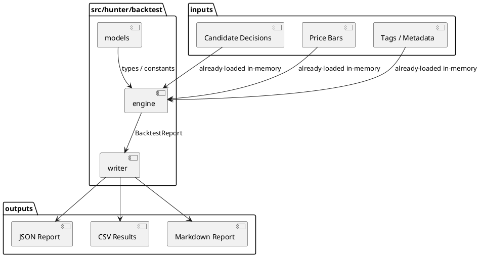
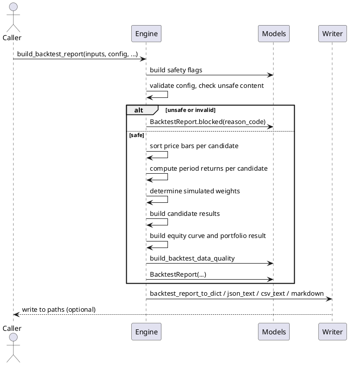

# SPEC-029-Local-Research-Backtesting-Engine

## Background

The **Portfolio Construction Engine** (MVP-27) completes at version `0.27.0-dev`. It produces deterministic, human-research allocation weights from local, in-memory discovery and context summaries. Portfolio construction alone does not answer the research question: *how would those allocation weights have behaved over a historical price window?* The **Local Research Backtesting Engine** (MVP-28) exists to evaluate historical research decisions in a purely local, deterministic, simulated manner.

Because this module is called **Backtesting**, the SPEC must repeatedly clarify: **"backtest" here means a local research simulation artifact only.** The results produced are **not trading signals, not trade approvals, not strategy approvals, not execution approvals, not portfolio approvals, and not Freqtrade input.** The output is a report that a human researcher reads to understand how research allocation decisions would have behaved historically. No capital is deployed, no orders are placed, no exchange is contacted, and no execution path is fed.

MVP-28 consumes explicit local price/history inputs and local research decisions. It simulates the *research allocation* path: given a candidate decision and a historical price series, what would the simulated research-only return, drawdown, and volatility characteristics have been? The engine does not model slippage, fees, fills, leverage, margin, or short execution. It uses simple arithmetic on research allocations and price changes to produce audit-only metrics.

This MVP remains explicitly **research-only**. It is not a trading signal, not trade approval, not strategy approval, not execution approval, not portfolio approval, and not Freqtrade input. It must not connect to Binance, exchanges, APIs, network, live data, API keys, or real trading. It must not place orders, suggest orders, emit action commands, or create execution instructions. It must not produce or consume Freqtrade strategy classes. It must not modify execution, strategy, Freqtrade, order, exchange, or portfolio paths. It must not feed back into execution paths. All input data must be already-loaded local in-memory values, sequences, mappings, or dataclasses. The engine performs no file reads, no production data reads, no database access, no Web UI, no dashboard, no API, no scheduler, no crawler, no indexer, no event store, no runtime registry, and no task runner.

Deterministic reason-code based inclusion, exclusion, and blocking is required for auditability. Every candidate must be traceable to named rules, safety flags, and source contexts. Silent failures and silent drops are not allowed.

## Requirements

### Must Have (M)

- **M1:** Accept only already-loaded local/in-memory price history and candidate decisions. The engine never reads files, databases, network endpoints, or runtime registries.
- **M2:** Support pair-level backtest simulation over caller-provided price bars and candidate decisions.
- **M3:** Produce deterministic, research-only backtest results. No simulated fill, no slippage, no fees, no leverage, no margin, no short execution semantics.
- **M4:** Produce candidate-level metrics including:
  - `total_return_pct`
  - `max_drawdown_pct`
  - `volatility_pct` (realized standard deviation of period returns, annualized or not depending on config)
  - `win_rate_pct`
  - `observation_count`
  - `missing_data_count`
  - `insufficient_data_count`
- **M5:** Produce portfolio-level metrics including:
  - `total_return_pct`
  - `max_drawdown_pct`
  - `volatility_pct`
  - `win_rate_pct`
  - `observation_count`
  - `missing_data_count`
  - `insufficient_data_count`
  - `blocked_count`
  - `candidate_count`
- **M6:** Never silently drop inputs. BLOCKED and INSUFFICIENT_DATA candidates remain visible in the report. EXCLUDED candidates may be omitted from candidate results only when `include_excluded_candidates=False`, but the portfolio summary still counts all inputs.
- **M7:** Produce candidate states consistent with upstream engines:
  - `INCLUDED`
  - `CAPPED`
  - `WATCHLIST`
  - `EXCLUDED`
  - `INSUFFICIENT_DATA`
  - `BLOCKED`
- **M8:** Produce safety flags that explicitly forbid live trading, real orders, leverage, shorting, execution feedback, exchange connectivity, network access, file reads, and any runtime infrastructure.
- **M9:** Include reason codes for every candidate, including missing/invalid price history, blocked context, insufficient data, and exclusions.
- **M10:** Include data quality fields tracking total inputs, state counts, observation counts, missing data counts, and summary consistency.
- **M11:** Fail closed on missing pair id, unsafe strings, invalid prices, invalid dates, inconsistent states, and insufficient inputs. Fail-closed reports are produced through `BacktestReport.blocked(...)`.
- **M12:** No network, API, exchange, file, database, or runtime dependencies in the engine.
- **M13:** No trading signal, trade approval, strategy approval, execution approval, portfolio approval, or Freqtrade integration semantics. Output is explicitly labeled as human research only.
- **M14:** No order, leverage, shorting, position sizing, or execution semantics in the model, engine, or writer.
- **M15:** Immutability: the engine must not mutate caller-provided input sequences, mappings, or price bars.
- **M16:** Deterministic rounding policy: raw prices 8 decimal places, period returns 8 decimal places, sub-metrics 4 decimal places, final percentage metrics 2 decimal places.
- **M17:** Deterministic output sorting: candidate results sorted by state priority, then `total_return_pct` descending, then `max_drawdown_pct` ascending (less severe first), then `pair` ascending.
- **M18:** Conservative handling of missing/invalid price history: a candidate with no usable prices produces no return, no negative attribution, and is recorded as `INSUFFICIENT_DATA` or `BLOCKED` depending on config.

### Should Have (S)

- **S1:** Configurable allocation interpretation for simulation: `equal_weight`, `research_weight`, or `custom_weight` supplied by caller.
- **S2:** Deterministic ordering by state priority, `total_return_pct` descending, `max_drawdown_pct` ascending, `pair` ascending.
- **S3:** Explicit inclusion/exclusion of EXCLUDED candidates via `include_excluded_candidates`.
- **S4:** Configurable start/end timestamps for the simulation window (implemented via optional `start_timestamp` and `end_timestamp` fields in `BacktestRunConfig`).
- **S5:** Configurable minimum observation threshold; candidates with fewer observations are marked `INSUFFICIENT_DATA`.
- **S6:** Writer design for JSON, CSV, and Markdown output, including deterministic report rendering with a research-only safety notice.
- **S7:** Atomic writes for the writer step: temp file + flush + fsync + `os.replace` + cleanup on failure.
- **S8:** Tests use `tmp_path` only for writer tests; engine and model tests never touch the filesystem.
- **S9:** Portfolio snapshot sequence recording simulated equity at each observation point.
- **S10:** Per-candidate and portfolio-level observation count and missing data diagnostics.

### Could Have (C)

- **C1:** Human-readable backtest notes explaining why a candidate was included, excluded, or blocked.
- **C2:** Missing-data diagnostics showing which pairs lacked price history.
- **C3:** Optional tags supplied by caller to support candidate grouping in Markdown.
- **C4:** Benchmark comparison metric (e.g., hold-only benchmark) using the same price series, not an external index.

### Won't Have (W)

- **W1:** Binance API collector or any exchange data collector.
- **W2:** Live data, real-time streaming, WebSocket, or network connection.
- **W3:** Freqtrade integration, Freqtrade strategy class, or Freqtrade runtime connection.
- **W4:** Portfolio approval, universe rebalance, or real portfolio construction for execution.
- **W5:** Position sizing, order sizing, leverage/shorting logic, margin, or fee/slippage models.
- **W6:** Real-time scheduler, daemon, or automated trading loop.
- **W7:** CLI, Web UI, dashboard, API server, database, auth, or scheduler.
- **W8:** Any actual buy/sell/hold recommendation, action command, or execution instruction.
- **W9:** File reads in the engine; data must be passed in-memory by the caller.
- **W10:** Runtime registry, indexer, crawler, event store, task runner, or feedback layer.
- **W11:** Execution feedback, strategy optimization, or parameter curve fitting.

## Method

### Proposed Package Layout

```
src/hunter/
└── backtest/
    ├── __init__.py          # Public API exports
    ├── models.py            # Enums, frozen dataclasses, reason codes, safety flags, forbidden terms
    ├── engine.py            # Pure backtest calculation functions
    └── writer.py            # JSON/CSV/Markdown serialization and atomic writes

tests/test_backtest/
    ├── __init__.py
    ├── test_models.py       # Model validation, safety flags, reason codes, forbidden terms
    ├── test_engine.py       # Pure calculation functions, fail-closed behavior, determinism
    ├── test_writer.py       # Serialization and atomic writes
    └── test_integration.py  # End-to-end flows and safety assertions
```

### Output Paths

- `data/backtest/latest_backtest_report.json`
- `data/backtest/latest_backtest_results.csv`
- `reports/backtest/latest_backtest_report.md`

### Models

All models are frozen `@dataclass(frozen=True)` unless otherwise noted. Immutable/copy-safe mappings are used for `metadata` fields.

```python
BACKTEST_VERSION: str = "0.28.0-dev"


class BacktestState(Enum):
    INCLUDED = "INCLUDED"
    CAPPED = "CAPPED"
    WATCHLIST = "WATCHLIST"
    EXCLUDED = "EXCLUDED"
    INSUFFICIENT_DATA = "INSUFFICIENT_DATA"
    BLOCKED = "BLOCKED"


class BacktestAllocationMode(Enum):
    EQUAL_WEIGHT = "EQUAL_WEIGHT"
    RESEARCH_WEIGHT = "RESEARCH_WEIGHT"
    CUSTOM_WEIGHT = "CUSTOM_WEIGHT"


class BacktestInputKind(Enum):
    SUMMARY = "SUMMARY"
    MANUAL = "MANUAL"


FORBIDDEN_BACKTEST_TERMS: frozenset[str] = frozenset(
    {
        # Trading / execution terms
        "order",
        "orders",
        "execute",
        "execution",
        "buy",
        "sell",
        "long",
        "short",
        "leverage",
        "margin",
        "liquidation",
        "liquidate",
        "fill",
        "filling",
        "position",
        "positions",
        "position_size",
        "position sizing",
        "position_sizing",
        "order_size",
        "order_sizing",
        "trade_size",
        "trades",
        "trading",
        "trade",
        "signal",
        "signals",
        "signal_generator",
        # Approval / action terms
        "approve",
        "approval",
        "approved",
        "action_command",
        "action command",
        "emit",
        "take_profit",
        "stop_loss",
        "entry",
        "exit",
        "entry_price",
        "exit_price",
        # Freqtrade
        "freqtrade",
        "freq_trade",
        "freqtrade_strategy",
        "freqtrade_input",
        # Exchange / API / network
        "binance",
        "exchange",
        "api",
        "api_key",
        "apikey",
        "secret",
        "webhook",
        "web_hook",
        "live_data",
        "live data",
        "real_time",
        "realtime",
        "live_trading",
        "live trading",
        "market_data_feed",
        "tick_data",
        # Action commands / deployment terms
        "deploy_capital",
        "deploy capital",
        "capital_allocation",
        "capital allocation",
        "order_management",
        "order management",
    }
)


def has_unsafe_backtest_content(
    pair: str,
    tags: Sequence[str],
    metadata: Mapping[str, str],
    forbidden_terms: frozenset[str] | None = None,
) -> bool:
    """Return True if any local string contains a forbidden term.

    Scans only the pair string, tag strings, and metadata keys/values provided
    by the caller. Metadata/file reference strings are opaque local strings only
    and are never opened, followed, traversed, validated, fetched, executed, or
    resolved.
    """
    terms = forbidden_terms or FORBIDDEN_BACKTEST_TERMS
    text_parts = [pair.lower()]
    text_parts.extend(t.lower() for t in tags)
    for k, v in metadata.items():
        text_parts.append(k.lower())
        text_parts.append(v.lower())
    for part in text_parts:
        for term in terms:
            if term in part:
                return True
    return False
```

#### `BacktestPriceBar`

```python
@dataclass(frozen=True)
class BacktestPriceBar:
    pair: str
    timestamp: datetime
    close: float
    open: float | None = None
    high: float | None = None
    low: float | None = None
    volume: float | None = None
    metadata: Mapping[str, str] = field(default_factory=dict)
```

- `pair`: non-empty identifier string, e.g., `"SOL/USDT:USDT".
- `timestamp`: timezone-aware datetime. Bars are sorted by the engine; caller input is not mutated.
- `close`: required strictly positive finite closing price (`> 0`). Zero or negative close prices are rejected as invalid to avoid division by zero in period-return calculations.
- `open`, `high`, `low`, `volume`: optional; when provided, validated as finite and non-negative if applicable.
- `metadata`: immutable mapping of opaque string metadata; not traversed.

#### `BacktestCandidateDecision`

```python
@dataclass(frozen=True)
class BacktestCandidateDecision:
    pair: str
    state: str
    classification: str
    research_weight_pct: float = 0.0
    final_weight_pct: float = 0.0
    tags: tuple[str, ...] = ()
    metadata: Mapping[str, str] = field(default_factory=dict)
```

- `pair`: non-empty identifier string.
- `state`: candidate state string, e.g., `"INCLUDED"`, `"CAPPED"`, `"WATCHLIST"`, `"EXCLUDED"`, `"INSUFFICIENT_DATA"`, `"BLOCKED"`.
- `classification`: classification string, e.g., `"CORE_RESEARCH_ALLOCATION"`.
- `research_weight_pct` / `final_weight_pct`: research allocation weights from portfolio construction or caller; used only for simulation when `allocation_mode=RESEARCH_WEIGHT` or `CUSTOM_WEIGHT`.
- `tags`: optional caller-provided tags.
- `metadata`: immutable mapping of opaque string metadata.

#### `BacktestInput`

```python
@dataclass(frozen=True)
class BacktestInput:
    pair: str
    decision: BacktestCandidateDecision | None = None
    price_bars: tuple[BacktestPriceBar, ...] = ()
    input_kind: BacktestInputKind = BacktestInputKind.SUMMARY
    tags: tuple[str, ...] = ()
    metadata: Mapping[str, str] = field(default_factory=dict)
```

- `pair`: non-empty identifier string. Must match `decision.pair` and `price_bars[i].pair` when present.
- `decision`: optional candidate decision from upstream research pipeline.
- `price_bars`: optional tuple of local price bars. Missing price history is handled conservatively.
- `input_kind`: enum indicating how the input was provided.
- `tags`: optional caller-provided tags.
- `metadata`: immutable mapping of opaque string metadata.

#### `BacktestRunConfig`

```python
@dataclass(frozen=True)
class BacktestRunConfig:
    allocation_mode: BacktestAllocationMode = BacktestAllocationMode.RESEARCH_WEIGHT
    include_excluded_candidates: bool = True
    block_on_blocked_context: bool = True
    block_on_missing_context: bool = False
    min_observation_count: int = 2
    allow_missing_decision: bool = False
    custom_weights: Mapping[str, float] = field(default_factory=dict)
    volatility_scale_factor: float = 1.0
    start_timestamp: datetime | None = None
    end_timestamp: datetime | None = None
```

- `allocation_mode`: how simulated allocation is derived.
- `include_excluded_candidates`: whether EXCLUDED candidates appear in candidate results.
- `block_on_blocked_context`: whether blocked upstream decisions produce BLOCKED backtest results.
- `block_on_missing_context`: whether missing upstream decisions produce BLOCKED instead of INSUFFICIENT_DATA.
- `min_observation_count`: minimum usable price bars required for a candidate result; below this, the result is INSUFFICIENT_DATA.
- `allow_missing_decision`: when True, a candidate with price bars but no decision can be simulated as equal-weight if allocation mode permits.
- `custom_weights`: caller-provided pair → weight mapping for `CUSTOM_WEIGHT` mode.
- `volatility_scale_factor`: finite positive multiplier used in the volatility formula. `1.0` means per-period volatility; callers may supply `sqrt(365)` (or the square of their desired annualization factor) for daily annualization. The engine does not infer frequency from timestamps.
- `start_timestamp` / `end_timestamp`: optional timezone-aware datetimes that bound the simulation window. When provided, price bars outside the inclusive `[start_timestamp, end_timestamp]` range are ignored. `start_timestamp` must be `<= end_timestamp`. If omitted, all provided price bars are used.

Validation:
- `volatility_scale_factor` must be a finite float `> 0`.
- `min_observation_count` must be a non-negative int.
- If both `start_timestamp` and `end_timestamp` are provided, `start_timestamp <= end_timestamp`.
- `custom_weights` values must be finite and non-negative; they are not required to sum to 1.0 because the engine normalizes active weights.

#### `BacktestPortfolioSnapshot`

```python
@dataclass(frozen=True)
class BacktestPortfolioSnapshot:
    timestamp: datetime
    equity: float
    weight_sum: float
    observation_count: int
    metadata: Mapping[str, str] = field(default_factory=dict)
```

- `timestamp`: observation timestamp.
- `equity`: simulated portfolio equity at this observation (research-only, not real capital).
- `weight_sum`: sum of simulated weights active at this observation.
- `observation_count`: number of candidate price bars available at this timestamp.
- `metadata`: opaque immutable metadata.

#### `BacktestCandidateResult`

```python
@dataclass(frozen=True)
class BacktestCandidateResult:
    pair: str
    state: BacktestState
    classification: str
    allocation_mode: BacktestAllocationMode
    simulated_weight: float
    total_return_pct: float
    max_drawdown_pct: float
    volatility_pct: float
    win_rate_pct: float
    observation_count: int
    missing_data_count: int
    insufficient_data_count: int
    period_returns: tuple[float, ...]
    reason_codes: tuple[str, ...]
    tags: tuple[str, ...]
    metadata: Mapping[str, str]
    notes: tuple[str, ...]
    rank: int | None
```

- `simulated_weight`: the weight used in the portfolio simulation for this candidate.
- `period_returns`: tuple of per-period arithmetic returns (e.g., `close_t / close_{t-1} - 1`) for transparency.
- `rank`: final rank among visible candidate results.

#### `BacktestPortfolioResult`

```python
@dataclass(frozen=True)
class BacktestPortfolioResult:
    total_return_pct: float
    max_drawdown_pct: float
    volatility_pct: float
    win_rate_pct: float
    observation_count: int
    missing_data_count: int
    insufficient_data_count: int
    blocked_count: int
    candidate_count: int
    equity_curve: tuple[BacktestPortfolioSnapshot, ...]
    reason_codes: tuple[str, ...]
    metadata: Mapping[str, str]
```

- `equity_curve`: ordered sequence of portfolio snapshots, one per distinct observation timestamp.
- `candidate_count`: total number of input candidates.

#### `BacktestDataQuality`

```python
@dataclass(frozen=True)
class BacktestDataQuality:
    total_inputs: int
    included_count: int
    capped_count: int
    watchlist_count: int
    excluded_count: int
    insufficient_data_count: int
    blocked_count: int
    ready_price_history_count: int
    missing_price_history_count: int
    blocked_decision_count: int
    observation_count: int
    missing_data_count: int
    data_quality_score: float
    all_counts_consistent: bool
    safety_flags_ok: bool
    has_unsafe_content: bool
```

- Validation: state counts must sum to `total_inputs`.
- `data_quality_score` computed from the ratio of candidates with ready price history to total inputs.

#### `BacktestSafetyFlags`

```python
@dataclass(frozen=True)
class BacktestSafetyFlags:
    no_trading_signal: bool = True
    no_trade_approval: bool = True
    no_strategy_approval: bool = True
    no_execution_approval: bool = True
    no_portfolio_approval: bool = True
    no_universe_approval: bool = True
    no_order_sizing: bool = True
    no_position_sizing: bool = True
    no_leverage: bool = True
    no_shorting: bool = True
    no_action_commands: bool = True
    no_network_connection: bool = True
    no_file_read_in_engine: bool = True
    no_database: bool = True
    no_exchange_connection: bool = True
    no_freqtrade_input: bool = True

    has_unsafe_content: bool = False
    has_invalid_pair: bool = False
    has_invalid_price: bool = False
    has_invalid_date: bool = False
    has_blocked_context: bool = False
    has_missing_required_context: bool = False
    has_inconsistent_state: bool = False

    @property
    def is_safe(self) -> bool:
        return all([
            # all "no_*" flags True
            # all "has_*" flags False
        ])
```

#### `BacktestReport`

```python
@dataclass(frozen=True)
class BacktestReport:
    version: str
    report_id: str
    generated_at: datetime
    inputs: tuple[BacktestInput, ...]
    config: BacktestRunConfig
    safety_flags: BacktestSafetyFlags
    candidate_results: tuple[BacktestCandidateResult, ...]
    portfolio_result: BacktestPortfolioResult
    data_quality: BacktestDataQuality
    reason_codes: tuple[str, ...]
    metadata: Mapping[str, str]
    notes: tuple[str, ...]
```

- `BacktestReport.blocked(...)` factory returns a fail-closed blocked report with zero metrics, empty results, and the appropriate reason code.

### Reason Codes

Reason codes are partitioned into blocking, insufficient-data, filter, and advisory sets.

```python
BACKTEST_BLOCKING_REASON_CODES: frozenset[str] = frozenset({
    "INVALID_PAIR",
    "INVALID_PRICE",
    "INVALID_DATE",
    "UNSAFE_BACKTEST_CONTENT",
    "DISCOVERY_BLOCKED",
})

BACKTEST_INSUFFICIENT_DATA_REASON_CODES: frozenset[str] = frozenset({
    "MISSING_DECISION_CONTEXT",
    "MISSING_PRICE_HISTORY",
    "INSUFFICIENT_PRICE_HISTORY",
})

BACKTEST_FILTER_REASON_CODES: frozenset[str] = frozenset({
    "EXCLUDED_BY_RESEARCH_CONSTRAINTS",
    "WATCHLIST_ZERO_WEIGHT",
    "MIN_OBSERVATION_COUNT_NOT_MET",
})

BACKTEST_ADVISORY_REASON_CODES: frozenset[str] = frozenset({
    "HUMAN_RESEARCH_ONLY",
    "NOT_TRADING_ADVICE",
    "NOT_EXECUTION_READY",
    "NO_NETWORK_CONNECTION",
    "NO_FILE_READ_IN_ENGINE",
    "NO_ACTION_COMMANDS_EMITTED",
})
```

### Algorithms

#### Simulation Logic

For each candidate with usable price history and a non-blocked/non-insufficient state:

1. **Sort price bars** by timestamp ascending (copy, do not mutate input).
2. **Compute period returns** from `close` prices: `r_t = close_t / close_{t-1} - 1` for `t > 0`.
3. **Determine simulated weight** based on `allocation_mode`:
   - `EQUAL_WEIGHT`: `1 / N` where N is the number of included/capped candidates with usable price history.
   - `RESEARCH_WEIGHT`: `final_weight_pct` from the decision, normalized to sum to 100% across active candidates.
   - `CUSTOM_WEIGHT`: weight from `custom_weights[pair]` if present; otherwise zero.
4. **Compute candidate-level metrics** from the period returns and weight.
5. **Compute portfolio-level equity curve** by summing weighted candidate returns at each timestamp and applying to a notional starting equity of 1.0 (research-only).
6. **Compute portfolio metrics** from the equity curve.

#### Conservative handling for missing/invalid price history:
- If a candidate has no price bars, mark as `INSUFFICIENT_DATA` (or `BLOCKED` if `block_on_missing_context=True`).
- If a candidate has fewer bars than `min_observation_count`, mark as `INSUFFICIENT_DATA`.
- If any price is non-finite, negative, or zero, mark as `BLOCKED`.

#### Timestamp Alignment

The portfolio equity curve is built over the **union** of all timestamps from included/capped candidate price bars, sorted ascending deterministically.

- For each timestamp in the union, only candidates that have an actual price bar at that exact timestamp contribute to the portfolio snapshot.
- No carry-forward: a candidate without a bar at a given timestamp contributes zero weight and zero return at that timestamp.
- A candidate's `missing_data_count` is the number of union timestamps at which that candidate had no bar.
- `BacktestPortfolioSnapshot.observation_count` for a timestamp is the count of candidates that contributed a bar at that timestamp.
- If no candidate contributes at a timestamp, the portfolio snapshot is still recorded with `equity` unchanged, `weight_sum = 0.0`, and `observation_count = 0`. The period return for that timestamp is `0.0`.
- When `start_timestamp` and/or `end_timestamp` are provided, the union is filtered to the inclusive `[start_timestamp, end_timestamp]` range before simulation.

#### Metric Formulas

**Candidate-level metrics:**

- `total_return_pct = (final_close / initial_close - 1) * 100`, where `initial_close` and `final_close` are the first and last `close` values after timestamp-window filtering.
- `max_drawdown_pct = max_t (peak_t - close_t) / peak_t * 100`, with `peak_t = max(close_0..close_t)` computed over the candidate's close series. If `peak_t <= 0`, the drawdown for that timestamp is `0.0`.
- `volatility_pct = standard_deviation(period_returns) * sqrt(volatility_scale_factor) * 100`
- `win_rate_pct = (count of positive period returns) / (total period returns) * 100`
- `observation_count = number of price bars used for the candidate`
- `missing_data_count = number of union timestamps where the candidate had no bar`

**Portfolio-level metrics:**

- `total_return_pct = (final_equity / initial_equity - 1) * 100`, with `initial_equity = 1.0` (research-only notional).
- `max_drawdown_pct = max_t (peak_t - equity_t) / peak_t * 100`, with `peak_t = max(equity_0..equity_t)` over the portfolio equity curve. If `peak_t <= 0`, the drawdown for that timestamp is `0.0` to avoid division by zero.
- `volatility_pct = standard_deviation(portfolio_period_returns) * sqrt(volatility_scale_factor) * 100`, where `portfolio_period_returns` are the period-over-period changes of the portfolio equity curve.
- `win_rate_pct = (count of positive portfolio_period_returns) / (total portfolio_period_returns) * 100`
- `observation_count = number of portfolio snapshots in the equity curve`
- `missing_data_count = sum of missing_data_count across all candidates`
- `insufficient_data_count = count of candidates with state INSUFFICIENT_DATA`
- `blocked_count = count of candidates with state BLOCKED`
- `candidate_count = total number of input candidates`

#### Data Quality Validation

The `BacktestDataQuality` object validates:

- `total_inputs >= 0`.
- `included_count + capped_count + watchlist_count + excluded_count + insufficient_data_count + blocked_count == total_inputs`.
- No negative counts.
- `data_quality_score` in `[0, 100]`. Report-level formula:
  ```python
  data_quality_score = round(
      (ready_price_history_count / max(total_inputs, 1)) * 100.0,
      4,
  )
  ```
- `all_counts_consistent` boolean.
- `safety_flags_ok` boolean.
- `has_unsafe_content` boolean.

### Determinism Requirements

- Frozen dataclasses for all domain objects.
- Tuple normalization for all sequence fields.
- Immutable/copy-safe mappings for `metadata`.
- Deterministic sorting by:
  1. State priority: `INCLUDED` (0), `CAPPED` (1), `WATCHLIST` (2), `EXCLUDED` (3), `INSUFFICIENT_DATA` (4), `BLOCKED` (5).
  2. `total_return_pct` descending.
  3. `max_drawdown_pct` ascending (less severe drawdown first).
  4. `pair` ascending.
- Rounding policy:
  - Raw prices: 8 decimal places.
  - Period returns: 8 decimal places.
  - Sub-metrics: 4 decimal places.
  - Final percentage metrics: 2 decimal places.
- No mutation of inputs.
- No pair silently dropped except `EXCLUDED` when `include_excluded_candidates=False`, while the portfolio summary still counts all inputs.

### Writer Functions

```python
def backtest_report_to_dict(
    report: BacktestReport,
) -> dict[str, Any]: ...

def backtest_report_to_json_text(
    report: BacktestReport,
) -> str: ...

def backtest_report_to_csv_text(
    report: BacktestReport,
) -> str: ...

def backtest_report_to_markdown(
    report: BacktestReport,
) -> str: ...

def atomic_write_json_backtest_report(
    report: BacktestReport,
    path: Path,
) -> None: ...

def atomic_write_csv_backtest_report(
    report: BacktestReport,
    path: Path,
) -> None: ...

def atomic_write_markdown_backtest_report(
    report: BacktestReport,
    path: Path,
) -> None: ...

def write_backtest_report(
    report: BacktestReport,
    *,
    json_path: Path | None = None,
    csv_path: Path | None = None,
    markdown_path: Path | None = None,
) -> None: ...
```

#### Writer Format Requirements

- **JSON**: deterministic output with `sort_keys=True`, `indent=2`, and a trailing newline. Enums serialize to their `.value` strings. Datetimes serialize to ISO 8601 format.
- **CSV**: exact column order:
  `pair,state,classification,allocation_mode,simulated_weight,total_return_pct,max_drawdown_pct,volatility_pct,win_rate_pct,observation_count,missing_data_count,insufficient_data_count,reason_codes,tags,rank`
  Header row included. One row per candidate result. No trailing blank rows.
- **Markdown**:
  - H1 title.
  - Research-only safety notice immediately after H1.
  - Sections: report identity, portfolio summary, data quality, candidate results table, equity curve summary, reason codes, safety flags.
  - No trading/order/execution/approval/position-sizing language beyond the required safety disclaimers.
  - Deterministic ordering of sections and rows.

### Safety Invariants

The following safety invariants must hold for every implementation and test:

1. **Research-only**: The engine produces a human-research report. It is not a trading signal, not trade approval, not strategy approval, not execution approval, not portfolio approval, and not universe approval.
2. **No execution semantics**: No order, leverage, shorting, position sizing, fee, slippage, fill, or execution language appears in the model, engine, or writer.
3. **No network/API/exchange**: The engine never connects to Binance, exchanges, APIs, network, live data, or any external service.
4. **No file reads**: The engine reads no files. All input is caller-provided, already-loaded, in-memory data.
5. **No database**: The engine does not access a database.
6. **No Freqtrade**: The engine does not produce or consume Freqtrade strategy classes or Freqtrade inputs.
7. **No action commands**: The engine does not emit buy, sell, hold, rebalance, or any action commands.
8. **No runtime infrastructure**: No scheduler, crawler, indexer, event store, runtime registry, or task runner.
9. **No feedback into execution**: Outputs are not consumed by execution, strategy, Freqtrade, order, exchange, or portfolio paths.
10. **Simulated weights are research-only**: `simulated_weight` is a research-allocation weight only. It is not an order, not a position size, not a trade size, not portfolio approval, and not execution readiness.
11. **Fail-closed**: Unsafe content, invalid config, or failed safety flags produce a blocked report.
12. **No silent drops**: `BLOCKED` and `INSUFFICIENT_DATA` candidates remain visible. `EXCLUDED` candidates may be omitted from candidate results only when `include_excluded_candidates=False`, but the portfolio summary still counts all inputs.
13. **No live trading**: No real capital, no real orders, no real market data, no exchange connectivity.

### PlantUML Diagrams

#### Component Diagram



#### Sequence Diagram



## Implementation

Implementation is planned in four steps. Each step is self-contained, has a clear stop condition, and preserves the safety invariants above.

### Step 1: Models and Engine

**Allowed files:**

- `src/hunter/backtest/__init__.py`
- `src/hunter/backtest/models.py`
- `src/hunter/backtest/engine.py`

**Tests:**

- `tests/test_backtest/__init__.py`
- `tests/test_backtest/test_models.py`
- `tests/test_backtest/test_engine.py`

**Stop conditions:**

- All model validation tests pass.
- All reason code and safety flag tests pass.
- All engine calculation tests pass.
- Fail-closed behavior verified for unsafe content, invalid config, invalid prices, and missing inputs.
- No file reads or network calls in the engine.
- `pytest tests/test_backtest/test_models.py tests/test_backtest/test_engine.py -q` passes.

**Safety constraints:**

- No Freqtrade, exchange, or order semantics in models or engine.
- All simulated weights are explicitly labeled research-only in docstrings and tests.
- Frozen dataclasses, tuple normalization, and immutable metadata enforced.

### Step 2: Writer

**Allowed files:**

- `src/hunter/backtest/writer.py`

**Tests:**

- `tests/test_backtest/test_writer.py`

**Stop conditions:**

- JSON, CSV, and Markdown serialization tests pass.
- Atomic write tests pass using `tmp_path` only.
- Deterministic output verified (same inputs produce identical output bytes).
- Safety notice appears in Markdown output immediately after H1.
- `pytest tests/test_backtest/test_writer.py -q` passes.

**Safety constraints:**

- Writer never calls network, exchange, or database.
- Atomic write pattern: temp file + flush + fsync + `os.replace` + cleanup on failure.
- No trading/order/execution/approval language beyond required safety disclaimers.

### Step 3: Integration Tests

**Tests:**

- `tests/test_backtest/test_integration.py`

**Stop conditions:**

- End-to-end flows from input to report to writer output pass.
- Safety assertions pass: no unsafe imports, no network modules, no Freqtrade imports.
- Deterministic outputs verified across repeated runs.
- No mutation of inputs verified.
- `pytest tests/test_backtest/test_integration.py -q` passes.

**Safety constraints:**

- Integration tests use only local, in-memory fixtures and `tmp_path` for writer outputs.
- No real exchange, API, or database usage.
- No Freqtrade strategy classes or execution paths referenced.

### Step 4: Final Validation and Version Bump

**Allowed files:**

- `pyproject.toml` (version bump to `0.28.0-dev`)
- `src/hunter/__init__.py` (version bump to `0.28.0-dev`)
- `CHANGELOG.md` (append only)
- `docs/handoff/CURRENT_STATE.md` (append only)
- `tasks/active.md` (append only)
- `tasks/agent-log.md` (append only)

**Stop conditions:**

- Full test suite passes: `pytest -q --import-mode=importlib`.
- Type checks pass if available.
- Version bumped to `0.28.0-dev` in `pyproject.toml` and `src/hunter/__init__.py`.
- `CHANGELOG.md` updated with MVP-28 entry.
- `docs/handoff/CURRENT_STATE.md`, `tasks/active.md`, and `tasks/agent-log.md` updated.
- No regressions in existing packages.

**Safety constraints:**

- Version bump and documentation are the only changes outside the new package and tests.
- No trading/execution semantics introduced in version or changelog text.

## Milestones

Contractor-ready milestones for MVP-28:

1. **M28.1 — Models and Engine Complete**:
   - `src/hunter/backtest/models.py` and `engine.py` implemented.
   - Model and engine tests pass.
   - Fail-closed behavior verified.

2. **M28.2 — Writer Complete**:
   - `writer.py` implemented with JSON, CSV, and Markdown output.
   - Atomic write tests pass.
   - Deterministic output verified.

3. **M28.3 — Integration and Safety Validation**:
   - Integration tests pass.
   - Safety invariants verified (no network, no file reads, no Freqtrade, no execution semantics).
   - No mutation of inputs verified.

4. **M28.4 — Release Readiness**:
   - Full test suite passes.
   - Version bumped to `0.28.0-dev`.
   - `CHANGELOG.md`, `docs/handoff/CURRENT_STATE.md`, `tasks/active.md`, and `tasks/agent-log.md` updated.
   - SPEC marked complete.

## Gathering Results

The following acceptance criteria define when MVP-28 is complete:

- Focused package tests pass: `pytest tests/test_backtest/ -q`.
- Full suite passes: `pytest -q --import-mode=importlib`.
- Deterministic outputs: identical inputs produce identical reports and byte-identical writer output.
- No mutation of inputs: caller-provided sequences, mappings, and price bars are unchanged after report construction.
- No unsafe imports: `backtest` package does not import network, exchange, database, Freqtrade, or execution modules.
- No network/API/exchange/file/db behavior in the engine or model layer.
- No Freqtrade input or strategy class usage.
- Clear human-research interpretation: every report and Markdown output includes the research-only safety notice and reason codes.
- No trading/approval/position-sizing semantics: simulated weights, returns, and metrics are explicitly research-only.
- Conservative missing-data handling: candidates without usable price history are marked `INSUFFICIENT_DATA` or `BLOCKED`, never simulated with fabricated prices.

## Need Professional Help in Developing Your Architecture?

Please contact me at [sammuti.com](https://sammuti.com) :)
