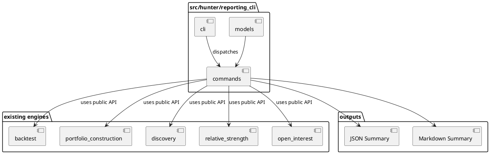
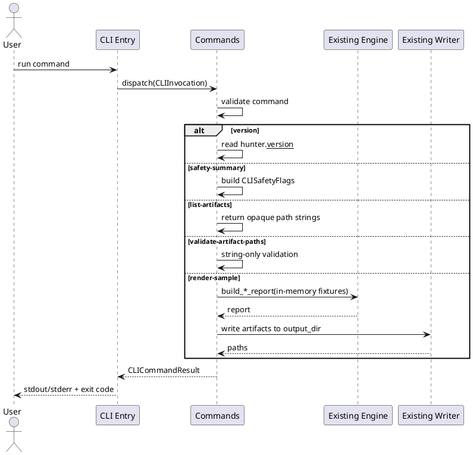

# SPEC-030-Local-Research-Reporting-CLI

## Background

The project completes MVP-28 at version `0.28.0-dev`. The existing engine layers (audit/review governance, relative strength, open interest, discovery, portfolio construction, and local backtesting) each produce deterministic, local, human-audit research reports. Each engine has its own writer module that serializes reports to JSON, CSV, and Markdown under predictable local paths. There is currently no unified, safe, local command-line surface for a researcher to inspect, summarize, or regenerate these artifacts without writing ad-hoc scripts.

The **Local Research Reporting CLI** (MVP-29) exists to provide a minimal, deterministic, local command-line layer for generating and inspecting human-audit research artifacts. It is **not** a trading CLI, not an execution CLI, not a portfolio management CLI, and not a production operations tool. It does not place orders, contact exchanges, start services, or produce trading signals. It consumes already-built local engine APIs and writer modules only.

MVP-29 remains explicitly **research-only**. It is not a trading signal, not trade approval, not strategy approval, not execution approval, not portfolio approval, and not Freqtrade input. It must not connect to Binance, exchanges, APIs, networks, live data, API keys, or real trading. It must not place orders, suggest orders, emit action commands, or create execution instructions. It must not produce or consume Freqtrade strategy classes. It must not modify execution, strategy, Freqtrade, order, exchange, or portfolio paths. It must not feed back into execution paths. It must not start a server, daemon, scheduler, Web UI, dashboard, API, database, or runtime registry. All data processed by the CLI is either already-loaded in-memory values passed by the caller, or local string paths treated as opaque identifiers only.

Because this MVP introduces a CLI, the SPEC must be especially strict: the CLI must be a thin, deterministic orchestrator over existing safe engine APIs. It must not grow into a generic file ingestion pipeline, a runtime registry, or a configuration-driven execution layer. Every command must be fail-closed, every output must be labeled as research-only, and every path must be handled as an opaque local string unless the command explicitly and narrowly requires reading a file from that exact path.

## Requirements

### Must Have (M)

- **M1:** Provide a local command-line package `src/hunter/reporting_cli/` with a public API exported from `src/hunter/reporting_cli/__init__.py`.
- **M2:** The CLI is local-only; no server, no REST API, no Web UI, no dashboard, no daemon, no scheduler, no database, no network calls, no exchange calls, no Binance, no Freqtrade import/runtime, no API keys, no live data, no real orders, no leverage, no shorting, no action commands, no trading signals, no approvals.
- **M3:** Expose a deterministic `version` command that prints the project version from `src/hunter/__init__.py` and returns a structured result.
- **M4:** Expose a `safety-summary` command that prints a short, deterministic research-only safety notice and returns a structured result containing the same safety invariants as the existing engines (no trading, no orders, no exchange, no network, no Freqtrade, etc.).
- **M5:** Expose a `list-artifacts` command that returns deterministic summary records of the default output paths from each engine as opaque local strings. It must not read the files, follow symlinks, or traverse metadata references. It must only report the configured/default paths and their engines.
- **M6:** Expose a `render-sample` command that builds deterministic in-memory sample reports using existing public engine APIs (`build_backtest_report`, portfolio construction, discovery, etc.) and writes JSON, CSV, and Markdown artifacts to a caller-provided output directory using existing writer modules. It must not read arbitrary input files or follow external references.
- **M7:** Expose a `validate-artifact-paths` command that performs string-only validation on caller-provided local paths (e.g., non-empty, no traversal characters, no URL-like strings, no network prefixes) and returns a structured pass/fail result. It must not open, follow, traverse, or execute the paths or any metadata/file references they may contain.
- **M8:** All commands return structured `CLICommandResult` objects usable from tests, in addition to deterministic stdout/stderr output.
- **M9:** Deterministic exit codes via `CLIExitCode` enum: `OK`, `USAGE_ERROR`, `VALIDATION_ERROR`, `UNSAFE_CONTENT`, `INTERNAL_ERROR`.
- **M10:** Models include `CLICommandResult`, `CLIExitCode`, `CLIOutputFormat`, `CLIInvocation`, `CLIArtifactSummary`, and `CLISafetyFlags` as frozen dataclasses with validation.
- **M11:** Every CLI help text and every rendered artifact must include an explicit research-only / not-trading-advice notice.
- **M12:** No arbitrary file ingestion in MVP-29. The only file reads are from the `render-sample` in-memory fixtures and from the existing writer modules. If a future MVP needs to read existing report JSON, it must be specified separately and constrained to caller-provided local paths with no traversal/following/execution.
- **M13:** Metadata and file-reference strings remain opaque local strings only; the CLI never opens, follows, traverses, validates, fetches, or executes them.

### Should Have (S)

- **S1:** A thin CLI entry point (`python -m hunter.reporting_cli` or `hunter-report`) that dispatches commands via the public command functions.
- **S2:** `CLIOutputFormat` enum supporting `JSON`, `MARKDOWN`, and `TEXT` for command output.
- **S3:** A `CLIInvocation` dataclass that captures command name, arguments, output directory, output format, and optional flags.
- **S4:** A `CLIArtifactSummary` dataclass that records engine id, artifact kind, default path, and whether the path is a string-only opaque identifier.
- **S5:** `safety-summary` command can emit JSON in addition to plain text for testability.
- **S6:** `render-sample` produces deterministic sample reports for backtest, portfolio construction, and discovery using the existing public APIs, with explicit fixed seeds/fixed timestamps.
- **S7:** Atomic writes for any artifacts produced by `render-sample` (reuse existing writer atomic helpers).
- **S8:** Tests use `tmp_path` only for file writes; model and command-function tests are in-memory.

### Could Have (C)

- **C1:** A `--dry-run` flag for `render-sample` that returns the artifact paths without writing them.
- **C2:** A `config-check` command that validates the CLI package can import all required engines and reports version alignment without executing them.
- **C3:** Grouped output by engine in `list-artifacts` Markdown.

### Won't Have (W)

- **W1:** No production trading or execution CLI.
- **W2:** No order placement, position sizing, leverage, shorting, margin, or fee/slippage models.
- **W3:** No Binance, exchange, API, network, live data, or WebSocket.
- **W4:** No Freqtrade strategy class, Freqtrade input, or Freqtrade runtime connection.
- **W5:** No server, REST API, Web UI, dashboard, scheduler, daemon, database, auth, or task runner.
- **W6:** No arbitrary file ingestion or directory traversal beyond explicitly caller-provided local paths in this MVP.
- **W7:** No config schema, YAML schema, JSON schema, or runtime registry.
- **W8:** No execution feedback, strategy optimization, or parameter curve fitting.
- **W9:** No action commands, buy/sell/hold recommendations, or trading signals.
- **W10:** No real capital, real orders, or real market data.

## Method

### Proposed Package Layout

```
src/hunter/
└── reporting_cli/
    ├── __init__.py          # Public API exports
    ├── models.py            # Enums, frozen dataclasses, safety flags, reason codes
    ├── commands.py          # Pure command implementations returning CLICommandResult
    └── cli.py               # Thin CLI entry point dispatching commands (optional)

tests/test_reporting_cli/
    ├── __init__.py
    ├── test_models.py       # Model validation, safety flags, exit codes
    ├── test_commands.py     # Pure command functions, fail-closed behavior
    └── test_integration.py  # End-to-end CLI flows and safety assertions
```

### Output Paths

The CLI does not introduce new artifact paths for existing engines. It uses the default paths from each engine as opaque string identifiers for `list-artifacts` and accepts a caller-provided output directory for `render-sample`.

Default `render-sample` output directory if not provided: `data/reporting_cli/samples/`.

### Models

All models are frozen `@dataclass(frozen=True)` unless otherwise noted. Immutable/copy-safe mappings are used for `metadata` fields.

```python
REPORTING_CLI_VERSION: str = "0.29.0-dev"


class CLIExitCode(Enum):
    OK = 0
    USAGE_ERROR = 2
    VALIDATION_ERROR = 3
    UNSAFE_CONTENT = 4
    INTERNAL_ERROR = 5


class CLIOutputFormat(Enum):
    JSON = "JSON"
    MARKDOWN = "MARKDOWN"
    TEXT = "TEXT"


class CLICommandKind(Enum):
    VERSION = "version"
    SAFETY_SUMMARY = "safety-summary"
    LIST_ARTIFACTS = "list-artifacts"
    RENDER_SAMPLE = "render-sample"
    VALIDATE_ARTIFACT_PATHS = "validate-artifact-paths"


@dataclass(frozen=True)
class CLISafetyFlags:
    no_trading_signal: bool = True
    no_trade_approval: bool = True
    no_strategy_approval: bool = True
    no_execution_approval: bool = True
    no_portfolio_approval: bool = True
    no_universe_approval: bool = True
    no_order_sizing: bool = True
    no_position_sizing: bool = True
    no_leverage: bool = True
    no_shorting: bool = True
    no_action_commands: bool = True
    no_network_connection: bool = True
    no_file_read_in_engine: bool = True
    no_database: bool = True
    no_exchange_connection: bool = True
    no_freqtrade_input: bool = True
    no_scheduler: bool = True
    no_web_ui: bool = True
    no_daemon: bool = True
    no_rest_api: bool = True
    research_only: bool = True
    not_trading_advice: bool = True
    has_unsafe_content: bool = False
    has_invalid_path: bool = False
    has_traversal_attempt: bool = False
    has_network_reference: bool = False

    @property
    def is_safe(self) -> bool:
        return all([
            # all "no_*" and "not_*" / "research_only" flags True
            # all "has_*" flags False
        ])
```

#### `CLIArtifactSummary`

```python
@dataclass(frozen=True)
class CLIArtifactSummary:
    engine_id: str
    artifact_kind: str
    default_path: str
    path_is_opaque_string: bool = True
    metadata: Mapping[str, str] = field(default_factory=dict)
```

- `engine_id`: non-empty identifier such as `"backtest"`, `"portfolio_construction"`, `"discovery"`, etc.
- `artifact_kind`: non-empty kind such as `"json_report"`, `"csv_results"`, `"markdown_report"`.
- `default_path`: opaque local string path. Never opened, followed, or traversed.
- `path_is_opaque_string`: always True in this MVP; documents that the path is not read.
- `metadata`: immutable mapping of opaque string metadata.

#### `CLIInvocation`

```python
@dataclass(frozen=True)
class CLIInvocation:
    command: str
    args: tuple[str, ...] = ()
    output_dir: str | None = None
    output_format: CLIOutputFormat = CLIOutputFormat.TEXT
    dry_run: bool = False
    metadata: Mapping[str, str] = field(default_factory=dict)
```

- `command`: non-empty command name, one of the supported commands.
- `args`: positional arguments passed to the command.
- `output_dir`: caller-provided output directory for commands that write artifacts.
- `output_format`: output format for command result rendering.
- `dry_run`: if True, commands that would write files return paths without writing.
- `metadata`: immutable mapping of opaque string metadata.

#### `CLICommandResult`

```python
@dataclass(frozen=True)
class CLICommandResult:
    command: str
    exit_code: CLIExitCode
    stdout: str
    stderr: str
    output_paths: tuple[str, ...]
    data: Mapping[str, Any]
    safety_flags: CLISafetyFlags
    reason_codes: tuple[str, ...]
    notes: tuple[str, ...]
```

- `command`: the command that was executed.
- `exit_code`: deterministic exit code enum.
- `stdout` / `stderr`: deterministic text output.
- `output_paths`: tuple of opaque local string paths produced or inspected by the command.
- `data`: structured result data (e.g., version string, safety summary dict, artifact list).
- `safety_flags`: safety flags captured for this invocation.
- `reason_codes`: reason codes explaining the outcome.
- `notes`: human-readable research-only notes.

### Reason Codes

```python
REPORTING_CLI_REASON_CODES: frozenset[str] = frozenset({
    "OK",
    "UNKNOWN_COMMAND",
    "USAGE_ERROR",
    "VALIDATION_ERROR",
    "UNSAFE_CONTENT",
    "INVALID_PATH",
    "PATH_TRAVERSAL_DETECTED",
    "NETWORK_REFERENCE_DETECTED",
    "RESEARCH_ONLY",
    "NOT_TRADING_ADVICE",
    "NO_FILE_INGESTION",
    "OPAQUE_PATH_ONLY",
})
```

### Algorithms

#### Command Dispatch

1. Parse the CLI invocation into a `CLIInvocation`.
2. Validate the command name is known; if not, return `CLICommandResult` with `exit_code=USAGE_ERROR` and `reason_code=UNKNOWN_COMMAND`.
3. Build baseline `CLISafetyFlags` with all safety invariants set to True and `has_*` flags False.
4. Run the command function.
5. Return a `CLICommandResult` with deterministic stdout/stderr, structured `data`, and updated safety flags.

#### `version` Command

1. Read `src.hunter.__version__`.
2. Return `CLICommandResult` with:
   - `exit_code=OK`
   - `stdout="hunter-futures-pro <version>"`
   - `data={"version": "..."}`
   - `reason_codes=("OK", "RESEARCH_ONLY", "NOT_TRADING_ADVICE")`

#### `safety-summary` Command

1. Build `CLISafetyFlags` with all `no_*` flags True and `has_*` flags False.
2. Render a deterministic safety notice stating that the CLI is research-only and forbids trading, orders, execution, exchange, network, Freqtrade, etc.
3. If `output_format=JSON`, render the safety flags as JSON. If `TEXT`, render the notice as plain text.
4. Return `CLICommandResult` with `exit_code=OK` and `data` containing the safety flags dict.

#### `list-artifacts` Command

1. Build a deterministic list of `CLIArtifactSummary` records for the existing engines and their default output paths. Each path is an opaque local string.
2. Do not open, read, follow, or traverse any path.
3. Return `CLICommandResult` with `exit_code=OK`, `data={"artifacts": [...]}`, and `output_paths` empty.

#### `render-sample` Command

1. Validate `output_dir` is a safe local string path (no traversal, no URL, no network prefix). If invalid, return `VALIDATION_ERROR`.
2. Build deterministic in-memory sample inputs for each supported engine using the existing public APIs and fixed timestamps.
3. Call existing engine `build_*_report` functions to produce reports.
4. For each report, call the existing writer module to write JSON, CSV, and Markdown under `output_dir` (or return paths only if `dry_run=True`).
5. Return `CLICommandResult` with `exit_code=OK`, `output_paths` containing the written paths, and `data` containing report summaries.

#### `validate-artifact-paths` Command

1. For each caller-provided path string:
   - Reject empty strings.
   - Reject strings containing `..`, `http://`, `https://`, `ftp://`, or network-like prefixes.
   - Reject strings that look like URL paths (e.g., contain `://`).
   - Reject absolute paths that point outside the current working directory.
   - Reject parent traversal segments.
   - Reject symlink following; do not open, read, or follow the path.
2. Perform string/path normalization only as specified; do not open, read, follow, or execute the paths or any metadata/file references they may contain.
3. Return `CLICommandResult` with `exit_code=OK` if all paths pass, or `VALIDATION_ERROR`/`UNSAFE_CONTENT` if any fail.

### Implementation Clarifications

The following clarifications are binding on the implementation.

#### `render-sample` Output Naming

All files produced by `render-sample` must be written under the caller-provided `output_dir` (default: `data/reporting_cli/samples/`). No command may write files outside `output_dir`. Use deterministic subdirectories per sample/report type as follows:

- `output_dir/backtest/backtest_report.json`
- `output_dir/backtest/backtest_report.csv`
- `output_dir/backtest/backtest_report.md`
- `output_dir/portfolio_construction/portfolio_construction_report.json`
- `output_dir/portfolio_construction/portfolio_construction_report.csv`
- `output_dir/portfolio_construction/portfolio_construction_report.md`
- `output_dir/discovery/discovery_report.json`
- `output_dir/discovery/discovery_report.csv`
- `output_dir/discovery/discovery_report.md`
- `output_dir/reporting_cli/cli_summary.json`
- `output_dir/reporting_cli/cli_summary.md`

These paths are constructed from `output_dir` and the engine/report identifiers as opaque local strings; the command does not follow symlinks, traverse parent directories, or write outside `output_dir`.

#### `validate-artifact-paths` Fail-Closed Behavior

The validation command is deterministic and fail-closed:

- Reject absolute paths that point outside the current working directory.
- Reject parent traversal segments (`..`).
- Reject network-like or URL-like prefixes (`http://`, `https://`, `ftp://`, `://`).
- Reject symlink following; do not open, read, or follow the path.
- Do not open, read, follow, or execute the paths or any metadata/file references they may contain.

String/path normalization is permitted only to detect traversal and network patterns; no filesystem access is performed.

#### `list-artifacts` Explicit Engine List

The `list-artifacts` command returns `CLIArtifactSummary` records for the following engines and report types. Where available, use the known local default writer paths as opaque string identifiers. Missing writer defaults are represented as informational `CLIArtifactSummary` entries (not errors):

- `relative_strength` (e.g., default JSON / CSV / Markdown paths if defined)
- `open_interest` (e.g., default JSON / CSV / Markdown paths if defined)
- `discovery` (e.g., default JSON / CSV / Markdown paths if defined)
- `portfolio_construction` (e.g., default JSON / CSV / Markdown paths if defined)
- `backtest` (e.g., default JSON / CSV / Markdown paths if defined)
- `reporting_cli` (e.g., `data/reporting_cli/samples/cli_summary.json` and `data/reporting_cli/samples/cli_summary.md`)

Paths are never opened, read, followed, or traversed; they are reported as opaque local strings.

#### `render-sample` Fixture Precision

Sample reports are built from small, deterministic, in-memory fixtures with the following constraints:

- A fixed `generated_at` timestamp (e.g., `2020-01-01T00:00:00+00:00`).
- Small deterministic fixture values (e.g., a minimal number of sample assets, a single sample portfolio, a small set of relative-strength rankings).
- All sample reports are research-only, human-audit artifacts; they are not trading signals, not trade or strategy approval, and not execution or portfolio approval.
- Fixture data must not reference live markets, real orders, real capital, leverage, shorting, exchange connectivity, Binance, API keys, Freqtrade, databases, servers, Web UIs, schedulers, or network services.
- `render-sample` does not read arbitrary files or follow external references; it only uses existing public engine APIs and writer modules to produce the local output files listed above.

### Writer/Output Artifacts

The CLI does not introduce a new writer. It reuses the existing engine writers. For `render-sample`, it may produce an optional top-level `reporting_cli_summary.json` and `reporting_cli_summary.md` describing what was rendered, but these are also research-only human-audit artifacts.

- `data/reporting_cli/samples/` — default output directory for `render-sample`.
- `data/reporting_cli/samples/reporting_cli_summary.json` — optional deterministic summary.
- `data/reporting_cli/samples/reporting_cli_summary.md` — optional deterministic human-readable summary with safety notice.

### Safety Invariants

The following safety invariants must hold for every implementation and test:

1. **Research-only**: The CLI is a human-research tool. It is not a trading signal, not trade approval, not strategy approval, not execution approval, not portfolio approval, and not universe approval.
2. **No execution semantics**: No order, leverage, shorting, position sizing, fee, slippage, fill, or execution language appears in the CLI help, output, or models.
3. **No network/API/exchange**: The CLI never connects to Binance, exchanges, APIs, networks, live data, or external services.
4. **No file ingestion**: MVP-29 does not read arbitrary files. `render-sample` uses in-memory fixtures and existing writers. `list-artifacts` and `validate-artifact-paths` treat paths as opaque strings.
5. **No database**: The CLI does not access a database.
6. **No Freqtrade**: The CLI does not produce or consume Freqtrade strategy classes or inputs.
7. **No action commands**: The CLI does not emit buy, sell, hold, rebalance, or any action commands.
8. **No runtime infrastructure**: No scheduler, crawler, indexer, event store, runtime registry, task runner, server, daemon, or Web UI.
9. **No feedback into execution**: Outputs are not consumed by execution, strategy, Freqtrade, order, exchange, or portfolio paths.
10. **Opaque metadata**: Metadata and file-reference strings are local strings only; they are never opened, followed, traversed, validated, fetched, or executed.
11. **Fail-closed**: Unsafe content, invalid paths, traversal attempts, or network references produce a `VALIDATION_ERROR` or `UNSAFE_CONTENT` result.
12. **No live trading**: No real capital, no real orders, no real market data, no exchange connectivity.

### PlantUML Diagrams

#### Component Diagram



#### Sequence Diagram



## Implementation

Implementation is planned in four steps. Each step is self-contained, has a clear stop condition, and preserves the safety invariants above.

### Step 1: Models and Command Core

**Allowed files:**

- `src/hunter/reporting_cli/__init__.py`
- `src/hunter/reporting_cli/models.py`
- `src/hunter/reporting_cli/commands.py`

**Tests:**

- `tests/test_reporting_cli/__init__.py`
- `tests/test_reporting_cli/test_models.py`
- `tests/test_reporting_cli/test_commands.py`

**Stop conditions:**

- All model validation tests pass.
- All command function tests pass for `version`, `safety-summary`, `list-artifacts`, `validate-artifact-paths`, and `render-sample` (dry-run and tmp_path writes).
- Fail-closed behavior verified for invalid paths, traversal attempts, network references, and unsafe content.
- No network, file ingestion, or exchange calls in command functions.
- `pytest tests/test_reporting_cli/test_models.py tests/test_reporting_cli/test_commands.py -q` passes.

**Safety constraints:**

- No Freqtrade, exchange, or order semantics in models or commands.
- All paths are opaque strings unless the command explicitly validates them as strings.
- Frozen dataclasses and tuple normalization enforced.

### Step 2: CLI Entry Point (Optional)

**Allowed files:**

- `src/hunter/reporting_cli/cli.py` (or `__main__.py` if project pattern supports it)

**Tests:**

- `tests/test_reporting_cli/test_cli.py` (optional)

**Stop conditions:**

- CLI entry point can be invoked via `python -m hunter.reporting_cli <command>` or equivalent.
- Exit codes match `CLIExitCode` values.
- Help text includes the research-only safety notice.
- `pytest tests/test_reporting_cli/test_cli.py -q` passes.

**Safety constraints:**

- CLI entry is a thin dispatcher; no business logic or network/exchange behavior.
- No action commands, no trading instructions, no execution semantics.

### Step 3: Integration Tests

**Tests:**

- `tests/test_reporting_cli/test_integration.py`

**Stop conditions:**

- End-to-end flows from invocation to result to writer output pass.
- Safety assertions pass: no unsafe imports, no network modules, no Freqtrade imports.
- Deterministic outputs verified across repeated runs.
- No mutation of inputs verified.
- `pytest tests/test_reporting_cli/test_integration.py -q` passes.

**Safety constraints:**

- Integration tests use only local, in-memory fixtures and `tmp_path` for writer outputs.
- No real exchange, API, or database usage.
- No Freqtrade strategy classes or execution paths referenced.

### Step 4: Final Validation and Version Bump

**Allowed files:**

- `pyproject.toml` (version bump to `0.29.0-dev`)
- `src/hunter/__init__.py` (version bump to `0.29.0-dev`)
- `CHANGELOG.md` (append only)
- `docs/handoff/CURRENT_STATE.md` (append only)
- `tasks/active.md` (append only)
- `tasks/agent-log.md` (append only)

**Stop conditions:**

- Full test suite passes: `pytest -q --import-mode=importlib`.
- Type checks pass if available.
- Version bumped to `0.29.0-dev` in `pyproject.toml` and `src/hunter/__init__.py`.
- `CHANGELOG.md` updated with MVP-29 entry.
- `docs/handoff/CURRENT_STATE.md`, `tasks/active.md`, and `tasks/agent-log.md` updated.
- No regressions in existing packages.

**Safety constraints:**

- Version bump and documentation are the only changes outside the new package and tests.
- No trading/execution semantics introduced in version or changelog text.

## Milestones

Contractor-ready milestones for MVP-29:

1. **M29.1 — Models and Command Core Complete**:
   - `src/hunter/reporting_cli/models.py` and `commands.py` implemented.
   - Model and command tests pass.
   - Fail-closed behavior verified.

2. **M29.2 — CLI Entry Point Complete** (if implemented):
   - `src/hunter/reporting_cli/cli.py` implemented.
   - Entry point tests pass.

3. **M29.3 — Integration and Safety Validation**:
   - Integration tests pass.
   - Safety invariants verified (no network, no file ingestion, no Freqtrade, no execution semantics).
   - No mutation of inputs verified.

4. **M29.4 — Release Readiness**:
   - Full test suite passes.
   - Version bumped to `0.29.0-dev`.
   - `CHANGELOG.md`, `docs/handoff/CURRENT_STATE.md`, `tasks/active.md`, and `tasks/agent-log.md` updated.
   - SPEC marked complete.

## Gathering Results

The following acceptance criteria define when MVP-29 is complete:

- Focused package tests pass: `pytest tests/test_reporting_cli/ -q`.
- Full suite passes: `pytest -q --import-mode=importlib`.
- Deterministic outputs: identical invocations produce identical `CLICommandResult` objects and byte-identical text outputs.
- No mutation of inputs: caller-provided sequences, mappings, and invocations are unchanged after command execution.
- No unsafe imports: `reporting_cli` package does not import network, exchange, database, Freqtrade, or execution modules.
- No network/API/exchange/file/db behavior in the command or model layer beyond explicit writer reuse.
- No Freqtrade input or strategy class usage.
- Clear human-research interpretation: every CLI output and Markdown artifact includes the research-only safety notice and reason codes.
- No trading/approval/position-sizing semantics: the CLI is a reporting and audit tool only.
- No arbitrary file ingestion: MVP-29 reads only in-memory fixtures and existing writer outputs, treating all paths as opaque strings unless explicitly and narrowly validated.

## Need Professional Help in Developing Your Architecture?

Please contact me at [sammuti.com](https://sammuti.com) :)
