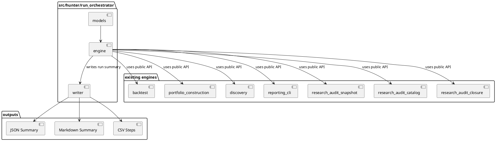
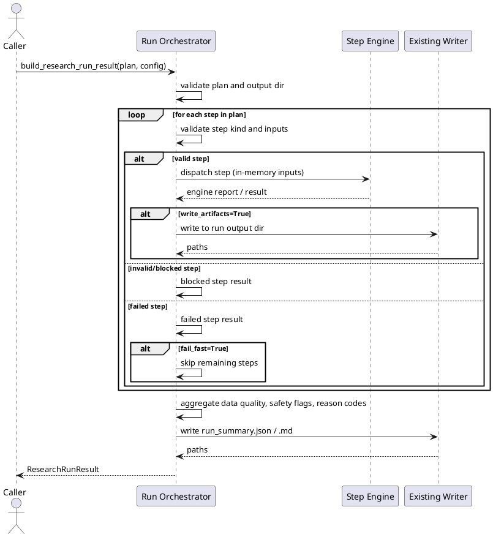

# SPEC-031-Local-Research-Run-Orchestrator

## Background

The project completes MVP-29 at version `0.29.0-dev`. The existing layers
(audit/review governance, relative strength, open interest, discovery,
portfolio construction, local backtesting, and the local reporting CLI) each
produce deterministic, local, human-audit research reports. Each layer has its
own engine and writer module that builds reports from caller-provided in-memory
inputs and serializes artifacts to JSON, CSV, and Markdown under predictable
local paths. There is currently no deterministic, safe, local way to compose
multiple engines into a single coordinated run and produce a single audit-only
run summary.

The **Local Research Run Orchestrator** (MVP-30) exists to provide a minimal,
deterministic, local orchestration layer that executes a caller-provided
research run plan against already implemented local engines and writers, and
produces a single research-only run summary. It is **not** a production job
runner, not a trading orchestrator, not an execution coordinator, and not a
runtime operations tool. It does not place orders, contact exchanges, start
services, schedule jobs, or produce trading signals. It consumes already-built
local engine APIs and writer modules only, and it runs only when called by
local code or tests.

MVP-30 remains explicitly **research-only**. It is not a trading signal, not
trade approval, not strategy approval, not execution approval, not portfolio
approval, and not universe approval. It must not connect to Binance, exchanges,
APIs, networks, live data, API keys, or real trading. It must not place orders,
suggest orders, emit action commands, or create execution instructions. It must
not produce or consume Freqtrade strategy classes. It must not modify execution,
strategy, Freqtrade, order, exchange, or portfolio paths. It must not feed back
into execution paths. It must not start a server, daemon, scheduler, Web UI,
dashboard, API, database, or runtime registry. All data processed by the
orchestrator is either already-loaded in-memory values passed by the caller, or
local string paths treated as opaque identifiers only.

Because this MVP introduces an orchestrator, the SPEC must be especially strict:
the orchestrator must be a thin, deterministic coordinator over existing safe
engine APIs. It must not grow into a generic file ingestion pipeline, a runtime
registry, a configuration-driven execution layer, or a background job system.
Every run must be fail-closed, every output must be labeled as research-only,
and every path must be handled as an opaque local string unless the writer
module explicitly and narrowly writes to that exact path.

## Requirements

### Must Have (M)

- **M1:** Provide a local orchestration package `src/hunter/run_orchestrator/`
  with a public API exported from `src/hunter/run_orchestrator/__init__.py`.
- **M2:** The orchestrator is local-only and call-triggered; no server, no REST
  API, no Web UI, no dashboard, no daemon, no scheduler, no background loop,
  no cron, no database, no network calls, no exchange calls, no Binance, no
  Freqtrade import/runtime, no API keys, no live data, no real orders, no
  leverage, no shorting, no action commands, no trading signals, no approvals.
- **M3:** Models include frozen dataclasses: `ResearchRunPlan`, `ResearchRunStep`,
  `ResearchRunConfig`, `ResearchRunStepResult`, `ResearchRunResult`,
  `ResearchRunArtifact`, `ResearchRunDataQuality`, and `ResearchRunSafetyFlags`.
- **M4:** Include a `ResearchRunStepKind` enum with at least the following
  supported values:
  - `REPORTING_CLI_SAMPLE`
  - `BACKTEST`
  - `PORTFOLIO_CONSTRUCTION`
  - `DISCOVERY`
  - `AUDIT_SNAPSHOT_SUMMARY` (reference-only summary from caller-provided data)
  - `AUDIT_CATALOG_SUMMARY` (reference-only summary from caller-provided data)
  - `AUDIT_CLOSURE_SUMMARY` (reference-only summary from caller-provided data)
- **M5:** The orchestrator executes a `ResearchRunPlan` step-by-step in a stable,
  deterministic order. Each step produces a `ResearchRunStepResult`.
- **M6:** The engine is fail-closed: unknown step kinds, unsafe step content,
  invalid paths, or disallowed step kinds produce a blocked/error step result and,
  depending on `fail_fast`, either abort the run or record the failure and
  continue deterministically.
- **M7:** The orchestrator accepts caller-provided in-memory inputs for each
  step. It does not read arbitrary files, follow symlinks, traverse metadata, or
  ingest external data. Existing writer modules perform any file writes they
  already support.
- **M8:** The orchestrator produces a `ResearchRunResult` containing the step
  results, a data-quality summary, safety flags, and an opaque artifact list.
- **M9:** The writer module serializes the run result to deterministic JSON and
  Markdown, and optionally CSV for step rows. All writes are atomic (temp file +
  `os.replace` or equivalent).
- **M10:** Every output artifact and Markdown header includes an explicit
  research-only / not-trading-advice notice.
- **M11:** The orchestrator supports a fixed `generated_at` timestamp for
  deterministic testing and reproducible audit artifacts.
- **M12:** No arbitrary file ingestion in MVP-30. The orchestrator only uses
  caller-provided in-memory inputs and existing writer modules. If a future MVP
  needs to read existing report JSON, it must be specified separately and
  constrained to caller-provided local paths with no traversal/following/
  execution.
- **M13:** Metadata and file-reference strings remain opaque local strings only;
  the orchestrator never opens, follows, traverses, validates, fetches, or
  executes them.

### Should Have (S)

- **S1:** `ResearchRunConfig` exposes a `fail_fast: bool` flag (default `True`).
  When `fail_fast=True`, the first step failure aborts the run. When
  `fail_fast=False`, the orchestrator records each failure and continues to the
  next step, producing a deterministic result with failure reasons.
- **S2:** `ResearchRunConfig` exposes a `write_artifacts: bool` flag (default
  `True`). When `False`, the orchestrator returns artifact paths in the result
  without invoking writer modules.
- **S3:** `ResearchRunResult` exposes a `reason_codes` tuple that aggregates the
  reason codes from each step, plus orchestrator-level reason codes such as
  `OK`, `RUN_BLOCKED`, `STEP_FAILED`, and `RESEARCH_ONLY`.
- **S4:** The writer supports a default local output directory:
  `data/run_orchestrator/latest_run/`. Subdirectories per step are named after the
  step kind.
- **S5:** The orchestrator produces a top-level `run_summary.json` and
  `run_summary.md` describing the run, plus step-level artifacts produced by
  each engine's writer when `write_artifacts=True`.
- **S6:** Step inputs are immutable; the orchestrator must not mutate
  caller-provided sequences, mappings, or dataclasses.
- **S7:** Model and engine tests are in-memory; writer tests use `tmp_path` only.

### Could Have (C)

- **C1:** A `validate_plan` function that checks a `ResearchRunPlan` for
  unsupported step kinds, missing inputs, and unsafe content without executing
  it.
- **C2:** A lightweight `plan_from_steps` helper that builds a
  `ResearchRunPlan` from a sequence of `(kind, inputs)` pairs.
- **C3:** A `run_orchestrator_summary` command that mirrors the reporting CLI
  pattern but lives in the orchestrator package.

### Won't Have (W)

- **W1:** No production job runner, task queue, or workflow scheduler.
- **W2:** No background loop, cron, daemon, or persistent worker process.
- **W3:** No order placement, position sizing, leverage, shorting, margin, fee,
  slippage, fill, or execution language.
- **W4:** No Binance, exchange, API, network, live data, or WebSocket.
- **W5:** No Freqtrade strategy class, Freqtrade input, or Freqtrade runtime
  connection.
- **W6:** No server, REST API, Web UI, dashboard, database, auth, or task
  runner.
- **W7:** No arbitrary file ingestion or directory traversal beyond explicitly
  caller-provided local paths in this MVP.
- **W8:** No config schema, YAML schema, JSON schema, or runtime registry.
- **W9:** No execution feedback, strategy optimization, or parameter curve
  fitting.
- **W10:** No action commands, buy/sell/hold recommendations, or trading
  signals.
- **W11:** No real capital, real orders, or real market data.

## Method

### Proposed Package Layout

```
src/hunter/
└── run_orchestrator/
    ├── __init__.py          # Public API exports
    ├── models.py            # Enums, frozen dataclasses, safety flags, reason codes
    ├── engine.py            # Pure orchestration engine
    └── writer.py            # Deterministic JSON/Markdown/CSV writers and atomic writes

tests/test_run_orchestrator/
    ├── __init__.py
    ├── test_models.py       # Model validation, safety flags, reason codes
    ├── test_engine.py       # Orchestration logic, fail-closed behavior, determinism
    ├── test_writer.py       # Writer serialization and atomic write behavior
    └── test_integration.py  # End-to-end run flows and safety assertions
```

### Output Paths

The orchestrator introduces a single top-level output directory for its own
summary artifacts. Step-level artifacts are written by the existing engine
writers into subdirectories under the run output directory.

Default run output directory: `data/run_orchestrator/latest_run/`.

Top-level orchestrator outputs:

- `data/run_orchestrator/latest_run/run_summary.json`
- `data/run_orchestrator/latest_run/run_summary.md`
- `data/run_orchestrator/latest_run/run_steps.csv` (optional)

Step-level subdirectories (when the corresponding step kind is included and
`write_artifacts=True`):

- `data/run_orchestrator/latest_run/<step_index>_backtest/`
- `data/run_orchestrator/latest_run/<step_index>_portfolio_construction/`
- `data/run_orchestrator/latest_run/<step_index>_discovery/`
- `data/run_orchestrator/latest_run/<step_index>_reporting_cli_sample/`
- `data/run_orchestrator/latest_run/<step_index>_audit_snapshot_summary/`
- `data/run_orchestrator/latest_run/<step_index>_audit_catalog_summary/`
- `data/run_orchestrator/latest_run/<step_index>_audit_closure_summary/`

The exact step-level paths are constructed by the orchestrator from the run
output directory and the step index/kind as opaque local strings. The
orchestrator does not follow symlinks, traverse parent directories, or write
outside the run output directory. Existing engine writers receive these paths
as explicit arguments and perform their own atomic writes.

### Models

All models are frozen `@dataclass(frozen=True)` unless otherwise noted.
Immutable/copy-safe mappings are used for `metadata` fields.

```python
RUN_ORCHESTRATOR_VERSION: str = "0.30.0-dev"


class ResearchRunStepKind(Enum):
    REPORTING_CLI_SAMPLE = "reporting_cli_sample"
    BACKTEST = "backtest"
    PORTFOLIO_CONSTRUCTION = "portfolio_construction"
    DISCOVERY = "discovery"
    AUDIT_SNAPSHOT_SUMMARY = "audit_snapshot_summary"
    AUDIT_CATALOG_SUMMARY = "audit_catalog_summary"
    AUDIT_CLOSURE_SUMMARY = "audit_closure_summary"
```

#### `ResearchRunSafetyFlags`

```python
@dataclass(frozen=True)
class ResearchRunSafetyFlags:
    no_trading_signal: bool = True
    no_trade_approval: bool = True
    no_strategy_approval: bool = True
    no_execution_approval: bool = True
    no_portfolio_approval: bool = True
    no_universe_approval: bool = True
    no_order_sizing: bool = True
    no_position_sizing: bool = True
    no_leverage: bool = True
    no_shorting: bool = True
    no_action_commands: bool = True
    no_network_connection: bool = True
    no_file_read_in_engine: bool = True
    no_database: bool = True
    no_exchange_connection: bool = True
    no_freqtrade_input: bool = True
    no_scheduler: bool = True
    no_web_ui: bool = True
    no_daemon: bool = True
    no_rest_api: bool = True
    no_background_job: bool = True
    research_only: bool = True
    not_trading_advice: bool = True
    has_unsafe_content: bool = False
    has_invalid_step: bool = False
    has_failed_step: bool = False
    has_blocked_step: bool = False

    @property
    def is_safe(self) -> bool:
        return all([
            # all "no_*" and "not_*" / "research_only" flags True
            # all "has_*" flags False
        ])
```

#### `ResearchRunStep`

```python
@dataclass(frozen=True)
class ResearchRunStep:
    kind: ResearchRunStepKind
    inputs: Mapping[str, Any] = field(default_factory=dict)
    metadata: Mapping[str, str] = field(default_factory=dict)
```

- `kind`: the step kind; must be one of the supported enum values.
- `inputs`: immutable mapping of caller-provided in-memory inputs for the step.
  The orchestrator never reads files from these values.
- `metadata`: immutable mapping of opaque string metadata.

#### `ResearchRunPlan`

```python
@dataclass(frozen=True)
class ResearchRunPlan:
    run_id: str
    steps: tuple[ResearchRunStep, ...]
    metadata: Mapping[str, str] = field(default_factory=dict)
```

- `run_id`: non-empty identifier for the run.
- `steps`: ordered tuple of steps to execute.
- `metadata`: immutable mapping of opaque string metadata.

#### `ResearchRunConfig`

```python
@dataclass(frozen=True)
class ResearchRunConfig:
    fail_fast: bool = True
    write_artifacts: bool = True
    output_dir: str | None = None
    generated_at: datetime | None = None
```

- `fail_fast`: if True, abort the run on the first step failure. If False,
  record failures and continue deterministically.
- `write_artifacts`: if True, invoke existing engine writers to write step
  artifacts. If False, return paths in the result without writing.
- `output_dir`: caller-provided output directory. Defaults to
  `data/run_orchestrator/latest_run/`.
- `generated_at`: fixed timestamp for deterministic output. Defaults to the
  current UTC time only if not provided by the caller.

#### `ResearchRunStepResult`

```python
@dataclass(frozen=True)
class ResearchRunStepResult:
    step_index: int
    kind: ResearchRunStepKind
    exit_code: int
    succeeded: bool
    reason_codes: tuple[str, ...]
    output_paths: tuple[str, ...] = ()
    data: Mapping[str, Any] = field(default_factory=dict)
    notes: tuple[str, ...] = ()
```

- `step_index`: zero-based position in the plan.
- `kind`: the step kind that was executed.
- `exit_code`: integer exit code for the step (`0` for OK, non-zero for
  failure/blocked).
- `succeeded`: True if the step completed successfully.
- `reason_codes`: ordered tuple of reason codes for the step.
- `output_paths`: tuple of opaque local paths written or planned for the step.
- `data`: immutable mapping of step-specific summary data.
- `notes`: tuple of human-readable notes, including the safety notice.

#### `ResearchRunArtifact`

```python
@dataclass(frozen=True)
class ResearchRunArtifact:
    step_index: int
    kind: str
    path: str
    metadata: Mapping[str, str] = field(default_factory=dict)
```

- `step_index`: the step that produced the artifact.
- `kind`: artifact kind, e.g., `"json_report"`, `"csv_results"`,
  `"markdown_report"`, `"run_summary"`.
- `path`: opaque local path string. Never opened, followed, or traversed.
- `metadata`: immutable mapping of opaque string metadata.

#### `ResearchRunDataQuality`

```python
@dataclass(frozen=True)
class ResearchRunDataQuality:
    total_steps: int
    completed_steps: int
    failed_steps: int
    blocked_steps: int
    skipped_steps: int
    sections_present: int
    sections_expected: int
    notes: tuple[str, ...] = ()
```

- `total_steps`: total number of steps in the plan.
- `completed_steps`: number of steps that succeeded.
- `failed_steps`: number of steps that failed but were not blocked.
- `blocked_steps`: number of steps blocked due to unsafe/invalid content.
- `skipped_steps`: number of steps skipped due to an earlier abort.
- `sections_present`: number of data-quality sections present in the result.
- `sections_expected`: number of data-quality sections expected.
- `notes`: tuple of human-readable notes.

#### `ResearchRunResult`

```python
@dataclass(frozen=True)
class ResearchRunResult:
    run_id: str
    version: str
    generated_at: datetime
    config: ResearchRunConfig
    plan: ResearchRunPlan
    step_results: tuple[ResearchRunStepResult, ...]
    artifacts: tuple[ResearchRunArtifact, ...]
    data_quality: ResearchRunDataQuality
    safety_flags: ResearchRunSafetyFlags
    reason_codes: tuple[str, ...]
    stdout: str = ""
    stderr: str = ""
    notes: tuple[str, ...] = ()
```

- `run_id`: the run identifier from the plan.
- `version`: `RUN_ORCHESTRATOR_VERSION`.
- `generated_at`: fixed or default timestamp.
- `config`: the run configuration.
- `plan`: the original plan (immutable).
- `step_results`: ordered tuple of step results.
- `artifacts`: ordered tuple of run-level and step-level artifacts.
- `data_quality`: summary of step completion and data quality.
- `safety_flags`: aggregated safety flags for the run.
- `reason_codes`: ordered tuple of reason codes for the run.
- `stdout`: human-readable text summary.
- `stderr`: human-readable error text if any step failed.
- `notes`: tuple of notes, including the safety notice.

### Algorithms

#### Run Orchestration

```text
1. Validate the ResearchRunPlan:
   a. Reject empty run_id.
   b. Reject steps with unknown or unsupported ResearchRunStepKind.
   c. Reject steps with unsafe content or forbidden terms.
   d. Reject steps that imply network, exchange, trading, or execution semantics.
   e. If validation fails, return a blocked ResearchRunResult with reason codes.

2. Build the run output directory path from config.output_dir.
   a. Validate the path string as a safe local path (no traversal, no network prefix).
   b. If invalid, return a blocked ResearchRunResult.

3. For each step in plan.steps, in order, by stable index:
   a. Validate the step kind and inputs.
   b. If validation fails, record a blocked/failed step result.
      - If fail_fast, abort and skip remaining steps.
      - Else continue to the next step.
   c. Dispatch the step to the appropriate engine command runner.
      - backtest -> build_backtest_report(...) and write_backtest_report(...) if write_artifacts
      - portfolio_construction -> build_portfolio_construction_report(...) and write_portfolio_construction_report(...) if write_artifacts
      - discovery -> build_discovery_report(...) and write_discovery_report(...) if write_artifacts
      - reporting_cli_sample -> run_render_sample_command(...) from reporting_cli.commands
      - audit_*_summary -> build_* from existing audit packages, using caller-provided inputs only
   d. Collect the step result, output paths, and summary data.
   e. If the step fails and fail_fast is True, abort the run and mark remaining steps as skipped.

4. Aggregate step results into ResearchRunDataQuality.

5. Build ResearchRunSafetyFlags:
   - All baseline safety invariants are True.
   - Set has_failed_step if any step failed.
   - Set has_blocked_step if any step was blocked.
   - Set has_invalid_step if any step was invalid.

6. Build the top-level run summary artifact paths.

7. If write_artifacts is True, write run_summary.json and run_summary.md atomically.

8. Return ResearchRunResult.
```

#### Step Dispatch

Each supported step kind maps to an existing local engine function. The
orchestrator never invents new engine behavior; it only calls the public API
that the corresponding engine already exposes.

- `REPORTING_CLI_SAMPLE`: call `run_render_sample_command(...)` from
  `hunter.reporting_cli.commands` with a fixed output directory under the run
  output directory. This is a convenience step that demonstrates the CLI sample
  flow as part of a coordinated run.
- `BACKTEST`: call `build_backtest_report(...)` from `hunter.backtest` using the
  caller-provided `BacktestInput` objects, then call `write_backtest_report(...)`
  if `write_artifacts=True`.
- `PORTFOLIO_CONSTRUCTION`: call `build_portfolio_construction_report(...)` from
  `hunter.portfolio_construction` using caller-provided inputs, then call
  `write_portfolio_construction_report(...)` if `write_artifacts=True`.
- `DISCOVERY`: call `build_discovery_report(...)` from `hunter.discovery` using
  caller-provided inputs, then call `write_discovery_report(...)` if
  `write_artifacts=True`.
- `AUDIT_SNAPSHOT_SUMMARY`: call `build_research_audit_snapshot(...)` from
  `hunter.research_audit_snapshot` using caller-provided inputs only. The
  orchestrator does not read files.
- `AUDIT_CATALOG_SUMMARY`: call `build_research_audit_catalog(...)` from
  `hunter.research_audit_catalog` using caller-provided inputs only.
- `AUDIT_CLOSURE_SUMMARY`: call `build_research_audit_closure_report(...)` from
  `hunter.research_audit_closure` using caller-provided inputs only.

Unknown or unsupported step kinds are rejected at validation time and produce a
blocked step result with reason code `UNKNOWN_STEP_KIND`.

#### Fail-Closed Behavior

The orchestrator is deterministic and fail-closed:

- Reject plans with empty run IDs or empty step tuples.
- Reject unknown or unsupported step kinds.
- Reject step inputs that contain forbidden terms implying trading, execution,
  exchange, network, or order semantics.
- Reject output directory paths that contain traversal segments (`..`), network
  prefixes (`://`), or absolute paths outside the current working directory.
- Reject attempts to run steps that require network, exchange, database, or
  Freqtrade behavior.
- If a step fails and `fail_fast=True`, abort immediately and mark remaining
  steps as `SKIPPED`.
- If a step fails and `fail_fast=False`, record the failure and continue to the
  next step.
- No filesystem access is performed except through existing writer modules with
  explicitly constructed safe local paths.

#### Determinism

- Step order is preserved from the plan.
- Output paths are constructed deterministically from the run output directory,
  step index, and step kind.
- Sorting of artifacts and reason codes is stable.
- Caller-provided `generated_at` removes wall-clock dependency in tests.
- No `random` module usage, no `uuid` (unless deterministic), no
  environment-dependent behavior.

### Writer/Output Artifacts

The orchestrator introduces a single writer module for its own run summary
artifacts. It reuses existing engine writers for step-level artifacts.

Run-level outputs:

- `run_summary.json` — deterministic JSON serialization of `ResearchRunResult`
  with sorted keys, enums as strings, ISO-8601 datetimes, tuples as lists, and
  mappings as plain dicts.
- `run_summary.md` — Markdown report with H1 title, explicit research-only
  safety notice, run identity, configuration summary, data-quality summary, step
  results table, artifact list, safety flags, and metadata.
- `run_steps.csv` (optional) — one row per `ResearchRunStepResult` with stable
  column order and pipe-delimited reason codes.

Step-level outputs are produced by the existing engine writers and are listed in
`ResearchRunResult.artifacts` as opaque local path strings.

All file writes are atomic: write to a temp file, fsync, then `os.replace` to the
final path. Parent directories are created as needed.

### Safety Invariants

The following safety invariants must hold for every implementation and test:

1. **Research-only**: The orchestrator is a human-research tool. It is not a
   trading signal, not trade approval, not strategy approval, not execution
   approval, not portfolio approval, and not universe approval.
2. **No execution semantics**: No order, leverage, shorting, position sizing,
   fee, slippage, fill, or execution language appears in models, help text, or
   output.
3. **No network/API/exchange**: The orchestrator never connects to Binance,
   exchanges, APIs, networks, live data, or external services.
4. **No file ingestion**: MVP-30 does not read arbitrary files. It uses
   caller-provided in-memory inputs and existing writers. Paths are opaque
   strings.
5. **No database**: The orchestrator does not access a database.
6. **No Freqtrade**: The orchestrator does not produce or consume Freqtrade
   strategy classes or inputs.
7. **No action commands**: The orchestrator does not emit buy, sell, hold,
   rebalance, or any action commands.
8. **No runtime infrastructure**: No scheduler, crawler, indexer, event store,
   runtime registry, task runner, server, daemon, or Web UI.
9. **No background jobs**: No cron, no background loop, no persistent worker
   process. The orchestrator runs only when called by local code or tests.
10. **No feedback into execution**: Outputs are not consumed by execution,
    strategy, Freqtrade, order, exchange, or portfolio paths.
11. **Opaque metadata**: Metadata and file-reference strings are local strings
    only; they are never opened, followed, traversed, validated, fetched, or
    executed.
12. **Fail-closed**: Unsafe content, invalid steps, invalid paths, or
    disallowed step kinds produce a blocked or failed step result.
13. **No live trading**: No real capital, no real orders, no real market data,
    no exchange connectivity.

### PlantUML Diagrams

#### Component Diagram



#### Sequence Diagram



## Implementation

Implementation is planned in four steps. Each step is self-contained, has a
clear stop condition, and preserves the safety invariants above.

### Step 1: Models and Engine

**Allowed files:**

- `src/hunter/run_orchestrator/__init__.py`
- `src/hunter/run_orchestrator/models.py`
- `src/hunter/run_orchestrator/engine.py`

**Tests:**

- `tests/test_run_orchestrator/__init__.py`
- `tests/test_run_orchestrator/test_models.py`
- `tests/test_run_orchestrator/test_engine.py`

**Stop conditions:**

- All model validation tests pass.
- All engine tests pass for plan validation, step dispatch, fail-fast behavior,
  continue-on-failure behavior, and fail-closed behavior for unknown/unsafe
  steps.
- Deterministic outputs verified across repeated runs.
- No mutation of caller inputs verified.
- No network, file ingestion, or exchange calls in the engine.
- `pytest tests/test_run_orchestrator/test_models.py tests/test_run_orchestrator/test_engine.py -q` passes.

**Safety constraints:**

- No Freqtrade, exchange, or order semantics in models or engine.
- All paths are opaque strings unless an existing writer receives an explicit
  local path.
- Frozen dataclasses and tuple normalization enforced.
- No background jobs, schedulers, or daemons.

### Step 2: Writer

**Allowed files:**

- `src/hunter/run_orchestrator/writer.py`

**Tests:**

- `tests/test_run_orchestrator/test_writer.py`

**Stop conditions:**

- `run_result_to_dict` / `run_result_to_json_text` produce deterministic JSON.
- `run_result_to_markdown` includes the research-only safety notice and stable
  section ordering.
- `run_result_to_csv_text` (if implemented) produces stable column order and
  pipe-delimited reason codes.
- Atomic write helpers (`atomic_write_json_run_result`,
  `atomic_write_markdown_run_result`) use temp-file + fsync + `os.replace`.
- `write_run_result` combines JSON and Markdown (and optionally CSV) output.
- `pytest tests/test_run_orchestrator/test_writer.py -q` passes.

**Safety constraints:**

- Writer only writes explicit local paths.
- Writer never reads input files or follows metadata references.
- Markdown includes explicit research-only / not-trading-advice notice.

### Step 3: Integration Tests

**Tests:**

- `tests/test_run_orchestrator/test_integration.py`

**Stop conditions:**

- End-to-end run flows from plan to result to writer output pass.
- Safety assertions pass: no unsafe imports, no network modules, no Freqtrade
  imports.
- Deterministic outputs verified across repeated runs.
- No mutation of inputs verified.
- `pytest tests/test_run_orchestrator/test_integration.py -q` passes.

**Safety constraints:**

- Integration tests use only local, in-memory fixtures and `tmp_path` for writer
  outputs.
- No real exchange, API, or database usage.
- No Freqtrade strategy classes or execution paths referenced.

### Step 4: Final Validation and Version Bump

**Allowed files:**

- `pyproject.toml` (version bump to `0.30.0-dev`)
- `src/hunter/__init__.py` (version bump to `0.30.0-dev`)
- `CHANGELOG.md` (append only)
- `docs/handoff/CURRENT_STATE.md` (append only)
- `tasks/active.md` (append only)
- `tasks/agent-log.md` (append only)

**Stop conditions:**

- Full test suite passes: `pytest -q --import-mode=importlib`.
- Type checks pass if available.
- Version bumped to `0.30.0-dev` in `pyproject.toml` and `src/hunter/__init__.py`.
- `CHANGELOG.md` updated with MVP-30 entry.
- `docs/handoff/CURRENT_STATE.md`, `tasks/active.md`, and `tasks/agent-log.md`
  updated.
- No regressions in existing packages.

**Safety constraints:**

- Version bump and documentation are the only changes outside the new package
  and tests.
- No trading/execution semantics introduced in version or changelog text.

## Milestones

Contractor-ready milestones for MVP-30:

1. **M30.1 — Models and Engine Complete**:
   - `src/hunter/run_orchestrator/models.py` and `engine.py` implemented.
   - Model and engine tests pass.
   - Fail-closed and deterministic behavior verified.

2. **M30.2 — Writer Complete**:
   - `src/hunter/run_orchestrator/writer.py` implemented.
   - Writer tests pass.
   - Atomic writes and deterministic output verified.

3. **M30.3 — Integration and Safety Validation**:
   - Integration tests pass.
   - Safety invariants verified (no network, no file ingestion, no Freqtrade, no
     execution semantics, no scheduler/daemon).
   - No mutation of inputs verified.

4. **M30.4 — Release Readiness**:
   - Full test suite passes.
   - Version bumped to `0.30.0-dev`.
   - `CHANGELOG.md`, `docs/handoff/CURRENT_STATE.md`, `tasks/active.md`, and
     `tasks/agent-log.md` updated.
   - SPEC marked complete.

## Gathering Results

The following acceptance criteria define when MVP-30 is complete:

- Focused package tests pass: `pytest tests/test_run_orchestrator/ -q`.
- Full suite passes: `pytest -q --import-mode=importlib`.
- Deterministic outputs: identical plans and configs produce identical
  `ResearchRunResult` values and identical written files.
- Safety: every safety flag is True by default, no execution/network/exchange
  semantics exist, and all metadata/file references remain opaque strings.
- Fail-closed: unknown/unsafe/invalid steps produce blocked or failed step
  results with clear reason codes, and `fail_fast` behaves deterministically.
- Writer: JSON and Markdown outputs are deterministic and include the
  research-only notice. Optional CSV output is stable.
- No source outside the allowed package and tests is modified.
- No scheduler, daemon, background job, server, Web UI, database, exchange,
  Freqtrade, or trading semantics are introduced.

