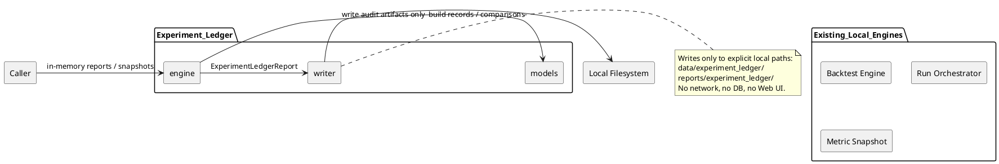
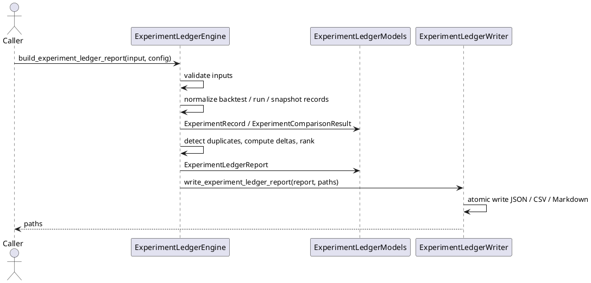

# SPEC-032-Local-Research-Experiment-Ledger

## Background

The project completes MVP-30 at version `0.30.0-dev`. The existing layers
(audit/review governance, relative strength, open interest, discovery,
portfolio construction, local backtesting, the local reporting CLI, and the
local research run orchestrator) each produce deterministic, local,
human-audit research artifacts. There is currently no deterministic, safe,
local way to record multiple research runs or backtests as comparable
experiment records and produce a single audit-only comparison ledger.

The **Local Research Experiment Ledger** (MVP-31) exists to provide a minimal,
deterministic, local ledger that accepts caller-provided in-memory research
results (backtest reports, run results, and plain metric snapshots), normalizes
them into comparable experiment records, computes safe comparison summaries,
and writes a single research-only experiment ledger artifact. It is **not** a
trading optimizer, not a strategy selector, not a signal generator, and not a
performance attribution tool. It does not place orders, contact exchanges, start
services, schedule jobs, or produce trading recommendations. It consumes
already-built local engine artifacts and returns a human-audit comparison
summary.

MVP-31 remains explicitly **research-only**. It is not a trading signal, not
trade approval, not strategy approval, not execution approval, not portfolio
approval, and not universe approval. It must not connect to Binance, exchanges,
APIs, networks, live data, API keys, or real trading. It must not place orders,
suggest orders, emit action commands, or create execution instructions. It must
not produce or consume Freqtrade strategy classes. It must not modify execution,
strategy, Freqtrade, order, exchange, or portfolio paths. It must not start a
server, daemon, scheduler, Web UI, dashboard, API, database, or runtime registry.
All data processed by the ledger is either already-loaded in-memory values
passed by the caller, or local string paths treated as opaque identifiers only.

Because this MVP introduces an experiment ledger, the SPEC must be especially
strict: the ledger must be a thin, deterministic normalizer over existing safe
engine artifacts. It must not grow into a generic file ingestion pipeline, a
runtime registry, a configuration-driven execution layer, or a background job
system. Every ledger must be fail-closed, every output must be labeled as
research-only, and every path must be handled as an opaque local string unless
the writer module explicitly and narrowly writes to that exact path.

## Requirements

### Must Have (M)

- **M1:** Provide a local experiment ledger package `src/hunter/experiment_ledger/`
  with a public API exported from `src/hunter/experiment_ledger/__init__.py`.
- **M2:** The ledger is local-only and call-triggered; no server, no REST API,
  no Web UI, no dashboard, no daemon, no scheduler, no background loop, no cron,
  no database, no network calls, no exchange calls, no Binance, no Freqtrade
  import/runtime, no API keys, no live data, no real orders, no leverage, no
  shorting, no action commands, no trading signals, no approvals.
- **M3:** Models include frozen dataclasses: `ExperimentLedgerInput`,
  `ExperimentRecord`, `ExperimentMetricSnapshot`, `ExperimentComparisonConfig`,
  `ExperimentComparisonResult`, `ExperimentLedgerReport`,
  `ExperimentLedgerDataQuality`, and `ExperimentLedgerSafetyFlags`.
- **M4:** Include an `ExperimentState` enum with at least the following values:
  - `INCLUDED`
  - `EXCLUDED`
  - `BLOCKED`
  - `INSUFFICIENT_DATA`
- **M5:** Include an `ExperimentReasonCode` enum with at least the following
  values:
  - `OK`
  - `BASELINE_MISSING`
  - `DUPLICATE_ID`
  - `UNSAFE_CONTENT`
  - `INVALID_METRICS`
  - `MISSING_REQUIRED_FIELDS`
- **M6:** The ledger accepts caller-provided in-memory inputs only:
  - `BacktestReport` from `hunter.backtest`
  - `ResearchRunResult` from `hunter.run_orchestrator`
  - `ExperimentMetricSnapshot` as a plain metric record
  - No arbitrary file reading, no path traversal, no file ingestion.
- **M7:** The engine normalizes inputs into `ExperimentRecord` objects
  deterministically, with stable sorting by `generated_at`, then `run_id`, then
  `experiment_id`, then `name`.
- **M8:** The engine computes safe comparison metrics where available:
  - `total_return_pct`
  - `max_drawdown_pct`
  - `volatility_pct`
  - `win_rate_pct`
  - `observation_count`
  - `missing_data_count`
  - `blocked_count`
  - `insufficient_data_count`
- **M9:** The engine computes deltas versus a baseline experiment when a
  `baseline_experiment_id` is provided. If `baseline_experiment_id` is omitted,
  no baseline lookup occurs and no `BASELINE_MISSING` code is emitted. If it is
  provided but no matching record exists, the ledger succeeds in a degraded
  state with a `BASELINE_MISSING` advisory reason code.
- **M10:** The engine ranks experiments for audit-review ordering only. Ranking
  must never be framed as a trading recommendation, signal, or approval.
- **M11:** The ledger is fail-closed: unsafe content, duplicate experiment IDs,
  invalid metric values, or missing required fields produce blocked records or a
  blocked ledger result with clear reason codes.
- **M12:** The writer serializes the ledger report to deterministic JSON, CSV,
  and Markdown, with atomic writes (temp file + fsync + `os.replace`).
- **M13:** Every output artifact and Markdown header includes an explicit
  research-only / not-trading-advice notice.
- **M14:** The ledger supports a fixed `generated_at` timestamp for
  deterministic testing and reproducible audit artifacts.
- **M15:** No arbitrary file ingestion in MVP-31. The ledger only uses
  caller-provided in-memory inputs and the writer module. Paths are opaque
  strings.
- **M16:** Metadata and file-reference strings remain opaque local strings only;
  the ledger never opens, follows, traverses, validates, fetches, or executes
  them.

### Should Have (S)

- **S1:** `ExperimentComparisonConfig` exposes `include_blocked: bool` and
  `include_insufficient: bool` flags (default `True`). When `False`, blocked or
  insufficient records are omitted from the displayed/ranked comparison but are
  still counted in the summary totals.
- **S2:** `ExperimentLedgerInput` exposes a `generated_at: datetime | None`
  field for deterministic output. Defaults to current UTC only if not provided.
- **S3:** `ExperimentLedgerReport` exposes a `reason_codes` tuple that aggregates
  advisory reason codes such as `OK`, `BASELINE_MISSING`, and blocking reason
  codes from individual records.
- **S4:** The writer supports default local output directories:
  `data/experiment_ledger/experiment_ledger.json`,
  `data/experiment_ledger/experiment_records.csv`, and
  `reports/experiment_ledger/experiment_ledger.md`.
- **S5:** The ledger supports optional caller-provided tags and metadata on each
  input. Tags and metadata are opaque strings only.
- **S6:** Model and engine tests are in-memory; writer tests use `tmp_path` only.

### Could Have (C)

- **C1:** A `validate_experiment_ledger_input` function that checks inputs for
  duplicate IDs, unsafe content, and invalid metrics without normalizing or
  comparing them.
- **C2:** A `experiment_ledger_summary` command that mirrors the reporting CLI
  pattern but lives in the experiment ledger package.
- **C3:** CSV output includes one row per experiment record plus a `delta_`
  prefix column for each metric when a baseline is present.

### Will Not Have (W)

- **W1:** No production job runner, task queue, or workflow scheduler.
- **W2:** No background loop, cron, daemon, or persistent worker process.
- **W3:** No order placement, position sizing, leverage, shorting, margin, fee,
  slippage, fill, or execution language.
- **W4:** No Binance, exchange, API, network, live data, or WebSocket.
- **W5:** No Freqtrade strategy class, Freqtrade input, or Freqtrade runtime
  connection.
- **W6:** No server, REST API, Web UI, dashboard, database, auth, or task
  runner.
- **W7:** No arbitrary file ingestion or directory traversal beyond explicitly
  caller-provided local paths in this MVP.
- **W8:** No config schema, YAML schema, JSON schema, or runtime registry.
- **W9:** No execution feedback, strategy optimization, or parameter curve
  fitting.
- **W10:** No action commands, buy/sell/hold recommendations, or trading
  signals.
- **W11:** No real capital, real orders, or real market data.

## Method

### Proposed Package Layout

```
src/hunter/
└── experiment_ledger/
    ├── __init__.py          # Public API exports
    ├── models.py            # Enums, frozen dataclasses, safety flags, reason codes
    ├── engine.py            # Pure normalization/comparison engine
    └── writer.py            # Deterministic JSON/CSV/Markdown writers and atomic writes

tests/test_experiment_ledger/
    ├── __init__.py
    ├── test_models.py       # Model validation, safety flags, reason codes
    ├── test_engine.py       # Normalization, comparison, fail-closed behavior, determinism
    ├── test_writer.py       # Writer serialization and atomic write behavior
    └── test_integration.py  # End-to-end ledger flows and safety assertions
```

### Output Paths

The experiment ledger introduces a single top-level output directory for its
own summary artifacts. Existing engine artifacts are not moved or rewritten;
only the ledger's own summary is written.

Default ledger outputs:

- `data/experiment_ledger/experiment_ledger.json`
- `data/experiment_ledger/experiment_records.csv`
- `reports/experiment_ledger/experiment_ledger.md`

Existing engine artifacts are treated as opaque strings. The ledger does not
follow symlinks, traverse parent directories, or write outside its output
directory. The writer receives explicit local paths and performs its own atomic
writes.

### Models

All models are frozen `@dataclass(frozen=True)` unless otherwise noted.
Immutable/copy-safe mappings are used for `metadata` fields.

```python
EXPERIMENT_LEDGER_VERSION: str = '0.31.0-dev'

class ExperimentState(Enum):
    INCLUDED = 'included'
    EXCLUDED = 'excluded'
    BLOCKED = 'blocked'
    INSUFFICIENT_DATA = 'insufficient_data'

class ExperimentReasonCode(Enum):
    OK = 'OK'
    BASELINE_MISSING = 'BASELINE_MISSING'
    DUPLICATE_ID = 'DUPLICATE_ID'
    UNSAFE_CONTENT = 'UNSAFE_CONTENT'
    INVALID_METRICS = 'INVALID_METRICS'
    MISSING_REQUIRED_FIELDS = 'MISSING_REQUIRED_FIELDS'
    RESEARCH_ONLY = 'RESEARCH_ONLY'
    NOT_TRADING_ADVICE = 'NOT_TRADING_ADVICE'
    NO_FILE_INGESTION = 'NO_FILE_INGESTION'
    NO_NETWORK_CONNECTION = 'NO_NETWORK_CONNECTION'
    NO_EXCHANGE_CONNECTION = 'NO_EXCHANGE_CONNECTION'
    NO_FREQTRADE_INPUT = 'NO_FREQTRADE_INPUT'
    NO_SCHEDULER = 'NO_SCHEDULER'
    NO_DAEMON = 'NO_DAEMON'
    NO_WEB_UI = 'NO_WEB_UI'
    NO_DATABASE = 'NO_DATABASE'
    NO_ACTION_COMMANDS_EMITTED = 'NO_ACTION_COMMANDS_EMITTED'
    HUMAN_RESEARCH_ONLY = 'HUMAN_RESEARCH_ONLY'
```

#### `ExperimentLedgerSafetyFlags`

```python
@dataclass(frozen=True)
class ExperimentLedgerSafetyFlags:
    no_trading_signal: bool = True
    no_trade_approval: bool = True
    no_strategy_approval: bool = True
    no_execution_approval: bool = True
    no_portfolio_approval: bool = True
    no_universe_approval: bool = True
    no_order_sizing: bool = True
    no_position_sizing: bool = True
    no_leverage: bool = True
    no_shorting: bool = True
    no_action_commands: bool = True
    no_network_connection: bool = True
    no_file_read_in_engine: bool = True
    no_database: bool = True
    no_exchange_connection: bool = True
    no_freqtrade_input: bool = True
    no_scheduler: bool = True
    no_web_ui: bool = True
    no_daemon: bool = True
    no_rest_api: bool = True
    research_only: bool = True
    not_trading_advice: bool = True
    has_unsafe_content: bool = False
    has_invalid_record: bool = False
    has_blocked_record: bool = False
    has_insufficient_data: bool = False
    has_missing_baseline: bool = False

    @property
    def is_safe(self) -> bool:
        # All positive invariants True and all negative flags False
        pass
```

#### `ExperimentMetricSnapshot`

```python
@dataclass(frozen=True)
class ExperimentMetricSnapshot:
    experiment_id: str
    run_id: str
    name: str
    metrics: Mapping[str, float | int | None]
    tags: tuple[str, ...] = ()
    metadata: Mapping[str, str] = field(default_factory=dict)
    generated_at: datetime | None = None
```

- `experiment_id`: non-empty identifier for the experiment.
- `run_id`: non-empty source run identifier. If omitted or empty, the engine
  normalizes it to `experiment_id` during record construction, but the snapshot
  is expected to provide a meaningful value.
- `name`: human-readable experiment name.
- `metrics`: mapping of metric names to numeric values. The ledger only reads
  the keys it understands; other keys are preserved as opaque metadata.
- `tags`: tuple of opaque string tags.
- `metadata`: immutable mapping of opaque string metadata.
- `generated_at`: optional fixed timestamp; defaults to current UTC if not provided.

#### `ExperimentLedgerInput`

```python
@dataclass(frozen=True)
class ExperimentLedgerInput:
    backtest_reports: tuple[BacktestReport, ...] = ()
    run_results: tuple[ResearchRunResult, ...] = ()
    metric_snapshots: tuple[ExperimentMetricSnapshot, ...] = ()
    generated_at: datetime | None = None
    metadata: Mapping[str, str] = field(default_factory=dict)
```

- `backtest_reports`: caller-provided in-memory `BacktestReport` objects.
- `run_results`: caller-provided in-memory `ResearchRunResult` objects.
- `metric_snapshots`: caller-provided plain metric snapshots.
- `generated_at`: fixed timestamp for deterministic output.
- `metadata`: opaque string metadata.

The ledger never reads files from these values. It only inspects the public
attributes it knows how to normalize.

#### `ExperimentRecord`

```python
@dataclass(frozen=True)
class ExperimentRecord:
    experiment_id: str
    source_kind: str
    run_id: str
    name: str
    state: ExperimentState
    reason_codes: tuple[str, ...]
    metrics: Mapping[str, float | int | None]
    generated_at: datetime
    tags: tuple[str, ...]
    metadata: Mapping[str, str]
    notes: tuple[str, ...]
```

- `experiment_id`: normalized identifier.
- `source_kind`: one of `'backtest'`, `'run'`, `'metric_snapshot'`.
- `run_id`: source run identifier if available.
- `name`: experiment name.
- `state`: normalized experiment state.
- `reason_codes`: reason codes for the record.
- `metrics`: numeric comparison metrics extracted from the source.
- `generated_at`: fixed or default timestamp.
- `tags`: opaque string tags.
- `metadata`: opaque string metadata.
- `notes`: human-readable notes.

#### `ExperimentComparisonConfig`

```python
@dataclass(frozen=True)
class ExperimentComparisonConfig:
    baseline_experiment_id: str | None = None
    include_blocked: bool = True
    include_insufficient: bool = True
    primary_metric: str = 'total_return_pct'
    generated_at: datetime | None = None
    metadata: Mapping[str, str] = field(default_factory=dict)
```

- `baseline_experiment_id`: optional experiment to use as the baseline for
  deltas. If omitted, no baseline lookup occurs and `BASELINE_MISSING` is not
  emitted. If provided but no matching normalized record exists, the ledger
  succeeds in a degraded state with a `BASELINE_MISSING` advisory code.
- `include_blocked`: if `True`, blocked records appear in the comparison/ranking.
- `include_insufficient`: if `True`, insufficient-data records appear in the
  comparison/ranking.
- `primary_metric`: metric used for audit-review ranking. This is an ordering
  key, not a trading signal or recommendation.
- `generated_at`: fixed timestamp for deterministic output.
- `metadata`: opaque string metadata.

#### `ExperimentComparisonResult`

```python
@dataclass(frozen=True)
class ExperimentComparisonResult:
    config: ExperimentComparisonConfig
    records: tuple[ExperimentRecord, ...]
    ranked_records: tuple[ExperimentRecord, ...]
    baseline_record: ExperimentRecord | None
    deltas: Mapping[str, Mapping[str, float | int | None]]
    summary_metrics: Mapping[str, float | int | None]
    reason_codes: tuple[str, ...]
    notes: tuple[str, ...]
```

- `records`: all normalized records in stable input order.
- `ranked_records`: records eligible for display/ranking. Records with the
  configured `primary_metric` present and numeric are ranked first by that
  metric descending, followed by records missing the metric, sorted by state
  priority and deterministic tie-breakers. This ordering is for human audit
  review only.
- `baseline_record`: the baseline record if found; otherwise `None`.
- `deltas`: mapping from experiment_id to metric deltas versus baseline.
- `summary_metrics`: aggregate summary metrics over all records (e.g., count,
  safe mean, min, max where safe to compute).
- `reason_codes`: reason codes for the comparison.
- `notes`: human-readable notes.

#### `ExperimentLedgerDataQuality`

```python
@dataclass(frozen=True)
class ExperimentLedgerDataQuality:
    total_inputs: int
    normalized_records: int
    blocked_records: int
    insufficient_records: int
    excluded_records: int
    included_records: int
    sections_present: tuple[str, ...]
    sections_expected: tuple[str, ...]
    notes: tuple[str, ...]
```

- `total_inputs`: total number of input items (backtest reports + run results +
  metric snapshots).
- `normalized_records`: number of records successfully normalized.
- `blocked_records`: number of records blocked due to unsafe content, duplicate
  IDs, invalid metrics, or missing required fields.
- `insufficient_records`: number of records marked insufficient data.
- `excluded_records`: number of records excluded by flags or safety checks.
- `included_records`: number of records included in comparison.
- `sections_present`: tuple of data-quality sections present.
- `sections_expected`: tuple of data-quality sections expected.
- `notes`: human-readable notes.

#### `ExperimentLedgerReport`

```python
@dataclass(frozen=True)
class ExperimentLedgerReport:
    report_id: str
    version: str
    generated_at: datetime
    input: ExperimentLedgerInput
    comparison: ExperimentComparisonResult
    data_quality: ExperimentLedgerDataQuality
    safety_flags: ExperimentLedgerSafetyFlags
    reason_codes: tuple[str, ...]
    metadata: Mapping[str, str]
    notes: tuple[str, ...]
```

- `report_id`: deterministic ledger identifier.
- `version`: `EXPERIMENT_LEDGER_VERSION`.
- `generated_at`: fixed or default timestamp.
- `input`: the original ledger input (immutable).
- `comparison`: the comparison result.
- `data_quality`: summary data quality.
- `safety_flags`: ledger safety flags.
- `reason_codes`: aggregated reason codes.
- `metadata`: opaque string metadata.
- `notes`: human-readable notes, including the safety notice.


## Algorithms

### Ledger Normalization

```text
1. Validate the ExperimentLedgerInput:
   a. Reject unsafe content in any string field (report_id, run_id, experiment_id,
      name, tags, metadata keys/values, metric keys).
   b. Reject experiment IDs that are empty or not strings.
   c. If validation fails, return a blocked ExperimentLedgerReport with reason codes.

2. For each BacktestReport in input.backtest_reports:
   a. Compute the source identifier: source_id = report.report_id.
   b. Set experiment_id = source_id, run_id = source_id, source_kind = 'backtest'.
   c. Determine name:
      - Look up an explicit display name in input.metadata using the source_id
        as the key. If the value is a non-empty string, use it as name.
      - Otherwise, name = source_id.
   d. If any of experiment_id, run_id, or name is empty after normalization,
      mark the record BLOCKED with reason code MISSING_REQUIRED_FIELDS.
   e. Extract metrics from report.portfolio_result and report.data_quality:
      - total_return_pct
      - max_drawdown_pct
      - volatility_pct
      - win_rate_pct
      - observation_count
      - missing_data_count
      - blocked_count
      - insufficient_data_count
   f. Set state to INCLUDED if all required metrics are present and safe;
      otherwise INSUFFICIENT_DATA if some metrics are missing but no unsafe
      content was detected; otherwise BLOCKED.
   g. Assign reason_codes.

3. For each ResearchRunResult in input.run_results:
   a. Compute the source identifier: source_id = result.run_id.
   b. Set experiment_id = source_id, run_id = source_id, source_kind = 'run'.
   c. Determine name:
      - Look up an explicit display name in input.metadata using the source_id
        as the key. If the value is a non-empty string, use it as name.
      - Otherwise, name = source_id.
   d. If any of experiment_id, run_id, or name is empty after normalization,
      mark the record BLOCKED with reason code MISSING_REQUIRED_FIELDS.
   e. Extract summary metrics from result.data_quality and result.safety_flags:
      - total_steps
      - successful_steps
      - failed_steps
      - blocked_steps
      - skipped_steps
   f. The record is for audit review only; it does not replace engine-specific
      metrics.
   g. Set state and reason_codes accordingly.

4. For each ExperimentMetricSnapshot in input.metric_snapshots:
   a. Set source_kind = 'metric_snapshot'.
   b. Set experiment_id = snapshot.experiment_id.
   c. Set run_id = snapshot.run_id if non-empty; otherwise experiment_id.
   d. Determine name:
      - Look up an explicit display name in input.metadata using the
        snapshot.experiment_id as the key. If the value is a non-empty string,
        use it as name.
      - Otherwise, name = snapshot.name.
   e. If any of experiment_id, run_id, or name is empty after normalization,
      mark the record BLOCKED with reason code MISSING_REQUIRED_FIELDS.
   f. Copy known metric keys into the record's metrics mapping.
   g. Set state to INCLUDED if the snapshot is valid; otherwise BLOCKED or
      INSUFFICIENT_DATA.

5. Detect duplicate experiment_id values across all records:
   a. If duplicates are found, mark all but the first occurrence as BLOCKED with
      reason code DUPLICATE_ID.
   b. The first occurrence retains its original state.

6. Sort normalized records deterministically by:
   a. generated_at ascending
   b. run_id ascending
   c. experiment_id ascending
   d. name ascending

7. Build the comparison:
   a. If baseline_experiment_id is provided, locate the matching record by
      normalized experiment_id. If omitted, skip baseline lookup entirely.
   b. If baseline_experiment_id is provided but no matching record is found,
      set baseline_record to None and append BASELINE_MISSING to reason_codes.
      If baseline_experiment_id is omitted, set baseline_record to None and do
      not append BASELINE_MISSING.
   c. Compute deltas for each record versus the baseline (record - baseline)
      for known metrics where both values are numeric. Include the baseline
      record itself in the deltas mapping with zero deltas for all comparable
      metrics, unless the baseline is omitted.
   d. Compute summary_metrics over all records (count, safe mean, min, max).
   e. Build ranked_records from records where state is INCLUDED, or where state
      is BLOCKED/INSUFFICIENT_DATA and the corresponding include flag is True.
   f. Sort ranked_records for audit-review ordering only:
      - Records that have the configured primary_metric present and numeric are
        ranked first, sorted by primary_metric descending, then by generated_at
        ascending, run_id ascending, experiment_id ascending, name ascending.
      - Records missing the configured primary_metric are placed after all
        metric-present records, sorted by state priority (INCLUDED first, then
        INSUFFICIENT_DATA, then EXCLUDED, then BLOCKED), then by generated_at
        ascending, run_id ascending, experiment_id ascending, name ascending.
      - Missing-metric records are not treated as zero-return and are not
        promoted. This ordering is for human audit review only and is not a
        recommendation, signal, or trading decision.

8. Build ExperimentLedgerDataQuality:
   - total_inputs = len(backtest_reports) + len(run_results) + len(metric_snapshots)
   - normalized_records = number of records that were normalized
   - blocked_records = number of BLOCKED records
   - insufficient_records = number of INSUFFICIENT_DATA records
   - excluded_records = number of records excluded from ranking by flags
   - included_records = number of records included in ranking

9. Build ExperimentLedgerSafetyFlags:
   - All baseline safety invariants are True.
   - Set has_blocked_record if any record was blocked.
   - Set has_insufficient_data if any record was insufficient.
   - Set has_invalid_record if any record was invalid.
   - Set has_missing_baseline if baseline was requested but not found.

10. Build the ledger report artifact paths.

11. Return ExperimentLedgerReport.
```

### Fail-Closed Behavior

The ledger is deterministic and fail-closed:

- Reject inputs with empty experiment IDs, run IDs, or names.
- Reject unsafe content in any string field (forbidden terms implying trading,
  execution, exchange, network, or order semantics).
- Reject duplicate experiment IDs by marking duplicates as blocked.
- Reject invalid metric values (non-numeric where numeric expected, NaN,
  infinities) by marking the record as blocked.
- If a baseline is requested (provided but not found), continue in a degraded
  state with the `BASELINE_MISSING` advisory code. If `baseline_experiment_id`
  is omitted, no baseline lookup occurs and `BASELINE_MISSING` is not emitted.
- A missing primary_metric on a record is not a blocking condition; the record
  remains visible and is placed after all records that have the metric in the
  audit-review ranking, using deterministic tie-breakers only.
- No filesystem access is performed except through the writer module with
  explicitly constructed safe local paths.
- No mutation of caller inputs.

### Determinism

- Record order is preserved from input and then deterministically sorted.
- Output paths are constructed deterministically from default paths.
- Sorting of artifacts and reason codes is stable.
- Caller-provided `generated_at` removes wall-clock dependency in tests.
- Ranking is deterministic: metric-present records precede metric-missing
  records, and all tie-breakers are stable fields (state, generated_at, run_id,
  experiment_id, name).
- No `random` module usage, no `uuid` (unless deterministic), no
  environment-dependent state.

## Safety Boundaries

MVP-31 is a thin, deterministic, local normalizer over already-safe engine
artifacts. It must never become a trading tool, strategy optimizer, or
execution-feedback loop.

- **Audit-only:** Every output is a human-audit artifact. It is not a trading
  signal, not trade approval, not strategy approval, not execution approval, not
  portfolio approval, not universe approval, and not Freqtrade input.
- **No file ingestion:** The ledger only accepts caller-provided in-memory
  objects. It does not read arbitrary files, follow symlinks, traverse
  directories, or validate file contents.
- **No network:** The ledger makes no network calls, API calls, or WebSocket
  connections. It does not fetch live data, prices, or order books.
- **No exchange:** The ledger does not connect to Binance, any other exchange,
  or any broker API. No API keys, no order placement, no fills, no live
  account data.
- **No Freqtrade:** The ledger does not import, produce, or consume Freqtrade
  strategy classes or runtime configuration.
- **No trading semantics:** No buy, sell, hold, position, order, leverage,
  shorting, margin, fee, slippage, fill, or execution language appears in
  outputs except as disclaimed safety notice text.
- **No scheduler/daemon/server:** The ledger is a callable function. It does not
  run a loop, cron job, daemon, server, REST API, database, Web UI, dashboard,
  or task runner.
- **No mutation:** Caller inputs are immutable frozen dataclasses and tuples.
  The ledger never modifies them.
- **Opaque paths:** Any file-reference or metadata string is treated as an
  opaque local string. The ledger never opens, follows, traverses, validates,
  fetches, or executes it.
- **Fail-closed:** Unsafe content, duplicate IDs, invalid metrics, or missing
  required fields produce blocked records or a blocked report with clear reason
  codes.
- **Research ranking only:** The ranked ordering is for human audit review. It
  is not a recommendation, not a signal, and not a basis for live trading
  decisions.

## PlantUML Diagrams

### Component Diagram



### Sequence Diagram



## Writer Artifacts

The writer serializes an `ExperimentLedgerReport` to deterministic local
artifacts.

### Functions

- `experiment_ledger_report_to_dict(report) -> dict[str, Any]`
- `experiment_ledger_report_to_json_text(report) -> str`
- `experiment_ledger_report_to_csv_text(report) -> str`
- `experiment_ledger_report_to_markdown_text(report) -> str`
- `atomic_write_json_experiment_ledger_report(report, path=None) -> Path`
- `atomic_write_csv_experiment_ledger_report(report, path=None) -> Path`
- `atomic_write_markdown_experiment_ledger_report(report, path=None) -> Path`
- `write_experiment_ledger_report(report, json_path=DEFAULT, csv_path=DEFAULT,
  md_path=DEFAULT) -> tuple[Path | None, Path | None, Path | None]`

### Default Paths

- `data/experiment_ledger/experiment_ledger.json`
- `data/experiment_ledger/experiment_records.csv`
- `reports/experiment_ledger/experiment_ledger.md`

### JSON Output

JSON output uses `json.dumps(..., indent=2, ensure_ascii=False, sort_keys=True)`
plus a trailing newline. Enums serialize to string values. Datetimes serialize
to ISO-8601 UTC. Mappings and tuples serialize deterministically.

### CSV Output

CSV output includes one row per experiment record with the following columns:

- experiment_id
- source_kind
- run_id
- name
- state
- generated_at
- total_return_pct
- max_drawdown_pct
- volatility_pct
- win_rate_pct
- observation_count
- missing_data_count
- blocked_count
- insufficient_data_count
- reason_codes
- tags

When a baseline is present, additional `delta_<metric>` columns are included for
known metrics. Missing numeric values are emitted as empty strings.

### Markdown Output

Markdown output includes:

- `# Experiment Ledger Report` H1 title
- Immediate safety notice blockquote
- Report identity (report_id, version, generated_at)
- Comparison summary (baseline, ranked records, summary metrics)
- Records table with metrics and state
- Deltas table (when baseline is present)
- Data quality section
- Safety flags section
- Reason codes section
- Metadata section (if present)
- Notes section

All tables escape pipe characters. No actionable trading or execution
instructions appear.

## Implementation Steps

### Step 1 — Models and Engine

Create `src/hunter/experiment_ledger/__init__.py`, `models.py`, and `engine.py`.

- Define enums, reason codes, safety flags, and frozen dataclasses.
- Implement `build_experiment_ledger_report(input, config)` in `engine.py`.
- Implement input validation, normalization, duplicate detection, baseline
  deltas, ranking, and data quality.
- Add tests in `tests/test_experiment_ledger/test_models.py` and
  `tests/test_experiment_ledger/test_engine.py`.

### Step 2 — Writer

Create `src/hunter/experiment_ledger/writer.py`.

- Implement dict, JSON, CSV, and Markdown serializers.
- Implement atomic write helpers and `write_experiment_ledger_report`.
- Add tests in `tests/test_experiment_ledger/test_writer.py`.

### Step 3 — Integration Tests

Create `tests/test_experiment_ledger/test_integration.py`.

- End-to-end flows with backtest reports, run results, and metric snapshots.
- Baseline and degraded-state tests.
- Safety boundary tests (no file reads, no network, no trading semantics).
- Determinism and no-mutation tests.
- Writer end-to-end tests under `tmp_path`.

### Step 4 — Finalization

- Bump project version to `0.31.0-dev` in `pyproject.toml` and
  `src/hunter/__init__.py`.
- Update `CHANGELOG.md`, `docs/handoff/CURRENT_STATE.md`, `tasks/active.md`, and
  `tasks/agent-log.md`.
- Run the full test suite and record the result.

## Milestones

- **M31.1:** Models and engine implemented with passing unit tests.
- **M31.2:** Writer implemented with deterministic JSON, CSV, and Markdown
  output plus passing unit tests.
- **M31.3:** Integration tests pass, including safety boundary and fail-closed
  cases.
- **M31.4:** Finalization complete (version bump, documentation, full suite
  green).

## Gathering Results

MVP-31 is complete when the following acceptance criteria are met:

- `src/hunter/experiment_ledger/__init__.py` exports a clean public API.
- `models.py` implements the required enums and frozen dataclasses.
- `engine.py` implements `build_experiment_ledger_report` with deterministic
  normalization, comparison, baseline deltas, ranking, and data quality.
- `writer.py` implements atomic JSON, CSV, and Markdown writes with default
  local paths.
- All tests in `tests/test_experiment_ledger/` pass.
- The full test suite remains green (the target number will be recorded at
  finalization; no regressions from the MVP-30 baseline of 5491 passed, 1
  skipped).
- No server, REST API, Web UI, dashboard, database, scheduler, daemon,
  background job, Binance, exchange, API, Freqtrade, or live trading semantics
  are introduced.
- Every output artifact contains the research-only / not-trading-advice safety
  notice.
- No arbitrary file ingestion, path traversal, or execution of file references
  occurs.
- The ledger is fail-closed on unsafe content, duplicate IDs, invalid metrics,
  and missing required fields.