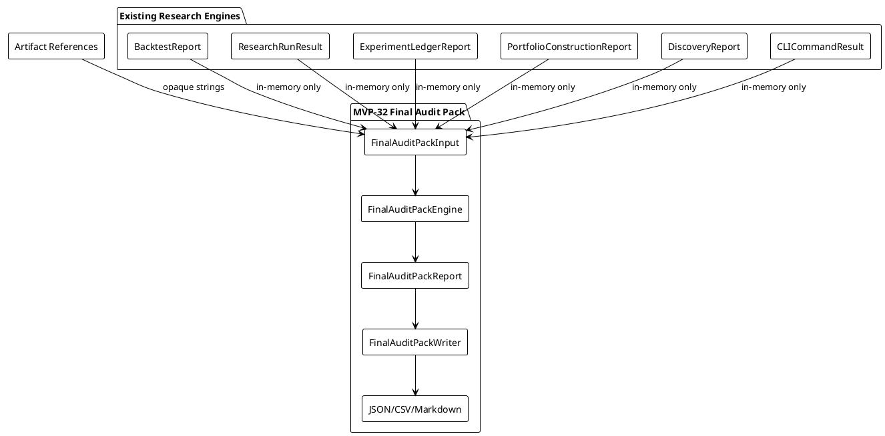
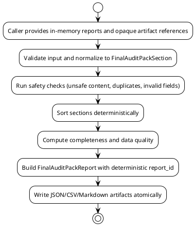

# SPEC-033-Local-Research-Final-Audit-Pack-Export

## Background

The project completes MVP-31 at version `0.31.0-dev`. The existing layers
(audit/review governance, relative strength, open interest, discovery,
portfolio construction, local backtesting, the local reporting CLI, the local
research run orchestrator, and the local research experiment ledger) each
produce deterministic, local, human-audit research artifacts. There is currently
no deterministic, safe, local way to aggregate a curated set of these artifacts
into a single final audit pack export for human review or handoff.

The **Local Research Final Audit Pack Export** (MVP-32) exists to provide a
minimal, deterministic, local export layer that accepts caller-provided
in-memory report objects and opaque artifact references, normalizes them into a
manifest of audit sections, computes a completeness/readiness summary, and
writes a single research-only final audit pack artifact. It is **not** a
production release approval system, not a certification of trading readiness,
not a strategy selector, not a signal generator, and not a performance
attribution tool. It does not place orders, contact exchanges, start services,
schedule jobs, or produce trading recommendations. It consumes already-built
local engine artifacts and returns a human-audit export summary.

MVP-32 remains explicitly **research-only and audit-only**. It is not a trading
signal, not trade approval, not strategy approval, not execution approval, not
portfolio approval, not universe approval, and not a release/deployment/launch
approval. It must not connect to Binance, exchanges, APIs, networks, live
data, or real trading. It must not place orders, suggest orders, emit action
commands, or create execution instructions. It must not produce or consume
Freqtrade strategy classes. It must not modify execution, strategy, Freqtrade,
order, exchange, or portfolio paths. It must not start a server, daemon,
scheduler, Web UI, dashboard, API, database, or runtime registry. All data
processed by the final audit pack is either already-loaded in-memory values
passed by the caller, or local string paths treated as opaque identifiers only.

Because this MVP introduces a final audit pack export, the SPEC must be
especially strict: the export layer must be a thin, deterministic aggregator
over existing safe engine artifacts. It must not grow into a generic file
ingestion pipeline, a runtime registry, a configuration-driven execution
layer, or a background job system. Every export must be fail-closed, every
output must be labeled as research-only, and every path must be handled as an
opaque local string unless the writer module explicitly and narrowly writes to
that exact path.

## Requirements

### Must Have (M)

- **M1:** Provide a local final audit pack package
  `src/hunter/final_audit_pack/` with a public API exported from
  `src/hunter/final_audit_pack/__init__.py`.
- **M2:** The final audit pack is local-only and call-triggered; no server, no
  REST API, no Web UI, no dashboard, no daemon, no scheduler, no background
  loop, no cron, no database, no network calls, no exchange calls, no Binance,
  no Freqtrade import/runtime, no API keys, no live data, no real orders, no
  leverage, no shorting, no action commands, no trading signals, no approvals.
- **M3:** Models include frozen dataclasses: `FinalAuditPackInput`,
  `FinalAuditPackSection`, `FinalAuditPackArtifact`, `FinalAuditPackConfig`,
  `FinalAuditPackCompleteness`, `FinalAuditPackDataQuality`,
  `FinalAuditPackSafetyFlags`, and `FinalAuditPackReport`.
- **M4:** Include a `FinalAuditPackState` enum with at least the following
  values:
  - `INCLUDED`
  - `EXCLUDED`
  - `BLOCKED`
  - `INSUFFICIENT_DATA`
- **M5:** Include `FinalAuditPackReasonCode` string constants consistent with
  the project pattern, including at least:
  - `OK`
  - `MISSING_REQUIRED_SECTIONS`
  - `DUPLICATE_SECTION_ID`
  - `UNSAFE_CONTENT`
  - `INVALID_SECTION`
  - `MISSING_REQUIRED_FIELDS`
  - safety advisory codes: `RESEARCH_ONLY`, `NOT_TRADING_ADVICE`,
    `HUMAN_RESEARCH_ONLY`, `NO_FILE_INGESTION`, `NO_NETWORK_CONNECTION`,
    `NO_EXCHANGE_CONNECTION`, `NO_FREQTRADE_INPUT`, `NO_SCHEDULER`,
    `NO_DAEMON`, `NO_WEB_UI`, `NO_DATABASE`, `NO_ACTION_COMMANDS_EMITTED`.
- **M6:** The final audit pack accepts caller-provided in-memory inputs only:
  - `BacktestReport` from `hunter.backtest`
  - `ResearchRunResult` from `hunter.run_orchestrator`
  - `ExperimentLedgerReport` from `hunter.experiment_ledger`
  - `PortfolioConstructionReport` from `hunter.portfolio_construction`
  - `DiscoveryReport` from `hunter.discovery`
  - `CLICommandResult` from `hunter.reporting_cli`
  - opaque artifact reference strings
  - No arbitrary file reading, no path traversal, no file ingestion.
- **M7:** The engine normalizes inputs into `FinalAuditPackSection` objects
  deterministically, with stable sorting by section kind, `generated_at`, then
  `report_id`, then `run_id`, then `name`.
- **M8:** The engine computes a completeness summary with at least:
  - `required_sections_present`
  - `required_sections_missing`
  - `optional_sections_present`
  - `artifact_reference_count`
  - `blocked_section_count`
  - `insufficient_section_count`
  - `safety_notice_present`
- **M9:** The engine is fail-closed on unsafe content, duplicate section IDs,
  invalid required fields, and missing required sections based on config.
- **M10:** Missing required sections produce deterministic reason codes and may
  be blocking or degraded based on `FinalAuditPackConfig.block_on_missing_required`.
- **M11:** The writer serializes the final audit pack report to deterministic
  JSON, CSV, and Markdown, with atomic writes (temp file + fsync + `os.replace`).
- **M12:** Every output artifact and Markdown header includes an explicit
  research-only / not-trading-advice notice.
- **M13:** The final audit pack supports a fixed `generated_at` timestamp for
  deterministic testing and reproducible audit artifacts.
- **M14:** No arbitrary file ingestion in MVP-32. The export layer only uses
  caller-provided in-memory inputs and the writer module. Paths are opaque
  strings.
- **M15:** Metadata, artifact references, and file-reference strings remain
  opaque local strings only; the engine never opens, follows, traverses,
  validates, fetches, or executes them.

### Should Have (S)

- **S1:** `FinalAuditPackConfig` exposes `required_section_kinds: tuple[str, ...]`
  and `optional_section_kinds: tuple[str, ...]` configured in memory only. The
  config has no YAML/JSON schema, no runtime registry, and no external source.
- **S2:** `FinalAuditPackInput` exposes a `generated_at: datetime | None`
  field for deterministic output. Defaults to current UTC only if not provided.
- **S3:** `FinalAuditPackReport` exposes a `reason_codes` tuple that aggregates
  advisory and blocking reason codes from sections and the overall export.
- **S4:** The writer supports default local output directories:
  `data/final_audit_pack/final_audit_pack.json`,
  `data/final_audit_pack/final_audit_pack_sections.csv`, and
  `reports/final_audit_pack/final_audit_pack.md`.
- **S5:** The export layer supports optional caller-provided tags and metadata
  on each input. Tags and metadata are opaque strings only.
- **S6:** Model and engine tests are in-memory; writer tests use `tmp_path` only.

### Could Have (C)

- **C1:** A `validate_final_audit_pack_input` function that checks inputs for
  duplicate section IDs, unsafe content, and invalid sections without
  normalizing or computing completeness.
- **C2:** A `final_audit_pack_summary` command that mirrors the reporting CLI
  pattern but lives in the final audit pack package.
- **C3:** CSV output includes one row per section plus a completeness summary
  row when configured.

### Will Not Have (W)

- **W1:** No production release approval system or certification of trading
  readiness.
- **W2:** No background loop, cron, daemon, or persistent worker process.
- **W3:** No order placement, position sizing, leverage, shorting, margin, fee,
  slippage, fill, or execution language.
- **W4:** No Binance, exchange, API, network, live data, or WebSocket.
- **W5:** No Freqtrade strategy class, Freqtrade input, or Freqtrade runtime
  connection.
- **W6:** No server, REST API, Web UI, dashboard, database, auth, or task runner.
- **W7:** No arbitrary file ingestion or directory traversal beyond explicitly
  caller-provided local paths in this MVP.
- **W8:** No config YAML schema, JSON schema, or runtime registry.
- **W9:** No execution feedback, strategy optimization, or parameter curve
  fitting.
- **W10:** No action commands, buy/sell/hold recommendations, or trading
  signals.
- **W11:** No real capital, real orders, or real market data.
- **W12:** No file-reference validation, content reading, or execution of
  artifact paths.

## Method

### Proposed Package Layout

```
src/hunter/
└── final_audit_pack/
    ├── __init__.py          # Public API exports
    ├── models.py            # Enums, frozen dataclasses, safety flags, reason codes
    ├── engine.py            # Pure normalization/completeness engine
    └── writer.py            # Deterministic JSON/CSV/Markdown writers and atomic writes

tests/test_final_audit_pack/
    ├── __init__.py
    ├── test_models.py       # Model validation, safety flags, reason codes
    ├── test_engine.py       # Normalization, completeness, fail-closed behavior, determinism
    ├── test_writer.py       # Writer serialization and atomic write behavior
    └── test_integration.py  # End-to-end export flows and safety assertions
```

### Output Paths

The final audit pack introduces a single top-level output directory for its own
summary artifacts. Existing engine artifacts are not moved or rewritten; only
the final audit pack's own summary is written.

Default final audit pack outputs:

- `data/final_audit_pack/final_audit_pack.json`
- `data/final_audit_pack/final_audit_pack_sections.csv`
- `reports/final_audit_pack/final_audit_pack.md`

Existing engine artifacts are treated as opaque strings. The export layer does
not follow symlinks, traverse parent directories, or write outside its output
directory. The writer receives explicit local paths and performs its own atomic
writes.

### Models

All models are frozen `@dataclass(frozen=True)` unless otherwise noted.
Immutable/copy-safe mappings are used for `metadata` fields.

```python
FINAL_AUDIT_PACK_VERSION: str = '0.32.0-dev'

FORBIDDEN_FINAL_AUDIT_PACK_TERMS: tuple[str, ...] = (
    'buy', 'sell', 'order', 'leverage', 'short', 'long',
    'exchange', 'binance', 'api key', 'freqtrade', 'scheduler',
    'daemon', 'database', 'web ui', 'approval', 'certification',
)


def has_unsafe_final_audit_pack_content(text: str) -> bool:
    """Local safety scanner for final audit pack text fields.

    Returns True if `text` contains any forbidden term. Metadata and artifact
    references remain opaque strings and are not scanned by this function.
    The final audit pack does not import a safety scanner from any other
    package.
    """
    lower = text.lower()
    return any(term in lower for term in FORBIDDEN_FINAL_AUDIT_PACK_TERMS)

class FinalAuditPackState(Enum):
    INCLUDED = 'included'
    EXCLUDED = 'excluded'
    BLOCKED = 'blocked'
    INSUFFICIENT_DATA = 'insufficient_data'

class FinalAuditPackReasonCode(Enum):
    OK = 'OK'
    MISSING_REQUIRED_SECTIONS = 'MISSING_REQUIRED_SECTIONS'
    DUPLICATE_SECTION_ID = 'DUPLICATE_SECTION_ID'
    UNSAFE_CONTENT = 'UNSAFE_CONTENT'
    INVALID_SECTION = 'INVALID_SECTION'
    MISSING_REQUIRED_FIELDS = 'MISSING_REQUIRED_FIELDS'
    RESEARCH_ONLY = 'RESEARCH_ONLY'
    NOT_TRADING_ADVICE = 'NOT_TRADING_ADVICE'
    NO_FILE_INGESTION = 'NO_FILE_INGESTION'
    NO_NETWORK_CONNECTION = 'NO_NETWORK_CONNECTION'
    NO_EXCHANGE_CONNECTION = 'NO_EXCHANGE_CONNECTION'
    NO_FREQTRADE_INPUT = 'NO_FREQTRADE_INPUT'
    NO_SCHEDULER = 'NO_SCHEDULER'
    NO_DAEMON = 'NO_DAEMON'
    NO_WEB_UI = 'NO_WEB_UI'
    NO_DATABASE = 'NO_DATABASE'
    NO_ACTION_COMMANDS_EMITTED = 'NO_ACTION_COMMANDS_EMITTED'
    HUMAN_RESEARCH_ONLY = 'HUMAN_RESEARCH_ONLY'
```

```python
@dataclass(frozen=True)
class FinalAuditPackInput:
    """Caller-provided in-memory reports and opaque artifact references.

    All report fields are tuples of already-loaded in-memory report objects.
    No file reading, path traversal, or remote ingestion is performed by the
    engine. Artifact references are opaque local strings.
    """
    backtest_reports: tuple[Any, ...] = ()
    run_results: tuple[Any, ...] = ()
    experiment_ledger_reports: tuple[Any, ...] = ()
    portfolio_construction_reports: tuple[Any, ...] = ()
    discovery_reports: tuple[Any, ...] = ()
    cli_command_results: tuple[Any, ...] = ()
    artifact_references: tuple[str, ...] = ()
    generated_at: datetime | None = None
    metadata: Mapping[str, Any] = field(default_factory=MappingProxyType)
    tags: tuple[str, ...] = ()

    def __post_init__(self) -> None:
        object.__setattr__(self, 'backtest_reports', tuple(self.backtest_reports))
        object.__setattr__(self, 'run_results', tuple(self.run_results))
        object.__setattr__(self, 'experiment_ledger_reports', tuple(self.experiment_ledger_reports))
        object.__setattr__(self, 'portfolio_construction_reports', tuple(self.portfolio_construction_reports))
        object.__setattr__(self, 'discovery_reports', tuple(self.discovery_reports))
        object.__setattr__(self, 'cli_command_results', tuple(self.cli_command_results))
        object.__setattr__(self, 'artifact_references', tuple(self.artifact_references))
        object.__setattr__(self, 'tags', tuple(self.tags))
        if not isinstance(self.metadata, Mapping):
            object.__setattr__(self, 'metadata', MappingProxyType(dict(self.metadata)))
        if self.generated_at is not None and self.generated_at.tzinfo is None:
            raise ValueError('generated_at must be timezone-aware')


@dataclass(frozen=True)
class FinalAuditPackArtifact:
    """Opaque local artifact reference. The engine does not open or validate it."""
    kind: str
    reference: str
    display_name: str = ''
    metadata: Mapping[str, Any] = field(default_factory=MappingProxyType)
    tags: tuple[str, ...] = ()


@dataclass(frozen=True)
class FinalAuditPackSection:
    """Normalized section from a caller-provided report or report summary.

    `section_id` is the report id, run id, or caller-supplied id. It must be
    unique across all sections. `section_kind` is one of the configured section
    kinds (e.g., 'backtest', 'run_orchestrator', 'experiment_ledger').
    """
    section_id: str
    section_kind: str
    report_id: str = ''
    run_id: str = ''
    name: str = ''
    state: FinalAuditPackState = FinalAuditPackState.INCLUDED
    reason_codes: tuple[str, ...] = ()
    generated_at: datetime | None = None
    tags: tuple[str, ...] = ()
    metadata: Mapping[str, Any] = field(default_factory=MappingProxyType)

    def __post_init__(self) -> None:
        object.__setattr__(self, 'reason_codes', tuple(self.reason_codes))
        object.__setattr__(self, 'tags', tuple(self.tags))


@dataclass(frozen=True)
class FinalAuditPackConfig:
    """In-memory configuration only. No YAML, JSON schema, or runtime registry."""
    required_section_kinds: tuple[str, ...] = ('backtest', 'run_orchestrator', 'experiment_ledger')
    optional_section_kinds: tuple[str, ...] = ('discovery', 'portfolio_construction', 'reporting_cli')
    block_on_missing_required: bool = False
    include_blocked: bool = False
    include_insufficient: bool = False
    generated_at: datetime | None = None
    metadata: Mapping[str, Any] = field(default_factory=MappingProxyType)

    def __post_init__(self) -> None:
        object.__setattr__(self, 'required_section_kinds', tuple(self.required_section_kinds))
        object.__setattr__(self, 'optional_section_kinds', tuple(self.optional_section_kinds))
        if self.generated_at is not None and self.generated_at.tzinfo is None:
            raise ValueError('generated_at must be timezone-aware')


@dataclass(frozen=True)
class FinalAuditPackCompleteness:
    """Completeness/readiness summary for the final audit pack."""
    required_sections_present: int = 0
    required_sections_missing: int = 0
    optional_sections_present: int = 0
    artifact_reference_count: int = 0
    blocked_section_count: int = 0
    insufficient_section_count: int = 0
    safety_notice_present: bool = True
    total_sections: int = 0
    sections_expected: int = 0
    sections_present: int = 0
    notes: tuple[str, ...] = ()

    def __post_init__(self) -> None:
        object.__setattr__(self, 'notes', tuple(self.notes))


@dataclass(frozen=True)
class FinalAuditPackDataQuality:
    """Data-quality summary of the final audit pack."""
    total_inputs: int = 0
    normalized_sections: int = 0
    blocked_sections: int = 0
    insufficient_sections: int = 0
    excluded_sections: int = 0
    included_sections: int = 0
    sections_present: int = 0
    sections_expected: int = 0
    artifact_references: int = 0
    notes: tuple[str, ...] = ()

    def __post_init__(self) -> None:
        object.__setattr__(self, 'notes', tuple(self.notes))


@dataclass(frozen=True)
class FinalAuditPackSafetyFlags:
    """Positive safety invariants and negative safety flags."""
    research_only: bool = True
    not_trading_advice: bool = True
    human_research_only: bool = True
    no_file_ingestion: bool = True
    no_network_connection: bool = True
    no_exchange_connection: bool = True
    no_freqtrade_input: bool = True
    no_scheduler: bool = True
    no_daemon: bool = True
    no_web_ui: bool = True
    no_database: bool = True
    no_action_commands_emitted: bool = True
    has_unsafe_content: bool = False
    has_duplicate_section_id: bool = False
    has_invalid_section: bool = False
    has_missing_required_sections: bool = False
    has_blocked_section: bool = False
    has_insufficient_section: bool = False


@dataclass(frozen=True)
class FinalAuditPackReport:
    """Final local audit pack export report."""
    report_id: str
    version: str = FINAL_AUDIT_PACK_VERSION
    generated_at: datetime
    sections: tuple[FinalAuditPackSection, ...] = ()
    artifacts: tuple[FinalAuditPackArtifact, ...] = ()
    completeness: FinalAuditPackCompleteness = field(default_factory=FinalAuditPackCompleteness)
    data_quality: FinalAuditPackDataQuality = field(default_factory=FinalAuditPackDataQuality)
    safety_flags: FinalAuditPackSafetyFlags = field(default_factory=FinalAuditPackSafetyFlags)
    reason_codes: tuple[str, ...] = ()
    metadata: Mapping[str, Any] = field(default_factory=MappingProxyType)
    notes: tuple[str, ...] = ()

    def __post_init__(self) -> None:
        object.__setattr__(self, 'sections', tuple(self.sections))
        object.__setattr__(self, 'artifacts', tuple(self.artifacts))
        object.__setattr__(self, 'reason_codes', tuple(self.reason_codes))
        object.__setattr__(self, 'notes', tuple(self.notes))
```

### Algorithms

#### Input Validation

1. Confirm `FinalAuditPackInput` is supplied. If not, raise `ValueError`.
2. Normalize each caller-provided report to a `FinalAuditPackSection` using
   a small, deterministic dispatcher that maps the concrete type to a section
   kind:
   - `BacktestReport` → `'backtest'`
   - `ResearchRunResult` → `'run_orchestrator'`
   - `ExperimentLedgerReport` → `'experiment_ledger'`
   - `PortfolioConstructionReport` → `'portfolio_construction'`
   - `DiscoveryReport` → `'discovery'`
   - `CLICommandResult` → `'reporting_cli'`
3. For each report, extract the stable identifier:
   - `report_id` when the object has a `report_id` attribute.
   - `run_id` when the object has a `run_id` attribute and no `report_id`.
   - Fallback to a deterministic `"{section_kind}:{zero_based_index}"` id if
     neither is available (this is a degraded input, not an error). For
     `CLICommandResult` specifically the fallback is
     `"reporting_cli:{zero_based_index}"`. The index is the position within that
     input category after tuple normalization, not a global mixed-input index.
4. Extract `generated_at` and `name` from each report when available.
   Fall back to `''` for name and `None` for `generated_at` if not present.
   If no explicit name exists, the display name is `section_id`. For
   `CLICommandResult`, if the object's public API exposes a `command` attribute,
   use that as the display name; otherwise fall back to `section_id`.
5. Build a `FinalAuditPackArtifact` for each string in `artifact_references`,
   with `kind='artifact'` and `reference` set to the opaque string. No
   validation, traversal, or file opening is performed.

#### Section Safety Checks

1. The final audit pack defines its own local safety scanner:
   `FORBIDDEN_FINAL_AUDIT_PACK_TERMS` and
   `has_unsafe_final_audit_pack_content(...)`. The final audit pack does not
   import a safety scanner from `experiment_ledger` or any other package. Run
   the local scanner against the section id, display name, and any
   caller-provided tags. Metadata and artifact references remain opaque
   strings and are not scanned. If unsafe content is found, mark the section
   `BLOCKED` with `UNSAFE_CONTENT`.
2. Validate required fields: `section_id` and `section_kind` must be non-empty
   strings. If missing, mark the section `BLOCKED` with `MISSING_REQUIRED_FIELDS`.
3. Detect duplicate `section_id` values across all sections. All duplicate
   occurrences after the first are marked `BLOCKED` with `DUPLICATE_SECTION_ID`.
   The first occurrence remains in its original state unless it has its own
   blocking reason.
4. Invalid sections (objects not matching the known report types and not
   marked as artifacts) are marked `BLOCKED` with `INVALID_SECTION`.

#### Sorting

1. After normalization and safety checks, sort sections deterministically by:
   - `section_kind` ascending
   - `generated_at` ascending (nulls last)
   - `report_id` ascending
   - `run_id` ascending
   - `name` ascending
   - `section_id` ascending (final tie-breaker)
2. Artifacts are sorted by `kind`, then `reference`, then `display_name`.

#### Completeness Computation

1. Count sections per kind:
   - `required_sections_present` = number of required kinds present in at
     least one `INCLUDED` or `INSUFFICIENT_DATA` section.
   - `required_sections_missing` = number of required kinds with no present
     section.
   - `optional_sections_present` = number of optional kinds present in at
     least one `INCLUDED` or `INSUFFICIENT_DATA` section.
   - `blocked_section_count` = number of `BLOCKED` sections.
   - `insufficient_section_count` = number of `INSUFFICIENT_DATA` sections.
   - `artifact_reference_count` = number of `FinalAuditPackArtifact` objects.
   - `safety_notice_present` = always `True` for valid exports.
   - `total_sections` = total number of normalized sections (including blocked
     and insufficient).
   - `sections_expected` = number of required kinds + number of optional kinds
     configured in `FinalAuditPackConfig` (i.e.,
     `len(required_section_kinds) + len(optional_section_kinds)`).
   - `sections_present` = number of sections that are not `BLOCKED`.
2. Missing required sections always add `MISSING_REQUIRED_SECTIONS` to the
   report-level reason codes. `required_sections_present` and
   `required_sections_missing` are computed only from `required_section_kinds`;
   `optional_sections_present` and `optional_sections_missing` are computed only
   from `optional_section_kinds`. Missing optional sections degrade completeness
   only and do not block the report unless a kind is explicitly moved to
   `required_section_kinds` in config. If `block_on_missing_required` is `True`,
   the overall report is considered degraded/blocked and the section list may be
   left empty in the display (but still present in the data model). If `False`,
   the report is included with a degraded completeness note.
3. If blocked sections exist, the report is degraded but still included by
   default. `include_blocked` controls whether `BLOCKED` sections appear in the
   display sort. They are always counted in `data_quality` and
   `completeness` totals.
4. If insufficient sections exist, the report is degraded but included by
   default. `include_insufficient` controls whether `INSUFFICIENT_DATA`
   sections appear in the display sort. They are always counted.

#### Determinism

1. `report_id` is derived deterministically from the sorted set of section
   ids, artifact references, and the export `generated_at`. Use a stable
   string concatenation followed by `hashlib.sha256(...).hexdigest()[:16]`.
2. All tuple fields are sorted before hashing.
3. `generated_at` is taken from `FinalAuditPackInput.generated_at` if present,
   otherwise from `FinalAuditPackConfig.generated_at`, otherwise `datetime.now(timezone.utc)`.
4. No `random` module usage. No `uuid`. No system clock in tests when a fixed
   `generated_at` is supplied.

#### No Mutation

1. The engine must not modify caller-provided report objects. All access is
   read-only.
2. Input tuples are copied into frozen dataclasses. The original inputs remain
   unchanged after `build_final_audit_pack_report` returns.
3. Writer functions do not mutate the input report; they produce new strings.

### Safety Boundaries

- **Research-only:** All outputs are explicitly labeled as research-only and
  not trading advice. The final audit pack is a manifest of local audit
  sections, not a signal generator.
- **No execution:** No order, position, leverage, margin, shorting, fill,
  slippage, or fee language appears in models, engine, or writer outputs.
- **No exchange/bridge:** No Binance, exchange, API, live data, network,
  WebSocket, or external service semantics.
- **No Freqtrade:** No Freqtrade strategy class, import, runtime connection,
  or Freqtrade-compatible output.
- **No runtime infrastructure:** No server, daemon, scheduler, background
  loop, cron, database, Web UI, dashboard, REST API, or auth layer.
- **No file ingestion:** The engine reads only caller-provided in-memory
  objects. Artifact references are opaque strings. The engine never opens,
  follows, traverses, validates, fetches, or executes them. The writer only
  writes to the explicitly supplied path.
- **No approval/certification:** The final audit pack does not certify trading
  readiness, does not approve strategies, and does not approve executions.
  Completeness/readiness summaries are human-audit information only.
- **Fail-closed:** Unsafe content, duplicate section ids, invalid required
  fields, and missing required sections (when configured) cause blocking or
  degraded states with deterministic reason codes.
- **No feedback loops:** The final audit pack is not consumed by execution,
  strategy, Freqtrade, order, exchange, or portfolio paths in this MVP.

### PlantUML Diagrams

#### Component Context



#### Section Normalization Flow



### Writer Artifacts

#### JSON

- `final_audit_pack.json` contains the complete `FinalAuditPackReport` as a
  nested dictionary with ISO-8601 timestamps.
- All tuples are serialized as lists.
- All metadata mappings are serialized as dictionaries.
- Reason codes are serialized as strings.

#### CSV

- `final_audit_pack_sections.csv` contains one row per `FinalAuditPackSection`.
- Columns include: `section_id`, `section_kind`, `report_id`, `run_id`, `name`,
  `state`, `reason_codes`, `generated_at`, `tags`, `metadata`.
- Reason codes, tags, and metadata are serialized as JSON strings within CSV
  cells to remain deterministic and opaque.
- No file paths or external references are resolved or followed.

#### Markdown

- `final_audit_pack.md` begins with an H1 title followed immediately by a
  safety notice:
  - "This report is a human-audit research artifact. It is not trading advice,
    not a trading signal, and not a certification of trading readiness. Do not
    use it for execution, order placement, or strategy approval."
- Sections include: Report Identity, Completeness Summary, Data Quality,
  Sections, Artifacts, Safety Flags, Reason Codes, Metadata, and Notes.
- Each section table is deterministic and sorted by the same rules as the
  engine.
- No actionable order/execution instructions appear in the Markdown output.

### Implementation Steps

1. **Step 1 — Models and Engine**
   - Create `src/hunter/final_audit_pack/models.py` with enums, reason codes,
     safety flags, and frozen dataclasses.
   - Create `src/hunter/final_audit_pack/engine.py` with
     `build_final_audit_pack_report` and supporting helpers.
   - Add `src/hunter/final_audit_pack/__init__.py` with public exports.
   - Implement `tests/test_final_audit_pack/test_models.py`.
   - Implement `tests/test_final_audit_pack/test_engine.py`.

2. **Step 2 — Writer**
   - Create `src/hunter/final_audit_pack/writer.py` with deterministic
     serialization and atomic write functions.
   - Implement `tests/test_final_audit_pack/test_writer.py`.

3. **Step 3 — Integration Tests**
   - Implement `tests/test_final_audit_pack/test_integration.py` with end-to-end
     flows, safety boundary assertions, and determinism tests.

4. **Step 4 — Finalization**
   - Bump version to `0.32.0-dev` in `pyproject.toml` and `src/hunter/__init__.py`.
   - Update `CHANGELOG.md`, `docs/handoff/CURRENT_STATE.md`, `tasks/active.md`,
     and `tasks/agent-log.md`.
   - Run full test suite and confirm all tests pass.

### Milestones

- **M32.1:** Models and engine implemented with unit tests passing.
- **M32.2:** Writer implemented with deterministic JSON/CSV/Markdown output and
  atomic write tests passing.
- **M32.3:** Integration tests passing, including safety boundary and
  determinism checks.
- **M32.4:** Finalization complete, version bumped to `0.32.0-dev`, and full
  suite remains green.

### Gathering Results

Acceptance criteria for MVP-32:

- `src/hunter/final_audit_pack/` exists with clean public API exports in
  `__init__.py`.
- Models implement `FinalAuditPackInput`, `FinalAuditPackSection`,
  `FinalAuditPackArtifact`, `FinalAuditPackConfig`, `FinalAuditPackCompleteness`,
  `FinalAuditPackDataQuality`, `FinalAuditPackSafetyFlags`, and
  `FinalAuditPackReport`.
- `FinalAuditPackState` and `FinalAuditPackReasonCode` enums cover all required
  states and reason codes.
- Engine function `build_final_audit_pack_report` is deterministic, does not
  mutate inputs, performs no file ingestion, and treats all paths as opaque
  strings.
- Completeness summary correctly counts required/optional sections, blocked
  sections, insufficient sections, and artifact references.
- Writer outputs JSON, CSV, and Markdown artifacts with research-only safety
  notices and deterministic ordering.
- Atomic writes use temp file + fsync + `os.replace`.
- All model, engine, writer, and integration tests pass.
- Full test suite remains green (5629+ tests passing, 1 skipped).
- No forbidden semantics introduced: no server, API, Web UI, dashboard,
  database, scheduler, daemon, exchange, Binance, Freqtrade, leverage,
  shorting, real orders, live data, or action commands.
- The final audit pack is not marketed as a trading signal, recommendation,
  certification, or trading readiness system.
