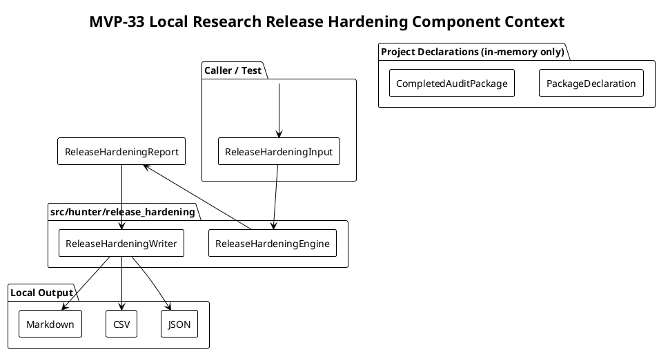

# SPEC-034-Local-Research-Release-Hardening-Consistency-Audit

## Background

The project completes MVP-32 at version `0.32.0-dev`. The completed local
research layers (audit/review governance, relative strength, open interest,
discovery, portfolio construction, local backtesting, the local reporting CLI,
the local research run orchestrator, the local research experiment ledger, and
the local research final audit pack export) each produce deterministic, local,
human-audit research artifacts. Each layer is intended to remain strictly
research-only, free of trading execution semantics, exchange integration, and
production certification language. With this many completed packages, there is a
need for a deterministic, safe, local consistency audit that verifies the
existing packages still follow the expected safety, writer, export, version, and
artifact conventions.

The **Local Research Release Hardening / Consistency Audit** (MVP-33) exists to
provide a minimal, deterministic, local hardening layer that inspects
in-memory/static project declarations and verifies that completed local audit
packages follow the established conventions. It is **not** a production
release gate, not a certification tool, not a trading readiness validator, not a
new research engine, and not a code linter. It does not place orders, contact
exchanges, start services, schedule jobs, or produce trading signals. It
consumes caller-provided package declarations or safe static references to
already-implemented local modules, and returns a human-audit hardening report.

MVP-33 remains explicitly **audit-only and local**. It is not a trading signal,
not trade approval, not strategy approval, not execution approval, not portfolio
approval, and not universe approval. It must not connect to Binance, exchanges,
APIs, networks, live data, API keys, or real trading. It must not place
orders, suggest orders, emit action commands, or create execution instructions.
It must not produce or consume Freqtrade strategy classes. It must not modify
execution, strategy, Freqtrade, order, exchange, or portfolio paths. It must
not start a server, daemon, scheduler, Web UI, dashboard, API, database, or
runtime registry. All data processed by the audit is either already-loaded
in-memory declarations passed by the caller, or local string paths treated as
opaque identifiers only.

Because this MVP introduces a cross-cutting consistency audit, the SPEC must be
especially strict: the audit must be a thin, deterministic, read-only inspector
over existing project declarations. It must not grow into a generic file
ingestion pipeline, a runtime registry, a configuration-driven execution layer,
or a background job system. Every audit must be fail-closed, every output must
be labeled as research-only, and every path must be handled as an opaque local
string.

## Requirements

### Must Have (M)

- **M1:** Provide a local release hardening package
  `src/hunter/release_hardening/` with a public API exported from
  `src/hunter/release_hardening/__init__.py`.
- **M2:** The hardening audit is local-only and call-triggered; no server, no
  REST API, no Web UI, no dashboard, no daemon, no scheduler, no background loop,
  no cron, no database, no network calls, no exchange calls, no Binance, no
  Freqtrade import/runtime, no API keys, no live data, no real orders, no
  leverage, no shorting, no action commands, no trading signals, no approvals.
- **M3:** Models include frozen dataclasses: `ReleaseHardeningInput`,
  `ReleaseHardeningCheck`, `ReleaseHardeningCheckResult`,
  `ReleaseHardeningConfig`, `ReleaseHardeningReport`,
  `ReleaseHardeningDataQuality`, and `ReleaseHardeningSafetyFlags`.
- **M4:** Include a `ReleaseHardeningState` enum with at least the following
  values:
  - `PASS` — the checked item satisfies the convention.
  - `DEGRADED` — the checked item is advisory inconsistent but not a safety
    invariant failure.
  - `BLOCKED` — the checked item violates a safety invariant or required
    convention.
  - `NOT_APPLICABLE` — the checked item does not apply to the provided
    declarations.
- **M5:** Include a `ReleaseHardeningReasonCode` enum or string constant set
  consistent with the project pattern, with at least the following values:
  - `OK`
  - `NOT_APPLICABLE`
  - `CONSISTENCY_DEGRADED`
  - `SAFETY_BLOCKED`
  - `MISSING_REQUIRED_DECLARATION`
  - `DUPLICATE_PACKAGE_ID`
  - `DUPLICATE_CHECK_ID`
  - `UNSAFE_CONTENT`
  - `MISSING_PUBLIC_EXPORT`
  - `MISSING_WRITER_DEFAULT`
  - `MISSING_SAFETY_NOTICE`
  - `VERSION_INCONSISTENT`
  - `ARTIFACT_PATH_NOT_LOCAL`
  - `TEST_ARTIFACT_NOT_ISOLATED`
  - `FORBIDDEN_TERM_PRESENT`
  - `MISSING_MARKDOWN_DISCLAIMER`
  - `DEFAULT_PATH_NOT_LOCAL`
  - `PACKAGE_NOT_PRESENT`
- **M6:** The engine accepts caller-provided in-memory declarations only:
  - `PackageDeclaration` objects describing package name, expected public exports,
    **actual** public exports (caller/test-supplied), expected module files,
    **actual** module files (caller/test-supplied), writer defaults, test default
    paths, safety notices, version, default paths, and artifact policies.
  - `CompletedAuditPackage` objects describing already-produced local audit
    packages (metadata only, paths are opaque strings).
  - No arbitrary file reading, no path traversal, no file ingestion, no module
    import introspection by the release hardening engine.
- **M7:** The engine runs a deterministic set of local checks across the ten
  required categories:
  - `public_exports` — `expected_public_exports` is a subset of
    `actual_public_exports` (both caller-provided); emit `MISSING_PUBLIC_EXPORT`
    when an expected export is absent from the actual set.
  - `writer_defaults` — each declared package has deterministic writer default
    paths and they are local-only.
  - `safety_notices` — each declared package includes explicit research-only
    safety notices in outputs and public API where applicable.
  - `version_consistency` — package-level versions are consistent with the
    project version and with each other. Patch-level mismatch -> `DEGRADED`
    (`VERSION_INCONSISTENT`); major or minor mismatch -> `BLOCKED`
    (`VERSION_INCONSISTENT`).
  - `artifact_path_policy` — default artifact paths remain under local
    `data/` or `reports/` prefixes and never reference external schemes.
  - `test_artifact_isolation` — caller-provided `test_default_paths` are opaque
    local strings; the check flags any path that is not under `tests/` or a
    `tmp_path`-style location or that overlaps with a production default path.
  - `forbidden_term_policy` — declared safety-relevant strings (e.g., safety
    notices, disclaimer text) do not contain forbidden terms that imply trading
    readiness or action commands.
  - `markdown_disclaimer_policy` — Markdown outputs include the required
    research-only disclaimer block.
  - `default_path_locality` — default paths are relative local paths without
    absolute or network components.
  - `package_presence` — `expected_modules` is a subset of `actual_modules_present`
    (both caller-provided); emit `PACKAGE_NOT_PRESENT` when an expected module
    is absent from the actual set.
- **M8:** The engine is fail-closed: unsafe content, missing required
  declarations, duplicate package IDs, duplicate check IDs, or inconsistent
  versions produce `BLOCKED` check results with clear reason codes. If a check
  requires an actual tuple (e.g., `actual_public_exports`, `actual_modules_present`,
  `test_default_paths`) and that tuple is empty, the result is `NOT_APPLICABLE`
  for an advisory check or `BLOCKED` for a blocking check, never a false `PASS`.
- **M9:** The engine reports `DEGRADED` for advisory inconsistencies (e.g., a
  recommended but optional safety notice is missing, or a version is within a
  patch-level mismatch).
- **M10:** The engine produces a `ReleaseHardeningReport` containing a stable
  sorted list of `ReleaseHardeningCheckResult`, a data-quality summary, safety
  flags, and aggregated reason codes.
- **M11:** The writer serializes the hardening report to deterministic JSON,
  CSV, and Markdown, with atomic writes (temp file + fsync + `os.replace`).
- **M12:** Every output artifact and Markdown header includes an explicit
  research-only / not-trading-advice notice.
- **M13:** The audit supports a fixed `generated_at` timestamp for deterministic
  testing and reproducible audit artifacts.
- **M14:** No arbitrary file ingestion in MVP-33. The audit only uses
  caller-provided in-memory declarations and the writer module. If a future
  MVP needs to introspect module files, it must be specified separately and
  constrained to safe static imports with no traversal/following/execution.
- **M15:** Metadata and file-reference strings remain opaque local strings only;
  the audit never opens, follows, traverses, validates, fetches, or executes
  them.

### Should Have (S)

- **S1:** `ReleaseHardeningConfig` exposes a `strict: bool` flag (default
  `False`). When `True`, any `DEGRADED` check result causes the overall report
  `state` to be `BLOCKED` with reason code `SAFETY_BLOCKED`. When `False`,
  `DEGRADED` results make the overall report `DEGRADED` with reason code
  `CONSISTENCY_DEGRADED`, and `BLOCKED` results still make it `BLOCKED`.
- **S2:** `ReleaseHardeningInput` exposes a `generated_at: datetime | None`
  field for deterministic output. Defaults to current UTC only if not provided.
- **S3:** `ReleaseHardeningReport` exposes a `reason_codes` tuple that
  aggregates all reason codes from the individual checks, plus report-level
  reason codes such as `OK`, `CONSISTENCY_DEGRADED`, and `SAFETY_BLOCKED`.
- **S4:** The writer supports default local output directories:
  - `data/release_hardening/release_hardening.json`
  - `data/release_hardening/release_hardening_checks.csv`
  - `reports/release_hardening/release_hardening.md`
- **S5:** `ReleaseHardeningCheck` exposes `category`, `check_id`, `description`,
  `required` (bool), `severity` (`advisory` or `blocking`), and a `policy`
  string explaining the expected convention. `required` only determines whether
  the check applies to every declared package (a required check is always run
  and cannot be skipped); `severity` is the single fail-severity knob that
  decides whether a failure produces `DEGRADED` (advisory) or `BLOCKED`
  (blocking).
- **S6:** Inputs are immutable; the engine must not mutate caller-provided
  sequences, mappings, or dataclasses.
- **S7:** Model and engine tests are in-memory; writer tests use `tmp_path`
  only.

### Could Have (C)

- **C1:** A `validate_input` function that checks a `ReleaseHardeningInput` for
  duplicate package IDs, duplicate check IDs, and missing required fields before
  running the engine.
- **C2:** Optional `notes` and `evidence` fields on each
  `ReleaseHardeningCheckResult` for human-readable audit context.
- **C3:** A CLI slash command `/release-hardening` that calls the engine with a
  caller/test-supplied default project declaration map and writes artifacts.
  Only if it does not require a server or background process. The map must not
  be built by scanning the filesystem or importing modules at runtime.

### Will Not Have (W)

- **W1:** No production certification, release approval, or trading readiness
  sign-off.
- **W2:** No filesystem traversal, directory scanning, or arbitrary file
  ingestion.
- **W3:** No network calls, exchange APIs, Binance integration, or live data.
- **W4:** No new trading/research decision logic, strategy generation, or
  signal production.
- **W5:** No server, daemon, scheduler, background loop, cron, database, Web
  UI, dashboard, or REST API.
- **W6:** No leverage, shorting, order placement, execution instructions, or
  actionable recommendations.
- **W7:** No Freqtrade strategy import or runtime dependency.

## Method

The hardening audit is a pure, deterministic function over caller-provided
project declarations. It does not inspect the live filesystem, network, or any
external state. Some checks compare **expected** conventions (what the package
should expose) against **actual** values provided by the caller or a trusted
test harness (what the package currently exposes). The release hardening
engine itself never scans the filesystem, imports arbitrary modules, traverses
paths, or introspects the repository. The caller supplies a `ReleaseHardeningInput` containing the
known package declarations, expected conventions, optional completed audit
package references, and a fixed `generated_at` timestamp. The engine runs each
configured check in a stable, deterministic order, produces a
`ReleaseHardeningCheckResult` per check, and aggregates them into a
`ReleaseHardeningReport`.

The audit is intentionally small and fail-closed. It tells the caller whether
the declared project shape matches the established local-research conventions,
not whether the software is safe to run in production or ready to trade. A
`PASS` result means the declaration satisfies the convention; `DEGRADED` means
an advisory convention is missed; `BLOCKED` means a safety invariant or required
convention is violated. The caller decides what to do with the report; the audit
itself never modifies code, files, or inputs.

### Component Context



### Check Execution Flow

```plantuml
@startuml
!theme plain
skinparam activity {
  BackgroundColor<<blocked>> #FFCCCC
  BackgroundColor<<degraded>> #FFFFCC
  BackgroundColor<<pass>> #CCFFCC
}
title MVP-33 Release Hardening Check Flow

start
:Validate ReleaseHardeningInput;
if (duplicate package or check IDs?) then (yes)
  :Return BLOCKED report
  DUPLICATE_PACKAGE_ID /
  DUPLICATE_CHECK_ID;
  stop
endif

:Sort checks by category, then check_id;

while (next check?) is (yes)
  :Run check against declarations;
  if (required safety invariant violated?) then (yes)
    :BLOCKED
    reason code from policy;
  elseif (advisory convention missed?) then (yes)
    :DEGRADED
    advisory reason code;
  else (no)
    :PASS
    OK;
  endif
endwhile (no)

:Aggregate results into
ReleaseHardeningReport;
if (any BLOCKED?) then (yes)
  :Report state = BLOCKED
  SAFETY_BLOCKED;
elseif (any DEGRADED?) then (yes)
  :Report state = DEGRADED
  CONSISTENCY_DEGRADED;
else (no)
  :Report state = PASS
  OK;
endif
:Return report;
stop
@enduml
```

### Determinism Rules

- All inputs are frozen after construction.
- Checks are sorted deterministically by category and `check_id`.
- Result lists are sorted by category, `check_id`, then package name.
- All reason codes and state values are drawn from fixed enums/constants.
- `generated_at` is caller-provided; if omitted, UTC `datetime.now()` is used
  once at input construction.
- No randomness, no iteration over unordered sets without sorting, and no
  dependency on filesystem or network state.

## Data Model

### Enums and Constants

```python
from enum import Enum
from dataclasses import dataclass, field
from datetime import datetime
from typing import FrozenSet, Tuple

class ReleaseHardeningState(Enum):
    PASS = "pass"
    DEGRADED = "degraded"
    BLOCKED = "blocked"
    NOT_APPLICABLE = "not_applicable"

class ReleaseHardeningReasonCode(Enum):
    OK = "ok"
    NOT_APPLICABLE = "not_applicable"
    CONSISTENCY_DEGRADED = "consistency_degraded"
    SAFETY_BLOCKED = "safety_blocked"
    MISSING_REQUIRED_DECLARATION = "missing_required_declaration"
    DUPLICATE_PACKAGE_ID = "duplicate_package_id"
    DUPLICATE_CHECK_ID = "duplicate_check_id"
    UNSAFE_CONTENT = "unsafe_content"
    MISSING_PUBLIC_EXPORT = "missing_public_export"
    MISSING_WRITER_DEFAULT = "missing_writer_default"
    MISSING_SAFETY_NOTICE = "missing_safety_notice"
    VERSION_INCONSISTENT = "version_inconsistent"
    ARTIFACT_PATH_NOT_LOCAL = "artifact_path_not_local"
    TEST_ARTIFACT_NOT_ISOLATED = "test_artifact_not_isolated"
    FORBIDDEN_TERM_PRESENT = "forbidden_term_present"
    MISSING_MARKDOWN_DISCLAIMER = "missing_markdown_disclaimer"
    DEFAULT_PATH_NOT_LOCAL = "default_path_not_local"
    PACKAGE_NOT_PRESENT = "package_not_present"

FORBIDDEN_RELEASE_HARDENING_TERMS: FrozenSet[str] = frozenset({
    "production ready",
    "live trading",
    "trade approval",
    "execute orders",
    "place orders",
    "buy signal",
    "sell signal",
    "go long",
    "go short",
    "certified",
})

class ReleaseHardeningSeverity(Enum):
    ADVISORY = "advisory"
    BLOCKING = "blocking"
```

### Frozen Dataclasses

```python
@dataclass(frozen=True, slots=True)
class PackageDeclaration:
    package_id: str
    package_name: str
    module_path: str
    expected_public_exports: Tuple[str, ...] = ()
    actual_public_exports: Tuple[str, ...] = ()
    expected_modules: Tuple[str, ...] = ("__init__.py", "models.py", "engine.py", "writer.py")
    actual_modules_present: Tuple[str, ...] = ()
    writer_default_paths: Tuple[str, ...] = ()
    test_default_paths: Tuple[str, ...] = ()
    safety_notices: Tuple[str, ...] = ()
    markdown_disclaimer: str = ""
    version: str | None = None

@dataclass(frozen=True, slots=True)
class CompletedAuditPackage:
    package_id: str
    package_name: str
    artifact_paths: Tuple[str, ...] = ()
    metadata: Tuple[Tuple[str, str], ...] = ()

@dataclass(frozen=True, slots=True)
class ReleaseHardeningCheck:
    check_id: str
    category: str
    description: str
    required: bool
    severity: ReleaseHardeningSeverity
    policy: str

@dataclass(frozen=True, slots=True)
class ReleaseHardeningCheckResult:
    check_id: str
    category: str
    package_id: str | None
    state: ReleaseHardeningState
    reason_code: ReleaseHardeningReasonCode
    message: str
    evidence: Tuple[str, ...] = ()

@dataclass(frozen=True, slots=True)
class ReleaseHardeningDataQuality:
    total_checks: int
    pass_count: int
    degraded_count: int
    blocked_count: int
    not_applicable_count: int
    package_count: int
    completed_package_count: int

@dataclass(frozen=True, slots=True)
class ReleaseHardeningSafetyFlags:
    has_blocked: bool
    has_degraded: bool
    has_forbidden_terms: bool
    has_missing_safety_notices: bool
    research_only: bool = True
    not_trading_advice: bool = True

@dataclass(frozen=True, slots=True)
class ReleaseHardeningConfig:
    strict: bool = False
    default_json_path: str = "data/release_hardening/release_hardening.json"
    default_csv_path: str = "data/release_hardening/release_hardening_checks.csv"
    default_markdown_path: str = "reports/release_hardening/release_hardening.md"

@dataclass(frozen=True, slots=True)
class ReleaseHardeningInput:
    packages: Tuple[PackageDeclaration, ...]
    completed_packages: Tuple[CompletedAuditPackage, ...] = ()
    checks: Tuple[ReleaseHardeningCheck, ...] = ()
    project_version: str | None = None
    generated_at: datetime | None = None
    config: ReleaseHardeningConfig = field(default_factory=ReleaseHardeningConfig)

@dataclass(frozen=True, slots=True)
class ReleaseHardeningReport:
    state: ReleaseHardeningState
    reason_codes: Tuple[ReleaseHardeningReasonCode, ...]
    checks: Tuple[ReleaseHardeningCheckResult, ...]
    data_quality: ReleaseHardeningDataQuality
    safety_flags: ReleaseHardeningSafetyFlags
    generated_at: datetime
    project_version: str | None
    notes: Tuple[str, ...] = ()
```

## Algorithms

### Input Validation

1. Require a non-empty `packages` tuple. If empty, return a valid minimal
   `ReleaseHardeningReport` with `state=BLOCKED`, `reason_codes=(SAFETY_BLOCKED, MISSING_REQUIRED_DECLARATION)`,
   an empty `checks` tuple, a `data_quality` with all counts zero, and appropriate
   `safety_flags`.
2. Check for duplicate `package_id` values in `packages`. If any duplicate is
   found, return a valid minimal `ReleaseHardeningReport` with `state=BLOCKED`,
   `reason_codes=(SAFETY_BLOCKED, DUPLICATE_PACKAGE_ID)`, and a zeroed data quality.
3. Check for duplicate `check_id` values in `checks`. If any duplicate is found,
   return a valid minimal `ReleaseHardeningReport` with `state=BLOCKED`,
   `reason_codes=(SAFETY_BLOCKED, DUPLICATE_CHECK_ID)`, and a zeroed data quality.
4. If `checks` is empty, the engine uses a built-in deterministic default check
   list covering the ten required categories.

### Check Runner

For each `check` in the sorted default or caller-provided list, and for each
package where the check is scoped to a package:

1. Select the appropriate comparison target from the package declaration or
   completed package.
2. If the input tuple the check needs is empty and the check's `severity` is
   `BLOCKING`, emit a `ReleaseHardeningCheckResult` with `state=BLOCKED` and
   the reason code for the missing actual (e.g., `MISSING_PUBLIC_EXPORT`,
   `PACKAGE_NOT_PRESENT`, or `TEST_ARTIFACT_NOT_ISOLATED`). If the check's
   `severity` is `ADVISORY`, emit `state=NOT_APPLICABLE` with reason code
   `NOT_APPLICABLE`.
3. Otherwise evaluate the policy:
   - For `public_exports`, verify that `expected_public_exports` is a subset of
     `actual_public_exports` (both caller-provided). If any expected export is
     missing, emit `MISSING_PUBLIC_EXPORT` with state `BLOCKED` if the check is
     `severity=BLOCKING`, else `DEGRADED`.
   - For `writer_defaults`, verify that `writer_default_paths` is non-empty and
     all paths are local.
   - For `safety_notices`, verify that at least one research-only safety notice
     is present and contains no forbidden terms.
   - For `version_consistency`, compare the package version to `project_version`
     when both are present. Patch-level mismatch -> `DEGRADED`
     (`VERSION_INCONSISTENT`). Major or minor mismatch -> `BLOCKED`
     (`VERSION_INCONSISTENT`).
   - For `artifact_path_policy`, verify that artifact paths are local and do not
     reference external schemes.
   - For `test_artifact_isolation`, verify that each caller-provided
     `test_default_paths` is under `tests/` or a `tmp_path`-style location and
     does not overlap with a writer/production default path. Treat paths as
     opaque strings; no open/stat/read/traversal.
   - For `forbidden_term_policy`, verify that safety notices and disclaimers do
     not contain forbidden terms implying trading readiness.
   - For `markdown_disclaimer_policy`, verify that `markdown_disclaimer` is
     non-empty and contains the required research-only disclaimer.
   - For `default_path_locality`, verify that all default paths are relative and
     local.
   - For `package_presence`, verify that `expected_modules` is a subset of
     `actual_modules_present` (both caller-provided). If any expected module is
     missing, emit `PACKAGE_NOT_PRESENT` with state `BLOCKED` if the check is
     `severity=BLOCKING`, else `DEGRADED`.
4. Emit a `ReleaseHardeningCheckResult` with the computed state, reason code,
   and message. A check that fully satisfies its policy emits `state=PASS` with
   reason code `OK`.

### Forbidden Terms

The forbidden-term policy uses the module-level constant
`FORBIDDEN_RELEASE_HARDENING_TERMS`, a small, stable deny list of words and
phrases that imply trading readiness, certification, or action commands. The
exact list is configurable through `ReleaseHardeningConfig` if desired, but the
default includes phrases such as:

- "production ready"
- "live trading"
- "trade approval"
- "execute orders"
- "place orders"
- "buy signal"
- "sell signal"
- "go long"
- "go short"
- "certified"

Detection is case-insensitive and word-boundary aware. The check flags the
presence of forbidden terms, not the absence of required language.

### Report Aggregation

1. Collect all check results into a sorted tuple.
2. Compute `ReleaseHardeningDataQuality` from the counts of each state.
3. Compute `ReleaseHardeningSafetyFlags` from the reason codes and states.
4. Determine the overall report state and its report-level reason code:
   - If any check result is `BLOCKED`, report `state=BLOCKED` and include
     `SAFETY_BLOCKED` in `reason_codes`.
   - Else if any check result is `DEGRADED`:
     - If `config.strict` is `True`, report `state=BLOCKED` and include
       `SAFETY_BLOCKED`.
     - Else report `state=DEGRADED` and include `CONSISTENCY_DEGRADED`.
   - Else report `state=PASS` and include `OK`.
5. De-duplicate and sort `reason_codes` for the report. The report also carries
   the check-level reason codes (e.g., `MISSING_SAFETY_NOTICE`,
   `VERSION_INCONSISTENT`, `NOT_APPLICABLE`) aggregated from individual results.
6. `NOT_APPLICABLE` results do not by themselves make the report `DEGRADED` or
   `BLOCKED`.

### Strict Mode

`ReleaseHardeningConfig.strict` (default `False`) governs how advisory
failures affect the overall report. In non-strict mode:
- Any `BLOCKED` result -> report `BLOCKED` (`SAFETY_BLOCKED`).
- Any `DEGRADED` result (and no `BLOCKED`) -> report `DEGRADED`
  (`CONSISTENCY_DEGRADED`).
- Else -> report `PASS` (`OK`).

In strict mode:
- Any `BLOCKED` or `DEGRADED` result -> report `BLOCKED` (`SAFETY_BLOCKED`).
- Else -> report `PASS` (`OK`).

Individual check results remain `DEGRADED` in the detailed list; only the
overall report state is promoted to `BLOCKED`.

### Deterministic Sorting

- Checks: `(category, check_id)`.
- Results: `(category, check_id, package_id or "", state.value)`.
- Reason codes: enum value order.

## Safety Boundaries

- The hardening audit is **not** a production approval, certification, or
trading-readiness gate. It only checks declared conventions.
- The audit produces **human-audit artifacts only**. It does not output order
instructions, position recommendations, buy/sell/hold signals, leverage advice,
shorting advice, or execution commands.
- The audit does **not** contact any exchange, API, network, live data feed, or
external service. It does not use API keys.
- The audit does **not** import or run Freqtrade strategies.
- The audit does **not** start a server, daemon, scheduler, background loop,
  cron, database, Web UI, dashboard, or REST API.
- The audit does **not** read arbitrary files, follow symlinks, traverse
  directories, import modules, or execute paths. It only inspects caller-provided
  declarations. Actual export lists, actual module presence lists, and test default
  paths are caller-provided or trusted-test-harness-provided values; the engine
  never validates them against the filesystem.
- Artifact paths, metadata, and file references are **opaque local strings**.
  The engine never opens, follows, traverses, validates, fetches, or executes
  them.
- The audit does **not** mutate caller-provided inputs or any project files.
- The audit does **not** introduce leverage, shorting, real orders, or trading
  semantics.
- All output files include a research-only disclaimer stating that the report is
  not trading advice, not a trading signal, and not a certification of trading
  readiness.

## Writer Artifacts

### JSON

- `release_hardening.json` contains the full serialized `ReleaseHardeningReport`.
- Datetime is serialized as ISO-8601 UTC strings.
- Enums are serialized as their `value` strings.
- The JSON object begins with the safety notice and `generated_at`.

### CSV

- `release_hardening_checks.csv` contains one row per check result with columns:
  `check_id`, `category`, `package_id`, `state`, `reason_code`, `message`,
  `evidence`.
- Rows are deterministic and sorted by `(category, check_id, package_id)`.
- No headers are omitted.

### Markdown

- `release_hardening.md` begins with an H1 title followed immediately by the
  safety notice:
  - "This report is a human-audit research artifact. It is not trading advice,
    not a trading signal, and not a certification of trading readiness. Do not
    use it for execution, order placement, or strategy approval."
- Sections include: Report Identity, Summary, Data Quality, Checks by Category,
  Safety Flags, Reason Codes, and Metadata.
- Each section table is deterministic and sorted by the same rules as the
  engine.
- No actionable order/execution instructions appear in the Markdown output.

### Atomic Writes

All writer functions use a temporary file in the same directory as the target,
write the content, flush + fsync, and then use `os.replace` (or an equivalent
atomic rename) to move the temp file into place. This ensures readers never see
a partially written artifact.

## Implementation Steps

1. **Step 1 — Models and Engine**
   - Create `src/hunter/release_hardening/models.py` with enums, reason codes,
     safety flags, and frozen dataclasses.
   - Create `src/hunter/release_hardening/engine.py` with
     `build_release_hardening_report` and supporting helpers.
   - Add `src/hunter/release_hardening/__init__.py` with public exports.
   - Implement `tests/test_release_hardening/test_models.py`.
   - Implement `tests/test_release_hardening/test_engine.py`.

2. **Step 2 — Writer**
   - Create `src/hunter/release_hardening/writer.py` with deterministic
     serialization and atomic write functions.
   - Implement `tests/test_release_hardening/test_writer.py`.

3. **Step 3 — Integration Tests**
   - Implement `tests/test_release_hardening/test_integration.py` with
     end-to-end flows, safety boundary assertions, and determinism tests.

4. **Step 4 — Finalization**
   - Bump version to `0.33.0-dev` in `pyproject.toml` and `src/hunter/__init__.py`.
   - Update `CHANGELOG.md`, `docs/handoff/CURRENT_STATE.md`, `tasks/active.md`,
     and `tasks/agent-log.md`.
   - Run full test suite and confirm all tests pass.

## Milestones

- **M33.1:** Models and engine implemented with unit tests passing.
- **M33.2:** Writer implemented with deterministic JSON/CSV/Markdown output and
  atomic write tests passing.
- **M33.3:** Integration tests passing, including safety boundary and
  determinism checks.
- **M33.4:** Finalization complete, version bumped to `0.33.0-dev`, and full
  suite remains green.

## Gathering Results

Acceptance criteria for MVP-33:

- `src/hunter/release_hardening/` exists with clean public API exports in
  `__init__.py`.
- Models implement `ReleaseHardeningInput`, `ReleaseHardeningCheck`,
  `ReleaseHardeningCheckResult`, `ReleaseHardeningConfig`,
  `ReleaseHardeningReport`, `ReleaseHardeningDataQuality`, and
  `ReleaseHardeningSafetyFlags`.
- `PackageDeclaration` includes `expected_public_exports`,
  `actual_public_exports`, `expected_modules`, `actual_modules_present`,
  `writer_default_paths`, `test_default_paths`, `safety_notices`,
  `markdown_disclaimer`, and `version`.
- `ReleaseHardeningState` and `ReleaseHardeningReasonCode` enums cover all
  required states and reason codes, including `NOT_APPLICABLE`,
  `CONSISTENCY_DEGRADED`, and `SAFETY_BLOCKED`.
- Engine function `build_release_hardening_report` is deterministic, does not
  mutate inputs, performs no file ingestion, and treats all paths as opaque
  strings.
- The ten check categories run correctly and produce correct state/reason-code
  combinations.
- Writer outputs JSON, CSV, and Markdown artifacts with research-only safety
  notices and deterministic ordering.
- Atomic writes use temp file + fsync + `os.replace`.
- All model, engine, writer, and integration tests pass.
- Full test suite remains green.
- No forbidden semantics introduced: no server, API, Web UI, dashboard,
  database, scheduler, daemon, exchange, Binance, Freqtrade, leverage,
  shorting, real orders, live data, or action commands.
- The hardening report is not marketed as a trading signal, recommendation,
  certification, or trading readiness system.
