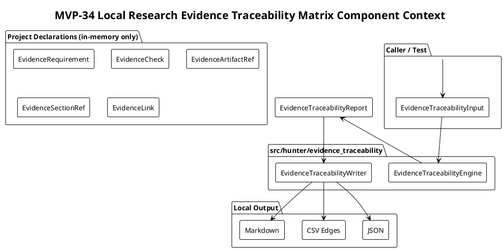
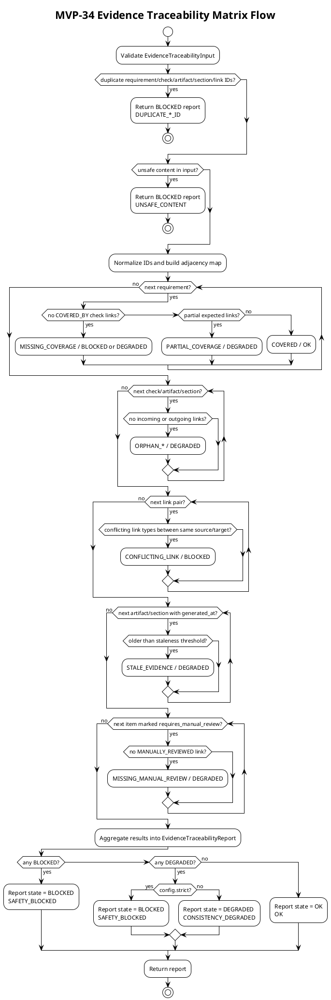

# SPEC-035-Local Research Evidence Traceability Matrix

## Background

MVP-33 introduced the Local Research Release Hardening / Consistency Audit, a deterministic, caller-provided declaration inspector that verifies completed local research packages follow expected safety, writer, export, version, and artifact conventions. As the project grows, the number of research artifacts, requirements, checks, and final audit sections increases. A human auditor needs a single, deterministic, local view that maps requirements to checks, checks to artifacts, artifacts to sections, and sections to packages or release notes, while flagging missing, stale, duplicated, conflicting, or manually-unchecked evidence.

The **Local Research Evidence Traceability Matrix** (MVP-34) provides this cross-cutting audit layer. It consumes only caller-provided in-memory declarations and references. It does not inspect the live filesystem, import modules, or follow paths. It produces a deterministic, local, human-audit report and CSV edge list that helps an auditor answer coverage questions without claiming the project is safe, ready, or approved for trading.

MVP-34 remains explicitly **audit-only and local**. It is not a trading signal, not trade approval, not strategy approval, not execution approval, not portfolio approval, not universe approval, and not a production certification. It does not connect to Binance, exchanges, APIs, networks, live data, or real trading. It does not place orders, suggest orders, emit action commands, or create execution instructions. It does not produce or consume Freqtrade strategy classes. It does not start a server, daemon, scheduler, background loop, cron, database, Web UI, dashboard, or REST API. All data processed is either already-loaded in-memory declarations passed by the caller, or local string paths treated as opaque identifiers only.

## Requirements

### Must Have (M)

- **M1:** Provide a local evidence traceability package `src/hunter/evidence_traceability/` with a public API exported from `src/hunter/evidence_traceability/__init__.py`.
- **M2:** The matrix is local-only and call-triggered; no server, no REST API, no Web UI, no dashboard, no daemon, no scheduler, no background loop, no cron, no database, no network calls, no exchange calls, no Binance, no Freqtrade import/runtime, no API keys, no live data, no real orders, no leverage, no shorting, no action commands, no trading signals, no approvals.
- **M3:** Models include frozen dataclasses: `EvidenceTraceabilityInput`, `EvidenceRequirement`, `EvidenceCheck`, `EvidenceArtifactRef`, `EvidenceSectionRef`, `EvidenceLink`, `EvidenceTraceabilityConfig`, `EvidenceTraceabilityReport`, `EvidenceTraceabilityDataQuality`, and `EvidenceTraceabilitySafetyFlags`.
- **M4:** Include an `EvidenceTraceabilityState` enum with at least the following values:
  - `OK` — the traced item satisfies the coverage expectation.
  - `DEGRADED` — an advisory inconsistency (e.g., partial coverage, stale metadata, missing manual review).
  - `BLOCKED` — a safety invariant violation (e.g., unsafe content, duplicate IDs, conflicting links).
  - `NOT_APPLICABLE` — the item does not apply to the provided declarations.
- **M5:** Include an `EvidenceTraceabilityReasonCode` enum or string constant set consistent with the project pattern, with at least the following values:
  - `OK`
  - `NOT_APPLICABLE`
  - `CONSISTENCY_DEGRADED`
  - `SAFETY_BLOCKED`
  - `MISSING_REQUIRED_DECLARATION`
  - `DUPLICATE_REQUIREMENT_ID`
  - `DUPLICATE_CHECK_ID`
  - `DUPLICATE_ARTIFACT_ID`
  - `DUPLICATE_SECTION_ID`
  - `DUPLICATE_LINK_ID`
  - `UNSAFE_CONTENT`
  - `MISSING_COVERAGE`
  - `PARTIAL_COVERAGE`
  - `ORPHAN_CHECK`
  - `ORPHAN_ARTIFACT`
  - `ORPHAN_SECTION`
  - `CONFLICTING_LINK`
  - `STALE_EVIDENCE`
  - `MISSING_MANUAL_REVIEW`
  - `FORBIDDEN_TERM_PRESENT`
- **M6:** The engine accepts caller-provided in-memory declarations only:
  - `EvidenceRequirement` objects describing a requirement identifier, optional title, description, and optional required link kinds.
  - `EvidenceCheck` objects describing a check identifier, optional title, the requirement IDs it covers, and a severity.
  - `EvidenceArtifactRef` objects describing an artifact reference identifier, an opaque local path string, optional label/message, optional `generated_at`, and an optional `requires_manual_review` flag.
  - `EvidenceSectionRef` objects describing a section reference identifier, an opaque local path string, optional label/message, optional `generated_at`, and an optional `requires_manual_review` flag.
  - `EvidenceLink` objects describing a directed edge (`link_id`, `source_id`, `target_id`, `link_type`, optional label/message, severity) among requirements, checks, artifacts, and sections.
  - No arbitrary file reading, no path traversal, no file ingestion, no module import introspection by the engine.
- **M7:** The engine runs a deterministic set of local traceability checks:
  - Normalize all caller-provided IDs and detect duplicates.
  - Detect missing requirement coverage: a requirement with no incoming `COVERED_BY` check link.
  - Detect partial coverage: a requirement with some but not all expected link types or checks.
  - Detect orphan checks, artifacts, and sections: declared items with no links.
  - Detect conflicting links: multiple links of incompatible types between the same source and target (e.g., a check both `COVERED_BY` and `CONTRADICTS` the same requirement).
  - Detect stale evidence: caller-provided `generated_at` timestamps on artifact/section references older than a caller-provided staleness threshold.
  - Detect missing manual review: links or artifacts explicitly marked `requires_manual_review=True` with no `MANUALLY_REVIEWED` evidence link.
  - Classify each requirement's coverage as `COVERED`, `PARTIAL`, `MISSING`, or `NOT_APPLICABLE`.
- **M8:** The engine is fail-closed: unsafe content, missing required declarations, duplicate IDs, and conflicting links produce `BLOCKED` results with clear reason codes. If an input tuple required for a check is empty, the result is `NOT_APPLICABLE` for advisory checks or `BLOCKED` for blocking checks, never a false `OK`.
- **M9:** The engine reports `DEGRADED` for advisory inconsistencies (e.g., partial coverage, stale evidence, missing manual review, orphan items).
- **M10:** The engine produces an `EvidenceTraceabilityReport` containing stable sorted lists of `EvidenceTraceabilityResult` objects, a data-quality summary, safety flags, and aggregated reason codes.
- **M11:** The writer serializes the matrix report to deterministic JSON, CSV edges, and Markdown, with atomic writes (temp file + fsync + `os.replace`).
- **M12:** Every output artifact and Markdown header includes an explicit research-only / not-trading-advice / not-certification notice.
- **M13:** The audit supports a fixed `generated_at` timestamp for deterministic testing and reproducible artifacts.
- **M14:** No arbitrary file ingestion in MVP-34. The audit only uses caller-provided in-memory declarations and the writer module. Artifact paths and section references are opaque strings; the engine never opens, follows, traverses, validates, fetches, or executes them.
- **M15:** Metadata and file-reference strings remain opaque local strings only; the audit never opens, follows, traverses, validates, fetches, or executes them.

### Should Have (S)

- **S1:** `EvidenceTraceabilityConfig` exposes a `strict: bool` flag (default `False`). When `True`, any `DEGRADED` result causes the overall report `state` to be `BLOCKED` with reason code `SAFETY_BLOCKED`. When `False`, `DEGRADED` results make the overall report `DEGRADED` with reason code `CONSISTENCY_DEGRADED`, and `BLOCKED` results still make it `BLOCKED`.
- **S2:** `EvidenceTraceabilityInput` exposes a `generated_at: datetime | None` field for deterministic output. Defaults to current UTC only if not provided.
- **S3:** `EvidenceTraceabilityReport` exposes a `reason_codes` tuple that aggregates all reason codes from individual results, plus report-level reason codes such as `OK`, `CONSISTENCY_DEGRADED`, and `SAFETY_BLOCKED`.
- **S4:** The writer supports default local output directories:
  - `data/evidence_traceability/evidence_traceability.json`
  - `data/evidence_traceability/evidence_traceability_edges.csv`
  - `reports/evidence_traceability/evidence_traceability.md`
- **S5:** `EvidenceTraceabilityCheck` and `EvidenceRequirement` expose stable identifiers, descriptions, and a severity (`advisory` or `blocking`). `severity` is the single fail-severity knob.
- **S6:** Inputs are immutable; the engine must not mutate caller-provided sequences, mappings, or dataclasses.
- **S7:** Model and engine tests are in-memory; writer tests use `tmp_path` only.

### Could Have (C)

- **C1:** A `validate_input` function that checks an `EvidenceTraceabilityInput` for duplicate IDs and missing required fields before running the engine.
- **C2:** Optional `notes` and `evidence` fields on each result for human-readable audit context.
- **C3:** A CLI slash command `/evidence-traceability` that calls the engine with a caller/test-supplied default declaration map and writes artifacts. Only if it does not require a server or background process. The map must not be built by scanning the filesystem or importing modules at runtime.

### Will Not Have (W)

- **W1:** No production certification, release approval, or trading readiness sign-off.
- **W2:** No filesystem traversal, directory scanning, or arbitrary file ingestion.
- **W3:** No network calls, exchange APIs, Binance integration, or live data.
- **W4:** No new trading/research decision logic, strategy generation, or signal production.
- **W5:** No server, daemon, scheduler, background loop, cron, database, Web UI, dashboard, or REST API.
- **W6:** No leverage, shorting, order placement, execution instructions, or actionable recommendations.
- **W7:** No Freqtrade strategy import or runtime dependency.

## Method

The evidence traceability matrix is a pure, deterministic function over caller-provided project declarations. It does not inspect the live filesystem, network, or any external state. The caller supplies an `EvidenceTraceabilityInput` containing requirements, checks, artifact references, section references, and links. The engine normalizes IDs, runs traceability checks, and produces a report that classifies coverage and flags anomalies.

Artifact references, section references, and metadata strings are **opaque local strings**. The engine never opens, follows, traverses, validates, fetches, or executes them. Timestamps are caller-provided and used only for comparison against caller-provided thresholds.



### Check Execution Flow



### Determinism Rules

- All inputs are frozen after construction.
- Requirements, checks, artifacts, sections, and links are sorted by ID before processing.
- Result lists are sorted by `(category, item_id, reason_code)`.
- Reason codes and state values are drawn from fixed enums/constants.
- `generated_at` is caller-provided; if omitted, UTC `datetime.now()` is used once at input construction.
- No randomness, no iteration over unordered sets without sorting, and no dependency on filesystem or network state.

### Data Model

```python
from enum import Enum
from dataclasses import dataclass, field
from datetime import datetime
from datetime import datetime, timedelta
from typing import FrozenSet, Mapping, Tuple

class EvidenceTraceabilityState(Enum):
    OK = "ok"
    DEGRADED = "degraded"
    BLOCKED = "blocked"
    NOT_APPLICABLE = "not_applicable"

class EvidenceTraceabilityReasonCode(Enum):
    OK = "ok"
    NOT_APPLICABLE = "not_applicable"
    CONSISTENCY_DEGRADED = "consistency_degraded"
    SAFETY_BLOCKED = "safety_blocked"
    MISSING_REQUIRED_DECLARATION = "missing_required_declaration"
    DUPLICATE_REQUIREMENT_ID = "duplicate_requirement_id"
    DUPLICATE_CHECK_ID = "duplicate_check_id"
    DUPLICATE_ARTIFACT_ID = "duplicate_artifact_id"
    DUPLICATE_SECTION_ID = "duplicate_section_id"
    DUPLICATE_LINK_ID = "duplicate_link_id"
    UNSAFE_CONTENT = "unsafe_content"
    MISSING_COVERAGE = "missing_coverage"
    PARTIAL_COVERAGE = "partial_coverage"
    ORPHAN_CHECK = "orphan_check"
    ORPHAN_ARTIFACT = "orphan_artifact"
    ORPHAN_SECTION = "orphan_section"
    CONFLICTING_LINK = "conflicting_link"
    STALE_EVIDENCE = "stale_evidence"
    MISSING_MANUAL_REVIEW = "missing_manual_review"
    FORBIDDEN_TERM_PRESENT = "forbidden_term_present"

class EvidenceTraceabilitySeverity(Enum):
    ADVISORY = "advisory"
    BLOCKING = "blocking"

class EvidenceTraceabilityLinkType(Enum):
    COVERED_BY = "covered_by"
    SUPPORTS = "supports"
    CONTRADICTS = "contradicts"
    MANUALLY_REVIEWED = "manually_reviewed"
    DERIVED_FROM = "derived_from"

FORBIDDEN_EVIDENCE_TRACEABILITY_TERMS: frozenset[str] = frozenset({
    "production ready",
    "live trading",
    "trade approval",
    "execute orders",
    "place orders",
    "buy signal",
    "sell signal",
    "go long",
    "go short",
    "certified",
    "production_ready",
    "live_trade",
    "real_order",
    "action_command",
    "go_live",
    "launch_live",
    "release_ready",
    "deployment_ready",
    "execution_ready",
    "strategy_ready",
})

class EvidenceTraceabilityCoverageState(Enum):
    COVERED = "covered"
    PARTIAL = "partial"
    MISSING = "missing"
    NOT_APPLICABLE = "not_applicable"

@dataclass(frozen=True, slots=True)
class EvidenceRequirement:
    requirement_id: str
    title: str = ""
    description: str
    required_link_types: Tuple[str, ...] = ()
    severity: EvidenceTraceabilitySeverity = EvidenceTraceabilitySeverity.BLOCKING

@dataclass(frozen=True, slots=True)
class EvidenceCheck:
    check_id: str
    title: str = ""
    description: str
    covers_requirement_ids: Tuple[str, ...] = ()
    severity: EvidenceTraceabilitySeverity = EvidenceTraceabilitySeverity.BLOCKING

@dataclass(frozen=True, slots=True)
class EvidenceArtifactRef:
    artifact_id: str
    reference: str
    label: str = ""
    message: str = ""
    generated_at: datetime | None = None
    requires_manual_review: bool = False

@dataclass(frozen=True, slots=True)
class EvidenceSectionRef:
    section_id: str
    reference: str
    label: str = ""
    message: str = ""
    generated_at: datetime | None = None
    requires_manual_review: bool = False

@dataclass(frozen=True, slots=True)
class EvidenceLink:
    link_id: str
    source_id: str
    target_id: str
    link_type: EvidenceTraceabilityLinkType
    label: str = ""
    message: str = ""
    severity: EvidenceTraceabilitySeverity = EvidenceTraceabilitySeverity.BLOCKING

@dataclass(frozen=True, slots=True)
class EvidenceTraceabilityConfig:
    strict: bool = False
    default_json_path: str = "data/evidence_traceability/evidence_traceability.json"
    default_csv_path: str = "data/evidence_traceability/evidence_traceability_edges.csv"
    default_markdown_path: str = "reports/evidence_traceability/evidence_traceability.md"
    staleness_threshold_seconds: int | None = None

@dataclass(frozen=True, slots=True)
class EvidenceTraceabilityResult:
    item_id: str
    category: str
    state: EvidenceTraceabilityState
    reason_code: EvidenceTraceabilityReasonCode
    coverage_state: EvidenceTraceabilityCoverageState
    message: str
    evidence: Tuple[str, ...] = ()

@dataclass(frozen=True, slots=True)
class EvidenceTraceabilityDataQuality:
    total_items: int
    ok_count: int
    degraded_count: int
    blocked_count: int
    not_applicable_count: int
    requirement_count: int
    check_count: int
    artifact_count: int
    section_count: int
    link_count: int
    notes: Tuple[str, ...] = ()

@dataclass(frozen=True, slots=True)
class EvidenceTraceabilitySafetyFlags:
    has_blocked: bool = False
    has_degraded: bool = False
    has_conflicting_links: bool = False
    has_missing_coverage: bool = False
    has_stale_evidence: bool = False
    has_missing_manual_review: bool = False
    has_orphan_items: bool = False
    has_forbidden_terms: bool = False
    research_only: bool = True
    not_trading_advice: bool = True
    not_production_certification: bool = True
    not_trading_readiness_gate: bool = True
    no_action_commands: bool = True
    no_network_connection: bool = True
    no_file_read_in_engine: bool = True
    no_database: bool = True
    no_exchange_connection: bool = True
    no_freqtrade_input: bool = True
    no_scheduler: bool = True
    no_web_ui: bool = True
    no_daemon: bool = True

    def __post_init__(self) -> None:
        positive_flags = (
            self.research_only,
            self.not_trading_advice,
            self.not_production_certification,
            self.not_trading_readiness_gate,
            self.no_action_commands,
            self.no_network_connection,
            self.no_file_read_in_engine,
            self.no_database,
            self.no_exchange_connection,
            self.no_freqtrade_input,
            self.no_scheduler,
            self.no_web_ui,
            self.no_daemon,
        )
        if not all(positive_flags):
            raise ValueError("baseline safety invariants must be True")

    @property
    def is_safe(self) -> bool:
        return (
            self.research_only
            and self.not_trading_advice
            and self.not_production_certification
            and self.not_trading_readiness_gate
            and self.no_action_commands
            and self.no_network_connection
            and self.no_file_read_in_engine
            and self.no_database
            and self.no_exchange_connection
            and self.no_freqtrade_input
            and self.no_scheduler
            and self.no_web_ui
            and self.no_daemon
            and not self.has_blocked
            and not self.has_degraded
            and not self.has_conflicting_links
            and not self.has_missing_coverage
            and not self.has_stale_evidence
            and not self.has_missing_manual_review
            and not self.has_orphan_items
            and not self.has_forbidden_terms
        )

@dataclass(frozen=True, slots=True)
class EvidenceTraceabilityInput:
    requirements: Tuple[EvidenceRequirement, ...]
    checks: Tuple[EvidenceCheck, ...] = ()
    artifacts: Tuple[EvidenceArtifactRef, ...] = ()
    sections: Tuple[EvidenceSectionRef, ...] = ()
    links: Tuple[EvidenceLink, ...] = ()
    project_version: str | None = None
    generated_at: datetime | None = None
    metadata: Mapping[str, str] = field(default_factory=dict)
    config: EvidenceTraceabilityConfig = field(default_factory=EvidenceTraceabilityConfig)

@dataclass(frozen=True, slots=True)
class EvidenceTraceabilityReport:
    state: EvidenceTraceabilityState
    reason_codes: Tuple[EvidenceTraceabilityReasonCode, ...]
    results: Tuple[EvidenceTraceabilityResult, ...]
    links: Tuple[EvidenceLink, ...]
    data_quality: EvidenceTraceabilityDataQuality
    safety_flags: EvidenceTraceabilitySafetyFlags
    generated_at: datetime
    project_version: str | None
    notes: Tuple[str, ...] = ()

    @classmethod
    def blocked(
        cls,
        *,
        input: EvidenceTraceabilityInput,
        reason_code: EvidenceTraceabilityReasonCode = EvidenceTraceabilityReasonCode.UNSAFE_CONTENT,
        generated_at: datetime | None = None,
        safety_flags: EvidenceTraceabilitySafetyFlags | None = None,
        notes: Tuple[str, ...] = (),
    ) -> "EvidenceTraceabilityReport":
        """Create a deterministic fail-closed blocked matrix report."""
        if generated_at is None:
            generated_at = input.generated_at if input.generated_at is not None else datetime.now(timezone.utc)
        if safety_flags is None:
            if reason_code in (
                EvidenceTraceabilityReasonCode.UNSAFE_CONTENT,
                EvidenceTraceabilityReasonCode.FORBIDDEN_TERM_PRESENT,
            ):
                safety_flags = EvidenceTraceabilitySafetyFlags(has_forbidden_terms=True)
            else:
                safety_flags = EvidenceTraceabilitySafetyFlags()
        data_quality = EvidenceTraceabilityDataQuality(
            total_items=0,
            ok_count=0,
            degraded_count=0,
            blocked_count=0,
            not_applicable_count=0,
            requirement_count=len(input.requirements),
            check_count=len(input.checks),
            artifact_count=len(input.artifacts),
            section_count=len(input.sections),
            link_count=len(input.links),
            notes=(),
        )
        return cls(
            state=EvidenceTraceabilityState.BLOCKED,
            reason_codes=(EvidenceTraceabilityReasonCode.SAFETY_BLOCKED, reason_code),
            results=(),
            links=(),
            data_quality=data_quality,
            safety_flags=safety_flags,
            generated_at=generated_at,
            project_version=input.project_version,
            notes=notes,
        )

```

### Engine Helpers

- `has_unsafe_evidence_traceability_content(text=None, metadata=None, tags=None, forbidden_terms=None) -> bool`: Returns `True` if any caller-provided string or metadata key/value contains a forbidden term. All checks are case-insensitive substring matches on strings only; path references are never opened or followed.

### Algorithms

#### Input Validation

1. Require a non-empty `requirements` tuple. If empty, return `EvidenceTraceabilityReport.blocked(input=input, reason_code=MISSING_REQUIRED_DECLARATION, notes=("Input validation failed: requirements tuple is empty.",))`.
2. Check for duplicate IDs within each collection: `requirement_id`, `check_id`, `artifact_id`, `section_id`, `link_id`. If any duplicate is found, return `EvidenceTraceabilityReport.blocked(input=input, reason_code=<appropriate DUPLICATE_*_ID>, notes=("Input validation failed: duplicate IDs detected.",))`.
3. Check `dict(input.metadata)` for unsafe content using `has_unsafe_evidence_traceability_content()` and the package-level `FORBIDDEN_EVIDENCE_TRACEABILITY_TERMS`. Metadata keys and values remain opaque strings; they are never opened, followed, traversed, validated, fetched, or executed. If unsafe content is found, return `EvidenceTraceabilityReport.blocked(input=input, reason_code=UNSAFE_CONTENT, notes=("Input validation failed: unsafe content in metadata.",))`.

#### Traceability Matrix

1. Build sorted adjacency maps from `EvidenceLink` objects keyed by `(source_id, target_id)` and by `target_id` for incoming links.
2. For each requirement:
   - Count incoming `COVERED_BY` links from checks.
   - If no incoming links and the requirement is blocking, emit `MISSING_COVERAGE` / `BLOCKED`.
   - If no incoming links and the requirement is advisory, emit `MISSING_COVERAGE` / `DEGRADED`.
   - If some but not all required link types are present, emit `PARTIAL_COVERAGE` / `DEGRADED`.
   - Otherwise emit `OK` / `COVERED`.
3. For each check, artifact, and section, if it has no incoming or outgoing links, emit an `ORPHAN_*` / `DEGRADED` result.
4. For each `(source_id, target_id)` pair, if both `SUPPORTS`/`COVERED_BY` and `CONTRADICTS` links exist, emit `CONFLICTING_LINK` / `BLOCKED`.
5. For each artifact/section with a `generated_at` and a configured `staleness_threshold_seconds`, if `artifact.generated_at < report.generated_at - timedelta(seconds=config.staleness_threshold_seconds)`, emit `STALE_EVIDENCE` / `DEGRADED`.
6. For each item with `requires_manual_review=True`, if no `MANUALLY_REVIEWED` link targets it, emit `MISSING_MANUAL_REVIEW` / `DEGRADED`.
7. Sort all results by `(category, item_id, reason_code.value)`.
8. For coverage-classification results (requirement missing/partial/covered), set `coverage_state` to the corresponding classification. For all other result categories (orphan, stale, manual-review, conflict, duplicate, unsafe content), set `coverage_state = NOT_APPLICABLE`.
9. Scan caller-provided text fields (`requirement.description`, `check.description`, `artifact`/`section`/`link` labels or messages, and `input.metadata` keys/values) for forbidden terms. If found, emit `FORBIDDEN_TERM_PRESENT` / `BLOCKED` with the offending field as evidence. All scanning is string-only; path references remain opaque and are never opened.

#### Report Aggregation

1. Copy sorted input links into `report.links` for deterministic CSV edge serialization. Collect all results into a sorted tuple.
2. Compute `EvidenceTraceabilityDataQuality` from the counts of each state.
3. Compute `EvidenceTraceabilitySafetyFlags` from the reason codes and states.
4. Determine overall report state and report-level reason code:
   - If any result is `BLOCKED`, report `state=BLOCKED` and include `SAFETY_BLOCKED`.
   - Else if any result is `DEGRADED`:
     - If `config.strict` is `True`, report `state=BLOCKED` and include `SAFETY_BLOCKED`.
     - Else report `state=DEGRADED` and include `CONSISTENCY_DEGRADED`.
   - Else report `state=OK` and include `OK`.
5. De-duplicate and sort `reason_codes`.
6. `NOT_APPLICABLE` results do not by themselves make the report `DEGRADED` or `BLOCKED`.

### Strict Mode

`EvidenceTraceabilityConfig.strict` (default `False`) governs how advisory failures affect the overall report. In non-strict mode, any `BLOCKED` result -> report `BLOCKED`, any `DEGRADED` result (and no `BLOCKED`) -> report `DEGRADED`, else -> report `OK`. In strict mode, any `BLOCKED` or `DEGRADED` result -> report `BLOCKED`. Individual results remain `DEGRADED`; only the overall state is promoted.

### Writer Behavior

The writer is single-argument: `evidence_traceability_report_to_csv_text(report)` and `write_evidence_traceability_report(report, ...)`. It does not accept the original input separately.

- **JSON**: `evidence_traceability.json` contains the full serialized `EvidenceTraceabilityReport`, including `report.links`. Datetime is serialized as ISO-8601 UTC strings, enums as their `value` strings, and dataclasses recursively. The JSON object begins with the safety notice and `generated_at`.
- **CSV edges**: `evidence_traceability_edges.csv` contains one row per link in `report.links`. Columns are deterministic: `report_id`, `generated_at`, `source_id`, `target_id`, `link_type`, `coverage_state`, `severity`, `reason_codes`, `message`. The writer derives `coverage_state`, `severity`, and `reason_codes` for each edge by looking up the relevant result in the report (if any); otherwise it uses sensible defaults. Rows are sorted by `(source_id, target_id, link_type)`.
- **Markdown**: `evidence_traceability.md` begins with an H1 title and immediate safety notice. Sections include Report Identity, Summary, Coverage Matrix, Results by Category, Data Quality, Safety Flags, Reason Codes, Edges, and Notes. No actionable order/execution/trading instructions appear.
- All writer functions use atomic writes: temp file in the target directory, flush + fsync, `os.replace`, and parent directory creation. The writer never opens, follows, traverses, validates, fetches, or executes any `reference` string or file path.

## Implementation

### Step 1 — Models and Engine

- Create `src/hunter/evidence_traceability/models.py` with enums, reason codes, safety flags, and frozen dataclasses.
- Create `src/hunter/evidence_traceability/engine.py` with `build_evidence_traceability_report` and supporting helpers.
- Add `src/hunter/evidence_traceability/__init__.py` with public exports.
- Implement `tests/test_evidence_traceability/test_models.py`.
- Implement `tests/test_evidence_traceability/test_engine.py`.

### Step 2 — Writer

- Create `src/hunter/evidence_traceability/writer.py` with deterministic JSON/CSV/Markdown serialization and atomic write functions.
- Implement `tests/test_evidence_traceability/test_writer.py`.

### Step 3 — Integration Tests

- Implement `tests/test_evidence_traceability/test_integration.py` with end-to-end flows, safety boundary assertions, and determinism tests.

### Step 4 — Finalization

- Bump version to `0.34.0-dev` in `pyproject.toml` and `src/hunter/__init__.py`.
- Update `CHANGELOG.md`, `docs/handoff/CURRENT_STATE.md`, `tasks/active.md`, and `tasks/agent-log.md`.
- Run full test suite and confirm all tests pass.

## Test Plan

### Model Tests

- State, reason code, severity, link type, and coverage state enum values.
- `EvidenceTraceabilityInput` validates naive datetime rejection and list normalization.
- `EvidenceTraceabilityConfig` defaults and path validation.
- `EvidenceTraceabilityDataQuality` count invariants.
- `EvidenceTraceabilitySafetyFlags` baseline invariants and `is_safe` reflection.
- Frozen dataclasses reject mutation.

### Engine Tests

- Deterministic IDs and stable ordering of results.
- Duplicate requirement/check/artifact/section/link IDs produce `BLOCKED` minimal reports.
- Missing coverage on a blocking requirement -> `BLOCKED`; on advisory -> `DEGRADED`.
- Partial coverage -> `DEGRADED`.
- Orphan checks, artifacts, and sections -> `DEGRADED`.
- Conflicting links -> `BLOCKED`.
- Stale evidence based on caller-provided timestamps -> `DEGRADED`.
- Missing manual review evidence -> `DEGRADED`.
- Unsafe input metadata -> `BLOCKED`.
- Forbidden terms in requirement titles/descriptions, check titles/descriptions, artifact/section/link labels or messages, or metadata values -> `BLOCKED` / `FORBIDDEN_TERM_PRESENT`.
- Empty required input -> `BLOCKED`.
- Strict mode promotes `DEGRADED` to `BLOCKED`.
- No mutation of caller-provided inputs.
- No filesystem scan, import introspection, or path traversal.

### Writer Tests

- Dict conversion includes report, results, data quality, and safety flags.
- JSON parseable, deterministic, and begins with safety notice and `generated_at`.
- CSV header and deterministic edge rows with `report_id`, `generated_at`, `source_id`, `target_id`, `link_type`, `coverage_state`, `severity`, `reason_codes`, `message`.
- CSV rows are produced from `report.links`; the writer never reconstructs edges from the filesystem or follows referenced paths.
- Markdown starts with H1 and immediate research-only/audit-only notice.
- Markdown explicitly states the matrix is not approval/certification/trading readiness gate/recommendation/signal.
- Markdown contains summary, results, data quality, safety flags, and reason-code sections.
- Atomic writes create JSON/CSV/Markdown under `tmp_path` and create parent directories.
- Blocked/degraded report serialization.
- No mutation of report.
- Public exports from `src/hunter/evidence_traceability/__init__.py`.
- No metadata/path reference traversal or opening.

### Integration Tests

- End-to-end successful traceability matrix with requirements, checks, artifacts, sections, and links.
- Caller-provided actuals: links are opaque and coverage is derived from in-memory declarations only.
- Empty actual behavior: advisory empty -> `NOT_APPLICABLE`; blocking empty -> `BLOCKED`.
- Aggregation: non-strict `BLOCKED > DEGRADED > OK`; strict promotes `DEGRADED`/`BLOCKED` to `BLOCKED`.
- Coverage classification: `COVERED`, `PARTIAL`, `MISSING`, `NOT_APPLICABLE`.
- Fail-closed: duplicate IDs, conflicting links, unsafe content produce `BLOCKED` minimal reports.
- Writer end-to-end: JSON, CSV, Markdown created under `tmp_path`; JSON parses; CSV has expected edge rows; Markdown has required sections and safety language.
- Determinism: same inputs + fixed `generated_at` produce identical outputs.
- No mutation of inputs.
- Public exports.
- Safety boundaries: outputs contain audit-only/research-only language and no actionable order/execution/live trading instructions.

## Milestones

- **M34.1:** Models and engine implemented with unit tests passing.
- **M34.2:** Writer implemented with deterministic JSON/CSV/Markdown output and atomic write tests passing.
- **M34.3:** Integration tests passing, including safety boundary and determinism checks.
- **M34.4:** Finalization complete, version bumped to `0.34.0-dev`, and full suite remains green.

## Gathering Results

Acceptance criteria for MVP-34:

- `src/hunter/evidence_traceability/` exists with clean public API exports in `__init__.py`.
- Models implement `EvidenceTraceabilityInput`, `EvidenceRequirement`, `EvidenceCheck`, `EvidenceArtifactRef`, `EvidenceSectionRef`, `EvidenceLink`, `EvidenceTraceabilityConfig`, `EvidenceTraceabilityResult`, `EvidenceTraceabilityReport`, `EvidenceTraceabilityDataQuality`, and `EvidenceTraceabilitySafetyFlags`.
- `EvidenceTraceabilityState`, `EvidenceTraceabilityReasonCode`, `EvidenceTraceabilitySeverity`, `EvidenceTraceabilityLinkType`, and `EvidenceTraceabilityCoverageState` enums cover all required values.
- Engine function `build_evidence_traceability_report` is deterministic, does not mutate inputs, performs no file ingestion, and treats all paths and references as opaque strings.
- Traceability checks run correctly and produce correct state/reason-code/coverage combinations.
- Writer outputs JSON, CSV edges, and Markdown artifacts with research-only safety notices and deterministic ordering.
- Atomic writes use temp file + fsync + `os.replace`.
- All model, engine, writer, and integration tests pass.
- Full test suite remains green.
- No forbidden semantics introduced: no server, API, Web UI, dashboard, database, scheduler, daemon, exchange, Binance, Freqtrade, leverage, shorting, real orders, live data, or action commands.
- The matrix is not marketed as a trading signal, recommendation, certification, or trading readiness system.

## Need Professional Help in Developing Your Architecture?

Please contact me at [sammuti.com](https://sammuti.com) :)
