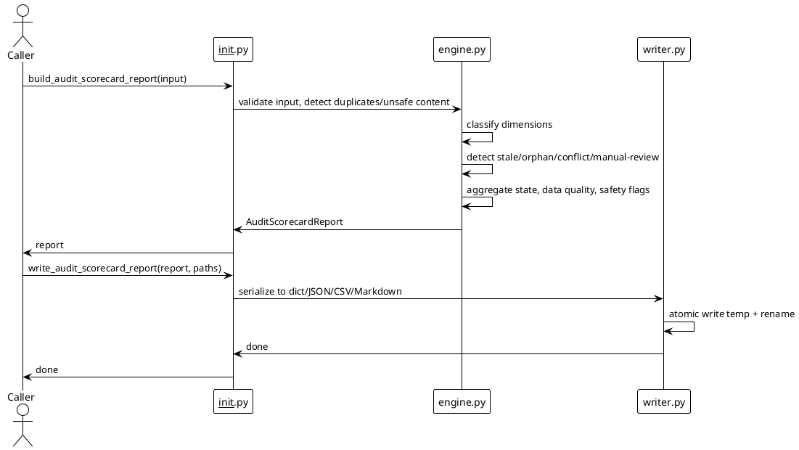

# SPEC-036-Local Research Audit Readiness Scorecard

## Background

Hunter Futures Pro is an audit-only local crypto/futures research framework. Every
MVP produces human-audit research artifacts, not trading signals or execution
gates. MVP-33 added a **Local Research Release Hardening / Consistency Audit**
and MVP-34 added a **Local Research Evidence Traceability Matrix**. Both operate
on caller-provided, in-memory declarations and treat file/artifact/report
references as opaque strings.

MVP-35 introduces the **Local Research Audit Readiness Scorecard**. The term
"readiness" is intentionally scoped: it does **not** mean production approval,
certification, deployment approval, trading readiness, investment suitability,
or signal approval. It means only a **human audit review completeness snapshot
for local research artifacts**.

The scorecard aggregates signals from previous local research audits (e.g.
release-hardening reports, evidence-traceability reports, and other
caller-provided package/report declarations) into a single deterministic,
read-only snapshot. A human auditor can use it to see which audit dimensions
are complete, partial, missing, blocked, degraded, or not applicable, and
which issues require manual review.

The scorecard never opens, follows, traverses, validates, fetches, or executes
any referenced path or artifact. It is local, deterministic, and audit-only.

## Requirements

### Must Have

- A new package `src/hunter/audit_scorecard/` with a public API surface in
  `src/hunter/audit_scorecard/__init__.py`.
- Frozen dataclasses and enums for `AuditScorecardInput`,
  `AuditScorecardDimension`, `AuditScorecardEvidenceRef`,
  `AuditScorecardFinding`, `AuditScorecardLink`, `AuditScorecardConfig`,
  `AuditScorecardReport`, `AuditScorecardDataQuality`,
  `AuditScorecardSafetyFlags`, `AuditScorecardState`,
  `AuditScorecardReasonCode`, `AuditScorecardDimensionState`,
  `AuditScorecardSeverity`, and `AuditScorecardLinkType`.
- `AuditScorecardInput` must include `metadata: Mapping[str, str]`.
- Deterministic report generation from caller-provided in-memory inputs.
- No filesystem scan, no import introspection, no path traversal, no network,
  no exchange, no Freqtrade runtime/strategy, no database, no scheduler, no
  daemon, no Web UI, no dashboard.
- Coverage classification per dimension: `COMPLETE`, `PARTIAL`, `MISSING`,
  `BLOCKED`, `DEGRADED`, `NOT_APPLICABLE`.
- Overall aggregation: `BLOCKED` if any blocking failure is present, `DEGRADED`
  if only advisory failures are present, `OK` if none are present, and
  `NOT_APPLICABLE` does not block.
- Strict mode that promotes any `DEGRADED` or `BLOCKED` to `BLOCKED`.
- Fail-closed unsafe-content detection in metadata, titles, descriptions,
  labels, and messages.
- Deterministic integer percentages only as descriptive completeness metrics,
  never as approval or certification scores.
- JSON/CSV/Markdown writer with deterministic serialization and atomic local
  writes.
- Markdown output contains an immediate audit-only/research-only safety notice
  and explicitly states that the scorecard is not an approval, certification,
  production readiness, trading readiness, recommendation, suitability
  assessment, or signal.
- CSV output contains dimension rows with columns: `report_id`, `generated_at`,
  `dimension_id`, `dimension_state`, `severity`, `completeness_percent`,
  `evidence_count`, `finding_count`, `reason_codes`, `message`.
- Integration tests covering end-to-end flows, determinism, no input mutation,
  fail-closed behavior, opaque references, and safety boundaries.

### Should Have

- Built-in reason-code string constants for easy import and use in tests.
- Support for linking dimensions to upstream package/report IDs via opaque
  strings.
- Stale-evidence detection based only on caller-provided `generated_at`
  timestamps.
- Manual-review-required detection for dimensions and evidence refs.
- Conflicting-finding/link detection.
- Orphan evidence-ref/link detection.
- Data-quality summary (counts, sections present, etc.).

### Could Have

- PlantUML component and sequence diagrams in this spec.
- Optional dimension templates for common local research audit areas
  (release-hardening, evidence-traceability, final-audit-pack, etc.).

### Will Not Have

- Any production approval, certification, deployment approval, trading
  readiness, investment suitability, or signal approval semantics.
- Any live trading, order generation, execution feedback, or strategy selector.
- Any exchange, Binance, API key, network, or Freqtrade runtime/strategy
  connection.
- Any Web UI, dashboard, server, REST API, database, scheduler, or daemon.
- Any filesystem scan, import introspection, path traversal, or execution of
  referenced paths/artifacts.

## Method

### Architecture overview

```text
┌─────────────────────────────────────────────────────────────────────┐
│                      Caller (trusted test harness)                  │
│  Provides in-memory:                                                  │
│    - AuditScorecardInput                                              │
│    - dimensions, findings, evidence_refs, links, metadata             │
└─────────────────────────────────┬───────────────────────────────────┘
                                  │
                                  ▼
┌─────────────────────────────────────────────────────────────────────┐
│         src/hunter/audit_scorecard/engine.py                          │
│  - Validate input                                                     │
│  - Detect duplicate IDs                                               │
│  - Detect unsafe content                                              │
│  - Classify each dimension (COMPLETE/PARTIAL/MISSING/BLOCKED/        │
│    DEGRADED/NOT_APPLICABLE)                                           │
│  - Detect stale evidence, missing evidence, manual-review gaps       │
│  - Detect conflicting findings/links and orphan evidence refs/links   │
│  - Aggregate overall state (OK / DEGRADED / BLOCKED)                  │
│  - Build data-quality summary and safety flags                        │
└─────────────────────────────────┬───────────────────────────────────┘
                                  │
                                  ▼
┌─────────────────────────────────────────────────────────────────────┐
│         src/hunter/audit_scorecard/writer.py                          │
│  - audit_scorecard_report_to_dict                                     │
│  - audit_scorecard_report_to_json_text                                │
│  - audit_scorecard_report_to_csv_text                                 │
│  - audit_scorecard_report_to_markdown_text                            │
│  - atomic_write_json_audit_scorecard_report                           │
│  - atomic_write_csv_audit_scorecard_report                            │
│  - atomic_write_markdown_audit_scorecard_report                        │
└─────────────────────────────────────────────────────────────────────┘
```

The scorecard is purely a local, deterministic aggregation over in-memory data.
All file, artifact, and report references are opaque strings; the engine never
opens, follows, traverses, validates, fetches, or executes them.

### In-memory models

```python
class AuditScorecardState(Enum):
    OK = "ok"
    DEGRADED = "degraded"
    BLOCKED = "blocked"
    NOT_APPLICABLE = "not_applicable"


class AuditScorecardDimensionState(Enum):
    COMPLETE = "complete"
    PARTIAL = "partial"
    MISSING = "missing"
    BLOCKED = "blocked"
    DEGRADED = "degraded"
    NOT_APPLICABLE = "not_applicable"


class AuditScorecardSeverity(Enum):
    ADVISORY = "advisory"
    BLOCKING = "blocking"


class AuditScorecardReasonCode(Enum):
    OK = "ok"
    NOT_APPLICABLE = "not_applicable"
    UNSAFE_CONTENT = "unsafe_content"
    MISSING_REQUIRED_DIMENSION = "missing_required_dimension"
    DUPLICATE_DIMENSION_ID = "duplicate_dimension_id"
    DUPLICATE_EVIDENCE_ID = "duplicate_evidence_id"
    DUPLICATE_FINDING_ID = "duplicate_finding_id"
    DUPLICATE_LINK_ID = "duplicate_link_id"
    MISSING_SUPPORTING_EVIDENCE = "missing_supporting_evidence"
    STALE_EVIDENCE = "stale_evidence"
    MISSING_MANUAL_REVIEW = "missing_manual_review"
    CONFLICTING_FINDING = "conflicting_finding"
    CONFLICTING_LINK = "conflicting_link"
    ORPHAN_EVIDENCE = "orphan_evidence"
    ORPHAN_LINK = "orphan_link"
    UPSTREAM_DEGRADED = "upstream_degraded"
    UPSTREAM_BLOCKED = "upstream_blocked"
    UNKNOWN_UPSTREAM_STATE = "unknown_upstream_state"
    HUMAN_RESEARCH_ONLY = "human_research_only"
    NOT_TRADING_ADVICE = "not_trading_advice"
    NO_PRODUCTION_READINESS = "no_production_readiness"
    NO_FILE_INGESTION = "no_file_ingestion"
    NO_NETWORK_CONNECTION = "no_network_connection"
    NO_EXCHANGE_CONNECTION = "no_exchange_connection"
    NO_FREQTRADE_INPUT = "no_freqtrade_input"
    NO_SCHEDULER = "no_scheduler"
    NO_DAEMON = "no_daemon"
    NO_WEB_UI = "no_web_ui"
    NO_DATABASE = "no_database"
    NO_ACTION_COMMANDS_EMITTED = "no_action_commands_emitted"


@dataclass(frozen=True)
class AuditScorecardConfig:
    strict: bool = False
    generated_at: datetime | None = None
    default_json_path: str = "data/audit_scorecard/audit_scorecard.json"
    default_csv_path: str = "data/audit_scorecard/audit_scorecard_dimensions.csv"
    default_markdown_path: str = "reports/audit_scorecard/audit_scorecard.md"
    staleness_threshold_seconds: int | None = None


@dataclass(frozen=True)
class AuditScorecardEvidenceRef:
    evidence_id: str
    reference: str
    label: str = ""
    message: str = ""
    generated_at: datetime | None = None
    requires_manual_review: bool = False


@dataclass(frozen=True)
class AuditScorecardFinding:
    finding_id: str
    dimension_id: str
    severity: AuditScorecardSeverity
    reason_code: AuditScorecardReasonCode
    message: str = ""
    evidence: tuple[str, ...] = ()


@dataclass(frozen=True)
class AuditScorecardLink:
    link_id: str
    source_id: str
    target_id: str
    link_type: AuditScorecardLinkType
    label: str = ""
    message: str = ""


class AuditScorecardLinkType(Enum):
    COVERS = "covers"
    SUPPORTS = "supports"
    CONTRADICTS = "contradicts"
    MANUALLY_REVIEWED = "manually_reviewed"
    DERIVED_FROM = "derived_from"


@dataclass(frozen=True)
class AuditScorecardDimension:
    dimension_id: str
    title: str
    description: str
    severity: AuditScorecardSeverity = AuditScorecardSeverity.BLOCKING
    required: bool = True
    not_applicable: bool = False
    requires_manual_review: bool = False
    upstream_package_ids: tuple[str, ...] = ()
    upstream_report_ids: tuple[str, ...] = ()
    expected_evidence_count: int | None = None
    required_link_types: tuple[str, ...] = ()


@dataclass(frozen=True, slots=True)
class AuditScorecardDimensionResult:
    """Per-dimension classification result produced by the engine.

    The writer reads these directly; it does not recompute classification.
    Dimensions with no findings still receive a COMPLETE, NOT_APPLICABLE, or
    other deterministic state row.
    """

    dimension_id: str
    dimension_state: AuditScorecardDimensionState
    severity: AuditScorecardSeverity
    completeness_percent: int
    evidence_count: int
    finding_count: int
    reason_codes: tuple[str, ...] = ()
    message: str = ""


@dataclass(frozen=True)
class AuditScorecardInput:
    dimensions: tuple[AuditScorecardDimension, ...]
    evidence_refs: tuple[AuditScorecardEvidenceRef, ...] = ()
    findings: tuple[AuditScorecardFinding, ...] = ()
    links: tuple[AuditScorecardLink, ...] = ()
    upstream_states: Mapping[str, str] = field(default_factory=dict)
    metadata: Mapping[str, str] = field(default_factory=dict)
    project_version: str = ""
    generated_at: datetime | None = None
    config: AuditScorecardConfig = field(default_factory=AuditScorecardConfig)


@dataclass(frozen=True)
class AuditScorecardDataQuality:
    dimension_count: int
    evidence_count: int
    finding_count: int
    link_count: int
    sections_present: int
    state_distribution: Mapping[str, int]


@dataclass(frozen=True)
class AuditScorecardSafetyFlags:
    research_only: bool = True
    not_trading_advice: bool = True
    no_production_readiness: bool = True
    no_file_ingestion: bool = True
    no_network_connection: bool = True
    no_exchange_connection: bool = True
    no_freqtrade_input: bool = True
    no_scheduler: bool = True
    no_daemon: bool = True
    no_web_ui: bool = True
    no_database: bool = True
    no_action_commands: bool = True
    has_blocked: bool = False
    has_degraded: bool = False
    has_conflicting_findings: bool = False
    has_conflicting_links: bool = False
    has_stale_evidence: bool = False
    has_missing_manual_review: bool = False
    has_orphan_evidence: bool = False
    has_orphan_links: bool = False
    has_forbidden_terms: bool = False

    @property
    def is_safe(self) -> bool:
        # Returns True only when all positive invariants hold and all negative
        # flags are False. is_safe does not imply approval; it is an internal
        # audit-only safety invariant check.
        ...


@dataclass(frozen=True)
class AuditScorecardReport:
    report_id: str
    state: AuditScorecardState
    reason_codes: tuple[str, ...]
    dimensions: tuple[AuditScorecardDimension, ...]
    dimension_results: tuple[AuditScorecardDimensionResult, ...] = ()
    evidence_refs: tuple[AuditScorecardEvidenceRef, ...]
    findings: tuple[AuditScorecardFinding, ...]
    links: tuple[AuditScorecardLink, ...]
    data_quality: AuditScorecardDataQuality
    safety_flags: AuditScorecardSafetyFlags
    generated_at: datetime
    project_version: str
    notes: tuple[str, ...]

    # Class method for fail-closed blocked reports on unsafe/empty input.
    @classmethod
    def blocked(cls, *, input: AuditScorecardInput, reason_code: AuditScorecardReasonCode, generated_at: datetime, notes: tuple[str, ...]) -> "AuditScorecardReport": ...
```

### Engine behavior

1. **Resolve timestamp**: `generated_at` comes from `input.generated_at`, then
   `input.config.generated_at`, then `datetime.now(timezone.utc)`.
2. **Validate input**: fail-closed if `dimensions` is empty, if any duplicate
   IDs are found, or if unsafe content is detected in metadata, titles,
   descriptions, labels, or messages. Unsafe content returns a blocked report
   with `UNSAFE_CONTENT`.
3. **Build link maps**: incoming/outgoing link maps and link-pair maps for
   conflict detection.
4. **Dimension classification**: for each dimension, evaluate the following
   precedence order; the first matching rule wins and produces exactly one
   classification state:
   1. If `dimension.not_applicable` is True → `NOT_APPLICABLE`. These dimensions
      are still emitted in outputs for audit transparency, but they do not
      block aggregation.
   2. If any upstream package/report state is `BLOCKED`, or any blocking finding
      is already attached to this dimension → `BLOCKED`.
   3. If any upstream package/report state is `DEGRADED` → `DEGRADED`.
   4. If the dimension is required and has zero supporting evidence refs
      (linked via `COVERS`, `SUPPORTS`, or `DERIVED_FROM`) → `MISSING`.
   5. If some but not all required evidence or required link types are present
      → `PARTIAL`.
   6. If manual review is required but no `MANUALLY_REVIEWED` link targets this
      dimension → `DEGRADED`.
   7. Otherwise → `COMPLETE`.

   `required=False` means the dimension is optional but still evaluated by the
   classification rules above. `not_applicable=True` means the dimension is
   excluded from evaluation entirely and classified as `NOT_APPLICABLE`.
5. **Build dimension results**: the engine produces one
   `AuditScorecardDimensionResult` per dimension containing the classification
   state, severity, integer completeness percentage (0–100), evidence count,
   finding count, reason codes, and message. The writer reads these results
   directly and does not recompute classification. Dimensions with no findings
   still receive a `COMPLETE`, `NOT_APPLICABLE`, or other deterministic state
   row.
6. **Stale evidence detection**: for any evidence ref where
   `evidence.generated_at < report.generated_at - timedelta(seconds=config.staleness_threshold_seconds)`,
   emit a `STALE_EVIDENCE` finding. Only evaluated when
   `config.staleness_threshold_seconds` is not None.
7. **Orphan detection**: evidence refs and links not connected to any dimension
   via the link graph are marked as orphan findings.
8. **Conflict detection**: if the same `(source_id, target_id)` pair has both
   `SUPPORTS` and `CONTRADICTS`, emit a `CONFLICTING_LINK` finding. If two
   findings for the same dimension have the same `finding_id` or contradictory
   reason codes at the same severity, emit a `CONFLICTING_FINDING` finding.
9. **Manual review detection**: any dimension or evidence ref with
   `requires_manual_review=True` and no `MANUALLY_REVIEWED` link targeting it
   emits a `MISSING_MANUAL_REVIEW` finding.
10. **Upstream state normalization**: `input.upstream_states` is a
    `Mapping[str, str]`. Valid normalized values are `ok`, `degraded`, `blocked`,
    `not_applicable`, and `unknown`. Matching is case-insensitive. `unknown` or
    any unrecognized value produces an `UNKNOWN_UPSTREAM_STATE` advisory finding
    for the affected dimension; it does not block unless the dimension's own
    severity is blocking or strict mode is enabled.
11. **Aggregation**: overall state is `BLOCKED` if any blocking finding exists,
    `DEGRADED` if only advisory findings exist, `OK` otherwise. `NOT_APPLICABLE`
    dimensions do not block. In `strict` mode, any `DEGRADED` or `BLOCKED` is
    promoted to `BLOCKED`.
12. **Data quality**: count dimensions, evidence refs, findings, links, and
    state distribution.
13. **Safety flags**: set baseline invariants (`research_only`,
    `not_trading_advice`, `no_production_readiness`, etc.) to `True`; set
    negative flags (`has_blocked`, `has_degraded`, etc.) based on findings.

### Writer behavior

- `audit_scorecard_report_to_dict(report) -> dict[str, Any]` — deterministic
  nested dict serialization.
- `audit_scorecard_report_to_json_text(report) -> str` — JSON text with sorted
  keys and deterministic indentation.
- `audit_scorecard_report_to_csv_text(report) -> str` — CSV rows, one per
  dimension result in `report.dimension_results`, with columns:
  `report_id, generated_at, dimension_id, dimension_state, severity,
  completeness_percent, evidence_count, finding_count, reason_codes, message`.
  The writer reads `report.dimension_results` directly; it does not recompute
  classification.
- `audit_scorecard_report_to_markdown_text(report) -> str` — Markdown with H1
  title, immediate audit-only/research-only safety notice, summary table,
  dimensions table, findings, evidence refs, links, data quality, safety flags,
  reason codes, and notes.
- Atomic write helpers use a temporary file + rename pattern.
- `write_audit_scorecard_report(report, *, json_path, csv_path, md_path)` writes
  all three artifacts. The implementation follows the prior-MVP sentinel
  pattern: `_DEFAULT_PATH = object()` means "use the default local path";
  `None` means "skip writing that artifact"; an explicit path means "write to
  that path". This keeps the writer single-argument over the report and avoids
  recomputing classification or touching referenced paths.
- The writer never opens, follows, traverses, validates, fetches, or executes
  referenced paths.

### Deterministic IDs and order

- `report_id` is generated deterministically from sorted input dimensions,
  evidence refs, findings, links, and project version. It is not a UUID and
  does not depend on wall-clock time.
- The exact algorithm is: build a canonical JSON payload from the sorted IDs of
  dimensions, evidence refs, findings, and links, plus `project_version` and
  the ISO-8601 `generated_at` value (when available), then compute a stable
  digest (e.g. SHA-256) and render a short deterministic identifier such as
  `audit_scorecard_<hexdigest>`. No referenced path or artifact is opened,
  followed, traversed, validated, fetched, or executed.
- All output tuples are sorted by ID for determinism.
- Completeness percentages are computed from integer counts of required vs
  present evidence and link types, not from external data.

### Score and dimension semantics

- The scorecard exposes integer percentages (0–100) only as **descriptive
  completeness metrics**. They must not be interpreted as approval scores,
  certification grades, trading readiness ratings, or pass/fail thresholds.
- A dimension is `COMPLETE` when all required evidence and link types are
  present, no manual-review gap exists, and upstream states are OK.
- A dimension is `PARTIAL` when some but not all required evidence or link
  types are present.
- A dimension is `MISSING` when it is required and has zero supporting evidence.
- A dimension is `BLOCKED` when an upstream state is `BLOCKED` or a blocking
  finding is present.
- A dimension is `DEGRADED` when only advisory findings are present.
- A dimension is `NOT_APPLICABLE` when `dimension.not_applicable` is True. Such
  dimensions are still emitted for audit transparency but do not block the
  overall report.
- `required=False` means the dimension is optional but still evaluated against
  the classification rules; an optional dimension with all supporting evidence
  can still be `COMPLETE`.

### Data quality

`AuditScorecardDataQuality` reports:

- `dimension_count`: total dimensions in input.
- `evidence_count`: total evidence refs in input.
- `finding_count`: total findings generated by the engine.
- `link_count`: total links in input.
- `sections_present`: number of populated output sections (e.g. dimensions,
  findings, evidence, links, data quality, safety flags, notes).
- `state_distribution`: mapping from `AuditScorecardDimensionState` values to
  counts.

### Safety flags

`AuditScorecardSafetyFlags` carries baseline invariants that are always `True`
(research-only, no network, no exchange, no trading, etc.) and negative flags
that reflect the report content. `is_safe` is a mechanical check that all
positive invariants hold and all negative flags are `False`. It does **not**
mean the project is approved or ready for any purpose; it is an internal
audit-only consistency check.

### Failure semantics

- Empty `dimensions` tuple → `BLOCKED` with `MISSING_REQUIRED_DIMENSION`.
- Duplicate `dimension_id`, `evidence_id`, `finding_id`, or `link_id` →
  `BLOCKED` with the corresponding duplicate reason code.
- Unsafe content in any metadata/title/description/label/message → `BLOCKED`
  with `UNSAFE_CONTENT`.
- Any blocking finding → `BLOCKED` overall.
- Any advisory finding only → `DEGRADED` overall.
- No findings → `OK` overall.
- `NOT_APPLICABLE` dimensions do not affect the overall state.
- `strict=True` promotes `DEGRADED` to `BLOCKED`.

### PlantUML component diagram

```plantuml
@startuml
!theme plain
skinparam componentStyle rectangle

package "Caller" {
  [Test harness / local script] as Caller
}

package "hunter.audit_scorecard" {
  [models.py] as Models
  [engine.py] as Engine
  [writer.py] as Writer
  [__init__.py] as PublicAPI
}

package "Local filesystem" {
  [data/audit_scorecard/audit_scorecard.json] as JsonOut
  [data/audit_scorecard/audit_scorecard_dimensions.csv] as CsvOut
  [reports/audit_scorecard/audit_scorecard.md] as MdOut
}

Caller --> PublicAPI : in-memory declarations
PublicAPI --> Models : dataclasses/enums
PublicAPI --> Engine : build_audit_scorecard_report
Engine --> Models : populate report
PublicAPI --> Writer : write_audit_scorecard_report
Writer --> JsonOut : atomic write
Writer --> CsvOut : atomic write
Writer --> MdOut : atomic write

note right of Engine
  Never opens/follows/traverses/validates
  referenced paths or artifacts.
  Opaque strings only.
end note

note right of Writer
  Writes deterministic human-audit
  artifacts. No execution, no
  network, no trading signals.
end note
@enduml
```

### PlantUML sequence diagram



### Explicit opaque-reference statement

All `reference`, `upstream_package_ids`, `upstream_report_ids`, and `metadata`
values in the scorecard are opaque local strings. The engine and writer never
open, follow, traverse, validate, fetch, or execute them. They exist only so the
caller or human auditor can correlate scorecard dimensions with external
research artifacts outside the scorecard's execution scope.

## Implementation

1. Create `src/hunter/audit_scorecard/__init__.py` exporting the public API.
2. Create `src/hunter/audit_scorecard/models.py` with frozen dataclasses, enums,
   reason-code string constants, and forbidden-term guard.
3. Create `src/hunter/audit_scorecard/engine.py` with:
   - `build_audit_scorecard_report(input)`
   - deterministic `report_id` generation
   - validation, duplicate detection, unsafe-content detection
   - dimension classification
   - stale/orphan/conflict/manual-review detection
   - aggregation and data-quality/safety-flag construction
4. Create `src/hunter/audit_scorecard/writer.py` with:
   - dict/JSON/CSV/Markdown serialization
   - atomic write helpers
   - `write_audit_scorecard_report`
5. Create tests in `tests/test_audit_scorecard/` following the existing MVP
   pattern (model tests, engine tests, writer tests, integration tests).
6. Finalization only updates `src/hunter/__init__.py`, `CHANGELOG.md`, and
   `tasks/active.md`.

## Milestones

- **Step 1 — Models and Engine**: dataclasses, enums, constants, engine
  validation, classification, and aggregation. Focused tests pass.
- **Step 2 — Writer**: deterministic JSON/CSV/Markdown serialization and atomic
  writes. Focused tests pass.
- **Step 3 — Integration Tests**: end-to-end flows, determinism, no mutation,
  fail-closed behavior, opaque references, safety boundaries. Integration tests
  pass.
- **Step 4 — Finalization**: version bump to `0.35.0-dev`, CHANGELOG entry,
  `tasks/active.md` update, full test suite validation, commit/tag preparation.

## Gathering Results

Acceptance criteria for SPEC-036:

- `pytest tests/test_audit_scorecard -q --import-mode=importlib` passes.
- Full suite (`pytest -q --import-mode=importlib`) continues to pass with no
  regressions.
- Markdown output contains the required audit-only safety notice and explicitly
  disclaims approval, certification, trading readiness, and signals.
- CSV output contains the required dimension columns.
- `build_audit_scorecard_report` produces identical reports for identical inputs
  (determinism).
- Unsafe content, duplicate IDs, and empty dimensions produce `BLOCKED`
  reports.
- No filesystem scan, import introspection, network, exchange, Freqtrade,
  database, Web UI, scheduler, or daemon is introduced.

## Need Professional Help in Developing Your Architecture?

Please contact me at [sammuti.com](https://sammuti.com) :)
