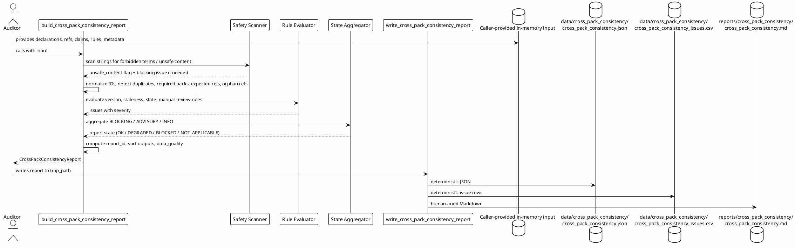

# SPEC-037-Local Research Cross-Pack Consistency Validator

## Background

MVP-33 introduced the Local Research Release Hardening / Consistency Audit, MVP-34 introduced the Local Research Evidence Traceability Matrix, and MVP-35 introduced the Local Research Audit Readiness Scorecard. Each MVP produces its own deterministic, human-audit research artifact from caller-provided in-memory declarations. As the number of local research packages grows, a human auditor needs a single, deterministic, local view that checks whether these independently-produced audit packages are mutually consistent: whether package IDs, versions, artifact references, section references, requirement references, and state labels agree across packages; whether one package claims completeness while another reports a blocking issue; and whether declared references are compatible without ever opening those referenced paths.

The **Local Research Cross-Pack Consistency Validator** (MVP-36) provides this cross-cutting audit layer. It consumes only caller-provided in-memory summaries and declared states from prior local audit packages. It does not inspect the live filesystem, import modules, or follow paths. It produces a deterministic, local, human-audit consistency report and CSV issue list that helps an auditor answer cross-pack consistency questions without claiming the project is safe, ready, or approved for trading.

MVP-36 remains explicitly **audit-only and local**. It is not a trading signal, not trade approval, not strategy approval, not execution approval, not portfolio approval, not universe approval, and not a production certification. It does not connect to Binance, exchanges, APIs, networks, live data, or real trading. It does not place orders, suggest orders, emit action commands, or create execution instructions. It does not produce or consume Freqtrade strategy classes. It does not start a server, daemon, scheduler, background loop, cron, database, Web UI, dashboard, or REST API. All data processed is either already-loaded in-memory declarations passed by the caller, or local string paths treated as opaque identifiers only.

## Requirements

### Must Have (M)

- **M1:** Provide a local cross-pack consistency package `src/hunter/cross_pack_consistency/` with a public API exported from `src/hunter/cross_pack_consistency/__init__.py`.
- **M2:** The validator is local-only and call-triggered; no server, no REST API, no Web UI, no dashboard, no daemon, no scheduler, no background loop, no cron, no database, no network calls, no exchange calls, no Binance, no Freqtrade import/runtime, no API keys, no live data, no real orders, no leverage, no shorting, no action commands, no trading signals, no approvals.
- **M3:** Models include frozen dataclasses: `CrossPackConsistencyInput`, `CrossPackDeclaration`, `CrossPackArtifactRef`, `CrossPackSectionRef`, `CrossPackRequirementRef`, `CrossPackStateClaim`, `CrossPackConsistencyRule`, `CrossPackConsistencyIssue`, `CrossPackConsistencyConfig`, `CrossPackConsistencyReport`, `CrossPackConsistencyDataQuality`, and `CrossPackConsistencySafetyFlags`.
- **M4:** Include a `CrossPackConsistencyState` enum with at least the following values: `OK`, `DEGRADED`, `BLOCKED`, `NOT_APPLICABLE`.
- **M5:** Include a `CrossPackConsistencyReasonCode` enum or string constant set consistent with the project pattern, with at least the following values: `OK`, `NOT_APPLICABLE`, `UNSAFE_CONTENT`, `FORBIDDEN_TERM_PRESENT`, `MISSING_REQUIRED_PACK`, `DUPLICATE_PACK_ID`, `DUPLICATE_ARTIFACT_ID`, `DUPLICATE_SECTION_ID`, `DUPLICATE_REQUIREMENT_ID`, `DUPLICATE_STATE_SUBJECT_ID`, `MISSING_EXPECTED_ARTIFACT_REF`, `MISSING_EXPECTED_SECTION_REF`, `MISSING_EXPECTED_REQUIREMENT_REF`, `ORPHAN_ARTIFACT_REF`, `ORPHAN_SECTION_REF`, `ORPHAN_REQUIREMENT_REF`, `INCOMPATIBLE_VERSION`, `STALE_PACK_DECLARATION`, `INCOMPATIBLE_STATE_COMBINATION`, `CONFLICTING_STATE_CLAIM`, `MISSING_MANUAL_REVIEW`, `UNKNOWN_UPSTREAM_STATE`, `HUMAN_RESEARCH_ONLY`, `NOT_TRADING_ADVICE`, `NO_PRODUCTION_READINESS`, `NO_FILE_INGESTION`, `NO_NETWORK_CONNECTION`, `NO_EXCHANGE_CONNECTION`, `NO_FREQTRADE_INPUT`, `NO_SCHEDULER`, `NO_DAEMON`, `NO_WEB_UI`, `NO_DATABASE`, `NO_ACTION_COMMANDS_EMITTED`.
- **M6:** Include a `CrossPackConsistencySeverity` enum with values `BLOCKING`, `ADVISORY`, and `INFO`.
- **M7:** Include a `CrossPackConsistencyIssueType` enum with values such as `MISSING_REQUIRED_PACK`, `INCOMPATIBLE_VERSION`, `STALE_DECLARATION`, `INCOMPATIBLE_STATE_COMBINATION`, `CONFLICTING_STATE`, `MISSING_EXPECTED_REF`, `ORPHAN_REF`, `MISSING_MANUAL_REVIEW`, `UNKNOWN_UPSTREAM_STATE`, `UNSAFE_CONTENT`, `DUPLICATE_ID`.
- **M8:** Include a `CrossPackConsistencyRuleType` enum with values such as `REQUIRED_PACK`, `EXPECTED_REF`, `COMPATIBLE_VERSION`, `STALE_DECLARATION`, `COMPATIBLE_STATE`, `CONFLICTING_STATE`, `MANUAL_REVIEW`, `UNKNOWN_STATE`.
- **M9:** `CrossPackConsistencyInput` must include `metadata: Mapping[str, str] = field(default_factory=dict)` and accept tuples of caller-provided declarations, artifact refs, section refs, requirement refs, state claims, and consistency rules.
- **M10:** The engine accepts caller-provided in-memory declarations only: `CrossPackDeclaration` objects (pack ID, version, title, description, declared state, ref ID lists, upstream IDs, generated_at, requires_manual_review); `CrossPackArtifactRef`, `CrossPackSectionRef`, `CrossPackRequirementRef` objects (ref ID, pack ID, opaque reference string, label, message, generated_at, requires_manual_review); `CrossPackStateClaim` objects (subject ID, state label, pack ID, message); `CrossPackConsistencyRule` objects (rule type, source pack ID, optional target pack ID, optional subject ID, severity, message). No arbitrary file reading, no path traversal, no file ingestion, no module import introspection by the engine.
- **M11:** The engine runs a deterministic set of local consistency checks: normalize IDs and detect duplicates; detect missing required packs via `REQUIRED_PACK` rules; detect missing expected refs via `EXPECTED_REF` rules; detect orphan refs; detect incompatible versions via `COMPATIBLE_VERSION` rules; detect stale pack declarations via `STALE_DECLARATION` rules using caller-provided `generated_at` and `config.staleness_threshold_seconds`; detect incompatible state combinations via `COMPATIBLE_STATE` rules (e.g., audit scorecard `OK` while release hardening is `BLOCKED`); detect conflicting state claims for the same subject ID via `CONFLICTING_STATE` rules; detect missing manual-review declarations via `MANUAL_REVIEW` rules; detect unknown upstream state values via `UNKNOWN_STATE` rules; classify each issue as `BLOCKING`, `ADVISORY`, or `INFO`.
- **M12:** The engine is fail-closed: unsafe content, missing required packs, duplicate IDs, and conflicting state claims produce `BLOCKED` results with clear reason codes. Missing required inputs produce `BLOCKED` or `DEGRADED` depending on severity, never a false `OK`.
- **M13:** The engine reports `DEGRADED` for advisory inconsistencies (e.g., stale declarations, missing optional refs, orphan refs, incompatible advisory state combinations).
- **M14:** The engine produces a `CrossPackConsistencyReport` containing stable sorted lists of `CrossPackConsistencyIssue` objects, a data-quality summary, safety flags, and aggregated reason codes.
- **M15:** The writer serializes the report to deterministic JSON, CSV issues, and Markdown, with atomic writes (temp file + fsync + `os.replace`).
- **M16:** Every output artifact and Markdown header includes an explicit research-only / not-trading-advice / not-certification notice.
- **M17:** The audit supports a fixed `generated_at` timestamp for deterministic testing and reproducible artifacts.
- **M18:** No arbitrary file ingestion in MVP-36. The validator only uses caller-provided in-memory declarations and the writer module. Artifact paths, section references, requirement references, and metadata are opaque strings; the engine never opens, follows, traverses, validates, fetches, or executes them.
- **M19:** Metadata and file-reference strings remain opaque local strings only; the validator never opens, follows, traverses, validates, fetches, or executes them.

### Should Have (S)

- **S1:** `CrossPackConsistencyConfig` exposes a `strict: bool` flag (default `False`). When `True`, any `DEGRADED` issue causes the overall report `state` to be `BLOCKED` with reason code `SAFETY_BLOCKED`. When `False`, `DEGRADED` issues make the overall report `DEGRADED` with reason code `CONSISTENCY_DEGRADED`, and `BLOCKED` issues still make it `BLOCKED`.
- **S2:** `CrossPackConsistencyInput` exposes a `generated_at: datetime | None` field for deterministic output. Defaults to current UTC only if not provided.
- **S3:** `CrossPackConsistencyReport` exposes a `reason_codes` tuple that aggregates all reason codes from individual issues, plus report-level reason codes such as `OK`, `CONSISTENCY_DEGRADED`, and `SAFETY_BLOCKED`.
- **S4:** The writer supports default local output directories: `data/cross_pack_consistency/cross_pack_consistency.json`, `data/cross_pack_consistency/cross_pack_consistency_issues.csv`, `reports/cross_pack_consistency/cross_pack_consistency.md`.
- **S5:** Inputs are immutable; the engine must not mutate caller-provided sequences, mappings, or dataclasses.
- **S6:** Model and engine tests are in-memory; writer tests use `tmp_path` only.
- **S7:** `CrossPackConsistencyReport` includes the original declarations, artifact refs, section refs, requirement refs, state claims, and rules so the single-argument writer can reconstruct all output sections.

### Could Have (C)

- **C1:** A `validate_input` function that checks a `CrossPackConsistencyInput` for duplicate IDs and missing required fields before running the engine.
- **C2:** Optional `notes` and `evidence` fields on each issue for human-readable audit context.
- **C3:** A CLI slash command `/cross-pack-consistency` that calls the engine with a caller/test-supplied default declaration map and writes artifacts. Only if it does not require a server or background process. The map must not be built by scanning the filesystem or importing modules at runtime.

### Will Not Have (W)

- **W1:** No production certification, release approval, or trading readiness sign-off.
- **W2:** No filesystem traversal, directory scanning, or arbitrary file ingestion.
- **W3:** No network calls, exchange APIs, Binance integration, or live data.
- **W4:** No new trading/research decision logic, strategy generation, or signal production.
- **W5:** No server, daemon, scheduler, background loop, cron, database, Web UI, dashboard, or REST API.
- **W6:** No leverage, shorting, order placement, execution instructions, or actionable recommendations.
- **W7:** No Freqtrade strategy import or runtime dependency.

## Method

The cross-pack consistency validator is a pure, deterministic function over caller-provided project declarations. It does not inspect the live filesystem, network, or any external state. The caller supplies a `CrossPackConsistencyInput` containing declarations, artifact references, section references, requirement references, state claims, and consistency rules. The engine normalizes IDs, runs consistency checks, and produces a report that flags cross-pack contradictions, missing links, duplicate references, stale references, incompatible status combinations, and items requiring manual review.

Artifact references, section references, requirement references, report references, package IDs, and metadata strings are **opaque local strings**. The engine never opens, follows, traverses, validates, fetches, or executes them. Timestamps are caller-provided and used only for comparison against caller-provided thresholds.

### Architecture overview

```text
┌─────────────────────────────────────────────────────────────────────┐
│                      Caller (trusted test harness)                  │
│  Provides in-memory:                                                │
│    - CrossPackConsistencyInput                                      │
│    - declarations, artifact_refs, section_refs, requirement_refs    │
│    - state_claims, rules, metadata                                  │
└─────────────────────────────────┬───────────────────────────────────┘
                                  │
                                  ▼
┌─────────────────────────────────────────────────────────────────────┐
│         src/hunter/cross_pack_consistency/engine.py                 │
│  - Validate input                                                   │
│  - Detect duplicate IDs                                             │
│  - Detect unsafe content                                            │
│  - Normalize IDs and versions                                       │
│  - Evaluate REQUIRED_PACK rules                                     │
│  - Evaluate EXPECTED_REF rules                                      │
│  - Evaluate COMPATIBLE_VERSION rules                                │
│  - Evaluate STALE_DECLARATION rules                                 │
│  - Evaluate COMPATIBLE_STATE rules                                  │
│  - Evaluate CONFLICTING_STATE rules                                 │
│  - Evaluate MANUAL_REVIEW rules                                     │
│  - Evaluate UNKNOWN_STATE rules                                     │
│  - Aggregate overall state, data quality, safety flags              │
└─────────────────────────────────┬───────────────────────────────────┘
                                  │
                                  ▼
┌─────────────────────────────────────────────────────────────────────┐
│         src/hunter/cross_pack_consistency/writer.py                 │
│  - cross_pack_consistency_report_to_dict                            │
│  - cross_pack_consistency_report_to_json_text                       │
│  - cross_pack_consistency_report_to_csv_text                        │
│  - cross_pack_consistency_report_to_markdown_text                   │
│  - atomic write helpers                                             │
└─────────────────────────────────────────────────────────────────────┘
```

```plantuml
@startuml
!theme plain
skinparam componentStyle rectangle

package "Caller" {
  [Test harness / local script] as Caller
}

package "hunter.cross_pack_consistency" {
  [models.py] as Models
  [engine.py] as Engine
  [writer.py] as Writer
  [__init__.py] as PublicAPI
}

package "Local filesystem" {
  [data/cross_pack_consistency/cross_pack_consistency.json] as JsonOut
  [data/cross_pack_consistency/cross_pack_consistency_issues.csv] as CsvOut
  [reports/cross_pack_consistency/cross_pack_consistency.md] as MdOut
}

Caller --> PublicAPI : in-memory declarations
PublicAPI --> Models : dataclasses/enums
PublicAPI --> Engine : build_cross_pack_consistency_report
Engine --> Models : populate report
PublicAPI --> Writer : write_cross_pack_consistency_report
Writer --> JsonOut : atomic write
Writer --> CsvOut : atomic write
Writer --> MdOut : atomic write

note right of Engine
  Never opens/follows/traverses/validates
  referenced paths or artifacts.
  Opaque strings only.
end note

note right of Writer
  Writes deterministic human-audit
  artifacts. No execution, no
  network, no trading signals.
end note
@enduml
```

### In-memory models

```python
from enum import Enum
from dataclasses import dataclass, field
from datetime import datetime
from typing import Mapping, Tuple

class CrossPackConsistencyState(Enum):
    """Normalized state of a cross-pack consistency report."""
    OK = "ok"
    DEGRADED = "degraded"
    BLOCKED = "blocked"
    NOT_APPLICABLE = "not_applicable"

class CrossPackConsistencySeverity(Enum):
    """Severity of a consistency issue."""
    BLOCKING = "blocking"
    ADVISORY = "advisory"
    INFO = "info"

class CrossPackConsistencyIssueType(Enum):
    """Type of consistency issue detected."""
    MISSING_REQUIRED_PACK = "missing_required_pack"
    INCOMPATIBLE_VERSION = "incompatible_version"
    STALE_DECLARATION = "stale_declaration"
    INCOMPATIBLE_STATE_COMBINATION = "incompatible_state_combination"
    CONFLICTING_STATE = "conflicting_state"
    MISSING_EXPECTED_REF = "missing_expected_ref"
    ORPHAN_REF = "orphan_ref"
    MISSING_MANUAL_REVIEW = "missing_manual_review"
    UNKNOWN_UPSTREAM_STATE = "unknown_upstream_state"
    UNSAFE_CONTENT = "unsafe_content"
    DUPLICATE_ID = "duplicate_id"

class CrossPackConsistencyRuleType(Enum):
    """Type of consistency rule to evaluate."""
    REQUIRED_PACK = "required_pack"
    EXPECTED_REF = "expected_ref"
    COMPATIBLE_VERSION = "compatible_version"
    STALE_DECLARATION = "stale_declaration"
    COMPATIBLE_STATE = "compatible_state"
    CONFLICTING_STATE = "conflicting_state"
    MANUAL_REVIEW = "manual_review"
    UNKNOWN_STATE = "unknown_state"

class CrossPackConsistencyReasonCode(Enum):
    """Reason codes for cross-pack consistency results and reports."""
    OK = "ok"
    NOT_APPLICABLE = "not_applicable"
    UNSAFE_CONTENT = "unsafe_content"
    FORBIDDEN_TERM_PRESENT = "forbidden_term_present"
    MISSING_REQUIRED_PACK = "missing_required_pack"
    DUPLICATE_PACK_ID = "duplicate_pack_id"
    DUPLICATE_ARTIFACT_ID = "duplicate_artifact_id"
    DUPLICATE_SECTION_ID = "duplicate_section_id"
    DUPLICATE_REQUIREMENT_ID = "duplicate_requirement_id"
    DUPLICATE_STATE_SUBJECT_ID = "duplicate_state_subject_id"
    MISSING_EXPECTED_ARTIFACT_REF = "missing_expected_artifact_ref"
    MISSING_EXPECTED_SECTION_REF = "missing_expected_section_ref"
    MISSING_EXPECTED_REQUIREMENT_REF = "missing_expected_requirement_ref"
    ORPHAN_ARTIFACT_REF = "orphan_artifact_ref"
    ORPHAN_SECTION_REF = "orphan_section_ref"
    ORPHAN_REQUIREMENT_REF = "orphan_requirement_ref"
    INCOMPATIBLE_VERSION = "incompatible_version"
    STALE_PACK_DECLARATION = "stale_pack_declaration"
    INCOMPATIBLE_STATE_COMBINATION = "incompatible_state_combination"
    CONFLICTING_STATE_CLAIM = "conflicting_state_claim"
    MISSING_MANUAL_REVIEW = "missing_manual_review"
    UNKNOWN_UPSTREAM_STATE = "unknown_upstream_state"
    HUMAN_RESEARCH_ONLY = "human_research_only"
    NOT_TRADING_ADVICE = "not_trading_advice"
    NO_PRODUCTION_READINESS = "no_production_readiness"
    NO_FILE_INGESTION = "no_file_ingestion"
    NO_NETWORK_CONNECTION = "no_network_connection"
    NO_EXCHANGE_CONNECTION = "no_exchange_connection"
    NO_FREQTRADE_INPUT = "no_freqtrade_input"
    NO_SCHEDULER = "no_scheduler"
    NO_DAEMON = "no_daemon"
    NO_WEB_UI = "no_web_ui"
    NO_DATABASE = "no_database"
    NO_ACTION_COMMANDS_EMITTED = "no_action_commands_emitted"

@dataclass(frozen=True, slots=True)
class CrossPackDeclaration:
    """A caller-provided declaration of a local audit/research pack."""
    pack_id: str
    version: str
    title: str = ""
    description: str = ""
    declared_state: str = ""
    artifact_ref_ids: Tuple[str, ...] = ()
    section_ref_ids: Tuple[str, ...] = ()
    requirement_ref_ids: Tuple[str, ...] = ()
    upstream_pack_ids: Tuple[str, ...] = ()
    generated_at: datetime | None = None
    requires_manual_review: bool = False

@dataclass(frozen=True, slots=True)
class CrossPackArtifactRef:
    """Opaque reference to an artifact produced by a prior pack."""
    ref_id: str
    pack_id: str
    reference: str
    label: str = ""
    message: str = ""
    generated_at: datetime | None = None
    requires_manual_review: bool = False

@dataclass(frozen=True, slots=True)
class CrossPackSectionRef:
    """Opaque reference to a section within a prior pack."""
    ref_id: str
    pack_id: str
    reference: str
    label: str = ""
    message: str = ""
    generated_at: datetime | None = None
    requires_manual_review: bool = False

@dataclass(frozen=True, slots=True)
class CrossPackRequirementRef:
    """Opaque reference to a requirement declared by a prior pack."""
    ref_id: str
    pack_id: str
    reference: str
    label: str = ""
    message: str = ""
    generated_at: datetime | None = None
    requires_manual_review: bool = False

@dataclass(frozen=True, slots=True)
class CrossPackStateClaim:
    """A state claim about a subject from a specific pack."""
    subject_id: str
    state_label: str
    pack_id: str
    message: str = ""

@dataclass(frozen=True, slots=True)
class CrossPackConsistencyRule:
    """A rule that declares a cross-pack consistency expectation."""
    rule_type: CrossPackConsistencyRuleType
    source_pack_id: str
    target_pack_id: str | None = None
    subject_id: str | None = None
    ref_kind: str | None = None
    ref_id: str | None = None
    expected_version: str | None = None
    expected_state: str | None = None
    forbidden_states: Tuple[str, ...] = ()
    severity: CrossPackConsistencySeverity = CrossPackConsistencySeverity.ADVISORY
    message: str = ""

@dataclass(frozen=True, slots=True)
class CrossPackConsistencyIssue:
    """A single cross-pack consistency issue."""
    issue_id: str
    issue_type: CrossPackConsistencyIssueType
    severity: CrossPackConsistencySeverity
    subject_id: str
    source_pack_id: str
    target_pack_id: str = ""
    reason_codes: Tuple[CrossPackConsistencyReasonCode, ...] = ()
    message: str = ""

@dataclass(frozen=True, slots=True)
class CrossPackConsistencyConfig:
    """Configuration for the cross-pack consistency validator."""
    project_version: str = ""
    staleness_threshold_seconds: int = 86400
    strict: bool = False
    forbidden_terms: Tuple[str, ...] = (
        "production ready",
        "trading ready",
        "live trading",
        "trade approval",
        "execute orders",
        "place orders",
        "buy signal",
        "sell signal",
        "go long",
        "go short",
        "certified",
        "production_ready",
        "live_trade",
        "real_order",
        "action_command",
        "go_live",
        "launch_live",
        "release_ready",
        "deployment_ready",
        "execution_ready",
        "strategy_ready",
        "api key",
        "binance",
        "freqtrade",
    )
    default_json_path: str = "data/cross_pack_consistency/cross_pack_consistency.json"
    default_csv_path: str = "data/cross_pack_consistency/cross_pack_consistency_issues.csv"
    default_markdown_path: str = "reports/cross_pack_consistency/cross_pack_consistency.md"
    required_pack_ids: Tuple[str, ...] = ()
    allowed_state_labels: Tuple[str, ...] = ()

@dataclass(frozen=True, slots=True)
class CrossPackConsistencyDataQuality:
    """Data quality summary for the cross-pack consistency report."""
    total_packs: int = 0
    total_artifact_refs: int = 0
    total_section_refs: int = 0
    total_requirement_refs: int = 0
    total_state_claims: int = 0
    total_rules: int = 0
    total_issues: int = 0
    blocking_issue_count: int = 0
    advisory_issue_count: int = 0
    info_issue_count: int = 0
    duplicate_id_count: int = 0
    orphan_ref_count: int = 0
    stale_declaration_count: int = 0
    sections_present: int = 0

@dataclass(frozen=True, slots=True)
class CrossPackConsistencySafetyFlags:
    """Safety flags confirming the validator stays within local audit boundaries."""
    has_unsafe_content: bool = False
    has_forbidden_terms: bool = False
    no_file_ingestion: bool = True
    no_network_connection: bool = True
    no_exchange_connection: bool = True
    no_freqtrade_input: bool = True
    no_scheduler: bool = True
    no_daemon: bool = True
    no_web_ui: bool = True
    no_database: bool = True
    no_action_commands_emitted: bool = True

    @property
    def is_safe(self) -> bool:
        """True when the report passes all safety boundary checks."""
        return (
            not self.has_unsafe_content
            and not self.has_forbidden_terms
            and self.no_file_ingestion
            and self.no_network_connection
            and self.no_exchange_connection
            and self.no_freqtrade_input
            and self.no_scheduler
            and self.no_daemon
            and self.no_web_ui
            and self.no_database
            and self.no_action_commands_emitted
        )

@dataclass(frozen=True, slots=True)
class CrossPackConsistencyInput:
    """Top-level input for the cross-pack consistency validator."""
    declarations: Tuple[CrossPackDeclaration, ...] = ()
    artifact_refs: Tuple[CrossPackArtifactRef, ...] = ()
    section_refs: Tuple[CrossPackSectionRef, ...] = ()
    requirement_refs: Tuple[CrossPackRequirementRef, ...] = ()
    state_claims: Tuple[CrossPackStateClaim, ...] = ()
    rules: Tuple[CrossPackConsistencyRule, ...] = ()
    metadata: Mapping[str, str] = field(default_factory=dict)
    generated_at: datetime | None = None
    config: CrossPackConsistencyConfig = field(default_factory=CrossPackConsistencyConfig)

@dataclass(frozen=True, slots=True)
class CrossPackConsistencyReport:
    """Deterministic cross-pack consistency report."""
    report_id: str
    generated_at: datetime
    state: CrossPackConsistencyState
    project_version: str
    declarations: Tuple[CrossPackDeclaration, ...]
    artifact_refs: Tuple[CrossPackArtifactRef, ...]
    section_refs: Tuple[CrossPackSectionRef, ...]
    requirement_refs: Tuple[CrossPackRequirementRef, ...]
    state_claims: Tuple[CrossPackStateClaim, ...]
    rules: Tuple[CrossPackConsistencyRule, ...]
    issues: Tuple[CrossPackConsistencyIssue, ...]
    data_quality: CrossPackConsistencyDataQuality
    safety_flags: CrossPackConsistencySafetyFlags
    reason_codes: Tuple[CrossPackConsistencyReasonCode, ...] = ()
    metadata: Mapping[str, str] = field(default_factory=dict)
    notes: str = ""

# Public functions ( signatures only; implementation described below )
# def build_cross_pack_consistency_report(
#     inp: CrossPackConsistencyInput,
# ) -> CrossPackConsistencyReport: ...
# def cross_pack_consistency_report_to_dict(report: CrossPackConsistencyReport) -> dict: ...
# def cross_pack_consistency_report_to_json_text(report: CrossPackConsistencyReport) -> str: ...
# def cross_pack_consistency_report_to_csv_text(report: CrossPackConsistencyReport) -> str: ...
# def cross_pack_consistency_report_to_markdown_text(report: CrossPackConsistencyReport) -> str: ...
# def write_cross_pack_consistency_report(
#     report: CrossPackConsistencyReport,
#     *,
#     json_path: object | str | None = _DEFAULT_PATH,
#     csv_path: object | str | None = _DEFAULT_PATH,
#     markdown_path: object | str | None = _DEFAULT_PATH,
# ) -> None: ...
```


### Engine behavior

The engine is a pure function `build_cross_pack_consistency_report(inp: CrossPackConsistencyInput) -> CrossPackConsistencyReport`. It receives only the caller-provided in-memory input and must never inspect the filesystem, import prior packages, or traverse any path or reference string.

Processing steps, in order:

1. **Normalize input IDs and state labels.** Convert every `pack_id`, `ref_id`, `subject_id`, and `rule_id` to a stable canonical form (strip leading/trailing whitespace, lower-case ASCII). Also strip and lower-case `declared_state` and `state_label` values for comparison purposes. All downstream lookups and comparisons use the normalized form. Fail-closed on the empty string after normalization for any required ID. The original strings may remain in the report for audit transparency.

2. **Validate safety of caller-provided text.** Scan `metadata`, `declarations.title`, `declarations.description`, `artifact_refs.label`, `section_refs.label`, `requirement_refs.label`, `state_claims.message`, `rules.message`, and `issues.message` (if any) for the configured `forbidden_terms`. The forbidden term matcher is a case-insensitive substring check. Terms are intentionally written as multi-word phrases (e.g. `"buy signal"`, `"execute orders"`) to avoid false positives on legitimate research language such as "threshold", "along", "border", "order of operations", or "position sizing". If a forbidden term appears, mark `has_forbidden_terms = True` and emit a `BLOCKING` unsafe-content issue. If any value is not a safe string type (e.g., bytes or object), mark `has_unsafe_content = True` and emit a `BLOCKING` unsafe-content issue. These checks run before any other work so unsafe input cannot be masked by later logic.

3. **Detect duplicate IDs.** If any `pack_id`, `ref_id` within a ref kind, or `subject_id` appears more than once across the same category, emit a `DUPLICATE_ID` issue. Duplicate pack IDs are `BLOCKING`. Duplicate refs within the same kind are `ADVISORY`. Duplicate state claims for the same `subject_id` are resolved later as `CONFLICTING_STATE` rather than duplicate.

4. **Validate required packs.** For each `pack_id` in `config.required_pack_ids`, emit a `MISSING_REQUIRED_PACK` issue if the pack is not present in `declarations`. Severity is `BLOCKING`.

5. **Validate expected refs.** For each declaration, if `artifact_ref_ids`, `section_ref_ids`, or `requirement_ref_ids` are provided, emit a `MISSING_EXPECTED_REF` issue of the matching kind for every ref that does not exist in the corresponding ref collection. Severity is `ADVISORY`.

6. **Validate orphan refs.** For each artifact, section, and requirement ref, if `pack_id` is not a known declaration, emit an `ORPHAN_REF` issue of the matching kind. Severity is `ADVISORY`.

7. **Validate version compatibility.** For each rule of type `COMPATIBLE_VERSION`, compare the source pack version to the target pack version or `expected_version`. If not equal (or not semver-compatible when a semver helper is available), emit an `INCOMPATIBLE_VERSION` issue. Severity is the rule's own severity.

8. **Validate staleness.** For each declaration with a non-None `generated_at`, if `generated_at < report.generated_at - timedelta(seconds=config.staleness_threshold_seconds)`, emit a `STALE_DECLARATION` issue. Severity is `ADVISORY`. Staleness is based only on caller-provided timestamps; the engine never checks file modification times.

9. **Validate state combinations.** For each rule of type `COMPATIBLE_STATE`, if the source pack's `declared_state` and the target pack's `declared_state` (or the claim for `subject_id`) match a forbidden combination, emit an `INCOMPATIBLE_STATE_COMBINATION` issue. Example forbidden combinations include:
   - `audit_scorecard` declared `OK` while `release_hardening` declared `BLOCKED`.
   - `audit_scorecard` declared `COMPLETE` while `evidence_traceability` declared `MISSING` or `BLOCKED`.
   - `final_audit_pack` declared `COMPLETE` while a required section ref is missing.
   Severity is the rule's own severity.

10. **Detect conflicting state claims.** For each `subject_id` that appears in more than one `CrossPackStateClaim`, emit a `CONFLICTING_STATE` issue if the `state_label` values differ. If `config.allowed_state_labels` is non-empty, also emit an `UNKNOWN_UPSTREAM_STATE` issue for any claim `state_label` not in the allowed set. Severity is `ADVISORY`.

11. **Detect missing manual-review declarations.** For each declaration with `requires_manual_review=True` where no caller-provided note or manual-review state claim exists, emit a `MISSING_MANUAL_REVIEW` issue. Severity is `ADVISORY`.

12. **Evaluate explicit rules.** For each caller-provided `CrossPackConsistencyRule`, the engine emits the appropriate issue type when the rule condition fails. If the rule passes, no issue is emitted. The rules used by this step are limited to the rule-driven category described below. Rules do not duplicate the built-in checks; when both a built-in check and an explicit rule would produce the same issue, only one issue is retained.

### Built-in checks, always run

These run regardless of caller-provided rules:

1. duplicate ID detection
2. unsafe content scan
3. required pack presence via `config.required_pack_ids`
4. expected ref presence via declaration expected artifact/section/requirement IDs
5. orphan ref detection
6. staleness via `config.staleness_threshold_seconds`
7. conflicting state claims for same `subject_id`
8. unknown upstream state via `config.allowed_state_labels`
9. missing manual review for declarations with `requires_manual_review=True`

### Rule-driven checks, only run when rules are provided

These run only for matching `CrossPackConsistencyRule` objects:

1. `COMPATIBLE_VERSION`
2. `COMPATIBLE_STATE`
3. `MANUAL_REVIEW`
4. `CONFLICTING_STATE`

`REQUIRED_PACK`, `EXPECTED_REF`, and `STALE_DECLARATION` rule types are supported for explicit per-pack assertions. If a built-in check and a rule-driven check emit the same issue for the same subject, only one issue is retained. Deduplicate by deterministic issue content hash. Rules never cause path/artifact/report refs to be opened or validated.

13. **Aggregate overall state.**
    - If `safety_flags.has_unsafe_content` or `safety_flags.has_forbidden_terms` is `True`, set `state = BLOCKED`.
    - Else if any issue has `severity == BLOCKING`, set `state = BLOCKED`.
    - Else if any issue has `severity == ADVISORY`, set `state = DEGRADED`.
    - Else if all declarations are `NOT_APPLICABLE` or input is empty, set `state = NOT_APPLICABLE`.
    - Else set `state = OK`.
    - If `config.strict` is `True` and the computed state would be `DEGRADED`, promote it to `BLOCKED`.

14. **Compute data quality.** Populate `CrossPackConsistencyDataQuality` with exact counts from the input and the generated issue list. `sections_present` counts the number of distinct `section_ref_ids` declared across packs.

15. **Generate deterministic issue IDs.** Each issue is assigned an `issue_id` before the report is finalized. The ID is the first 16 hex characters of the SHA-256 digest of a single normalized pipe-delimited string:

    ```text
    issue_id = sha256(
        f"{issue_type.value}|{severity.value}|{normalized_subject_id}|"
        f"{normalized_source_pack_id}|{normalized_target_pack_id}|"
        f"{sorted_reason_codes}|{normalized_message}"
    ).hexdigest()[:16]
    ```

    `sorted_reason_codes` is the comma-joined sorted `.value` of the issue's `reason_codes`. Normalized fields use the same stripping and lower-casing as step 1. This guarantees identical issues produce identical `issue_id` values across runs. If two issues hash to the same ID or have identical normalized content, only one is retained. The CSV `issue_id` column is therefore reproducible.

16. **Compute `report_id`.** Resolve `project_version` in this order: `CrossPackConsistencyInput.project_version` if present and non-empty, otherwise `CrossPackConsistencyConfig.project_version`, otherwise the empty string. The report ID is the hex-encoded SHA-256 digest of a canonical JSON blob built from the sorted normalized pack IDs, sorted ref IDs, sorted subject IDs, sorted rule IDs, the resolved `project_version`, and the `generated_at` ISO-8601 string. The JSON must use deterministic key order and serialize enums and dataclasses as strings. This guarantees that identical caller-provided inputs produce identical `report_id` values across runs.

17. **Sort all output tuples.** Every tuple in the report (`declarations`, `artifact_refs`, `section_refs`, `requirement_refs`, `state_claims`, `rules`, `issues`, `reason_codes`) is sorted by a stable primary key (issue ID, ref ID, subject ID, pack ID, or rule ID) so diff-comparison and reproducible hashing are stable.



### Writer behavior

The writer module lives at `src/hunter/cross_pack_consistency/writer.py` and exposes single-argument functions plus a multi-artifact writer. It only writes in-memory report data to local files; it never opens, follows, validates, fetches, or executes any referenced path.

Functions:

- `cross_pack_consistency_report_to_dict(report) -> dict`
- `cross_pack_consistency_report_to_json_text(report) -> str`
- `cross_pack_consistency_report_to_csv_text(report) -> str`
- `cross_pack_consistency_report_to_markdown_text(report) -> str`
- `write_cross_pack_consistency_report(report, *, json_path=_DEFAULT_PATH, csv_path=_DEFAULT_PATH, markdown_path=_DEFAULT_PATH) -> None`
- `atomic_write_json_cross_pack_consistency_report(report, path) -> None`
- `atomic_write_csv_cross_pack_consistency_report(report, path) -> None`
- `atomic_write_markdown_cross_pack_consistency_report(report, path) -> None`

The `_DEFAULT_PATH` sentinel is a private `object()`. When a path argument is omitted, the writer uses the module-level constants `DEFAULT_JSON_PATH`, `DEFAULT_CSV_PATH`, and `DEFAULT_MARKDOWN_PATH`. When `None` is passed, that artifact is skipped. When an explicit string path is passed, only that artifact is written to that path. Parent directories are created as needed. The writer never reads from `report.config`; the report does not contain a `config` field.

CSV columns, in order:

1. `report_id`
2. `generated_at`
3. `issue_id`
4. `issue_type`
5. `severity`
6. `subject_id`
7. `source_pack_id`
8. `target_pack_id`
9. `reason_codes`
10. `message`

Rows are derived from `report.issues` and sorted deterministically. The CSV must include a header row.

Markdown must include:
- An `#` H1 title: "Local Research Cross-Pack Consistency Validator Report".
- An immediate audit-only/research-only safety notice at the top, in a block quote, stating that the report is a local human-audit artifact only and is not an approval, certification, production-readiness assessment, trading-readiness assessment, recommendation, suitability assessment, or signal.
- A summary section with report ID, generated timestamp, state, and counts.
- A declarations section listing each pack and its declared state.
- A consistency issues section with a table of all issues.
- A state claims section if any cross-pack state claims were provided.
- A data quality section.
- A safety flags section.
- A manual review section if any declaration or issue requires manual review.
- A notes section if the report contains notes.
- No actionable order, execution, trading, or live-operation instructions outside of negative safety disclaimers.

JSON output must be deterministic, with stable key order, enums serialized to their string values, dataclasses recursively serialized as mappings, and `datetime` objects serialized as ISO-8601 strings.

### Deterministic IDs and order

All identifiers are normalized before use. The engine stores the original caller-provided string but computes normalized lookup keys. The canonical normalization function is:

1. Strip leading and trailing whitespace.
2. Convert ASCII letters to lower case.
3. Replace internal whitespace runs with a single underscore.
4. Reject the empty string for required IDs.

The `report_id` is computed from a canonical JSON digest of the sorted normalized IDs and timestamps. Enums are serialized as their `.value`. Dataclasses are serialized as dictionaries with their fields in declaration order. `datetime` values are serialized as `datetime.isoformat()`. The resulting JSON is encoded as UTF-8 and hashed with SHA-256.

All output tuples are sorted using a tuple of `(normalized primary key, original primary key)` to ensure deterministic order even when two distinct original IDs normalize to the same key (which is treated as a duplicate and also emits a duplicate-ID issue).

### Consistency rule semantics

Rules are caller-provided expectations. Each rule has a `rule_type` that determines the check performed:

- `REQUIRED_PACK`: source pack must be present.
- `EXPECTED_REF`: source pack must declare the referenced ref kind/id.
- `COMPATIBLE_VERSION`: source pack version must match `expected_version` or target pack version.
- `STALE_DECLARATION`: source pack `generated_at` must be within the staleness threshold.
- `COMPATIBLE_STATE`: source pack state and target pack state (or `subject_id` claim) must not match any of `forbidden_states`.
- `CONFLICTING_STATE`: source pack `subject_id` claims must not differ across packs.
- `MANUAL_REVIEW`: source pack must have a manual-review declaration or claim.
- `UNKNOWN_STATE`: source pack `state_label` must be in `config.allowed_state_labels`.

If a rule's condition is satisfied, no issue is emitted. If it fails, the engine emits an issue of the matching type using the rule's `severity`. If the rule's `target_pack_id` is `None`, the rule applies only to the source pack. If `subject_id` is `None`, the rule applies to the pack's `declared_state`.

### Data quality

`CrossPackConsistencyDataQuality` summarizes the input and findings. It is a pure count; it does not interpret safety or correctness. The writer serializes it in JSON and Markdown. Key counts:

- `total_packs`: number of `CrossPackDeclaration` inputs.
- `total_artifact_refs`: number of artifact refs.
- `total_section_refs`: number of section refs.
- `total_requirement_refs`: number of requirement refs.
- `total_state_claims`: number of state claims.
- `total_rules`: number of explicit rules.
- `total_issues`: total issues generated.
- `blocking_issue_count`, `advisory_issue_count`, `info_issue_count`: issue counts by severity.
- `duplicate_id_count`: number of duplicate-ID issues.
- `orphan_ref_count`: number of orphan-ref issues.
- `stale_declaration_count`: number of stale-declaration issues.
- `sections_present`: number of distinct section refs.

### Safety flags

`CrossPackConsistencySafetyFlags` mirrors the safety posture of the validator. All flags default to the safe state. The engine sets `has_unsafe_content` or `has_forbidden_terms` to `True` if unsafe input is detected. The writer includes these flags in JSON and Markdown. The `is_safe` property is a convenience; the report `state` is authoritative.

### Failure semantics

The engine fails-closed in the following cases:

- **Unsafe or forbidden content:** produces a `BLOCKING` issue and report `state = BLOCKED`.
- **Duplicate required pack IDs:** `BLOCKING`.
- **Missing required pack IDs:** `BLOCKING`.
- **Unknown upstream state values:** `ADVISORY` (unless configured otherwise).
- **Conflicting state claims:** `ADVISORY`.
- **Incompatible version/state combinations:** severity from the rule; default `ADVISORY`.
- **Missing manual review:** `ADVISORY`.
- **Stale declarations:** `ADVISORY`.
- **Missing expected refs:** `ADVISORY`.
- **Orphan refs:** `ADVISORY`.
- **Empty input:** report state is `NOT_APPLICABLE` and data quality counts are all zero.
- **Strict mode:** any `DEGRADED` or `BLOCKED` state is promoted to `BLOCKED`.

The engine never raises exceptions for validation failures. It always returns a `CrossPackConsistencyReport` with `state` and `issues` populated. Exceptions are reserved for programming errors and invalid enum usage.

### Explicit statement on opaque references

All `reference`, `artifact_ref_ids`, `section_ref_ids`, `requirement_ref_ids`, `metadata`, and `message` values are opaque strings. They are accepted from the caller, stored in the report, and serialized into the output artifacts. The engine and writer never interpret them as filesystem paths, URLs, Python import names, or executable identifiers. They are never opened, followed, traversed, validated, fetched, or executed. Human auditors are responsible for manually reviewing the real-world objects these strings refer to.

## Implementation

Proposed implementation steps:

1. **Models and engine (Step 1)**
   - Create `src/hunter/cross_pack_consistency/models.py` with all enums and dataclasses.
   - Create `src/hunter/cross_pack_consistency/engine.py` with `build_cross_pack_consistency_report` and internal validation helpers.
   - Add `src/hunter/cross_pack_consistency/__init__.py` with public exports.
   - Add focused tests in `tests/test_cross_pack_consistency/test_models.py` and `tests/test_cross_pack_consistency/test_engine.py`.

2. **Writer (Step 2)**
   - Create `src/hunter/cross_pack_consistency/writer.py` with dict, JSON, CSV, Markdown, and atomic write helpers.
   - Add focused tests in `tests/test_cross_pack_consistency/test_writer.py`.

3. **Integration tests (Step 3)**
   - Create `tests/test_cross_pack_consistency/test_integration.py` with 10-14 end-to-end tests covering the scenarios listed below.

4. **Finalization (Step 4)**
   - Update `src/hunter/__init__.py` to `0.36.0-dev`.
   - Update `CHANGELOG.md` with the MVP-36 entry.
   - Update `tasks/active.md` to mark MVP-36 complete.
   - Run full test suite and tag `v0.36.0-dev`.

No filesystem ingestion, network calls, exchange connections, Freqtrade imports, or real trading operations may be added at any step.

## Milestones

| Milestone | Deliverable | Exit Criteria |
|---|---|---|
| M1 | Models and public API | `test_models.py` passes; all enums and dataclasses importable. |
| M2 | Engine | `test_engine.py` passes; deterministic `report_id`, state aggregation, all failure semantics covered. |
| M3 | Writer | `test_writer.py` passes; JSON/CSV/Markdown deterministic and safe. |
| M4 | Integration | `test_integration.py` passes; end-to-end scenarios covered. |
| M5 | Finalization | Version bumped to `0.36.0-dev`, CHANGELOG and tasks updated, full suite passes. |

## Gathering Results

After implementation, the following results should be gathered:

- `pytest tests/test_cross_pack_consistency -q --import-mode=importlib` passes.
- `pytest -q --import-mode=importlib` full suite passes with no regressions.
- The generated `cross_pack_consistency.json` is deterministic and parseable.
- The generated `cross_pack_consistency_issues.csv` contains one row per issue with the required columns.
- The generated `cross_pack_consistency.md` starts with the required H1 and safety notice and contains no actionable trading/execution language.
- A human auditor can use the report to identify cross-pack contradictions without opening any referenced artifact paths.

## Need Professional Help in Developing Your Architecture?

Please contact me at [sammuti.com](https://sammuti.com) :)

