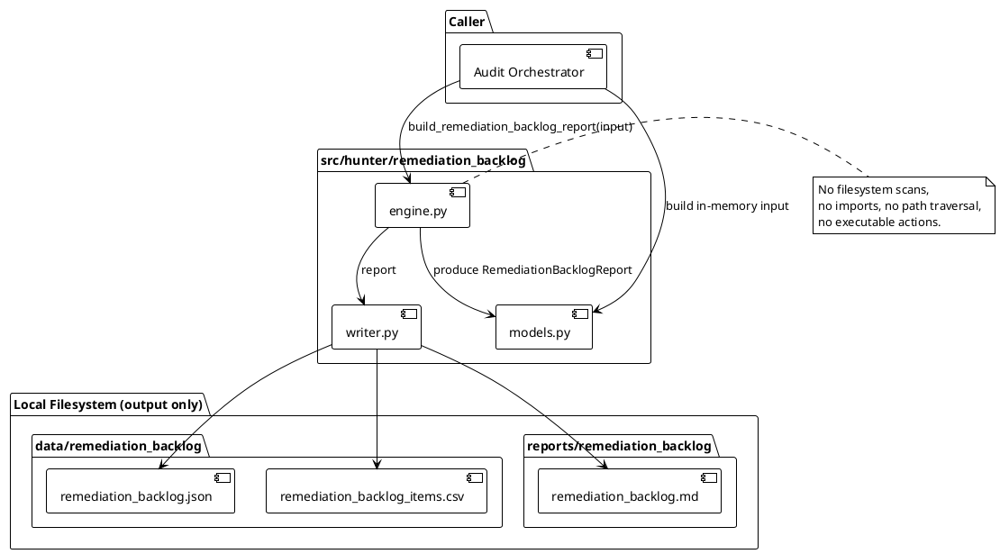
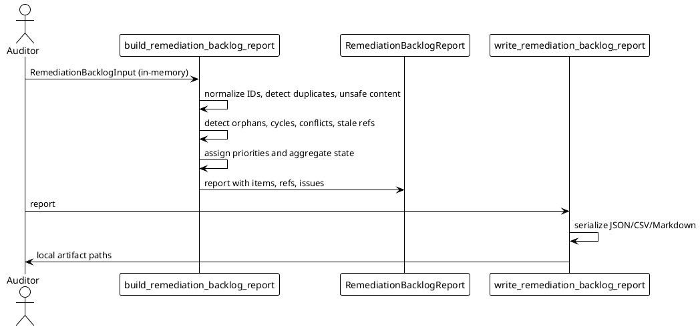

# SPEC-038-Local Research Remediation Backlog Planner

## Background

The Hunter Futures Pro research framework produces a growing set of local, audit-only artifacts across each MVP (release-hardening consistency checks, evidence traceability matrices, audit readiness scorecards, cross-pack consistency reports, etc.). Each artifact can surface issues, findings, or check failures that need to be triaged by a human auditor before any downstream work is considered.

MVP-37 introduces the **Local Research Remediation Backlog Planner**. It is a deterministic, caller-provided, in-memory planning tool that converts audit issues, findings, and check summaries into a human-review backlog. The planner never performs remediation, never emits executable actions, and never claims that any item is approved, deployable, production-ready, or trading-ready. Its sole purpose is to help a human auditor decide what to review next and in what order.

## Requirements

### Must Have

- A new package `src/hunter/remediation_backlog/` implementing the planner.
- Caller-provided in-memory input only; no filesystem scans, no imports, no path traversal, no opening of artifact/report references, and no validation of referenced paths.
- Deterministic `report_id` and deterministic backlog item IDs (when not caller-provided).
- Detection of duplicate source/finding/item/dependency IDs.
- Detection of duplicate backlog items by deterministic content hash.
- Detection of missing required source refs, orphan finding refs, orphan dependencies, dependency cycles, conflicting item states, stale refs, and missing owner/reviewer/manual-review metadata.
- Classification of backlog items into `OPEN`, `ACKNOWLEDGED`, `BLOCKED`, `DEFERRED`, `DUPLICATE`, `CONFLICTING`, and `NOT_APPLICABLE`.
- Severity classification: `BLOCKING`, `ADVISORY`, `INFO`.
- Deterministic priority classification: `P0`, `P1`, `P2`, `P3`, `NONE` for human-review ordering only.
- Aggregate report state: `OK`, `DEGRADED`, `BLOCKED`, or `NOT_APPLICABLE` with strict-mode promotion of `DEGRADED` to `BLOCKED`.
- Unsafe-content and forbidden-term scanning with fail-closed behavior.
- JSON/CSV/Markdown writer outputs under `data/remediation_backlog/` and `reports/remediation_backlog/`.
- Immediate research-only/audit-only safety notice in Markdown.

### Should Have

- PlantUML component and sequence diagrams.
- Explicit data-quality counters on the report.
- Configurable staleness threshold, owner/reviewer requirements, and strict mode.
- Support for item dependencies (`BLOCKS`, `DEPENDS_ON`, `RELATED_TO`).
- Support for acknowledgements that reclassify items as `ACKNOWLEDGED`.

### Could Have

- Optional `subject_id` on items to detect conflicts without relying on `source_id`/`finding_id`.
- Optional `notes` field on the report for human auditor comments.

### Will Not Have

- Live trading, order generation, or execution semantics.
- Exchange/Binance/API/network access.
- Freqtrade strategy/import/runtime integration.
- Leverage/shorting execution.
- Web UI, dashboard, server, database, scheduler, or daemon.
- Actionable buy/sell/hold signals or recommendations.
- Approval, certification, production-readiness, or trading-readiness claims.
- Automated remediation actions, shell commands, code patches, or infrastructure changes.
- Executable remediation plans in any output.

## Method

### Architecture Overview

The planner is a three-stage local pipeline:

1. **Input**: Caller builds `RemediationBacklogInput` from in-memory audit findings, refs, dependencies, and acknowledgements.
2. **Engine**: `build_remediation_backlog_report(input)` validates, deduplicates, classifies, detects cycles/conflicts/staleness, assigns deterministic priorities, and produces a `RemediationBacklogReport`.
3. **Writer**: Single-argument writer functions serialize the report to deterministic JSON, CSV, and Markdown artifacts.

No stage opens, follows, traverses, validates, fetches, or executes any path or reference string. References are opaque.

### PlantUML Component Diagram



### PlantUML Sequence Diagram



### In-Memory Models

All models are frozen dataclasses with `__slots__`. Lists passed by callers are normalized to sorted tuples in `__post_init__`. IDs are normalized to lowercase, stripped strings. All reference/path strings are opaque.

```python
from __future__ import annotations

from dataclasses import dataclass, field
from datetime import datetime, timedelta, timezone
from typing import Mapping, Optional, Tuple
from enum import Enum


class RemediationBacklogState(Enum):
    OK = "ok"
    DEGRADED = "degraded"
    BLOCKED = "blocked"
    NOT_APPLICABLE = "not_applicable"


class RemediationBacklogSeverity(Enum):
    BLOCKING = "blocking"
    ADVISORY = "advisory"
    INFO = "info"


class RemediationBacklogPriority(Enum):
    P0 = "p0"
    P1 = "p1"
    P2 = "p2"
    P3 = "p3"
    NONE = "none"


class RemediationBacklogItemState(Enum):
    OPEN = "open"
    ACKNOWLEDGED = "acknowledged"
    BLOCKED = "blocked"
    DEFERRED = "deferred"
    DUPLICATE = "duplicate"
    CONFLICTING = "conflicting"
    NOT_APPLICABLE = "not_applicable"


class RemediationBacklogItemType(Enum):
    MANUAL_REVIEW = "manual_review"
    MISSING_REF = "missing_ref"
    STALE_REF = "stale_ref"
    ORPHAN_REF = "orphan_ref"
    CONFLICTING_STATE = "conflicting_state"
    INCOMPATIBLE_VERSION = "incompatible_version"
    INCOMPATIBLE_STATE = "incompatible_state"
    UNSAFE_CONTENT = "unsafe_content"
    DUPLICATE_ITEM = "duplicate_item"
    DUPLICATE_ID = "duplicate_id"
    DEPENDENCY_CYCLE = "dependency_cycle"
    MISSING_OWNER = "missing_owner"
    MISSING_REVIEWER = "missing_reviewer"
    MISSING_MANUAL_REVIEW = "missing_manual_review"
    REQUIRED_SOURCE = "required_source"
    UNKNOWN_STATE = "unknown_state"
    ACKNOWLEDGED_ITEM = "acknowledged_item"


class RemediationBacklogReasonCode(Enum):
    OK = "ok"
    NOT_APPLICABLE = "not_applicable"
    CONSISTENCY_DEGRADED = "consistency_degraded"
    SAFETY_BLOCKED = "safety_blocked"
    UNSAFE_CONTENT = "unsafe_content"
    FORBIDDEN_TERM_PRESENT = "forbidden_term_present"
    MISSING_REQUIRED_SOURCE = "missing_required_source"
    ORPHAN_FINDING_REF = "orphan_finding_ref"
    ORPHAN_DEPENDENCY = "orphan_dependency"
    DEPENDENCY_CYCLE = "dependency_cycle"
    CONFLICTING_ITEM_STATE = "conflicting_item_state"
    DUPLICATE_ID = "duplicate_id"
    DUPLICATE_ITEM = "duplicate_item"
    STALE_SOURCE_REF = "stale_source_ref"
    STALE_FINDING_REF = "stale_finding_ref"
    MISSING_OWNER = "missing_owner"
    MISSING_REVIEWER = "missing_reviewer"
    MISSING_MANUAL_REVIEW = "missing_manual_review"
    ACKNOWLEDGED_ITEM = "acknowledged_item"


class RemediationDependencyType(Enum):
    BLOCKS = "blocks"
    DEPENDS_ON = "depends_on"
    RELATED_TO = "related_to"


# Forbidden-term matcher uses case-insensitive substring search against
# caller-provided metadata and all textual fields in refs/items/dependencies.
# All entries MUST be multi-word phrases. Single-word terms are intentionally
# excluded because they produce false positives in benign audit text (e.g.
# "pending approval from security team", "certification body", "no recommendation
# needed", "signal processing", "no signal detected"). Phrases that express an
# unsafe intent are included instead.
FORBIDDEN_REMEDIATION_BACKLOG_TERMS = frozenset({
    "actionable recommendation",
    "actionable signal",
    "approved for production",
    "approved for release",
    "approved for trading",
    "automated remediation",
    "auto fix",
    "auto patch",
    "buy now",
    "buy signal",
    "certified for production",
    "certified for trading",
    "deploy immediately",
    "deploy now",
    "execute orders",
    "execute remediation",
    "go long",
    "go short",
    "hold signal",
    "investment recommendation",
    "investment suitability",
    "live trade",
    "live trading",
    "place orders",
    "production certification",
    "production ready",
    "production readiness",
    "sell now",
    "sell signal",
    "suitable for production",
    "suitable for trading",
    "trade recommendation",
    "trade signal",
    "trading certification",
    "trading ready",
    "trading readiness",
    "trading suitability",
})


@dataclass(frozen=True, slots=True)
class RemediationBacklogSafetyFlags:
    no_executable_actions: bool = True
    no_trading_instructions: bool = True
    no_approval_claims: bool = True
    no_automated_remediation: bool = True
    references_opaque: bool = True
    has_unsafe_content: bool = False
    has_forbidden_terms: bool = False
    feedback_into_execution: bool = False

    def __post_init__(self):
        if any(
            not getattr(self, flag, True)
            for flag in (
                "no_executable_actions",
                "no_trading_instructions",
                "no_approval_claims",
                "no_automated_remediation",
                "references_opaque",
            )
        ):
            raise ValueError("safety flag positive invariants must remain True")

    @property
    def is_safe(self) -> bool:
        return not (
            self.has_unsafe_content
            or self.has_forbidden_terms
            or self.feedback_into_execution
        )


@dataclass(frozen=True, slots=True)
class RemediationBacklogConfig:
    strict: bool = False
    require_owner: bool = False
    require_reviewer: bool = False
    require_manual_review: bool = False
    staleness_threshold_seconds: int = 86400
    allowed_item_states: Tuple[str, ...] = field(default_factory=tuple)
    required_source_ids: Tuple[str, ...] = field(default_factory=tuple)

    def __post_init__(self):
        if self.staleness_threshold_seconds < 0:
            raise ValueError("staleness_threshold_seconds must be non-negative")


@dataclass(frozen=True, slots=True)
class RemediationSourceRef:
    source_id: str
    source_type: str = ""
    reference: str = ""  # opaque path/report/artifact string
    label: str = ""
    generated_at: Optional[datetime] = None
    metadata: Mapping[str, str] = field(default_factory=dict)

    def __post_init__(self):
        if self.generated_at is not None and self.generated_at.tzinfo is None:
            raise ValueError("generated_at must be timezone-aware")


@dataclass(frozen=True, slots=True)
class RemediationFindingRef:
    finding_id: str
    source_id: str = ""
    reference: str = ""  # opaque path/report/artifact string
    label: str = ""
    generated_at: Optional[datetime] = None
    metadata: Mapping[str, str] = field(default_factory=dict)

    def __post_init__(self):
        if self.generated_at is not None and self.generated_at.tzinfo is None:
            raise ValueError("generated_at must be timezone-aware")


@dataclass(frozen=True, slots=True)
class RemediationBacklogItem:
    item_id: Optional[str] = None
    subject_id: Optional[str] = None
    source_id: Optional[str] = None
    finding_id: Optional[str] = None
    item_type: RemediationBacklogItemType = RemediationBacklogItemType.MANUAL_REVIEW
    item_state: RemediationBacklogItemState = RemediationBacklogItemState.OPEN
    severity: RemediationBacklogSeverity = RemediationBacklogSeverity.ADVISORY
    priority: RemediationBacklogPriority = RemediationBacklogPriority.NONE
    title: str = ""
    description: str = ""
    owner: Optional[str] = None
    reviewer: Optional[str] = None
    generated_at: Optional[datetime] = None
    reason_codes: Tuple[RemediationBacklogReasonCode, ...] = field(default_factory=tuple)
    metadata: Mapping[str, str] = field(default_factory=dict)

    def __post_init__(self):
        if self.generated_at is not None and self.generated_at.tzinfo is None:
            raise ValueError("generated_at must be timezone-aware")


@dataclass(frozen=True, slots=True)
class RemediationDependency:
    dependency_id: str
    source_item_id: str
    target_item_id: str
    dependency_type: RemediationDependencyType = RemediationDependencyType.RELATED_TO
    generated_at: Optional[datetime] = None
    metadata: Mapping[str, str] = field(default_factory=dict)

    def __post_init__(self):
        if self.generated_at is not None and self.generated_at.tzinfo is None:
            raise ValueError("generated_at must be timezone-aware")


@dataclass(frozen=True, slots=True)
class RemediationAcknowledgement:
    acknowledgement_id: str
    item_id: str
    acknowledged_by: Optional[str] = None
    acknowledged_at: Optional[datetime] = None
    note: str = ""
    metadata: Mapping[str, str] = field(default_factory=dict)

    def __post_init__(self):
        if self.acknowledged_at is not None and self.acknowledged_at.tzinfo is None:
            raise ValueError("acknowledged_at must be timezone-aware")


@dataclass(frozen=True, slots=True)
class RemediationBacklogDataQuality:
    total_sources: int = 0
    total_findings: int = 0
    total_backlog_items: int = 0
    total_dependencies: int = 0
    total_acknowledgements: int = 0
    total_issues: int = 0
    duplicate_id_count: int = 0
    duplicate_item_count: int = 0
    orphan_finding_count: int = 0
    orphan_dependency_count: int = 0
    cycle_count: int = 0
    conflicting_item_count: int = 0
    stale_source_count: int = 0
    stale_finding_count: int = 0
    missing_owner_count: int = 0
    missing_reviewer_count: int = 0
    missing_manual_review_count: int = 0
    unsafe_content_count: int = 0
    forbidden_term_count: int = 0
    sections_present: int = 0


@dataclass(frozen=True, slots=True)
class RemediationBacklogInput:
    source_refs: Tuple[RemediationSourceRef, ...] = field(default_factory=tuple)
    finding_refs: Tuple[RemediationFindingRef, ...] = field(default_factory=tuple)
    backlog_items: Tuple[RemediationBacklogItem, ...] = field(default_factory=tuple)
    dependencies: Tuple[RemediationDependency, ...] = field(default_factory=tuple)
    acknowledgements: Tuple[RemediationAcknowledgement, ...] = field(default_factory=tuple)
    config: RemediationBacklogConfig = field(default_factory=RemediationBacklogConfig)
    metadata: Mapping[str, str] = field(default_factory=dict)
    generated_at: datetime = field(default_factory=lambda: datetime.now(timezone.utc))
    project_version: str = "0.37.0-dev"

    def __post_init__(self):
        if self.generated_at.tzinfo is None:
            raise ValueError("generated_at must be timezone-aware")


@dataclass(frozen=True, slots=True)
class RemediationBacklogReport:
    report_id: str
    generated_at: datetime
    state: RemediationBacklogState
    reason_codes: Tuple[RemediationBacklogReasonCode, ...]
    project_version: str
    safety_flags: RemediationBacklogSafetyFlags
    source_refs: Tuple[RemediationSourceRef, ...]
    finding_refs: Tuple[RemediationFindingRef, ...]
    backlog_items: Tuple[RemediationBacklogItem, ...]
    dependencies: Tuple[RemediationDependency, ...]
    acknowledgements: Tuple[RemediationAcknowledgement, ...]
    issues: Tuple[RemediationBacklogItem, ...]
    data_quality: RemediationBacklogDataQuality
    metadata: Mapping[str, str]
    safety_notice: str = ""
    notes: str = ""
```

### Engine Behavior

`build_remediation_backlog_report(input: RemediationBacklogInput) -> RemediationBacklogReport`

1. **Safety scan**: Scan `input.metadata` and all textual fields in refs/items/dependencies/acknowledgements for unsafe content (non-string values) and forbidden multi-word phrases. If unsafe content is found, emit a fail-closed `UNSAFE_CONTENT` issue and flag `has_unsafe_content`. If forbidden terms are found, emit `UNSAFE_CONTENT` with reason code `FORBIDDEN_TERM_PRESENT` and flag `has_forbidden_terms`. The report is still built so the caller can inspect it, but its aggregate state will be `BLOCKED`.

2. **ID normalization**: Normalize all `source_id`, `finding_id`, `item_id`, `dependency_id`, and `acknowledgement_id` values to lowercase, stripped strings. Empty normalized IDs are treated as invalid and produce `UNSAFE_CONTENT` issues (fail-closed).

3. **Duplicate ID detection**: Detect duplicate IDs within each collection (sources, findings, items, dependencies, acknowledgements). Emit `DUPLICATE_ID` items with `BLOCKING` severity. Update `data_quality.duplicate_id_count`.

4. **Required source detection**: If `config.required_source_ids` is non-empty, emit `REQUIRED_SOURCE` items for every required ID missing from `source_refs`. Severity is `BLOCKING`.

5. **Orphan finding detection**: For every `backlog_item.finding_id` that is non-empty and not present in `finding_refs`, emit an `ORPHAN_REF` item with `ADVISORY` severity. Update `data_quality.orphan_finding_count`.

6. **Orphan dependency detection**: For every dependency whose `source_item_id` or `target_item_id` is not present in the normalized item ID set, emit an `ORPHAN_DEPENDENCY` item with `ADVISORY` severity. Update `data_quality.orphan_dependency_count`.

7. **Dependency cycle detection**: Build a directed graph from dependencies (treat `DEPENDS_ON` and `BLOCKS` as directed edges; `RELATED_TO` is undirected and ignored for cycle detection). Use DFS to detect cycles. For each cycle, emit a `DEPENDENCY_CYCLE` item with `BLOCKING` severity. Update `data_quality.cycle_count`.

8. **Stale ref detection**: For each source ref and finding ref with a non-None `generated_at`, compare it to `report.generated_at - timedelta(seconds=config.staleness_threshold_seconds)`. If older, emit a `STALE_REF` item with `ADVISORY` severity and the appropriate reason code. Update `data_quality.stale_source_count` and `data_quality.stale_finding_count`.

9. **Conflicting item state detection**: Group items by `subject_id` (falling back to `source_id` + `finding_id` if `subject_id` is absent). If two items in the same group have different `item_state` values, emit a `CONFLICTING_STATE` item with `BLOCKING` severity if any of the states is `BLOCKED`, otherwise `ADVISORY`. Update `data_quality.conflicting_item_count`.

10. **Missing owner/reviewer/manual-review detection**: If `config.require_owner` is true and an item's `owner` is missing or empty, emit a `MISSING_OWNER` item with `ADVISORY` severity. Similarly for `config.require_reviewer` and `MISSING_REVIEWER`. If `config.require_manual_review` is true and the item is not explicitly acknowledged or marked as `MANUAL_REVIEW`, emit `MISSING_MANUAL_REVIEW` with `ADVISORY` severity. Update the corresponding data-quality counters.

11. **Acknowledgement handling**: For each acknowledgement whose `item_id` matches an existing item, create a copy of the item with `item_state` set to `ACKNOWLEDGED` and `item_type` set to `ACKNOWLEDGED_ITEM`. Remove or supersede the original `OPEN` item in the final list (deterministically, the acknowledged version wins). Update `data_quality.total_acknowledgements`.

12. **Duplicate item deduplication**: Compute a deterministic content hash for each item using normalized `source_id`, `finding_id`, `subject_id`, `item_type`, `severity`, `title`, and `description`. If two items have the same hash, emit a `DUPLICATE_ITEM` item with `INFO` severity for the duplicate and keep only one copy. Update `data_quality.duplicate_item_count`.

13. **Item ID generation**: For any item whose `item_id` is `None` or empty after normalization, generate a deterministic ID: `sha256(normalized_source_id + finding_id + item_type + severity + title + description + reason_codes)[:16]` in hex. IDs are normalized before use.

14. **Priority assignment**: Assign each item a deterministic priority for human review ordering only. Rules are evaluated in the order listed above; the first matching rule determines the priority.
    - `BLOCKING` severity + `OPEN` state -> `P0`
    - `ADVISORY` severity + `OPEN` state -> `P1`
    - `INFO` severity + `OPEN` state -> `P2`
    - `ACKNOWLEDGED` or `DEFERRED` -> `P3`
    - `DUPLICATE`, `CONFLICTING`, `NOT_APPLICABLE` -> `NONE`
    - Tie-break by `generated_at` (older first), then `item_id` lexicographically.

15. **Sorting**: Sort final items by `priority`, then `severity`, then `item_id` to produce deterministic output order.

16. **Aggregation**:
    - If the input is truly empty (no sources, findings, items, dependencies, acknowledgements), state is `NOT_APPLICABLE`.
    - If `safety_flags.is_safe` is False, state is `BLOCKED` with reason code `SAFETY_BLOCKED`.
    - Else if any `OPEN`/`BLOCKED` item has severity `BLOCKING`, state is `BLOCKED` with reason code `CONSISTENCY_DEGRADED`.
    - Else if any `OPEN` item has severity `ADVISORY`, state is `DEGRADED` with reason code `CONSISTENCY_DEGRADED`.
    - Else state is `OK` with reason code `OK`.
    - If `config.strict` is True and the computed state is `DEGRADED`, promote it to `BLOCKED` with reason code `SAFETY_BLOCKED`.
    - `ACKNOWLEDGED`, `DEFERRED`, `DUPLICATE`, `CONFLICTING`, and `INFO` items do not block the aggregate state by themselves.

17. **Report construction**: Build `RemediationBacklogReport` with all input collections, the merged/generated backlog items, separate `issues` containing all engine-generated items, data-quality counters, safety flags, and the aggregate state. `report.issues` is included explicitly so single-argument writer functions can choose to render engine-generated anomalies separately if desired; the CSV writer emits rows from `report.backlog_items` (which already includes all items, including generated ones, after deduplication and acknowledgement handling).

### Deterministic IDs

- `report_id`: `sha256(canonical_json(sorted_source_ids + sorted_finding_ids + sorted_item_ids + sorted_dependency_ids + project_version + generated_at_iso))`.
- Missing item ID: as described above, using a deterministic hash of canonical content.
- Canonical JSON uses `sort_keys=True`, no whitespace, and `default=str` for enums and datetimes.

### Backlog Item Classification Semantics

- `OPEN`: Active item requiring human review.
- `ACKNOWLEDGED`: Item explicitly acknowledged by a human; informational only.
- `BLOCKED`: Item cannot progress until an external blocker is resolved.
- `DEFERRED`: Item intentionally deferred; informational.
- `DUPLICATE`: Item is a duplicate of another item; informational.
- `CONFLICTING`: Item conflicts with another item for the same subject; requires human reconciliation.
- `NOT_APPLICABLE`: No actionable content; informational.

### Severity Semantics

- `BLOCKING`: Likely to prevent a coherent audit review unless resolved.
- `ADVISORY`: Should be reviewed but does not inherently block the backlog.
- `INFO`: Contextual information only.

### Priority Semantics

Priority is strictly for human review ordering. It is not an execution instruction, not a recommendation, and not a signal to deploy or trade. Priority assignments are deterministic and stable across runs with identical input and `generated_at`.

### Data Quality

`RemediationBacklogDataQuality` counts all input and generated artifacts. Counters are non-negative integers. `sections_present` counts distinct `subject_id` values present across items (or 0 if none).

### Safety Flags

`RemediationBacklogSafetyFlags` encodes the audit-only boundaries:

- `no_executable_actions`, `no_trading_instructions`, `no_approval_claims`, `no_automated_remediation`, `references_opaque` are positive invariants and must remain `True`.
- `has_unsafe_content`, `has_forbidden_terms`, `feedback_into_execution` are negative detectors.
- `is_safe` is true only when all negative detectors are false.

If the safety flags are constructed with a false positive invariant, the constructor raises `ValueError`.

### Failure Semantics

- All invalid input (timezone-naive datetimes, negative staleness threshold, broken safety flags) raises `ValueError` immediately.
- Unsafe content and duplicate IDs are handled fail-closed: they produce `BLOCKED` aggregate state and explicit `UNSAFE_CONTENT`/`DUPLICATE_ID` items, but the report is still returned.
- The engine never returns `None`.

### Writer Behavior

Writer functions are single-argument and deterministic:

- `remediation_backlog_report_to_dict(report)`
- `remediation_backlog_report_to_json_text(report)`
- `remediation_backlog_report_to_csv_text(report)`
- `remediation_backlog_report_to_markdown_text(report)`
- `write_remediation_backlog_report(report, json_path=..., csv_path=..., markdown_path=...)`

The path sentinel `_DEFAULT_PATH = object()` is used for default paths. Passing `None` for a path skips that artifact. Passing an explicit path writes only that local path. Defaults:

- `data/remediation_backlog/remediation_backlog.json`
- `data/remediation_backlog/remediation_backlog_items.csv`
- `reports/remediation_backlog/remediation_backlog.md`

#### JSON

Deterministic serialization with `sort_keys=True`, dataclass recursion, enum-to-value mapping, and safe handling of `Mapping`/`frozenset`. The safety notice and `generated_at` appear first. The JSON includes `source_refs`, `finding_refs`, `backlog_items`, `dependencies`, `acknowledgements`, `issues`, `data_quality`, `safety_flags`, and `metadata`.

#### CSV

CSV rows are emitted from `report.backlog_items` (caller-provided + generated items, after deduplication and sorting). Columns:

```
report_id, generated_at, item_id, source_id, finding_id, item_type, item_state, severity, priority, owner, reviewer, reason_codes, message
```

`reason_codes` is a semicolon-separated list of reason code values. `message` is the item description or a generated message for engine items.

#### Markdown

Markdown begins with an H1 title and an immediate research-only/audit-only safety notice. The notice explicitly states that the backlog is not an approval, certification, production readiness assessment, trading readiness assessment, recommendation, suitability assessment, signal, or executable remediation plan. Sections include Summary, Backlog Items by Priority, Source Refs, Finding Refs, Dependencies, Acknowledgements, Data Quality, Safety Flags, Manual Review Notes, and Reason Codes. No shell commands, patch instructions, deployment steps, or trading actions appear in the output.

### Explicit Statement on References

All `reference`, `source_id`, `finding_id`, `item_id`, `dependency_id`, and metadata strings are opaque. The engine and writer never open, follow, traverse, validate, fetch, or execute them. They are treated as identifiers only.

## Implementation

### MVP-37 Step 1 — Models and Engine

Create:

- `src/hunter/remediation_backlog/__init__.py` — public exports.
- `src/hunter/remediation_backlog/models.py` — all dataclasses and enums.
- `src/hunter/remediation_backlog/engine.py` — `build_remediation_backlog_report` and helpers.

Create `tests/test_remediation_backlog/test_models.py` and `tests/test_remediation_backlog/test_engine.py` with focused tests covering model defaults, safety flags, deterministic IDs, duplicate detection, orphan detection, cycle detection, conflict detection, stale refs, missing metadata, acknowledgements, unsafe content, forbidden-term false positives, and opaque refs.

### MVP-37 Step 2 — Writer

Create:

- `src/hunter/remediation_backlog/writer.py` — dict/JSON/CSV/Markdown serialization and atomic writes.

Create `tests/test_remediation_backlog/test_writer.py` with focused tests covering all writer functions, deterministic output, default paths, atomic writes, no file reference traversal, and safety notice content.

### MVP-37 Step 3 — Integration Tests

Create:

- `tests/test_remediation_backlog/test_integration.py` with 12-18 end-to-end tests covering successful backlog generation, writer end-to-end, empty input, duplicate/orphan/cycle/conflict detection, stale refs, missing owner/reviewer, acknowledgements, unsafe content, priority/severity ordering, aggregation modes, determinism, no mutation, public exports, safety boundaries, and opaque references.

### MVP-37 Step 4 — Finalization

- Bump `src/hunter/__init__.py` version to `0.37.0-dev`.
- Update `CHANGELOG.md` with MVP-37 entry.
- Update `tasks/active.md` with final test results and tag target `v0.37.0-dev`.
- Stop before commit and tag.

## Milestones

| Milestone | Deliverable | Acceptance Criteria |
|---|---|---|
| MVP-37 Step 1 | Models + engine + focused tests | All model and engine tests pass; deterministic IDs; no filesystem/network access. |
| MVP-37 Step 2 | Writer + focused tests | JSON/CSV/Markdown outputs deterministic; safety notice present; atomic writes. |
| MVP-37 Step 3 | Integration tests | 12-18 integration tests pass; end-to-end writer flow verified. |
| MVP-37 Step 4 | Finalization | Version bumped; CHANGELOG and tasks updated; full suite passes. |

## Gathering Results

After each step, the following artifacts should be produced or verified:

- `python -m py_compile` on all changed/new Python files passes.
- `pytest tests/test_remediation_backlog -q --import-mode=importlib` passes.
- `pytest -q --import-mode=importlib` full suite passes with no regressions.
- `git status` shows only the intended files changed.
- No `data/` or `reports/` artifacts are created during finalization.
- The Markdown output contains the required safety notice and disclaimers.
- No executable remediation actions, shell commands, or trading instructions appear in any output.

## Need Professional Help in Developing Your Architecture?

Please contact me at [sammuti.com](https://sammuti.com) :)
