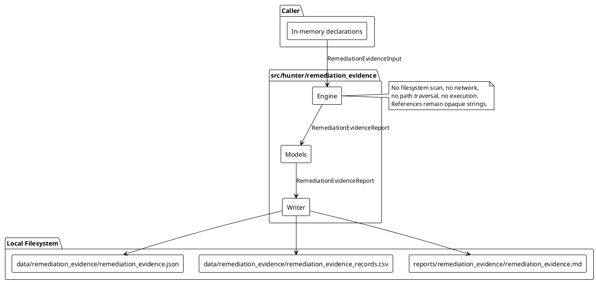
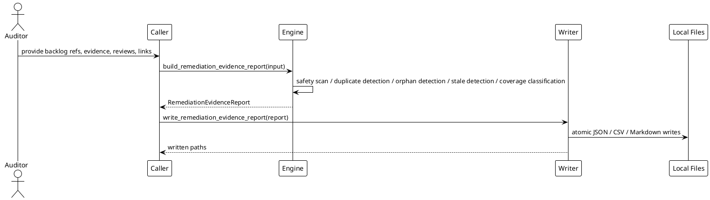

# SPEC-039-Local Research Remediation Evidence Tracker

## Background

MVP-37 added an audit-only Local Research Remediation Backlog Planner (`src/hunter/remediation_backlog/`). It produces deterministic, caller-provided remediation backlog reports that itemize sources, findings, backlog items, dependencies, acknowledgements, and consistency issues. The backlog is explicitly not an approval, certification, production readiness assessment, trading readiness assessment, recommendation, suitability assessment, or trading signal.

MVP-38 extends this audit-only research surface with a Local Research Remediation Evidence Tracker. A human auditor needs to know whether each backlog item has caller-provided evidence, whether that evidence has been reviewed, and whether the evidence is consistent with the current backlog state. The tracker answers questions such as:

- Which remediation backlog items have supporting evidence?
- Which evidence records are accepted, rejected, pending review, stale, conflicting, duplicated, or orphaned?
- Which backlog items still lack evidence?
- Which evidence records require manual human review?
- Which evidence records claim completion but are still linked to blocking or open backlog items?
- Which items can be marked evidence-covered for audit tracking only, without implying approval or readiness?

The tracker is local, call-triggered, deterministic, and produces human-audit artifacts only. It never executes remediation, never claims readiness, and never opens or validates referenced paths.

## Requirements

### Must have

1. A new package `src/hunter/remediation_evidence/` with frozen dataclass models, a pure-local engine, and a writer module.
2. `RemediationEvidenceInput` accepts only caller-provided in-memory declarations:
   - `backlog_item_refs`: tuple of `RemediationBacklogItemRef`
   - `evidence_records`: tuple of `RemediationEvidenceRecord`
   - `review_records`: tuple of `RemediationReviewRecord`
   - `links`: tuple of `RemediationEvidenceLink`
   - `config`: `RemediationEvidenceConfig`
   - `project_version`: `str`
   - `metadata`: `Mapping[str, str] = field(default_factory=dict)`
   - `generated_at`: `datetime | None`
3. Deterministic `report_id` using SHA-256 over a canonical JSON payload built from sorted backlog item/evidence/review/link IDs, `project_version`, and `generated_at`.
4. Deterministic `issue_id` using SHA-256 over a canonical JSON content hash of the issue.
5. Deterministic coverage result ID per backlog item.
6. Detect duplicate IDs across `backlog_item_refs`, `evidence_records`, `review_records`, and `links` (fail-closed).
7. Detect orphan evidence records, orphan review records, and orphan links.
8. Detect duplicate evidence records by deterministic content hash.
9. Detect conflicting review outcomes for the same `evidence_id`.
10. Detect stale evidence/review records using `config.staleness_threshold_seconds`:
    `record.generated_at < report.generated_at - timedelta(seconds=config.staleness_threshold_seconds)`.
11. Detect missing evidence for required backlog items (`config.require_evidence_for_all` and `required_backlog_item_ids`).
12. Detect missing human review when evidence requires review (`config.require_review`).
13. Detect rejected evidence records.
14. Detect pending-review evidence records.
15. Detect evidence with `evidence_state == "accepted"` while linked backlog item is still `BLOCKED` or `OPEN`.
16. Detect evidence linked to `ACKNOWLEDGED`, `DEFERRED`, or `NOT_APPLICABLE` backlog items and classify them appropriately.
17. Detect unsafe content in metadata, titles, descriptions, labels, and messages (fail-closed).
18. Forbidden-term scanning must use multi-word phrases only to avoid single-word false positives.
19. Coverage classification: `COVERED`, `PARTIAL`, `MISSING`, `REJECTED`, `PENDING_REVIEW`, `CONFLICTING`, `STALE`, `NOT_APPLICABLE`.
20. Evidence record state classification: `ACCEPTED`, `REJECTED`, `PENDING_REVIEW`, `STALE`, `DUPLICATE`, `ORPHANED`, `CONFLICTING`, `NOT_APPLICABLE`.
21. Severity classification: `BLOCKING`, `ADVISORY`, `INFO`.
22. Aggregate state:
    - Any blocking issue or unsafe content → `BLOCKED`.
    - Any advisory issue → `DEGRADED`.
    - No blocking/advisory issues → `OK`.
    - `NOT_APPLICABLE`/`INFO` does not block.
    - Strict mode (`config.strict`) promotes any `DEGRADED`/`BLOCKED` to `BLOCKED`.
23. Writer functions that accept a single `RemediationEvidenceReport` argument:
    - `remediation_evidence_report_to_dict`
    - `remediation_evidence_report_to_json_text`
    - `remediation_evidence_report_to_csv_text`
    - `remediation_evidence_report_to_markdown_text`
    - `write_remediation_evidence_report`
24. Default local artifact paths:
    - `data/remediation_evidence/remediation_evidence.json`
    - `data/remediation_evidence/remediation_evidence_records.csv`
    - `reports/remediation_evidence/remediation_evidence.md`
25. Writer `_DEFAULT_PATH = object()` sentinel behavior: omitted path writes default, `None` skips, explicit path writes only to that path.
26. Markdown includes:
    - H1 title
    - Immediate audit-only/research-only safety notice
    - Explicit statement that evidence coverage is not approval, certification, production readiness, trading readiness, recommendation, suitability assessment, signal, or executable remediation plan
    - Sections for summary, backlog item evidence coverage, evidence records, review records, links, issues, data quality, safety flags, and manual review notes
27. CSV contains evidence record rows with columns: `report_id`, `generated_at`, `evidence_id`, `backlog_item_id`, `evidence_state`, `coverage_state`, `review_outcome`, `severity`, `reason_codes`, `message`.
28. All path/report/artifact references remain opaque strings; the engine and writer never open, follow, traverse, validate, fetch, or execute referenced paths.

### Should have

1. Configurable `staleness_threshold_seconds` default (e.g., 30 days).
2. Configurable `require_review` flag.
3. Configurable `require_evidence_for_all` flag.
4. Configurable `required_backlog_item_ids` tuple for targeted evidence checks.
5. Reason-code string constants for ergonomic public API use.

### Could have

1. Optional `notes` field on the report for free-form human-audit context.
2. Optional `reviewer` and `reviewed_at` fields on review records.
3. Future batch import of evidence links from caller-provided manifests.

### Won't have

1. No filesystem scanning, import introspection, or repository traversal.
2. No live trading, orders, exchange/Binance/API/network usage.
3. No Freqtrade strategy import or runtime.
4. No leverage/shorting execution.
5. No Web UI, dashboard, server, database, scheduler, or daemon.
6. No actionable buy/sell/hold signals or recommendations.
7. No approvals, certifications, production-readiness, or trading-readiness claims.
8. No automated remediation execution, file edits, code patches, shell commands, deployment actions, infrastructure changes, or executable steps as output.

## Method

### Architecture overview

The Remediation Evidence Tracker is a local research package with three layers:

1. **Models** (`src/hunter/remediation_evidence/models.py`) — frozen dataclasses, enums, constants, and safety helpers.
2. **Engine** (`src/hunter/remediation_evidence/engine.py`) — pure function `build_remediation_evidence_report(input) -> RemediationEvidenceReport` that runs all detection and classification.
3. **Writer** (`src/hunter/remediation_evidence/writer.py`) — deterministic serialization to JSON, CSV, and Markdown with atomic local writes.

All inputs are caller-provided in-memory declarations. The engine and writer do not access the network, filesystem, or any referenced paths. They are deterministic, fail-closed on safety issues, and emit only human-audit artifacts.

### In-memory models

```python
from dataclasses import dataclass, field
from datetime import datetime
from enum import Enum
from collections.abc import Mapping
from typing import Any


REMEDIATION_EVIDENCE_VERSION: str = "0.38.0-dev"


class RemediationEvidenceState(Enum):
    OK = "ok"
    DEGRADED = "degraded"
    BLOCKED = "blocked"
    NOT_APPLICABLE = "not_applicable"


class RemediationEvidenceSeverity(Enum):
    BLOCKING = "blocking"
    ADVISORY = "advisory"
    INFO = "info"


class RemediationEvidenceReasonCode(Enum):
    OK = "ok"
    NOT_APPLICABLE = "not_applicable"
    CONSISTENCY_DEGRADED = "consistency_degraded"
    SAFETY_BLOCKED = "safety_blocked"
    UNSAFE_CONTENT = "unsafe_content"
    FORBIDDEN_TERM_PRESENT = "forbidden_term_present"
    DUPLICATE_ID = "duplicate_id"
    DUPLICATE_EVIDENCE = "duplicate_evidence"
    ORPHAN_EVIDENCE = "orphan_evidence"
    ORPHAN_REVIEW = "orphan_review"
    ORPHAN_LINK = "orphan_link"
    CONFLICTING_REVIEW = "conflicting_review"
    STALE_EVIDENCE = "stale_evidence"
    STALE_REVIEW = "stale_review"
    MISSING_EVIDENCE = "missing_evidence"
    MISSING_REVIEW = "missing_review"
    REJECTED_EVIDENCE = "rejected_evidence"
    PENDING_REVIEW_EVIDENCE = "pending_review_evidence"
    BLOCKED_BACKLOG_ITEM = "blocked_backlog_item"
    OPEN_BACKLOG_ITEM = "open_backlog_item"
    ACKNOWLEDGED_BACKLOG_ITEM = "acknowledged_backlog_item"
    DEFERRED_BACKLOG_ITEM = "deferred_backlog_item"
    NOT_APPLICABLE_BACKLOG_ITEM = "not_applicable_backlog_item"


class RemediationEvidenceRecordState(Enum):
    ACCEPTED = "accepted"
    REJECTED = "rejected"
    PENDING_REVIEW = "pending_review"
    STALE = "stale"
    DUPLICATE = "duplicate"
    ORPHANED = "orphaned"
    CONFLICTING = "conflicting"
    NOT_APPLICABLE = "not_applicable"


class RemediationEvidenceCoverageState(Enum):
    COVERED = "covered"
    PARTIAL = "partial"
    MISSING = "missing"
    REJECTED = "rejected"
    PENDING_REVIEW = "pending_review"
    CONFLICTING = "conflicting"
    STALE = "stale"
    NOT_APPLICABLE = "not_applicable"


class RemediationEvidenceReviewOutcome(Enum):
    ACCEPTED = "accepted"
    REJECTED = "rejected"
    PENDING_REVIEW = "pending_review"
    NOT_APPLICABLE = "not_applicable"


class RemediationEvidenceLinkType(Enum):
    SUPPORTS = "supports"
    CONTRADICTS = "contradicts"
    OBSERVES = "observes"


class RemediationEvidenceIssueType(Enum):
    UNSAFE_CONTENT = "unsafe_content"
    DUPLICATE_ID = "duplicate_id"
    DUPLICATE_EVIDENCE = "duplicate_evidence"
    ORPHAN_EVIDENCE = "orphan_evidence"
    ORPHAN_REVIEW = "orphan_review"
    ORPHAN_LINK = "orphan_link"
    CONFLICTING_REVIEW = "conflicting_review"
    STALE_EVIDENCE = "stale_evidence"
    STALE_REVIEW = "stale_review"
    MISSING_EVIDENCE = "missing_evidence"
    MISSING_REVIEW = "missing_review"
    REJECTED_EVIDENCE = "rejected_evidence"
    PENDING_REVIEW_EVIDENCE = "pending_review_evidence"
    BLOCKED_BACKLOG_ITEM = "blocked_backlog_item"
    OPEN_BACKLOG_ITEM = "open_backlog_item"
    ACKNOWLEDGED_BACKLOG_ITEM = "acknowledged_backlog_item"
    DEFERRED_BACKLOG_ITEM = "deferred_backlog_item"
    NOT_APPLICABLE_BACKLOG_ITEM = "not_applicable_backlog_item"


@dataclass(frozen=True, slots=True)
class RemediationBacklogItemRef:
    """Opaque reference to a remediation backlog item."""
    backlog_item_id: str = ""
    source_id: str = ""
    finding_id: str = ""
    item_state: str = "open"
    severity: str = "advisory"
    priority: str = "none"
    title: str = ""
    description: str = ""
    generated_at: datetime | None = None
    metadata: Mapping[str, str] = field(default_factory=dict)


@dataclass(frozen=True, slots=True)
class RemediationEvidenceRecord:
    """Caller-provided evidence record."""
    evidence_id: str = ""
    backlog_item_id: str = ""
    title: str = ""
    description: str = ""
    evidence_state: str = "pending_review"
    generated_at: datetime | None = None
    metadata: Mapping[str, str] = field(default_factory=dict)


@dataclass(frozen=True, slots=True)
class RemediationReviewRecord:
    """Caller-provided human review outcome for an evidence record."""
    review_id: str = ""
    evidence_id: str = ""
    outcome: str = "pending_review"
    reviewer: str = ""
    reviewed_at: datetime | None = None
    generated_at: datetime | None = None
    note: str = ""
    metadata: Mapping[str, str] = field(default_factory=dict)


@dataclass(frozen=True, slots=True)
class RemediationEvidenceLink:
    """Caller-provided link between an evidence record and a backlog item."""
    link_id: str = ""
    evidence_id: str = ""
    backlog_item_id: str = ""
    link_type: str = "supports"
    generated_at: datetime | None = None
    metadata: Mapping[str, str] = field(default_factory=dict)


@dataclass(frozen=True, slots=True)
class RemediationEvidenceIssue:
    """Engine-generated issue."""
    issue_id: str = ""
    issue_type: str = ""
    severity: str = "info"
    reason_codes: tuple[str, ...] = ()
    title: str = ""
    description: str = ""
    evidence_id: str = ""
    backlog_item_id: str = ""
    review_id: str = ""
    link_id: str = ""
    generated_at: datetime | None = None
    metadata: Mapping[str, str] = field(default_factory=dict)


@dataclass(frozen=True, slots=True)
class RemediationEvidenceCoverageResult:
    """Coverage classification per backlog item."""
    coverage_id: str = ""
    backlog_item_id: str = ""
    coverage_state: str = "missing"
    evidence_ids: tuple[str, ...] = ()
    review_ids: tuple[str, ...] = ()
    severity: str = "info"
    reason_codes: tuple[str, ...] = ()
    title: str = ""
    description: str = ""
    generated_at: datetime | None = None


@dataclass(frozen=True, slots=True)
class RemediationEvidenceConfig:
    """Configuration for the evidence tracker."""
    strict: bool = False
    require_review: bool = False
    require_evidence_for_all: bool = False
    required_backlog_item_ids: tuple[str, ...] = ()
    staleness_threshold_seconds: int = 2_592_000  # 30 days
    forbid_action_terms: bool = True


@dataclass(frozen=True, slots=True)
class RemediationEvidenceDataQuality:
    """Data quality summary."""
    total_backlog_item_refs: int = 0
    total_evidence_records: int = 0
    total_review_records: int = 0
    total_links: int = 0
    total_issues: int = 0
    total_coverage_results: int = 0
    duplicate_id_count: int = 0
    duplicate_evidence_count: int = 0
    orphan_evidence_count: int = 0
    orphan_review_count: int = 0
    orphan_link_count: int = 0
    conflicting_review_count: int = 0
    stale_evidence_count: int = 0
    stale_review_count: int = 0
    missing_evidence_count: int = 0
    missing_review_count: int = 0
    rejected_evidence_count: int = 0
    pending_review_evidence_count: int = 0
    blocked_backlog_item_count: int = 0
    open_backlog_item_count: int = 0
    unsafe_content_count: int = 0
    forbidden_term_count: int = 0
    sections_present: int = 0


@dataclass(frozen=True, slots=True)
class RemediationEvidenceSafetyFlags:
    """Safety flags for the evidence tracker report."""
    has_unsafe_content: bool = False
    has_forbidden_terms: bool = False

    @property
    def is_safe(self) -> bool:
        return not (self.has_unsafe_content or self.has_forbidden_terms)


@dataclass(frozen=True, slots=True)
class RemediationEvidenceInput:
    """Top-level input for the evidence tracker."""
    backlog_item_refs: tuple[RemediationBacklogItemRef, ...] = ()
    evidence_records: tuple[RemediationEvidenceRecord, ...] = ()
    review_records: tuple[RemediationReviewRecord, ...] = ()
    links: tuple[RemediationEvidenceLink, ...] = ()
    config: RemediationEvidenceConfig = field(default_factory=RemediationEvidenceConfig)
    project_version: str = "0.38.0-dev"
    metadata: Mapping[str, str] = field(default_factory=dict)
    generated_at: datetime | None = None


@dataclass(frozen=True, slots=True)
class RemediationEvidenceReport:
    """Top-level output for the evidence tracker."""
    report_id: str = ""
    generated_at: datetime | None = None
    state: RemediationEvidenceState = RemediationEvidenceState.NOT_APPLICABLE
    project_version: str = "0.38.0-dev"
    backlog_item_refs: tuple[RemediationBacklogItemRef, ...] = ()
    evidence_records: tuple[RemediationEvidenceRecord, ...] = ()
    review_records: tuple[RemediationReviewRecord, ...] = ()
    links: tuple[RemediationEvidenceLink, ...] = ()
    issues: tuple[RemediationEvidenceIssue, ...] = ()
    coverage_results: tuple[RemediationEvidenceCoverageResult, ...] = ()
    data_quality: RemediationEvidenceDataQuality = field(default_factory=RemediationEvidenceDataQuality)
    safety_flags: RemediationEvidenceSafetyFlags = field(default_factory=RemediationEvidenceSafetyFlags)
    reason_codes: tuple[RemediationEvidenceReasonCode, ...] = ()
    metadata: Mapping[str, str] = field(default_factory=dict)
    safety_notice: str = ""
    notes: str = ""

    @classmethod
    def blocked(cls, input: RemediationEvidenceInput, reason_code: RemediationEvidenceReasonCode, notes: str = "") -> "RemediationEvidenceReport":
        """Return a minimal BLOCKED report without opening, validating, or executing any refs.

        The report echoes caller-provided collections if available; otherwise they are empty tuples.
        It contains a single blocking issue (or a safety/duplicate issue when available), an empty
        coverage_results tuple, and a safety_notice stating that the report is an audit-only research
        artifact and does not imply approval or readiness. No path or reference is opened, traversed,
        validated, fetched, or executed.
        """
        ...
```

### Constants

```python
FORBIDDEN_REMEDIATION_EVIDENCE_TERMS: frozenset[str] = frozenset({
    "deploy immediately",
    "execute now",
    "run this command",
    "apply patch",
    "production ready",
    "trading ready",
    "live trading",
    "place order",
    "execute order",
    "buy signal",
    "sell signal",
    "hold signal",
    "go live",
    "push to production",
    "infrastructure change",
    "automated remediation",
    "self healing",
    "auto fix",
    "certified safe",
    "approved for deployment",
    "suitable for trading",
    "recommendation to trade",
    "exchange api",
    "binance key",
    "api key",
    "private key",
    "leverage up",
    "short squeeze",
    "margin call",
    "liquidate position",
})
```

All terms are multi-word phrases. The matcher is case-insensitive substring match. Benign examples that must NOT match include:

- `pending approval from security team`
- `certification body`
- `no recommendation needed`
- `signal processing`
- `no signal detected`

### Engine behavior

The engine is implemented as `build_remediation_evidence_report(input: RemediationEvidenceInput) -> RemediationEvidenceReport`.

1. **Normalize generated_at** — use `input.generated_at` or `datetime.now(timezone.utc)`.
2. **Safety scan** — scan `metadata` and all text fields for unsafe non-string values and forbidden multi-word phrases. If found, set `safety_flags` and emit blocking `UNSAFE_CONTENT`/`FORBIDDEN_TERM_PRESENT` issues.
3. **Detect duplicate IDs** — within each collection (`backlog_item_refs`, `evidence_records`, `review_records`, `links`), detect duplicate normalized IDs. Emit blocking `DUPLICATE_ID` issues.
4. **Detect duplicate evidence records** — detect evidence records with identical canonical content hashes. Emit `DUPLICATE_EVIDENCE` issues and reclassify duplicates as `DUPLICATE` record state.
5. **Detect orphan records** — an evidence record is orphan if its `backlog_item_id` is not in the normalized backlog item ID set. A review record is orphan if its `evidence_id` is not in the normalized evidence ID set. A link is orphan if its `evidence_id` or `backlog_item_id` is not in the respective sets. Emit `ORPHAN_EVIDENCE`, `ORPHAN_REVIEW`, or `ORPHAN_LINK` issues.
6. **Detect conflicting reviews** — if two review records for the same `evidence_id` have different outcomes, emit `CONFLICTING_REVIEW` issues.
7. **Detect stale evidence/reviews** — compare `record.generated_at` with `report.generated_at - staleness_threshold`. Emit `STALE_EVIDENCE` or `STALE_REVIEW` issues.
8. **Detect missing evidence/reviews** — based on `config.require_evidence_for_all`, `required_backlog_item_ids`, and `config.require_review`. Emit `MISSING_EVIDENCE` or `MISSING_REVIEW` issues.
9. **Detect rejected/pending evidence** — emit `REJECTED_EVIDENCE` or `PENDING_REVIEW_EVIDENCE` issues for records with those states.
10. **Detect backlog-item state mismatches** — for each linked backlog item:
    - If `BLOCKED` or `OPEN` and evidence has `evidence_state == "accepted"` → emit `BLOCKED_BACKLOG_ITEM` or `OPEN_BACKLOG_ITEM` advisory issue.

    `ACCEPTED` means caller-provided evidence is accepted for audit tracking only. It does not mean approval, certification, production readiness, trading readiness, deployment readiness, recommendation, suitability, or signal validity. The engine only reports the mismatch; it does not execute or approve any remediation.
    - If `ACKNOWLEDGED` → emit `ACKNOWLEDGED_BACKLOG_ITEM` info issue.
    - If `DEFERRED` → emit `DEFERRED_BACKLOG_ITEM` info issue.
    - If `NOT_APPLICABLE` → emit `NOT_APPLICABLE_BACKLOG_ITEM` info issue and coverage `NOT_APPLICABLE`.
11. **Compute coverage results** — per backlog item, combine linked evidence/review records and classify coverage as `COVERED`, `PARTIAL`, `MISSING`, `REJECTED`, `PENDING_REVIEW`, `CONFLICTING`, `STALE`, or `NOT_APPLICABLE`.
12. **Assign determinism** — sort all output collections by normalized IDs, then by generated_at. Assign deterministic IDs to generated issues and coverage results.
13. **Aggregate state** — compute overall state using blocking/advisory severity rules and strict mode.
14. **Safety notice** — include a fixed safety notice that the report is a local, audit-only research artifact and does not imply approval or readiness.

### Writer behavior

The writer module exposes the same pattern as MVP-36 and MVP-37:

- `remediation_evidence_report_to_dict(report) -> dict[str, Any]`
- `remediation_evidence_report_to_json_text(report) -> str`
- `remediation_evidence_report_to_csv_text(report) -> str`
- `remediation_evidence_report_to_markdown_text(report) -> str`
- `write_remediation_evidence_report(report, json_path=_DEFAULT_PATH, csv_path=_DEFAULT_PATH, md_path=_DEFAULT_PATH, ...)`
- `atomic_write_json_remediation_evidence_report(...)`
- `atomic_write_csv_remediation_evidence_report(...)`
- `atomic_write_markdown_remediation_evidence_report(...)`

The writer uses `_DEFAULT_PATH = object()` as a sentinel: omitting a path argument writes to the default local artifact path; passing `None` skips that artifact; passing an explicit `Path` writes only to that local path. The writer creates parent directories and writes atomically via a temporary file rename.

Markdown output includes the H1 title, safety notice, summary, backlog item coverage, evidence records, review records, links, issues, data quality, safety flags, and manual review notes. No shell commands, patch instructions, deployment commands, trading instructions, or automated remediation actions appear in the output.

### Deterministic IDs and order

- `report_id` = SHA-256 of canonical JSON over sorted normalized backlog item IDs, sorted normalized evidence IDs, sorted normalized review IDs, sorted normalized link IDs, `project_version`, and `generated_at`.
- `issue_id` = SHA-256 of canonical JSON over the issue content (type, severity, reason codes, related IDs, title, description).
- `coverage_id` = SHA-256 of canonical JSON over the normalized backlog item ID and sorted linked evidence/review IDs.
- All output tuples are sorted deterministically by normalized IDs and generated_at.

### Evidence coverage semantics

Coverage is evaluated as a first-match-wins decision tree. Every backlog item in `backlog_item_refs` receives exactly one `RemediationEvidenceCoverageResult`. The classification is for human-audit tracking only and does not mean approval, certification, production readiness, trading readiness, deployment readiness, recommendation, suitability, or signal validity.

1. `NOT_APPLICABLE` — backlog item `item_state` is `"not_applicable"`, or evidence is not required for this item and no non-orphan evidence exists.
2. `MISSING` — no non-orphan evidence record links to the backlog item and evidence is required (`config.require_evidence_for_all` or `backlog_item_id` is in `config.required_backlog_item_ids`).
3. `CONFLICTING` — conflicting review outcomes exist for evidence records linked to the backlog item.
4. `REJECTED` — all linked evidence records are in the `REJECTED` state.
5. `STALE` — all linked evidence records and all linked review records are stale.
6. `PENDING_REVIEW` — evidence records link to the backlog item, but no linked review record has an `ACCEPTED` outcome.
7. `COVERED` — at least one linked evidence record is `ACCEPTED` and non-stale, and no `CONFLICTING`, `REJECTED`, or orphan issue exists for that item.
8. `PARTIAL` — some evidence links to the backlog item but none of the above rules match (fallback).

The first rule that matches wins; subsequent rules are ignored. Coverage is for human-audit tracking only, not implementation instruction or readiness.

### Review outcome semantics

- `ACCEPTED` — human review accepted the evidence. Does not imply approval of the remediation or readiness.
- `REJECTED` — human review rejected the evidence.
- `PENDING_REVIEW` — no human review outcome yet.
- `NOT_APPLICABLE` — review is not applicable for this evidence record.

### Data quality

`RemediationEvidenceDataQuality` summarizes counts for all detected patterns: totals, duplicates, orphans, conflicts, staleness, missing evidence/reviews, rejected/pending evidence, and blocked/open backlog items. It is immutable and constructed once at the end of engine execution.

### Safety flags

`RemediationEvidenceSafetyFlags` tracks unsafe content and forbidden terms. Both trigger blocking behavior and `SAFETY_BLOCKED` aggregation. Unsafe content is fail-closed: any non-string value in metadata or text fields is treated as unsafe.

### Failure semantics

- If the input contains unsafe content or forbidden terms, the engine returns a `BLOCKED` report with a minimal safe payload and does not process evidence semantics further.
- If duplicate IDs are detected, the engine returns `BLOCKED` with `DUPLICATE_ID` reason codes.
- In strict mode, any `DEGRADED` or `BLOCKED` aggregate state is promoted to `BLOCKED`.
- All errors are reported through `issues` and `reason_codes`; the engine never raises exceptions for invalid input unless validation is impossible.

### PlantUML component diagram



### PlantUML sequence diagram



### Explicit statement on opaque references

All `backlog_item_id`, `evidence_id`, `review_id`, `link_id`, `source_id`, `finding_id`, artifact paths, report paths, and metadata values are opaque strings. The engine and writer never open, follow, traverse, validate, fetch, or execute them. They are only used for identity comparison, deterministic sorting, and human-audit serialization.

## Implementation

Implement MVP-38 in four steps, mirroring MVP-36 and MVP-37:

### Step 1: Models and Engine

- `src/hunter/remediation_evidence/__init__.py` with public exports.
- `src/hunter/remediation_evidence/models.py` with all frozen dataclasses, enums, constants, and safety helpers.
- `src/hunter/remediation_evidence/engine.py` with `build_remediation_evidence_report` and all detection/classification helpers.
- `tests/test_remediation_evidence/test_models.py` — model validation and safety helpers.
- `tests/test_remediation_evidence/test_engine.py` — focused engine tests.

### Step 2: Writer

- `src/hunter/remediation_evidence/writer.py` with dict/JSON/CSV/Markdown serialization and atomic writes.
- `tests/test_remediation_evidence/test_writer.py` — focused writer tests.

### Step 3: Integration Tests

- `tests/test_remediation_evidence/test_integration.py` — end-to-end flows using only the public API.

### Step 4: Finalization

- Bump `src/hunter/__init__.py` version to `0.38.0-dev`.
- Update `CHANGELOG.md` with MVP-38 entry.
- Update `tasks/active.md` to mark MVP-38 complete with test results and tag target `v0.38.0-dev`.

### Test Plan

#### Step 1: Models + Engine tests

- Model defaults and frozen/slot-based immutability.
- Safety flags validation (`is_safe` when no unsafe content or forbidden terms).
- Deterministic IDs and tuple ordering (`report_id`, `issue_id`, `coverage_id` stable for identical inputs).
- Duplicate IDs fail-closed across backlog items, evidence, reviews, and links.
- Duplicate evidence deduplication by deterministic content hash.
- Orphan evidence, orphan review, and orphan link detection.
- Conflicting review outcomes for the same evidence_id.
- Stale evidence/review records using `staleness_threshold_seconds`.
- Missing evidence for required backlog items.
- Missing human review when `config.require_review` is True.
- Rejected evidence records and emitted `REJECTED_EVIDENCE` issues.
- Pending-review evidence records and emitted `PENDING_REVIEW_EVIDENCE` issues.
- All coverage states (`COVERED`, `PARTIAL`, `MISSING`, `REJECTED`, `PENDING_REVIEW`, `CONFLICTING`, `STALE`, `NOT_APPLICABLE`) using first-match-wins precedence.
- Evidence linked to `BLOCKED`, `OPEN`, `ACKNOWLEDGED`, `DEFERRED`, and `NOT_APPLICABLE` backlog items (accepted evidence on blocked/open items emits advisory issues; acknowledged/deferred/not-applicable items emit info issues and coverage classification).
- Unsafe metadata/content fail-closed behavior.
- Forbidden-term multi-word phrase matching with benign false-positive examples.
- Opaque reference behavior: IDs and paths are strings and never opened or validated.
- No mutation of input collections.
- No filesystem scan, import introspection, or network access.
- No executable remediation output from the engine.

#### Step 2: Writer tests

- JSON serialization parseable and deterministic (enum values as strings, datetime ISO format, nested dataclasses).
- CSV evidence record rows with correct header and deterministic order.
- Markdown begins with H1 and immediate research-only/audit-only safety notice.
- Markdown explicitly states evidence coverage is not approval, certification, production readiness, trading readiness, recommendation, suitability assessment, signal, or executable remediation plan.
- Markdown includes summary, evidence records, review records, links, coverage results, issues, data quality, safety flags, and reason code sections.
- Atomic writes to `tmp_path` produce JSON/CSV/Markdown files.
- `_DEFAULT_PATH` sentinel behavior: omitted writes defaults, `None` skips artifact, explicit path writes only that path.
- Parent directories created automatically.
- No executable remediation output, shell commands, patch instructions, deployment commands, or trading instructions in any writer output.
- No path/reference traversal or opening by the writer.

#### Step 3: Integration tests

- End-to-end build from `RemediationEvidenceInput` through `write_remediation_evidence_report` to local files.
- Determinism: same input produces identical JSON/CSV/Markdown text and stable IDs across repeated engine calls.
- Public exports include `build_remediation_evidence_report`, writer functions, and default path constants.
- Safety boundaries: outputs contain audit-only/research-only language, no actionable trading/execution/remediation language, no approval/readiness claims.
- Opaque reference behavior end-to-end: refs remain strings and are never opened or validated.

## Milestones

1. SPEC-039 approved and committed.
2. Step 1: models + engine + tests passing.
3. Step 2: writer + tests passing.
4. Step 3: integration tests passing.
5. Step 4: finalization and version bump.
6. Tag `v0.38.0-dev`.

## Gathering Results

The Remediation Evidence Tracker produces three local artifacts:

- `data/remediation_evidence/remediation_evidence.json` — full deterministic report.
- `data/remediation_evidence/remediation_evidence_records.csv` — evidence record rows for audit review.
- `reports/remediation_evidence/remediation_evidence.md` — human-readable audit summary.

These artifacts answer the design questions:

- Which backlog items have supporting evidence? → `coverage_results`.
- Which evidence records are accepted, rejected, pending, stale, conflicting, duplicated, or orphaned? → `evidence_records` (with inferred states) and `issues`.
- Which backlog items lack evidence? → `MISSING` coverage results and `MISSING_EVIDENCE` issues.
- Which evidence records require human review? → `PENDING_REVIEW` evidence records and `MISSING_REVIEW` issues.
- Which evidence records claim completion but still have unresolved blocking/advisory backlog items? → `BLOCKED_BACKLOG_ITEM` and `OPEN_BACKLOG_ITEM` issues.
- Which items can be marked evidence-covered for audit tracking only? → `COVERED` coverage results, with the safety notice that this is not approval or readiness.

## Need Professional Help in Developing Your Architecture?

Please contact me at [sammuti.com](https://sammuti.com) :)
