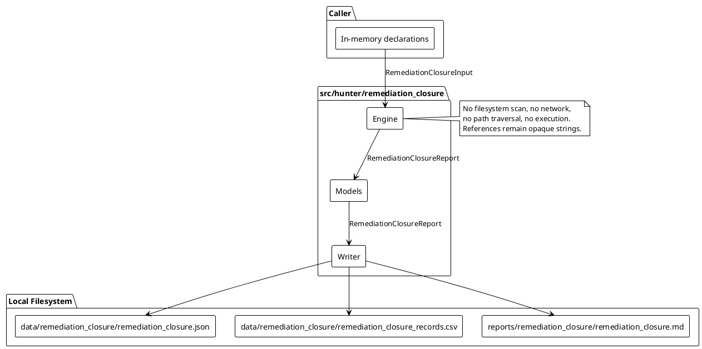
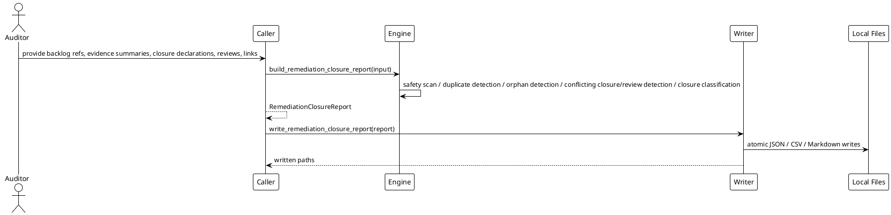

# SPEC-040-Local Research Remediation Closure Register

## Background

MVP-37 added an audit-only Local Research Remediation Backlog Planner (`src/hunter/remediation_backlog/`) that produces deterministic, caller-provided remediation backlog reports itemizing sources, findings, backlog items, dependencies, acknowledgements, and consistency issues. MVP-38 added an audit-only Local Research Remediation Evidence Tracker (`src/hunter/remediation_evidence/`) that answers whether each backlog item has caller-provided evidence, whether that evidence has been reviewed, and whether the evidence is consistent with the current backlog state.

MVP-39 extends this audit-only research surface with a Local Research Remediation Closure Register. A human auditor needs to know which backlog items have caller-provided closure declarations, whether those declarations are consistent with the evidence coverage and review outcomes already recorded, and whether any closure record requires further human review. The register answers questions such as:

- Which remediation backlog items are locally closure-recorded?
- Which closure records have accepted evidence coverage?
- Which closure records are blocked, partial, stale, disputed, duplicated, orphaned, or pending human review?
- Which closure declarations conflict with current evidence coverage or review outcomes?
- Which closure records lack required closure metadata such as owner, reviewer, closure timestamp, rationale, or evidence link?
- Which items are closure-recorded for audit tracking only, without implying approval or readiness?

The register is local, call-triggered, deterministic, and produces human-audit artifacts only. It never executes remediation, never claims readiness, and never opens or validates referenced paths. "Closure-recorded" means only that a caller-provided closure declaration exists and passed local consistency checks for human audit review.

## Requirements

### Must have

1. A new package `src/hunter/remediation_closure/` with frozen dataclass models, a pure-local engine, and a writer module.
2. `RemediationClosureInput` accepts only caller-provided in-memory declarations:
   - `backlog_item_refs`: tuple of `RemediationClosureBacklogItemRef`
   - `evidence_summaries`: tuple of `RemediationClosureEvidenceSummary`
   - `closure_declarations`: tuple of `RemediationClosureDeclaration`
   - `review_records`: tuple of `RemediationClosureReviewRecord`
   - `links`: tuple of `RemediationClosureLink`
   - `config`: `RemediationClosureConfig`
   - `project_version`: `str`
   - `metadata`: `Mapping[str, str] = field(default_factory=dict)`
   - `generated_at`: `datetime | None`
3. Deterministic `report_id` using SHA-256 over a canonical JSON payload built from sorted backlog item/evidence/declaration/review/link IDs, `project_version`, and `generated_at`.
4. Deterministic `issue_id` using SHA-256 over a canonical JSON content hash of the issue.
5. Deterministic closure result ID per backlog item.
6. Detect duplicate IDs across `backlog_item_refs`, `evidence_summaries`, `closure_declarations`, `review_records`, and `links` (fail-closed).
7. Detect orphan evidence summaries, orphan closure declarations, orphan review records, and orphan links.
8. Detect conflicting closure declarations for the same `backlog_item_id`.
9. Detect conflicting review outcomes for the same `closure_id`.
10. Detect stale evidence/closure/review records using `config.staleness_threshold_seconds`: `record.generated_at < report.generated_at - timedelta(seconds=config.staleness_threshold_seconds)`.
11. Detect closure declarations without accepted evidence coverage when `config.require_evidence_for_closure` is True. When False, missing evidence coverage may produce `INFO` or `NOT_APPLICABLE` reasons but must not imply approval or readiness.
12. Detect closure declarations while the backlog item is `OPEN`, `BLOCKED`, or `CONFLICTING`.
13. Detect closure declarations for `ACKNOWLEDGED`, `DEFERRED`, or `NOT_APPLICABLE` items and classify them appropriately.
14. Detect closure declarations missing required closure metadata (owner, reviewer, `closed_at`, rationale, evidence link) when `config.require_closure_metadata` is True.
15. Detect pending/rejected/disputed closure review records.
16. Detect closure records requiring manual human review.
17. Detect unsafe content in metadata, titles, descriptions, labels, messages, and rationale (fail-closed).
18. Forbidden-term scanning must use multi-word phrases only to avoid single-word false positives.
19. Closure record state classification: `CLOSED_RECORDED`, `PARTIAL`, `BLOCKED`, `PENDING_REVIEW`, `REJECTED`, `DISPUTED`, `STALE`, `DUPLICATE`, `ORPHANED`, `NOT_APPLICABLE`.
20. Closure eligibility classification: `ELIGIBLE`, `PARTIAL`, `INELIGIBLE`, `PENDING_REVIEW`, `DISPUTED`, `STALE`, `NOT_APPLICABLE`.
21. Review outcome classification: `ACCEPTED`, `REJECTED`, `PENDING`, `DISPUTED`, `NOT_REQUIRED`, `NOT_APPLICABLE`.
22. Severity classification: `BLOCKING`, `ADVISORY`, `INFO`.
23. Aggregate state:
    - Any blocking issue or unsafe content → `BLOCKED`.
    - Any advisory issue → `DEGRADED`.
    - No blocking/advisory issues → `OK`.
    - `NOT_APPLICABLE`/`INFO` does not block.
    - Strict mode (`config.strict`) promotes any `DEGRADED`/`BLOCKED` to `BLOCKED`.
24. Closure result precedence: `NOT_APPLICABLE` → `ORPHANED` → `BLOCKED` → `DISPUTED` → `DUPLICATE` → `REJECTED` → `STALE` → `PENDING_REVIEW` → `PARTIAL` → `CLOSED_RECORDED` (first-match-wins). Duplicate IDs remain fail-closed; the `DUPLICATE` result state applies to duplicate semantic declarations or non-primary duplicate records, not duplicate IDs.
25. Every backlog item receives exactly one `RemediationClosureResult`.
26. Writer functions that accept a single `RemediationClosureReport` argument:
    - `remediation_closure_report_to_dict`
    - `remediation_closure_report_to_json_text`
    - `remediation_closure_report_to_csv_text`
    - `remediation_closure_report_to_markdown_text`
    - `write_remediation_closure_report`
27. Default local artifact paths:
    - `data/remediation_closure/remediation_closure.json`
    - `data/remediation_closure/remediation_closure_records.csv`
    - `reports/remediation_closure/remediation_closure.md`
28. Writer `_DEFAULT_PATH = object()` sentinel behavior: omitted path writes default, `None` skips, explicit path writes only to that path.
29. Markdown includes H1 title, immediate audit-only/research-only safety notice, and explicit statement that closure-recorded is not approval, certification, production readiness, trading readiness, recommendation, suitability assessment, signal, or executable remediation plan.
30. CSV contains closure result rows with columns: `report_id`, `generated_at`, `closure_result_id`, `backlog_item_id`, `closure_id`, `record_state`, `eligibility_state`, `review_outcome`, `severity`, `reason_codes`, `message`.
31. All path/report/artifact references remain opaque strings; the engine and writer never open, follow, traverse, validate, fetch, or execute referenced paths.

### Should have

1. Configurable `staleness_threshold_seconds` default (e.g., 30 days).
2. Configurable `require_review` flag.
3. Configurable `require_closure_for_all` flag.
4. Configurable `require_evidence_for_closure` flag (default True).
5. Configurable `required_backlog_item_ids` tuple for targeted closure checks.
6. Configurable `require_closure_metadata` flag.
6. Reason-code string constants for ergonomic public API use.

### Could have

1. Optional `notes` field on the report for free-form human-audit context.
2. Optional `reviewed_at` field on closure declarations.
3. Future batch import of closure links from caller-provided manifests.

### Won't have

1. No filesystem scanning, import introspection, or repository traversal.
2. No live trading, orders, exchange/Binance/API/network usage.
3. No Freqtrade strategy import or runtime.
4. No leverage/shorting execution.
5. No Web UI, dashboard, server, database, scheduler, or daemon.
6. No actionable buy/sell/hold signals or recommendations.
7. No approvals, certifications, production-readiness, or trading-readiness claims.
8. No automated remediation execution, file edits, code patches, shell commands, deployment actions, infrastructure changes, or executable steps as output.

## Method

### Architecture overview

The Remediation Closure Register is a local research package with three layers:

1. **Models** (`src/hunter/remediation_closure/models.py`) — frozen dataclasses, enums, constants, and safety helpers.
2. **Engine** (`src/hunter/remediation_closure/engine.py`) — pure function `build_remediation_closure_report(input) -> RemediationClosureReport` that runs all detection and classification.
3. **Writer** (`src/hunter/remediation_closure/writer.py`) — deterministic serialization to JSON, CSV, and Markdown with atomic local writes.

All inputs are caller-provided in-memory declarations. The engine and writer do not access the network, filesystem, or any referenced paths. They are deterministic, fail-closed on safety issues, and emit only human-audit artifacts.

```python
from dataclasses import dataclass, field
from datetime import datetime
from enum import Enum
from collections.abc import Mapping
from typing import Any


REMEDIATION_CLOSURE_VERSION: str = "0.39.0-dev"


class RemediationClosureState(Enum):
    OK = "ok"
    DEGRADED = "degraded"
    BLOCKED = "blocked"
    NOT_APPLICABLE = "not_applicable"


class RemediationClosureSeverity(Enum):
    BLOCKING = "blocking"
    ADVISORY = "advisory"
    INFO = "info"


class RemediationClosureReasonCode(Enum):
    OK = "ok"
    NOT_APPLICABLE = "not_applicable"
    CONSISTENCY_DEGRADED = "consistency_degraded"
    SAFETY_BLOCKED = "safety_blocked"
    UNSAFE_CONTENT = "unsafe_content"
    FORBIDDEN_TERM_PRESENT = "forbidden_term_present"
    DUPLICATE_ID = "duplicate_id"
    ORPHAN_EVIDENCE = "orphan_evidence"
    ORPHAN_CLOSURE = "orphan_closure"
    ORPHAN_REVIEW = "orphan_review"
    ORPHAN_LINK = "orphan_link"
    CONFLICTING_CLOSURE = "conflicting_closure"
    CONFLICTING_REVIEW = "conflicting_review"
    STALE_EVIDENCE = "stale_evidence"
    STALE_CLOSURE = "stale_closure"
    STALE_REVIEW = "stale_review"
    MISSING_EVIDENCE = "missing_evidence"
    MISSING_REVIEW = "missing_review"
    MISSING_CLOSURE_METADATA = "missing_closure_metadata"
    REJECTED_REVIEW = "rejected_review"
    PENDING_REVIEW = "pending_review"
    DISPUTED_REVIEW = "disputed_review"
    MANUAL_REVIEW_REQUIRED = "manual_review_required"
    BLOCKED_BACKLOG_ITEM = "blocked_backlog_item"
    OPEN_BACKLOG_ITEM = "open_backlog_item"
    CONFLICTING_BACKLOG_ITEM = "conflicting_backlog_item"
    ACKNOWLEDGED_BACKLOG_ITEM = "acknowledged_backlog_item"
    DEFERRED_BACKLOG_ITEM = "deferred_backlog_item"
    NOT_APPLICABLE_BACKLOG_ITEM = "not_applicable_backlog_item"
    CLOSURE_RECORDED = "closure_recorded"


class RemediationClosureRecordState(Enum):
    CLOSED_RECORDED = "closed_recorded"
    PARTIAL = "partial"
    BLOCKED = "blocked"
    PENDING_REVIEW = "pending_review"
    REJECTED = "rejected"
    DISPUTED = "disputed"
    STALE = "stale"
    DUPLICATE = "duplicate"
    ORPHANED = "orphaned"
    NOT_APPLICABLE = "not_applicable"


class RemediationClosureEligibilityState(Enum):
    ELIGIBLE = "eligible"
    PARTIAL = "partial"
    INELIGIBLE = "ineligible"
    PENDING_REVIEW = "pending_review"
    DISPUTED = "disputed"
    STALE = "stale"
    NOT_APPLICABLE = "not_applicable"


class RemediationClosureReviewOutcome(Enum):
    ACCEPTED = "accepted"
    REJECTED = "rejected"
    PENDING = "pending"
    DISPUTED = "disputed"
    NOT_REQUIRED = "not_required"
    NOT_APPLICABLE = "not_applicable"


class RemediationClosureLinkType(Enum):
    CLOSURE_EVIDENCE = "closure_evidence"
    CLOSURE_BACKLOG = "closure_backlog"
    EVIDENCE_BACKLOG = "evidence_backlog"


class RemediationClosureIssueType(Enum):
    UNSAFE_CONTENT = "unsafe_content"
    DUPLICATE_ID = "duplicate_id"
    ORPHAN_EVIDENCE = "orphan_evidence"
    ORPHAN_CLOSURE = "orphan_closure"
    ORPHAN_REVIEW = "orphan_review"
    ORPHAN_LINK = "orphan_link"
    CONFLICTING_CLOSURE = "conflicting_closure"
    CONFLICTING_REVIEW = "conflicting_review"
    STALE_EVIDENCE = "stale_evidence"
    STALE_CLOSURE = "stale_closure"
    STALE_REVIEW = "stale_review"
    MISSING_EVIDENCE = "missing_evidence"
    MISSING_REVIEW = "missing_review"
    MISSING_CLOSURE_METADATA = "missing_closure_metadata"
    REJECTED_REVIEW = "rejected_review"
    PENDING_REVIEW = "pending_review"
    DISPUTED_REVIEW = "disputed_review"
    MANUAL_REVIEW_REQUIRED = "manual_review_required"
    BLOCKED_BACKLOG_ITEM = "blocked_backlog_item"
    OPEN_BACKLOG_ITEM = "open_backlog_item"
    CONFLICTING_BACKLOG_ITEM = "conflicting_backlog_item"
    ACKNOWLEDGED_BACKLOG_ITEM = "acknowledged_backlog_item"
    DEFERRED_BACKLOG_ITEM = "deferred_backlog_item"
    NOT_APPLICABLE_BACKLOG_ITEM = "not_applicable_backlog_item"


# String constants for convenient use in reason code tuples and frozensets.
OK = RemediationClosureReasonCode.OK.value
NOT_APPLICABLE_RC = RemediationClosureReasonCode.NOT_APPLICABLE.value
CONSISTENCY_DEGRADED = RemediationClosureReasonCode.CONSISTENCY_DEGRADED.value
SAFETY_BLOCKED = RemediationClosureReasonCode.SAFETY_BLOCKED.value
UNSAFE_CONTENT = RemediationClosureReasonCode.UNSAFE_CONTENT.value
FORBIDDEN_TERM_PRESENT = RemediationClosureReasonCode.FORBIDDEN_TERM_PRESENT.value
DUPLICATE_ID = RemediationClosureReasonCode.DUPLICATE_ID.value
ORPHAN_EVIDENCE = RemediationClosureReasonCode.ORPHAN_EVIDENCE.value
ORPHAN_CLOSURE = RemediationClosureReasonCode.ORPHAN_CLOSURE.value
ORPHAN_REVIEW = RemediationClosureReasonCode.ORPHAN_REVIEW.value
ORPHAN_LINK = RemediationClosureReasonCode.ORPHAN_LINK.value
CONFLICTING_CLOSURE = RemediationClosureReasonCode.CONFLICTING_CLOSURE.value
CONFLICTING_REVIEW = RemediationClosureReasonCode.CONFLICTING_REVIEW.value
STALE_EVIDENCE = RemediationClosureReasonCode.STALE_EVIDENCE.value
STALE_CLOSURE = RemediationClosureReasonCode.STALE_CLOSURE.value
STALE_REVIEW = RemediationClosureReasonCode.STALE_REVIEW.value
MISSING_EVIDENCE = RemediationClosureReasonCode.MISSING_EVIDENCE.value
MISSING_REVIEW = RemediationClosureReasonCode.MISSING_REVIEW.value
MISSING_CLOSURE_METADATA = RemediationClosureReasonCode.MISSING_CLOSURE_METADATA.value
REJECTED_REVIEW = RemediationClosureReasonCode.REJECTED_REVIEW.value
PENDING_REVIEW = RemediationClosureReasonCode.PENDING_REVIEW.value
DISPUTED_REVIEW = RemediationClosureReasonCode.DISPUTED_REVIEW.value
MANUAL_REVIEW_REQUIRED = RemediationClosureReasonCode.MANUAL_REVIEW_REQUIRED.value
BLOCKED_BACKLOG_ITEM = RemediationClosureReasonCode.BLOCKED_BACKLOG_ITEM.value
OPEN_BACKLOG_ITEM = RemediationClosureReasonCode.OPEN_BACKLOG_ITEM.value
CONFLICTING_BACKLOG_ITEM = RemediationClosureReasonCode.CONFLICTING_BACKLOG_ITEM.value
ACKNOWLEDGED_BACKLOG_ITEM = RemediationClosureReasonCode.ACKNOWLEDGED_BACKLOG_ITEM.value
DEFERRED_BACKLOG_ITEM = RemediationClosureReasonCode.DEFERRED_BACKLOG_ITEM.value
NOT_APPLICABLE_BACKLOG_ITEM = RemediationClosureReasonCode.NOT_APPLICABLE_BACKLOG_ITEM.value
CLOSURE_RECORDED = RemediationClosureReasonCode.CLOSURE_RECORDED.value


# Safety: forbidden-term matcher.
#
# Uses case-insensitive substring search against caller-provided metadata and
# all textual fields. All entries MUST be multi-word phrases. Single-word terms
# are intentionally excluded because they produce false positives in benign
# audit text (e.g. "pending approval from security team", "certification body",
# "no recommendation needed", "signal processing", "no signal detected").
FORBIDDEN_REMEDIATION_CLOSURE_TERMS: frozenset[str] = frozenset({
    "deploy immediately",
    "execute now",
    "run this command",
    "apply patch",
    "production ready",
    "trading ready",
    "live trading",
    "place order",
    "execute order",
    "buy signal",
    "sell signal",
    "hold signal",
    "go live",
    "push to production",
    "infrastructure change",
    "automated remediation",
    "self healing",
    "auto fix",
    "certified safe",
    "approved for deployment",
    "suitable for trading",
    "recommendation to trade",
    "exchange api",
    "binance key",
    "api key",
    "private key",
    "leverage up",
    "short squeeze",
    "margin call",
    "liquidate position",
    "close and trade",
    "close now",
    "release to production",
})


def has_unsafe_remediation_closure_content(value: Any) -> bool:
    """Return True if value is not a safe string type (bytes, object, int, etc.)."""
    ...


@dataclass(frozen=True, slots=True)
class RemediationClosureSafetyFlags:
    """Safety flags confirming the register stays within local audit boundaries."""

    no_executable_actions: bool = True
    no_trading_instructions: bool = True
    no_approval_claims: bool = True
    no_automated_remediation: bool = True
    references_opaque: bool = True
    audit_only: bool = True
    closure_recorded_not_approval: bool = True
    has_unsafe_content: bool = False
    has_forbidden_terms: bool = False

    @property
    def is_safe(self) -> bool:
        ...


@dataclass(frozen=True, slots=True)
class RemediationClosureConfig:
    """Configuration for the remediation closure register."""

    strict: bool = False
    require_review: bool = False
    require_closure_for_all: bool = False
    require_evidence_for_closure: bool = True
    required_backlog_item_ids: tuple[str, ...] = ()
    staleness_threshold_seconds: int = 2_592_000  # 30 days
    forbid_action_terms: bool = True
    require_closure_metadata: bool = False


@dataclass(frozen=True, slots=True)
class RemediationClosureBacklogItemRef:
    """Opaque reference to a remediation backlog item."""

    backlog_item_id: str = ""
    source_id: str = ""
    finding_id: str = ""
    item_state: str = "open"  # open, blocked, acknowledged, deferred, not_applicable, conflicting
    severity: str = "advisory"
    priority: str = "none"
    title: str = ""
    description: str = ""
    generated_at: datetime | None = None
    metadata: Mapping[str, str] = field(default_factory=dict)


@dataclass(frozen=True, slots=True)
class RemediationClosureEvidenceSummary:
    """Caller-provided summary of evidence coverage for a backlog item."""

    evidence_summary_id: str = ""
    backlog_item_id: str = ""
    coverage_state: str = "missing"  # covered, partial, missing, rejected, pending_review, conflicting, stale, not_applicable
    evidence_ids: tuple[str, ...] = ()
    review_ids: tuple[str, ...] = ()
    generated_at: datetime | None = None
    metadata: Mapping[str, str] = field(default_factory=dict)


@dataclass(frozen=True, slots=True)
class RemediationClosureDeclaration:
    """Caller-provided closure declaration for a backlog item."""

    closure_id: str = ""
    backlog_item_id: str = ""
    evidence_summary_id: str = ""
    declared_by: str = ""  # owner
    reviewed_by: str = ""  # reviewer
    closed_at: datetime | None = None
    rationale: str = ""
    evidence_link: str = ""  # opaque reference string
    generated_at: datetime | None = None
    metadata: Mapping[str, str] = field(default_factory=dict)


@dataclass(frozen=True, slots=True)
class RemediationClosureReviewRecord:
    """Caller-provided human review of a closure declaration."""

    review_id: str = ""
    closure_id: str = ""
    outcome: str = "pending"  # accepted, rejected, pending, disputed, not_required, not_applicable
    reviewer: str = ""
    reviewed_at: datetime | None = None
    generated_at: datetime | None = None
    note: str = ""
    metadata: Mapping[str, str] = field(default_factory=dict)


@dataclass(frozen=True, slots=True)
class RemediationClosureLink:
    """Caller-provided link between closure, evidence, and backlog item."""

    link_id: str = ""
    closure_id: str = ""
    evidence_summary_id: str = ""
    backlog_item_id: str = ""
    link_type: str = "closure_evidence"  # closure_evidence, closure_backlog, evidence_backlog
    generated_at: datetime | None = None
    metadata: Mapping[str, str] = field(default_factory=dict)


@dataclass(frozen=True, slots=True)
class RemediationClosureIssue:
    """Engine-generated issue."""

    issue_id: str = ""
    issue_type: str = ""
    severity: str = "info"
    reason_codes: tuple[str, ...] = ()
    title: str = ""
    description: str = ""
    backlog_item_id: str = ""
    closure_id: str = ""
    evidence_summary_id: str = ""
    review_id: str = ""
    link_id: str = ""
    generated_at: datetime | None = None
    metadata: Mapping[str, str] = field(default_factory=dict)


@dataclass(frozen=True, slots=True)
class RemediationClosureResult:
    """Closure classification per backlog item."""

    closure_result_id: str = ""
    backlog_item_id: str = ""
    closure_id: str = ""
    record_state: str = "not_applicable"  # closed_recorded, partial, blocked, pending_review, rejected, disputed, stale, duplicate, orphaned, not_applicable
    eligibility_state: str = "not_applicable"  # eligible, partial, ineligible, pending_review, disputed, stale, not_applicable
    review_outcome: str = "not_required"  # accepted, rejected, pending, disputed, not_required, not_applicable
    severity: str = "info"
    reason_codes: tuple[str, ...] = ()
    title: str = ""
    description: str = ""
    generated_at: datetime | None = None


@dataclass(frozen=True, slots=True)
class RemediationClosureDataQuality:
    """Data quality summary for the closure register."""

    total_backlog_item_refs: int = 0
    total_evidence_summaries: int = 0
    total_closure_declarations: int = 0
    total_review_records: int = 0
    total_links: int = 0
    total_issues: int = 0
    total_closure_results: int = 0
    duplicate_id_count: int = 0
    orphan_evidence_count: int = 0
    orphan_closure_count: int = 0
    orphan_review_count: int = 0
    orphan_link_count: int = 0
    conflicting_closure_count: int = 0
    conflicting_review_count: int = 0
    stale_evidence_count: int = 0
    stale_closure_count: int = 0
    stale_review_count: int = 0
    missing_evidence_count: int = 0
    missing_review_count: int = 0
    missing_closure_metadata_count: int = 0
    rejected_review_count: int = 0
    pending_review_count: int = 0
    disputed_review_count: int = 0
    manual_review_required_count: int = 0
    blocked_backlog_item_count: int = 0
    open_backlog_item_count: int = 0
    conflicting_backlog_item_count: int = 0
    acknowledged_backlog_item_count: int = 0
    deferred_backlog_item_count: int = 0
    not_applicable_backlog_item_count: int = 0
    unsafe_content_count: int = 0
    forbidden_term_count: int = 0
    sections_present: int = 0  # count of non-empty logical report sections: backlog_item_refs, evidence_summaries, closure_declarations, review_records, links, issues, closure_results


@dataclass(frozen=True, slots=True)
class RemediationClosureInput:
    """Top-level input for the closure register."""

    backlog_item_refs: tuple[RemediationClosureBacklogItemRef, ...] = ()
    evidence_summaries: tuple[RemediationClosureEvidenceSummary, ...] = ()
    closure_declarations: tuple[RemediationClosureDeclaration, ...] = ()
    review_records: tuple[RemediationClosureReviewRecord, ...] = ()
    links: tuple[RemediationClosureLink, ...] = ()
    config: RemediationClosureConfig = field(default_factory=RemediationClosureConfig)
    project_version: str = REMEDIATION_CLOSURE_VERSION
    metadata: Mapping[str, str] = field(default_factory=dict)
    generated_at: datetime | None = None


@dataclass(frozen=True, slots=True)
class RemediationClosureReport:
    """Top-level output for the closure register."""

    report_id: str = ""
    generated_at: datetime | None = None
    state: RemediationClosureState = RemediationClosureState.NOT_APPLICABLE
    project_version: str = REMEDIATION_CLOSURE_VERSION
    backlog_item_refs: tuple[RemediationClosureBacklogItemRef, ...] = ()
    evidence_summaries: tuple[RemediationClosureEvidenceSummary, ...] = ()
    closure_declarations: tuple[RemediationClosureDeclaration, ...] = ()
    review_records: tuple[RemediationClosureReviewRecord, ...] = ()
    links: tuple[RemediationClosureLink, ...] = ()
    issues: tuple[RemediationClosureIssue, ...] = ()
    closure_results: tuple[RemediationClosureResult, ...] = ()
    data_quality: RemediationClosureDataQuality = field(default_factory=RemediationClosureDataQuality)
    safety_flags: RemediationClosureSafetyFlags = field(default_factory=RemediationClosureSafetyFlags)
    reason_codes: tuple[RemediationClosureReasonCode, ...] = ()
    metadata: Mapping[str, str] = field(default_factory=dict)
    safety_notice: str = ""
    notes: str = ""

    @classmethod
    def blocked(
        cls,
        *,
        input: "RemediationClosureInput",
        reason_code: RemediationClosureReasonCode = RemediationClosureReasonCode.UNSAFE_CONTENT,
        notes: str = "",
    ) -> "RemediationClosureReport":
        """Create a deterministic fail-closed blocked closure register report.

        Echoes caller-provided collections if available; otherwise they are empty
        tuples. Contains a single blocking issue, an empty closure_results tuple,
        and a safety_notice stating that the report is an audit-only research
        artifact and does not imply approval or readiness. No path or reference is
        opened, traversed, validated, fetched, or executed.
        """
        ...
```

All terms in `FORBIDDEN_REMEDIATION_CLOSURE_TERMS` are multi-word phrases. The matcher is case-insensitive substring match. Benign examples that must NOT match include:

- `pending approval from security team`
- `certification body`
- `no recommendation needed`
- `signal processing`
- `no signal detected`

### Engine behavior

The engine is implemented as `build_remediation_closure_report(input: RemediationClosureInput) -> RemediationClosureReport`.

1. **Normalize generated_at** — use `input.generated_at` or `datetime.now(timezone.utc)`.
2. **Safety scan** — scan `metadata` and all text fields for unsafe non-string values and forbidden multi-word phrases. If found, set `safety_flags` and emit blocking `UNSAFE_CONTENT`/`FORBIDDEN_TERM_PRESENT` issues.
3. **Detect duplicate IDs** — within each collection (`backlog_item_refs`, `evidence_summaries`, `closure_declarations`, `review_records`, `links`), detect duplicate normalized IDs. Emit blocking `DUPLICATE_ID` issues.
4. **Detect orphan records** — an evidence summary is orphan if its `backlog_item_id` is not in the normalized backlog item ID set. A closure declaration is orphan if its `backlog_item_id` is not in the backlog item ID set. A review record is orphan if its `closure_id` is not in the closure ID set. A link is orphan if its `closure_id`, `evidence_summary_id`, or `backlog_item_id` is not in the respective sets. Emit `ORPHAN_EVIDENCE`, `ORPHAN_CLOSURE`, `ORPHAN_REVIEW`, or `ORPHAN_LINK` issues.
5. **Detect conflicting closures** — if two closure declarations for the same `backlog_item_id` have different `closure_id` or different metadata, emit `CONFLICTING_CLOSURE` issues.
6. **Detect conflicting reviews** — if two review records for the same `closure_id` have different outcomes, emit `CONFLICTING_REVIEW` issues.
7. **Detect stale records** — compare `record.generated_at` with `report.generated_at - staleness_threshold`. Emit `STALE_EVIDENCE`, `STALE_CLOSURE`, or `STALE_REVIEW` issues.
8. **Detect missing evidence** — if `config.require_closure_for_all` or `backlog_item_id` is in `config.required_backlog_item_ids`, and no accepted evidence coverage exists for a required backlog item, emit `MISSING_EVIDENCE` issues.
9. **Detect missing review** — if `config.require_review` and a closure declaration lacks an accepted or not-required review, emit `MISSING_REVIEW` issues.
10. **Detect missing closure metadata** — if `config.require_closure_metadata` and a closure declaration is missing `declared_by`, `reviewed_by`, `closed_at`, `rationale`, or `evidence_link`, emit `MISSING_CLOSURE_METADATA` issues.
11. **Detect rejected/pending/disputed reviews** — emit `REJECTED_REVIEW`, `PENDING_REVIEW`, or `DISPUTED_REVIEW` issues for records with those outcomes.
12. **Detect backlog-item state mismatches** — for each closure declaration linked to a backlog item:
    - If `BLOCKED` or `OPEN` or `CONFLICTING` and closure exists → emit `BLOCKED_BACKLOG_ITEM`, `OPEN_BACKLOG_ITEM`, or `CONFLICTING_BACKLOG_ITEM` advisory issue. Closure-recorded does not imply approval or readiness.
    - If `ACKNOWLEDGED` → emit `ACKNOWLEDGED_BACKLOG_ITEM` info issue.
    - If `DEFERRED` → emit `DEFERRED_BACKLOG_ITEM` info issue.
    - If `NOT_APPLICABLE` → emit `NOT_APPLICABLE_BACKLOG_ITEM` info issue and closure state `NOT_APPLICABLE`.
13. **Detect closure without accepted evidence** — if `config.require_evidence_for_closure` is True and a closure declaration exists but the linked evidence summary is not `covered`, emit `MISSING_EVIDENCE` and classify closure as `BLOCKED`/`INELIGIBLE`. If `config.require_evidence_for_closure` is False, missing evidence coverage may produce an `INFO` reason but must not imply approval or readiness.
14. **Detect manual review required** — if a closure result is `DISPUTED`, `PENDING_REVIEW`, or `PARTIAL`, emit `MANUAL_REVIEW_REQUIRED` info issue.
15. **Compute closure results** — per backlog item, combine closure declarations, evidence summaries, review records, and links and classify closure state and eligibility using the first-match-wins precedence below.
16. **Assign determinism** — sort all output collections by normalized IDs, then by generated_at. Assign deterministic IDs to generated issues and closure results.
17. **Aggregate state** — compute overall state using blocking/advisory severity rules and strict mode.
18. **Safety notice** — include a fixed safety notice that the report is a local, audit-only research artifact and does not imply approval or readiness.

### Writer behavior

The writer module exposes the same pattern as MVP-36, MVP-37, and MVP-38:

- `remediation_closure_report_to_dict(report) -> dict[str, Any]`
- `remediation_closure_report_to_json_text(report) -> str`
- `remediation_closure_report_to_csv_text(report) -> str`
- `remediation_closure_report_to_markdown_text(report) -> str`
- `write_remediation_closure_report(report, json_path=_DEFAULT_PATH, csv_path=_DEFAULT_PATH, md_path=_DEFAULT_PATH, ...)`
- `atomic_write_json_remediation_closure_report(...)`
- `atomic_write_csv_remediation_closure_report(...)`
- `atomic_write_markdown_remediation_closure_report(...)`

The writer uses `_DEFAULT_PATH = object()` as a sentinel: omitting a path argument writes to the default local artifact path; passing `None` skips that artifact; passing an explicit `Path` writes only to that local path. The writer creates parent directories and writes atomically via a temporary file rename.

Markdown output includes the H1 title, safety notice, summary, closure results, evidence summaries, closure declarations, review records, links, issues, data quality, safety flags, manual review notes, and reason codes. No shell commands, patch instructions, deployment commands, trading instructions, or automated remediation actions appear in the output.

### Deterministic IDs and order

- `report_id` = SHA-256 of canonical JSON over sorted normalized backlog item IDs, sorted normalized evidence summary IDs, sorted normalized closure declaration IDs, sorted normalized review IDs, sorted normalized link IDs, `project_version`, and `generated_at`.
- `issue_id` = SHA-256 of canonical JSON over the issue content (type, severity, reason codes, related IDs, title, description).
- `closure_result_id` = SHA-256 of canonical JSON over the normalized backlog item ID and sorted linked closure/evidence/review IDs.
- All output tuples are sorted deterministically by normalized IDs and generated_at.

### Closure result semantics

Closure is evaluated as a first-match-wins decision tree. Every backlog item in `backlog_item_refs` receives exactly one `RemediationClosureResult`. The classification is for human-audit tracking only and does not mean approval, certification, production readiness, trading readiness, deployment readiness, recommendation, suitability, or signal validity.

1. `NOT_APPLICABLE` — backlog item `item_state` is `"not_applicable"`, or closure is not required for this item and no closure declaration exists.
2. `ORPHANED` — the closure declaration, evidence summary, review, or link references an unknown backlog item.
3. `BLOCKED` — backlog item `item_state` is `BLOCKED`, `OPEN`, or `CONFLICTING`; or `config.require_evidence_for_closure` is True and the closure declaration lacks accepted evidence coverage.
4. `DISPUTED` — conflicting closure declarations exist for the backlog item, or any review outcome for the closure is `DISPUTED`.
5. `DUPLICATE` — duplicate semantic closure declarations or duplicate non-primary closure records were detected for the backlog item (duplicate IDs are fail-closed and do not reach this step). The retained record is primary; duplicates are tracked separately.
6. `REJECTED` — any review record for the linked closure is `REJECTED`.
7. `STALE` — all linked closure, evidence, and review records are stale.
8. `PENDING_REVIEW` — a closure declaration exists but the required review is `PENDING` or missing.
9. `PARTIAL` — a closure declaration exists but evidence is partial, or required metadata is incomplete, or any non-blocking advisory issue exists.
10. `CLOSED_RECORDED` — a closure declaration exists, required evidence coverage is accepted, required review is `ACCEPTED` or `NOT_REQUIRED`, and no blocking/advisory issues apply.

The first rule that matches wins; subsequent rules are ignored. Closure-recorded is for human-audit tracking only, not implementation instruction or readiness.

### Closure eligibility semantics

Eligibility is derived from the closure record state and the underlying evidence/review quality:

- `ELIGIBLE` — closure state is `CLOSED_RECORDED` and evidence coverage is `covered`.
- `PARTIAL` — closure state is `PARTIAL` or evidence coverage is `partial`.
- `INELIGIBLE` — closure state is `BLOCKED` or missing required evidence.
- `PENDING_REVIEW` — closure state is `PENDING_REVIEW` or review is missing/pending.
- `DISPUTED` — closure state is `DISPUTED` or conflicting declarations/reviews exist.
- `STALE` — closure state is `STALE`.
- `NOT_APPLICABLE` — closure state is `NOT_APPLICABLE`.

### Review outcome semantics

- `ACCEPTED` — human review accepted the closure declaration. Does not imply approval of the remediation or readiness.
- `REJECTED` — human review rejected the closure declaration.
- `PENDING` — no human review outcome yet.
- `DISPUTED` — human review disputed the closure declaration.
- `NOT_REQUIRED` — review is not required for this closure declaration.
- `NOT_APPLICABLE` — review is not applicable for this closure declaration.

### Data quality

`RemediationClosureDataQuality` summarizes counts for all detected patterns: totals, duplicates, orphans, conflicts, staleness, missing evidence/reviews/metadata, rejected/pending/disputed reviews, manual-review requirements, and backlog-item state distributions. `sections_present` counts the non-empty logical report sections among `backlog_item_refs`, `evidence_summaries`, `closure_declarations`, `review_records`, `links`, `issues`, and `closure_results`. It is immutable and constructed once at the end of engine execution.

### Safety flags

`RemediationClosureSafetyFlags` tracks unsafe content and forbidden terms. Both trigger blocking behavior and `SAFETY_BLOCKED` aggregation. Unsafe content is fail-closed: any non-string value in metadata or text fields is treated as unsafe. Baseline positive safety invariants (no executable actions, no trading instructions, no approval claims, no automated remediation, references opaque, audit-only, closure-recorded-not-approval) must all be True.

### Failure semantics

- If the input contains unsafe content or forbidden terms, the engine returns a `BLOCKED` report with a minimal safe payload and does not process closure semantics further.
- If duplicate IDs are detected, the engine returns `BLOCKED` with `DUPLICATE_ID` reason codes.
- In strict mode, any `DEGRADED` or `BLOCKED` aggregate state is promoted to `BLOCKED`.
- All errors are reported through `issues` and `reason_codes`; the engine never raises exceptions for invalid input unless validation is impossible.

### PlantUML component diagram



### PlantUML sequence diagram



### Explicit statement on opaque references

All `backlog_item_id`, `evidence_summary_id`, `closure_id`, `review_id`, `link_id`, `source_id`, `finding_id`, `evidence_link`, artifact paths, report paths, and metadata values are opaque strings. The engine and writer never open, follow, traverse, validate, fetch, or execute them. They are only used for identity comparison, deterministic sorting, and human-audit serialization.

## Implementation

Implement MVP-39 in four steps, mirroring MVP-36, MVP-37, and MVP-38:

### Step 1: Models and Engine

- `src/hunter/remediation_closure/__init__.py` with public exports.
- `src/hunter/remediation_closure/models.py` with all frozen dataclasses, enums, constants, and safety helpers.
- `src/hunter/remediation_closure/engine.py` with `build_remediation_closure_report` and all detection/classification helpers.
- `tests/test_remediation_closure/test_models.py` — model validation and safety helpers.
- `tests/test_remediation_closure/test_engine.py` — focused engine tests.

### Step 2: Writer

- `src/hunter/remediation_closure/writer.py` with dict/JSON/CSV/Markdown serialization and atomic writes.
- `tests/test_remediation_closure/test_writer.py` — focused writer tests.

### Step 3: Integration Tests

- `tests/test_remediation_closure/test_integration.py` — end-to-end flows using only the public API.

### Step 4: Finalization

- Bump `src/hunter/__init__.py` version to `0.39.0-dev`.
- Update `CHANGELOG.md` with MVP-39 entry.
- Update `tasks/active.md` to mark MVP-39 complete with test results and tag target `v0.39.0-dev`.

### Test Plan

#### Step 1: Models + Engine tests

- Model defaults and frozen/slot-based immutability.
- Safety flags validation (`is_safe` when no unsafe content or forbidden terms).
- Deterministic IDs and tuple ordering (`report_id`, `issue_id`, `closure_result_id` stable for identical inputs).
- Duplicate IDs fail-closed across backlog items, evidence summaries, closure declarations, reviews, and links.
- Orphan evidence summaries, orphan closure declarations, orphan review records, and orphan links.
- Conflicting closure declarations for the same `backlog_item_id`.
- Conflicting review outcomes for the same `closure_id`.
- Stale evidence/closure/review records using `staleness_threshold_seconds`.
- Missing evidence coverage for required backlog items.
- Missing human review when `config.require_review` is True.
- Missing closure metadata when `config.require_closure_metadata` is True.
- Rejected/pending/disputed closure review records.
- All closure record states (`CLOSED_RECORDED`, `PARTIAL`, `BLOCKED`, `PENDING_REVIEW`, `REJECTED`, `DISPUTED`, `STALE`, `DUPLICATE`, `ORPHANED`, `NOT_APPLICABLE`) using first-match-wins precedence.
- All closure eligibility states (`ELIGIBLE`, `PARTIAL`, `INELIGIBLE`, `PENDING_REVIEW`, `DISPUTED`, `STALE`, `NOT_APPLICABLE`).
- Closure declarations linked to `BLOCKED`, `OPEN`, `CONFLICTING`, `ACKNOWLEDGED`, `DEFERRED`, and `NOT_APPLICABLE` backlog items.
- Unsafe metadata/content fail-closed behavior.
- Forbidden-term multi-word phrase matching with benign false-positive examples.
- Opaque reference behavior: IDs and paths are strings and never opened or validated.
- No mutation of input collections.
- No filesystem scan, import introspection, or network access.
- No executable remediation output from the engine.

#### Step 2: Writer tests

- JSON serialization parseable and deterministic (enum values as strings, datetime ISO format, nested dataclasses).
- CSV closure result rows with correct header and deterministic order.
- Markdown begins with H1 and immediate research-only/audit-only safety notice.
- Markdown explicitly states closure-recorded is not approval, certification, production readiness, trading readiness, recommendation, suitability assessment, signal, or executable remediation plan.
- Markdown includes summary, closure results, evidence summaries, closure declarations, review records, links, issues, data quality, safety flags, manual review, and reason code sections.
- Atomic writes to `tmp_path` produce JSON/CSV/Markdown files.
- `_DEFAULT_PATH` sentinel behavior: omitted writes defaults, `None` skips artifact, explicit path writes only that path.
- Parent directories created automatically.
- No executable remediation output, shell commands, patch instructions, deployment commands, or trading instructions in any writer output.
- No path/reference traversal or opening by the writer.

#### Step 3: Integration tests

- End-to-end build from `RemediationClosureInput` through `write_remediation_closure_report` to local files.
- Determinism: same input produces identical JSON/CSV/Markdown text and stable IDs across repeated engine calls.
- Public exports include `build_remediation_closure_report`, writer functions, and default path constants.
- Safety boundaries: outputs contain audit-only/research-only language, no actionable trading/execution/remediation language, no approval/readiness claims.
- Opaque reference behavior end-to-end: refs remain strings and are never opened or validated.

## Milestones

1. SPEC-040 approved and committed.
2. Step 1: models + engine + tests passing.
3. Step 2: writer + tests passing.
4. Step 3: integration tests passing.
5. Step 4: finalization and version bump.
6. Tag `v0.39.0-dev`.

## Gathering Results

The Remediation Closure Register produces three local artifacts:

- `data/remediation_closure/remediation_closure.json` — full deterministic report.
- `data/remediation_closure/remediation_closure_records.csv` — closure result rows for audit review.
- `reports/remediation_closure/remediation_closure.md` — human-readable audit summary.

These artifacts answer the design questions:

- Which backlog items are locally closure-recorded? → `closure_declarations` and `closure_results`.
- Which closure records have accepted evidence coverage? → `CLOSED_RECORDED` and `ELIGIBLE` closure results.
- Which closure records are blocked, partial, stale, disputed, duplicated, orphaned, or pending review? → `closure_results` (with inferred states) and `issues`.
- Which closure declarations conflict with current evidence coverage or review outcomes? → `CONFLICTING_CLOSURE`, `CONFLICTING_REVIEW`, and `MISSING_EVIDENCE` issues.
- Which closure records lack required metadata? → `MISSING_CLOSURE_METADATA` issues.
- Which items are closure-recorded for audit tracking only? → `CLOSED_RECORDED` closure results, with the safety notice that this is not approval or readiness.

## Need Professional Help in Developing Your Architecture?

Please contact me at [sammuti.com](https://sammuti.com) :)
