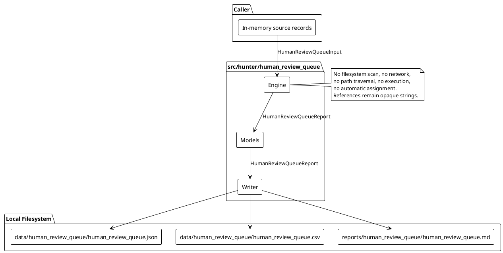
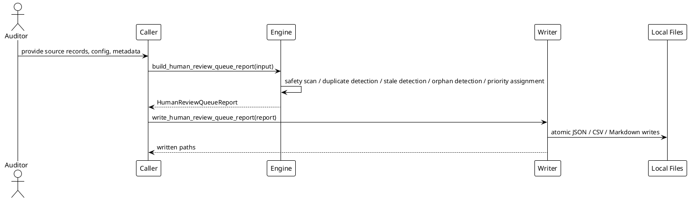

# SPEC-041-Local Research Human Review Queue

## Background

MVP-37 added an audit-only Local Research Remediation Backlog Planner, MVP-38 added an audit-only Local Research Remediation Evidence Tracker, and MVP-39 added an audit-only Local Research Remediation Closure Register. Each MVP produces caller-provided local records that a human auditor may need to inspect.

MVP-40 extends this audit-only research surface with a Local Research Human Review Queue. A human auditor needs to know which backlog, evidence, closure, issue, report summary, or manual note records indicate that a human review is required, why each item is queued, and how urgently it should be reviewed. The queue answers questions such as:

- Which backlog/evidence/closure records need manual human review?
- Why is each item in the review queue?
- Which items are blocking, advisory, informational, stale, disputed, missing evidence, missing review, unsafe, duplicated, orphaned, or incomplete?
- Which queue entries are highest priority for human audit attention?
- Which queue entries are already acknowledged/deferred/not-applicable for audit tracking only?
- Which queue entries must not be interpreted as approval, certification, readiness, recommendation, suitability, signal, or executable remediation plan?

The queue is local, call-triggered, deterministic, and produces human-audit artifacts only. It never executes remediation, never assigns work to real people or systems, never claims readiness, and never opens or validates referenced paths. "Queued for review" means only that caller-provided local records indicate that a human auditor may need to inspect this record.

## Requirements

### Must have

1. A new package `src/hunter/human_review_queue/` with frozen dataclass models, a pure-local engine, and a writer module.
2. `HumanReviewQueueInput` accepts only caller-provided in-memory records:
   - `source_records`: tuple of `HumanReviewSourceRecord`
   - `config`: `HumanReviewQueueConfig`
   - `project_version`: `str`
   - `metadata`: `Mapping[str, str] = field(default_factory=dict)`
   - `generated_at`: `datetime | None`
3. `HumanReviewSourceRecord` must support caller-provided summaries from prior MVPs without importing those packages at runtime:
   - `source_id`: `str`
   - `source_kind`: `str` — one of `backlog_item`, `evidence_record`, `closure_record`, `issue`, `report_summary`, `manual_note`
   - `record_id`: `str`
   - `related_record_ids`: `tuple[str, ...]`
   - `title`: `str`
   - `description`: `str`
   - `state`: `str`
   - `severity`: `str`
   - `reason_codes`: `tuple[str, ...]`
   - `owner`: `str`
   - `reviewer`: `str`
   - `generated_at`: `datetime | None`
   - `artifact_ref`: `str` — opaque reference string
   - `report_ref`: `str` — opaque reference string
   - `metadata`: `Mapping[str, str] = field(default_factory=dict)`
4. Deterministic `report_id` using SHA-256 over canonical JSON built from sorted source IDs, `project_version`, and `generated_at`.
5. Deterministic `queue_entry_id` using SHA-256 over canonical JSON of `source_id`, `source_kind`, `record_id`, sorted `reason_codes`, `priority`, and `generated_at`.
6. Deterministic `issue_id` using SHA-256 over canonical JSON content hash of the issue.
7. Detect duplicate source IDs within `source_records` (fail-closed).
8. Detect duplicate queue entries (same source + same priority + same reason) and emit informational duplicates without double-counting the audit workload.
9. Detect orphan `related_record_ids` by checking each ID against the normalized sets of `source_id` and `record_id` values from the input; a related ID is orphaned only when it appears in neither set. No filesystem or external lookup is performed.
10. Detect stale source records using `config.staleness_threshold_seconds`: `record.generated_at < report.generated_at - timedelta(seconds=config.staleness_threshold_seconds)`.
11. Detect unsafe content in metadata, titles, descriptions, labels, messages, and reason text (fail-closed).
12. Forbidden-term scanning must use multi-word phrases only to avoid single-word false positives.
13. Queue entry states: `QUEUED`, `BLOCKED`, `PENDING_REVIEW`, `STALE`, `DISPUTED`, `DUPLICATE`, `ORPHANED`, `ACKNOWLEDGED`, `DEFERRED`, `NOT_APPLICABLE`, `SUPPRESSED`.
14. Queue entry priorities: `CRITICAL`, `HIGH`, `MEDIUM`, `LOW`, `INFO`.
15. Decision hints: `REVIEW_REQUIRED`, `REVIEW_OPTIONAL`, `ALREADY_ACKNOWLEDGED`, `DEFERRED_FOR_LATER_AUDIT`, `NOT_APPLICABLE_FOR_AUDIT`, `SUPPRESSED_BY_CONFIG`.
16. Severity classification: `BLOCKING`, `ADVISORY`, `INFO`.
17. Queue entry generation from source records with:
    - blocking severity
    - advisory severity when `config.include_advisory` is True
    - stale records when `config.include_stale` is True
    - disputed/conflicting states
    - missing evidence / missing review / missing closure metadata reasons when indicated by reason codes
    - unsafe content
    - duplicate/orphan indicators
    - pending review states
    - manual_note records when `config.include_manual_notes` is True
18. Priority semantics: deterministic first-match-wins precedence:
    1. `CRITICAL` — unsafe content, forbidden terms, blocking issue, or fail-closed duplicate source ID.
    2. `HIGH` — disputed/conflicting/rejected/missing evidence when required.
    3. `MEDIUM` — pending review, stale, partial/incomplete metadata.
    4. `LOW` — advisory/manual note/deferred/acknowledged review tracking.
    5. `INFO` — informational/not-applicable records.
19. Decision hints are non-executable and audit-only; they are not approvals, task assignments, recommendations, or remediation steps.
20. Aggregate state:
    - Empty input (no source records) → `NOT_APPLICABLE`.
    - Any blocking issue or unsafe content → `BLOCKED`.
    - Any queued `CRITICAL` or `HIGH` priority item → `DEGRADED` unless a blocking issue already exists.
    - `ADVISORY` severity and `LOW` priority queue entries do not degrade the aggregate state. The queue is expected to contain advisory items as part of normal operation.
    - No blocking/degrading/queued critical/high item → `OK`.
    - `NOT_APPLICABLE`/`INFO` does not block.
    - In strict mode (`config.strict`), any `ADVISORY` severity queue entry promotes the aggregate state to `DEGRADED`, which is then promoted to `BLOCKED` by the strict-mode rule below.
    - Strict mode (`config.strict`) promotes any `DEGRADED`/`BLOCKED` to `BLOCKED`.
    - Unsafe content fail-closed.
21. Writer functions that accept a single `HumanReviewQueueReport` argument:
    - `human_review_queue_report_to_dict`
    - `human_review_queue_report_to_json_text`
    - `human_review_queue_report_to_csv_text`
    - `human_review_queue_report_to_markdown_text`
    - `write_human_review_queue_report`
22. Default local artifact paths:
    - `data/human_review_queue/human_review_queue.json`
    - `data/human_review_queue/human_review_queue.csv`
    - `reports/human_review_queue/human_review_queue.md`
23. Writer `_DEFAULT_PATH = object()` sentinel behavior: omitted path writes default, `None` skips, explicit path writes only that path.
24. Markdown includes H1 title, immediate audit-only/research-only/human-audit safety notice, and explicit statement that queued-for-review is not approval, certification, production readiness, trading readiness, recommendation, suitability assessment, signal, task assignment, or executable remediation plan.
25. CSV contains queue entry rows with columns: `report_id`, `generated_at`, `queue_entry_id`, `source_id`, `source_kind`, `record_id`, `entry_state`, `priority`, `decision_hint`, `severity`, `reason_codes`, `message`. The CSV `message` column is derived deterministically from `HumanReviewQueueEntry.description`; if `description` is empty, use `title`; if both are empty, use an empty string.
26. All path/report/artifact references remain opaque strings; the engine and writer never open, follow, traverse, validate, fetch, or execute referenced paths.

### Should have

1. Configurable `staleness_threshold_seconds` default (e.g., 30 days).
2. Configurable `include_advisory` flag (default True).
3. Configurable `include_stale` flag (default True).
4. Configurable `include_manual_notes` flag (default True).
5. Configurable `strict` flag (default False).
6. Configurable `forbid_action_terms` flag (default True). When False, the engine disables forbidden multi-word action-term scanning only; all other safety checks (unsafe content detection, duplicate IDs, blocking severity) remain active.
7. Configurable `suppress_acknowledged` flag (default False) — when True, acknowledged records are emitted with `SUPPRESSED` state and `SUPPRESSED_BY_CONFIG` decision hint.
8. Reason-code string constants for ergonomic public API use.

### Could have

1. Optional `notes` field on the report for free-form human-audit context.
2. Optional `reviewed_at` field on source records for future audit timeline.
3. Future batch import of queue items from caller-provided manifests.

### Won't have

1. No filesystem scanning, import introspection, or repository traversal.
2. No live trading, orders, exchange/Binance/API/network usage.
3. No Freqtrade strategy import or runtime.
4. No leverage/shorting execution.
5. No Web UI, dashboard, server, database, scheduler, or daemon.
6. No actionable buy/sell/hold signals or recommendations.
7. No approvals, certifications, production-readiness, or trading-readiness claims.
8. No automated remediation execution, file edits, code patches, shell commands, deployment actions, infrastructure changes, or executable steps as output.
9. No automatic assignment to real people, accounts, systems, tickets, or external services.

## Method

### Architecture overview

The Human Review Queue is a local research package with three layers:

1. **Models** (`src/hunter/human_review_queue/models.py`) — frozen dataclasses, enums, constants, and safety helpers.
2. **Engine** (`src/hunter/human_review_queue/engine.py`) — pure function `build_human_review_queue_report(input) -> HumanReviewQueueReport` that runs all detection, classification, and queue generation.
3. **Writer** (`src/hunter/human_review_queue/writer.py`) — deterministic serialization to JSON, CSV, and Markdown with atomic local writes.

All inputs are caller-provided in-memory records. The engine and writer do not access the network, filesystem, or any referenced paths. They are deterministic, fail-closed on safety issues, and emit only human-audit artifacts.

### In-memory models

```python
from dataclasses import dataclass, field
from datetime import datetime
from enum import Enum
from collections.abc import Mapping
from typing import Any

HUMAN_REVIEW_QUEUE_VERSION: str = "0.40.0-dev"

class HumanReviewQueueState(Enum):
    OK = "ok"
    DEGRADED = "degraded"
    BLOCKED = "blocked"
    NOT_APPLICABLE = "not_applicable"

class HumanReviewQueueSeverity(Enum):
    BLOCKING = "blocking"
    ADVISORY = "advisory"
    INFO = "info"

class HumanReviewQueueReasonCode(Enum):
    OK = "ok"
    NOT_APPLICABLE = "not_applicable"
    CONSISTENCY_DEGRADED = "consistency_degraded"
    SAFETY_BLOCKED = "safety_blocked"
    UNSAFE_CONTENT = "unsafe_content"
    FORBIDDEN_TERM_PRESENT = "forbidden_term_present"
    DUPLICATE_SOURCE_ID = "duplicate_source_id"
    DUPLICATE_QUEUE_ENTRY = "duplicate_queue_entry"
    ORPHAN_RELATED_RECORD = "orphan_related_record"
    STALE_SOURCE_RECORD = "stale_source_record"
    BLOCKING_SEVERITY = "blocking_severity"
    ADVISORY_SEVERITY = "advisory_severity"
    INFO_SEVERITY = "info_severity"
    DISPUTED_STATE = "disputed_state"
    PENDING_REVIEW_STATE = "pending_review_state"
    MISSING_EVIDENCE = "missing_evidence"
    MISSING_REVIEW = "missing_review"
    MISSING_CLOSURE_METADATA = "missing_closure_metadata"
    MANUAL_REVIEW_REQUIRED = "manual_review_required"

class HumanReviewQueueEntryState(Enum):
    QUEUED = "queued"
    BLOCKED = "blocked"
    PENDING_REVIEW = "pending_review"
    STALE = "stale"
    DISPUTED = "disputed"
    DUPLICATE = "duplicate"
    ORPHANED = "orphaned"
    ACKNOWLEDGED = "acknowledged"
    DEFERRED = "deferred"
    NOT_APPLICABLE = "not_applicable"
    SUPPRESSED = "suppressed"

class HumanReviewQueuePriority(Enum):
    CRITICAL = "critical"
    HIGH = "high"
    MEDIUM = "medium"
    LOW = "low"
    INFO = "info"

class HumanReviewQueueSourceKind(Enum):
    BACKLOG_ITEM = "backlog_item"
    EVIDENCE_RECORD = "evidence_record"
    CLOSURE_RECORD = "closure_record"
    ISSUE = "issue"
    REPORT_SUMMARY = "report_summary"
    MANUAL_NOTE = "manual_note"

class HumanReviewQueueDecisionHint(Enum):
    REVIEW_REQUIRED = "review_required"
    REVIEW_OPTIONAL = "review_optional"
    ALREADY_ACKNOWLEDGED = "already_acknowledged"
    DEFERRED_FOR_LATER_AUDIT = "deferred_for_later_audit"
    NOT_APPLICABLE_FOR_AUDIT = "not_applicable_for_audit"
    SUPPRESSED_BY_CONFIG = "suppressed_by_config"

class HumanReviewQueueIssueType(Enum):
    UNSAFE_CONTENT = "unsafe_content"
    FORBIDDEN_TERM = "forbidden_term"
    DUPLICATE_SOURCE_ID = "duplicate_source_id"
    DUPLICATE_QUEUE_ENTRY = "duplicate_queue_entry"
    ORPHAN_RELATED_RECORD = "orphan_related_record"
    STALE_SOURCE_RECORD = "stale_source_record"
    BLOCKING_SEVERITY = "blocking_severity"
    ADVISORY_SEVERITY = "advisory_severity"
    INFO_SEVERITY = "info_severity"
    DISPUTED_STATE = "disputed_state"
    PENDING_REVIEW_STATE = "pending_review_state"
    MISSING_EVIDENCE = "missing_evidence"
    MISSING_REVIEW = "missing_review"
    MISSING_CLOSURE_METADATA = "missing_closure_metadata"

# String constants for ergonomic public API use.
OK = HumanReviewQueueReasonCode.OK.value
NOT_APPLICABLE_RC = HumanReviewQueueReasonCode.NOT_APPLICABLE.value
CONSISTENCY_DEGRADED = HumanReviewQueueReasonCode.CONSISTENCY_DEGRADED.value
SAFETY_BLOCKED = HumanReviewQueueReasonCode.SAFETY_BLOCKED.value
UNSAFE_CONTENT = HumanReviewQueueReasonCode.UNSAFE_CONTENT.value
FORBIDDEN_TERM_PRESENT = HumanReviewQueueReasonCode.FORBIDDEN_TERM_PRESENT.value
DUPLICATE_SOURCE_ID = HumanReviewQueueReasonCode.DUPLICATE_SOURCE_ID.value
DUPLICATE_QUEUE_ENTRY = HumanReviewQueueReasonCode.DUPLICATE_QUEUE_ENTRY.value
ORPHAN_RELATED_RECORD = HumanReviewQueueReasonCode.ORPHAN_RELATED_RECORD.value
STALE_SOURCE_RECORD = HumanReviewQueueReasonCode.STALE_SOURCE_RECORD.value
BLOCKING_SEVERITY = HumanReviewQueueReasonCode.BLOCKING_SEVERITY.value
ADVISORY_SEVERITY = HumanReviewQueueReasonCode.ADVISORY_SEVERITY.value
INFO_SEVERITY = HumanReviewQueueReasonCode.INFO_SEVERITY.value
DISPUTED_STATE = HumanReviewQueueReasonCode.DISPUTED_STATE.value
PENDING_REVIEW_STATE = HumanReviewQueueReasonCode.PENDING_REVIEW_STATE.value
MISSING_EVIDENCE = HumanReviewQueueReasonCode.MISSING_EVIDENCE.value
MISSING_REVIEW = HumanReviewQueueReasonCode.MISSING_REVIEW.value
MISSING_CLOSURE_METADATA = HumanReviewQueueReasonCode.MISSING_CLOSURE_METADATA.value
MANUAL_REVIEW_REQUIRED = HumanReviewQueueReasonCode.MANUAL_REVIEW_REQUIRED.value

# Multi-word forbidden phrases only.
FORBIDDEN_HUMAN_REVIEW_QUEUE_TERMS: frozenset[str] = frozenset({
    "deploy immediately", "execute now", "run this command", "apply patch",
    "production ready", "trading ready", "live trading", "place order",
    "execute order", "buy signal", "sell signal", "hold signal", "go live",
    "push to production", "infrastructure change", "automated remediation",
    "self healing", "auto fix", "certified safe", "approved for deployment",
    "suitable for trading", "recommendation to trade", "exchange api",
    "binance key", "api key", "private key", "leverage up", "short squeeze",
    "margin call", "liquidate position", "close and trade", "close now",
    "release to production", "assign to", "create ticket", "open jira",
    "send email", "notify team", "auto assign", "task assignment",
})

def has_unsafe_human_review_queue_content(value: Any) -> bool: ...

@dataclass(frozen=True, slots=True)
class HumanReviewQueueSafetyFlags:
    no_executable_actions: bool = True
    no_trading_instructions: bool = True
    no_approval_claims: bool = True
    no_automated_remediation: bool = True
    no_automatic_assignment: bool = True
    references_opaque: bool = True
    audit_only: bool = True
    queued_not_approval: bool = True
    has_unsafe_content: bool = False
    has_forbidden_terms: bool = False
    @property
    def is_safe(self) -> bool: ...

@dataclass(frozen=True, slots=True)
class HumanReviewQueueConfig:
    strict: bool = False
    include_advisory: bool = True
    include_stale: bool = True
    include_manual_notes: bool = True
    suppress_acknowledged: bool = False
    staleness_threshold_seconds: int = 2_592_000  # 30 days
    forbid_action_terms: bool = True

@dataclass(frozen=True, slots=True)
class HumanReviewSourceRecord:
    source_id: str = ""
    source_kind: str = ""  # backlog_item, evidence_record, closure_record, issue, report_summary, manual_note
    record_id: str = ""
    related_record_ids: tuple[str, ...] = ()
    title: str = ""
    description: str = ""
    state: str = ""  # open, blocked, acknowledged, deferred, not_applicable, conflicting, pending_review, disputed, etc.
    severity: str = ""  # blocking, advisory, info
    reason_codes: tuple[str, ...] = ()
    owner: str = ""
    reviewer: str = ""
    generated_at: datetime | None = None
    artifact_ref: str = ""  # opaque reference string
    report_ref: str = ""  # opaque reference string
    metadata: Mapping[str, str] = field(default_factory=dict)

@dataclass(frozen=True, slots=True)
class HumanReviewQueueEntry:
    queue_entry_id: str = ""
    source_id: str = ""
    source_kind: str = ""
    record_id: str = ""
    entry_state: str = "queued"
    priority: str = "info"
    decision_hint: str = "review_required"
    severity: str = "info"
    reason_codes: tuple[str, ...] = ()
    title: str = ""
    description: str = ""
    generated_at: datetime | None = None
    metadata: Mapping[str, str] = field(default_factory=dict)

@dataclass(frozen=True, slots=True)
class HumanReviewQueueIssue:
    issue_id: str = ""
    issue_type: str = ""
    severity: str = "info"
    reason_codes: tuple[str, ...] = ()
    title: str = ""
    description: str = ""
    source_id: str = ""
    record_id: str = ""
    generated_at: datetime | None = None
    metadata: Mapping[str, str] = field(default_factory=dict)

@dataclass(frozen=True, slots=True)
class HumanReviewQueueDataQuality:
    total_source_records: int = 0
    total_queue_entries: int = 0
    total_issues: int = 0
    duplicate_source_id_count: int = 0
    duplicate_queue_entry_count: int = 0
    orphan_related_record_count: int = 0
    stale_source_record_count: int = 0
    unsafe_content_count: int = 0
    forbidden_term_count: int = 0
    blocking_count: int = 0
    advisory_count: int = 0
    info_count: int = 0
    critical_count: int = 0
    high_count: int = 0
    medium_count: int = 0
    low_count: int = 0
    info_priority_count: int = 0
    sections_present: int = 0

@dataclass(frozen=True, slots=True)
class HumanReviewQueueInput:
    source_records: tuple[HumanReviewSourceRecord, ...] = ()
    config: HumanReviewQueueConfig = field(default_factory=HumanReviewQueueConfig)
    project_version: str = HUMAN_REVIEW_QUEUE_VERSION
    metadata: Mapping[str, str] = field(default_factory=dict)
    generated_at: datetime | None = None

@dataclass(frozen=True, slots=True)
class HumanReviewQueueReport:
    report_id: str = ""
    generated_at: datetime | None = None
    state: HumanReviewQueueState = HumanReviewQueueState.NOT_APPLICABLE
    project_version: str = HUMAN_REVIEW_QUEUE_VERSION
    source_records: tuple[HumanReviewSourceRecord, ...] = ()
    queue_entries: tuple[HumanReviewQueueEntry, ...] = ()
    issues: tuple[HumanReviewQueueIssue, ...] = ()
    data_quality: HumanReviewQueueDataQuality = field(default_factory=HumanReviewQueueDataQuality)
    safety_flags: HumanReviewQueueSafetyFlags = field(default_factory=HumanReviewQueueSafetyFlags)
    reason_codes: tuple[HumanReviewQueueReasonCode, ...] = ()
    metadata: Mapping[str, str] = field(default_factory=dict)
    safety_notice: str = ""
    notes: str = ""
    @classmethod
    def blocked(cls, *, input: "HumanReviewQueueInput", reason_code: HumanReviewQueueReasonCode = HumanReviewQueueReasonCode.UNSAFE_CONTENT, notes: str = "") -> "HumanReviewQueueReport": ...
```

All forbidden terms are multi-word phrases. The matcher is case-insensitive substring match. Benign examples that must NOT match include: `pending approval from security team`, `certification body`, `no recommendation needed`, `signal processing`, `no signal detected`, `assign a reviewer`, `manual note for audit`.

### Engine behavior

The engine is implemented as `build_human_review_queue_report(input: HumanReviewQueueInput) -> HumanReviewQueueReport`.

1. **Normalize generated_at** — use `input.generated_at` or `datetime.now(timezone.utc)`. If `source_records` is empty, return a deterministic report with `state` set to `NOT_APPLICABLE`, empty `queue_entries`, no blocking issues, and empty data quality counters.
2. **Safety scan** — scan `metadata` and all text fields of source records for unsafe non-string values. If `config.forbid_action_terms` is True, also scan for forbidden multi-word phrases. If found, set `safety_flags` and emit blocking `UNSAFE_CONTENT`/`FORBIDDEN_TERM_PRESENT` issues.
3. **Detect duplicate source IDs** — within `source_records`, detect duplicate normalized `source_id` values. Emit blocking `DUPLICATE_SOURCE_ID` issues.
4. **Detect stale source records** — compare `record.generated_at` with `report.generated_at - staleness_threshold`. Emit `STALE_SOURCE_RECORD` issues and queue entries when `config.include_stale` is True.
5. **Detect orphan related_record_ids** — for each source record, if a `related_record_id` is not present in the normalized set of `source_id` values **and** not present in the normalized set of `record_id` values from the input, emit an `ORPHAN_RELATED_RECORD` issue. A related ID is orphaned only when it appears in neither set. No filesystem or external lookup is performed.
6. **Map source severity to queue severity** — record severity `blocking` maps to `BLOCKING`; `advisory` maps to `ADVISORY` when `config.include_advisory` is True; `info` maps to `INFO`.
7. **Map source state to queue entry state** —
    - `blocked`, `open`, or `conflicting` → `BLOCKED` (if severity is blocking) or `QUEUED`.
    - `pending_review` → `PENDING_REVIEW`.
    - `disputed` → `DISPUTED`.
    - `acknowledged` → `ACKNOWLEDGED` (or `SUPPRESSED` when `config.suppress_acknowledged` is True).
    - `deferred` → `DEFERRED`.
    - `not_applicable` → `NOT_APPLICABLE`.
    - `manual_note` source kind → `QUEUED` if `config.include_manual_notes` is True; otherwise `SUPPRESSED`.
8. **Map reason codes to queue entries** — reason codes such as `missing_evidence`, `missing_review`, `missing_closure_metadata`, `disputed_state`, `pending_review_state` produce queue entries with appropriate priority and decision hint.
9. **Assign priority** — first-match-wins based on the priority semantics above.
10. **Assign decision hint** — based on entry state and config: `REVIEW_REQUIRED` for queued/blocking/pending/disputed entries; `REVIEW_OPTIONAL` for advisory/stale entries; `ALREADY_ACKNOWLEDGED` for acknowledged entries; `DEFERRED_FOR_LATER_AUDIT` for deferred entries; `NOT_APPLICABLE_FOR_AUDIT` for not-applicable entries; `SUPPRESSED_BY_CONFIG` for suppressed entries.
11. **Detect duplicate queue entries** — if the same source record would produce the same queue entry (same source_id, source_kind, record_id, priority, and reason_codes), emit a `DUPLICATE_QUEUE_ENTRY` info issue and keep one primary entry.
12. **Assign determinism** — sort all output collections by normalized IDs, then by generated_at. Assign deterministic IDs to generated issues and queue entries.
13. **Aggregate state** — compute overall state using the priority/severity rules above: blocking issues produce `BLOCKED`; queued `CRITICAL`/`HIGH` priority items produce `DEGRADED` unless already `BLOCKED`; `ADVISORY`/`LOW` entries do not degrade unless `config.strict` is True (which promotes them to `DEGRADED` and then to `BLOCKED`). Empty input produces `NOT_APPLICABLE`. All other cases produce `OK`.
14. **Safety notice** — include a fixed safety notice that the report is a local, audit-only research artifact and does not imply approval, assignment, or readiness.

### Writer behavior

The writer module exposes the same pattern as MVP-36 through MVP-39:

- `human_review_queue_report_to_dict(report) -> dict[str, Any]`
- `human_review_queue_report_to_json_text(report) -> str`
- `human_review_queue_report_to_csv_text(report) -> str`
- `human_review_queue_report_to_markdown_text(report) -> str`
- `write_human_review_queue_report(report, json_path=_DEFAULT_PATH, csv_path=_DEFAULT_PATH, md_path=_DEFAULT_PATH, ...)`
- Atomic write helpers for each format.

The writer uses `_DEFAULT_PATH = object()` as a sentinel: omitting a path argument writes to the default local artifact path; passing `None` skips that artifact; passing an explicit `Path` writes only to that local path. The writer creates parent directories and writes atomically via a temporary file rename.

Markdown output includes the H1 title, safety notice, summary, queue entries, source records, issues, data quality, safety flags, and reason codes. No shell commands, patch instructions, deployment commands, trading instructions, automated remediation actions, or task assignment instructions appear in the output.

### Deterministic IDs and order

- `report_id` = SHA-256 of canonical JSON over sorted normalized `source_id` values, `project_version`, and `generated_at`.
- `queue_entry_id` = SHA-256 of canonical JSON over `source_id`, `source_kind`, `record_id`, sorted `reason_codes`, `priority`, and `generated_at`.
- `issue_id` = SHA-256 of canonical JSON over the issue content (type, severity, reason codes, related IDs, title, description).
- All output tuples are sorted deterministically by normalized IDs and generated_at.

### Queue state semantics

- `QUEUED` — the source record indicates a potential human review need.
- `BLOCKED` — the source record has blocking severity, unsafe content, or a fail-closed duplicate source ID.
- `PENDING_REVIEW` — the source record is awaiting human review.
- `STALE` — the source record is older than the configured staleness threshold.
- `DISPUTED` — the source record state or reason codes indicate a dispute.
- `DUPLICATE` — the same source record produced a duplicate queue entry.
- `ORPHANED` — the source record references a related record ID that is not present in the input.
- `ACKNOWLEDGED` — the source record state is acknowledged; queued for audit tracking only.
- `DEFERRED` — the source record state is deferred for later audit review.
- `NOT_APPLICABLE` — the source record state is not applicable for this audit review.
- `SUPPRESSED` — the entry was suppressed by configuration.

Queue entries are for human-audit tracking only and do not instruct action, assign tasks, or imply readiness.

### Review priority semantics

Priority is assigned by first-match-wins precedence:

1. `CRITICAL` — unsafe content, forbidden terms, blocking severity, or fail-closed duplicate source ID.
2. `HIGH` — disputed state, rejected/missing review, missing evidence when required, conflicting state.
3. `MEDIUM` — pending review, stale record, partial/incomplete metadata, advisory severity.
4. `LOW` — manual notes, deferred or acknowledged advisory records, deferred/acknowledged review tracking.
5. `INFO` — informational or not-applicable records.

Priority is a triage hint for the human auditor, not a task assignment or execution instruction.

### Review reason semantics

Reason codes describe why a source record appears in the queue. They are derived from the source record's own reason codes, its severity, state, staleness, and relationships. Reason codes are for audit classification only and do not imply approval or action.

### Data quality

`HumanReviewQueueDataQuality` summarizes counts for all detected patterns: totals, duplicates, orphans, staleness, unsafe content, forbidden terms, severity distributions, priority distributions, and logical sections present. It is immutable and constructed once at the end of engine execution.

### Safety flags

`HumanReviewQueueSafetyFlags` tracks unsafe content and forbidden terms. Both trigger blocking behavior and `SAFETY_BLOCKED` aggregation. Baseline positive safety invariants (no executable actions, no trading instructions, no approval claims, no automated remediation, no automatic assignment, references opaque, audit-only, queued-not-approval) must all be True.

### Failure semantics

- If the input contains unsafe content or forbidden terms, the engine returns a `BLOCKED` report with a minimal safe payload and does not process queue semantics further.
- If duplicate source IDs are detected, the engine returns `BLOCKED` with `DUPLICATE_SOURCE_ID` reason codes.
- In strict mode, any `DEGRADED` or `BLOCKED` aggregate state is promoted to `BLOCKED`.
- All errors are reported through `issues` and `reason_codes`; the engine never raises exceptions for invalid input unless validation is impossible.

### PlantUML component diagram



### PlantUML sequence diagram



### Explicit statement on opaque references

All `source_id`, `record_id`, `related_record_ids`, `artifact_ref`, `report_ref`, and metadata values are opaque strings. The engine and writer never open, follow, traverse, validate, fetch, or execute them. They are only used for identity comparison, deterministic sorting, and human-audit serialization.

## Implementation

Implement MVP-40 in four steps, mirroring MVP-36 through MVP-39:

### Step 1: Models and Engine

- `src/hunter/human_review_queue/__init__.py` with public exports.
- `src/hunter/human_review_queue/models.py` with all frozen dataclasses, enums, constants, and safety helpers.
- `src/hunter/human_review_queue/engine.py` with `build_human_review_queue_report` and all detection/classification helpers.
- `tests/test_human_review_queue/test_models.py` — model validation and safety helpers.
- `tests/test_human_review_queue/test_engine.py` — focused engine tests.

### Step 2: Writer

- `src/hunter/human_review_queue/writer.py` with dict/JSON/CSV/Markdown serialization and atomic writes.
- `tests/test_human_review_queue/test_writer.py` — focused writer tests.

### Step 3: Integration Tests

- `tests/test_human_review_queue/test_integration.py` — end-to-end flows using only the public API.

### Step 4: Finalization

- Bump `src/hunter/__init__.py` version to `0.40.0-dev`.
- Update `CHANGELOG.md` with MVP-40 entry.
- Update `tasks/active.md` to mark MVP-40 complete with test results and tag target `v0.40.0-dev`.

### Test Plan

#### Step 1: Models + Engine tests

- Model defaults and frozen/slot-based immutability.
- Safety flags validation (`is_safe` when no unsafe content or forbidden terms).
- Deterministic IDs and tuple ordering (`report_id`, `queue_entry_id`, `issue_id` stable for identical inputs).
- Duplicate source IDs fail-closed across source records.
- Duplicate queue entries produce a single primary entry and a `DUPLICATE_QUEUE_ENTRY` info issue.
- Orphan related record IDs when the referenced ID is not present in the input set.
- Stale source records using `staleness_threshold_seconds`.
- Blocking/advisory/info input mapping.
- Source kind mapping (backlog_item, evidence_record, closure_record, issue, report_summary, manual_note).
- Queue entry state mapping.
- Priority first-match-wins.
- Decision hints are non-executable.
- Unsafe metadata/content.
- Forbidden-term false-positive avoidance.
- Opaque path/reference behavior.
- No mutation of input collections.
- No filesystem scan/import/network.
- No executable remediation output.
- No automatic assignment output.

#### Step 2: Writer tests

- JSON serialization parseable and deterministic (enum values as strings, datetime ISO format, nested dataclasses).
- CSV queue entry rows with correct header and deterministic order.
- Markdown begins with H1 and immediate research-only/audit-only/human-audit safety notice.
- Markdown explicitly states queued-for-review is not approval, certification, production readiness, trading readiness, recommendation, suitability assessment, signal, task assignment, or executable remediation plan.
- Markdown includes summary, queue entries, source records, issues, data quality, safety flags, and reason code sections.
- Atomic writes to `tmp_path` produce JSON/CSV/Markdown files.
- `_DEFAULT_PATH` sentinel behavior: omitted writes defaults, `None` skips artifact, explicit path writes only that path.
- Parent directories created automatically.
- No executable remediation output, shell commands, patch instructions, deployment commands, trading instructions, or task assignment instructions in any writer output.
- No path/reference traversal or opening by the writer.

#### Step 3: Integration tests

- End-to-end build from `HumanReviewQueueInput` through `write_human_review_queue_report` to local files.
- Determinism: same input produces identical JSON/CSV/Markdown text and stable IDs across repeated engine calls.
- Public exports include `build_human_review_queue_report`, writer functions, and default path constants.
- Safety boundaries: outputs contain audit-only/research-only language, no actionable trading/execution/remediation language, no approval/readiness claims, no task assignment language.
- Opaque reference behavior end-to-end: refs remain strings and are never opened or validated.

## Milestones

1. SPEC-041 approved and committed.
2. Step 1: models + engine + tests passing.
3. Step 2: writer + tests passing.
4. Step 3: integration tests passing.
5. Step 4: finalization and version bump.
6. Tag `v0.40.0-dev`.

## Gathering Results

The Human Review Queue produces three local artifacts:

- `data/human_review_queue/human_review_queue.json` — full deterministic report.
- `data/human_review_queue/human_review_queue.csv` — queue entry rows for audit review.
- `reports/human_review_queue/human_review_queue.md` — human-readable audit summary.

These artifacts answer the design questions:

- Which backlog/evidence/closure records need manual human review? → `queue_entries`.
- Why is each item in the review queue? → `reason_codes` and `issues`.
- Which items are blocking, advisory, informational, stale, disputed, missing evidence, missing review, unsafe, duplicated, orphaned, or incomplete? → `entry_state`, `severity`, `priority`, and `reason_codes`.
- Which queue entries are highest priority? → `priority` and `critical_count`/`high_count` in data quality.
- Which queue entries are acknowledged/deferred/not-applicable? → `ACKNOWLEDGED`, `DEFERRED`, `NOT_APPLICABLE` entry states.
- Which queue entries must not be interpreted as approval, certification, readiness, recommendation, suitability, signal, or executable remediation plan? → the safety notice and explicit Markdown statements.

## Need Professional Help in Developing Your Architecture?

Please contact me at [sammuti.com](https://sammuti.com) :)

