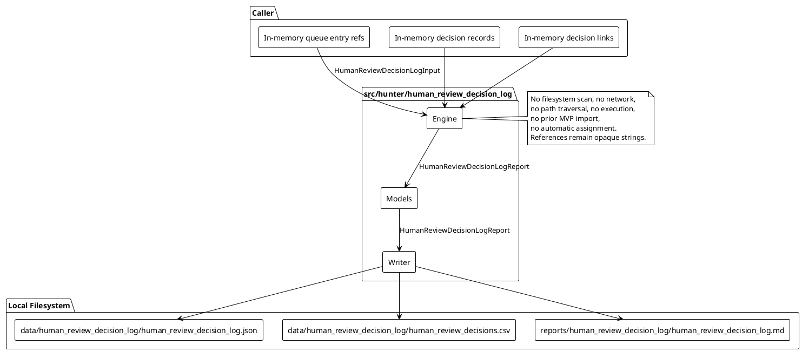
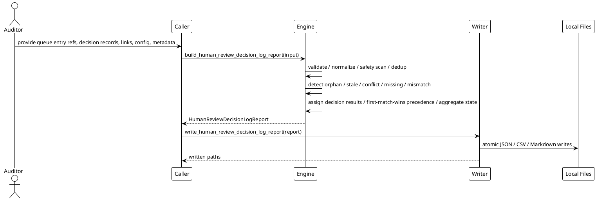

# SPEC-042-Local Research Human Review Decision Log

## Background

MVP-37 added an audit-only Local Research Remediation Backlog Planner, MVP-38 added an audit-only Local Research Remediation Evidence Tracker, MVP-39 added an audit-only Local Research Remediation Closure Register, and MVP-40 added an audit-only Local Research Human Review Queue. Each MVP produces caller-provided local records that a human auditor may need to inspect and decide upon.

MVP-41 extends this audit-only research surface with a Local Research Human Review Decision Log. A human auditor needs to know which caller-provided review queue entries have caller-provided decision records, which decisions are logged for audit purposes, and which decisions are pending, rejected, disputed, stale, duplicated, orphaned, incomplete, or unsafe. The decision log answers questions such as:

- Which human review queue entries have caller-provided decision records?
- Which decisions are accepted for audit logging only?
- Which decisions are pending, rejected, disputed, stale, duplicated, orphaned, incomplete, or unsafe?
- Which queue entries have no decision yet?
- Which decisions conflict with source queue state, priority, severity, or reason codes?
- Which decisions are missing required metadata such as reviewer, decided_at, rationale, decision outcome, or related queue entry ID?
- Which decision records are audit-only and must not be interpreted as approval, certification, readiness, recommendation, suitability, task assignment, or executable remediation plan?

The decision log is local, call-triggered, deterministic, and produces human-audit artifacts only. It never executes remediation, never assigns work to real people or systems, never claims readiness, and never opens or validates referenced paths. "Decision logged" means only "caller-provided human-review decision record exists and passed local consistency checks for human audit review." It is not approval, certification, deployment readiness, production readiness, trading readiness, recommendation, suitability assessment, signal validity, task completion, or executable remediation plan.

The decision log does not import prior MVP packages, open artifact paths, traverse reference strings, or inspect the repository. All queue entry references, artifact references, report paths, and metadata remain opaque local strings.

## Requirements

Use MoSCoW prioritization.

### Must have

1. A new package `src/hunter/human_review_decision_log/` with frozen dataclass models, a pure-local engine, and a writer module.
2. `HumanReviewDecisionLogInput` accepts only caller-provided in-memory records:
   - `queue_entry_refs`: tuple of `HumanReviewQueueEntryRef`
   - `decision_records`: tuple of `HumanReviewDecisionRecord`
   - `links`: tuple of `HumanReviewDecisionLink`
   - `config`: `HumanReviewDecisionLogConfig`
   - `project_version`: `str`
   - `metadata`: `Mapping[str, str] = field(default_factory=dict)`
   - `generated_at`: `datetime | None`
3. `HumanReviewQueueEntryRef` must support caller-provided queue entry summaries without importing prior MVP packages at runtime:
   - `queue_entry_id`: `str`
   - `source_id`: `str`
   - `source_kind`: `str`
   - `record_id`: `str`
   - `entry_state`: `str`
   - `priority`: `str`
   - `severity`: `str`
   - `reason_codes`: `tuple[str, ...]`
   - `generated_at`: `datetime | None`
   - `artifact_ref`: `str` — opaque reference string
   - `report_ref`: `str` — opaque reference string
   - `metadata`: `Mapping[str, str] = field(default_factory=dict)`
4. `HumanReviewDecisionRecord` must support caller-provided human decision records:
   - `decision_id`: `str`
   - `queue_entry_id`: `str`
   - `reviewer`: `str`
   - `decided_at`: `datetime | None`
   - `outcome`: `str` — one of `HumanReviewDecisionOutcome`
   - `rationale`: `str`
   - `reason_codes`: `tuple[str, ...]`
   - `generated_at`: `datetime | None`
   - `artifact_ref`: `str` — opaque reference string
   - `report_ref`: `str` — opaque reference string
   - `metadata`: `Mapping[str, str] = field(default_factory=dict)`
5. `HumanReviewDecisionLink` must support caller-provided links between decisions or between decisions and other records:
   - `link_id`: `str`
   - `source_id`: `str`
   - `target_id`: `str`
   - `link_type`: `str` — one of `HumanReviewDecisionLinkType`
   - `generated_at`: `datetime | None`
   - `metadata`: `Mapping[str, str] = field(default_factory=dict)`
6. Deterministic `report_id` using SHA-256 over canonical JSON built from sorted queue_entry IDs, decision IDs, link IDs, `project_version`, and `generated_at`.
7. Deterministic `decision_result_id` per queue entry using SHA-256 over canonical JSON of `queue_entry_id`, sorted associated decision IDs, decision state, outcome, validity, and `generated_at`.
8. Deterministic `issue_id` using SHA-256 over canonical JSON content hash of the issue.
9. Detect duplicate queue entry ref IDs within `queue_entry_refs` (fail-closed).
10. Detect duplicate decision IDs within `decision_records` (fail-closed).
11. Detect duplicate link IDs within `links` (fail-closed).
12. Duplicate IDs fail closed — any duplicate ID detection immediately produces a `BLOCKED` report.
13. Detect semantic duplicate decision records (same queue_entry_id, same reviewer, same outcome, same rationale) and emit informational findings without double-counting.
14. Detect orphan decision records where `queue_entry_id` is not present in known queue entry ref IDs.
15. Detect orphan links where `source_id` or `target_id` is not present in known queue entry ref IDs or decision IDs.
16. Detect queue entries with no decision when `config.require_decision_for_all` is True.
17. Detect conflicting decisions for the same `queue_entry_id` (multiple decisions with different outcomes or from different reviewers).
18. Detect conflicting decision outcomes from the same reviewer or across reviewers for the same queue entry.
19. Detect stale queue entries and stale decisions using `config.staleness_threshold_seconds`:
    `record.generated_at < report.generated_at - timedelta(seconds=config.staleness_threshold_seconds)`.
20. Detect missing `reviewer`/`decided_at`/`rationale`/`outcome`/`queue_entry_id` when required.
21. Detect decision outcome mismatch with queue entry state, priority, severity, or reason codes.
22. Detect decision records that claim approval, readiness, task completion, or executable remediation semantics (fail-closed via forbidden terms).
23. Detect unsafe content in metadata, titles, descriptions, labels, messages, and rationale (fail-closed).
24. Forbidden-term scanning must use multi-word phrases only to avoid single-word false positives.
25. All `artifact_ref`/`report_ref`/path-like metadata are opaque strings. Never open/follow/traverse/validate/fetch/execute referenced paths.
26. Build deterministic decision results, issues, and report.
27. Copy sorted queue_entry_refs, decision_records, links, issues, and decision_results into report. Never mutate caller input.
28. Every queue entry gets exactly one `HumanReviewDecisionResult` using first-match-wins decision precedence.
29. No network, API, exchange, file, database, or runtime dependencies in the engine.
30. No trading/approval/execution semantics. Output is human-research only.
31. Fail-closed on missing/invalid/unsafe inputs.

### Should have

1. Configurable `staleness_threshold_seconds` default (e.g., 30 days).
2. Configurable `require_decision_for_all` flag (default True).
3. Configurable `strict` flag (default False).
4. Configurable `forbid_action_terms` flag (default True).
5. Configurable `empty_input_is_not_applicable` flag (default True).
6. Reason-code string constants for ergonomic public API use.

### Could have

1. Optional `notes` field on the report for free-form human-audit context.
2. Per-issue diagnostic messages.
3. Human-interpretation narrative.

### Won't have

1. No filesystem scanning, import introspection, or repository traversal.
2. No live trading, orders, exchange/Binance/API/network usage.
3. No Freqtrade strategy import or runtime.
4. No leverage/shorting execution.
5. No Web UI, dashboard, server, database, scheduler, or daemon.
6. No actionable buy/sell/hold signals or recommendations.
7. No approvals, certifications, production-readiness, trading-readiness, suitability, recommendation, or task-completion claims.
8. No automated remediation execution, file edits, code patches, shell commands, deployment actions, infrastructure changes, or executable steps as output.
9. No automatic assignment to real people, accounts, systems, tickets, roles, queues, dashboards, or external services.
10. No external workflow, ticket, notification, approval, or identity-system integration.
11. No opening/following/traversing/validating/fetching/executing referenced paths.

## Method

### Architecture overview

The Human Review Decision Log is a local research package with three layers:

1. **Models** (`src/hunter/human_review_decision_log/models.py`) — frozen dataclasses, enums, constants, and safety helpers.
2. **Engine** (`src/hunter/human_review_decision_log/engine.py`) — pure function `build_human_review_decision_log_report(input) -> HumanReviewDecisionLogReport` that runs all detection, classification, decision result generation, and aggregation.
3. **Writer** (`src/hunter/human_review_decision_log/writer.py`) — deterministic serialization to JSON, CSV, and Markdown with atomic local writes.

All inputs are caller-provided in-memory records. The engine and writer do not access the network, filesystem, or any referenced paths. They are deterministic, fail-closed on safety issues, and emit only human-audit artifacts.

### In-memory models

```python
from dataclasses import dataclass, field
from datetime import datetime
from enum import Enum
from collections.abc import Mapping
from typing import Any

HUMAN_REVIEW_DECISION_LOG_VERSION: str = "0.41.0-dev"

class HumanReviewDecisionLogState(Enum):
    OK = "ok"
    DEGRADED = "degraded"
    BLOCKED = "blocked"
    NOT_APPLICABLE = "not_applicable"

class HumanReviewDecisionSeverity(Enum):
    BLOCKING = "blocking"
    ADVISORY = "advisory"
    INFO = "info"

class HumanReviewDecisionState(Enum):
    LOGGED = "logged"
    MISSING = "missing"
    INCOMPLETE = "incomplete"
    PENDING_REVIEW = "pending_review"
    REJECTED = "rejected"
    DISPUTED = "disputed"
    STALE = "stale"
    DUPLICATE = "duplicate"
    ORPHANED = "orphaned"
    SUPERSEDED = "superseded"
    NOT_APPLICABLE = "not_applicable"
    BLOCKED = "blocked"

class HumanReviewDecisionOutcome(Enum):
    ACCEPTED_FOR_AUDIT_LOG = "accepted_for_audit_log"
    REJECTED_FOR_AUDIT_LOG = "rejected_for_audit_log"
    NEEDS_MORE_REVIEW = "needs_more_review"
    DISPUTED = "disputed"
    DEFERRED = "deferred"
    NOT_APPLICABLE = "not_applicable"
    SUPERSEDED = "superseded"
    UNKNOWN = "unknown"

class HumanReviewDecisionValidity(Enum):
    VALID_FOR_AUDIT_LOG = "valid_for_audit_log"
    INVALID_FOR_AUDIT_LOG = "invalid_for_audit_log"
    PARTIAL = "partial"
    PENDING_REVIEW = "pending_review"
    DISPUTED = "disputed"
    STALE = "stale"
    NOT_APPLICABLE = "not_applicable"

class HumanReviewDecisionLinkType(Enum):
    REFERENCES = "references"
    SUPERSEDES = "supersedes"
    DERIVED_FROM = "derived_from"
    RELATED_TO = "related_to"
    UNKNOWN = "unknown"

class HumanReviewDecisionIssueType(Enum):
    UNSAFE_CONTENT = "unsafe_content"
    FORBIDDEN_TERM = "forbidden_term"
    DUPLICATE_QUEUE_ENTRY_ID = "duplicate_queue_entry_id"
    DUPLICATE_DECISION_ID = "duplicate_decision_id"
    DUPLICATE_LINK_ID = "duplicate_link_id"
    SEMANTIC_DUPLICATE_DECISION = "semantic_duplicate_decision"
    ORPHAN_DECISION = "orphan_decision"
    ORPHAN_LINK = "orphan_link"
    MISSING_DECISION = "missing_decision"
    CONFLICTING_DECISION = "conflicting_decision"
    CONFLICTING_OUTCOME = "conflicting_outcome"
    STALE_QUEUE_ENTRY = "stale_queue_entry"
    STALE_DECISION = "stale_decision"
    MISSING_REVIEWER = "missing_reviewer"
    MISSING_DECIDED_AT = "missing_decided_at"
    MISSING_RATIONALE = "missing_rationale"
    MISSING_OUTCOME = "missing_outcome"
    MISSING_QUEUE_ENTRY_ID = "missing_queue_entry_id"
    OUTCOME_MISMATCH = "outcome_mismatch"

class HumanReviewDecisionReasonCode(Enum):
    OK = "ok"
    NOT_APPLICABLE = "not_applicable"
    DECISION_LOGGED = "decision_logged"
    CONSISTENCY_DEGRADED = "consistency_degraded"
    SAFETY_BLOCKED = "safety_blocked"
    UNSAFE_CONTENT = "unsafe_content"
    FORBIDDEN_TERM_PRESENT = "forbidden_term_present"
    INVALID_INPUT_DATA = "invalid_input_data"
    DUPLICATE_QUEUE_ENTRY_ID = "duplicate_queue_entry_id"
    DUPLICATE_DECISION_ID = "duplicate_decision_id"
    DUPLICATE_LINK_ID = "duplicate_link_id"
    SEMANTIC_DUPLICATE_DECISION = "semantic_duplicate_decision"
    ORPHAN_DECISION = "orphan_decision"
    ORPHAN_LINK = "orphan_link"
    MISSING_DECISION = "missing_decision"
    CONFLICTING_DECISION = "conflicting_decision"
    CONFLICTING_OUTCOME = "conflicting_outcome"
    STALE_QUEUE_ENTRY = "stale_queue_entry"
    STALE_DECISION = "stale_decision"
    MISSING_REVIEWER = "missing_reviewer"
    MISSING_DECIDED_AT = "missing_decided_at"
    MISSING_RATIONALE = "missing_rationale"
    MISSING_OUTCOME = "missing_outcome"
    MISSING_QUEUE_ENTRY_ID = "missing_queue_entry_id"
    OUTCOME_MISMATCH = "outcome_mismatch"
    ADVISORY_FINDING = "advisory_finding"
    INFO_FINDING = "info_finding"
    BLOCKING_FINDING = "blocking_finding"

# String constants for ergonomic public API use.
OK = HumanReviewDecisionReasonCode.OK.value
NOT_APPLICABLE_RC = HumanReviewDecisionReasonCode.NOT_APPLICABLE.value
DECISION_LOGGED = HumanReviewDecisionReasonCode.DECISION_LOGGED.value
CONSISTENCY_DEGRADED = HumanReviewDecisionReasonCode.CONSISTENCY_DEGRADED.value
SAFETY_BLOCKED = HumanReviewDecisionReasonCode.SAFETY_BLOCKED.value
UNSAFE_CONTENT = HumanReviewDecisionReasonCode.UNSAFE_CONTENT.value
FORBIDDEN_TERM_PRESENT = HumanReviewDecisionReasonCode.FORBIDDEN_TERM_PRESENT.value
INVALID_INPUT_DATA = HumanReviewDecisionReasonCode.INVALID_INPUT_DATA.value
DUPLICATE_QUEUE_ENTRY_ID = HumanReviewDecisionReasonCode.DUPLICATE_QUEUE_ENTRY_ID.value
DUPLICATE_DECISION_ID = HumanReviewDecisionReasonCode.DUPLICATE_DECISION_ID.value
DUPLICATE_LINK_ID = HumanReviewDecisionReasonCode.DUPLICATE_LINK_ID.value
SEMANTIC_DUPLICATE_DECISION = HumanReviewDecisionReasonCode.SEMANTIC_DUPLICATE_DECISION.value
ORPHAN_DECISION = HumanReviewDecisionReasonCode.ORPHAN_DECISION.value
ORPHAN_LINK = HumanReviewDecisionReasonCode.ORPHAN_LINK.value
MISSING_DECISION = HumanReviewDecisionReasonCode.MISSING_DECISION.value
CONFLICTING_DECISION = HumanReviewDecisionReasonCode.CONFLICTING_DECISION.value
CONFLICTING_OUTCOME = HumanReviewDecisionReasonCode.CONFLICTING_OUTCOME.value
STALE_QUEUE_ENTRY = HumanReviewDecisionReasonCode.STALE_QUEUE_ENTRY.value
STALE_DECISION = HumanReviewDecisionReasonCode.STALE_DECISION.value
MISSING_REVIEWER = HumanReviewDecisionReasonCode.MISSING_REVIEWER.value
MISSING_DECIDED_AT = HumanReviewDecisionReasonCode.MISSING_DECIDED_AT.value
MISSING_RATIONALE = HumanReviewDecisionReasonCode.MISSING_RATIONALE.value
MISSING_OUTCOME = HumanReviewDecisionReasonCode.MISSING_OUTCOME.value
MISSING_QUEUE_ENTRY_ID = HumanReviewDecisionReasonCode.MISSING_QUEUE_ENTRY_ID.value
OUTCOME_MISMATCH = HumanReviewDecisionReasonCode.OUTCOME_MISMATCH.value
ADVISORY_FINDING = HumanReviewDecisionReasonCode.ADVISORY_FINDING.value
INFO_FINDING = HumanReviewDecisionReasonCode.INFO_FINDING.value
BLOCKING_FINDING = HumanReviewDecisionReasonCode.BLOCKING_FINDING.value

# Multi-word forbidden phrases only.
FORBIDDEN_HUMAN_REVIEW_DECISION_TERMS: frozenset[str] = frozenset({
    "deploy immediately", "execute now", "run this command", "apply patch",
    "production ready", "trading ready", "live trading", "place order",
    "execute order", "buy signal", "sell signal", "hold signal", "go live",
    "push to production", "infrastructure change", "automated remediation",
    "self healing", "auto fix", "certified safe", "approved for deployment",
    "suitable for trading", "recommendation to trade", "exchange api",
    "binance key", "api key", "private key", "leverage up", "short squeeze",
    "margin call", "liquidate position", "close and trade", "close now",
    "release to production", "assign to", "create ticket", "open jira",
    "send email", "notify team", "auto assign", "task assignment",
    "task complete", "task completed", "decision approved", "decision certified",
    "ready for trading", "approved for production",
})

def has_unsafe_human_review_decision_content(value: Any) -> bool: ...

@dataclass(frozen=True, slots=True)
class HumanReviewDecisionLogSafetyFlags:
    no_executable_actions: bool = True
    no_trading_instructions: bool = True
    no_approval_claims: bool = True
    no_automated_remediation: bool = True
    no_automatic_assignment: bool = True
    no_task_completion_claims: bool = True
    references_opaque: bool = True
    audit_only: bool = True
    decision_logged_not_approval: bool = True
    has_unsafe_content: bool = False
    has_forbidden_terms: bool = False
    @property
    def is_safe(self) -> bool: ...

@dataclass(frozen=True, slots=True)
class HumanReviewDecisionLogConfig:
    strict: bool = False
    require_decision_for_all: bool = True
    forbid_action_terms: bool = True
    staleness_threshold_seconds: int = 2_592_000  # 30 days
    empty_input_is_not_applicable: bool = True
    metadata: Mapping[str, str] = field(default_factory=dict)

@dataclass(frozen=True, slots=True)
class HumanReviewQueueEntryRef:
    queue_entry_id: str = ""
    source_id: str = ""
    source_kind: str = ""
    record_id: str = ""
    entry_state: str = ""
    priority: str = ""
    severity: str = ""
    reason_codes: tuple[str, ...] = ()
    generated_at: datetime | None = None
    artifact_ref: str = ""  # opaque reference string
    report_ref: str = ""  # opaque reference string
    metadata: Mapping[str, str] = field(default_factory=dict)

@dataclass(frozen=True, slots=True)
class HumanReviewDecisionRecord:
    decision_id: str = ""
    queue_entry_id: str = ""
    reviewer: str = ""
    decided_at: datetime | None = None
    outcome: str = "unknown"  # HumanReviewDecisionOutcome
    rationale: str = ""
    reason_codes: tuple[str, ...] = ()
    generated_at: datetime | None = None
    artifact_ref: str = ""  # opaque reference string
    report_ref: str = ""  # opaque reference string
    metadata: Mapping[str, str] = field(default_factory=dict)

@dataclass(frozen=True, slots=True)
class HumanReviewDecisionLink:
    link_id: str = ""
    source_id: str = ""
    target_id: str = ""
    link_type: str = "unknown"  # HumanReviewDecisionLinkType
    generated_at: datetime | None = None
    metadata: Mapping[str, str] = field(default_factory=dict)

@dataclass(frozen=True, slots=True)
class HumanReviewDecisionIssue:
    issue_id: str = ""
    issue_type: str = ""
    severity: str = "info"
    reason_codes: tuple[str, ...] = ()
    title: str = ""
    description: str = ""
    source_id: str = ""
    target_id: str = ""
    decision_id: str = ""
    queue_entry_id: str = ""
    generated_at: datetime | None = None
    metadata: Mapping[str, str] = field(default_factory=dict)

@dataclass(frozen=True, slots=True)
class HumanReviewDecisionResult:
    decision_result_id: str = ""
    queue_entry_id: str = ""
    decision_ids: tuple[str, ...] = ()
    decision_state: str = "missing"  # HumanReviewDecisionState
    decision_outcome: str = "unknown"  # HumanReviewDecisionOutcome
    decision_validity: str = "invalid_for_audit_log"  # HumanReviewDecisionValidity
    severity: str = "info"  # HumanReviewDecisionSeverity
    reason_codes: tuple[str, ...] = ()
    reviewer: str = ""
    decided_at: datetime | None = None
    rationale: str = ""
    generated_at: datetime | None = None
    metadata: Mapping[str, str] = field(default_factory=dict)

@dataclass(frozen=True, slots=True)
class HumanReviewDecisionLogDataQuality:
    total_queue_entry_refs: int = 0
    total_decision_records: int = 0
    total_links: int = 0
    total_issues: int = 0
    total_decision_results: int = 0
    duplicate_queue_entry_id_count: int = 0
    duplicate_decision_id_count: int = 0
    duplicate_link_id_count: int = 0
    semantic_duplicate_decision_count: int = 0
    orphan_decision_count: int = 0
    orphan_link_count: int = 0
    missing_decision_count: int = 0
    conflicting_decision_count: int = 0
    conflicting_outcome_count: int = 0
    stale_queue_entry_count: int = 0
    stale_decision_count: int = 0
    missing_reviewer_count: int = 0
    missing_decided_at_count: int = 0
    missing_rationale_count: int = 0
    missing_outcome_count: int = 0
    missing_queue_entry_id_count: int = 0
    outcome_mismatch_count: int = 0
    unsafe_content_count: int = 0
    forbidden_term_count: int = 0
    blocking_count: int = 0
    advisory_count: int = 0
    info_count: int = 0
    logged_count: int = 0
    pending_review_count: int = 0
    rejected_count: int = 0
    disputed_count: int = 0
    stale_count: int = 0
    duplicate_count: int = 0
    orphaned_count: int = 0
    superseded_count: int = 0
    not_applicable_count: int = 0
    incomplete_count: int = 0
    missing_count: int = 0
    blocked_count: int = 0

@dataclass(frozen=True, slots=True)
class HumanReviewDecisionLogInput:
    queue_entry_refs: tuple[HumanReviewQueueEntryRef, ...] = ()
    decision_records: tuple[HumanReviewDecisionRecord, ...] = ()
    links: tuple[HumanReviewDecisionLink, ...] = ()
    config: HumanReviewDecisionLogConfig = field(default_factory=HumanReviewDecisionLogConfig)
    project_version: str = HUMAN_REVIEW_DECISION_LOG_VERSION
    metadata: Mapping[str, str] = field(default_factory=dict)
    generated_at: datetime | None = None

@dataclass(frozen=True, slots=True)
class HumanReviewDecisionLogReport:
    report_id: str = ""
    generated_at: datetime | None = None
    state: HumanReviewDecisionLogState = HumanReviewDecisionLogState.NOT_APPLICABLE
    project_version: str = HUMAN_REVIEW_DECISION_LOG_VERSION
    queue_entry_refs: tuple[HumanReviewQueueEntryRef, ...] = ()
    decision_records: tuple[HumanReviewDecisionRecord, ...] = ()
    links: tuple[HumanReviewDecisionLink, ...] = ()
    issues: tuple[HumanReviewDecisionIssue, ...] = ()
    decision_results: tuple[HumanReviewDecisionResult, ...] = ()
    data_quality: HumanReviewDecisionLogDataQuality = field(default_factory=HumanReviewDecisionLogDataQuality)
    safety_flags: HumanReviewDecisionLogSafetyFlags = field(default_factory=HumanReviewDecisionLogSafetyFlags)
    reason_codes: tuple[HumanReviewDecisionReasonCode, ...] = ()
    metadata: Mapping[str, str] = field(default_factory=dict)
    safety_notice: str = ""
    notes: str = ""
    @classmethod
    def blocked(cls, *, input: "HumanReviewDecisionLogInput", reason_code: HumanReviewDecisionReasonCode = HumanReviewDecisionReasonCode.UNSAFE_CONTENT, notes: str = "") -> "HumanReviewDecisionLogReport": ...
```

All forbidden terms are multi-word phrases. The matcher is case-insensitive substring match. Benign examples that must NOT match include: `pending approval from security team`, `certification body`, `no recommendation needed`, `signal processing`, `no signal detected`, `assign a reviewer`, `manual note for audit`, `task description`, `completed checklist`.

### Engine behavior

The engine is implemented as `build_human_review_decision_log_report(input: HumanReviewDecisionLogInput) -> HumanReviewDecisionLogReport`.

1. **Validate input and config** — check that `queue_entry_refs`, `decision_records`, and `links` contain valid frozen dataclasses. Validate required string fields and timezone-aware datetimes. Fail-closed on invalid input.
2. **Normalize generated_at** — use `input.generated_at` or `datetime.now(timezone.utc)`. If `queue_entry_refs` and `decision_records` are both empty and `config.empty_input_is_not_applicable` is True, return a deterministic report with `state` set to `NOT_APPLICABLE`.
3. **Safety scan** — scan `metadata` and all text fields of queue entry refs, decision records, and links for unsafe non-string values. If `config.forbid_action_terms` is True, also scan for forbidden multi-word phrases. If found, set `safety_flags` and emit blocking `UNSAFE_CONTENT`/`FORBIDDEN_TERM_PRESENT` issues. Fail-closed.
4. **Treat all artifact_ref/report_ref/path-like metadata as opaque strings** — never open, follow, traverse, validate, fetch, or execute them.
5. **Detect duplicate queue entry ref IDs** — within `queue_entry_refs`, detect duplicate normalized `queue_entry_id` values. Emit blocking `DUPLICATE_QUEUE_ENTRY_ID` issues. Fail-closed.
6. **Detect duplicate decision IDs** — within `decision_records`, detect duplicate normalized `decision_id` values. Emit blocking `DUPLICATE_DECISION_ID` issues. Fail-closed.
7. **Detect duplicate link IDs** — within `links`, detect duplicate normalized `link_id` values. Emit blocking `DUPLICATE_LINK_ID` issues. Fail-closed.
8. **Duplicate IDs fail closed** — any duplicate ID detection immediately produces a `BLOCKED` report and halts further decision log analysis.
9. **Detect semantic duplicate decision records** — detect decisions with the same `queue_entry_id`, same `reviewer`, same `outcome`, and same normalized `rationale` but different `decision_id` values. Emit `SEMANTIC_DUPLICATE_DECISION` info issues.
10. **Detect orphan decision records** — for each decision record, if `queue_entry_id` is not present in the known queue entry ref ID set, emit an `ORPHAN_DECISION` issue.
11. **Detect orphan links** — for each link, if `source_id` or `target_id` is not present in the union of known queue entry ref IDs and decision IDs, emit an `ORPHAN_LINK` issue.
12. **Detect queue entries with no decision** — when `config.require_decision_for_all` is True, for each queue entry ref, if no decision record references it, emit a `MISSING_DECISION` issue.
13. **Detect conflicting decisions** — for each queue entry with multiple decision records, if they have different outcomes or are from different reviewers, emit `CONFLICTING_DECISION` and/or `CONFLICTING_OUTCOME` issues.
14. **Detect stale queue entries and decisions** — compare each record's `generated_at` with `report.generated_at - timedelta(seconds=config.staleness_threshold_seconds)`. If older, emit `STALE_QUEUE_ENTRY` or `STALE_DECISION` issues.
15. **Detect missing required metadata** — for each decision record, check for missing `reviewer`, `decided_at`, `rationale`, `outcome`, or `queue_entry_id` when required. Emit corresponding `MISSING_*` issues.
16. **Detect decision outcome mismatch** — compare decision outcome against queue entry state, priority, severity, and reason codes. If the outcome conflicts with the queue entry's severity/state (e.g., `ACCEPTED_FOR_AUDIT_LOG` for a queue entry with `BLOCKED` state or `BLOCKING` severity), emit `OUTCOME_MISMATCH` issues.
17. **Detect decision records claiming approval/readiness/task completion or executable remediation** — forbidden terms such as `production ready`, `trading ready`, `decision approved`, `decision certified`, `task completed`, `approved for production`, `ready for trading` are caught by the safety scan and fail-closed.
18. **Assign decision result per queue entry** — for each queue entry ref, produce exactly one `HumanReviewDecisionResult` using the first-match-wins decision precedence (see Decision Precedence below).
19. **Assign determinism** — sort all output collections by normalized IDs, then by generated_at. Assign deterministic IDs to generated issues and decision results.
20. **Aggregate state** — compute overall state using the aggregation rules: blocking issues produce `BLOCKED`; advisory issues produce `DEGRADED`; no blocking/advisory issues produce `OK`; empty input produces `NOT_APPLICABLE`; strict mode promotes `DEGRADED`/`BLOCKED` to `BLOCKED`; unsafe content always fails closed.
21. **Safety notice** — include a fixed safety notice that the report is a local, audit-only research artifact and does not imply approval, assignment, readiness, or task completion.
22. **Never mutate caller input** — the engine operates on copies and never modifies the input dataclass or its nested collections.
23. **Never open/follow/traverse/validate/fetch/execute referenced paths** — all path-like values remain opaque strings.
24. **Never produce executable remediation or assignment output** — issues and decision results are audit-only descriptions.

### Decision precedence

First-match-wins precedence for assigning exactly one `HumanReviewDecisionState` to each queue entry's `HumanReviewDecisionResult`:

1. **NOT_APPLICABLE** — queue entry is `not_applicable`/`suppressed`, or decision is not required and none exists.
2. **ORPHANED** — decision/link references no known queue entry.
3. **BLOCKED** — unsafe content, forbidden terms, duplicate IDs, or executable/approval/readiness claims.
4. **DISPUTED** — conflicting decisions or disputed outcome exists.
5. **DUPLICATE** — semantic duplicate decision records or non-primary duplicate records exist; duplicate IDs still fail closed.
6. **REJECTED** — decision outcome is `REJECTED_FOR_AUDIT_LOG`.
7. **STALE** — queue entry and/or decision records are stale.
8. **MISSING** — queue entry has no decision when `config.require_decision_for_all` is True.
9. **INCOMPLETE** — decision exists but required `reviewer`/`decided_at`/`rationale`/`outcome` metadata is missing.
10. **PENDING_REVIEW** — decision outcome is `NEEDS_MORE_REVIEW` or `UNKNOWN`.
11. **SUPERSEDED** — decision is superseded by a newer caller-provided decision record (via `SUPERSEDES` link or newer `decided_at`).
12. **LOGGED** — decision exists, required metadata is present, no blocking/advisory issues apply, and outcome is `ACCEPTED_FOR_AUDIT_LOG` or `DEFERRED`/`NOT_APPLICABLE` as applicable.

Rules:
- First matching rule wins.
- Every queue entry gets exactly one `HumanReviewDecisionResult`.
- Decision logged is human-audit tracking only and not approval/readiness.

### Decision state semantics

- `LOGGED` — decision exists and passed local consistency checks for audit logging.
- `MISSING` — no decision record exists for this queue entry when required.
- `INCOMPLETE` — decision exists but required metadata is missing.
- `PENDING_REVIEW` — decision outcome requires further review.
- `REJECTED` — decision was rejected for audit log purposes.
- `DISPUTED` — conflicting decisions exist for the same queue entry.
- `STALE` — queue entry and/or decision is older than the staleness threshold.
- `DUPLICATE` — semantic duplicate decision records exist.
- `ORPHANED` — decision references an unknown queue entry.
- `SUPERSEDED` — a newer decision supersedes this one.
- `NOT_APPLICABLE` — decision is not applicable for this queue entry.
- `BLOCKED` — unsafe content, forbidden terms, or duplicate IDs detected.

Decision states are for human-audit tracking only and do not instruct action, assign tasks, or imply readiness.

### Decision outcome semantics

- `ACCEPTED_FOR_AUDIT_LOG` — the caller-provided decision is logged as accepted for audit purposes only.
- `REJECTED_FOR_AUDIT_LOG` — the caller-provided decision is logged as rejected for audit purposes only.
- `NEEDS_MORE_REVIEW` — the decision indicates further review is needed.
- `DISPUTED` — the decision is disputed.
- `DEFERRED` — the decision is deferred for later audit review.
- `NOT_APPLICABLE` — the decision is not applicable.
- `SUPERSEDED` — the decision is superseded by a newer one.
- `UNKNOWN` — the decision outcome is unknown or unspecified.

> **Critical clarification**:
>
> - `ACCEPTED_FOR_AUDIT_LOG` is **not** approval.
> - `ACCEPTED_FOR_AUDIT_LOG` is **not** certification.
> - `ACCEPTED_FOR_AUDIT_LOG` is **not** production readiness.
> - `ACCEPTED_FOR_AUDIT_LOG` is **not** trading readiness.
> - `ACCEPTED_FOR_AUDIT_LOG` is **not** recommendation or suitability.
> - `ACCEPTED_FOR_AUDIT_LOG` is **not** task completion.
>
> "Accepted for audit log" means only that a caller-provided human-review decision record exists and passed local consistency checks for human audit review.

### Decision validity semantics

- `VALID_FOR_AUDIT_LOG` — the decision is complete, non-conflicting, non-stale, and valid for audit logging.
- `INVALID_FOR_AUDIT_LOG` — the decision is unsafe, orphaned, or has critical missing metadata.
- `PARTIAL` — the decision exists but some required metadata is missing.
- `PENDING_REVIEW` — the decision outcome requires further review.
- `DISPUTED` — conflicting decisions exist.
- `STALE` — the decision or queue entry is stale.
- `NOT_APPLICABLE` — the decision is not applicable.

### Reviewer attribution semantics

The `reviewer` field on `HumanReviewDecisionRecord` is a caller-provided opaque string. The engine treats it as an identifier for audit classification only. The engine does not:

- Validate that the reviewer is a real person or account.
- Assign decisions to reviewers or route work.
- Contact, notify, or communicate with any reviewer.
- Integrate with any external identity, ticket, workflow, or approval system.

Reviewer attribution is metadata for the human auditor's convenience and carries no operational or assignment semantics.

### Data quality

`HumanReviewDecisionLogDataQuality` summarizes counts for all detected patterns: totals (queue entry refs, decision records, links, issues, decision results), duplicates (queue entry IDs, decision IDs, link IDs, semantic), orphans (decisions, links), missing decisions, conflicting decisions/outcomes, stale queue entries/decisions, missing metadata fields (reviewer, decided_at, rationale, outcome, queue_entry_id), outcome mismatches, unsafe content, forbidden terms, severity distributions (blocking/advisory/info), and decision state distributions (logged, pending_review, rejected, disputed, stale, duplicate, orphaned, superseded, not_applicable, incomplete, missing, blocked). It is immutable and constructed once at the end of engine execution.

### Safety flags

`HumanReviewDecisionLogSafetyFlags` tracks unsafe content and forbidden terms. Both trigger blocking behavior and `SAFETY_BLOCKED` aggregation. Baseline positive safety invariants must all be True:

- `no_executable_actions` — no executable action output.
- `no_trading_instructions` — no trading instruction output.
- `no_approval_claims` — no approval or certification claims.
- `no_automated_remediation` — no automated remediation output.
- `no_automatic_assignment` — no task or work assignment output.
- `no_task_completion_claims` — no task completion or completion-style claims.
- `references_opaque` — all references treated as opaque strings.
- `audit_only` — output is audit-only, human-research-only.
- `decision_logged_not_approval` — decision-logged state is explicitly not approval, certification, readiness, recommendation, suitability, or task completion.

Negative flags `has_unsafe_content` and `has_forbidden_terms` default to False and are set True when violations are detected.

### Failure semantics

- If the input contains unsafe content or forbidden terms, the engine returns a `BLOCKED` report with a minimal safe payload and does not process decision log semantics further.
- If duplicate queue entry/decision/link IDs are detected, the engine returns `BLOCKED` with the corresponding duplicate reason codes.
- In strict mode, any `DEGRADED` or `BLOCKED` aggregate state is promoted to `BLOCKED`.
- All errors are reported through `issues` and `reason_codes`; the engine never raises exceptions for invalid input unless validation is impossible.
- Unsafe content must always fail closed regardless of config.

### Deterministic IDs and order

- `report_id` = SHA-256 of canonical JSON over sorted normalized `queue_entry_id` values, sorted `decision_id` values, sorted `link_id` values, `project_version`, and `generated_at`.
- `decision_result_id` = SHA-256 of canonical JSON over `queue_entry_id`, sorted associated `decision_id` values, decision state, outcome, validity, and `generated_at`.
- `issue_id` = SHA-256 of canonical JSON over the issue content (type, severity, sorted reason codes, source_id, target_id, decision_id, queue_entry_id, title, description).
- All output tuples are sorted deterministically by normalized IDs and generated_at.
- Decision results sorted by: `queue_entry_id`.
- Issues sorted by: severity, issue_type, `source_id`, `message`.
- Queue entry refs sorted by: `queue_entry_id`.
- Decision records sorted by: `decision_id`.
- Links sorted by: `source_id`, `target_id`, `link_type`, `link_id`.

### Aggregation semantics

The report state is determined as follows:

- **Empty input** — if `queue_entry_refs` and `decision_records` are both empty and `config.empty_input_is_not_applicable` is True, the state is `NOT_APPLICABLE`.
- **Blocking issue or unsafe content** — any blocking issue, unsafe content, forbidden terms, or duplicate IDs produce state `BLOCKED`.
- **Advisory issue** — any advisory issue produces state `DEGRADED` unless a blocking issue already exists.
- **No blocking/advisory issue** — if no blocking or advisory issues exist, the state is `OK`.
- **NOT_APPLICABLE/INFO does not block** — informational findings and not-applicable states do not affect the aggregate.
- **Strict mode** (`config.strict`) — promotes any `DEGRADED` or `BLOCKED` condition to `BLOCKED`.
- **Unsafe content** — must fail closed (always `BLOCKED` regardless of other config).

### Opaque reference statement

All `queue_entry_id`, `decision_id`, `link_id`, `source_id`, `target_id`, `artifact_ref`, `report_ref`, metadata keys/values, and any path-like strings are opaque. The engine and writer never open, follow, traverse, validate, fetch, or execute them. They are only used for identity comparison, deterministic sorting, and human-audit serialization.

### PlantUML component diagram



### PlantUML sequence diagram



### Writer behavior

The writer module exposes single-argument functions that accept a `HumanReviewDecisionLogReport`:

- `human_review_decision_log_report_to_dict(report) -> dict[str, Any]`
- `human_review_decision_log_report_to_json_text(report) -> str`
- `human_review_decision_log_report_to_csv_text(report) -> str`
- `human_review_decision_log_report_to_markdown_text(report) -> str`
- `write_human_review_decision_log_report(report, json_path=_DEFAULT_PATH, csv_path=_DEFAULT_PATH, md_path=_DEFAULT_PATH, ...)`
- Atomic write helpers for each format.

The writer uses `_DEFAULT_PATH = object()` as a sentinel: omitting a path argument writes to the default local artifact path; passing `None` skips that artifact; passing an explicit `Path` writes only to that local path. The writer creates parent directories and writes atomically via a temporary file rename.

Default local artifact paths:

- `data/human_review_decision_log/human_review_decision_log.json`
- `data/human_review_decision_log/human_review_decisions.csv`
- `reports/human_review_decision_log/human_review_decision_log.md`

**Markdown requirements:**

- Must start with H1 title and an immediate audit-only/research-only/human-audit safety notice.
- Must state that decision logged is not approval, certification, production readiness, deployment readiness, trading readiness, recommendation, suitability assessment, signal, task assignment, task completion, or executable remediation plan.
- Must include summary, queue entry refs, decision records, links, issues, decision results, data quality, safety flags, and reason code sections.
- Must never include shell commands, patch instructions, deployment commands, trading instructions, automated remediation actions, task assignment instructions, or approval/readiness instructions.

**CSV requirements:**

CSV contains decision result rows with columns: `report_id`, `generated_at`, `decision_result_id`, `queue_entry_id`, `decision_id`, `decision_state`, `decision_outcome`, `decision_validity`, `severity`, `reason_codes`, `message`.

CSV `message` column mapping: if `decision_result.rationale` is non-empty, use it; otherwise use empty string.

**JSON requirements:**

- Deterministic serialization: enum values as strings, datetime ISO format, nested dataclasses serialized recursively.
- Must be parseable with `json.loads`.

**Writer safety:**

- The writer must never open/follow/traverse referenced paths.
- Writer output must not include shell commands, patch instructions, deployment commands, trading instructions, automated remediation actions, task assignment instructions, or approval/readiness instructions.

## Implementation

Describe later implementation steps only. Do not implement now. Implementation must preserve the standard MVP flow:

### Step 1: Models and Engine

- `src/hunter/human_review_decision_log/__init__.py` with public exports.
- `src/hunter/human_review_decision_log/models.py` with all frozen dataclasses, enums, constants, and safety helpers.
- `src/hunter/human_review_decision_log/engine.py` with `build_human_review_decision_log_report` and all detection/classification helpers.
- `tests/test_human_review_decision_log/test_models.py` — model validation and safety helpers.
- `tests/test_human_review_decision_log/test_engine.py` — focused engine tests.

Stop conditions: all enums/dataclasses validated, safety flags fail-closed, reason codes partitioned, engine functions implemented and tested, package tests pass, no forbidden imports or file/network/prior-package usage.

### Step 2: Writer

- `src/hunter/human_review_decision_log/writer.py` with dict/JSON/CSV/Markdown serialization and atomic writes.
- `tests/test_human_review_decision_log/test_writer.py` — focused writer tests.

Stop conditions: JSON/CSV/Markdown serialization, atomic writes, safety notice in Markdown, writer tests pass, no production path writes in tests.

### Step 3: Integration Tests

- `tests/test_human_review_decision_log/test_integration.py` — end-to-end flows using only the public API.

Stop conditions: end-to-end happy path, duplicate IDs fail-closed, missing decisions, orphan/stale decisions, conflicts, outcome mismatches, hygiene/safety violations, unsafe input rejected, deterministic sorting/IDs, no file/network/exchange writes, full package tests pass.

### Step 4: Finalization

- Bump `src/hunter/__init__.py` version to `0.41.0-dev`.
- Update `CHANGELOG.md` with MVP-41 entry.
- Update `tasks/active.md` to mark MVP-41 complete with test results and tag target `v0.41.0-dev`.

## Milestones

1. SPEC-042 approved and committed.
2. Step 1: models + engine + focused tests passing.
3. Step 2: writer + focused tests passing.
4. Step 3: integration tests only, passing.
5. Step 4: finalization, version bump, and tag `v0.41.0-dev`.

## Gathering Results

### Test Plan

| Category | Coverage |
|----------|----------|
| Model defaults | Enums, dataclasses, frozen/slots, safety flags, reason codes |
| Safety flags validation | `is_safe` when no unsafe content or forbidden terms |
| Deterministic IDs/order | `report_id`, `decision_result_id`, `issue_id` stable for identical inputs |
| Duplicate queue entry IDs fail closed | Blocking `DUPLICATE_QUEUE_ENTRY_ID` |
| Duplicate decision IDs fail closed | Blocking `DUPLICATE_DECISION_ID` |
| Duplicate link IDs fail closed | Blocking `DUPLICATE_LINK_ID` |
| Semantic duplicate decision detection | Info findings without double-counting |
| Orphan decision/link detection | `ORPHAN_DECISION` / `ORPHAN_LINK` for unknown refs |
| Missing decision when required | `MISSING_DECISION` when `require_decision_for_all` is True |
| Missing reviewer/decided_at/rationale/outcome/queue_entry_id | `MISSING_*` issues for incomplete decisions |
| Conflicting decisions/outcomes | `CONFLICTING_DECISION` / `CONFLICTING_OUTCOME` |
| Stale queue entries/decisions | `STALE_QUEUE_ENTRY` / `STALE_DECISION` using threshold |
| Decision outcome mismatch with queue entry state/priority/severity/reasons | `OUTCOME_MISMATCH` |
| All decision outcomes | `ACCEPTED_FOR_AUDIT_LOG`, `REJECTED_FOR_AUDIT_LOG`, `NEEDS_MORE_REVIEW`, `DISPUTED`, `DEFERRED`, `NOT_APPLICABLE`, `SUPERSEDED`, `UNKNOWN` |
| All decision states | `LOGGED`, `MISSING`, `INCOMPLETE`, `PENDING_REVIEW`, `REJECTED`, `DISPUTED`, `STALE`, `DUPLICATE`, `ORPHANED`, `SUPERSEDED`, `NOT_APPLICABLE`, `BLOCKED` |
| All decision validity states | `VALID_FOR_AUDIT_LOG`, `INVALID_FOR_AUDIT_LOG`, `PARTIAL`, `PENDING_REVIEW`, `DISPUTED`, `STALE`, `NOT_APPLICABLE` |
| Decision precedence first-match-wins | NOT_APPLICABLE > ORPHANED > BLOCKED > DISPUTED > DUPLICATE > REJECTED > STALE > MISSING > INCOMPLETE > PENDING_REVIEW > SUPERSEDED > LOGGED |
| Unsafe metadata/content | Fail-closed `UNSAFE_CONTENT` |
| Forbidden-term false-positive avoidance | Multi-word phrases only |
| Opaque path/reference behavior | Refs remain strings, never opened |
| Writer JSON/CSV/Markdown | Deterministic serialization, atomic writes |
| Integration end-to-end | Full build → write → read cycle |
| No mutation | Input unchanged after engine call |
| No filesystem scan/import/network | No forbidden imports or I/O |
| No executable remediation output | No commands, patches, or deployment instructions |
| No automatic assignment output | No task/person/ticket assignment |
| No approval/readiness/task-completion output | Audit-only language |

### Expected Full Suite Count

Current: ~6782 passed, 1 skipped. Expected after MVP-41: approximately ~6782 + new focused/integration tests.

### Evaluation Metrics

- Focused tests pass.
- Full suite passes with no regressions.
- Deterministic outputs.
- Inputs never mutated.
- No unsafe imports.
- No file reads/network/database in engine.
- Markdown states human-research-only.
- No trading/approval/execution/remediation/task/signal/completion semantics.

## Need Professional Help in Developing Your Architecture?

Please contact me at [sammuti.com](https://sammuti.com) :)