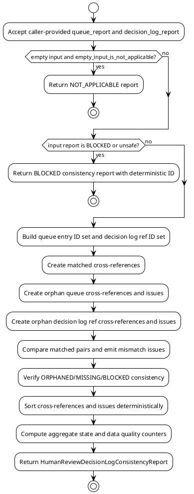

# SPEC-043-Human Review Decision Log Cross-Artifact Consistency

## Background

MVP-40 delivered an audit-only Local Research Human Review Queue. MVP-41 delivered an audit-only Local Research Human Review Decision Log with caller-provided queue entry refs, decision records, decision links, and deterministic result rows. The Decision Log treats every path, artifact ref, report ref, and metadata value as an opaque string and never opens, validates, or executes them.

MVP-42 extends this audit-only research surface with a focused Cross-Artifact Consistency layer for the Human Review Decision Log. The goal is to compare the caller-provided Human Review Queue entries against the Human Review Decision Log inputs, results, and links, surfacing audit-only findings when the two local artifacts disagree or are incomplete relative to each other. The consistency layer answers questions such as:

- Which Human Review Queue entries appear in the Decision Log's queue entry refs?
- Which Human Review Queue entries have no corresponding Decision Log entry when the queue expects a decision?
- Which Decision Log queue entry refs have no corresponding Human Review Queue entry (orphaned from the queue's perspective)?
- Which Decision Log results mention queue entry IDs that are inconsistent with the source queue entry's state, priority, severity, or reason codes?
- Which Decision Log links reference queue entry IDs or decision IDs that are not present in either artifact?
- Are the Decision Log's own ORPHANED rows and ORPHAN_DECISION issues consistent with the absence of the queue entry in the source queue?

This layer is local, call-triggered, deterministic, and produces human-audit artifacts only. It never executes remediation, assigns work to real people or systems, claims readiness, or opens referenced paths. "Consistency check" means only "caller-provided local records disagree or are incomplete relative to each other for human audit review." It is not approval, certification, deployment readiness, production readiness, trading readiness, recommendation, suitability assessment, signal validity, task completion, or executable remediation plan.

The consistency layer does not import prior MVP packages at runtime, open artifact paths, traverse reference strings, or inspect the repository. All queue entry IDs, decision IDs, link IDs, artifact references, report paths, and metadata remain opaque local strings. It does not modify the existing untracked `src/hunter/cross_artifact_consistency/` area; MVP-42 defines a separate, scoped package with no shared state or files with that area.

## Requirements

Use MoSCoW prioritization.

### Must have

1. A new package `src/hunter/human_review_decision_log_consistency/` with frozen dataclass models, a pure-local engine, and a writer module. This package is separate from the existing untracked `src/hunter/cross_artifact_consistency/` area and must not read, write, or modify that area.
2. `HumanReviewDecisionLogConsistencyInput` accepts only caller-provided in-memory records:
   - `queue_report`: `HumanReviewQueueReport` (caller-provided, not imported at runtime from a prior package)
   - `decision_log_report`: `HumanReviewDecisionLogReport` (caller-provided, not imported at runtime from a prior package)
   - `config`: `HumanReviewDecisionLogConsistencyConfig`
   - `project_version`: `str`
   - `metadata`: `Mapping[str, str] = field(default_factory=dict)`
   - `generated_at`: `datetime | None`
3. `HumanReviewDecisionLogConsistencyConfig` must support:
   - `require_decision_for_all_queue_entries`: `bool = False` — emit MISSING_DECISION_IN_LOG when a queue entry with a state that expects a decision has no corresponding decision log result.
   - `queue_entry_states_that_expect_decision`: `tuple[str, ...] = ("open", "pending_review", "blocked")` — configurable set of queue entry states that should be represented in the decision log.
   - `strict`: `bool = False` — when True, any advisory consistency finding promotes the aggregate state to BLOCKED.
   - `empty_input_is_not_applicable`: `bool = True` — when both reports are empty, return NOT_APPLICABLE.
   - `staleness_threshold_seconds`: `int = 7 * 24 * 60 * 60` — used to flag stale cross-references.
4. `HumanReviewDecisionLogConsistencyReport` must contain:
   - `report_id`: deterministic `str`
   - `generated_at`: `datetime`
   - `state`: `HumanReviewDecisionLogConsistencyState` (OK, DEGRADED, BLOCKED, NOT_APPLICABLE)
   - `project_version`: `str`
   - `queue_report_id`: `str` — opaque queue report ID string
   - `decision_log_report_id`: `str` — opaque decision log report ID string
   - `cross_references`: tuple of `HumanReviewDecisionLogConsistencyCrossReference` — canonical storage of every queue-entry / decision-log-ref pair and its `match_status`
   - `queue_entry_to_decision_log_refs`: deterministic derived view of `cross_references` with `match_status` of `matched`
   - `orphan_queue_entries`: deterministic derived view of `cross_references` with `match_status` of `orphan_queue`
   - `orphan_decision_log_refs`: deterministic derived view of `cross_references` with `match_status` of `orphan_decision_log`
   - `mismatched_refs`: deterministic derived view of `cross_references` with `match_status` of `mismatched`
   - `links`: caller-provided consistency links (may be empty tuple)
   - `issues`: tuple of `HumanReviewDecisionLogConsistencyIssue`
   - `data_quality`: `HumanReviewDecisionLogConsistencyDataQuality`
   - `safety_flags`: `HumanReviewDecisionLogConsistencySafetyFlags`
   - `reason_codes`: tuple of `HumanReviewDecisionLogConsistencyReasonCode`
   - `safety_notice`: `str`
   - `metadata`: `Mapping[str, str]`
   - `notes`: `str`
5. All path-like and reference strings remain opaque:
   - `artifact_ref`, `report_ref`, `source_id`, `record_id`, `queue_entry_id`, `decision_id`, `link_id`, `source_id`, `target_id`, and any metadata keys/values are carried only as strings.
   - The engine and writer never open, follow, traverse, validate, fetch, or execute them.
6. Deterministic `report_id` using SHA-256 over canonical JSON built from sorted queue report ID, decision log report ID, sorted linked queue entry IDs, sorted linked decision IDs, `project_version`, and `generated_at`.
7. Deterministic `issue_id` using SHA-256 over canonical JSON content hash of the issue.
8. Deterministic cross-reference ID using SHA-256 over canonical JSON of the pair of queue entry ID and decision log queue entry ref ID.
9. Detect Human Review Queue entries that are missing from the Decision Log's queue entry refs when their queue state expects a decision (`MISSING_DECISION_LOG_REF`).
10. Detect Decision Log queue entry refs that have no corresponding Human Review Queue entry (`ORPHAN_DECISION_LOG_REF`).
11. Detect queue entry states that are inconsistent with Decision Log result states (`MISMATCHED_QUEUE_STATE`).
12. Detect queue entry priorities that are inconsistent with Decision Log result severity (`MISMATCHED_QUEUE_PRIORITY`).
13. Detect queue entry severities that are inconsistent with Decision Log result severity (`MISMATCHED_QUEUE_SEVERITY`).
14. Detect queue entry reason codes that are not reflected in Decision Log result reason codes (`MISMATCHED_QUEUE_REASON_CODES`).
15. Detect Decision Log results that are ORPHANED but are actually present in the Human Review Queue (`INCONSISTENT_ORPHAN_STATUS`).
16. Detect Decision Log results that are MISSING for a queue entry that expects a decision (`INCONSISTENT_MISSING_STATUS`).
17. Detect Decision Log BLOCKED results that are not BLOCKED at the queue level (`INCONSISTENT_BLOCKED_STATUS`).
18. Preserve MVP-41 semantics:
    - Decision Log ORPHANED result state is preserved; the consistency layer only reports it as inconsistent if the queue entry actually exists.
    - Decision Log ORPHAN_DECISION issue emission is not changed; the consistency layer may reference it as evidence.
    - Deterministic blocked report_id is preserved; the consistency layer uses its own deterministic ID.
    - Decision Log NOT_APPLICABLE/SUPPRESSED missing-decision skip is preserved.
    - Decision Log duplicate-ID fail-closed behavior is preserved.
    - Decision Log semantic duplicate handling is preserved.
19. Aggregate state rules:
    - BLOCKED if any blocking issue exists or if a safety/duplicate failure is carried forward from either input report.
    - NOT_APPLICABLE if both inputs are empty and `empty_input_is_not_applicable` is True.
    - DEGRADED if any advisory issue exists.
    - OK otherwise.
    - Strict mode: any DEGRADED or BLOCKED promotes to BLOCKED.
20. Data quality counters for total queue entries, total decision log refs, matched refs, orphan queue entries, orphan decision log refs, mismatched refs, blocking issues, advisory issues, and info findings.
21. Safety flags: `is_safe`, `audit_only`, `no_executable_actions`, `no_trading_instructions`, `no_approval_claims`, `references_opaque`.
22. A safety notice that states the report is audit-only, human-audit, research-only, and explicitly disclaims approval, certification, readiness, recommendation, suitability, signal, task assignment, task completion, and executable remediation plan.
23. Tests and acceptance criteria: focused unit tests, focused engine tests, writer tests, and integration tests.

### Should have

1. A small pure-function engine interface: `build_human_review_decision_log_consistency_report(input) -> HumanReviewDecisionLogConsistencyReport`.
2. Writer compatibility with JSON, CSV, and Markdown serialization, without creating dashboards, servers, databases, schedulers, or daemons.
3. Deterministic ordering of issues, cross-references, and orphan lists by sorted IDs.
4. Support for caller-provided consistency links that map a queue entry to a decision log ref with an explicit link type.
5. A blocked/minimal report constructor that returns a deterministic non-empty report ID using the same canonical hashing strategy.

### Could have

1. Integration tests that span the Human Review Queue, Human Review Decision Log, and the new consistency output end-to-end.
2. CSV rows that summarize each cross-reference pair (queue entry, decision log ref, match status).
3. A Markdown report section that enumerates matched, orphan, and mismatched cross-references for human audit.

### Won't include

1. Live execution, automated remediation, or any action that modifies the filesystem, network, or external state.
2. A server, database, scheduler, daemon, Web UI, dashboard, or API endpoint.
3. Binance, exchange, or Freqtrade runtime integration.
4. Trading signals, order logic, leverage, or short execution.
5. Approval, certification, production readiness, deployment readiness, trading readiness, recommendation, suitability, or task-completion claims.
6. Validation or traversal of artifact paths, report paths, or metadata values.
7. Modification of the existing untracked `src/hunter/cross_artifact_consistency/` area.

## Method

### Proposed package boundary for future implementation

```text
src/hunter/human_review_decision_log_consistency/
├── __init__.py          # public exports only
├── models.py            # frozen dataclasses, enums, safety notice, reason codes
├── engine.py            # pure function: build_human_review_decision_log_consistency_report
└── writer.py            # JSON/CSV/Markdown serialization and atomic writes

tests/test_human_review_decision_log_consistency/
├── test_models.py
├── test_engine.py
├── test_writer.py
└── test_integration.py
```

The package is intentionally separate from `src/hunter/cross_artifact_consistency/`. No file in `src/hunter/cross_artifact_consistency/` is read, written, or imported. The consistency layer only accepts caller-provided `HumanReviewQueueReport` and `HumanReviewDecisionLogReport` objects as opaque in-memory inputs.

### Pure data model outline

```python
@dataclass(frozen=True, slots=True)
class HumanReviewDecisionLogConsistencyInput:
    queue_report: HumanReviewQueueReport
    decision_log_report: HumanReviewDecisionLogReport
    config: HumanReviewDecisionLogConsistencyConfig = field(default_factory=HumanReviewDecisionLogConsistencyConfig)
    project_version: str = "0.42.0-dev"
    metadata: Mapping[str, str] = field(default_factory=dict)
    generated_at: datetime | None = None

@dataclass(frozen=True, slots=True)
class HumanReviewDecisionLogConsistencyConfig:
    require_decision_for_all_queue_entries: bool = False
    queue_entry_states_that_expect_decision: tuple[str, ...] = ("open", "pending_review", "blocked")
    strict: bool = False
    empty_input_is_not_applicable: bool = True
    staleness_threshold_seconds: int = 7 * 24 * 60 * 60

@dataclass(frozen=True, slots=True)
class HumanReviewDecisionLogConsistencyCrossReference:
    cross_reference_id: str
    queue_entry_id: str
    decision_log_queue_entry_id: str
    queue_entry_state: str
    decision_log_result_state: str
    match_status: str  # "matched", "orphan_queue", "orphan_decision_log", "mismatched"
    severity: str
    reason_codes: tuple[str, ...]
    rationale: str
    generated_at: datetime

@dataclass(frozen=True, slots=True)
class HumanReviewDecisionLogConsistencyIssue:
    issue_id: str
    issue_type: str
    severity: str
    reason_codes: tuple[str, ...]
    source_id: str
    target_id: str
    queue_entry_id: str
    decision_log_queue_entry_id: str
    title: str
    description: str
    generated_at: datetime

@dataclass(frozen=True, slots=True)
class HumanReviewDecisionLogConsistencyDataQuality:
    total_queue_entries: int
    total_decision_log_refs: int
    matched_refs: int
    orphan_queue_entries: int
    orphan_decision_log_refs: int
    mismatched_refs: int
    blocking_issues: int
    advisory_issues: int
    info_findings: int
    unsafe_content_count: int
    forbidden_term_count: int

@dataclass(frozen=True, slots=True)
class HumanReviewDecisionLogConsistencyReport:
    report_id: str
    generated_at: datetime
    state: HumanReviewDecisionLogConsistencyState
    project_version: str
    queue_report_id: str
    decision_log_report_id: str
    cross_references: tuple[HumanReviewDecisionLogConsistencyCrossReference, ...]
    # Derived deterministic views over cross_references: queue_entry_to_decision_log_refs,
    # orphan_queue_entries, orphan_decision_log_refs, mismatched_refs
    issues: tuple[HumanReviewDecisionLogConsistencyIssue, ...]
    data_quality: HumanReviewDecisionLogConsistencyDataQuality
    safety_flags: HumanReviewDecisionLogConsistencySafetyFlags
    reason_codes: tuple[HumanReviewDecisionLogConsistencyReasonCode, ...]
    safety_notice: str
    metadata: Mapping[str, str]
    notes: str
```

### Engine algorithm

1. Resolve `generated_at`.
2. If both input reports are empty and `empty_input_is_not_applicable`, return a NOT_APPLICABLE report.
3. If either input report is unsafe or blocked, carry forward the BLOCKED state with a deterministic report ID and note the source.
4. Build a set of queue entry IDs from `queue_report.queue_entries` and a set of decision log queue entry IDs from `decision_log_report.queue_entry_refs`.
5. For each queue entry ID that appears in both sets, create a cross-reference row with status `matched`.
6. For each queue entry ID present in the queue but missing from the decision log, create a cross-reference with status `orphan_queue` and emit a `MISSING_DECISION_LOG_REF` issue if the queue entry state expects a decision.
7. For each decision log queue entry ID present in the decision log but missing from the queue, create a cross-reference with status `orphan_decision_log` and emit an `ORPHAN_DECISION_LOG_REF` issue. This is not inconsistent with the Decision Log's own ORPHANED row — the Decision Log correctly notes the unknown queue entry, while the consistency layer notes it is missing from the source queue.
8. For each matched pair, compare queue state, priority, severity, and reason codes against the Decision Log result state, severity, and reason codes. Emit `MISMATCHED_*` advisory issues where they disagree.
9. For each Decision Log result state that is MISSING or BLOCKED, verify consistency with the source queue entry (e.g., a queue entry that expects a decision should not have a MISSING Decision Log result unless `require_decision_for_all_queue_entries` is False). Emit `INCONSISTENT_MISSING_STATUS` or `INCONSISTENT_BLOCKED_STATUS` as appropriate.
10. For each Decision Log result state that is ORPHANED, verify that the queue entry ID is absent from the queue. If it is present, emit `INCONSISTENT_ORPHAN_STATUS`.
11. Sort all cross-references and issues deterministically by ID.
12. Aggregate state based on issue severities and config strictness.
13. Build data quality counters and safety flags.
14. Return the report.

### Data quality counters

- `total_queue_entries` — count of entries in `queue_report.queue_entries`.
- `total_decision_log_refs` — count of `queue_entry_refs` in `decision_log_report`.
- `matched_refs` — count of cross-references with status `matched`.
- `orphan_queue_entries` — count of queue entries with no decision log ref.
- `orphan_decision_log_refs` — count of decision log refs with no queue entry.
- `mismatched_refs` — count of matched pairs with at least one mismatch issue.
- `blocking_issues` — count of issues with severity `BLOCKING`.
- `advisory_issues` — count of issues with severity `ADVISORY`.
- `info_findings` — count of issues with severity `INFO`.
- `unsafe_content_count` — 1 if the report is blocked for unsafe content, else 0.
- `forbidden_term_count` — 1 if the report is blocked for forbidden terms, else 0.

### Issue severity/state model

Severity:
- `BLOCKING` — carries forward an unsafe input, duplicate ID, or strict-mode promotion.
- `ADVISORY` — mismatches, orphan refs, or inconsistent statuses.
- `INFO` — optional cross-reference metadata notes.

Reason codes:
- `MISSING_DECISION_LOG_REF`
- `ORPHAN_DECISION_LOG_REF`
- `MISMATCHED_QUEUE_STATE`
- `MISMATCHED_QUEUE_PRIORITY`
- `MISMATCHED_QUEUE_SEVERITY`
- `MISMATCHED_QUEUE_REASON_CODES`
- `INCONSISTENT_ORPHAN_STATUS`
- `INCONSISTENT_MISSING_STATUS`
- `INCONSISTENT_BLOCKED_STATUS`
- `UNSAFE_CONTENT`
- `FORBIDDEN_TERM_PRESENT`
- `INPUT_BLOCKED`
- `NOT_APPLICABLE_RC`
- `CONSISTENCY_DEGRADED`

Aggregate state:
- `NOT_APPLICABLE` — empty input when configured.
- `BLOCKED` — any blocking issue or input-blocked carry-forward.
- `DEGRADED` — any advisory issue (or promoted to BLOCKED in strict mode).
- `OK` — no issues.

### Deterministic ID strategy

- `report_id`: SHA-256 of canonical JSON over sorted queue report ID, sorted decision log report ID, sorted matched queue entry IDs, sorted matched decision IDs, `project_version`, and `generated_at`.
- `issue_id`: SHA-256 of canonical JSON over issue type, severity, sorted reason codes, source_id, target_id, queue_entry_id, decision_log_queue_entry_id, title, and description.
- `cross_reference_id`: SHA-256 of canonical JSON over queue_entry_id, decision_log_queue_entry_id, match_status, and generated_at.
- `blocked()` report ID: same hashing strategy but includes `state=BLOCKED`, `reason_code`, and `notes`.

### PlantUML component diagram

```plantuml
@startuml
!theme plain
skinparam componentStyle rectangle

package "src/hunter" {
    [human_review_queue] as queue
    [human_review_decision_log] as dlog
    [human_review_decision_log_consistency] as consistency
}

package "tests" {
    [test_human_review_decision_log_consistency] as tests
}

queue --> dlog : caller provides queue_entry_refs
queue --> consistency : caller provides HumanReviewQueueReport
dlog --> consistency : caller provides HumanReviewDecisionLogReport
consistency --> tests : verifies

note right of consistency
  Audit-only, local-only.
  Opaque refs: never opened/traversed/executed.
  Separate from cross_artifact_consistency package.
end note

@enduml
```

### PlantUML activity diagram



### Explicit note on opaque refs

Every `queue_entry_id`, `decision_id`, `link_id`, `source_id`, `target_id`, `artifact_ref`, `report_ref`, `source_id`, `record_id`, and metadata key/value is an opaque string. The engine and writer use these strings only for identity comparison, deterministic sorting, and human-audit serialization. They are never opened, followed, traversed, validated, fetched, or executed. This includes refs from the Human Review Queue, refs from the Human Review Decision Log, and any refs produced by the consistency layer itself.

## Implementation

### Phase 1: Models and pure engine

1. Add `src/hunter/human_review_decision_log_consistency/models.py` with enums, dataclasses, safety notice, and reason code constants.
2. Add `src/hunter/human_review_decision_log_consistency/engine.py` with `build_human_review_decision_log_consistency_report` and deterministic ID helpers.
3. Add `src/hunter/human_review_decision_log_consistency/__init__.py` with public exports.
4. Add `tests/test_human_review_decision_log_consistency/test_models.py`.
5. Add `tests/test_human_review_decision_log_consistency/test_engine.py`.

Stop conditions: model tests pass, engine tests pass, deterministic IDs stable, no forbidden imports, no file/network I/O, no mutation of inputs.

### Phase 2: Writer

1. Add `src/hunter/human_review_decision_log_consistency/writer.py` with dict/JSON/CSV/Markdown serialization and atomic writes to local tmp_path only in tests.
2. Add `tests/test_human_review_decision_log_consistency/test_writer.py`.

Stop conditions: JSON/CSV/Markdown serialization, atomic writes, safety notice in Markdown, writer tests pass, no production path writes in tests.

### Phase 3: Integration tests

1. Add `tests/test_human_review_decision_log_consistency/test_integration.py`.
2. End-to-end flows: caller provides queue report and decision log report, builds consistency report, serializes all three, asserts deterministic IDs, data quality, issues, and safety notice.
3. Tests cover: matched pairs, orphan queue entries, orphan decision log refs, mismatched state/priority/severity/reason codes, ORPHANED inconsistency, MISSING inconsistency, BLOCKED carry-forward, strict mode, empty input NOT_APPLICABLE, no mutation, no file/network/exchange usage.

Stop conditions: full package tests pass, no regressions in full suite, deterministic outputs, no forbidden imports or I/O.

### Phase 4: Finalization

1. Bump `src/hunter/__init__.py` version to `0.42.0-dev` (if the project convention requires it).
2. Update `CHANGELOG.md` with MVP-42 entry.
3. Update `tasks/active.md` to mark MVP-42 complete with test results and tag target `v0.42.0-dev`.
4. Tag `v0.42.0-dev`.

Stop conditions: version bumped, changelog/tasks updated, all tests pass, tag created.

## Milestones

1. SPEC-043 approved and committed.
2. Step 1: models + engine + focused tests passing.
3. Step 2: writer + focused tests passing.
4. Step 3: integration tests only, passing.
5. Step 4: finalization, version bump, and tag `v0.42.0-dev`.

## Gathering Results

### Test Plan

| Category | Coverage |
|----------|----------|
| Model defaults | Enums, dataclasses, frozen/slots, safety flags, reason codes |
| Safety flags validation | `is_safe` when no unsafe content or forbidden terms |
| Deterministic IDs/order | `report_id`, `cross_reference_id`, `issue_id` stable for identical inputs |
| Empty input | `empty_input_is_not_applicable` returns NOT_APPLICABLE |
| Input blocked carry-forward | BLOCKED queue or decision log report propagates to BLOCKED consistency report |
| Missing decision log refs | `MISSING_DECISION_LOG_REF` when queue expects a decision |
| Orphan decision log refs | `ORPHAN_DECISION_LOG_REF` when decision log ref has no queue entry |
| Mismatched state | `MISMATCHED_QUEUE_STATE` |
| Mismatched priority | `MISMATCHED_QUEUE_PRIORITY` |
| Mismatched severity | `MISMATCHED_QUEUE_SEVERITY` |
| Mismatched reason codes | `MISMATCHED_QUEUE_REASON_CODES` |
| Inconsistent orphan status | `INCONSISTENT_ORPHAN_STATUS` when queue entry exists for an ORPHANED result |
| Inconsistent missing status | `INCONSISTENT_MISSING_STATUS` when queue expects a decision but result is MISSING |
| Inconsistent blocked status | `INCONSISTENT_BLOCKED_STATUS` when result is BLOCKED but queue is not |
| Strict mode | DEGRADED/BLOCKED promoted to BLOCKED |
| Aggregate state | NOT_APPLICABLE on empty input; otherwise BLOCKED > DEGRADED > OK |
| Opaque refs | Refs remain strings, never opened |
| Writer JSON/CSV/Markdown | Deterministic serialization, atomic writes |
| Integration end-to-end | Full queue → decision log → consistency build → write cycle |
| No mutation | Input unchanged after engine call |
| No filesystem scan/import/network | No forbidden imports or I/O |
| No executable remediation output | No commands, patches, or deployment instructions |
| No approval/readiness/task-completion output | Audit-only language |

### Evaluation Metrics

- Focused tests pass.
- Full suite passes with no regressions.
- Deterministic outputs.
- Inputs never mutated.
- No unsafe imports.
- No file reads/network/database in engine.
- Markdown states human-research-only.
- No trading/approval/execution/remediation/task/signal/completion semantics.
- Existing untracked `src/hunter/cross_artifact_consistency/` is untouched.

## Need Professional Help in Developing Your Architecture?

Please contact me at [sammuti.com](https://sammuti.com) :)
