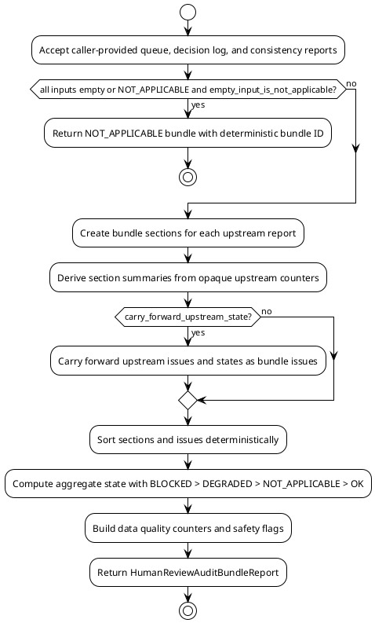

# SPEC-044 Human Review Audit Bundle Export

## Background

MVP-40 delivered an audit-only Local Research Human Review Queue that identifies caller-provided human-review items. MVP-41 delivered an audit-only Local Research Human Review Decision Log that records review decisions with opaque queue entry refs, decision records, decision links, and deterministic result rows. MVP-42 delivered an audit-only Human Review Decision Log Cross-Artifact Consistency layer that compares the queue and decision log artifacts and surfaces human-audit findings when the two local records disagree or are incomplete relative to each other.

MVP-43 extends this audit-only research surface with a top-level Human Review Audit Bundle Export. The goal is to model the three upstream local research artifacts — Human Review Queue report, Human Review Decision Log report, and Human Review Decision Log Consistency report — into one deterministic, opaque-ref-safe, local-only audit bundle. The bundle is a thin aggregator: it accepts the caller-provided in-memory reports, normalizes them into deterministic bundle sections, carries forward upstream BLOCKED/DEGRADED/NOT_APPLICABLE states safely, aggregates issues and data-quality counters, and produces a single human-audit bundle report. The bundle never opens, follows, traverses, validates, fetches, or executes any reference string. It does not modify or depend on the existing untracked `src/hunter/cross_artifact_consistency/` area.

The bundle answers questions such as:

- Which Human Review Queue, Decision Log, and Consistency reports are bundled together for a given audit review?
- What is the aggregate state of the human review audit surface (OK, DEGRADED, BLOCKED, NOT_APPLICABLE)?
- Which upstream issues are carried forward into the bundle?
- What are the bundle-level data quality counters across queue, decision log, and consistency outputs?
- Are any upstream reports blocked, degraded, or not applicable, and how does that propagate?
- Does the serialized bundle contain any forbidden language, executable instructions, or trading/approval/readiness claims?

This layer is local, call-triggered, deterministic, and produces human-audit artifacts only. It never executes remediation, assigns work to real people or systems, claims readiness, or opens referenced paths. "Audit bundle" means only "caller-provided local human-review research reports packaged into one deterministic local artifact for human audit review." It is not approval, certification, deployment readiness, production readiness, trading readiness, recommendation, suitability assessment, signal validity, task completion, or executable remediation plan.

The bundle layer does not import prior MVP packages at runtime, open artifact paths, traverse reference strings, or inspect the repository. All queue entry IDs, decision IDs, link IDs, artifact references, report paths, bundle report IDs, and metadata remain opaque local strings. It does not modify the existing untracked `src/hunter/cross_artifact_consistency/` area; MVP-43 defines a separate, scoped package with no shared state or files with that area.

## Requirements

Use MoSCoW prioritization.

### Must have

1. A new package `src/hunter/human_review_audit_bundle/` with frozen dataclass models, a pure-local engine, and a writer module. This package is separate from the existing untracked `src/hunter/cross_artifact_consistency/` area and must not read, write, or modify that area.
2. `HumanReviewAuditBundleInput` accepts only caller-provided in-memory reports and references:
   - `queue_report`: `HumanReviewQueueReport` (caller-provided, not imported at runtime from a prior package)
   - `decision_log_report`: `HumanReviewDecisionLogReport` (caller-provided, not imported at runtime from a prior package)
   - `consistency_report`: `HumanReviewDecisionLogConsistencyReport` (caller-provided, not imported at runtime from a prior package)
   - `config`: `HumanReviewAuditBundleConfig`
   - `project_version`: `str`
   - `metadata`: `Mapping[str, str] = field(default_factory=dict)`
   - `generated_at`: `datetime | None`
3. `HumanReviewAuditBundleConfig` must support:
   - `carry_forward_upstream_state`: `bool = True` — propagate BLOCKED/DEGRADED/NOT_APPLICABLE from upstream reports into the bundle state.
   - `empty_input_is_not_applicable`: `bool = True` — when all three input reports are not applicable or empty, return NOT_APPLICABLE.
   - `strict`: `bool = False` — when True, any DEGRADED upstream state or advisory bundle issue promotes the aggregate state to BLOCKED.
   - `include_upstream_issues`: `bool = True` — include upstream issue references in the bundle issue list.
   - `include_derived_summary`: `bool = True` — include derived bundle summaries per section kind.
4. `HumanReviewAuditBundleReport` must contain:
   - `bundle_id`: deterministic `str` — the bundle identifier
   - `report_id`: deterministic `str` — the report identifier (may equal `bundle_id` or be derived from it)
   - `generated_at`: `datetime`
   - `state`: `HumanReviewAuditBundleState` (OK, DEGRADED, BLOCKED, NOT_APPLICABLE)
   - `project_version`: `str`
   - `sections`: tuple of `HumanReviewAuditBundleSection` — deterministic ordering
   - `issues`: tuple of `HumanReviewAuditBundleIssue` — carried-forward or derived issues
   - `data_quality`: `HumanReviewAuditBundleDataQuality`
   - `safety_flags`: `HumanReviewAuditBundleSafetyFlags`
   - `reason_codes`: tuple of `HumanReviewAuditBundleReasonCode`
   - `safety_notice`: `str`
   - `metadata`: `Mapping[str, str]`
   - `notes`: `str`
5. `HumanReviewAuditBundleSection` must represent one upstream report as a bundle section:
   - `section_id`: deterministic `str`
   - `section_kind`: `str` — one of `"queue"`, `"decision_log"`, `"consistency"`
   - `upstream_report_id`: `str` — opaque upstream report ID
   - `upstream_state`: `str` — upstream report state
   - `upstream_reason_codes`: `tuple[str, ...]`
   - `generated_at`: `datetime`
   - `summary`: `Mapping[str, Any]` — derived counters or summary values
   - `metadata`: `Mapping[str, str]`
   - `notes`: `str`
6. `HumanReviewAuditBundleIssue` must carry forward upstream issues or emit bundle-level issues:
   - `issue_id`: deterministic `str`
   - `issue_type`: `str`
   - `severity`: `str` — BLOCKING, ADVISORY, INFO
   - `reason_codes`: `tuple[str, ...]`
   - `source_section_kind`: `str` — `"queue"`, `"decision_log"`, `"consistency"`, or `"bundle"`
   - `source_id`: `str` — opaque upstream issue ID or bundle issue ID
   - `title`: `str`
   - `description`: `str`
   - `generated_at`: `datetime`
7. `HumanReviewAuditBundleDataQuality` must contain bundle-level counters:
   - `section_count`: `int`
   - `upstream_issue_count`: `int`
   - `blocking_issues`: `int`
   - `advisory_issues`: `int`
   - `info_findings`: `int`
   - `queue_entry_count`: `int` (from upstream queue summary if available)
   - `decision_result_count`: `int` (from upstream decision log summary if available)
   - `consistency_cross_reference_count`: `int` (from upstream consistency summary if available)
   - `unsafe_content_count`: `int`
   - `forbidden_term_count`: `int`
8. `HumanReviewAuditBundleSafetyFlags` must contain:
   - `is_safe`: `bool`
   - `audit_only`: `bool = True`
   - `no_executable_actions`: `bool = True`
   - `no_trading_instructions`: `bool = True`
   - `no_approval_claims`: `bool = True`
   - `references_opaque`: `bool = True`
   - `no_network`: `bool = True`
   - `no_server`: `bool = True`
9. All path-like and reference strings remain opaque:
   - `artifact_ref`, `report_ref`, `source_id`, `record_id`, `queue_entry_id`, `decision_id`, `link_id`, `section_id`, `bundle_id`, `report_id`, `upstream_report_id`, `source_id`, and any metadata keys/values are carried only as strings.
   - The engine and writer never open, follow, traverse, validate, fetch, or execute them.
10. Deterministic `bundle_id` and `report_id` using SHA-256 over canonical JSON built from sorted upstream report IDs, `project_version`, `generated_at`, and a fixed bundle version marker.
11. Deterministic `section_id` using SHA-256 over canonical JSON of `section_kind` and `upstream_report_id`.
12. Deterministic `issue_id` for carried-forward issues derived from the upstream issue ID, `source_section_kind`, and a stable prefix. New bundle-level issues use SHA-256 over canonical JSON content.
13. Deterministic section ordering: sort by `section_kind` (fixed order: `"consistency"`, `"decision_log"`, `"queue"`), then `upstream_report_id`, then `generated_at`.
14. Aggregate state rules:
    - BLOCKED if any upstream report is BLOCKED, any blocking issue is present, or strict mode promotes a degraded/advisory condition.
    - NOT_APPLICABLE if all upstream reports are NOT_APPLICABLE or empty and `empty_input_is_not_applicable` is True.
    - DEGRADED if any upstream report is DEGRADED or any advisory issue is present.
    - OK otherwise.
    - Strict mode: any DEGRADED or BLOCKED promotes to BLOCKED.
15. Carry forward upstream BLOCKED/DEGRADED/NOT_APPLICABLE states safely by converting them into `HumanReviewAuditBundleIssue` entries with severity derived from the upstream state and reason codes derived from the upstream report reason codes.
16. Preserve MVP-40/MVP-41/MVP-42 semantics:
    - Do not re-interpret queue entry states, decision outcomes, or consistency match statuses.
    - Do not re-validate upstream report IDs or issue IDs.
    - Do not open or re-serialize upstream report content beyond the opaque refs and summary counters exposed by the caller.
    - Do not change the deterministic ID strategies of upstream reports.
17. Safety notice that states the bundle is audit-only, human-audit, research-only, and explicitly disclaims approval, certification, readiness, recommendation, suitability, signal, task assignment, task completion, and executable remediation plan.
18. Tests and acceptance criteria: focused unit tests, focused engine tests, writer tests, and integration tests.

### Should have

1. A small pure-function engine interface: `build_human_review_audit_bundle(input) -> HumanReviewAuditBundleReport`.
2. Writer compatibility with JSON and Markdown serialization, returning text only, without creating dashboards, servers, databases, schedulers, or daemons.
3. Deterministic ordering of sections and issues.
4. A derived summary per section kind that includes upstream report counters such as entry count, result count, issue count, cross-reference count, and state.
5. A blocked/minimal report constructor that returns a deterministic non-empty bundle ID using the same canonical hashing strategy.

### Could have

1. Optional redaction of notes/metadata if already local and deterministic (e.g., stripping empty strings or normalizing whitespace).
2. CSV serialization of section/issue rows.
3. A bundle manifest section that lists the upstream report kinds and their opaque IDs.

### Won't include

1. Live execution, automated remediation, or any action that modifies the filesystem, network, or external state.
2. A server, database, scheduler, daemon, Web UI, dashboard, or API endpoint.
3. Binance, exchange, or Freqtrade runtime integration.
4. Trading signals, order logic, leverage, or short execution.
5. Approval, certification, production readiness, deployment readiness, trading readiness, recommendation, suitability, or task-completion claims.
6. Validation or traversal of artifact paths, report paths, or metadata values.
7. Modification of the existing untracked `src/hunter/cross_artifact_consistency/` area.
8. File writes or runtime report generation in the models or engine phases.

## Method

### Proposed package boundary for future implementation

```text
src/hunter/human_review_audit_bundle/
├── __init__.py          # public exports only
├── models.py            # frozen dataclasses, enums, safety notice, reason codes
├── engine.py            # pure function: build_human_review_audit_bundle
└── writer.py            # dict/JSON/Markdown serialization and atomic writes

tests/test_human_review_audit_bundle/
├── __init__.py
├── test_models.py
├── test_engine.py
├── test_writer.py
└── test_integration.py
```

The package is intentionally separate from `src/hunter/cross_artifact_consistency/`. No file in `src/hunter/cross_artifact_consistency/` is read, written, or imported. The bundle layer only accepts caller-provided `HumanReviewQueueReport`, `HumanReviewDecisionLogReport`, and `HumanReviewDecisionLogConsistencyReport` objects as opaque in-memory inputs.

### Pure data model outline

```python
@dataclass(frozen=True, slots=True)
class HumanReviewAuditBundleInput:
    queue_report: HumanReviewQueueReport
    decision_log_report: HumanReviewDecisionLogReport
    consistency_report: HumanReviewDecisionLogConsistencyReport
    config: HumanReviewAuditBundleConfig = field(default_factory=HumanReviewAuditBundleConfig)
    project_version: str = "0.43.0-dev"
    metadata: Mapping[str, str] = field(default_factory=dict)
    generated_at: datetime | None = None

@dataclass(frozen=True, slots=True)
class HumanReviewAuditBundleConfig:
    carry_forward_upstream_state: bool = True
    empty_input_is_not_applicable: bool = True
    strict: bool = False
    include_upstream_issues: bool = True
    include_derived_summary: bool = True

@dataclass(frozen=True, slots=True)
class HumanReviewAuditBundleSection:
    section_id: str
    section_kind: str
    upstream_report_id: str
    upstream_state: str
    upstream_reason_codes: tuple[str, ...]
    generated_at: datetime
    summary: Mapping[str, Any]
    metadata: Mapping[str, str]
    notes: str

@dataclass(frozen=True, slots=True)
class HumanReviewAuditBundleIssue:
    issue_id: str
    issue_type: str
    severity: str
    reason_codes: tuple[str, ...]
    source_section_kind: str
    source_id: str
    title: str
    description: str
    generated_at: datetime

@dataclass(frozen=True, slots=True)
class HumanReviewAuditBundleDataQuality:
    section_count: int
    upstream_issue_count: int
    blocking_issues: int
    advisory_issues: int
    info_findings: int
    queue_entry_count: int
    decision_result_count: int
    consistency_cross_reference_count: int
    unsafe_content_count: int
    forbidden_term_count: int

@dataclass(frozen=True, slots=True)
class HumanReviewAuditBundleSafetyFlags:
    is_safe: bool
    audit_only: bool = True
    no_executable_actions: bool = True
    no_trading_instructions: bool = True
    no_approval_claims: bool = True
    references_opaque: bool = True
    no_network: bool = True
    no_server: bool = True

@dataclass(frozen=True, slots=True)
class HumanReviewAuditBundleReport:
    bundle_id: str
    report_id: str
    generated_at: datetime
    state: HumanReviewAuditBundleState
    project_version: str
    sections: tuple[HumanReviewAuditBundleSection, ...]
    issues: tuple[HumanReviewAuditBundleIssue, ...]
    data_quality: HumanReviewAuditBundleDataQuality
    safety_flags: HumanReviewAuditBundleSafetyFlags
    reason_codes: tuple[HumanReviewAuditBundleReasonCode, ...]
    safety_notice: str
    metadata: Mapping[str, str]
    notes: str
```

### Engine algorithm

1. Resolve `generated_at`.
2. If all three input reports are empty or NOT_APPLICABLE and `empty_input_is_not_applicable`, return a NOT_APPLICABLE bundle with a deterministic bundle ID.
3. If any input report is unsafe or blocked, and `carry_forward_upstream_state` is True, emit a BLOCKED-level bundle issue carrying forward the upstream state.
4. Build `HumanReviewAuditBundleSection` objects for each non-empty upstream report:
   - `queue` section from `queue_report`
   - `decision_log` section from `decision_log_report`
   - `consistency` section from `consistency_report`
5. For each section, derive a summary of counters (entry count, result count, issue count, cross-reference count, state) using only opaque in-memory values already present on the caller-provided objects.
6. If `include_upstream_issues` is True, carry forward upstream issues from each report as `HumanReviewAuditBundleIssue` objects with severity mapped from the upstream issue severity. Do not duplicate upstream IDs; use deterministic derived IDs.
7. If `carry_forward_upstream_state` is True and an upstream report is DEGRADED or NOT_APPLICABLE, emit a corresponding bundle-level issue noting the carry-forward.
8. Sort all sections and issues deterministically by their IDs and stable sort keys.
9. Compute aggregate state based on upstream states, issue severities, and config strictness.
10. Build data quality counters and safety flags.
11. Return the bundle report.

### Data quality counters

- `section_count` — number of bundle sections present.
- `upstream_issue_count` — total issues carried forward from upstream reports.
- `blocking_issues` — count of bundle-level issues with severity `BLOCKING`.
- `advisory_issues` — count of bundle-level issues with severity `ADVISORY`.
- `info_findings` — count of bundle-level issues with severity `INFO`.
- `queue_entry_count` — summary count from queue report if available.
- `decision_result_count` — summary count from decision log report if available.
- `consistency_cross_reference_count` — summary count from consistency report if available.
- `unsafe_content_count` — 1 if the bundle is blocked for unsafe content, else 0.
- `forbidden_term_count` — 1 if the bundle is blocked for forbidden terms, else 0.

### Issue severity/state model

Severity:
- `BLOCKING` — upstream BLOCKED report, unsafe content, duplicate ID, or strict-mode promotion.
- `ADVISORY` — upstream DEGRADED report or upstream advisory issues carried forward.
- `INFO` — upstream NOT_APPLICABLE carry-forward or informational summaries.

Reason codes:
- `UPSTREAM_BLOCKED`
- `UPSTREAM_DEGRADED`
- `UPSTREAM_NOT_APPLICABLE`
- `EMPTY_INPUT_NOT_APPLICABLE`
- `BUNDLE_DEGRADED`
- `UNSAFE_CONTENT`
- `FORBIDDEN_TERM_PRESENT`
- `OK`
- `NOT_APPLICABLE`
- `RESEARCH_ONLY`
- `HUMAN_AUDIT_ONLY`
- `NO_EXECUTABLE_ACTIONS`
- `NO_TRADING_INSTRUCTIONS`
- `NO_APPROVAL_CLAIMS`
- `REFERENCES_OPAQUE`
- `NO_NETWORK`
- `NO_SERVER`
- `NO_DATABASE`

Aggregate state:
- `NOT_APPLICABLE` — all upstream inputs empty or NOT_APPLICABLE when configured.
- `BLOCKED` — any upstream BLOCKED report, any blocking issue, or strict-mode promotion.
- `DEGRADED` — any upstream DEGRADED report or advisory issue.
- `OK` — no issues and all upstream reports are OK.

### Deterministic ID strategy

- `bundle_id`: SHA-256 of canonical JSON over sorted upstream report IDs (`queue_report.report_id`, `decision_log_report.report_id`, `consistency_report.report_id`), `project_version`, `generated_at`, and a fixed bundle kind marker `"human_review_audit_bundle"`.
- `report_id`: same as `bundle_id`.
- `section_id`: SHA-256 of canonical JSON over `section_kind`, `upstream_report_id`, and `generated_at`.
- `issue_id`: for carried-forward upstream issues, SHA-256 of canonical JSON over `source_section_kind`, upstream issue ID, and a stable prefix `"carried"`. For new bundle-level issues, SHA-256 of canonical JSON over issue type, severity, sorted reason codes, source section kind, source ID, title, and description.
- Canonical JSON must use sorted keys, no indentation, and no whitespace. Use `json.dumps(..., sort_keys=True, separators=(",", ":"))`. Datetime values are serialized as ISO 8601 strings in UTC.

### State precedence

For non-empty inputs, precedence is `BLOCKED > DEGRADED > NOT_APPLICABLE > OK`. If `strict` is True, any DEGRADED or NOT_APPLICABLE state is promoted to BLOCKED. This precedence is applied after the empty-input NOT_APPLICABLE check.

### PlantUML component diagram

```plantuml
@startuml
!theme plain
skinparam componentStyle rectangle

package "src/hunter" {
    [human_review_queue] as queue
    [human_review_decision_log] as dlog
    [human_review_decision_log_consistency] as consistency
    [human_review_audit_bundle] as bundle
}

package "tests" {
    [test_human_review_audit_bundle] as tests
}

queue --> bundle : caller provides HumanReviewQueueReport
dlog --> bundle : caller provides HumanReviewDecisionLogReport
consistency --> bundle : caller provides HumanReviewDecisionLogConsistencyReport
bundle --> tests : verifies

note right of bundle
  Audit-only, local-only.
  Opaque refs: never opened/traversed/executed.
  Separate from cross_artifact_consistency package.
end note

@enduml
```

### PlantUML activity diagram



### Explicit note on opaque refs

Every `queue_entry_id`, `decision_id`, `link_id`, `section_id`, `bundle_id`, `report_id`, `upstream_report_id`, `source_id`, `target_id`, `artifact_ref`, `report_ref`, and metadata key/value is an opaque string. The engine and writer use these strings only for identity comparison, deterministic sorting, and human-audit serialization. They are never opened, followed, traversed, validated, fetched, or executed. This includes refs from the Human Review Queue, refs from the Human Review Decision Log, refs from the Human Review Decision Log Consistency report, and any refs produced by the bundle layer itself. The bundle layer does not inspect the content of upstream reports beyond the opaque IDs, states, reason codes, and summary counters explicitly provided by the caller.

## Implementation

### Phase 1: Models and pure engine

1. Add `src/hunter/human_review_audit_bundle/models.py` with enums, dataclasses, safety notice, and reason code constants.
2. Add `src/hunter/human_review_audit_bundle/engine.py` with `build_human_review_audit_bundle` and deterministic ID helpers.
3. Add `src/hunter/human_review_audit_bundle/__init__.py` with public exports.
4. Add `tests/test_human_review_audit_bundle/test_models.py`.
5. Add `tests/test_human_review_audit_bundle/test_engine.py`.

Stop conditions: model tests pass, engine tests pass, deterministic IDs stable, no forbidden imports, no file/network I/O, no mutation of inputs.

### Phase 2: Writer

1. Add `src/hunter/human_review_audit_bundle/writer.py` with dict/JSON/Markdown serialization and atomic writes to local `tmp_path` only in tests.
2. Add `tests/test_human_review_audit_bundle/test_writer.py`.

Stop conditions: JSON/Markdown serialization, atomic writes, safety notice at top of serialized outputs, writer tests pass, no production path writes in tests.

### Phase 3: Integration tests

1. Add `tests/test_human_review_audit_bundle/test_integration.py`.
2. End-to-end flows: caller provides queue report, decision log report, and consistency report, builds bundle report, serializes all outputs, asserts deterministic bundle IDs, section ordering, data quality, issues, and safety notice.
3. Tests cover: OK bundle, DEGRADED carry-forward, BLOCKED carry-forward, NOT_APPLICABLE empty input, strict mode promotion, deterministic outputs, no mutation, no file/network/exchange usage, opaque refs preserved, no executable remediation output, no approval/readiness/task-completion language.

Stop conditions: full package tests pass, no regressions in full suite, deterministic outputs, no forbidden imports or I/O.

### Phase 4: Finalization

1. Update `CHANGELOG.md` with MVP-43 entry.
2. Update `tasks/active.md` to mark MVP-43 complete with test results and tag target `v0.43.0-dev`.
3. Tag `v0.43.0-dev`.

Stop conditions: changelog/tasks updated, all tests pass, tag created.

## Milestones

1. SPEC-044 approved and committed.
2. Step 1: models + engine + focused tests passing.
3. Step 2: writer + focused tests passing.
4. Step 3: integration tests only, passing.
5. Step 4: finalization and tag `v0.43.0-dev`.

## Gathering Results

### Test Plan

| Category | Coverage |
|----------|----------|
| Model defaults | Enums, dataclasses, frozen/slots, safety flags, reason codes |
| Safety flags validation | `is_safe` when no unsafe content or forbidden terms |
| Deterministic IDs/order | `bundle_id`, `report_id`, `section_id`, `issue_id` stable for identical inputs |
| Empty input | `empty_input_is_not_applicable` returns NOT_APPLICABLE |
| Upstream blocked carry-forward | BLOCKED upstream report propagates to BLOCKED bundle report |
| Upstream degraded carry-forward | DEGRADED upstream report propagates to DEGRADED bundle report (or BLOCKED in strict mode) |
| Upstream not-applicable carry-forward | NOT_APPLICABLE upstream reports handled safely |
| Section ordering | Deterministic ordering by kind, report ID, generated_at |
| Data quality counters | section_count, issue counts, derived counts from upstream summaries |
| Opaque refs | Refs remain strings, never opened |
| Writer JSON/Markdown | Deterministic serialization, atomic writes, safety notice at top |
| Integration end-to-end | Full queue → decision log → consistency → bundle cycle |
| No mutation | Input unchanged after engine call |
| No filesystem scan/import/network | No forbidden imports or I/O |
| No executable remediation output | No commands, patches, or deployment instructions |
| No approval/readiness/task-completion output | Audit-only language |
| Full suite | No regressions across all MVP suites |

### Evaluation Metrics

- Focused tests pass.
- Full suite passes with no regressions.
- Deterministic outputs.
- Inputs never mutated.
- No unsafe imports.
- No file reads/network/database in engine.
- Markdown states human-research-only.
- No trading/approval/execution/remediation/task/signal/completion semantics.
- Existing untracked `src/hunter/cross_artifact_consistency/` is untouched.

## Need Professional Help in Developing Your Architecture?

Please contact me at [sammuti.com](https://sammuti.com) :)
