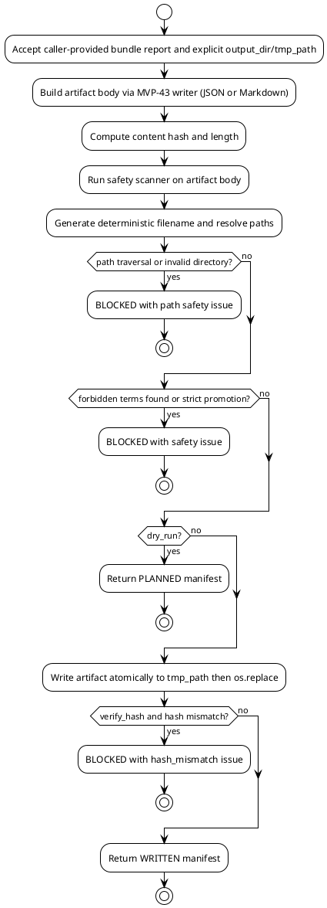

# SPEC-045 Human Review Audit Bundle Export Artifact

## Background

MVP-43 delivered an audit-only Local Research Human Review Audit Bundle layer. The MVP-43 package (`src/hunter/human_review_audit_bundle/`) produces deterministic, frozen-dataclass models, a pure-local engine, and pure writer functions that return dict, JSON text, and Markdown text without touching the filesystem. MVP-43 keeps all upstream artifact and report references opaque, never opening, following, traversing, validating, fetching, or executing any reference string. It is a human-audit, research-only aggregator with no trading, execution, network, server, or production-readiness semantics.

MVP-44 extends this surface with a controlled local-only export artifact layer. While MVP-43 answers "what is the deterministic bundle content?", MVP-44 answers "how is that content safely, deterministically, and atomically written to a local file for caller-controlled human audit?". The export layer must remain a thin wrapper over MVP-43 pure outputs: it accepts a caller-provided `HumanReviewAuditBundleReport`, the caller's chosen writer format (JSON or Markdown), an explicit caller-supplied local output directory, and an explicit caller-supplied temporary directory for atomic writes. It must produce a deterministic local filename and a deterministic export manifest without re-deriving upstream refs or interpreting upstream content.

This export layer is not a generic file pipeline, a runtime registry, a server, a scheduler, a database, or a trading system. It does not approve, certify, or recommend anything. It is local-only, call-triggered, and deterministic. It must not write to `data/`, `reports/`, or the existing untracked `src/hunter/cross_artifact_consistency/` area by default. It must not depend on those areas. The export layer must fail closed if the artifact body contains forbidden executable, remediation, trading, deployment, or approval language, and it must prevent path traversal outside the caller-supplied output directory.

## Requirements

Use MoSCoW prioritization.

### Must Have

1. **M1:** A new package `src/hunter/human_review_audit_bundle_export/` with frozen dataclass models, a pure planner/engine, and a controlled writer/exporter. This package is separate from the existing untracked `src/hunter/cross_artifact_consistency/` area and must not read, write, or modify that area.
2. **M2:** The export layer remains audit-only, local-only, and call-triggered. No server, no REST API, no Web UI, no dashboard, no daemon, no scheduler, no background loop, no cron, no database, no network calls, no exchange calls, no Binance, no Freqtrade import/runtime, no API keys, no live data, no real orders, no leverage, no shorting, no action commands, no trading signals, no approvals, no production-readiness claims.
3. **M3:** `HumanReviewAuditBundleExportConfig` must support at least:
   - `strict: bool = False` — fail closed on any forbidden term or safety issue.
   - `overwrite: bool = False` — explicit overwrite behavior.
   - `format: str = "json"` — one of the allowed formats from a fixed allowlist (`"json"`, `"markdown"`).
   - `safety_scan: bool = True` — scan artifact body before writing.
   - `verify_hash: bool = True` — verify content hash of the written artifact.
   - `dry_run: bool = False` — when True, plan only; never write.
4. **M4:** `HumanReviewAuditBundleExportInput` must accept only caller-provided in-memory values and explicit local paths:
   - `bundle_report: HumanReviewAuditBundleReport` (caller-provided)
   - `output_dir: Path | str` — explicit caller-supplied local output directory
   - `tmp_path: Path | str` — explicit caller-supplied local temporary directory
   - `config: HumanReviewAuditBundleExportConfig`
   - `generated_at: datetime | None` — fixed for deterministic output
   - `metadata: Mapping[str, str]` — opaque string key/value pairs only
5. **M5:** `HumanReviewAuditBundleExportPlan` must represent the planned export without writing:
   - `plan_id: str` — deterministic plan ID
   - `report_id: str` — deterministic report ID derived from the bundle report and export parameters
   - `bundle_report_id: str` — opaque upstream bundle report ID
   - `filename: str` — deterministic output filename
   - `output_path: str` — resolved local output path (must remain under `output_dir`)
   - `tmp_path: str` — resolved local temporary path (must remain under `tmp_path`)
   - `format: str`
   - `content_hash: str` — SHA-256 of the artifact body
   - `content_length: int`
   - `state: HumanReviewAuditBundleExportState`
   - `safety_flags: HumanReviewAuditBundleExportSafetyFlags`
   - `reason_codes: tuple[str, ...]`
   - `issues: tuple[HumanReviewAuditBundleExportIssue, ...]`
   - `metadata: Mapping[str, str]`
   - `notes: str`
6. **M6:** `HumanReviewAuditBundleExportManifest` must represent the completed export:
   - `manifest_id: str` — deterministic manifest ID
   - `report_id: str` — same as in the plan
   - `bundle_report_id: str` — opaque upstream bundle report ID
   - `filename: str`
   - `output_path: str`
   - `format: str`
   - `content_hash: str` — SHA-256 of the written artifact body
   - `content_length: int`
   - `state: HumanReviewAuditBundleExportState` (WRITTEN or NOT_APPLICABLE or BLOCKED)
   - `safety_flags: HumanReviewAuditBundleExportSafetyFlags`
   - `reason_codes: tuple[str, ...]`
   - `issues: tuple[HumanReviewAuditBundleExportIssue, ...]`
   - `metadata: Mapping[str, str]`
   - `notes: str`
7. **M7:** `HumanReviewAuditBundleExportIssue` must model safety/path/blocking issues:
   - `issue_id: str` — deterministic
   - `issue_type: str` — e.g. `"forbidden_term_present"`, `"path_traversal_attempt"`, `"unsafe_content"`, `"upstream_blocked"`, `"upstream_degraded"`, `"write_failed"`, `"hash_mismatch"`
   - `severity: str` — `BLOCKING`, `ADVISORY`, `INFO`
   - `reason_codes: tuple[str, ...]`
   - `source: str` — `"safety_scan"`, `"path_safety"`, `"writer"`, `"upstream"`
   - `title: str`
   - `description: str`
   - `generated_at: datetime`
8. **M8:** `HumanReviewAuditBundleExportSafetyFlags` must contain at least:
   - `is_safe: bool`
   - `audit_only: bool = True`
   - `no_executable_actions: bool = True`
   - `no_trading_instructions: bool = True`
   - `no_approval_claims: bool = True`
   - `references_opaque: bool = True`
   - `no_network: bool = True`
   - `no_server: bool = True`
   - `path_safe: bool = True`
   - `hash_verified: bool = True`
9. **M9:** All upstream refs, paths, IDs, and metadata remain opaque strings. The export layer never opens, follows, traverses, validates, fetches, or executes `artifact_ref`, `report_ref`, `bundle_id`, `report_id`, `source_id`, `queue_entry_id`, `decision_id`, `link_id`, `output_path`, `tmp_path`, or any metadata value. The only exception is the writer module's narrow, explicit local file write to the resolved paths supplied by the caller.
10. **M10:** Deterministic filename strategy using SHA-256 over canonical JSON of `bundle_report_id`, `generated_at`, `format`, and a fixed export kind marker `"human_review_audit_bundle_export"`. The resulting filename must be on a fixed allowlist shape (e.g. `hra-bundle-export-<hash>.json` or `hra-bundle-export-<hash>.md`). No random, time-now, env, process, or network values may participate in the filename.
11. **M11:** Deterministic report/manifest ID strategy using SHA-256 over canonical JSON of `bundle_report_id`, `generated_at`, `format`, `filename`, and `content_hash`. No random or process-dependent values.
12. **M12:** Atomic local write behavior:
    - Writer must create a temporary file under the caller-supplied `tmp_path`.
    - Writer must write the artifact body to that temporary file.
    - Writer must flush and fsync the temporary file where the platform supports it.
    - Writer must move/rename the temporary file to the final resolved output path using an atomic operation (`os.replace` on POSIX, `os.rename` fallback).
    - Writer must not create the output directory if it does not exist; the caller must provide an existing directory. If the directory does not exist, the export must be BLOCKED with a `path_error` issue.
13. **M13:** Path safety:
    - Output filename must come from the deterministic filename strategy, never directly from user input.
    - Filename must contain no path separators, no directory components, and no `..`.
    - Final resolved output path must be an absolute path whose `Path.resolve()` parent equals the resolved `output_dir`.
    - Writing outside the caller-supplied `output_dir` is forbidden and must produce a BLOCKED state.
    - Temporary file path must resolve inside the caller-supplied `tmp_path`.
14. **M14:** Safety scanner for artifact body before write:
    - Scan the JSON or Markdown artifact body for forbidden phrases.
    - Forbidden phrase categories: shell commands, patches, deployment/infrastructure steps, executable remediation, automated remediation, trading actions, API keys, exchange actions, Freqtrade runtime, approval claims, certification claims, production-readiness claims, trading-readiness claims, recommendation, suitability, task completion, or any actionable signal.
    - Allowed negation phrases (e.g. "does not imply", "not a production", "no_executable_actions", "audit_only") are permitted when they appear in the safety notice or safety-flag field names.
    - If `safety_scan` is True and any forbidden phrase is found outside the safety notice or safety-flag field names, the export state must be BLOCKED.
    - If `strict` is True, any advisory safety issue must promote the state to BLOCKED.
15. **M15:** Overwrite behavior:
    - If `overwrite` is False and the final output path already exists, the export must be BLOCKED with an `output_exists` issue.
    - If `overwrite` is True, the atomic replace may overwrite the existing file.
16. **M16:** Content hash verification:
    - After writing, the writer must re-read the written file and compute its SHA-256 hash.
    - The manifest's `content_hash` must match the planned `content_hash`; otherwise the state is BLOCKED with a `hash_mismatch` issue.
    - If `verify_hash` is False, the writer may skip the re-read verification but must still record the planned hash.
17. **M17:** Safety notice at the top of serialized outputs:
    - The Markdown export must begin with the bundle safety notice.
    - The JSON export must include the safety notice as a top-level string field.
18. **M18:** Tests and acceptance criteria must include unit tests, planner tests, writer/exporter tests using `tmp_path`, integration tests, path-safety tests, artifact-body safety tests, deterministic output tests, and full-suite regression checks.
19. **M19:** The export layer must not write to `data/`, `reports/`, or the untracked `src/hunter/cross_artifact_consistency/` area by default, must not inspect those areas, and must not depend on them.

### Should Have

1. **S1:** A pure planning function `plan_human_review_audit_bundle_export(input) -> HumanReviewAuditBundleExportPlan` that returns the intended export metadata without writing any file.
2. **S2:** A separate write/export function `export_human_review_audit_bundle_artifact(input) -> HumanReviewAuditBundleExportManifest` that performs the controlled local write only.
3. **S3:** Support for both JSON and Markdown export formats via a fixed format allowlist.
4. **S4:** Deterministic ordering of manifest fields and JSON output using stable key order and canonical serialization.
5. **S5:** Reuse MVP-43 writer functions (`bundle_report_to_dict`, `bundle_report_to_json`, `bundle_report_to_markdown`) to generate artifact bodies; the export layer only adds file-system control, atomicity, and safety verification.
6. **S6:** A pure manifest serialization function `manifest_to_dict` and `manifest_to_json` that returns the export manifest as in-memory strings without writing.

### Could Have

1. **C1:** A dry-run/no-write mode where `export_human_review_audit_bundle_artifact` returns a manifest in `PLANNED` state without touching the filesystem.
2. **C2:** A caller-selected suffix format from a fixed allowlist (e.g. `json`, `md`, `markdown`).
3. **C3:** CSV export of the manifest summary row.

### Won't Have

1. **W1:** No writes to `data/`, `reports/`, or the untracked `src/hunter/cross_artifact_consistency/` area by default.
2. **W2:** No dashboards, servers, databases, schedulers, daemons, Web UIs, APIs, or runtime registries.
3. **W3:** No remediation, live API, exchange, trading, order, leverage, or short-execution actions.
4. **W4:** No inspection, traversal, validation, fetching, or execution of upstream artifact/report references.
5. **W5:** No Freqtrade runtime, strategy import, or strategy execution.
6. **W6:** No approval, certification, production-readiness, trading-readiness, recommendation, suitability, or signal-validity claims.
7. **W7:** No automated remediation execution or executable action plans.
8. **W8:** No dependency on the untracked `src/hunter/cross_artifact_consistency/` area.
9. **W9:** No creation of output directories by the writer; the caller must supply an existing directory.
10. **W10:** No shell commands, patches, deployment steps, or infrastructure steps in the SPEC artifact body or generated export artifacts.

## Method

### Proposed Package Boundary

```text
src/hunter/human_review_audit_bundle_export/
├── __init__.py          # public exports only
├── models.py            # frozen dataclasses, enums, safety flags, reason codes
├── engine.py            # planner: build export plan, safety scan, path safety
└── writer.py            # controlled atomic exporter and manifest serializer

tests/test_human_review_audit_bundle_export/
├── __init__.py
├── test_models.py
├── test_engine.py
├── test_writer.py
└── test_integration.py
```

The package is intentionally separate from `src/hunter/cross_artifact_consistency/`. No file in that area is read, written, or imported. The export layer only accepts caller-provided `HumanReviewAuditBundleReport` objects and explicit local directories, then writes the artifact safely.

### Pure Data Model Outline

```python
@dataclass(frozen=True, slots=True)
class HumanReviewAuditBundleExportConfig:
    strict: bool = False
    overwrite: bool = False
    format: str = "json"  # allowlist: "json", "markdown"
    safety_scan: bool = True
    verify_hash: bool = True
    dry_run: bool = False

    def __post_init__(self) -> None:
        # validate format is in allowlist
        # validate booleans are bool


@dataclass(frozen=True, slots=True)
class HumanReviewAuditBundleExportInput:
    bundle_report: HumanReviewAuditBundleReport
    output_dir: Path
    tmp_path: Path
    config: HumanReviewAuditBundleExportConfig = field(default_factory=HumanReviewAuditBundleExportConfig)
    generated_at: datetime | None = None
    metadata: Mapping[str, str] = field(default_factory=dict)

    def __post_init__(self) -> None:
        # validate bundle_report is HumanReviewAuditBundleReport
        # validate output_dir and tmp_path are Path-like
        # validate config is HumanReviewAuditBundleExportConfig
        # validate metadata is str->str mapping


@dataclass(frozen=True, slots=True)
class HumanReviewAuditBundleExportIssue:
    issue_id: str
    issue_type: str
    severity: str
    reason_codes: tuple[str, ...]
    source: str
    title: str
    description: str
    generated_at: datetime

    def __post_init__(self) -> None:
        # validate strings, reason_codes, datetime timezone-aware


@dataclass(frozen=True, slots=True)
class HumanReviewAuditBundleExportSafetyFlags:
    is_safe: bool = True
    audit_only: bool = True
    no_executable_actions: bool = True
    no_trading_instructions: bool = True
    no_approval_claims: bool = True
    references_opaque: bool = True
    no_network: bool = True
    no_server: bool = True
    path_safe: bool = True
    hash_verified: bool = True

    def __post_init__(self) -> None:
        # validate booleans are bool


@dataclass(frozen=True, slots=True)
class HumanReviewAuditBundleExportPlan:
    plan_id: str
    report_id: str
    bundle_report_id: str
    filename: str
    output_path: str
    tmp_path: str
    format: str
    content_hash: str
    content_length: int
    state: HumanReviewAuditBundleExportState
    safety_flags: HumanReviewAuditBundleExportSafetyFlags
    reason_codes: tuple[str, ...]
    issues: tuple[HumanReviewAuditBundleExportIssue, ...]
    metadata: Mapping[str, str]
    notes: str

    def __post_init__(self) -> None:
        # validate types, strings, datetime awareness


@dataclass(frozen=True, slots=True)
class HumanReviewAuditBundleExportManifest:
    manifest_id: str
    report_id: str
    bundle_report_id: str
    filename: str
    output_path: str
    format: str
    content_hash: str
    content_length: int
    state: HumanReviewAuditBundleExportState
    safety_flags: HumanReviewAuditBundleExportSafetyFlags
    reason_codes: tuple[str, ...]
    issues: tuple[HumanReviewAuditBundleExportIssue, ...]
    metadata: Mapping[str, str]
    notes: str

    def __post_init__(self) -> None:
        # validate types, strings, datetime awareness
```

### Engine / Planner Algorithm

1. Resolve `generated_at` from input, then bundle report, then current UTC (fallback for non-test use only).
2. Validate `config.format` is in the fixed allowlist (`"json"`, `"markdown"`). If not, emit a BLOCKED issue and return a `BLOCKED` plan.
3. Build the artifact body using the MVP-43 writer:
   - `bundle_report_to_json(input.bundle_report)` for `"json"`
   - `bundle_report_to_markdown(input.bundle_report)` for `"markdown"`
4. Compute `content_hash` = SHA-256 of the artifact body bytes encoded as UTF-8.
5. Compute `content_length` = byte length of the artifact body.
6. Run the safety scanner over the artifact body (excluding the safety notice and allowed negation phrases). If forbidden phrases are found, emit a BLOCKING issue and set `is_safe = False`.
7. Determine deterministic `filename` from the bundle report ID, `generated_at`, `format`, and the fixed export kind marker.
8. Resolve `output_path` by joining `input.output_dir.resolve()` with the deterministic filename. Ensure the resolved path is under `input.output_dir`. If path traversal is detected, emit a BLOCKING issue and set `path_safe = False`.
9. Resolve `tmp_path` by joining `input.tmp_path.resolve()` with the deterministic filename plus a temporary suffix (e.g. `.tmp`). Ensure it is under `input.tmp_path`. If not, emit a BLOCKING issue and set `path_safe = False`.
10. Check if `output_path` already exists and `config.overwrite` is False; if so, emit a BLOCKING issue.
11. If `input.bundle_report.state` is `BLOCKED` or `NOT_APPLICABLE`, record a corresponding upstream issue (advisory for DEGRADED, blocking for BLOCKED unless strict is False, informational for NOT_APPLICABLE).
12. Compute the aggregate `state`:
    - `BLOCKED` if any blocking issue is present or strict mode promotes an advisory issue.
    - `NOT_APPLICABLE` if the bundle report is NOT_APPLICABLE and no blocking issues exist.
    - `PLANNED` otherwise (when no write has occurred yet).
13. Build `HumanReviewAuditBundleExportPlan` with all computed fields, safety flags, reason codes, and issues.

### Writer / Exporter Algorithm

1. Accept `HumanReviewAuditBundleExportInput`.
2. Call the planner to build the `HumanReviewAuditBundleExportPlan`.
3. If `config.dry_run` is True, return a manifest in `PLANNED` state with the same fields as the plan and `manifest_id` derived from the plan.
4. If the planned state is `BLOCKED`, return a manifest in `BLOCKED` state without writing.
5. If `output_dir` does not exist, return a manifest in `BLOCKED` state with a `path_error` issue (do not create the directory).
6. Open a temporary file under `input.tmp_path` using the resolved temporary filename.
7. Write the artifact body bytes to the temporary file.
8. Flush and fsync the temporary file.
9. Atomically replace the temporary file with the final output path using `os.replace` (or `os.rename` fallback).
10. If `config.verify_hash` is True, re-read the written file, compute SHA-256, and compare to the planned `content_hash`. If mismatch, return a manifest in `BLOCKED` state with a `hash_mismatch` issue.
11. Build `HumanReviewAuditBundleExportManifest` with `state = WRITTEN`, set `hash_verified = True` (or `False` if `verify_hash` is False), and return it.

### Data Quality and Safety Flags

- `is_safe` — False if safety scanner found forbidden terms or if upstream report carried unsafe content.
- `path_safe` — False if path traversal or invalid output directory detected.
- `hash_verified` — True if post-write hash verification succeeded.
- `audit_only`, `no_executable_actions`, `no_trading_instructions`, `no_approval_claims`, `references_opaque`, `no_network`, `no_server` — always True for the export layer; set to False only if a scanner detects a violation.

### State Model

- `PLANNED` — plan computed, no file written (dry-run or pre-write state).
- `WRITTEN` — artifact written and verified.
- `BLOCKED` — export cannot proceed due to safety, path, hash, or overwrite issue.
- `NOT_APPLICABLE` — bundle report is not applicable and no blocking issues exist.

### Reason Codes

- `OK`
- `PLANNED`
- `WRITTEN`
- `NOT_APPLICABLE`
- `BLOCKED`
- `UPSTREAM_BLOCKED`
- `UPSTREAM_DEGRADED`
- `UPSTREAM_NOT_APPLICABLE`
- `FORBIDDEN_TERM_PRESENT`
- `UNSAFE_CONTENT`
- `PATH_TRAVERSAL_ATTEMPT`
- `OUTPUT_EXISTS`
- `PATH_ERROR`
- `HASH_MISMATCH`
- `WRITE_FAILED`
- `RESEARCH_ONLY`
- `HUMAN_AUDIT_ONLY`
- `NO_EXECUTABLE_ACTIONS`
- `NO_TRADING_INSTRUCTIONS`
- `NO_APPROVAL_CLAIMS`
- `REFERENCES_OPAQUE`
- `NO_NETWORK`
- `NO_SERVER`
- `NO_DATABASE`

### Deterministic ID Strategy

- `filename`: `hra-bundle-export-<sha256_prefix>.<ext>` where the SHA-256 digest is computed over canonical JSON of:
  - `kind: "human_review_audit_bundle_export"`
  - `bundle_report_id: bundle_report.bundle_id`
  - `generated_at: iso_utc`
  - `format: format`
  - sorted export metadata keys and values
  - Use first 24 hex characters of the digest.
- `report_id`: SHA-256 over canonical JSON of:
  - `kind: "human_review_audit_bundle_export"`
  - `bundle_report_id`
  - `generated_at`
  - `format`
  - `filename`
  - `content_hash`
  - Use prefix `hra-bundle-export-report-<digest[:16]>`.
- `plan_id`: same as `report_id`.
- `manifest_id`: SHA-256 over canonical JSON of:
  - `kind: "human_review_audit_bundle_export_manifest"`
  - `report_id`
  - `output_path`
  - `content_hash`
  - `generated_at`
  - Use prefix `hra-bundle-export-manifest-<digest[:16]>`.
- `issue_id`: SHA-256 over canonical JSON of issue type, source, title, and a stable counter; prefix `export-issue-<digest[:16]>`.
- Canonical JSON uses `json.dumps(..., sort_keys=True, separators=(",", ":"))` and serializes datetimes as ISO 8601 UTC strings.

### Path Safety Strategy

- Filename must be generated solely by the deterministic strategy; never accept a user-provided filename.
- Filename must match a strict regex: `hra-bundle-export-[a-f0-9]{24}\.(json|md|markdown)`.
- Filename must not contain `/`, `\\`, `:`, or `..`.
- `output_path = (output_dir.resolve() / filename).resolve()`.
- Path traversal check: `output_path.parent == output_dir.resolve()`.
- `tmp_path = (tmp_path.resolve() / (filename + ".tmp")).resolve()`.
- Temporary path check: `tmp_path.parent == tmp_path_dir.resolve()`.
- If any check fails, the export is BLOCKED with a `PATH_TRAVERSAL_ATTEMPT` issue.

### Safety Scanner Strategy

- Forbidden phrase categories (non-exhaustive):
  - shell command invocations
  - apply patch / run this command / execute now
  - deploy / push to production / release to production / infrastructure change
  - automated / executable remediation / auto fix / self healing
  - place order / buy signal / sell signal / hold signal / go live / live trading
  - trading ready / ready for trading / suitable for trading / recommendation to trade
  - approved for deployment / production ready / certified safe / certified for trading
  - task assignment / task complete / auto assign / create ticket / notify team
- Allowed negation phrases (must be stripped before scanning):
  - "does not imply", "is not a", "not a production", "not a trading", "does not"
  - reason-code and safety-flag field names: `no_executable_actions`, `no_trading_instructions`, `no_approval_claims`, `references_opaque`, `no_network`, `no_server`, `audit_only`, `human_audit_only`, `research_only`
- If `safety_scan` is True and a forbidden phrase is found, the export is BLOCKED with a `FORBIDDEN_TERM_PRESENT` issue.
- If `strict` is True, any advisory upstream issue also promotes the export to BLOCKED.

### PlantUML Component Diagram

```plantuml
@startuml
!theme plain
skinparam componentStyle rectangle

package "src/hunter" {
    [human_review_audit_bundle] as bundle
    [human_review_audit_bundle_export] as export
}

package "tests" {
    [test_human_review_audit_bundle_export] as tests
}

bundle --> export : caller provides HumanReviewAuditBundleReport
export --> tests : verifies

note right of export
  Audit-only, local-only.
  Opaque refs: never opened/traversed/executed.
  Atomic writes to caller-supplied tmp_path/output_dir.
  Separate from cross_artifact_consistency package.
end note

@enduml
```

### PlantUML Activity Diagram



### Explicit Opaque-Ref Note

Every `bundle_id`, `report_id`, `upstream_report_id`, `section_id`, `issue_id`, `artifact_ref`, `report_ref`, `queue_entry_id`, `decision_id`, `link_id`, `source_id`, `record_id`, `output_path`, `tmp_path`, and metadata key/value is an opaque string. The export layer uses these strings only for deterministic identity, sorting, and human-audit serialization. They are never opened, followed, traversed, validated, fetched, or executed. This includes refs from the Human Review Queue, the Human Review Decision Log, the Human Review Decision Log Consistency report, and any refs produced by the bundle or export layers. The only narrow exception is the writer module's explicit local file write to the resolved `output_path` and `tmp_path` supplied by the caller.

## Implementation

### Phase 1: Models and Pure Planner

1. Add `src/hunter/human_review_audit_bundle_export/models.py` with enums, frozen dataclasses, safety notice, safety flags, and reason codes.
2. Add `src/hunter/human_review_audit_bundle_export/engine.py` with `plan_human_review_audit_bundle_export` and deterministic ID helpers.
3. Add `src/hunter/human_review_audit_bundle_export/__init__.py` with public exports.
4. Add `tests/test_human_review_audit_bundle_export/test_models.py` and `tests/test_human_review_audit_bundle_export/test_engine.py`.

Stop conditions: model tests pass, planner tests pass, deterministic IDs stable, no forbidden imports, no file/network I/O in tests outside `tmp_path`, no mutation of inputs, safety scanner returns expected results.

### Phase 2: Controlled Writer / Exporter

1. Add `src/hunter/human_review_audit_bundle_export/writer.py` with:
   - `export_human_review_audit_bundle_artifact(input) -> HumanReviewAuditBundleExportManifest`
   - `manifest_to_dict` and `manifest_to_json` pure functions
   - Atomic write helper using `tmp_path` and `os.replace`
   - Post-write hash verification helper
2. Add `tests/test_human_review_audit_bundle_export/test_writer.py` using `tmp_path` for all file writes.

Stop conditions: writer tests pass, atomic writes verified, hash verification works, overwrite behavior correct, path safety blocks traversal, no writes outside `tmp_path`, safety notice preserved.

### Phase 3: Integration Tests

1. Add `tests/test_human_review_audit_bundle_export/test_integration.py`.
2. End-to-end flows:
   - OK bundle export -> WRITTEN manifest with verified hash.
   - BLOCKED bundle export -> BLOCKED manifest without writing.
   - NOT_APPLICABLE bundle export -> NOT_APPLICABLE manifest.
   - Forbidden term in body -> BLOCKED safety issue.
   - Path traversal attempt -> BLOCKED path issue.
   - Overwrite False when file exists -> BLOCKED output_exists issue.
   - Overwrite True -> existing file replaced.
   - Dry run -> PLANNED manifest, no file created.
   - Deterministic repeated calls -> identical filenames/report IDs/manifests.
   - Opaque refs preserved -> no file://, http://, https://, ftp://, or artifact traversal in output.
   - No mutation of input bundle report.
3. Stop conditions: full package tests pass, no regressions in full suite, deterministic outputs, no forbidden imports or I/O.

### Phase 4: Finalization and Tag

1. Update `CHANGELOG.md` with MVP-44 entry.
2. Update `tasks/active.md` to mark MVP-44 complete with test results and tag target `v0.44.0-dev`.
3. Tag `v0.44.0-dev` after all tests pass.

Stop conditions: changelog and tasks updated, all tests pass, tag created.

## Milestones

1. SPEC-045 approved and committed.
2. Step 1: models + planner + focused tests passing.
3. Step 2: controlled writer/exporter + focused tests passing.
4. Step 3: integration tests only, passing.
5. Step 4: finalization and tag `v0.44.0-dev`.

## Gathering Results

### Test Plan

| Category | Coverage |
|----------|----------|
| Model defaults | Enums, dataclasses, frozen/slots, safety flags, reason codes |
| Config validation | Format allowlist, boolean validation, invalid format blocked |
| Path safety | No path traversal, no `..`, filename allowlist, no writes outside output_dir/tmp_path |
| Safety scanner | Forbidden phrases blocked, allowed negation phrases permitted, safety notice preserved |
| Deterministic IDs | `filename`, `report_id`, `plan_id`, `manifest_id` stable for identical inputs |
| Atomic writes | temp file + fsync + os.replace, no partial writes |
| Hash verification | content hash matches before and after write |
| Overwrite behavior | `overwrite=False` blocks on existing file; `overwrite=True` replaces atomically |
| Dry run | `dry_run=True` returns PLANNED without writing |
| Upstream state carry-forward | BLOCKED bundle -> BLOCKED export, NOT_APPLICABLE -> NOT_APPLICABLE |
| Writer integration | JSON and Markdown export formats, safety notice present |
| No mutation | Input bundle report unchanged after export |
| Opaque refs | No refs opened, traversed, or executed; no forbidden protocols in output |
| Full suite | No regressions across all MVP suites |

### Evaluation Metrics

- Focused tests pass.
- Full suite passes with no regressions.
- Deterministic outputs across repeated calls.
- Inputs never mutated.
- No unsafe imports (network, exchange, Freqtrade, scheduler, database, Web UI, dashboard).
- No file writes outside caller-supplied `tmp_path`/`output_dir`.
- No artifact body contains forbidden executable, remediation, trading, deployment, or approval language.
- Markdown and JSON outputs include safety notice.
- Existing untracked `src/hunter/cross_artifact_consistency/` is untouched.

## Need Professional Help in Developing Your Architecture?

Please contact me at [sammuti.com](https://sammuti.com) :)
