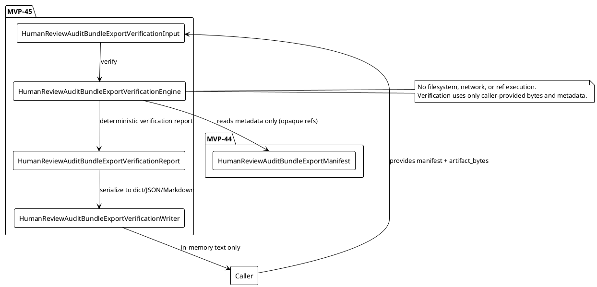
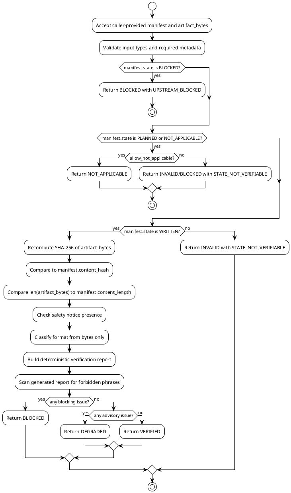

# SPEC-046 Human Review Audit Bundle Export Verification Replay

## Background

MVP-44 delivered an audit-only, local-only `human_review_audit_bundle_export` layer that writes a deterministic Human Review Audit Bundle export artifact and produces a manifest. The manifest records the expected SHA-256 content hash, the byte length, the export state (WRITTEN, BLOCKED, NOT_APPLICABLE, or PLANNED), and opaque references to upstream reports, bundles, and artifacts.

MVP-45 follows MVP-44 by providing a read-only, caller-provided verification/replay capability. While MVP-44 answers what was written and where, MVP-45 answers do the caller-provided bytes and manifest metadata agree. It recomputes the artifact hash and length from bytes supplied entirely by the caller, compares them to the manifest metadata, and emits a deterministic verification report. It never opens files, reads paths, fetches URLs, follows symlinks, or executes any artifact/report reference. It is a local, research-only, audit-only replay function with no filesystem writes, no network access, no server, no database, no scheduler, no daemon, no trading logic, and no production-readiness or approval semantics.

The verification layer is intentionally separate from src/hunter/human_review_audit_bundle_export/ and from any existing untracked src/hunter/cross_artifact_consistency/ area. It does not inspect, traverse, validate, or depend on data/, reports/, or cross_artifact_consistency/. It operates purely on in-memory caller inputs.

## Requirements

Use MoSCoW prioritization.

### Must Have

1. M1: The package must remain audit-only, local-only, and read-only. No file, network, API, exchange, trading, server, database, scheduler, daemon, or Web UI behavior is permitted.

2. M2: HumanReviewAuditBundleExportVerificationInput must accept only caller-provided in-memory values: manifest (caller-provided), artifact_bytes (caller-provided body bytes), expected_format (optional caller-provided hint), config, generated_at (fixed for deterministic output), and metadata.

3. M3: HumanReviewAuditBundleExportVerificationConfig must hold only pure local settings: strict (fail closed on advisory gap), require_safety_notice, verify_text_hash (optional text hash separate from byte hash), and allow_not_applicable.

4. M4: HumanReviewAuditBundleExportVerificationState must be an Enum with at least VERIFIED, NOT_APPLICABLE, BLOCKED, INVALID, and DEGRADED.

5. M5: HumanReviewAuditBundleExportVerificationSeverity must be an Enum with at least BLOCKING, ADVISORY, and INFO.

6. M6: HumanReviewAuditBundleExportVerificationReasonCode must include at least OK, NOT_APPLICABLE, HASH_MISMATCH, LENGTH_MISMATCH, STATE_NOT_VERIFIABLE, MISSING_MANIFEST_METADATA, UNSUPPORTED_FORMAT, SAFETY_NOTICE_MISSING, FORBIDDEN_TERM_PRESENT, UPSTREAM_BLOCKED, UPSTREAM_NOT_APPLICABLE, UPSTREAM_PLANNED, and TEXT_HASH_MISMATCH if text hash is implemented.

7. M7: HumanReviewAuditBundleExportVerificationIssue must be a frozen dataclass with deterministic issue_id, issue_type, severity, reason_codes, source, title, description, and generated_at.

8. M8: HumanReviewAuditBundleExportVerificationDataQuality must be a frozen dataclass with counters: checks_performed, hash_mismatch_count, length_mismatch_count, state_not_verifiable_count, missing_safety_notice_count, forbidden_term_count, blocking_issues, advisory_issues, and info_findings.

9. M9: HumanReviewAuditBundleExportVerificationSafetyFlags must be a frozen dataclass with boolean flags: is_safe, audit_only, no_executable_actions, no_trading_instructions, no_approval_claims, references_opaque, no_network, no_server, hash_verified, length_verified, state_verifiable, and safety_notice_present.

10. M10: HumanReviewAuditBundleExportVerificationReport must be a frozen dataclass with verification_id, report_id, manifest_id, bundle_report_id, generated_at, state, config, input_summary (no raw bytes), data_quality, safety_flags, reason_codes, issues, metadata, and notes.

11. M11: The verification engine must treat all artifact, path, and report references as opaque strings. It must never open, follow, traverse, validate, fetch, or execute artifact_ref, report_ref, output_path, tmp_path, bundle_id, report_id, manifest_id, queue_entry_id, decision_id, link_id, source_id, record_id, or any metadata value. The only data used is the caller-provided manifest metadata and the caller-provided artifact_bytes.

12. M12: The verification engine must verify for a WRITTEN manifest: recompute SHA-256 of artifact_bytes and compare to manifest.content_hash; compare len(artifact_bytes) to manifest.content_length; confirm manifest.state is WRITTEN; confirm required IDs are present and non-empty.

13. M13: The verification engine must preserve MVP-44 semantics: PLANNED/dry-run manifests have no artifact to verify; NOT_APPLICABLE has no artifact to verify; BLOCKED must not be treated as verified; WRITTEN may be VERIFIED only if all checks pass; if manifest.safety_flags.hash_verified is False, the verification engine still performs its own independent check and does not blindly trust the writer.

14. M14: The verification engine must scan generated verification report text for forbidden phrases. The generated report must never contain shell commands, patches, deployment steps, infrastructure steps, executable remediation, trading instructions, API keys, exchange actions, Freqtrade runtime, approval claims, certification claims, production-readiness claims, trading-readiness claims, recommendation, suitability, or actionable signals.

15. M15: The verification engine must classify artifact body format from artifact_bytes only, without executing the content. Classification is advisory unless strict is True and the format is unsupported.

16. M16: The verification engine must compute deterministic verification IDs using SHA-256 over canonical JSON of manifest_id, report_id from manifest, bundle_report_id, content_hash, content_length, state, generated_at, and a fixed verification kind marker. No random, time-now, environment, process, path, or network values may participate.

17. M17: The verification engine must be replayable: given the same manifest, artifact_bytes, config, generated_at, and metadata, it must produce the same verification_id, report_id, state, reason_codes, and data_quality counters.

18. M18: The verification engine must fail closed. Any mismatch, missing metadata, unsafe manifest state, unsupported format, or unsafe generated text must produce BLOCKED or INVALID. It must never silently accept inconsistent inputs as VERIFIED.

19. M19: The verification engine must not write to the filesystem. All outputs are in-memory models only. The writer layer may serialize those models to dict, JSON text, or Markdown text, but the engine itself performs no I/O.

20. M20: Tests and acceptance criteria must include unit tests, engine tests, writer tests, and integration tests using caller-provided bytes only. They must verify determinism, boundary safety, manifest state semantics, hash/length mismatch paths, missing safety notice, forbidden phrases, and full-suite regression checks.

### Should Have

1. S1: Expose pure data models and a pure engine function, e.g. verify_human_review_audit_bundle_export returning HumanReviewAuditBundleExportVerificationReport.

2. S2: Expose pure writer functions returning dict, JSON text, and Markdown text only: verification_report_to_dict, verification_report_to_json, verification_report_to_markdown.

3. S3: Support deterministic ordering and repeated-call equality for all serialized outputs.

4. S4: Include the MVP-44 safety notice at the top of all serialized verification outputs, plus an explicit statement that verification does not imply authenticity or readiness beyond byte/metadata consistency.

5. S5: Optionally classify the artifact body as JSON or Markdown from caller-provided bytes only and record the classification in the report.

6. S6: Provide a verify_human_review_audit_bundle_export_from_dict helper that accepts a manifest dict and artifact bytes, so callers can verify historical exports without importing the MVP-44 model directly.

### Could Have

1. C1: An optional normalized text hash computed over the artifact body decoded as UTF-8, stripped of BOM/CRLF, kept clearly separate from the byte hash. This is advisory and must not replace the byte hash check.

2. C2: A derived verification summary mapping export IDs (manifest, report, bundle) to a single deterministic verification fingerprint for audit catalogs.

3. C3: A replay transcript as a deterministic non-executable summary string listing the checks performed and their pass/fail status, suitable for human audit logs.

4. C4: A verify_multiple batch helper that processes a sequence of (manifest, bytes) pairs and returns a tuple of reports, but remains pure and I/O-free.

### Won't Have

1. W1: No opening, reading, or following of files, paths, URLs, symlinks, directories, or artifact refs.

2. W2: No filesystem writes, network calls, API calls, exchange connections, or database operations.

3. W3: No runtime report generation, runtime registries, dashboards, servers, schedulers, or daemons.

4. W4: No inspection, traversal, validation, fetching, or execution of upstream artifact/report references.

5. W5: No trading signals, order logic, execution logic, leverage, shorting, position sizing, or strategy runtime.

6. W6: No approval, certification, production-readiness, trading-readiness, recommendation, suitability, or signal-validity claims.

7. W7: No claim that the artifact is authentic, tamper-proof, or legally binding beyond caller-provided byte/metadata consistency.

8. W8: No dependency on data/, reports/, or any untracked src/hunter/cross_artifact_consistency/ area.

## Method

### Proposed Package Boundary

```text
src/hunter/human_review_audit_bundle_export_verification/
  __init__.py
  models.py
  engine.py
  writer.py

tests/test_human_review_audit_bundle_export_verification/
  test_models.py
  test_engine.py
  test_writer.py
  test_integration.py
```

The package is intentionally separate from src/hunter/human_review_audit_bundle_export/ (MVP-44) and from any existing untracked src/hunter/cross_artifact_consistency/ area. It only imports MVP-44 models as needed for type annotations and accepts caller-provided objects/bytes. No file in data/, reports/, or cross_artifact_consistency/ is read, written, or imported.

### Pure Data Model Outline

A Python-like pseudocode outline is provided for clarity. The actual implementation uses frozen dataclasses and enums:

- HumanReviewAuditBundleExportVerificationState Enum with values: VERIFIED, NOT_APPLICABLE, BLOCKED, INVALID, DEGRADED.
- HumanReviewAuditBundleExportVerificationSeverity Enum with values: BLOCKING, ADVISORY, INFO.
- HumanReviewAuditBundleExportVerificationReasonCode Enum with values: OK, NOT_APPLICABLE, HASH_MISMATCH, LENGTH_MISMATCH, STATE_NOT_VERIFIABLE, MISSING_MANIFEST_METADATA, UNSUPPORTED_FORMAT, SAFETY_NOTICE_MISSING, FORBIDDEN_TERM_PRESENT, UPSTREAM_BLOCKED, UPSTREAM_NOT_APPLICABLE, UPSTREAM_PLANNED, TEXT_HASH_MISMATCH.
- HumanReviewAuditBundleExportVerificationConfig frozen dataclass: strict, require_safety_notice, verify_text_hash, allow_not_applicable.
- HumanReviewAuditBundleExportVerificationIssue frozen dataclass: issue_id, issue_type, severity, reason_codes, source, title, description, generated_at.
- HumanReviewAuditBundleExportVerificationDataQuality frozen dataclass: counters for checks performed, mismatches, and issues.
- HumanReviewAuditBundleExportVerificationSafetyFlags frozen dataclass: is_safe, audit_only, no_executable_actions, no_trading_instructions, no_approval_claims, references_opaque, no_network, no_server, hash_verified, length_verified, state_verifiable, safety_notice_present.
- HumanReviewAuditBundleExportVerificationInput frozen dataclass: manifest, artifact_bytes, expected_format, config, generated_at, metadata.
- HumanReviewAuditBundleExportVerificationReport frozen dataclass: verification_id, report_id, manifest_id, bundle_report_id, generated_at, state, config, input_summary, data_quality, safety_flags, reason_codes, issues, metadata, notes.

### Engine / Verification Algorithm

1. Validate the input object: manifest must be compatible, artifact_bytes must be bytes, config must be valid, expected_format must be in allowlist if provided, metadata must be Mapping[str, str], generated_at resolved from input or manifest or INVALID.
2. Extract manifest metadata and record an opaque input_summary (IDs, state, content hash, content length, format; never raw bytes or paths).
3. If manifest.state is BLOCKED, return BLOCKED with UPSTREAM_BLOCKED.
4. If manifest.state is NOT_APPLICABLE and allow_not_applicable is True, return NOT_APPLICABLE with UPSTREAM_NOT_APPLICABLE.
5. If manifest.state is PLANNED and allow_not_applicable is True, return NOT_APPLICABLE with UPSTREAM_PLANNED.
6. If manifest.state is not WRITTEN and not covered above, return INVALID or BLOCKED with STATE_NOT_VERIFIABLE.
7. For WRITTEN manifests: verify required IDs and fields are present; recompute SHA-256 and compare to manifest.content_hash; compare len(artifact_bytes) to manifest.content_length; optionally verify text hash; check safety notice presence if required; classify body format from bytes if expected_format is provided.
8. Determine aggregate state: BLOCKED if any blocking issue exists; DEGRADED if only advisory issues and strict is False; VERIFIED if all checks pass.
9. Build safety_flags based on results.
10. Compute deterministic verification_id and report_id from canonical JSON of manifest IDs, content hash/length, verification state, and fixed verification kind marker.
11. Build the generated verification report text using writer functions, scan it for forbidden phrases. If found, override state to BLOCKED and emit FORBIDDEN_TERM_PRESENT.
12. Return HumanReviewAuditBundleExportVerificationReport.

### Writer Algorithm

1. verification_report_to_dict(report) returns a JSON-compatible, ordered dict. It must not include raw artifact_bytes or resolved file paths. It may include opaque manifest_id, report_id, bundle_report_id, and the fixed verification kind marker.
2. verification_report_to_json(report) returns a deterministic JSON string.
3. verification_report_to_markdown(report) returns a Markdown string with a safety notice at the top and a clear statement that the result is local byte/metadata consistency only, not authenticity or trading/production readiness.
4. All serialized outputs must be deterministic for identical report inputs.

### Data Quality and Safety Flags

- is_safe: False if forbidden terms are present or any safety check fails.
- hash_verified: True only if byte hash matches the manifest.
- length_verified: True only if byte length matches the manifest.
- state_verifiable: True only if the manifest state is WRITTEN and supported.
- safety_notice_present: True if the artifact body contains the expected safety notice phrase.
- references_opaque: Always True; verification never dereferences refs.
- no_network: Always True.
- no_server: Always True.

### State Model

- VERIFIED: manifest.state is WRITTEN, hash matches, length matches, no blocking issues.
- NOT_APPLICABLE: manifest.state is PLANNED, NOT_APPLICABLE, or BLOCKED with no expected artifact and allow_not_applicable is True.
- BLOCKED: manifest.state is BLOCKED, or hash/length mismatch, or forbidden term, or missing metadata, or strict promotion of advisory issue.
- INVALID: input malformed, unsupported format, or manifest missing required metadata.
- DEGRADED: advisory-only gaps when strict is False.

### Reason Codes

A table mapping reason codes to conditions:
- OK: verification succeeded with no advisory issues.
- NOT_APPLICABLE: no artifact expected for the manifest state.
- HASH_MISMATCH: recomputed SHA-256 differs from manifest.
- LENGTH_MISMATCH: byte length differs from manifest.
- STATE_NOT_VERIFIABLE: manifest state is not WRITTEN and not covered by NOT_APPLICABLE config.
- MISSING_MANIFEST_METADATA: required manifest IDs, hash, or length are missing.
- UNSUPPORTED_FORMAT: expected_format is not in the allowlist.
- SAFETY_NOTICE_MISSING: required safety notice phrase is absent from artifact body.
- FORBIDDEN_TERM_PRESENT: generated verification report contains forbidden language.
- UPSTREAM_BLOCKED: manifest state is BLOCKED.
- UPSTREAM_NOT_APPLICABLE: manifest state is NOT_APPLICABLE.
- UPSTREAM_PLANNED: manifest state is PLANNED.
- TEXT_HASH_MISMATCH: optional normalized text hash differs.

### Deterministic ID Strategy

- report_id: SHA-256 over canonical JSON of manifest_id, bundle_report_id, content_hash, content_length, generated_at, and fixed verification kind marker human_review_audit_bundle_export_verification.
- verification_id: SHA-256 over canonical JSON of report_id, manifest_id, state, content_hash, content_length, generated_at, and fixed verification kind marker.
- issue_id: SHA-256 over canonical JSON of issue_type, source, title, and a stable per-check counter; prefix export-verification-issue-digest[:16].
No random, time-now, environment, process, path, or network values may participate in any ID.

### Safety Scanner Strategy

Scan the generated verification report text for forbidden phrase categories including shell commands, command-line tools, patches, deployment, infrastructure, executable remediation, trading actions, API keys, exchange actions, Freqtrade runtime, approval, certification, production-ready, trading-ready, recommendation, suitability, and signal-validity. Allowed negation phrases include no trading, not production-ready, audit-only, and human review. If a forbidden phrase is found, the verification result is BLOCKED with FORBIDDEN_TERM_PRESENT.

### Format Classification Strategy

If expected_format is provided, record it as format_expected. Classify from bytes without parsing: JSON if decoded bytes start with optional whitespace followed by { or [; Markdown if decoded bytes start with optional whitespace followed by #, ---, or >; Unknown otherwise. Classification is advisory unless strict is True and expected_format differs from classified format.

### PlantUML Component Diagram



### PlantUML Activity Diagram



### Explicit Opaque-Ref Note

Every bundle_id, report_id, upstream_report_id, section_id, issue_id, manifest_id, verification_id, artifact_ref, report_ref, queue_entry_id, decision_id, link_id, source_id, record_id, output_path, tmp_path, and metadata key/value is an opaque string. The verification layer uses these strings only for deterministic identity, sorting, and human-audit serialization. They are never opened, followed, traversed, validated, fetched, or executed. This includes refs from the Human Review Queue, Human Review Decision Log, Human Review Decision Log Consistency report, Human Review Audit Bundle, and Human Review Audit Bundle Export layers. The only data consumed is the caller-provided manifest metadata and the caller-provided artifact_bytes.

### Explicit No-Authenticity/Certification Note

The verification report produced by MVP-45 is a deterministic recomputation of byte and metadata consistency between a caller-provided manifest and caller-provided bytes. It does not certify authenticity, tamper-proofing, legal validity, production readiness, trading readiness, or suitability for any purpose. It is not a recommendation or approval. It is a local, human-audit, research-only replay function.

## Implementation

### Phase 1: Models and Pure Engine

1. Add src/hunter/human_review_audit_bundle_export_verification/models.py with frozen dataclasses, enums, and SAFETY_NOTICE.
2. Add src/hunter/human_review_audit_bundle_export_verification/engine.py with verify_human_review_audit_bundle_export, deterministic ID helpers, format classification, safety notice check, forbidden term scanner, and input summary builder.

Stop conditions: model tests pass, engine tests pass, deterministic IDs stable, no forbidden imports, no file/network I/O in tests, no mutation of inputs, safety scanner returns expected results.

### Phase 2: Pure Writer

1. Add src/hunter/human_review_audit_bundle_export_verification/writer.py with verification_report_to_dict, verification_report_to_json, and verification_report_to_markdown. No filesystem writes; all return in-memory strings/dicts.

Stop conditions: writer tests pass, deterministic JSON/Markdown output, safety notice preserved, no forbidden phrases in serialized output, no bytes or paths leaked into output.

### Phase 3: Integration Tests

1. Add tests/test_human_review_audit_bundle_export_verification/test_integration.py with end-to-end scenarios using caller-provided bytes only:
   - WRITTEN manifest + matching bytes -> VERIFIED
   - WRITTEN manifest + tampered bytes -> BLOCKED with HASH_MISMATCH
   - WRITTEN manifest + truncated bytes -> BLOCKED with LENGTH_MISMATCH
   - BLOCKED manifest -> BLOCKED with UPSTREAM_BLOCKED, no hash check treated as verified
   - NOT_APPLICABLE / PLANNED manifest -> NOT_APPLICABLE with no bytes required
   - Deterministic repeated verification -> identical verification_id/report_id
   - Generated report safety sweep -> no forbidden phrases
   - No network/file I/O -> monkeypatch socket/urllib/file open to raise
   - Opaque refs -> refs remain strings, never opened

2. Stop conditions: full package tests pass, no regressions in full suite, deterministic outputs, no forbidden imports or I/O.

### Phase 4: Finalization and Tag

1. Ensure __init__.py exports only the public API.
2. Run model tests, engine tests, writer tests, and integration tests.
3. Run full test suite and confirm no regressions.
4. Stop conditions: full suite passes, no uncommitted source changes beyond the MVP-45 package, tag v0.45.0-dev created.

## Milestones

| Milestone | Deliverable | Stop Condition |
|-----------|-------------|----------------|
| M1 | SPEC-046 committed | Code-reviewer review complete, no blocking issues |
| M2 | Models + engine | Model tests and engine tests pass, deterministic IDs stable |
| M3 | Writer | Writer tests pass, no I/O in writer except in-memory serialization |
| M4 | Integration tests | Integration tests pass, no regressions in full suite |
| M5 | Finalization + tag v0.45.0-dev | Full suite passes, working tree clean |

## Gathering Results

### Test Plan

| Area | Checks |
|------|--------|
| Models | Frozen dataclasses, enum values, validation helpers |
| Config validation | Boolean validation, format allowlist, invalid format blocked |
| Hash verification | Matching bytes -> VERIFIED; tampered bytes -> BLOCKED with HASH_MISMATCH |
| Length verification | Truncated bytes -> BLOCKED with LENGTH_MISMATCH |
| State semantics | BLOCKED/NOT_APPLICABLE/PLANNED -> safe non-VERIFIED result |
| Safety notice | Missing safety notice handled per config; allowed phrases permitted |
| Format classification | JSON/Markdown classification from bytes only; no parsing/execution |
| Deterministic IDs | verification_id, report_id, issue_id stable for identical inputs |
| Opaque refs | No refs opened, traversed, or executed; no forbidden protocols in output |
| Writer | Deterministic JSON/Markdown; no forbidden phrases; no bytes/paths leaked |
| Integration | End-to-end bytes+manifest verification with no file/network I/O |
| Full suite | No regressions across all packages |

### Evaluation Metrics

- All tests pass.
- Deterministic output for identical inputs.
- No file writes, network calls, or ref traversal in engine or tests.
- No generated verification report contains forbidden executable, remediation, trading, deployment, or approval language.
- No dependency on data/, reports/, or cross_artifact_consistency/.

## Need Professional Help in Developing Your Architecture?

Please contact me at [sammuti.com](https://sammuti.com) :)
