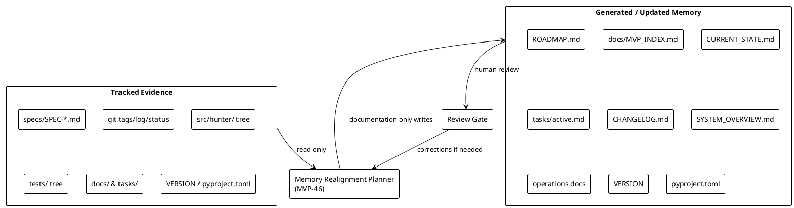

# SPEC-047 — Project Memory Realignment

## Background

The original master plan for Hunter Futures Pro was captured in `PROJECT.md`, `README.md`, and `tasks/backlog.md`. That plan defined a focused progression:

- **MVP-0** — Project Foundation (repository, documentation, agent workflow, safety rules)
- **MVP-1** — Data Foundation (Python project structure, configuration, logging, data collection planning)
- **MVP-2** — Market State (Regime Engine, Market Breadth Engine, JSON output, daily report)
- **MVP-3** — Strength and Futures Positioning (Relative Strength, Open Interest, scoring rules, rejection codes)
- **MVP-4** — Execution Control (Portfolio Engine, Decision Gate Engine, Freqtrade read-only integration, safe fallback rules)

`PROJECT.md` additionally listed 12 intended main modules: Data Foundation, Regime Engine, Market Breadth Engine, Relative Strength Engine, Open Interest Engine, Discovery Engine, Portfolio Engine, Decision Gate Engine, Backtest Validation Engine, Reporting Layer, Freqtrade Execution Layer, and Agent Memory Layer.

Since that original plan was written, the repository has expanded far beyond MVP-4. The functional MVP chain now runs from MVP-0 through **MVP-45**, with `HEAD` at commit `1047ede` and tag `v0.45.0-dev`. The 12 original modules are implemented across the expanded chain (e.g., Relative Strength at MVP-24, Open Interest at MVP-25, Discovery at MVP-26, Portfolio Construction at MVP-27, Backtesting at MVP-28, Reporting CLI at MVP-29, and Freqtrade integration layers at MVP-5 through MVP-9).

However, project memory files have not kept pace with the functional work. The following stale-memory issues are present:

- `VERSION` still says `0.1.0`.
- `pyproject.toml` says `version = "0.32.0-dev"`.
- `docs/handoff/CURRENT_STATE.md` describes MVP-32 as current.
- `tasks/active.md` describes MVP-40 as current.
- `CHANGELOG.md` ends at MVP-40 and omits MVP-41 through MVP-45.
- `docs/architecture/SYSTEM_OVERVIEW.md` still says "The project is currently in MVP-0."
- `docs/operations/RUNBOOK.md`, `TROUBLESHOOTING.md`, and `FAILURE_MODES.md` still describe MVP-0 state.
- `tasks/backlog.md` only covers the original MVP-0 through MVP-4 plan.
- The `v0.32.0-dev` tag appears missing from the tag list even though the corresponding finalization commit exists.

This SPEC defines a **documentation-only memory realignment** effort (MVP-46) to bring the project memory files into agreement with the actual repository state, without adding or modifying any runtime behavior.

Excluded from this SPEC and from any audit action are the pre-existing local artifact areas `data/`, `reports/`, and the untracked `src/hunter/cross_artifact_consistency/` directory. These remain opaque and untouched.

## Requirements

### Must

- Realign project memory to the actual repository state: **MVP-45 / v0.45.0-dev**.
- Preserve the original master plan (MVP-0 through MVP-4 and the 12 main modules) as **historical context**, not overwrite or delete it.
- Document clearly that functional implementation has exceeded the original MVP-0 through MVP-4 plan.
- Establish a deterministic, evidence-based MVP index derived only from tracked files, specs, and git metadata.
- Create or update human-readable project roadmap and current-state docs.
- Update stale references in `VERSION`, `pyproject.toml`, `docs/handoff/CURRENT_STATE.md`, `tasks/active.md`, and `CHANGELOG.md`.
- Keep the `v0.32.0-dev` missing tag as a recorded anomaly unless separately approved by a human.
- Keep `data/`, `reports/`, and untracked `src/hunter/cross_artifact_consistency/` opaque and excluded from all changes.
- Avoid any functional runtime changes.
- Avoid production-readiness, trading-readiness, approval, certification, recommendation, or suitability claims.
- Avoid shell commands, patches, deployment steps, infrastructure steps, executable remediation, or trading/API/Freqtrade runtime actions in generated documentation bodies.

### Should

- Create `ROADMAP.md` as the canonical chronological roadmap.
- Create `docs/MVP_INDEX.md` as the deterministic MVP → spec → package → tag mapping.
- Update `docs/handoff/CURRENT_STATE.md` to reflect MVP-45 / v0.45.0-dev.
- Update `tasks/active.md` to reflect MVP-45 completion and the next memory-realignment task.
- Update `CHANGELOG.md` to add MVP-41 through MVP-45 completion sections.
- Align `VERSION` and `pyproject.toml` to `0.45.0-dev`.
- Update `docs/architecture/SYSTEM_OVERVIEW.md` to describe the current 11-layer architecture rather than MVP-0.
- Update `docs/operations/RUNBOOK.md`, `TROUBLESHOOTING.md`, and `FAILURE_MODES.md` to remove stale MVP-0 state and reflect current operational reality.

### Could

- Update `tasks/agent-log.md` with summary entries for MVP-33 through MVP-45.
- Add a package-to-MVP appendix in `docs/MVP_INDEX.md`.
- Add a `v0.32.0-dev` missing-tag anomaly section in `docs/MVP_INDEX.md` or `ROADMAP.md`.
- Add a note that next functional MVP selection is blocked until memory realignment is complete.

### Won't

- Add or change runtime features, trading logic, data collection, or execution behavior.
- Modify exchange/API/network/Freqtrade interactions.
- Add Web UI, dashboard, server, database, scheduler, or daemon.
- Create the `v0.32.0-dev` tag automatically as part of this SPEC.
- Inspect, traverse, or modify `data/`, `reports/`, or untracked `src/hunter/cross_artifact_consistency/`.
- Claim that the system is ready for production, live trading, or any external deployment.

## Method

This MVP is a **documentation-only architecture** effort. All output is human-readable text; no code, no runtime, no executable artifacts.

### Deterministic Evidence Sources

All realignment content must be derived from the following tracked sources only:

- `specs/SPEC-*.md` (SPEC-001 through SPEC-046)
- `docs/architecture/SYSTEM_OVERVIEW.md`
- `docs/decisions/ADR-0001*.md`, `ADR-0002*.md`, `ADR-0003*.md`
- `docs/operations/RUNBOOK.md`, `TROUBLESHOOTING.md`, `FAILURE_MODES.md`
- `docs/handoff/CURRENT_STATE.md`
- `tasks/active.md`, `tasks/backlog.md`, `tasks/agent-log.md`
- `README.md`, `PROJECT.md`, `AGENTS.md`, `CHANGELOG.md`
- `VERSION`, `pyproject.toml`, `package.json`
- `git tag --list "v0.*-dev"`, `git log --oneline --decorate`, `git status --short`
- Tracked `src/hunter/<package>/` directory names
- Tracked `tests/test_<package>/` directory names

### MVP Index Fields

`docs/MVP_INDEX.md` must contain, for each MVP, a row with:

- `mvp_number` — integer
- `title` — from spec title or commit message
- `spec_file` — e.g. `specs/SPEC-046-...md`
- `tag` — e.g. `v0.45.0-dev`, or `missing` / `none`
- `status` — `tagged`, `committed`, `spec-only`, or `unknown`
- `source_packages` — list of tracked `src/hunter/<package>/` names
- `test_packages` — list of tracked `tests/test_<package>/` names
- `evidence` — short note (commit, tag, spec)
- `anomalies` — e.g. missing tag, stale doc, package/spec mismatch

### Roadmap Sections

`ROADMAP.md` must contain:

1. **Original Master Plan** — MVP-0 through MVP-4 and the 12 PROJECT.md modules, preserved as historical context.
2. **Expanded MVP Chain** — chronological list of MVP-5 through MVP-45 with spec, tag, and one-line purpose.
3. **Current Position** — MVP-45 / v0.45.0-dev, HEAD `1047ede`, and a statement that the project is beyond the original plan.
4. **Drift Register** — stale memory items discovered before this SPEC, with file/path evidence.
5. **Next Decision** — memory realignment is the next step; functional MVP selection is blocked until alignment is complete.

### Planned Files

The following files are in scope for creation or update during MVP-46 implementation:

- New: `ROADMAP.md`
- New: `docs/MVP_INDEX.md`
- Update: `docs/handoff/CURRENT_STATE.md`
- Update: `tasks/active.md`
- Update: `CHANGELOG.md`
- Update: `VERSION`
- Update: `pyproject.toml`
- Update: `docs/architecture/SYSTEM_OVERVIEW.md`
- Update: `docs/operations/RUNBOOK.md`
- Update: `docs/operations/TROUBLESHOOTING.md`
- Update: `docs/operations/FAILURE_MODES.md`
- Optional update: `tasks/agent-log.md`

### Safety Policies

- **Original-plan preservation policy:** The original MVP-0 through MVP-4 plan and the 12-module list remain visible in `ROADMAP.md` under an "Original Master Plan" section. They are not deleted or replaced.
- **Expanded-chain documentation policy:** MVP-5 through MVP-45 are documented as an expanded chain that grew beyond the original plan, not as a rewrite of it.
- **Stale-memory correction policy:** Stale references (VERSION, pyproject.toml, CURRENT_STATE.md, active.md, CHANGELOG.md, SYSTEM_OVERVIEW.md, operations docs) are corrected to v0.45.0-dev / MVP-45.
- **Missing-tag anomaly policy:** The absent `v0.32.0-dev` tag is recorded as an anomaly. No automatic tag creation is performed.
- **Excluded-artifact policy:** `data/`, `reports/`, and untracked `src/hunter/cross_artifact_consistency/` are never inspected, traversed, or modified.
- **No-runtime-change policy:** No Python source, tests, scripts, configs, or package behavior are changed.

### Architecture Diagram

## Implementation

MVP-46 is implemented in small, reviewable documentation steps. No functional code changes.

### Step 1 — SPEC

Create and review `specs/SPEC-047-Project-Memory-Realignment.md` (this file). No other files are touched in this step.

### Step 2 — Roadmap and Index

Create:

- `ROADMAP.md` with Original Master Plan, Expanded MVP Chain, Current Position, Drift Register, and Next Decision sections.
- `docs/MVP_INDEX.md` with the deterministic MVP index table and appendices for package mappings, missing-tag anomaly, and excluded artifact areas.

### Step 3 — Current-State and Version Alignment

Update:

- `docs/handoff/CURRENT_STATE.md` to state MVP-45 / v0.45.0-dev and list the audit bundle/export/verification chain as current.
- `tasks/active.md` to mark MVP-45 complete and set MVP-46 memory realignment as the active task.
- `CHANGELOG.md` to add MVP-41 through MVP-45 completion sections, derived from commit messages and spec titles.
- `VERSION` to `0.45.0-dev`.
- `pyproject.toml` `version` to `0.45.0-dev`.

### Step 4 — Architecture and Operations Docs Refresh

Update:

- `docs/architecture/SYSTEM_OVERVIEW.md` to describe the current Agent, Decision, and Execution layers, plus the expanded local research audit/governance layers, without claiming the project is still in MVP-0.
- `docs/operations/RUNBOOK.md` to reflect the current operating phase (MVP-45) and the safe-startup checklist.
- `docs/operations/TROUBLESHOOTING.md` to remove MVP-0-only troubleshooting and reference current memory-realization issues.
- `docs/operations/FAILURE_MODES.md` to remove MVP-0-only failure modes and describe current stale-memory failure modes (e.g., agent reads stale CURRENT_STATE.md and starts wrong MVP).

### Step 5 — Review and Finalization

Review all updated files against the evidence sources. Ensure:

- No runtime changes were introduced.
- No excluded directories were touched.
- No production/trading readiness claims appear.
- `ROADMAP.md` and `docs/MVP_INDEX.md` are internally consistent and consistent with git tags.

### Step 6 — Missing Tag Decision (Separate)

The `v0.32.0-dev` missing tag is recorded as an anomaly. A separate human decision is required to either:

- Retroactively tag commit `24b7a30` as `v0.32.0-dev`, or
- Leave the anomaly documented and proceed.

This SPEC does not implement either option automatically.

## Milestones

1. SPEC-047 accepted and committed.
2. `ROADMAP.md` and `docs/MVP_INDEX.md` created.
3. `CURRENT_STATE.md`, `tasks/active.md`, `CHANGELOG.md`, `VERSION`, and `pyproject.toml` aligned to v0.45.0-dev / MVP-45.
4. `SYSTEM_OVERVIEW.md` and operations docs refreshed.
5. Final review completed; no runtime changes introduced.
6. `v0.46.0-dev` tag created only after explicit human approval.

## Gathering Results

After MVP-46 is complete, the following must be true:

- A new AI agent can open the repository and identify the current project position (MVP-45 / v0.45.0-dev) without reading git history.
- `ROADMAP.md` and `docs/MVP_INDEX.md` agree with the tracked spec, source-package, test-package, and git-tag evidence.
- `VERSION` and `pyproject.toml` agree with `v0.45.0-dev` until the next tag is created.
- Stale MVP-0 / MVP-32 / MVP-40 references are removed or explicitly marked as historical.
- The original master plan remains visible and unchanged in meaning.
- The excluded local artifact areas (`data/`, `reports/`, `src/hunter/cross_artifact_consistency/`) remain untouched.
- No runtime behavior has been changed.

## Need Professional Help in Developing Your Architecture?

Please contact me at [sammuti.com](https://sammuti.com) :)
