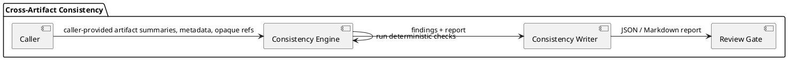

# SPEC-048-Cross-Artifact-Consistency-Engine

## Background

The original master plan (MVP-0 through MVP-4) is complete. The expanded MVP
chain has reached MVP-45 / v0.45.0-dev, and MVP-46 Project Memory Realignment has
aligned the repository's documentation, version metadata, and project memory
with that state. The project now contains many local audit/research artifact
producers across MVP-10 through MVP-45: observation reports, review records,
review index/search artifacts, research bundles, chronicle timelines, digest
summaries, quality gate reports, handoff packets, archive manifests, release
notes, audit catalogs, audit closure reports, audit snapshots, experiment ledger
entries, final audit packs, remediation backlog/evidence/closure artifacts,
human review queue entries, human review decision logs, decision log consistency
reports, audit bundles, audit bundle exports, and audit bundle export
verification reports.

A deterministic cross-artifact consistency layer is needed to compare
caller-provided artifact metadata and opaque references across these families
without opening files, traversing paths, or executing anything. This layer
answers the question: "Given the metadata and opaque refs the caller provides,
do the declared relationships between artifacts make sense?" It is explicitly
not a file ingestion pipeline, a runtime registry, a background validator, or a
trading signal generator.

The existing untracked `src/hunter/cross_artifact_consistency/` directory remains
excluded and opaque during this SPEC creation. It may be used as the package
home for the implementation, but its current contents must not be inspected or
relied upon by the SPEC, the engine, or the tests unless a separate explicit
implementation decision approves that. Any pre-existing files inside it are
treated as excluded local artifacts.

MVP-47 is audit-only and does not create execution or trading behavior. It does
not connect to Binance, exchanges, APIs, networks, live data, or real trading.
It does not place orders, suggest orders, emit action commands, or create
execution instructions. It does not produce or consume Freqtrade strategy
classes. It does not modify execution, strategy, Freqtrade, order, exchange, or
portfolio paths. It does not start a server, daemon, scheduler, Web UI,
dashboard, API, database, or runtime registry.

## Requirements

### Must Have (M)

- **M1:** Provide a local Cross-Artifact Consistency Engine package at
  `src/hunter/cross_artifact_consistency/` with a public API exported from
  `src/hunter/cross_artifact_consistency/__init__.py`. The package path may be
  pre-existing on disk as an untracked directory; the implementation must not
  read any pre-existing contents unless explicitly approved in a separate step.
- **M2:** The engine is local-only and call-triggered; no server, no REST API, no
  Web UI, no dashboard, no daemon, no scheduler, no background loop, no cron, no
  database, no network calls, no exchange calls, no Binance, no Freqtrade
  import/runtime, no API keys, no live data, no real orders, no leverage, no
  shorting, no action commands, no trading signals, no approvals.
- **M3:** Accept caller-provided in-memory artifact summaries, metadata, and
  opaque references only. Never open, follow, traverse, validate, fetch,
  execute, or stat artifact refs or paths. Refs and paths are opaque strings.
- **M4:** Never inspect `data/`, `reports/`, or the existing untracked
  `src/hunter/cross_artifact_consistency/` directory during engine operation or
  tests.
- **M5:** Produce deterministic consistency reports across repeated calls with
  the same input.
- **M6:** Detect cross-artifact mismatches using metadata only, including at
  least: duplicate artifact IDs, missing upstream references, orphan downstream
  references, inconsistent state transitions, mismatched MVP/spec metadata,
  mismatched hash/length metadata, decision log vs queue mismatches, audit
  bundle vs export mismatches, and verification report vs export manifest
  mismatches.
- **M7:** Include findings, severity, reason codes, evidence summaries, data
  quality counters, and safety flags in the report.
- **M8:** Fail closed on malformed or contradictory metadata.
- **M9:** Keep all artifact/path/report refs as opaque strings. Never normalize
  paths or resolve them to filesystem objects.
- **M10:** Avoid actionable trading signals. Avoid live trading/orders/exchange
  API/network/Freqtrade runtime behavior.
- **M11:** Avoid Web UI/dashboard/server/database/scheduler/daemon behavior.
- **M12:** Avoid production-readiness, trading-readiness, approval,
  certification, recommendation, or suitability claims in generated output.
- **M13:** Generated report bodies must contain no shell commands, patches,
  deployment steps, infrastructure steps, executable remediation, trading/API
  Freqtrade runtime instructions, or readiness/certification claims.

### Should Have (S)

- **S1:** Cover consistency relationships across the following artifact families
  (using caller-provided summaries only):
  - observation reports
  - review records
  - review index/search artifacts
  - research bundles
  - chronicle timelines
  - digest summaries
  - quality gate reports
  - handoff packets
  - archive manifests
  - release notes
  - audit catalogs
  - audit closure reports
  - audit snapshots
  - experiment ledger entries
  - final audit packs
  - remediation backlog/evidence/closure artifacts
  - human review queue entries
  - human review decision logs
  - decision log consistency reports
  - audit bundles
  - audit bundle exports
  - audit bundle export verification reports
- **S2:** Provide a deterministic JSON-compatible model.
- **S3:** Provide a deterministic Markdown writer.
- **S4:** Provide integration tests using caller-built in-memory sample
  artifacts only. No test may read actual artifact files from `data/` or
  `reports/`.
- **S5:** Include a migration/formalization policy for the existing untracked
  `src/hunter/cross_artifact_consistency/` path: treat it as a package home only;
  do not read or import existing contents during implementation or review unless
  a separate explicit approval is granted.

### Could Have (C)

- **C1:** Provide package-to-MVP mapping checks (e.g., declared artifact kind
  matches expected MVP range based on `docs/MVP_INDEX.md` conventions).
- **C2:** Provide tag/spec/doc consistency checks as optional warning inputs,
  surfaced only if the caller explicitly passes project-memory metadata (e.g.
  `VERSION` content, `pyproject.toml` version, git tag list) into the engine.
- **C3:** Provide configurable strict/non-strict behavior: strict mode treats
  warnings as findings; non-strict treats warnings as informational only.
- **C4:** Provide grouped findings by artifact family or by relationship type.

### Won't Have (W)

- **W1:** Read or write actual artifact files. The engine operates strictly on
  caller-provided in-memory data.
- **W2:** Inspect `data/` or `reports/`.
- **W3:** Inspect the current untracked `src/hunter/cross_artifact_consistency/`
  directory during SPEC, implementation, or review.
- **W4:** Start runtime services.
- **W5:** Add a database, server, scheduler, or web UI.
- **W6:** Execute Freqtrade, exchange, or API behavior.
- **W7:** Produce trading signals or execution decisions.
- **W8:** Create or repair historical tags automatically.
- **W9:** Claim production readiness, trading readiness, approval,
  certification, recommendation, or suitability.

## Method

### Proposed Package

- `src/hunter/cross_artifact_consistency/` — implementation package.
- `tests/test_cross_artifact_consistency/` — test package.

The `src/hunter/cross_artifact_consistency/` path may already exist as an
untracked directory. The implementation must treat it as a package home and must
not read, import, or rely on any pre-existing files inside it unless a separate
explicit implementation decision approves that. This SPEC does not inspect those
contents.

### Data Model

Define frozen dataclasses with deterministic ordering and equality:

- `CrossArtifactConsistencyInput` — top-level input containing a list of
  `ArtifactSummary` objects and a `CrossArtifactConsistencyConfig`.
- `ArtifactSummary` — a lightweight summary of any artifact family:
  - `artifact_id` (string, canonical ID)
  - `artifact_kind` (string, e.g. `observation`, `audit_bundle`)
  - `artifact_state` (string, e.g. `READY`, `BLOCKED`)
  - `mvp` (string, MVP number, e.g. `MVP-43`)
  - `spec` (string, SPEC reference, e.g. `SPEC-045`)
  - `produced_by` (string, package name, e.g. `human_review_audit_bundle`)
  - `opaque_ref` (string, path or URI; never resolved)
  - `content_hash` (optional string)
  - `content_length` (optional int)
  - `generated_at` (optional ISO-8601 string)
  - `upstream_ids` (tuple of strings)
  - `downstream_ids` (tuple of strings)
  - `decision_ids` (tuple of strings)
  - `review_ids` (tuple of strings)
  - `report_ids` (tuple of strings)
  - `metadata` (dict[str, str], additional safe metadata only)
- `ConsistencyRule` — a named consistency check, e.g.
  `DUPLICATE_ARTIFACT_ID_CHECK`, `MISSING_UPSTREAM_CHECK`.
- `ConsistencyFinding` — a single finding:
  - `finding_id` (string)
  - `rule` (`ConsistencyRule`)
  - `severity` (`ConsistencySeverity`)
  - `artifact_ids` (tuple of strings)
  - `message` (human-readable string, no dynamic shell commands or executable
    content)
  - `evidence` (dict[str, str], metadata only)
- `ConsistencyReport` — the aggregate output:
  - `state` (`ConsistencyState`)
  - `summary` (`ConsistencySummary`)
  - `findings` (tuple of `ConsistencyFinding`)
  - `data_quality` (`ConsistencyDataQuality`)
  - `safety_flags` (`ConsistencySafetyFlags`)
  - `reason_codes` (tuple of strings)
- `ConsistencyDataQuality` — counters for inputs, checked, skipped, passed,
  failed, and warnings.
- `ConsistencySafetyFlags` — standard safety flags, e.g. `HUMAN_AUDIT_ONLY`,
  `NOT_TRADING_SIGNAL`, `NO_FILE_INGESTION`, `NO_NETWORK_CONNECTION`,
  `NO_EXCHANGE_CONNECTION`, `NO_FREQTRADE_INPUT`, `NO_SCHEDULER`, `NO_DAEMON`,
  `NO_WEB_UI`, `NO_DATABASE`, `NO_ACTION_COMMANDS_EMITTED`.
- `CrossArtifactConsistencyConfig` — strict/non-strict mode, enabled checks,
  optional project-memory metadata for warnings only.

### Enums and Reason Codes

- `ConsistencyState`:
  - `OK`
  - `DEGRADED`
  - `BLOCKED`
  - `NOT_APPLICABLE`
- `ConsistencySeverity`:
  - `INFO`
  - `WARNING`
  - `BLOCKING`
- Reason codes (string constants):
  - `OK`
  - `DUPLICATE_ARTIFACT_ID`
  - `MISSING_UPSTREAM_REFERENCE`
  - `ORPHAN_DOWNSTREAM_REFERENCE`
  - `INCONSISTENT_STATE_TRANSITION`
  - `MISMATCHED_MVP_SPEC_METADATA`
  - `MISMATCHED_HASH_LENGTH`
  - `DECISION_LOG_QUEUE_MISMATCH`
  - `AUDIT_BUNDLE_EXPORT_MISMATCH`
  - `VERIFICATION_EXPORT_MANIFEST_MISMATCH`
  - `STALE_PROJECT_MEMORY_MARKER`
  - `FORBIDDEN_PHRASE_LEAKAGE`
  - `UNSAFE_INPUT`
  - `INSUFFICIENT_DATA`

### Consistency Checks

The engine applies a deterministic, ordered set of checks to the caller-provided
artifact summaries:

1. **Duplicate artifact ID** — two or more summaries share the same
   `artifact_id`.
2. **Missing upstream reference** — an `upstream_id` declared by one summary does
   not match any `artifact_id` in the input set.
3. **Orphan downstream reference** — an `artifact_id` is referenced as a
   `downstream_id` but the referenced artifact is not present in the input set.
4. **Inconsistent state transition** — an upstream artifact is `BLOCKED` while a
   declared downstream artifact is `READY` or `OK`.
5. **Mismatched MVP/spec metadata** — an artifact's `mvp` and `spec` fields do not
   follow the expected mapping convention (e.g. `SPEC-025` for `MVP-24`). Treated
   as a warning unless it is contradicted by an explicit caller-provided
   mapping.
6. **Mismatched hash/length metadata** — if a downstream artifact declares a
   content hash or length, it must match the upstream's declared hash/length if
   both are provided. Missing values are tolerated.
7. **Decision log vs queue mismatch** — a decision log entry references a
   decision ID that does not appear in any queue entry's `decision_ids`, or vice
   versa.
8. **Audit bundle vs export mismatch** — an audit bundle export declares an
   export manifest that does not match the upstream audit bundle's
   `report_ids`/`downstream_ids`.
9. **Verification report vs export manifest mismatch** — a verification report
   references an export ID that is not declared by any audit bundle export
   summary.
10. **Stale project-memory marker** — optional warning only, triggered when the
    caller provides project-memory metadata (e.g. `VERSION` content, git tag
    list) and a mismatch is detected. It does not repair or create tags.
11. **Forbidden phrase leakage** — the generated report text or finding messages
    contain prohibited claims such as production readiness, trading readiness,
    approval, certification, recommendation, or suitability. The engine must
    fail closed and surface a `FORBIDDEN_PHRASE_LEAKAGE` finding.

### State and Severity Model

- `ConsistencyState.OK` — no blocking findings; zero or more informational
  findings.
- `ConsistencyState.DEGRADED` — only warning-level findings; no blocking
  findings.
- `ConsistencyState.BLOCKED` — one or more blocking findings; malformed or
  contradictory metadata.
- `ConsistencyState.NOT_APPLICABLE` — no artifact summaries provided.

- `ConsistencySeverity.INFO` — advisory finding, does not affect state.
- `ConsistencySeverity.WARNING` — degrades state to `DEGRADED` in strict mode;
  informational in non-strict mode.
- `ConsistencySeverity.BLOCKING` — forces `BLOCKED` state.

### Determinism

- Stable sorting: findings are sorted by `rule`, then `severity`, then
  `finding_id`.
- Canonical IDs: caller-provided `artifact_id` strings are used as-is; the
  engine does not generate or mutate IDs.
- Stable reason codes: all reason codes are defined as string constants.
- Stable JSON output: `report_to_dict` produces a deterministic dictionary
  suitable for JSON serialization.
- Stable Markdown output: `report_to_markdown` produces deterministic Markdown
  with a fixed section order and no dynamic shell commands or executable
  content.

### Safety

- Opaque refs only: `opaque_ref`, `artifact_id`, and all relationship fields are
  strings. The engine never uses them as filesystem paths.
- No filesystem reads or writes in the engine: the engine operates strictly on
  in-memory data.
- No network access.
- No runtime actions.
- The report is labeled as human-audit / research-only and explicitly states it
  is not a trading signal, not a trade approval, not a strategy approval, not
  an execution approval, not a portfolio/universe approval, not a release
  approval, and not a certification.

### PlantUML Component Diagram

## Implementation

Break MVP-47 into small steps:

1. **Step 1 — SPEC only.** Approve `SPEC-048-Cross-Artifact-Consistency-Engine.md`
   before any implementation.
2. **Step 2 — Models and engine.** Implement the frozen dataclasses, enums,
   reason codes, and the deterministic consistency engine. Add model and
   engine tests.
3. **Step 3 — Writer.** Implement deterministic JSON and Markdown writers, plus
   writer tests.
4. **Step 4 — Integration tests.** Add integration tests across representative
   artifact families, using only caller-built in-memory sample artifacts. No
   reading of `data/` or `reports/`.
5. **Step 5 — Memory/status update and finalization.** Update
   `docs/handoff/CURRENT_STATE.md`, `tasks/active.md`, `CHANGELOG.md`, `VERSION`,
   and `pyproject.toml` to reflect MVP-47 completion. Tag `v0.47.0-dev` only after
   explicit approval.
6. **Step 6 — Optional pre-existing path handling.** If the untracked
   `src/hunter/cross_artifact_consistency/` directory contains pre-existing
   files, make a separate explicit decision whether to preserve, migrate, or
   remove them. Do not perform this step during SPEC creation or during the
   initial implementation steps without explicit approval.

## Milestones

- SPEC-048 accepted.
- Models and engine implemented with tests.
- Writer implemented with tests.
- Integration tests implemented across representative artifact families.
- Final review completed.
- `v0.47.0-dev` tag created only after explicit approval.

## Gathering Results

After implementation, verify that:

- Reports are deterministic across repeated calls with the same input.
- Opaque refs remain strings only; the engine never opens, follows, traverses,
  validates, fetches, or executes them.
- `data/`, `reports/`, and the pre-existing untracked
  `src/hunter/cross_artifact_consistency/` remain untouched unless separately
  approved.
- Malformed or contradictory metadata fails closed (state `BLOCKED`).
- No runtime, trading, API, exchange, or Freqtrade behavior is introduced.
- No production-readiness, trading-readiness, approval, certification,
  recommendation, or suitability claims appear in generated output or
  documentation.
- Generated reports contain no shell commands, patches, deployment steps,
  infrastructure steps, executable remediation, or trading/API/Freqtrade runtime
  instructions.

## Need Professional Help in Developing Your Architecture?

Please contact me at [sammuti.com](https://sammuti.com) :)
