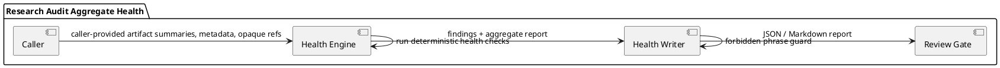

# SPEC-049-Research-Audit-Aggregate-Health-Report

## Background

The original master plan (MVP-0 through MVP-4) is complete. The expanded MVP
chain has reached MVP-47 / v0.47.0-dev, and the Cross-Artifact Consistency
Engine (SPEC-048) is complete and tagged. The repository now contains many
local audit/research artifact families, each producing its own reports,
summaries, and metadata. Human reviewers and project memory maintenance need a
single, deterministic, severity-weighted aggregate health view over the outputs
of these families without reading artifact files, traversing directories, or
executing anything.

A Research Audit Aggregate Health Report engine is needed to consume
caller-provided in-memory summaries from existing artifact families and produce
a single health report. It answers the question: "Given the summaries the caller
provides, what is the overall health of the research audit landscape, and which
families contribute the most weight to that health?" It is explicitly not a file
ingestion pipeline, a runtime monitor, a background validator, or a trading
signal generator.

MVP-48 is audit-only and does not create execution or trading behavior. It does
not connect to Binance, exchanges, APIs, networks, live data, or real trading.
It does not place orders, suggest orders, emit action commands, or create
execution instructions. It does not produce or consume Freqtrade strategy
classes. It does not modify execution, strategy, Freqtrade, order, exchange, or
portfolio paths. It does not start a server, daemon, scheduler, Web UI,
dashboard, API, database, or runtime registry.

## Requirements

### Must Have (M)

- **M1:** Provide a local Research Audit Aggregate Health Report package at
  `src/hunter/research_audit_health/` with a public API exported from
  `src/hunter/research_audit_health/__init__.py`.
- **M2:** The engine is local-only and call-triggered; no server, no REST API, no
  Web UI, no dashboard, no daemon, no scheduler, no background loop, no cron, no
  database, no network calls, no exchange calls, no Binance, no Freqtrade
  import/runtime, no API keys, no live data, no real orders, no leverage, no
  shorting, no action commands, no trading signals, no approvals.
- **M3:** Accept caller-provided in-memory artifact summaries, metadata, and
  opaque references only. Never open, follow, traverse, validate, fetch,
  execute, or stat artifact refs or paths. Refs and paths are opaque strings.
- **M4:** Never inspect `data/`, `reports/`, or any other artifact output
  directory during engine operation or tests.
- **M5:** Produce deterministic aggregate health reports across repeated calls
  with the same input.
- **M6:** Support summaries from the following artifact families (using
  caller-provided summaries only):
  - research audit snapshot (`research_audit_snapshot`)
  - research audit catalog (`research_audit_catalog`)
  - release notes snapshot (`research_release_notes`)
  - audit closure report (`research_audit_closure`)
  - quality gate report (`research_quality_gate`)
  - human review queue (`human_review_queue`)
  - human review decision log (`human_review_decision_log`)
  - audit bundle (`human_review_audit_bundle`)
  - audit bundle export verification/replay
    (`human_review_audit_bundle_export_verification`)
  - cross-artifact consistency report (`cross_artifact_consistency`)
  - project memory/status summary (caller-provided memory metadata)
- **M7:** Include findings, severity, reason codes, family-level health scores,
  an aggregate severity-weighted score, data-quality counters, and safety flags
  in the report.
- **M8:** Fail closed on malformed or contradictory input metadata.
- **M9:** Keep all artifact/path/report refs as opaque strings. Never normalize
  paths or resolve them to filesystem objects.
- **M10:** Avoid actionable trading signals. Avoid live trading/orders/exchange
  API/network/Freqtrade runtime behavior.
- **M11:** Avoid Web UI/dashboard/server/database/scheduler/daemon behavior.
- **M12:** Avoid production-readiness, trading-readiness, approval,
  certification, recommendation, or suitability claims in generated output.
- **M13:** Generated report bodies must contain no shell commands, patches,
  deployment steps, infrastructure steps, executable remediation, trading/API
  Freqtrade runtime instructions, or readiness/certification claims.
- **M14:** Provide a deterministic JSON-compatible model and a deterministic
  Markdown writer. The writer must guard against forbidden phrases and fail
  closed if any prohibited claim leaks into output.

### Should Have (S)

- **S1:** Provide a severity-weighted aggregate score that combines per-family
  scores using a deterministic, documented formula (e.g., weighted sum of
  normalized family scores minus blocking severity penalties).
- **S2:** Provide per-family health rollups, including family state, finding
  count, reason-code counts, and a family-level score.
- **S3:** Provide data-quality summary counters for inputs, families checked,
  findings, skipped checks, and reason-code totals.
- **S4:** Provide integration tests using caller-built in-memory sample
  summaries only. No test may read actual artifact files from `data/` or
  `reports/`.
- **S5:** Include configurable strict/non-strict mode: strict mode treats
  warnings as degraded-state contributors; non-strict treats warnings as
  informational only for scoring purposes.
- **S6:** Include a configurable severity weight map (e.g., BLOCKING=1.0,
  WARNING=0.5, INFO=0.0) that is used by the scoring formula but does not
  affect the reason-code assignment.

### Could Have (C)

- **C1:** Provide trend support by accepting an optional previous health report
  summary (caller-provided) and surfacing a trend direction (`IMPROVED`,
  `DEGRADED`, `UNCHANGED`, `NEW`) at the aggregate level and per family.
- **C2:** Provide a configurable family inclusion list, allowing the caller to
  restrict aggregation to a subset of families.
- **C3:** Provide optional project-memory metadata checks (e.g., current MVP
  from caller-provided memory metadata) surfaced only as informational
  findings.

### Won't Have (W)

- **W1:** Read or write actual artifact files. The engine operates strictly on
  caller-provided in-memory data.
- **W2:** Inspect `data/` or `reports/`.
- **W3:** Start runtime services.
- **W4:** Add a database, server, scheduler, or web UI.
- **W5:** Execute Freqtrade, exchange, or API behavior.
- **W6:** Produce trading signals or execution decisions.
- **W7:** Claim production readiness, trading readiness, approval,
  certification, recommendation, or suitability.
- **W8:** Repair or create historical tags, versions, or project memory
  automatically.

## Method

### Proposed Package

- `src/hunter/research_audit_health/` — implementation package.
- `tests/test_research_audit_health/` — test package.

### Data Model

Define frozen dataclasses with deterministic ordering and equality:

- `HealthArtifactSummary` — a lightweight summary of one artifact family or one
  artifact instance:
  - `family` (string, e.g. `research_audit_snapshot`, `cross_artifact_consistency`)
  - `artifact_id` (string, canonical ID)
  - `artifact_state` (string, e.g. `READY`, `BLOCKED`, `OK`, `DEGRADED`)
  - `mvp` (string, optional MVP number, e.g. `MVP-23`)
  - `spec` (string, optional SPEC reference, e.g. `SPEC-024`)
  - `opaque_ref` (string, path or URI; never resolved)
  - `findings_count` (int, number of findings in the source artifact)
  - `blocking_count` (int)
  - `warning_count` (int)
  - `info_count` (int)
  - `reason_codes` (tuple of strings, reason codes present in the source)
  - `data_quality` (dict[str, int], optional counters)
  - `metadata` (dict[str, str], additional safe metadata only)
- `HealthInput` — top-level input containing a tuple of `HealthArtifactSummary`
  objects, a `HealthConfig`, and an optional report ID.
- `HealthConfig` — scoring mode, strict/non-strict, severity weights, family
  inclusion/exclusion lists, and optional project-memory metadata.
- `HealthFinding` — a single aggregate health finding:
  - `finding_id` (string)
  - `family` (string)
  - `artifact_id` (string)
  - `severity` (`HealthSeverity`)
  - `reason_code` (`HealthReasonCode`)
  - `message` (human-readable string, no dynamic shell commands or executable
    content)
  - `evidence` (dict[str, str], metadata only)
- `HealthScore` — a numeric aggregate score with a documented range (e.g., 0.0
  to 1.0, where higher is better) and a breakdown of contributing per-family
  scores.
- `HealthFamilyRollup` — per-family health summary:
  - `family` (string)
  - `state` (`HealthState`)
  - `score` (float)
  - `findings_count` (int)
  - `blocking_count` (int)
  - `warning_count` (int)
  - `info_count` (int)
  - `reason_code_counts` (dict[str, int])
- `HealthReport` — the aggregate output:
  - `report_id` (string)
  - `generated_at` (ISO-8601 string)
  - `state` (`HealthState`)
  - `aggregate_score` (`HealthScore`)
  - `family_rollups` (tuple of `HealthFamilyRollup`, sorted by family name)
  - `findings` (tuple of `HealthFinding`, sorted deterministically)
  - `data_quality` (`HealthDataQuality`)
  - `safety_flags` (`HealthSafetyFlags`)
  - `reason_code_counts` (dict[str, int])
- `HealthDataQuality` — counters for summaries, families, checked, skipped,
  passed, and findings.
- `HealthSafetyFlags` — standard safety flags, e.g. `HUMAN_AUDIT_ONLY`,
  `NOT_TRADING_SIGNAL`, `NOT_TRADE_APPROVAL`, `NOT_EXECUTION_APPROVAL`,
  `NOT_STRATEGY_APPROVAL`, `NOT_RELEASE_APPROVAL`, `NOT_RECOMMENDATION`,
  `NO_FILE_INGESTION`, `NO_NETWORK_CONNECTION`, `NO_EXCHANGE_CONNECTION`,
  `NO_FREQTRADE_INPUT`, `NO_SCHEDULER`, `NO_DAEMON`, `NO_WEB_UI`,
  `NO_DATABASE`, `NO_ACTION_COMMANDS_EMITTED`.
- `HealthWriterError` — exception raised by the writer when forbidden phrase
  leakage is detected or when serialization fails.

### Enums and Reason Codes

- `HealthState`:
  - `OK`
  - `DEGRADED`
  - `BLOCKED`
  - `NOT_APPLICABLE`
- `HealthSeverity`:
  - `INFO`
  - `WARNING`
  - `BLOCKING`
- `HealthReasonCode` (string constants):
  - `OK`
  - `FAMILY_HAS_BLOCKING_FINDINGS`
  - `FAMILY_HAS_WARNING_FINDINGS`
  - `FAMILY_MISSING`
  - `FAMILY_STATE_BLOCKED`
  - `FAMILY_STATE_DEGRADED`
  - `AGGREGATE_SCORE_DEGRADED`
  - `AGGREGATE_SCORE_BLOCKED`
  - `MISSING_DATA_QUALITY`
  - `REASON_CODE_MISMATCH`
  - `FORBIDDEN_PHRASE_LEAKAGE`
  - `UNSAFE_INPUT`
  - `INSUFFICIENT_DATA`

### Health Checks

The engine applies a deterministic, ordered set of checks to the caller-provided
artifact summaries:

1. **Input validation** — all summaries must have a non-empty `family` and
   `artifact_id`; malformed inputs produce a `BLOCKED` state with
   `UNSAFE_INPUT` findings.
2. **Family duplication** — duplicate `artifact_id` within the same family is a
   blocking finding (`FAMILY_HAS_BLOCKING_FINDINGS` evidence).
3. **Family state classification** — the highest severity observed in a family
   (or caller-provided state) determines the family state:
   - `BLOCKED` if any blocking finding/count exists or caller state is `BLOCKED`.
   - `DEGRADED` if any warning finding/count exists or caller state is
     `DEGRADED`.
   - `OK` otherwise.
   - `NOT_APPLICABLE` if a family has no summaries and is excluded from scoring.
4. **Missing data quality** — if a summary lacks `data_quality` counters and
   the config requires them, emit a warning finding (`MISSING_DATA_QUALITY`).
5. **Reason-code mismatch** — if a family declares a reason code that does not
   appear in the global reason-code registry, emit an informational finding
   (`REASON_CODE_MISMATCH`).
6. **Aggregate score calculation** — compute a severity-weighted aggregate
   score using the configured weights. A single blocking finding in any family
   forces the aggregate score to the blocked minimum. Warnings reduce the
   score proportionally. The aggregate score is bounded in a documented range.
7. **Forbidden phrase leakage** — scan generated report text and finding
   messages for prohibited claims such as production readiness, trading
   readiness, approval, certification, recommendation, or suitability. The
   engine must fail closed and surface a `FORBIDDEN_PHRASE_LEAKAGE` finding.

### State and Severity Model

- `HealthState.OK` — no blocking findings; score is above the degraded
  threshold; zero or more informational findings.
- `HealthState.DEGRADED` — no blocking findings; score is below the degraded
  threshold due to warnings or low family scores.
- `HealthState.BLOCKED` — one or more blocking findings; malformed or
  contradictory input; forbidden phrase leakage detected.
- `HealthState.NOT_APPLICABLE` — no artifact summaries provided and no enabled
  families to evaluate.

- `HealthSeverity.INFO` — advisory finding, does not affect state or score.
- `HealthSeverity.WARNING` — degrades family and aggregate score in strict mode;
  informational in non-strict mode.
- `HealthSeverity.BLOCKING` — forces family state and aggregate state to
  `BLOCKED`.

### Scoring Formula (Non-Normative)

A suggested deterministic scoring formula:

1. For each family present in the input, compute a family score:
   - Start at `1.0`.
   - Subtract `blocking_weight * blocking_count` (blocking_weight typically
     `1.0`).
   - Subtract `warning_weight * warning_count` (warning_weight typically `0.1`).
   - Clamp to `[0.0, 1.0]`.
2. Compute the aggregate score as the weighted average of family scores,
   weighted by the number of summaries per family, or uniformly if only one
   summary per family.
3. If any family has a `BLOCKING` finding, the aggregate score is `0.0` and
   the aggregate state is `BLOCKED`.
4. If the aggregate score is below the degraded threshold (e.g., `0.7`) and no
   blocking findings exist, the aggregate state is `DEGRADED`.

The exact weights and thresholds must be configurable in `HealthConfig` and
documented in the implementation; the SPEC does not mandate fixed numbers.

### Determinism

- Stable sorting: findings are sorted by `family`, then `artifact_id`, then
  `reason_code`, then `finding_id`.
- Stable family rollups: sorted by family name.
- Stable reason-code counts: sorted by reason code string.
- Stable report ID: deterministic from input (or caller-provided), not a random
  UUID.
- Stable JSON output: `report_to_dict` produces a deterministic dictionary
  suitable for JSON serialization.
- Stable Markdown output: `report_to_markdown` produces deterministic Markdown
  with a fixed section order and no dynamic shell commands or executable
  content.

### Safety

- Opaque refs only: `opaque_ref`, `artifact_id`, and all relationship fields are
  strings. The engine never uses them as filesystem paths.
- No filesystem reads or writes in the engine: the engine operates strictly on
  in-memory data.
- No network access.
- No runtime actions.
- The report is labeled as human-audit / research-only and explicitly states it
  is not a trading signal, not a trade approval, not a strategy approval, not
  an execution approval, not a portfolio/universe approval, not a release
  approval, and not a certification.

### PlantUML Component Diagram

## Implementation

Break MVP-48 into small steps:

1. **Step 1 — SPEC only.** Approve `SPEC-049-Research-Audit-Aggregate-Health-Report.md`
   before any implementation.
2. **Step 2 — Models and engine.** Implement the frozen dataclasses, enums,
   reason codes, and the deterministic aggregate health engine. Add model and
   engine tests.
3. **Step 3 — Writer.** Implement deterministic JSON and Markdown writers, plus
   forbidden phrase guard and writer tests.
4. **Step 4 — Integration tests.** Add integration tests across representative
   artifact families, using only caller-built in-memory sample summaries. No
   reading of `data/` or `reports/`.
5. **Step 5 — Memory/status update and finalization.** Update
   `docs/handoff/CURRENT_STATE.md`, `tasks/active.md`, `CHANGELOG.md`, `VERSION`,
   and `pyproject.toml` to reflect MVP-48 completion. Tag `v0.48.0-dev` only after
   explicit approval.
6. **Step 6 — Review and tag.** Final review completed; tag created only after
   explicit approval.

## Milestones

- SPEC-049 accepted.
- Models and engine implemented with tests.
- Writer implemented with tests.
- Integration tests implemented across representative artifact families.
- Final review completed.
- `v0.48.0-dev` tag created only after explicit approval.

## Gathering Results

After implementation, verify that:

- Reports are deterministic across repeated calls with the same input.
- Opaque refs remain strings only; the engine never opens, follows, traverses,
  validates, fetches, or executes them.
- `data/`, `reports/`, and other artifact output directories remain untouched.
- Malformed or contradictory input fails closed (state `BLOCKED`).
- Forbidden phrase leakage in generated output fails closed and raises
  `HealthWriterError` or surfaces a `FORBIDDEN_PHRASE_LEAKAGE` finding.
- No runtime, trading, API, exchange, or Freqtrade behavior is introduced.
- No production-readiness, trading-readiness, approval, certification,
  recommendation, or suitability claims appear in generated output or
  documentation.
- Generated reports contain no shell commands, patches, deployment steps,
  infrastructure steps, executable remediation, or trading/API/Freqtrade runtime
  instructions.

## Need Professional Help in Developing Your Architecture?

Please contact me at [sammuti.com](https://sammuti.com) :)
