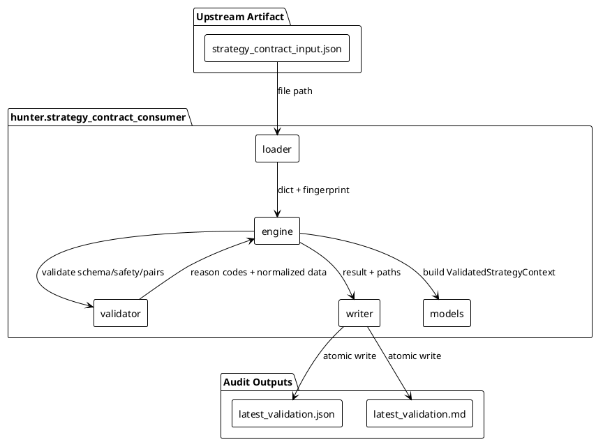
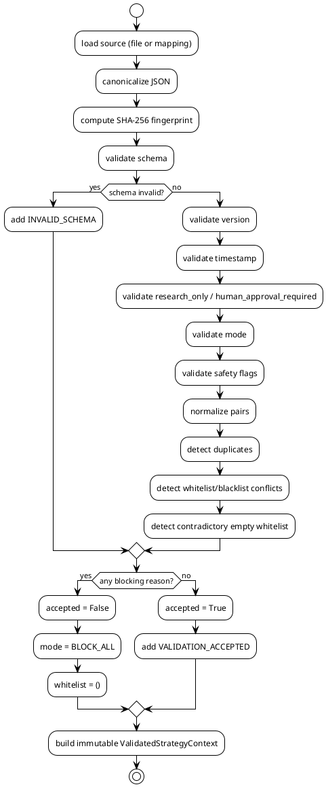

# SPEC-057 — Strategy Contract Consumption Adapter

## Background

`PROJECT.md` envisions Hunter Futures Pro as an agent-first crypto futures research and execution-control platform. Hunter Futures Pro is the decision layer; Freqtrade is only the execution layer. Every bridge between the decision layer and the execution layer must be deterministic, research-only, and fail-closed.

MVP-55 (`SPEC-056`) implemented the `freqtrade_universe_adapter`, which consumes a `ControlledUniverseExportResult` and emits a Freqtrade-compatible universe packet. One of the artifacts produced by that adapter is `strategy_contract_input.json`, a structured representation containing a whitelist, blacklist, mode, safety flags, and metadata. This representation is intended for human review before any strategy or execution context is built.

Currently, there is no deterministic, fail-closed consumer that reads `strategy_contract_input.json` and produces an immutable, auditable `ValidatedStrategyContext`. MVP-57 designs and implements a **Strategy Contract Consumption Adapter** that performs this validation while preserving the research-only, human-approval-required safety posture.

## Purpose

The Strategy Contract Consumption Adapter consumes `strategy_contract_input.json` and produces an immutable, research-only `ValidatedStrategyContext`.

The adapter is a pure, local, caller-triggered transformation. It does not start services, schedule jobs, read arbitrary files, connect to networks, exchanges, databases, or external services, and never emits trading or execution commands.

The adapter is **not** a trading signal, not a strategy selector, not a position-sizing tool, and not an execution approval system. It is a research-only validation layer that records whether a strategy-contract input is acceptable for downstream review, pending explicit human approval.

## Requirements

### Must Have

- Add a new package `hunter.strategy_contract_consumer` with the following public interface:
  - `STRATEGY_CONTRACT_CONSUMER_VERSION`
  - `StrategyContractConsumerConfig`
  - `StrategyContractConsumerError`
  - `ValidatedStrategyContext`
  - `load_strategy_contract_input(source, *, config=None)`
  - `validate_strategy_contract_input(source, config, *, validated_at)`
  - `build_validated_strategy_context(source, config, *, validated_at)`
  - `strategy_context_result_to_dict(result)`
  - `strategy_context_result_to_json_text(result, *, indent=2)`
  - `strategy_context_result_to_markdown_text(result)`
  - `write_strategy_context_validation_result(result, output_dir, config)`
- The adapter accepts both file-path (`str` or `pathlib.Path`) and in-memory (`Mapping[str, Any]`) inputs.
- The adapter performs deterministic validation of:
  - required fields and exact types;
  - supported version;
  - ISO-8601 `generated_at` timestamp;
  - staleness against a configured threshold;
  - future timestamp tolerance;
  - `research_only` flag (must be `True`);
  - `human_approval_required` flag (must be `True`);
  - mode (must be `LONG`, `SHORT`, or `BLOCK_ALL`);
  - safety flags (must not enable live trading, real orders, leverage, shorting, runtime, entries, or exits);
  - pair syntax and canonicalization to uppercase `BASE/QUOTE`;
  - duplicate pairs within the whitelist or blacklist;
  - whitelist/blacklist conflicts;
  - contradictory empty whitelist when mode is `LONG` or `SHORT`;
  - unknown top-level control fields.
- The adapter computes a deterministic SHA-256 fingerprint of the canonical source JSON.
- Every blocking result forces:
  - `accepted = False`
  - `mode = "BLOCK_ALL"`
  - `whitelist = ()`
- The result contains explicit safety flags:
  - `research_only: bool = True`
  - `human_approval_required: bool = True`
- The result contains deterministic reason codes:
  - `MISSING_INPUT`
  - `INPUT_READ_FAILED`
  - `INVALID_JSON`
  - `INVALID_SCHEMA`
  - `UNSUPPORTED_VERSION`
  - `INVALID_TIMESTAMP`
  - `STALE_INPUT`
  - `UNSAFE_RESEARCH_FLAG`
  - `MISSING_HUMAN_APPROVAL_FLAG`
  - `INVALID_MODE`
  - `INVALID_PAIR`
  - `DUPLICATE_PAIR`
  - `PAIR_LIST_CONFLICT`
  - `INVALID_SAFETY_FLAGS`
  - `CONTRADICTORY_INPUT`
  - `VALIDATION_ACCEPTED`
- The writer produces deterministic JSON and Markdown validation artifacts:
  - JSON: `data/strategy_contract_validation/latest_validation.json`
  - Markdown: `reports/strategy_contract_validation/latest_validation.md`
- All file writes are atomic via a temp file plus `os.replace`.
- The adapter does not import or call Freqtrade runtime, strategy, or configuration code.
- The adapter does not modify Freqtrade config files, strategy files, or any existing project config.
- The adapter does not read, traverse, or validate the contents of `data/` or `reports/` except through deterministic writer functions.

### Should Have

- Markdown output includes a clear safety notice that the artifacts are research-only and require human approval before any downstream use.
- Config allows overriding `json_filename`, `markdown_filename`, and staleness thresholds.

### Could Have

- Future MVPs may integrate the adapter into a scheduled or triggered workflow; this MVP does not.
- Future MVPs may add a diff between the current validated context and the previous one; this MVP does not.

### Will Not Have (Explicit)

- No Freqtrade runtime import or invocation.
- No Freqtrade strategy changes.
- No automatic Freqtrade config mutation.
- No copying artifacts into live Freqtrade directories.
- No exchange, API, network, database, scheduler, or live trading behavior.
- No actionable trading signals or order recommendations.
- No production-readiness, trading-readiness, approval, suitability, or certification claims.
- No MVP-57 implementation; this SPEC is for planning only.

## Method

The adapter follows a deterministic, fail-closed pipeline:

```text
load
  → canonicalize source
  → fingerprint
  → validate schema
  → validate safety flags
  → normalize pairs
  → detect duplicates and conflicts
  → apply fail-closed rules
  → build immutable ValidatedStrategyContext
```

### Input Schema

The consumed `strategy_contract_input.json` is a JSON object with the following fields:

| Field | Type | Required | Description |
|---|---|---|---|
| `version` | `str` | yes | Input version. Must be in the supported set. |
| `generated_at` | `str` | yes | ISO-8601 timestamp when the input was produced. |
| `research_only` | `bool` | yes | Must be `True`. |
| `human_approval_required` | `bool` | yes | Must be `True`. |
| `mode` | `str` | yes | One of `LONG`, `SHORT`, `BLOCK_ALL`. |
| `whitelist` | `list[str]` | yes | Pairs approved for research. |
| `blacklist` | `list[str]` | yes | Pairs blocked or excluded. |
| `safety_flags` | `dict[str, bool]` | yes | Safety flags. Unsafe flags must be `False`. |
| `metadata` | `dict[str, str]` | no | Caller-supplied metadata. |

Unknown top-level fields cause `INVALID_SCHEMA`.

### Pair Normalization

- Each pair string is trimmed.
- It is parsed as `BASE/QUOTE` or `BASE_QUOTE`.
- It is canonicalized to uppercase `BASE/QUOTE`.
- If a pair cannot be parsed, it is rejected with `INVALID_PAIR`.

### Duplicate and Conflict Handling

- Duplicate pairs within the whitelist are detected before deduplication and emit `DUPLICATE_PAIR`.
- Duplicate pairs within the blacklist are detected before deduplication and emit `DUPLICATE_PAIR`.
- Any pair present in both whitelist and blacklist emits `PAIR_LIST_CONFLICT`. The pair is removed from the whitelist and kept in the blacklist.
- A non-empty `LONG` or `SHORT` mode with an empty whitelist emits `CONTRADICTORY_INPUT`.

### Fingerprint

The SHA-256 fingerprint is computed from the canonical JSON representation of the input: JSON dumped with sorted keys, no indentation, and no extra whitespace, using UTF-8 encoding. This makes the fingerprint deterministic for identical inputs regardless of key order or formatting.

### Fail-Closed Rules

Any missing, malformed, stale, future, unsafe, unsupported, contradictory, or conflicted input produces:

- `accepted = False`
- `mode = "BLOCK_ALL"`
- `whitelist = ()`
- the blacklist is still normalized and emitted for auditability.

### Determinism

- Reason codes are sorted lexicographically.
- Pair lists are sorted lexicographically.
- Safety flags are sorted by key.
- JSON output is sorted by key.

## Implementation

### Package Structure

```text
src/hunter/strategy_contract_consumer/
├── __init__.py
├── models.py
├── loader.py
├── validator.py
├── engine.py
└── writer.py
```

### Model Definitions

#### `StrategyContractConsumerConfig` (frozen dataclass)

| Field | Type | Default | Description |
|---|---|---|---|
| `output_dir` | `str` | `"data/strategy_contract_validation"` | Base directory for JSON artifacts. |
| `markdown_output_dir` | `str` | `"reports/strategy_contract_validation"` | Base directory for Markdown artifacts. |
| `json_filename` | `str` | `"latest_validation.json"` | Filename for the JSON artifact. |
| `markdown_filename` | `str` | `"latest_validation.md"` | Filename for the Markdown artifact. |
| `supported_versions` | `frozenset[str]` | `{"0.56.0-dev"}` | Accepted input versions. |
| `stale_input_threshold_seconds` | `int` | `300` | Maximum age of `generated_at` before `STALE_INPUT`. |
| `future_input_tolerance_seconds` | `int` | `60` | Maximum future drift of `generated_at` before `INVALID_TIMESTAMP`. |
| `metadata` | `Mapping[str, str]` | `{}` | Optional caller-supplied metadata. |

Validation rules:

- `output_dir`, `markdown_output_dir`, `json_filename`, and `markdown_filename` must be non-empty strings.
- `supported_versions` must be a non-empty set of non-empty strings.
- `stale_input_threshold_seconds` and `future_input_tolerance_seconds` must be non-negative integers.

#### `ValidatedStrategyContext` (frozen dataclass)

| Field | Type | Description |
|---|---|---|
| `accepted` | `bool` | Whether the input passed validation. |
| `validated_at` | `datetime` | Time of validation (timezone-aware). |
| `source_fingerprint` | `str` | SHA-256 hex of canonical source JSON. |
| `source_path` | `str` | `"<mapping>"` for in-memory input, or the file path. |
| `input_version` | `str` | The input version, or `""` if unknown. |
| `mode` | `str` | One of `LONG`, `SHORT`, `BLOCK_ALL`. |
| `whitelist` | `tuple[str, ...]` | Sorted, normalized pairs. |
| `blacklist` | `tuple[str, ...]` | Sorted, normalized pairs. |
| `safety_flags` | `dict[str, bool]` | Normalized safety flags. |
| `reason_codes` | `tuple[str, ...]` | Sorted reason codes. |
| `version` | `str` | Adapter version, defaults to `STRATEGY_CONTRACT_CONSUMER_VERSION`. |
| `research_only` | `bool` | Always `True`. |
| `human_approval_required` | `bool` | Always `True`. |
| `metadata` | `Mapping[str, str]` | Caller-supplied and input metadata. |

Validation rules:

- `validated_at` must be a timezone-aware datetime.
- `research_only` and `human_approval_required` must be `True`.
- `reason_codes` must be a subset of `STRATEGY_CONTRACT_CONSUMER_REASON_CODES`.
- If `accepted` is `False`, `mode` must be `BLOCK_ALL` and `whitelist` must be empty.

#### `StrategyContractConsumerError`

Exception raised for invalid configuration, invalid loader results, or writer failures. Must not be raised for normal fail-closed states, which are encoded in the result reason codes. The exception may carry a `reason_code` attribute.

### Public API

The adapter must expose the following public symbols via `hunter.strategy_contract_consumer`:

- `STRATEGY_CONTRACT_CONSUMER_VERSION: str = "0.56.0-dev"`
- All reason-code constants listed above.
- `STRATEGY_CONTRACT_CONSUMER_REASON_CODES: frozenset[str]`
- `StrategyContractConsumerConfig`
- `ValidatedStrategyContext`
- `StrategyContractConsumerError`
- `load_strategy_contract_input(...)`
- `validate_strategy_contract_input(...)`
- `build_validated_strategy_context(...)`
- `strategy_context_result_to_dict(...)`
- `strategy_context_result_to_json_text(...)`
- `strategy_context_result_to_markdown_text(...)`
- `write_strategy_context_validation_result(...)`

### PlantUML Architecture



### Validation Pipeline



## Deterministic Artifact Schemas

### JSON Artifact (`latest_validation.json`)

```json
{
  "kind": "strategy_contract_validation",
  "version": "0.56.0-dev",
  "safety_notice": "This output is a human-audit / research-only artifact...",
  "accepted": true,
  "validated_at": "2026-07-13T12:00:00+00:00",
  "source_fingerprint": "a1b2c3d4...",
  "source_path": "data/freqtrade_universe_adapter/strategy_contract_input.json",
  "input_version": "0.56.0-dev",
  "mode": "LONG",
  "research_only": true,
  "human_approval_required": true,
  "whitelist": ["BTC/USDT", "ETH/USDT"],
  "blacklist": ["DOGE/USDT"],
  "safety_flags": {
    "dry_run": true,
    "live_trading_enabled": false,
    "real_orders_enabled": false,
    "leverage_enabled": false,
    "shorting_enabled": false,
    "strategy_runtime_allowed": false,
    "entry_signals_allowed": false,
    "exit_signals_allowed": false
  },
  "reason_codes": ["VALIDATION_ACCEPTED"],
  "metadata": {}
}
```

### Markdown Artifact (`latest_validation.md`)

- Header with adapter kind and version.
- Safety notice block.
- Summary: accepted, validated_at, source_fingerprint, source_path, mode, whitelist count, blacklist count.
- Whitelist and blacklist sections.
- Safety flags section.
- Reason codes section.
- Metadata section.
- Artifact paths section.

## Test Strategy

### Model Tests

- `StrategyContractConsumerConfig` validation: required fields, defaults, invalid values.
- `ValidatedStrategyContext` validation: required fields, frozen behavior, accepted/rejected invariants, safety flags, reason codes.
- `STRATEGY_CONTRACT_CONSUMER_REASON_CODES` completeness.

### Loader Tests

- `None` input returns `None` (engine handles `MISSING_INPUT`).
- `Path` input reads and parses UTF-8 JSON.
- Mapping input returns a deep copy.
- Missing path raises `StrategyContractConsumerError` with `INPUT_READ_FAILED`.
- Invalid JSON raises `StrategyContractConsumerError` with `INVALID_JSON`.
- Non-object top-level JSON raises `StrategyContractConsumerError` with `INVALID_SCHEMA`.
- Defensive copy: mutating the returned dict after loading a mapping does not affect the source.

### Validator Tests

- Required fields and exact types.
- Supported version.
- ISO-8601 timestamp parsing.
- Stale threshold.
- Future timestamp tolerance.
- `research_only` flag enforcement.
- `human_approval_required` flag enforcement.
- Mode validation (`LONG`, `SHORT`, `BLOCK_ALL`).
- Pair syntax and canonicalization.
- Duplicate detection.
- Whitelist/blacklist conflict.
- Contradictory empty whitelist.
- Unknown top-level fields.
- Deterministic reason-code order.

### Engine Tests

- Accepted input returns `accepted=True` with `VALIDATION_ACCEPTED`.
- Missing input returns `accepted=False`, `mode=BLOCK_ALL`, empty whitelist, and `MISSING_INPUT`.
- Malformed input returns `INVALID_JSON` or `INVALID_SCHEMA`.
- Unsupported version returns `UNSUPPORTED_VERSION`.
- Stale input returns `STALE_INPUT`.
- Future timestamp returns `INVALID_TIMESTAMP`.
- Unsafe `research_only=False` returns `UNSAFE_RESEARCH_FLAG`.
- Missing human approval flag returns `MISSING_HUMAN_APPROVAL_FLAG`.
- Invalid mode returns `INVALID_MODE`.
- Invalid pair returns `INVALID_PAIR`.
- Duplicate pair returns `DUPLICATE_PAIR`.
- Pair conflict returns `PAIR_LIST_CONFLICT`.
- Contradictory input returns `CONTRADICTORY_INPUT`.
- `BLOCK_ALL` mode with non-empty whitelist emits `CONTRADICTORY_INPUT` (mode says block but whitelist present).
- Path/mapping parity.
- Deterministic result equality.
- Fingerprint consistency.

### Writer Tests

- `strategy_context_result_to_dict` returns a JSON-safe, deterministic dict with sorted keys.
- `strategy_context_result_to_json_text` returns valid JSON.
- `strategy_context_result_to_markdown_text` contains the safety notice and artifact paths.
- Atomic writers use temp-file + `os.replace` and do not leave partial files on failure.
- `write_strategy_context_validation_result` writes both JSON and Markdown artifacts.
- Filenames and paths are configurable via the config.
- Repeated writes overwrite deterministically.
- Temp files are cleaned up after a failed write.
- Prohibited wording (e.g., "live trading", "execution ready", "approval to trade") does not appear in output.

### Integration Tests

- Full mapping flow: mapping → load → validate → engine → writer → verify both artifacts.
- Full file flow: file → load → validate → engine → writer → verify both artifacts.
- Path/mapping parity.
- Deterministic builds and writes.
- Accepted and fail-closed cases.
- Public API completeness.
- No `freqtrade.*` runtime imports anywhere in the package.
- No file reads occur in the validator or engine (only the loader reads files).
- No runtime/config mutation.
- Fingerprint consistency.
- JSON parseability.
- Markdown safety notice and artifact paths.

## Implementation Steps and Milestones

### Step 1 — Models and Public API

- Create `src/hunter/strategy_contract_consumer/models.py`.
  - Define `STRATEGY_CONTRACT_CONSUMER_VERSION`.
  - Define reason codes and `STRATEGY_CONTRACT_CONSUMER_REASON_CODES` frozenset.
  - Define `StrategyContractConsumerConfig` frozen dataclass with validation.
  - Define `ValidatedStrategyContext` frozen dataclass with validation.
  - Define `StrategyContractConsumerError` exception.
- Create `src/hunter/strategy_contract_consumer/__init__.py` with public API exports.
  - Public functions are importable but raise `NotImplementedError` until their steps are implemented.
- Create `tests/test_strategy_contract_consumer/__init__.py`.
- Create `tests/test_strategy_contract_consumer/test_models.py`.

### Step 2 — Loader

- Create `src/hunter/strategy_contract_consumer/loader.py`.
  - Implement `load_strategy_contract_input` with `None`, `Path`, and mapping support.
- Create `tests/test_strategy_contract_consumer/test_loader.py`.

### Step 3 — Validator and Normalization

- Create `src/hunter/strategy_contract_consumer/validator.py`.
  - Implement pure validation and normalization.
- Create `tests/test_strategy_contract_consumer/test_validator.py`.

### Step 4 — Context Engine

- Create `src/hunter/strategy_contract_consumer/engine.py`.
  - Implement `build_validated_strategy_context` and `validate_strategy_contract_input`.
- Create `tests/test_strategy_contract_consumer/test_engine.py`.

### Step 5 — Audit Writer

- Create `src/hunter/strategy_contract_consumer/writer.py`.
  - Implement dict, JSON, and Markdown serializers.
  - Implement atomic JSON and Markdown writers.
  - Implement `write_strategy_context_validation_result`.
- Update `__init__.py` with writer exports.
- Create `tests/test_strategy_contract_consumer/test_writer.py`.

### Step 6 — Integration Tests and Public API Review

- Create `tests/test_strategy_contract_consumer/test_integration.py`.
- Review `__init__.py` and export only approved public symbols.
- Run focused tests and full suite.

### Step 7 — Finalization

- Verify `STRATEGY_CONTRACT_CONSUMER_VERSION` is `0.56.0-dev`.
- Bump `VERSION`, `pyproject.toml`, and `src/hunter/__init__.py` to `0.56.0-dev`.
- Update `CHANGELOG.md`, `docs/MVP_INDEX.md`, `docs/handoff/CURRENT_STATE.md`, `AGENTS.md`, `tasks/active.md`, and `tasks/agent-log.md`.
- Apply local tag `v0.56.0-dev` (no push).

### Step 8 — Post-Tag Context Sync

- Record the tagged state in the memory files.
- Do not move the tag.

## Task Graph

```
Step 1: Models + Public API
    |
    v
Step 2: Loader
    |
    v
Step 3: Validator + Normalization
    |
    v
Step 4: Context Engine
    |
    v
Step 5: Audit Writer
    |
    v
Step 6: Integration Tests + API Review
    |
    v
Step 7: Finalization
    |
    v
Step 8: Post-Tag Context Sync
```

Each step depends on the previous one. No step may be skipped. Implementation is deferred until after human approval of this SPEC.

## Non-Goals

- This MVP does not validate the selected universe with historical backtests.
- This MVP does not produce a Freqtrade-ready strategy or live trading configuration.
- This MVP does not modify the behavior of existing engines; it only consumes their outputs.
- This MVP does not introduce a scheduler, daemon, server, REST API, or database.
- This MVP does not claim production readiness, trading readiness, or suitability for any execution purpose.
- This MVP does not read from `data/` or `reports/` except through the writer modules during file writes.
- This MVP does not create a second or alternate specification; implementation follows this SPEC.
- This MVP does not stage, commit, tag, push, or configure remotes.

## Safety and Boundaries

- **No Freqtrade runtime integration:** The adapter does not import or call Freqtrade runtime, strategy, or configuration code.
- **No automatic config mutation:** The adapter writes local artifacts; it does not modify Freqtrade config files, strategy files, or any existing project config.
- **No exchange or network access:** The adapter does not call networks, APIs, exchanges, or external services.
- **No API, server, database, scheduler, or live trading behavior:** The adapter is a single-call local function. No background services, servers, daemons, schedulers, or trading execution are started or invoked.
- **No actionable trading signals:** The output is a research-only validation packet with explicit safety flags. It is not an order, signal, or execution instruction.
- **No readiness/approval/suitability claims:** All outputs are labeled as research-only and requiring human approval.
- **No data/ or reports/ inspection:** The adapter never reads, traverses, or validates the contents of `data/` or `reports/`. It only writes artifacts through deterministic writer functions.
- **No implementation yet:** This SPEC is for planning only. Implementation begins after human approval.
- **No staging, commit, tag, push, or remote configuration:** This SPEC does not trigger any source-control or deployment operations.

## Version

Target: `0.56.0-dev`

`STRATEGY_CONTRACT_CONSUMER_VERSION`: `0.56.0-dev`

## Gathering Results

After implementation, the following artifacts must be present and validated:

- `src/hunter/strategy_contract_consumer/__init__.py`
- `src/hunter/strategy_contract_consumer/models.py`
- `src/hunter/strategy_contract_consumer/loader.py`
- `src/hunter/strategy_contract_consumer/validator.py`
- `src/hunter/strategy_contract_consumer/engine.py`
- `src/hunter/strategy_contract_consumer/writer.py`
- `tests/test_strategy_contract_consumer/__init__.py`
- `tests/test_strategy_contract_consumer/test_models.py`
- `tests/test_strategy_contract_consumer/test_loader.py`
- `tests/test_strategy_contract_consumer/test_validator.py`
- `tests/test_strategy_contract_consumer/test_engine.py`
- `tests/test_strategy_contract_consumer/test_writer.py`
- `tests/test_strategy_contract_consumer/test_integration.py`
- `specs/SPEC-057-Strategy-Contract-Consumption-Adapter.md`
- Updated version and documentation files.
- Local tag `v0.56.0-dev`.

## Professional Help

This project is not financial advice. If you are unsure about the implications of any design or implementation decision, consult a qualified professional.
