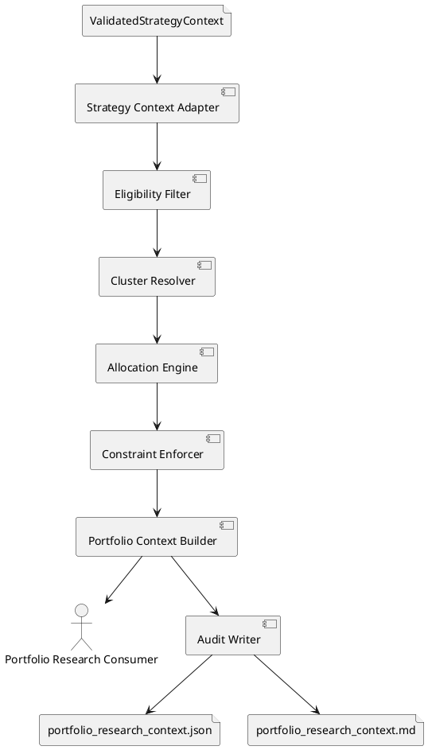

# SPEC-058-Portfolio-Construction-Research-Adapter

## Background

MVP-56, `strategy_contract_input.json` girdisini doğrulayarak immutable ve fail-closed bir `ValidatedStrategyContext` üretti. Ancak bu context henüz portfolio araştırma katmanının doğrudan kullanabileceği ağırlık, coin sayısı, exposure ve cluster sınırlarını içermiyor.

MVP-57, doğrulanmış strategy context’i tüketip deterministik bir `PortfolioResearchContext` üretecek.

Bu katman:
- Yalnız `accepted=true` olan strategy context’leri kabul edecek.
- Unsafe, stale, eksik veya çelişkili girdilerde boş portfolio üretecek.
- Maksimum coin sayısı, coin başına ağırlık, toplam exposure ve cluster limitlerini uygulayacak.
- Aynı input ve config için aynı portfolio dağılımını üretecek.
- JSON ve Markdown audit artifact’leri yazabilecek.
- Emir, pozisyon, leverage, sinyal veya canlı işlem davranışı üretmeyecek.
- Gerçek Freqtrade runtime importu veya config mutasyonu yapmayacak.

```text
ValidatedStrategyContext
        ↓
Portfolio Construction Research Adapter
        ↓
PortfolioResearchContext
        ↓
Portfolio Optimization / Research Components
```

MVP-57 yalnız deterministik rule-based portfolio allocation yapacaktır. Optimizer, covariance matrix ve geçmiş fiyat verisi sonraki MVP’lere bırakılır.

## Requirements

### Must Have

- Yalnız `ValidatedStrategyContext.accepted=true` girdilerini kabul etmeli.
- `mode=BLOCK_ALL` veya boş whitelist durumunda boş portfolio üretmeli.
- Whitelist içindeki coin’ler için deterministik ağırlık üretmeli.
- Maksimum coin sayısı uygulanmalı.
- Coin başına minimum ve maksimum ağırlık sınırı uygulanmalı.
- Toplam portfolio ağırlığı yapılandırılabilir exposure limitini aşmamalı.
- Aynı cluster içindeki coin’ler için cluster exposure limiti uygulanmalı.
- Ağırlıklar deterministik biçimde normalize edilmeli.
- Eksik cluster bilgisi için açık ve deterministik fallback davranışı olmalı.
- Unsafe, eksik veya çelişkili input fail-closed sonuç üretmeli.
- Immutable `PortfolioResearchContext` üretmeli.
- Deterministik JSON ve Markdown audit artifact’leri yazabilmeli.
- Gerçek Freqtrade importu, runtime bağlantısı veya config mutasyonu yapmamalı.
- Emir, pozisyon, leverage, entry, exit, signal veya canlı işlem davranışı üretmemeli.

### Should Have

- Equal-weight allocation varsayılan yöntem olmalı.
- İsteğe bağlı per-coin score desteği bulunmalı.
- Score mevcutsa ağırlıklar score-proportional üretilebilmeli.
- Minimum ağırlık altındaki coin’ler deterministik biçimde elenmeli.
- Limit uygulaması sonrası kalan ağırlık yeniden normalize edilmeli.
- Her coin için allocation reason ve exclusion reason tutulmalı.
- Kaynak strategy context fingerprint’i korunmalı.
- Config ve input için deterministik fingerprint üretilebilmeli.

### Could Have

- Sector, category veya liquidity bucket limitleri.
- Turnover limiti.
- Önceki portfolio ile diff özeti.
- Risk-budget allocation.
- Covariance-aware optimization.
- Batch portfolio üretimi.

### Won’t Have

- Fiyat geçmişi okuma
- Covariance matrix
- Mean-variance optimizer
- Volatility targeting
- Backtest
- Order sizing
- Exchange precision
- Leverage
- Freqtrade strategy veya config üretimi
- Network, database veya scheduler
- Canlı işlem

### Default Configuration

- `allocation_method = EQUAL_WEIGHT`
- `max_assets = 10`
- `max_asset_weight = 0.20`
- `max_total_exposure = 1.00`
- `max_cluster_exposure = 0.40`
- Eksik cluster → `UNCLASSIFIED`

## Method

### Architecture



### Package Layout

```text
src/hunter/portfolio_research_adapter/
├── __init__.py
├── models.py
├── validator.py
├── allocator.py
├── engine.py
└── writer.py
```

```text
tests/test_portfolio_research_adapter/
├── __init__.py
├── test_models.py
├── test_validator.py
├── test_allocator.py
├── test_engine.py
├── test_writer.py
└── test_integration.py
```

### Core Models

```python
@dataclass(frozen=True)
class PortfolioResearchConfig:
    allocation_method: Literal["EQUAL_WEIGHT", "SCORE_PROPORTIONAL"]
    max_assets: int
    min_asset_weight: Decimal
    max_asset_weight: Decimal
    max_total_exposure: Decimal
    max_cluster_exposure: Decimal
    output_dir: Path
    report_output_dir: Path
    json_filename: str
    markdown_filename: str
```

```python
@dataclass(frozen=True)
class PortfolioAllocation:
    pair: str
    weight: Decimal
    cluster: str
    score: Decimal | None
    allocation_reason: str
```

```python
@dataclass(frozen=True)
class PortfolioExclusion:
    pair: str
    reason_code: str
    details: str
```

```python
@dataclass(frozen=True)
class PortfolioResearchContext:
    version: str
    source_context_fingerprint: str
    portfolio_fingerprint: str
    generated_at: datetime
    mode: Literal["LONG", "SHORT", "BLOCK_ALL"]
    allocation_method: Literal["EQUAL_WEIGHT", "SCORE_PROPORTIONAL"]
    allocations: tuple[PortfolioAllocation, ...]
    exclusions: tuple[PortfolioExclusion, ...]
    cluster_exposure: Mapping[str, Decimal]
    total_exposure: Decimal
    accepted: bool
    research_only: bool
    human_approval_required: bool
    reason_codes: tuple[str, ...]
    metadata: Mapping[str, object]
```

Tüm public modeller immutable olacaktır. Ağırlık hesaplamalarında `Decimal` kullanılacak; binary floating-point kullanılmayacaktır.

### Input Contract

```python
build_portfolio_research_context(
    strategy_context: ValidatedStrategyContext | None,
    config: PortfolioResearchConfig,
    *,
    cluster_by_pair: Mapping[str, str] | None = None,
    score_by_pair: Mapping[str, Decimal] | None = None,
    generated_at: datetime,
) -> PortfolioResearchContext
```

Kurallar:
- `strategy_context=None` → fail-closed
- `accepted=False` → fail-closed
- `mode=BLOCK_ALL` → boş portfolio
- boş whitelist → boş portfolio
- blacklist içindeki pair allocation alamaz
- caller mapping’leri mutate edilmez
- engine dosya okumaz

### Candidate Selection

Equal Weight:

```text
sort candidates lexicographically
take first max_assets
```

Score Proportional:

```text
sort by:
1. score descending
2. pair ascending
take first max_assets
```

Geçersiz, eksik veya negatif score `SCORE_PROPORTIONAL` modunda exclusion üretir. Tüm score’lar geçersizse portfolio fail-closed olur.

### Equal-Weight Algorithm

```python
raw_weight = max_total_exposure / selected_asset_count
weight = min(raw_weight, max_asset_weight)
```

`weight < min_asset_weight` olan coin elenir. Kalan exposure deterministik biçimde yeniden dağıtılır; hiçbir coin `max_asset_weight` sınırını aşamaz.

### Score-Proportional Algorithm

```python
score_sum = sum(score_by_pair[pair] for pair in selected_pairs)

raw_weight[pair] = (
    score_by_pair[pair] / score_sum
) * max_total_exposure
```

Ardından max cap, min filtresi, deterministik yeniden dağıtım, cluster limitleri ve total exposure doğrulaması uygulanır.

### Cluster Resolution

```python
cluster = cluster_by_pair.get(pair, "UNCLASSIFIED")
```

Normalization:
- whitespace trim
- boş değer → `UNCLASSIFIED`
- uppercase canonical cluster
- mapping içinde olmayan pair → `UNCLASSIFIED`

### Cluster Exposure Enforcement

```python
cluster_total = sum(
    allocation.weight
    for allocation in allocations
    if allocation.cluster == cluster
)
```

Aşım varsa:

```python
scale = max_cluster_exposure / cluster_total
```

Cluster içindeki ağırlıklar aynı oranla küçültülür. Kalan exposure başka cluster’lara aktarılmaz.

### Decimal Precision

```python
WEIGHT_QUANTUM = Decimal("0.00000001")
```

Rounding: `ROUND_DOWN`.

### Fail-Closed Rules

Her blocking durumda:

```text
accepted = false
mode = BLOCK_ALL
allocations = ()
total_exposure = 0
```

### Reason Codes

```text
MISSING_CONTEXT
REJECTED_CONTEXT
BLOCK_ALL_CONTEXT
EMPTY_WHITELIST
INVALID_CONFIG
INVALID_PAIR
BLACKLISTED_PAIR
MISSING_SCORE
INVALID_SCORE
BELOW_MIN_WEIGHT
MAX_ASSETS_EXCEEDED
CLUSTER_LIMIT_APPLIED
EMPTY_PORTFOLIO
CONTRADICTORY_CONTEXT
PORTFOLIO_ACCEPTED
```

### Portfolio Fingerprint

Canonical payload, config ve allocations alanlarını deterministik JSON olarak serialize edip SHA-256 `hexdigest()` üretmelidir.

### Audit Artifacts

```text
data/portfolio_research/latest_portfolio.json
reports/portfolio_research/latest_portfolio.md
```

Artifact içerikleri:
- source context fingerprint
- portfolio fingerprint
- allocation method
- mode
- accepted status
- total exposure
- allocations
- exclusions
- cluster exposure
- active limits
- reason codes
- research-only notice
- human-approval requirement
- artifact paths

### Determinism

Aynı strategy context, config, cluster mapping, score mapping ve injected `generated_at` için model, allocation sırası, Decimal ağırlıklar, reason-code sırası, fingerprint, JSON ve Markdown byte-level aynı olmalıdır.

## Implementation

### Step 1 — SPEC-058 and Foundation

Create:
- `specs/SPEC-058-Portfolio-Construction-Research-Adapter.md`
- package/test skeleton
- version constant
- reason-code constants
- frozen dataclasses
- config validation
- immutable metadata/mapping behavior
- public API scaffold

### Step 2 — Input Validation

Implement pure validators for:
- context presence
- accepted/research-only/human-approval invariants
- supported mode
- whitelist/blacklist consistency
- config limits
- cluster mapping
- score mapping

No file reads, writes, or hidden clock reads.

### Step 3 — Allocation Algorithms

Implement:
- `allocate_equal_weight`
- `allocate_score_proportional`
- `apply_asset_limits`
- `apply_cluster_limits`
- `quantize_allocations`

Use `Decimal`, `ROUND_DOWN`, fixed quantum, deterministic tie-breaking, and explicit exclusions.

### Step 4 — Portfolio Context Engine

Implement `build_portfolio_research_context` with the approved pipeline and fail-closed invariants.

### Step 5 — Audit Writer

Implement deterministic dict/JSON/Markdown serialization and atomic writes.

### Step 6 — Integration Tests

Cover equal-weight, score-proportional, rejected/blocked/empty contexts, blacklist exclusion, max assets, min/max weight, cluster cap, `UNCLASSIFIED`, invalid/missing scores, determinism, precision, public API, no Freqtrade imports, no runtime mutation, and no file reads in engine/allocator.

### Step 7 — Finalization

- project version → `0.57.0-dev`
- docs/memory updates
- focused/full tests
- separate stage commits
- local annotated tag `v0.57.0-dev`
- annotation:
  `MVP-57 Portfolio Construction Research Adapter v0.57.0-dev`
- post-tag context-sync commit
- no push

## Milestones

1. SPEC and foundation
2. Validation
3. Allocation algorithms
4. Portfolio context engine
5. Audit artifacts
6. Integration
7. Finalization and local tag

## Gathering Results

Success requires:
- accepted context produces accepted portfolio
- blocked/rejected/missing/empty input produces empty portfolio
- all asset, total and cluster limits remain respected
- blacklisted pairs never receive allocation
- missing cluster uses `UNCLASSIFIED`
- invalid/missing score produces deterministic exclusions
- identical input/config/mappings/time produce identical fingerprints and artifacts
- no Freqtrade/runtime behavior
- no config/caller mutation
- focused/full tests pass
- no blocking input produces accepted portfolio
